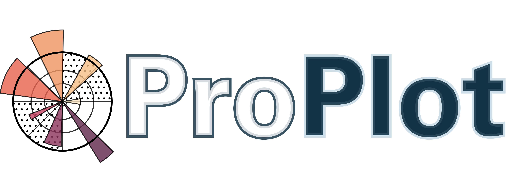

.. class:: center

|build-status| |coverage| |license|

An easy-to-use `matplotlib <https://matplotlib.org/>`__ wrapper
that can help you make beautiful, publication-quality graphics.

Installation
------------

This package is a work-in-progress. Currently there is no formal release
on PyPi (coming soon!). However, feel free to install directly from Github using:

::

   pip install git+https://github.com/lukelbd/proplot.git#egg=proplot

The dependencies are `matplotlib <https://matplotlib.org/>`_ and `numpy <http://www.numpy.org/>`_.  The optional geographic mapping features require `cartopy <https://scitools.org.uk/cartopy/docs/latest/>`_ and/or `basemap <https://matplotlib.org/basemap/index.html>`_.

Importing
---------
I recommend importing with

.. code-block:: python

   import proplot as plot

to differentiate ProPlot from the usual "``plt``" abbreviation used for the ``pyplot`` module.

Documentation
-------------
The documentation is `published here <https://lukelbd.github.io/proplot>`_.

Overview
--------

Importing ProPlot registers a bunch of new colormaps and color names.
If this is all you want and you don't care about other features, simply
import ProPlot at the top of your script. See the documentation for details.

Most of ProPlot's features derive from the ``subplots`` command, inspired
by the pyplot command of the same name.
This generates a scaffolding of specially subclassed axes, and has a bunch of other useful features.

The next most important utility is the ``format`` method, available on every axes generated by ``subplots``. Use this method to fine-tune your axis properties, titles, labels, limits, and much more.

Here are some highlights of the remaining features:

*  Specify figure, axes, panel, etc. sizes with arbitrary physical units --
   not just inches or "relative" units.
*  A smarter "tight layout" feature. Figure width or height alternately
   scales so that subplot aspect ratios are fixed, inner space
   between subplots automatically scaled so subplot tick labels, etc. do
   not overlap with each other.
*  Axes panels and figure panels, for global colorbars, global legends,
   or tertiary data. Panel widths always held fixed during "tight layout"
   scaling.
*  Automatic axes, colorbar, and legend formatting when
   ``xarray.DataArray``, ``pandas.DataFrame``, or ``pandas.Series`` objects are passed
   to a plotting command, just like their respective ``plot`` methods.
*  Easy setting customization with a user ``.proplotrc`` file. Option
   to save custom colormaps, and they will be loaded every time on startup.
*  Perceptually distinct named colors with easy-to-remember names,
   a ton of beautiful new colormaps, new property cycle colors.
*  Tools for merging existing colormaps and making new "perceptually
   uniform" colormaps on-the-fly. Tools for slicing and modifying existing
   colormaps.
*  Making colorbars from lists of lines
   or colors. Making axes "inset" colorbars. Making legends with centered
   rows instead of aligned columns.
*  Integration with basemap and cartopy. Generate arbitrary
   grids of arbitrary map projections in one go. Switch between the cartopy and
   basemap backends painlessly. Use the axes methods directly for basemap
   plotting, instead of the ``Basemap`` object.
*  Add geographic features with the ``format`` command.
   Customize geographic gridlines and gridline labels.

Why not add to matplotlib directly?
-----------------------------------
This project can be thought of as "matplotlib for power users."
Many of its features represent an alternative to the existing matplotlib API -- and
following `TOOWTDI <https://wiki.python.org/moin/TOOWTDI>`__ philosophy,
they should perhaps remain here as a side project. For example: the ``format`` and ``format_partial`` methods, which are meant to replace existing axes and axis methods.

.. Some features could be relatively esoteric for the average user (for example,
   "perceptually uniform" colormaps), or could be seen as "convenience features" that perhaps do not belong with the core API for the sake of minimalism (for example, direct integration
   with cartographic toolkits).

There are also some philosophical differences and more direct conflicts.
ProPlot enforces **static** figure scaffoldings, while matplotlib encourages
successively adding axes to an existing figure instance.
The "smart tight layout" feature conflicts directly with
matplotlib's `tight layout <https://matplotlib.org/tutorials/intermediate/tight_layout_guide.html>`__, with more options and the ability
to preserve axes aspect ratios by sacrificing fixed figure dimensions.
And much of ``subplots`` could be seen as a more flexible alternative to
the `axes_grid1 <https://matplotlib.org/mpl_toolkits/axes_grid1/index.html>`__ toolkit.

Despite all this, if there are any matplotlib developers out there that think
some ProPlot features could be added to matplotlib directly, please contact me!

What about other matplotlib wrappers?
-------------------------------------

There is already a great matplotlib wrapper called
`seaborn <https://seaborn.pydata.org/>`__, and convenience plotting tools offered by `pandas <https://pandas.pydata.org/pandas-docs/stable/reference/api/pandas.DataFrame.plot.html>`__ and `xarray <http://xarray.pydata.org/en/stable/plotting.html>`__. What makes this project
different?

While parts of ProPlot were inspired by these wrappers, the goals
are largely different. Seaborn, pandas, and xarray introduce new functions for
generating useful visualizations *quickly*, and they require your data to be stored in special objects (``pandas.DataFrame`` and ``xarray.DataArray``) to be effective.
ProPlot includes this automation as an option and gives you nice-looking plots out of the box -- but critically, it also permits the user to build
*highly customized plots and complex grids of subplots*, and allows users to work painlessly with geographic data.
While existing projects exist as separate toolsets on top of matplotlib, ProPlot is built right into the matplotlib API, thanks to special subclasses of the native matplotlib ``Figure`` and ``Axes`` classes.

In summary, this project is intended to unify the convenience of seaborn, pandas, and xarray plotting with the power and customizability of the underlying matplotlib API.

Contributions
-------------
This entire package has so far been written by just `me <https://github.com/lukelbd>`__ -- but I have a day job as a graduate student. If you have any ideas for new features or come across any bugs, I'd love to receive a pull request!

Shout out to `bradyrx <https://github.com/bradyrx>`__ for being the
guinea pig and helping me fix a lot of initial bugs. If your field is
atmospheric science, check out his awesome
`decadal climate prediction package <https://github.com/bradyrx/climpred>`_.

Donations
---------

At well over 10,000 lines of code, this package took a huge amount of time to write and document. If ProPlot has been useful for you, consider sending me a small donation.

.. image:: https://www.paypalobjects.com/en_US/i/btn/btn_donateCC_LG.gif
   :target: https://www.paypal.com/cgi-bin/webscr?cmd=_s-xclick&hosted_button_id=5SP6S8RZCYMQA&source=url

.. Links and badges

.. |build-status| image:: https://img.shields.io/travis/lukelbd/proplot.svg?style=flat
    :alt: build status
    :target: https://travis-ci.org/lukelbd/proplot

.. |coverage| image:: https://codecov.io/gh/lukelbd/proplot.org/branch/master/graph/badge.svg
    :alt: coverage
    :target: https://codecov.io/gh/lukelbd/proplot.org

.. |license| image:: https://img.shields.io/github/license/lukelbd/proplot.svg
   :alt: license
   :target: LICENSE.txt

..
.. |pypi| image:: http://img.shields.io/pypi/v/proplot.svg?text=version
    :target: https://pypi.org/project/proplot/
    :alt: Latest release
..
.. |docs| image:: https://readthedocs.org/projects/proplot/badge/?version=latest
    :alt: docs
    :target: https://proplot.readthedocs.io/en/latest/?badge=latest

..
.. |contributions| image:: https://img.shields.io/badge/contributions-welcome-brightgreen.svg?style=flat
   :alt: contributions
   :target: https://github.com/lukelbd/issues

..
.. |issues| image:: https://img.shields.io/github/issues/lukelbd/proplot.svg
   :alt: issues
   :target: https://github.com/lukelbd/issues

.. Sphinx is used following this guide (less traditional approach):
   https://daler.github.io/sphinxdoc-test/includeme.html
.. Docstrings formatted according to:
   numpy guide:      https://numpydoc.readthedocs.io/en/latest/format.html
   matplotlib guide: https://matplotlib.org/devel/documenting_mpl.html

