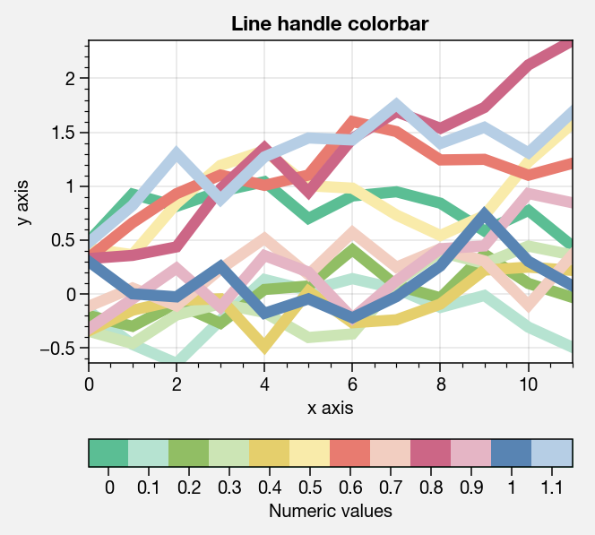
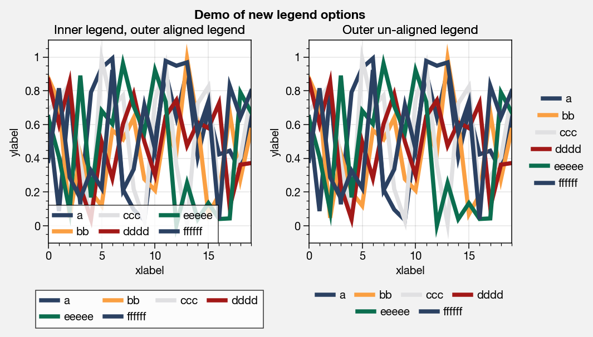
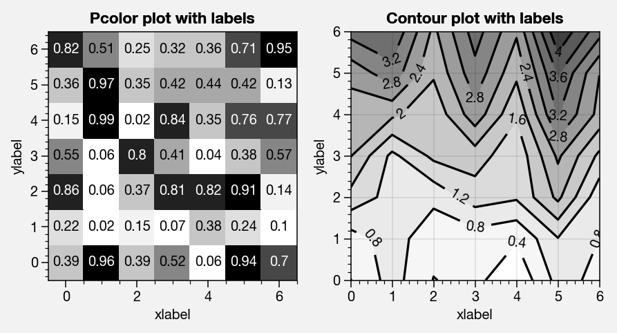
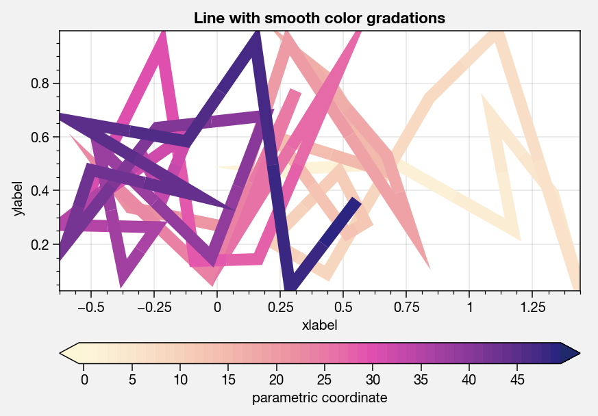
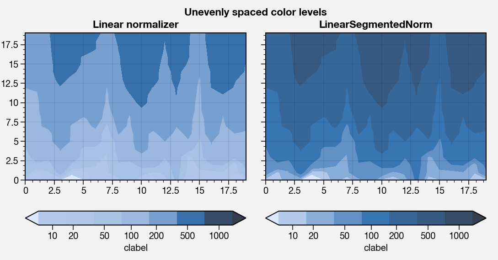
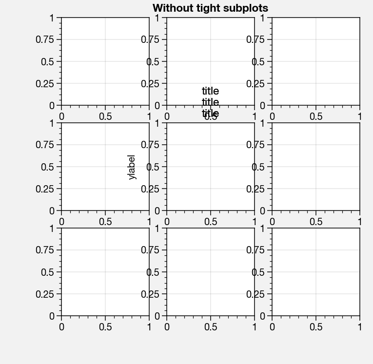
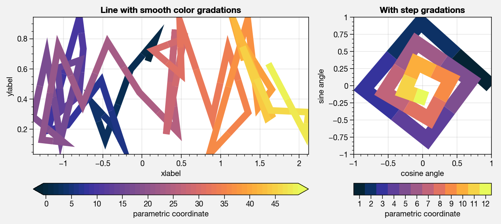
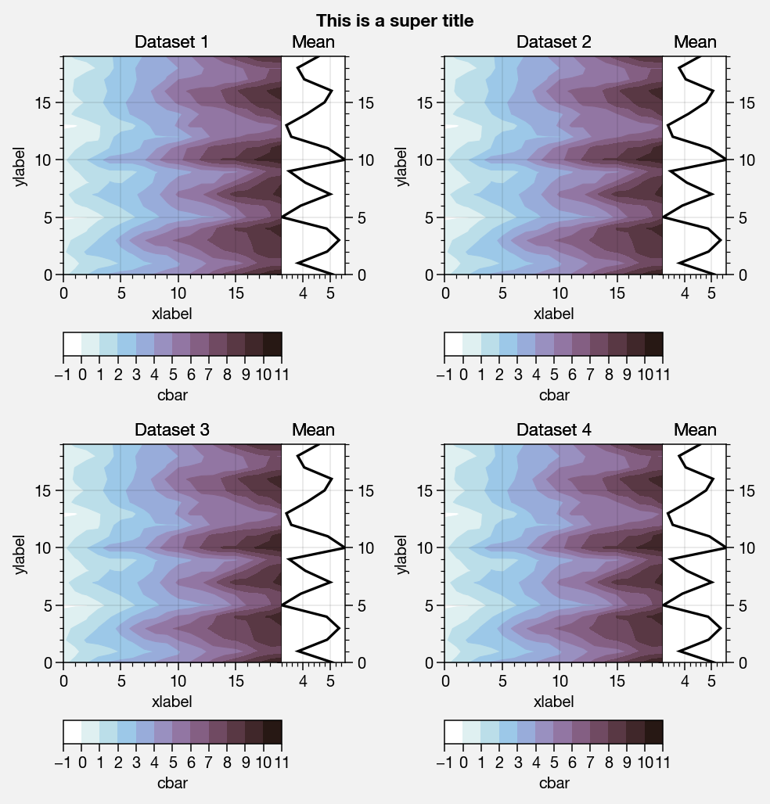
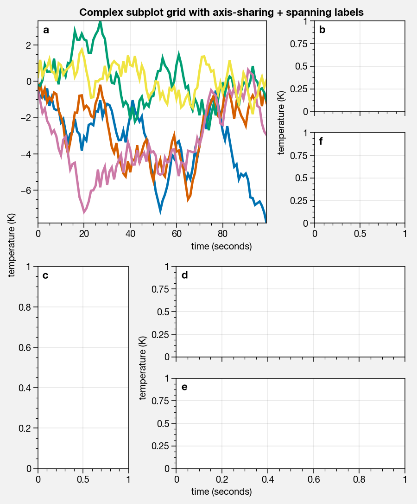
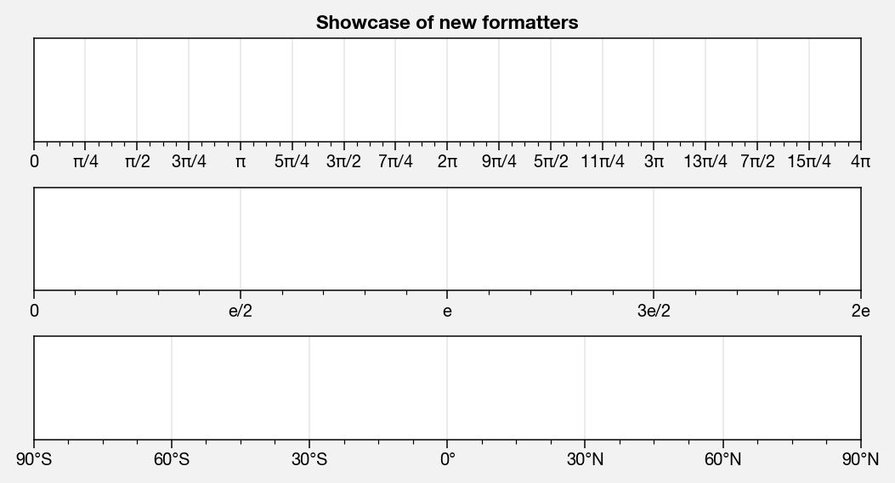

Introduction
============

Matplotlib APIs
---------------

Matplotlib has two APIs – the “pyplot” API (which is MATLAB-like), and
the “object-oriented” API (which is more “pythonic”, more clear, more
flexible, and you should consider using!).

Contrary to the similar names, this package is not meant to be a pyplot
replacement – it adds to the “object-oriented” API by subclassing
matplotlib Artists classes, like `~matplotlib.axes.Axes` and
`~matplotlib.figure.Figure`.

Since `~matplotlib.pyplot` mostly just calls the object-oriented API
under-the-hood, you can still use it to access some of ProPlot’s
features – but this is discouraged.

.. code:: ipython3

    import matplotlib.pyplot as plt
    import numpy as np
    plt.figure(figsize=(5,3))
    plt.plot(np.random.rand(10,10), lw=3)
    plt.title('PyPlot API (discouraged)')
    plt.xlabel('x axis')
    plt.ylabel('y axis')

.. image:: showcase/showcase_2_1.png
   :width: 450px
   :height: 270px

.. code:: ipython3

    import matplotlib.pyplot as plt
    import numpy as np
    f, ax = plt.subplots(figsize=(5,3))
    ax.plot(np.random.rand(10,10), lw=3)
    ax.set_title('Object-oriented API (recommended)')
    ax.set_xlabel('x axis')
    ax.set_ylabel('y axis')

.. image:: showcase/showcase_3_1.png
   :width: 450px
   :height: 270px

ProPlot subplots
----------------

The `~proplot.subplots.subplots` command is your gateway to all of
ProPlot’s features. Its usage is sort of like the pyplot
`~matplotlib.pyplot.subplots` version, but it is packed with new
features and generates a subclassed figure and specially subclassed
axes.

.. code:: ipython3

    import proplot as plot
    f, ax = plot.subplots(width=2)
    ax.format(title='ProPlot API', xlabel='x axis', ylabel='y axis')
    f, axs = plot.subplots(ncols=3, nrows=2, width=5)
    axs.format(title='Axes', suptitle='ProPlot API', xlabel='x axis', ylabel='y axis')

.. image:: showcase/showcase_6_0.png
   :width: 180px
   :height: 184px

.. image:: showcase/showcase_6_1.png
   :width: 450px
   :height: 341px

Most matplotlib sizing arguments assume the units “inches” or some
“relative” unit size – e.g. relative to the axes width. With ProPlot,
most sizing arguments are interpreted as follows: if numeric, the units
are inches, and if string, the units are interpreted by
`~proplot.utils.units` (see `~proplot.utils.units` documentation for
a table). Note this means even `~matplotlib.gridspec.GridSpec`
arguments like ``wspace`` and ``hspace`` accept physical units (see
`~proplot.subplots.subplots` for details). I recognize that the rest
of the world doesn’t use “inches”, so I thought this would be useful.

.. code:: ipython3

    import proplot as plot
    f, axs1 = plot.subplots(ncols=2, axwidth=1, height='45mm')
    f, axs2 = plot.subplots(width='5cm', aspect=(2,1))
    f, axs3 = plot.subplots(height='150pt', aspect=0.5)
    for axs in (axs1,axs2,axs3):
        axs.format(suptitle='Title', xlabel='x axis', ylabel='y axis')

.. image:: showcase/showcase_8_0.png
   :width: 280px
   :height: 159px

.. image:: showcase/showcase_8_1.png
   :width: 177px
   :height: 121px

.. image:: showcase/showcase_8_2.png
   :width: 119px
   :height: 187px

Subplot labelling is another useful ProPlot feature. The label order is
row-major by default; to change this, use the
`~proplot.subplots.subplots` ``order`` keyword arg. Change the label
position with the ``abcpos`` `~proplot.rcmod` option, or the label
style with the ``abcformat`` `~proplot.rcmod` option. Toggle labelling
with ``abc=True``. See :ref:`Axes formatting` and
:ref:`Global settings` for details.

.. code:: ipython3

    import proplot as plot
    f, axs = plot.subplots(nrows=2, ncols=2, order='F', axwidth=1.5)
    axs.format(abc=True, abcpos='ol', abcformat='A.', xlabel='x axis', ylabel='y axis', suptitle='Subplots with column-major labelling')
    f, axs = plot.subplots(nrows=8, ncols=8, axwidth=0.5, flush=True) # not 
    axs.format(abc=True, abcpos='ir', xlabel='x axis', ylabel='y axis', xticks=[], yticks=[], suptitle='Grid of "flush" subplots')

.. image:: showcase/showcase_10_0.png
   :width: 364px
   :height: 393px

.. image:: showcase/showcase_10_1.png
   :width: 562px
   :height: 572px

To set up a complex grid of subplots, use a 2D array of integers. You
can think of this array as a “picture” of your figure. This lets you
build the below grid in just one line of code, instead of 6 lines. The
numbering determines the order of a-b-c labels. See
`~proplot.subplots.subplots` for details.

.. code:: ipython3

    # Arbitrarily complex array of subplots, with shared/spanning x/y axes detected automatically
    import proplot as plot
    import numpy as np
    f, axs = plot.subplots([[1, 1, 2], [1, 1, 6], [3, 4, 4], [3, 5, 5]], span=1, share=3, width=5)
    axs.format(suptitle='Complex subplot grid with axis-sharing + spanning labels', xlabel='time (seconds)', ylabel='temperature (K)', abc=True)
    axs[0].plot(2*(np.random.rand(100,5)-0.5).cumsum(axis=0), lw=2)

.. image:: showcase/showcase_12_1.png
   :width: 450px
   :height: 543px

Smart tight layout
------------------

With ProPlot, you will always get just the right amount of spacing
between subplots so that elements don’t overlap, and just the right
amount of space around the figure edge so that labels and whatnot are
not cut off. Furthermore, despite all of the complex adjustments this
requires, the original subplot aspect ratios are **always preserved**.
Even when axes panels are present, the main subplot aspect ratios will
stay fixed (see below for more on panels).

You can disable this feature by passing ``tight=False`` to
`~proplot.subplots.subplots`, but it is unbelievably useful. It works
by scaling either the figure width or height dimension (whichever one
you didn’t specify) such that the subplot aspect ratios will not change,
and by taking advantage of ProPlot’s subplot layout restrictions. Some
examples are below.

Sometimes, ``tight=True`` is not possible (when using the cartopy
``set_extent`` method or when using cartopy meridian and parallel
labelling; a warning will be raised in these instances). Even when
``tight=False``, ProPlot tries to make the default spacing reasonable.

.. code:: ipython3

    import proplot as plot
    for share in (3,0):
        f, axs = plot.subplots(nrows=3, ncols=3, aspect=1, axwidth=1, share=share, span=False, tight=False)
        axs[4].format(title='title\ntitle\ntitle', suptitle='Default spacing')
        axs[1].format(ylabel='ylabel', xlabel='xlabel')

.. image:: showcase/showcase_15_0.png
   :width: 355px
   :height: 382px

.. image:: showcase/showcase_15_1.png
   :width: 445px
   :height: 445px

.. code:: ipython3

    import proplot as plot
    for share in (3,0):
        f, axs = plot.subplots(nrows=3, ncols=3, aspect=1, axwidth=1, share=share, span=False, tight=True)
        axs[4].format(title='title\ntitle\ntitle', suptitle='"Tight layout" automatic spacing')
        axs[1].format(ylabel='ylabel', xlabel='xlabel')

.. image:: showcase/showcase_16_0.png
   :width: 366px
   :height: 399px

.. image:: showcase/showcase_16_1.png
   :width: 412px
   :height: 422px

.. code:: ipython3

    import proplot as plot
    f, axs = plot.subplots([[1,2],[3,2],[3,4]], share=0, span=0, axwidth=1.5)
    axs[0].format(xlabel='xlabel\nxlabel\nxlabel', title='Title', suptitle='Super title')
    axs[1].format(ylabel='ylabel\nylabel', xformatter='null', yticklabelloc='both')
    axs[2].format(yformatter='null', title='Title', ytickloc='both')
    axs[3].format(yformatter='null', xlabel='xlabel\nxlabel\nxlabel')

.. image:: showcase/showcase_17_0.png
   :width: 364px
   :height: 557px

.. code:: ipython3

    import proplot as plot
    f, axs = plot.subplots(axwidth=3, ncols=2, span=False, share=0, axpanels='lr', axpanels_kw={'rshare':False})
    axs.format(ylabel='ylabel', xlabel='xlabel')
    axs[0].lpanel.format(ytickloc='right', yticklabelloc='right')
    axs[0].rpanel.format(ylabel='ylabel', ytickloc='right', yticklabelloc='right', suptitle='Super title', collabels=['Column 1', 'Column 2'])

.. image:: showcase/showcase_18_0.png
   :width: 643px
   :height: 212px

Axes formatting
---------------

The `~proplot.subplots.subplots` method populates the
`~proplot.subplots.Figure` object with either `~proplot.axes.XYAxes`
(for cartesian axes) or `~proplot.axes.MapAxes` (for cartopy or
basemap map projection axes). Both of these classes inherit from the
base class `~proplot.axes.BaseAxes`.

The **most important** new method you need to know is
`~proplot.axes.BaseAxes.format`. This is your one-stop-shop for
changing axis labels, tick labels, titles, etc. Keyword args passed to
this function are interpreted as follows:

1. Any keyword arg matching the name of a ProPlot or native matplotlib
   “rc” setting will be applied to the axes. If the name has “dots”,
   simply omit them. See the `~proplot.rcmod` documentation for
   details.
2. Remaining keyword args are passed to the ``smart_update`` methods of
   the top-level class – that is, the `~proplot.axes.XYAxes`
   `~proplot.axes.XYAxes.smart_update` or `~proplot.axes.MapAxes`
   `~proplot.axes.MapAxes.smart_update` methods. Use these to change
   settings specific to Cartesian axes or specific to map projections,
   like tick locations and toggling geographic features.
3. Finally, the remaining keyword args are passed to the
   `~proplot.axes.BaseAxes` `~proplot.axes.BaseAxes.smart_update`
   method. This one controls “universal” settings – namely, titles,
   “super titles”, row and column labels, and a-b-c subplot labelling.

Now, instead of having to remember all of these verbose, one-liner
matplotlib commands like ``ax.set_title`` and ``ax.xaxis.tick_params``,
or even having to directly use verbose classes like the matplotlib
`~matplotlib.ticker` classes, `~proplot.axes.BaseAxes.format` lets
you change everything all at once. This basically eliminates the need
for boilerplate plotting code!

Also note the axes returned by `~proplot.subplots.subplots` function
are in a special `~proplot.subplots.axes_list` list. This lets you
call any method, including `~proplot.axes.BaseAxes.format`, on every
axes **simultaneously** (as in the below example).

.. code:: ipython3

    import proplot as plot
    f, axs = plot.subplots(ncols=2, nrows=2, share=False, span=False, tight=True)
    axs.format(xlabel='x-axis', ylabel='y-axis', xlim=(0,10), xlocator=2,
              ylim=(0,4), ylocator=plot.arange(0,4), yticklabels=('a', 'bb', 'ccc', 'dd', 'e'),
              title='Axes title', titlepos='co', suptitle='Super title',
              abc=True, abcpos='il', abcformat='a.',
              ytickloc='both', yticklabelloc='both', ygridminor=True, xtickminor=False,
              collabels=['Column label 1', 'Column label 2'], rowlabels=['Row label 1', 'Row label 2'])

.. image:: showcase/showcase_20_0.png
   :width: 579px
   :height: 499px

Global settings
---------------

A special object named `~proplot.rcmod.rc`, belonging to the
`~proplot.rcmod.rc_configurator` class, is created whenever you import
ProPlot. This object gives you advanced control over the look of your
plots. **Use** `~proplot.rcmod.rc` **as your one-stop shop for
changing global settings**. To reset everything to the default state,
use `~proplot.rcmod.rc_configurator.reset`. This happens by default
every time a figure is rendered by the matplotlib backend or saved to
file.

For more information, see the `~proplot.rcmod` documentation.

.. code:: ipython3

    import proplot as plot
    import numpy as np
    # A bunch od different ways to update settings
    plot.rc.cycle = 'colorblind'
    plot.rc.linewidth = 1.5
    plot.rc.update({'fontname': 'DejaVu Sans'})
    plot.rc['figure.facecolor'] = 'w'
    plot.rc['axes.facecolor'] = 'gray5'
    # Make plot
    f, axs = plot.subplots(nrows=1, ncols=2, aspect=1, width=6,
                           span=0, wspace=0.5, sharey=2, hspace=0.7)
    N, M = 100, 6
    values = np.arange(1,M+1)
    for i,ax in enumerate(axs):
        data = np.cumsum(np.random.rand(N,M)-0.5, axis=0)
        lines = ax.plot(data, linewidth=3, cycle=('C0','C1',6)) # see "Changing the color cycle" for details
    axs.format(ytickloc='both', ycolor='blue7',
               hatch='xxx', hatchcolor='w',
               xlabel='x label', ylabel='y label',
               yticklabelloc='both',
               suptitle='Using "format" and "plot.rc" to apply new rc settings')
    ay = axs[-1].twinx()
    ay.format(ycolor='r', ylabel='secondary axis')
    ay.plot((np.random.rand(100)-0.2).cumsum(), color='r', lw=3)

.. image:: showcase/showcase_22_1.png
   :width: 540px
   :height: 260px

Colorbars and legends
---------------------

ProPlot adds several new features to the
`~matplotlib.axes.Axes.legend` and
`~matplotlib.figure.Figure.colorbar` commands, respectively powered by
the `~proplot.axes.legend_factory` and
`~proplot.axes.colorbar_factory` functions (see documentation for
usage information).

I’ve also added ``colorbar`` methods to the `~proplot.axes.BaseAxes`
and special `~proplot.axes.PanelAxes` axes. When you call
`~proplot.axes.BaseAxes.colorbar` on a `~proplot.axes.BaseAxes`, an
**inset** colorbar is generated. When you call
`~proplot.axes.PanelAxes.colorbar` on a `~proplot.axes.PanelAxes`,
the axes is **filled** with a colorbar. See
`~proplot.subplots.subplots` and
`~proplot.subplots.Figure.panel_factory` for more on panels.

.. code:: ipython3

    import proplot as plot
    import numpy as np
    f, ax = plot.subplots(colorbar='b', tight=True, axwidth=2.5)
    m = ax.contourf((np.random.rand(20,20)).cumsum(axis=0), extend='both', levels=np.linspace(0,10,11), cmap='matter')
    ax.format(xlabel='xlabel', ylabel='ylabel', xlim=(0,19), ylim=(0,19))
    ax.colorbar(m, ticks=2, label='inset colorbar')
    ax.colorbar(m, ticks=2, loc='lower left')
    f.bpanel.colorbar(m, label='standard outer colorbar', length=0.9)
    ax.format(suptitle='ProPlot colorbars')

.. image:: showcase/showcase_25_0.png
   :width: 286px
   :height: 348px

A particularly useful `~proplot.axes.colorbar_factory` feature is that
it does not require a “mappable” object (i.e. the output of
`~matplotlib.axes.Axes.contourf` or similar). It will also accept any
list of objects with ``get_color`` methods (for example, the “handles”
returned by `~matplotlib.axes.Axes.plot`), or a list of color
strings/RGB tuples! A colormap is constructed on-the-fly from the
corresponding colors.

.. code:: ipython3

    import proplot as plot
    import numpy as np
    f, ax = plot.subplots(colorbar='b', axwidth=3, aspect=1.5)
    plot.rc.cycle = 'qual2'
    # plot.rc['axes.labelweight'] = 'bold'
    hs = ax.plot((np.random.rand(12,12)-0.45).cumsum(axis=0), lw=5)
    ax.format(suptitle='Line handle colorbar', xlabel='x axis', ylabel='y axis')
    f.bpanel.colorbar(hs, values=np.arange(0,len(hs)/10,0.1),
                      label='Numeric values',
                      tickloc='bottom', # because why not?
                     )

As shown below, when you call `~proplot.axes.PanelAxes.legend` on a
`~proplot.axes.PanelAxes`, the axes is **filled** with a legend – that
is, a centered legend is drawn, and the axes patch and spines are made
invisible.

Some other notes: legend entries are now sorted in *row-major* order by
default (not sure why the matplotlib authors chose column-major), and
this is configurable with the ``order`` keyword arg. You can also
disable vertical alignment of legend entries with the ``align`` keyword
arg, or by passing a list of lists of plot handles. Under the hood, this
is done by stacking multiple single-row, horizontally centered legends
and forcing the background to be invisible.

.. code:: ipython3

    import proplot as plot
    import numpy as np
    plot.rc.cycle = 'intersection'
    labels = ['a', 'bb', 'ccc', 'dddd', 'eeeee', 'ffffff']
    f, axs = plot.subplots(ncols=2, legends='b', panels='r', span=False, share=0)
    hs = []
    for i,label in enumerate(labels):
        hs += axs.plot(np.random.rand(20), label=label, lw=3)[0]
    axs[0].legend(order='F', frameon=True, loc='lower left')
    f.bpanel[0].legend(hs, ncols=4, align=True, frameon=True)
    f.bpanel[1].legend(hs, ncols=4, align=False)
    f.rpanel.legend(hs, ncols=1, align=False)
    axs.format(ylim=(-0.1, 1.1), xlabel='xlabel', ylabel='ylabel',
               suptitle='Demo of new legend options')
    for ax,title in zip(axs, ['Inner legend, outer aligned legend', 'Outer un-aligned legend']):
        ax.format(title=title)

Wrapped plotting methods
------------------------

Various native matplotlib plotting methods have been enhanced using the
``wrapper_`` functions (see documentation). The most interesting of
these are `~proplot.axes.wrapper_cmap` and
`~proplot.axes.wrapper_cycle`. For details on the former, see the
below examples and :ref:`On-the-fly colormaps`. For details on the
latter, see :ref:`On-the-fly color cycles`.

An especially handy `~proplot.axes.wrapper_cmap` feature is the
ability to label `~matplotlib.axes.Axes.contourf` plots with
`~matplotlib.axes.Axes.clabel` in one go, and the added ability to
label grid boxes in `~matplotlib.axes.Axes.pcolor` and
`~matplotlib.axes.Axes.pcolormesh` plots.

.. code:: ipython3

    import proplot as plot
    import numpy as np
    f, axs = plot.subplots(ncols=2, span=False, share=False)
    data = np.random.rand(7,7)
    ax = axs[0]
    m = ax.pcolormesh(data, cmap='greys', labels=True, levels=100)
    ax.format(xlabel='xlabel', ylabel='ylabel', title='Pcolor plot with labels', titleweight='bold')
    ax = axs[1]
    m = ax.contourf(data.cumsum(axis=0), cmap='greys', cmap_kw={'right':0.8})
    m = ax.contour(data.cumsum(axis=0), color='k', labels=True)
    ax.format(xlabel='xlabel', ylabel='ylabel', title='Contour plot with labels', titleweight='bold')

`~proplot.colortools.wrapper_cmap` assigns the
`~proplot.colortools.BinNorm` “meta-normalizer” as the data normalizer
for all plots. This allows for discrete levels in all situations – that
is, `~matplotlib.axes.Axes.pcolor` and
`~matplotlib.axes.Axes.pcolormesh` now accept a ``levels`` keyword
arg, just like `~matplotlib.axes.Axes.contourf`. It was previously
really tricky to implement discrete levels for ``pcolor`` plots, even
though they are arguably preferable for many scientific applications
(discrete levels make it easier to associate particular colors with hard
numbers). `~proplot.colortools.BinNorm` also does some other handy
things, like ensuring that colors on the ends of “cyclic” colormaps are
never the same (see below).

.. code:: ipython3

    import proplot as plot
    import numpy as np
    f, axs = plot.subplots(ncols=2, axcolorbars='b')
    data = 20*(np.random.rand(20,20) - 0.4).cumsum(axis=0).cumsum(axis=1) % 360
    N, step = 360, 45
    ax = axs[0]
    m = ax.pcolormesh(data, levels=plot.arange(0,N,0.2), cmap='phase', extend='neither')
    ax.format(title='Pcolor without discernible levels', suptitle='Pcolor demo')
    ax.bpanel.colorbar(m, locator=2*step)
    ax = axs[1]
    m = ax.pcolormesh(data, levels=plot.arange(0,N,step), cmap='phase', extend='neither')
    ax.format(title='Pcolor plot with levels')
    ax.bpanel.colorbar(m, locator=2*step)

`~proplot.colortools.wrapper_cmap` also fixes the well-documented
`white-lines-between-filled-contours <https://stackoverflow.com/q/8263769/4970632>`__
and
`white-lines-between-pcolor-rectangles <https://stackoverflow.com/q/27092991/4970632>`__
issues by automatically changing the edge colors after ``contourf``,
``pcolor``, and ``pcolormesh`` are called. Use ``edgefix=False`` to
disable this behavior (it does slow down figure rendering a bit). Note
that if you manually specify line properties for a ``pcolor`` plot, this
feature is disabled (see below).

.. code:: ipython3

    import proplot as plot
    import numpy as np
    f, axs = plot.subplots(ncols=2, share=False)
    axs[0].pcolormesh(np.random.rand(20,20).cumsum(axis=0), cmap='solar') # fixed bug
    axs[1].pcolormesh(np.random.rand(20,20).cumsum(axis=0), cmap='solar', lw=0.5, color='gray2') # deliberate lines
    axs.format(xlabel='xlabel', ylabel='ylabel', suptitle='White lines between patches')

`~proplot.colortools.wrapper_cmap` also lets you provide arbitrarily
spaced, monotonically increasing levels, and by default the color
gradations between each number in the level list will be the same, no
matter the step size. This is powered by the
`~proplot.colors.LinearSegmentedNorm` normalizer, and can be
overridden with the ``norm`` keyword arg, which constructs an arbitrary
normalizer from the `~proplot.colortools.Norm` constructor.

.. code:: ipython3

    import proplot as plot
    import numpy as np
    f, axs = plot.subplots(colorbars='b', ncols=2, axwidth=2.5, aspect=1.5)
    data = 10**(2*np.random.rand(20,20).cumsum(axis=0)/7)
    ticks = [5, 10, 20, 50, 100, 200, 500, 1000]
    for i,norm in enumerate(('linear','segments')):
        m = axs[i].contourf(data, values=ticks, extend='both', cmap='mutedblue', norm=norm)
        f.bpanel[i].colorbar(m, label='clabel', locator=ticks, fixticks=False)
    axs.format(suptitle='Unevenly spaced color levels', collabels=['Linear normalizer', 'LinearSegmentedNorm'])

You can now call `~matplotlib.axes.Axes.plot` with a ``cmap`` option –
this lets you draw line collections that map individual segments of the
line to individual colors. This can be useful for drawing “parametric”
plots, where you want to indicate the time or some other coordinate at
each point on the line. See `~proplot.axes.BaseAxes.cmapline` for
details.

.. code:: ipython3

    import proplot as plot
    import numpy as np
    f, axs = plot.subplots(span=False, share=False, ncols=2, wratios=(2,1), axcolorbars='b', axwidth=3, aspect=(2,1))
    ax = axs[0]
    m = ax.plot((np.random.rand(50)-0.5).cumsum(), np.random.rand(50),
                cmap='thermal', values=np.arange(50), lw=7, extend='both')
    ax.format(xlabel='xlabel', ylabel='ylabel', title='Line with smooth color gradations', titleweight='bold')
    ax.bpanel.colorbar(m, label='parametric coordinate', locator=5)
    N = 12
    ax = axs[1]
    values = np.arange(1, N+1)
    radii = np.linspace(1,0.2,N)
    angles = np.linspace(0,4*np.pi,N)
    x = radii*np.cos(1.4*angles)
    y = radii*np.sin(1.4*angles)
    m = ax.plot(x, y, values=values,
                linewidth=15, interp=False, cmap='thermal')
    ax.format(xlim=(-1,1), ylim=(-1,1), title='With step gradations', titleweight='bold',
              xlabel='cosine angle', ylabel='sine angle')
    ax.bpanel.colorbar(m, locator=None, label=f'parametric coordinate')

Axes panels, colorbars
----------------------

It is common to need “panels” that represent averages across some axis
of the main subplot, or some secondary 1-dimensional dataset. This is
hard to do with matplotlib, but easy with ProPlot! You can specify
arbitrary combinations of inner panels for specific axes, and ProPlot
will always keep the subplots aligned. See
`~proplot.subplots.subplots` and
`~proplot.subplots.Figure.panel_factory` for details.

.. code:: ipython3

    # Arbitrarily complex combinations are possible, and inner spaces still determined automatically
    import proplot as plot
    f, axs = plot.subplots(axwidth=2, nrows=2, ncols=2,
                           axpanels={1:'t', 2:'l', 3:'b', 4:'r'},
                           tight=True, share=0, span=0, wratios=[1,2])
    axs.format(title='Title', suptitle='This is a super title', collabels=['Column 1','Column 2'],
               titlepos='ci', xlabel='xlabel', ylabel='ylabel', abc=True, top=False)
    axs.format(ylocator=plot.arange(0.2,0.8,0.2), xlocator=plot.arange(0.2,0.8,0.2))

.. image:: showcase/showcase_43_0.png
   :width: 468px
   :height: 466px

If you want “colorbar” panels, the simplest option is to use the
``axcolorbars`` keyword instead of ``axpanels``. This makes the width of
the panels more appropriate for filling with a colorbar. You can modify
these default spacings with a custom ``.proplotrc`` file (see the
`~proplot.rcmod` documentation).

If you want panels “flush” against the subplot, simply use the ``flush``
keyword args. If you want to disable “axis sharing” with the parent
subplot (i.e. you want to draw tick labels on the panel, and do not want
to inherit axis limits from the main subplot), use any of the ``share``
keyword args. Again, see `~proplot.subplots.subplots` and
`~proplot.subplots.Figure.panel_factory` for details.

.. code:: ipython3

    import proplot as plot
    import numpy as np
    f, axs = plot.subplots(axwidth=2, nrows=2, ncols=2, share=0, span=False, panelpad=0.1,
                           axpanels='r', axcolorbars='b', axpanels_kw={'rshare':False, 'rflush':True})
    axs.format(xlabel='xlabel', ylabel='ylabel', suptitle='This is a super title')
    for i,ax in enumerate(axs):
        ax.format(title=f'Dataset {i+1}')
    data = (np.random.rand(20,20)-0.1).cumsum(axis=1)
    m = axs.contourf(data, cmap='glacial', levels=plot.arange(-1,11))[0]
    axs.rpanel.plot(data.mean(axis=1), np.arange(20), color='k')
    axs.rpanel.format(title='Mean')
    axs.bpanel.colorbar(m, label='cbar')

Figure panels, colorbars
------------------------

It is also common to need “global” colorbars or legends, meant to
reference multiple subplots at once. This is easy to do with ProPlot
too!

The “global” colorbars can extend across every row and column of the
subplot array, or across arbitrary contiguous rows and columns. The
associated axes instances are found on the `~proplot.subplots.Figure`
instance under the names ``bottompanel``, ``leftpanel``, and
``rightpanel`` (you can also use the shorthand ``bpanel``, ``lpanel``,
and ``rpanel``). See `~proplot.subplots.subplots` for details.

.. code:: ipython3

    import proplot as plot
    import numpy as np
    f, axs = plot.subplots(ncols=3, nrows=3, axwidth=1.2, colorbar='br', bspan=[1,2,2])
    m = axs.pcolormesh(np.random.rand(20,20), cmap='grays', levels=np.linspace(0,1,11), extend='both')[0]
    axs.format(suptitle='Super title', abc=True, abcpos='ol', abcformat='a.', xlabel='xlabel', ylabel='ylabel')
    f.bpanel[0].colorbar(m, label='label', ticks=0.5)
    f.bpanel[1].colorbar(m, label='label', ticks=0.2)
    f.rpanel.colorbar(m, label='label', ticks=0.1, length=0.7)

.. code:: ipython3

    import proplot as plot
    import numpy as np
    f, axs = plot.subplots(ncols=4, axwidth=1.3, colorbar='b', bspan=[1,1,2,2], share=0, span=0, wspace=0.3)
    data = (np.random.rand(50,50)-0.1).cumsum(axis=0)
    m = axs[:2].contourf(data, cmap='grays', extend='both')
    cycle = plot.Cycle('grays', 5)
    hs = []
    for abc,color in zip('ABCDEF',cycle):
        hs += axs[2:].plot(np.random.rand(10), lw=3, color=color, label=f'line {abc}')[0]
    f.bpanel[0].colorbar(m, length=0.8, label='label')
    f.bpanel[1].legend(hs, ncols=5, align=True)
    axs.format(suptitle='Global colorbar and global legend', abc=True, abcpos='ol', abcformat='A')
    for ax,title in zip(axs, ['2D dataset #1', '2D dataset #2', 'Line set #1', 'Line set #2']):
        ax.format(title=title)

Stacked panels
--------------

ProPlot also allows arbitrarily *stacking* panels with the ``lstack``,
``bstack``, ``rstack``, and ``tstack`` keyword args. This can be useful
when you want multiple figure colorbars, when you have illustrations
with multiple colormaps inside a single axes, or when you need multiple
panels for displaing various statistics across one dimension of a
primary axes.

.. code:: ipython3

    import proplot as plot
    import numpy as np
    f, axs = plot.subplots(nrows=2, axwidth=1.2, span=False, share=0,
                          axcolorbars='l', axcolorbars_kw={'lstack':4},
                          axpanels='r', axpanels_kw={'rstack':2, 'rflush':True, 'rwidth':0.5}
                          )
    axs[0].format(title='Stacked panel demo', titleweight='bold')
    # Draw stuff in axes
    n = 10
    for ax in axs:
        # Colormap data
        ax.format(xlabel='data', xlocator=np.linspace(0, 0.8, 5))
        for i,(x0,y0,cmap,scale) in enumerate(((0,0,'greys',0.5), (0,0.5,'reds',1), (0.5,0,'blues',2), (0.5,0.5,'oranges',1))):
            data = np.random.rand(n,n)*scale
            x, y = np.linspace(x0, x0+0.5, 11), np.linspace(y0, y0+0.5, 11)
            m = ax.pcolormesh(x, y, data, cmap=cmap, levels=np.linspace(0,scale,11))
            ax.lpanel[i].colorbar(m)
        # Plot data
        for i,pax in enumerate(ax.rpanel):
            func = data.mean if i==0 else data.std
            pax.plot(func(axis=1), plot.arange(0.05, 0.95, 0.1), lw=2, color='k')
            pax.format(xlabel='mean' if i==0 else 'stdev', xlim=(0,1), xlocator=(0,0.5))

.. image:: showcase/showcase_51_0.png
   :width: 524px
   :height: 510px

Helvetica as the default font
-----------------------------

Helvetica is the MATLAB default, but matplotlib does not come packaged
with it and defaults to a font called “DejaVu Sans”. ProPlot adds back
Helvetica and makes it the default. Helvetica is more
professional-looking than the DejaVu Sans, in my biased opinion. See the
`~proplot.rcmod` documentation for changing the default font.

.. code:: ipython3

    import proplot as plot
    plot.rc['small'] =  8
    plot.rc['fontname'] = 'Helvetica'
    f, axs = plot.subplots(ncols=4, nrows=3, share=False, span=False,
                           axwidth=1.5, axheight=2, wspace=0.5, hspace=0.5)
    # options = ['ultralight', 'light', 'normal', 'regular', 'book', 'medium', 'roman',
    #            'semibold', 'demibold', 'demi', 'bold', 'heavy', 'extra bold', 'black',
    #            'italic', 'oblique'] # remove redundancies below
    options = ['ultralight', 'light', 'normal', 'medium', 'demi', 'bold', 'extra bold', 'black']
    fonts = ['Helvetica', 'Helvetica Neue', 'DejaVu Sans', 'Bitstream Vera Sans', 'Verdana', 'Tahoma',
             'Arial', 'Geneva', 'Times New Roman', 'Palatino', 'Inconsolata', 'Myriad Pro'] #Comic Sans MS', 'Myriad Pro']
    for ax,font in zip(axs,fonts):
        plot.rc['fontname'] = font
        math  = r'$\alpha\beta + \gamma\delta \times \epsilon\zeta \cdot \eta\theta$'
        math += ('\n' + r'$\Sigma\kappa\lambda\mu\pi\rho\sigma\tau\psi\phi\omega$')
        ax.text(0.5, 0, math + '\n' + 'The quick brown fox\njumps over the lazy dog.\n0123456789\n!@#$%^&*()[]{};:,./?',
                weight='normal', ha='center', va='bottom')
        ax.format(xlabel='xlabel', ylabel='ylabel', suptitle='Table of font names')
        for i,option in enumerate(options):
            if option in ('italic', 'oblique'):
                kw = {'style':option, 'weight':'normal'} # otherwise defaults to *lightest* one!
            elif option in ('small-caps',):
                kw = {'variant':option}
            else:
                kw = {'weight':option}
            kw.update({'stretch':'normal'})
            ax.text(0.03, 0.97 - (i*1.2*(plot.rc['small']/72)/ax.height), f'{option}', ha='left', va='top', **kw)
            ax.text(0.97, 0.97 - (i*1.2*(plot.rc['small']/72)/ax.height), f'{font[:14].strip()}',   ha='right', va='top', **kw)

.. image:: showcase/showcase_54_0.png
   :width: 751px
   :height: 697px

