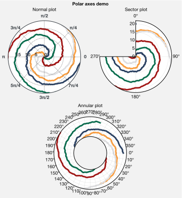
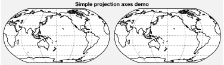
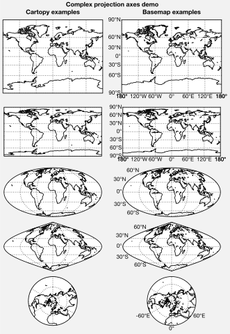
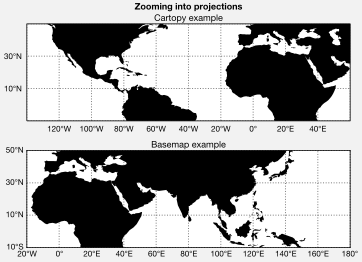
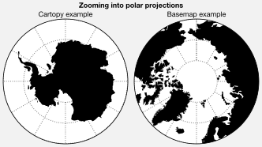
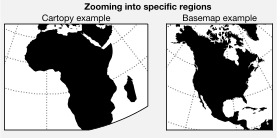
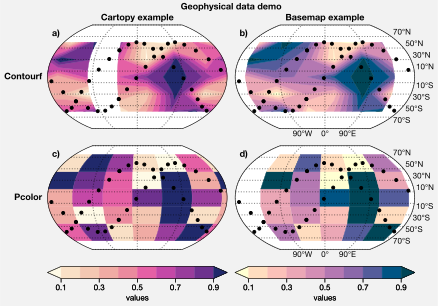
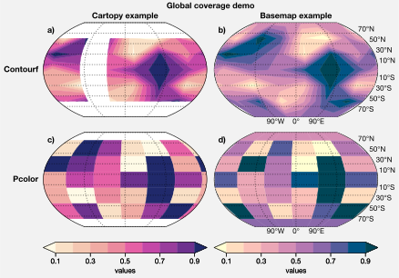
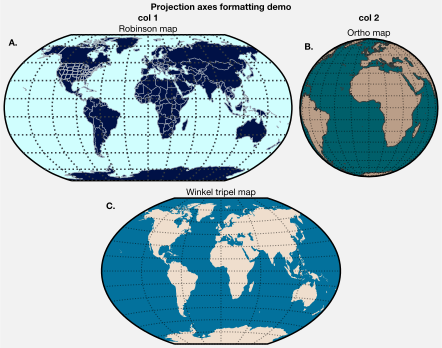

Projection axes
===============

ProPlot includes seamless integration with matplotlib `polar
axes <https://matplotlib.org/3.1.0/gallery/pie_and_polar_charts/polar_demo.html>`__
and the `cartopy <https://scitools.org.uk/cartopy/docs/latest/>`__ and
`basemap <https://matplotlib.org/basemap/index.html>`__ packages. Note
that this feature is optional, and does not require that cartopy or
basemap are installed.

To change the axes projection, pass ``proj='name'`` to
`~proplot.subplots.subplots`. To use different projections for
different subplots, pass a dictionary of projection names with the
subplot number as the key – for example, ``proj={1:'name'}``. The
default “projection” is always :ref:`Cartesian axes`.

Polar projections
-----------------

To draw polar axes, pass e.g. ``proj='polar'`` to
`~proplot.subplots.subplots`. This generates a
`~proplot.axes.PolarAxes` instance. Its
`~proplot.axes.PolarAxes.format` command permits all sorts of
polar-specific modifications, including making sector plots, annular
plots, and changing the positive azimuthal direction. A demonstration is
below.

.. code:: ipython3

    import proplot as plot
    import numpy as np
    f, axs = plot.subplots([[1,1,2,2],[0,3,3,0]], proj='polar')
    axs.format(suptitle='Polar axes demo')
    N = 200
    x = np.linspace(0, 2*np.pi, N)
    y = 100*(np.random.rand(N,5)-0.3).cumsum(axis=0)/N
    for i in range(5):
        axs.plot(x + i*2*np.pi/5, y[:,i], cycle='contrast', zorder=0, lw=3)
    axs.format(linewidth=1, ticklabelsize=9, rlines=0.5, rlim=(0,19))
    axs[0].format(title='Normal plot', thetaformatter='pi', rlines=5, gridalpha=1, gridlinestyle=':',
                  rlabelpos=180, color='gray8', ticklabelweight='bold')
    axs[1].format(title='Sector plot', thetadir=-1, thetalines=90, thetalim=(0,270), theta0='N',
                  rlim=(0,22), rlines=5)
    axs[2].format(title='Annular plot', thetadir=-1, thetalines=10,
                  r0=0, rlim=(10,22), rformatter='null', rlocator=2)
    axs.format(titlepad='1.5em') # matplotlib default title offset is incorrect

Geographic projections
----------------------

To specify a geographic projection, pass e.g. ``proj='name'`` to
`~proplot.subplots.subplots`, where ``'name'`` is any valid cartopy or
basemap listed in the :ref:`Table of projections`. This generates a
`~proplot.axes.CartopyAxes` or `~proplot.axes.BasemapAxes`,
depending on whether you passed ``basemap=True`` to
`~proplot.subplots.subplots`. These axes are designed as follows.

-  `~proplot.axes.CartopyAxes` joins the cartopy
   `~cartopy.mpl.geoaxes.GeoAxes` class with the ProPlot
   `~matplotlib.axes.Axes` class, and adds a
   `~proplot.axes.ProjectionAxes.format` command. It includes all the
   methods you normally get with cartopy, like
   `~cartopy.mpl.geoaxes.GeoAxes.set_extent`.
-  `~proplot.axes.BasemapAxes` redirects the plot, scatter, contour,
   contourf, pcolor, pcolormesh, quiver, streamplot, and barb methods to
   identically named methods on the `~mpl_toolkits.basemap.Basemap`
   instance, and provides access to `~mpl_toolkits.basemap.Basemap`
   geographic plotting commands like
   `~mpl_toolkits.basemap.Basemap.fillcontinents` via the
   `~proplot.axes.ProjectionAxes.format` command.

So, with ProPlot, you no longer have to invoke verbose cartopy
`~cartopy.crs` classes like
`~cartopy.crs.NorthPolarAzimuthalEquidistant`, or mess about with a
separate `~mpl_toolkits.basemap.Basemap` instance.

To pass keyword args to `~mpl_toolkits.basemap.Basemap` and
`cartopy.crs.Projection` classes, use the ``proj_kw`` dictionary.
ProPlot lets you supply native PROJ.4 keyword names to the
`cartopy.crs.Projection` classes, e.g. ``lon_0`` instead of
``central_longitude``. This makes things a bit less verbose. ProPlot
also lets you draw `~mpl_toolkits.basemap.Basemap` projections without
having to always specify the projection settings by applying sensible
defaults.

Note that the basemap developers plan to `halt active development after
2020 <https://matplotlib.org/basemap/users/intro.html#cartopy-new-management-and-eol-announcement>`__,
since cartopy is integrated more closely with the matplotlib API and has
more room for growth. For now, cartopy is `missing several
features <https://matplotlib.org/basemap/api/basemap_api.html#module-mpl_toolkits.basemap>`__
offered by basemap – namely, flexible meridian and parallel gridline
labels, drawing physical map scales, and convenience features for adding
background images like the “blue marble”. But once these are added to
cartopy, ProPlot support for basemap may be removed.

.. code:: ipython3

    import proplot as plot
    plot.rc.coastlinewidth = plot.rc.linewidth = 0.8
    f, axs = plot.subplots(ncols=2, axwidth=2.5, proj='robin', proj_kw={'lon_0':180})
    axs.format(suptitle='Simple projection axes demo', coast=True, latlines=30, lonlines=60)

.. code:: ipython3

    import proplot as plot
    f, axs = plot.subplots(hratios=(1.5,1,1,1,1),
        basemap={(1,3,5,7,9):False, (2,4,6,8,10):True},
        proj={(1,2):'mill', (3,4):'cyl', (5,6):'moll', (7,8):'sinu', (9,10):'npstere'},
        ncols=2, nrows=5) #, proj_kw={'lon_0':0})
    axs.format(suptitle='Complex projection axes demo')
    axs.format(coast=True, latlines=30, lonlines=60)
    axs[:,1].format(labels=True, lonlines=plot.arange(-180,179,60))
    axs.format(collabels=['Cartopy examples', 'Basemap examples'])

Registered cartopy projections
------------------------------

The available `cartopy <https://scitools.org.uk/cartopy/docs/latest/>`__
projections are plotted below. See the :ref:`Table of projections` for
details. ProPlot adds to cartopy the previously unavailable Aitoff,
Hammer, Winkel Tripel, and Kavrisky VII projections (i.e. ``'aitoff'``,
``'hammer'``, ``'wintri'``, and ``'kav7'``), as well as North Polar and
South Polar versions of the Stereographic, Azimuthal Equidistant,
Lambert Azimuthal Equal-Area, and Gnomic projections (i.e.
``'npstere'``, ``'spstere'``, ``'npaeqd'``, ``'spaeqd'``, ``'nplaea'``,
``'splaea'``, ``'npgnom'``, and ``'spgnom'``).

.. code:: ipython3

    import proplot as plot
    import numpy as np
    projs = ['cyl', 'merc', 'mill', 'lcyl', 'tmerc',
             'robin', 'hammer', 'moll', 'kav7', 'aitoff', 'wintri', 'sinu',
             'geos', 'ortho', 'nsper', 'aea', 'eqdc', 'lcc', 'gnom',
             'npstere', 'nplaea', 'npaeqd', 'npgnom', 'igh',
             'eck1', 'eck2', 'eck3', 'eck4', 'eck5', 'eck6']
    f, axs = plot.subplots(ncols=3, nrows=10, proj=projs)
    axs.format(land=True, reso='lo', labels=False, suptitle='Table of cartopy projections')
    for proj,ax in zip(projs,axs):
        ax.format(title=proj, titleweight='bold', labels=False)

.. image:: projection/projection_11_1.svg

Registered basemap projections
------------------------------

The available `basemap <https://matplotlib.org/basemap/index.html>`__
projections are plotted below. See the :ref:`Table of projections` for
details. Basemap projection bounds are usually rectangles, while cartopy
bounds are more flexible. Basemap used to have many more projections
than cartopy, but the ProPlot additions to cartopy have made the matchup
more even.

.. code:: ipython3

    import proplot as plot
    import numpy as np
    projs = ['cyl', 'merc', 'mill', 'cea', 'gall', 'sinu',
             'eck4', 'robin', 'moll', 'kav7', 'hammer', 'mbtfpq',
             'geos', 'ortho', 'nsper',
             'vandg', 'aea', 'eqdc', 'gnom', 'cass', 'lcc',
             'npstere', 'npaeqd', 'nplaea']
    f, axs = plot.subplots(ncols=3, nrows=8, basemap=True, proj=projs)
    axs.format(land=True, labels=False, suptitle='Table of basemap projections')
    for proj,ax in zip(projs,axs):
        ax.format(title=proj, titleweight='bold', labels=False)

.. image:: projection/projection_14_0.svg

Zooming into projections
------------------------

To zoom into cartopy projections, you can use
`~cartopy.mpl.geoaxes.GeoAxes.set_extent`, or alternatively pass
``lonlim``, ``latlim``, or ``boundinglat`` to
`~proplot.axes.ProjectionAxes.format`. Note that ProPlot always draws
a *circular boundary* around North Polar and South Polar Stereographic,
Azimuthal Equidistant, Lambert Azimuthal Equal-Area, and Gnomic
projections, no matter the “zoom” setting (implemented following `this
example <https://scitools.org.uk/cartopy/docs/latest/gallery/always_circular_stereo.html>`__).

For basemap projections, you must set the limits when declaring the
projection by passing ``proj_kw`` to `~proplot.subplots.subplots` with
any of the ``boundinglat``, ``llcrnrlon``, ``llcrnrlat``, ``urcrnrlon``,
``urcrnrlat``, ``llcrnrx``, ``llcrnry``, ``urcrnrx``, ``urcrnry``,
``width``, and/or ``height`` keyword args.

.. code:: ipython3

    import proplot as plot
    f, axs = plot.subplots(nrows=2, axwidth=4.5,
               proj='pcarree', basemap={1:False, 2:True},
               proj_kw={2:{'llcrnrlon':-20, 'llcrnrlat':-10, 'urcrnrlon':180, 'urcrnrlat':50}})
    # Normal projection
    axs.format(land=True, labels=True, lonlines=20, latlines=20, suptitle='Zooming into projections')
    axs[0].format(lonlim=(-140,60), latlim=(-10,50), labels=True, title='Cartopy example')
    axs[1].format(title='Basemap example')
    # Polar projection
    f, axs = plot.subplots(ncols=2, axwidth=2.2,
               proj={1:'splaea', 2:'npaeqd'}, basemap={1:False,2:True},
               proj_kw={2:{'boundinglat':60}})
    axs.format(land=True, latlines=10, latmax=80, suptitle='Zooming into polar projections')
    axs[0].format(boundinglat=-60, title='Cartopy example')
    axs[1].format(title='Basemap example')
    # Example from basemap website
    f, axs = plot.subplots(ncols=2, axwidth=2, proj='lcc', basemap={1:False,2:True},
                 proj_kw={1:{'lon_0':0}, 2:{'lon_0':-100, 'lat_0':45, 'width':8e6, 'height':8e6}})
    axs.format(suptitle='Zooming into specific regions', land=True)
    axs[0].format(title='Cartopy example', land=True, lonlim=(-20,50), latlim=(30,70))
    axs[1].format(title='Basemap example', land=True)

Plotting geophysical data
-------------------------

The below demonstrates how to plot geophysical data with ProPlot. For
`~proplot.axes.CartopyAxes` plotting methods,
``transform=crs.PlateCarree()`` is now the default behavior. For
`~proplot.axes.BasemapAxes` plotting methods, ``latlon=True`` is now
the default behavior, and methods are called on the *axes* instead of
the `~mpl_toolkits.basemap.Basemap` instance. For both basemap and
cartopy projections, you can also pass ``globe=True`` to 2D plotting
commands to ensure global data coverage.

These features are powered by the `~proplot.wrappers.standardize_2d`,
`~proplot.wrappers.default_transform`, and
`~proplot.wrappers.default_latlon` wrappers.

.. code:: ipython3

    import proplot as plot
    import numpy as np
    offset = -40
    x = plot.arange(offset, 360 + offset-1, 60)
    y = plot.arange(-60,60+1,30)
    data = np.random.rand(len(y), len(x))
    titles = ('Geophysical data demo', 'Global coverage demo')
    for globe in (False,True):
        f, axs = plot.subplots(ncols=2, nrows=2, axwidth=2.5,
            proj='kav7', basemap={(1,3):False, (2,4):True})
        for i,ax in enumerate(axs):
            cmap = ('sunset', 'sunrise')[i % 2]
            if i < 2:
                m = ax.contourf(x, y, data, cmap=cmap, globe=globe, extend='both')
                f.colorbar(m, loc='b', span=i+1, label='values', tickminor=False, extendsize='1.7em')
            else:
                ax.pcolor(x, y, data, cmap=cmap, globe=globe, extend='both')
            if not globe:
                ix = offset + np.linspace(0, 360, 20)
                for cmd in (np.sin,np.cos):
                    iy = cmd(ix*np.pi/180)*60
                    ax.plot(ix, iy, color='k', lw=0, marker='o')
        axs.format(suptitle=titles[globe],
                   collabels=['Cartopy example', 'Basemap example'],
                   rowlabels=['Contourf', 'Pcolor'], latlabels='r', lonlabels='b', lonlines=90,
                   abc=True, abcstyle='a)', abcloc='ul', abcborder=False)

Formatting projection axes
--------------------------

`~proplot.axes.CartopyAxes` and `~proplot.axes.BasemapAxes` both
derive from `~proplot.axes.ProjectionAxes`, which provides a
`~proplot.axes.ProjectionAxes.format` method.
`~proplot.axes.ProjectionAxes.format` can be used to draw gridlines,
add gridline labels, set gridline label locations, modify the projection
bounding box, and add and stylize geographic features, like land masses,
coastlines, and international borders. These methods also call
``format`` on `~proplot.axes.Axes`, and so can be used for subplot
titles, a-b-c labels, and figure titles as before.

.. code:: ipython3

    import proplot as plot
    import numpy as np
    N = 40
    f, axs = plot.subplots([[1,1,2],[3,3,3]], axwidth=4, proj={1:'robin', 2:'ortho', 3:'wintri'})
    ax = axs[0]
    ax.format(title='Robinson map', land=True, landcolor='navy blue', facecolor='pale blue',
               coastcolor='gray5', borderscolor='gray5', innerborderscolor='gray5',
               geogridlinewidth=1.5, geogridcolor='gray8', geogridalpha=1, 
               coast=True, innerborders=True, borders=True)
    ax = axs[1]
    ax.format(title='Ortho map', reso='med', land=True, coast=True, latlines=10, lonlines=15,
              landcolor='mushroom', suptitle='Projection axes formatting demo',
              facecolor='petrol', coastcolor='charcoal', coastlinewidth=0.8, geogridlinewidth=1)
    ax = axs[2]
    ax.format(land=True, facecolor='ocean blue', landcolor='almond', title='Winkel tripel map',
             lonlines=60, latlines=15)
    axs.format(suptitle='Projection axes formatting demo', collabels=['col 1', 'col 2'],
               abc=True, abcstyle='A.', abcloc='ul', abcborder=False, linewidth=1.5)

