Introduction
============

Matplotlib APIs
---------------

Matplotlib has `two
APIs <https://matplotlib.org/api/api_overview.html>`__ – the “pyplot”
API (which is MATLAB-like), and the “object-oriented” API (which is more
“pythonic”). Contrary to the similar names, this package is not meant to
be a pyplot replacement. ProPlot’s features are invoked with the
“object-oriented” API, thanks to subclasses of the
``~matplotlib.axes.Axes`` and ``~matplotlib.figure.Figure`` classes.

.. code:: ipython3

    # PyPlot API
    import matplotlib.pyplot as plt
    import numpy as np
    plt.figure(figsize=(5,3))
    plt.plot(np.random.rand(10,10), lw=3)
    plt.title('Title')
    plt.xlabel('x axis')
    plt.ylabel('y axis')

.. code:: ipython3

    # Object-oriented API
    import matplotlib.pyplot as plt
    import numpy as np
    f, ax = plt.subplots(figsize=(5,3))
    ax.plot(np.random.rand(10,10), lw=3)
    ax.set_title('Title')
    ax.set_xlabel('x axis')
    ax.set_ylabel('y axis')

The subplots command
--------------------

The ``~proplot.subplots.subplots`` command is your gateway to all of
ProPlot’s features. Its usage is similar to the pyplot
``~matplotlib.pyplot.subplots`` command, but it is packed with new
features and generates a subclassed figure and specially subclassed
axes.

.. code:: ipython3

    import proplot as plot
    f, ax = plot.subplots()
    ax.format(title='ProPlot API', xlabel='x axis', ylabel='y axis')

.. image:: quickstart/quickstart_6_0.svg

Most matplotlib sizing arguments assume the units inches or some
*relative* unit size – e.g. relative to the axes width. With ProPlot,
all sizing arguments are interpreted the same way. If numeric, the units
are inches, and if string, the units are interpreted by
``~proplot.utils.units``. A table of acceptable units is found in the
``~proplot.utils.units`` documentation – they include cm, mm, and
pixels. See ``~proplot.subplots.subplots`` for details.

.. code:: ipython3

    import proplot as plot
    f, axs = plot.subplots(ncols=3, tightsubplot=False, width='12cm', height='55mm', wspace=('10pt', '20pt'))
    axs.format(suptitle='Figure title', xlabel='x axis', ylabel='y axis')

.. image:: quickstart/quickstart_8_0.svg

A-b-c subplot labeling is another useful ProPlot feature. The label
order is row-major by default; to change this, use the
``~proplot.subplots.subplots`` ``order`` keyword arg. Change the label
position with the ``abcloc`` ``~proplot.rcmod`` option, or the label
style with the ``abcformat`` ``~proplot.rcmod`` option. Toggle labeling
with ``abc=True``. See :ref:``The format command`` and
:ref:``Rc settings control`` for details.

.. code:: ipython3

    import proplot as plot
    f, axs = plot.subplots(nrows=2, ncols=2, order='F', axwidth=1.5)
    axs.format(abc=True, abcloc='l', abcformat='A.', xlabel='x axis', ylabel='y axis', suptitle='Subplots with column-major labeling')
    f, axs = plot.subplots(nrows=8, ncols=8, axwidth=0.5, flush=True) # not 
    axs.format(abc=True, abcloc='ur', xlabel='x axis', ylabel='y axis', xticks=[], yticks=[], suptitle='Grid of "flush" subplots')

.. image:: quickstart/quickstart_10_0.svg

.. image:: quickstart/quickstart_10_1.svg

To set up a complex grid of subplots, use a 2D array of integers. You
can think of this array as a “picture” of your figure. This lets you
build the below grid in just one line of code, instead of 6 lines. The
numbering determines the order of a-b-c labels. See
``~proplot.subplots.subplots`` for details.

.. code:: ipython3

    # Arbitrarily complex array of subplots, with shared/spanning x/y axes detected automatically
    import proplot as plot
    import numpy as np
    f, axs = plot.subplots([[1, 1, 2], [1, 1, 6], [3, 4, 4], [3, 5, 5]], span=1, share=3, width=5)
    axs.format(suptitle='Complex subplot grid with axis-sharing + spanning labels', xlabel='time (seconds)', ylabel='temperature (K)', abc=True)
    axs[0].plot(2*(np.random.rand(100,5)-0.5).cumsum(axis=0), lw=2)

.. parsed-literal::

    [<matplotlib.lines.Line2D at 0xd3b54b0f0>,
     <matplotlib.lines.Line2D at 0xd37e597f0>,
     <matplotlib.lines.Line2D at 0xd37e59c18>,
     <matplotlib.lines.Line2D at 0xd3b7322b0>,
     <matplotlib.lines.Line2D at 0xd3b732400>]

.. image:: quickstart/quickstart_12_1.svg

Automatic subplot spacing
-------------------------

With ProPlot, you will always get just the right amount of spacing
between subplots so that elements don’t overlap, and just the right
amount of space around the figure edge so that labels and whatnot are
not cut off. Furthermore, despite all of the complex adjustments this
requires, the original subplot aspect ratios are **always preserved**.
Even when axes panels are present, the main subplot aspect ratios will
stay fixed (see below for more on panels).

You can disable this feature by passing ``tight=False`` to
``~proplot.subplots.subplots``, but it is unbelievably useful. It works
by scaling either the figure width or height dimension (whichever one
you didn’t specify) such that the subplot aspect ratios will not change,
and by taking advantage of ProPlot’s subplot layout restrictions. Some
examples are below.

Sometimes, ``tight=True`` is not possible (when using the cartopy
``set_extent`` method or when using cartopy meridian and parallel
labeling; a warning will be raised in these instances). Even when
``tight=False``, ProPlot tries to make the default spacing reasonable.

.. code:: ipython3

    import proplot as plot
    for share in (3,0):
        f, axs = plot.subplots(nrows=3, ncols=3, aspect=1, axwidth=1, share=share, span=False, tight=True)
        axs[4].format(title='title\ntitle\ntitle', suptitle='"Smart tight layout" automatic spacing')
        axs[1].format(ylabel='ylabel', xlabel='xlabel')

.. image:: quickstart/quickstart_15_0.svg

.. image:: quickstart/quickstart_15_1.svg

.. code:: ipython3

    import proplot as plot
    f, axs = plot.subplots([[1,2],[3,2],[3,4]], share=0, span=0, axwidth=1.5)
    axs[0].format(xlabel='xlabel\nxlabel\nxlabel', title='Title', suptitle='"Smart tight layout" automatic spacing')
    axs[1].format(ylabel='ylabel\nylabel', xformatter='null', yticklabelloc='both')
    axs[2].format(yformatter='null', title='Title', ytickloc='both')
    axs[3].format(yformatter='null', xlabel='xlabel\nxlabel\nxlabel')

.. image:: quickstart/quickstart_16_0.svg

.. code:: ipython3

    import proplot as plot
    f, axs = plot.subplots(axwidth=2, ncols=2, span=False, share=0, axpanels='lr', axpanels_kw={'rshare':False})
    axs.format(ylabel='ylabel', xlabel='xlabel')
    axs[0].lpanel.format(ytickloc='right', yticklabelloc='right')
    axs[0].rpanel.format(ylabel='ylabel', ytickloc='right', yticklabelloc='right',
                         suptitle='"Smart tight layout" automatic spacing with panels', collabels=['Column 1', 'Column 2'])

.. image:: quickstart/quickstart_17_0.svg

The format command
------------------

The ``~proplot.subplots.subplots`` method populates the
``~proplot.subplots.Figure`` object with either ``~proplot.axes.XYAxes``
(for cartesian axes) or ``~proplot.axes.MapAxes`` (for cartopy or
basemap projection axes) axes objects. Both of these classes inherit
from the base class ``~proplot.axes.BaseAxes``.

The **most important** new method you need to know is
``~proplot.axes.BaseAxes.format``. This is your one-stop-shop for
changing axis labels, tick labels, titles, etc. Keyword args passed to
this function are interpreted as follows:

1. Any keyword arg matching the name of a ProPlot or matplotlib “rc”
   setting will be applied to the axes. If the name has “dots”, simply
   omit them. See the ``~proplot.rcmod`` documentation for details.
2. Remaining keyword args are passed to the ``~proplot.axes.XYAxes`` or
   ``~proplot.axes.MapAxes`` ``format_partial`` methods. Use these to
   change settings specific to Cartesian or map projection axes,
   e.g. changing tick locations (the former) or toggling geographic
   features (the latter).
3. Remaining keyword args are passed to the ``~proplot.axes.BaseAxes``
   ``format_partial`` method. This one controls settings shared by
   ``~proplot.axes.XYAxes`` and ``~proplot.axes.MapAxes`` axes – namely,
   titles, “super titles”, row and column labels, and a-b-c subplot
   labeling.

Instead of needing all of these verbose, one-liner matplotlib commands
like ``ax.set_title`` and ``ax.xaxis.tick_params``, or even using
verbose abstract classes like the matplotlib ``~matplotlib.ticker``
classes, ``~proplot.axes.BaseAxes.format`` lets you change everything at
once and adds several useful shorthands. This effectively eliminates the
need for boilerplate plotting code.

The axes returned by ``~proplot.subplots.subplots`` are also contained
in a special ``~proplot.subplots.axes_list`` list. This lets you call
any method (e.g. ``~proplot.axes.BaseAxes.format``) on every axes
**simultaneously**. This is used in the below example.

.. code:: ipython3

    import proplot as plot
    f, axs = plot.subplots(ncols=2, nrows=2, share=False, span=False, tight=True, axwidth=1.5)
    axs.format(xlabel='x-axis', ylabel='y-axis', xlim=(1,10), xlocator=1, xscale='log',
              ylim=(0,4), ylocator=plot.arange(0,4), yticklabels=('a', 'bb', 'c', 'dd', 'e'),
              title='Main title', titleloc='c', suptitle='Demo of the format command',
              abc=True, abcloc='ul', abcformat='a.', xtickdir='inout',
              urtitle='Title A', lltitle='Title B', lrtitle='Title C', # extra titles
              ytickloc='both', yticklabelloc='both', ygridminor=True, xtickminor=False,
              collabels=['Column label 1', 'Column label 2'], rowlabels=['Row label 1', 'Row label 2'])

.. image:: quickstart/quickstart_19_0.svg

Automatic formatting
--------------------

With ProPlot, when you pass a ``~pandas.DataFrame`` or
``~xarray.DataArray`` to any plotting command, labels and colorbars can
be generated automatically, and the x-axis label, y-axis label, legend
label, colorbar label, and/or title are configured from the metadata.
This restores some of the convenience you get with the builtin
``pandas`` and ``xarray`` plotting tools. To disable automatic
labelling, pass ``autoformat=False`` to ``~proplot.subplots.subplots``.

The below examples showcase these features for 1-dimensional and
2-dimensional datasets. For more on the ``colorbar`` and ``legend``
keywords, see ``~proplot.wrappers.cmap_wrapper``,
``~proplot.wrappers.cycle_wrapper``, and :ref:``Plotting enhancements``
sections. For more on panels, see the :ref:``Panels`` section.

.. code:: ipython3

    import xarray as xr
    import numpy as np
    import pandas as pd
    import proplot as plot
    plot.rc['axes.formatter.timerotation']
    # DataArray
    # Must be column major since plot draws lines from columns of arrays
    data = np.sin(np.linspace(0, 2*np.pi, 20))[:,None] + np.random.rand(20,8).cumsum(axis=1)
    da = xr.DataArray(data, dims=('x', 'cat'), coords={
        'x':xr.DataArray(np.linspace(0,1,20), dims=('x',), attrs={'long_name':'distance', 'units':'km'}),
        'cat':xr.DataArray(np.arange(0,80,10), dims=('cat',), attrs={'long_name':'parameter', 'units':'K'})
        }, name='position series')
    # DataFrame
    ts = pd.date_range('1/1/2000', periods=20)
    data = (np.cos(np.linspace(0, 2*np.pi, 20))**4)[:,None] + np.random.rand(20,5)**2
    df = pd.DataFrame(data, index=ts, columns=['foo','bar','baz','zap','baf'])
    df.name = 'time series'
    df.index.name = 'time (s)'
    df.columns.name = 'columns'
    # Series
    series = pd.Series(np.random.rand(20).cumsum())
    # Figure
    f, axs = plot.subplots(ncols=2, axwidth=1.8, share=False, span=False)
    axs.format(suptitle='Automatic subplot formatting')
    # Plot DataArray
    ax = axs[0]
    ax.plot(da, cycle=plot.shade('sky blue', 0.2), cycle_kw={'fade':90}, lw=3,
            colorbar='ll', colorbar_kw={'length':'2cm', 'frameon':True})
    # Plot Dataframe
    ax = axs[1]
    ax.plot(df, cycle=plot.shade('dark green', 0.15), cycle_kw={'fade':90}, legend='uc', legend_kw={'frameon':True}, lw=3)
    ax.format(xrotation=45)

.. image:: quickstart/quickstart_22_0.svg

.. code:: ipython3

    import xarray as xr
    import numpy as np
    import pandas as pd
    import proplot as plot
    from string import ascii_lowercase
    # DataArray
    data = 50*(np.sin(np.linspace(0, 2*np.pi, 20) + 0)**2) * np.cos(np.linspace(0, np.pi, 20)+np.pi/2)[:,None]**2
    da = xr.DataArray(data, dims=('plev','lat'), coords={
        'plev':xr.DataArray(np.linspace(1000,0,20), dims=('plev',), attrs={'long_name':'pressure', 'units':'hPa'}),
        'lat':xr.DataArray(np.linspace(-90,90,20), dims=('lat',), attrs={'units':'deg_N'}), # if long_name absent, variable name is used
        }, name='u', attrs={'long_name':'zonal wind', 'units':'m/s'})
    # DataFrame
    data = np.random.rand(20,20)
    df = pd.DataFrame(data.cumsum(axis=0).cumsum(axis=1), index=[*ascii_lowercase[:20]])
    df.name = 'funky data'
    df.index.name = 'index'
    df.columns.name = 'time (days)'
    # Figure
    # We must make room for the axes panels during subplots call!
    f, axs = plot.subplots(nrows=2, axcolorbars={1:'r', 2:'l'}, axwidth=1.8, share=False, span=False)
    axs.format(collabels=['Automatic subplot formatting']) # suptitle will look off center with the empty left panel
    # Plot DataArray
    ax = axs[1]
    ax.contourf(da, cmap='Tempo', cmap_kw={'left':0.05}, colorbar='l')
    # Plot DataFrame
    ax = axs[0]
    ax.contourf(df, cmap='Ice_r', colorbar='r')
    ax.format(xtickminor=False)

.. image:: quickstart/quickstart_23_0.svg

Rc settings control
-------------------

A special object named ``~proplot.rcmod.rc``, belonging to the
``~proplot.rcmod.rc_configurator`` class, is created whenever you import
ProPlot. This object gives you advanced control over the look of your
plots. **Use** ``~proplot.rcmod.rc`` **as your one-stop shop for
changing global settings**.

To modify a setting for just one subplot, pass it to the
``~proplot.axes.BaseAxes.format`` command. To reset everything to the
default state, use ``~proplot.rcmod.rc_configurator.reset``. See the
``~proplot.rcmod`` documentation for more information.

.. code:: ipython3

    import proplot as plot
    import numpy as np
    # A bunch od different ways to update settings
    plot.rc.cycle = 'colorblind'
    plot.rc.linewidth = 1.5
    plot.rc.update({'fontname': 'DejaVu Sans'})
    plot.rc['figure.facecolor'] = 'gray3'
    plot.rc['axes.facecolor'] = 'gray5'
    # Make plot
    f, axs = plot.subplots(ncols=2, aspect=1, width=6, span=0, sharey=2)
    N, M = 100, 6
    values = np.arange(1,M+1)
    for i,ax in enumerate(axs):
        data = np.cumsum(np.random.rand(N,M)-0.5, axis=0)
        lines = ax.plot(data, linewidth=3, cycle=('C0','C1',data.shape[1]), cycle_kw={'fade':80}) # see "Changing the color cycle" for details
    axs.format(ytickloc='both', ycolor='blue7',
               hatch='xxx', hatchcolor='w',
               xlabel='x label', ylabel='y label',
               yticklabelloc='both',
               suptitle='Applying new rc settings')
    ay = axs[-1].twinx()
    ay.format(ycolor='r', ylabel='secondary axis')
    ay.plot((np.random.rand(100)-0.2).cumsum(), color='r', lw=3)

.. parsed-literal::

    (<matplotlib.lines.Line2D at 0xd21fbae48>,)

.. image:: quickstart/quickstart_25_1.svg

Font control
------------

Deja Vu Sans is the default matplotlib font, but it’s not very
appealing. ProPlot adds all of the fonts below and makes Helvetica the
default, as in MATLAB. Generally speaking, simple, clean sans-serif
fonts are more appropriate for figures than serif fonts. You can also
register your own fonts by adding ``.ttf`` and ``.otf`` files to the
``~/.proplot/fonts`` directory and calling
``~proplot.fonttools.register_fonts`` (also called on import). To change
the default font, use the ``~proplot.rcmod.rc`` object or by modifying
your ``~/.proplotrc``. See the ``~proplot.fonttools`` and
``~proplot.rcmod`` documentation for more info.

.. code:: ipython3

    import proplot as plot
    size = 12
    plot.rc.small = plot.rc.large = size
    fonts = ['DejaVu Sans', 'Arial', 'Avenir', 'Franklin Gothic Book', 'Frutiger', 'Futura',
             'Gotham', 'Helvetica', 'Helvetica Neue', 'Geneva', 'Gill Sans',
             'Lucida Grande', 'Noto Sans', 'Myriad Pro', 'Open Sans', 'Optima', 'Tahoma', 'Trebuchet MS', 'Univers', 'Verdana']
    math = r'(0) + {1} - [2] * <3> / 4,0 $\geq\gg$ 5.0 $\leq\ll$ ~6 $\times$ 7 $\equiv$ 8 $\approx$ 9 $\propto$'
    greek = r'$\alpha\beta$ $\Gamma\gamma$ $\Delta\delta$ $\epsilon\zeta\eta$ $\Theta\theta$ $\kappa\mu\nu$ $\Lambda\lambda$ $\Pi\pi$ $\xi\rho\tau\chi$ $\Sigma\sigma$ $\Phi\phi$ $\Psi\psi$ $\Omega\omega$ !?&#%'
    # letters = 'Aa Bb Cc Dd Ee Ff Gg Hh Ii Jj Kk Ll Mm Nn Oo Pp Qq Rr Ss Tt Uu Vv Ww Xx Yy Zz'
    letters = 'the quick brown fox jumps over a lazy dog\nTHE QUICK BROWN FOX JUMPS OVER A LAZY DOG'
    for weight in ('normal',):
        f, axs = plot.subplots(ncols=1, nrows=len(fonts), flush=True, axwidth=4.5, axheight=5.5*size/72)
        axs.format(xloc='neither', yloc='neither', xlocator='null', ylocator='null', alpha=0)
        axs[0].format(title='Fonts demo', titleloc='l', titleweight='bold')
        for i,ax in enumerate(axs):
            font = fonts[i]
            plot.rc.fontname = font
            ax.text(0, 0.5, f'{font}: {letters}\n{math}\n{greek}', weight=weight, ha='left', va='center')

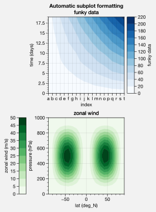

Panels
======

It is common to need “panels” for plotting secondary 1-dimensional
datasets or summary statistics. It is also common to need colorbars or
legends along the edges of axes or the figure. Setting these up can be
incredibly time-consuming with the default matplotlib API. To make this
easier, ProPlot introduces the “panels” construct, powered by the
``~proplot.axes.PanelAxes`` class.

Axes panels
-----------

To add arbitrary combinations of panels to the left, bottom, right, or
top sides of axes with the ``~proplot.subplots.subplots`` ``axpanels``
keyword arg. To modify panel properties, simply pass a dictionary to
``axpanels_kw``. The subplots will stay correctly aligned no matter the
combination of panels. See ``~proplot.subplots.subplots`` and
``~proplot.subplots.Figure.add_subplot_and_panels`` for details.

.. code:: ipython3

    # Arbitrarily complex combinations are possible, and inner spaces still determined automatically
    import proplot as plot
    f, axs = plot.subplots(axwidth=2, nrows=2, ncols=2,
                           axpanels={1:'t', 2:'l', 3:'b', 4:'r'},
                           tight=True, share=0, span=0, wratios=[1,2])
    axs.format(title='Title', suptitle='This is a super title', collabels=['Column 1','Column 2'],
               abcloc='ul', titleloc='uc', xlabel='xlabel', ylabel='ylabel', abc=True, top=False)
    axs.format(xlim=(0,1), ylim=(0,1), ylocator=plot.arange(0.2,0.8,0.2), xlocator=plot.arange(0.2,0.8,0.2))

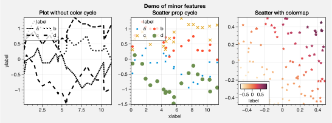

If you want “colorbar” panels, the simplest option is to use the
``axcolorbar`` and ``axcolorbar_kw`` keywords instead of ``axpanels``
and ``axpanels_kw``. This makes the width of the panels more appropriate
for filling with a colorbar. Similarly, you can also use the
``axlegend`` and ``axlegend_kw`` args. You can modify these default
spacings with a custom ``.proplotrc`` file (see the ``~proplot.rcmod``
documentation).

If you want panels “flush” against the subplot, simply use the ``flush``
keyword args. If you want to disable “axis sharing” with the parent
subplot (i.e. you want to draw tick labels on the panel, and do not want
to inherit axis limits from the main subplot), use any of the ``share``
keyword args. Again, see ``~proplot.subplots.subplots`` and
``~proplot.subplots.Figure.add_subplot_and_panels`` for details.

.. code:: ipython3

    import proplot as plot
    import numpy as np
    f, axs = plot.subplots(axwidth=1.7, nrows=2, ncols=2, share=0, span=False, panelpad=0.1,
                           axpanels='r', axcolorbars='b', axpanels_kw={'rshare':False, 'rflush':True})
    axs.format(xlabel='xlabel', ylabel='ylabel', suptitle='This is a super title')
    for i,ax in enumerate(axs):
        ax.format(title=f'Dataset {i+1}')
    data = (np.random.rand(20,20)-0.1).cumsum(axis=1)
    m = axs.contourf(data, cmap='glacial', levels=plot.arange(-1,11))[0]
    axs.rpanel.plot(data.mean(axis=1), np.arange(20), color='k')
    axs.rpanel.format(title='Mean')
    axs.bpanel.colorbar(m, label='cbar')

.. parsed-literal::

    (<matplotlib.colorbar.Colorbar at 0xd60715278>,
     <matplotlib.colorbar.Colorbar at 0xd630d99b0>,
     <matplotlib.colorbar.Colorbar at 0x119ee2d68>,
     <matplotlib.colorbar.Colorbar at 0xd62b5d4e0>)

.. image:: quickstart/quickstart_35_1.svg

Figure panels
-------------

ProPlot also supports “global” colorbars or legends, meant to reference
multiple subplots at once. Global colorbars and legends can extend
across entire sides of the figure, or across arbitrary contiguous rows
and columns of subplots. The associated axes instances are found on the
``~proplot.subplots.Figure`` instance under the names ``bottompanel``,
``leftpanel``, and ``rightpanel`` (or the shorthands ``bpanel``,
``lpanel``, and ``rpanel``). See ``~proplot.subplots.subplots`` for
details.

.. code:: ipython3

    import proplot as plot
    import numpy as np
    f, axs = plot.subplots(ncols=3, nrows=3, axwidth=1.2, colorbar='br', bspan=[1,2,2])
    m = axs.pcolormesh(np.random.rand(20,20), cmap='grays', levels=np.linspace(0,1,11), extend='both')[0]
    axs.format(suptitle='Super title', abc=True, abcloc='l', abcformat='a.', xlabel='xlabel', ylabel='ylabel')
    f.bpanel[0].colorbar(m, label='label', ticks=0.5)
    f.bpanel[1].colorbar(m, label='label', ticks=0.2)
    f.rpanel.colorbar(m, label='label', ticks=0.1, length=0.7)

.. parsed-literal::

    <matplotlib.colorbar.Colorbar at 0xd63cb4ac8>

.. image:: quickstart/quickstart_38_1.svg

.. code:: ipython3

    import proplot as plot
    import numpy as np
    f, axs = plot.subplots(ncols=4, axwidth=1.3, colorbar='b', bspan=[1,1,2,2], share=0, span=0, wspace=0.3)
    data = (np.random.rand(50,50)-0.1).cumsum(axis=0)
    m = axs[:2].contourf(data, cmap='grays', extend='both')
    cycle = plot.colors('grays', 5)
    hs = []
    for abc,color in zip('ABCDEF',cycle):
        h = axs[2:].plot(np.random.rand(10), lw=3, color=color, label=f'line {abc}')
        hs.extend(h[0])
    f.bpanel[0].colorbar(m[0], length=0.8, label='label')
    f.bpanel[1].legend(hs, ncols=5, label='label', frame=False)
    axs.format(suptitle='Global colorbar and global legend', abc=True, abcloc='ul', abcformat='A')
    for ax,title in zip(axs, ['2D dataset #1', '2D dataset #2', 'Line set #1', 'Line set #2']):
        ax.format(xlabel='xlabel', title=title)

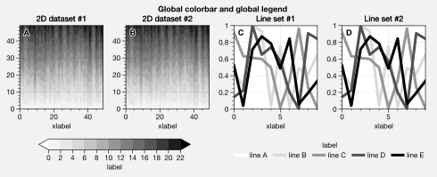

Stacked panels
--------------

ProPlot also allows arbitrarily *stacking* panels with the ``lstack``,
``bstack``, ``rstack``, and ``tstack`` keyword args. This can be useful
when you want multiple figure colorbars, when you have illustrations
with multiple colormaps inside a single axes, or when you need multiple
panels for displaing various statistics across one dimension of a
primary axes. The stacked panel spacing is adjusted automatically to
account for axis and tick labels. See ``~proplot.subplots.subplots`` for
details.

.. code:: ipython3

    import proplot as plot
    import numpy as np
    f, axs = plot.subplots(nrows=2, axwidth=0.8, span=False, share=0,
                          axcolorbars='l', axcolorbars_kw={'lstack':3},
                          axpanels='r', axpanels_kw={'rstack':2, 'rflush':True, 'rwidth':0.5}
                          )
    axs[0].format(title='Stacked panel demo', titleweight='bold')
    # Draw stuff in axes
    n = 10
    for ax in axs:
        # Colormap data
        ax.format(xlabel='data', xlocator=np.linspace(0, 0.8, 5))
        for i,(x0,y0,x1,y1,cmap,scale) in enumerate(((0,0.5,1,1,'greys',0.5), (0,0,0.5,0.5,'reds',1), (0.5,0,1,0.5,'blues',2))):
            data = np.random.rand(n,n)*scale
            x, y = np.linspace(x0, x1, 11), np.linspace(y0, y1, 11)
            m = ax.pcolormesh(x, y, data, cmap=cmap, levels=np.linspace(0,scale,11))
            ax.lpanel[i].colorbar(m)
        # Plot data
        for i,pax in enumerate(ax.rpanel):
            func = data.mean if i==0 else data.std
            pax.plot(func(axis=1), plot.arange(0.05, 0.95, 0.1), lw=2, color='k')
            pax.format(xlabel='mean' if i==0 else 'stdev', xlim=(0,1), xlocator=(0,0.5))

.. image:: quickstart/quickstart_41_0.svg

Colorbars
---------

To generate colorbars, simply use the ``colorbar`` methods on the
``~proplot.axes.BaseAxes`` and ``~proplot.axes.PanelAxes`` classes. When
you call ``~proplot.axes.BaseAxes.colorbar`` on a
``~proplot.axes.BaseAxes``, an **inset** colorbar is generated. When you
call ``~proplot.axes.PanelAxes.colorbar`` on a
``~proplot.axes.PanelAxes``, the axes is **filled** with a colorbar (see
:ref:``Axes panels`` and :ref:``Figure panels``). You can also generate
colorbars by passing the ``colorbar`` keyword arg to methods wrapped by
``~proplot.colortools.cmap_wrapper`` and
``~proplot.colortools.cycle_wrapper``.

.. code:: ipython3

    import proplot as plot
    import numpy as np
    f, ax = plot.subplots(colorbar='b', tight=True, axwidth=2)
    m = ax.contourf((np.random.rand(20,20)).cumsum(axis=0), extend='both', levels=np.linspace(0,10,11), cmap='matter')
    ax.format(xlabel='xlabel', ylabel='ylabel', xlim=(0,19), ylim=(0,19))
    ax.colorbar(m, ticks=2, label='data label', frameon=True)
    ax.colorbar(m, ticks=2, loc='lower left', frameon=False)
    f.bpanel.colorbar(m, label='standard outer colorbar', length=0.9)
    ax.format(suptitle='ProPlot colorbars')

.. image:: quickstart/quickstart_44_0.svg

ProPlot adds several new features to the
``~matplotlib.figure.Figure.colorbar`` command, powered by the
``~proplot.wrappers.colorbar_wrapper`` wrapper. A particular handy
feature is the ability to draw colorbars from lists of colors or lists
of artists, instead of just “mappable” objects (e.g. the return value of
``~matplotlib.axes.Axes.contourf``). A colormap is constructed
on-the-fly from the corresponding colors, as shown below.

.. code:: ipython3

    import proplot as plot
    import numpy as np
    plot.rc.cycle = 'qual2'
    f, ax = plot.subplots(colorbar='b', axwidth=3, aspect=1.5)
    hs = ax.plot((np.random.rand(12,12)-0.45).cumsum(axis=0), lw=5)
    ax.format(suptitle='ProPlot line object colorbar', xlabel='x axis', ylabel='y axis')
    f.bpanel.colorbar(hs, values=np.arange(0,len(hs)), label='numeric values', tickloc='bottom')

.. parsed-literal::

    <matplotlib.colorbar.Colorbar at 0xd2cde8978>

.. image:: quickstart/quickstart_46_1.svg

Legends
-------

ProPlot also adds new features to the ``~matplotlib.axes.Axes.legend``
command, powered by the ``~proplot.wrappers.legend_wrapper`` wrapper.
When you call ``~proplot.axes.PanelAxes.legend`` on a
``~proplot.axes.PanelAxes``, the axes is **filled** with a legend (see
:ref:``Axes panels`` and :ref:``Figure panels``). That is, a centered
legend is drawn and the axes spines are made invisible. You can also
generate legends by passing the ``legends`` keyword arg to methods
wrapped by ``~proplot.colortools.cycle_wrapper``.

Legend entries are now sorted in row-major order by default; you can
switch back to column-major by passing ``order='F'`` to
``~proplot.wrappers.legend_wrapper``. You can also *center legend rows*
with the ``center`` keyword arg, or by passing a list of lists of plot
handles. This is accomplished by stacking multiple single-row,
horizontally centered legends, then manually adding an encompassing
legend frame.

.. code:: ipython3

    import proplot as plot
    import numpy as np
    plot.rc.cycle = 'contrast'
    labels = ['a', 'bb', 'ccc', 'dddd', 'eeeee', 'ffffff']
    f, axs = plot.subplots(ncols=2, legends='b', panels='r', span=False, share=0)
    hs = []
    for i,label in enumerate(labels):
        h = axs.plot(np.random.rand(20), label=label, lw=3)[0]
        hs.extend(h)
    axs[0].legend(order='F', frameon=True, loc='lower left')
    f.bpanel[0].legend(hs, ncols=4, center=False, frameon=True)
    f.bpanel[1].legend(hs, ncols=4, center=True)
    f.rpanel.legend(hs, ncols=1, center=True)
    axs.format(ylim=(-0.1, 1.1), xlabel='xlabel', ylabel='ylabel',
               suptitle='ProPlot legend options')
    for ax,title in zip(axs, ['Inner and outer legends', 'Outer centered-row legends']):
        ax.format(title=title)

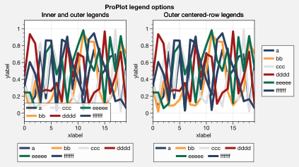

Cartesian axes
==============

The previous sections discussed features relevant to all figures
generated with ProPlot, or with axes regardless of whether or not they
contain map projections. This section discusses a few features specific
to Cartesian axes, powered by the ``~proplot.axes.XYAxes`` class.

Label sharing and spanning
--------------------------

Matplotlib has an “axis sharing” feature – but all this can do is hold
the axis limits the same. ProPlot introduces **4 axis-sharing
“levels”**, as demonstrated below. It also introduces a new
**axis-spanning label** feature, as seen below. See
``~proplot.subplots.subplots`` for details.

.. code:: ipython3

    import proplot as plot
    import numpy as np
    N = 50
    M = 40
    colors = plot.colors('grays_r', M, 90, left=0.1, right=0.8)
    for share in (0,1,2,3):
        f, axs = plot.subplots(ncols=4, aspect=1, wspace=0.5, axwidth=1.2, sharey=share, spanx=share//2)
        gen = lambda scale: scale*(np.random.rand(N,M)-0.5).cumsum(axis=0)[N//2:,:]
        for ax,scale,color in zip(axs,(1,3,7,0.2),('gray9','gray7','gray5','gray3')):
            array = gen(scale)
            for l in range(array.shape[1]):
                ax.plot(array[:,l], color=colors[l])
            ax.format(suptitle=f'Axis-sharing level: {share}, spanning labels {["off","on"][share//2]}', ylabel='y-label', xlabel='x-axis label')

.. image:: quickstart/quickstart_53_0.svg

.. image:: quickstart/quickstart_53_1.svg

.. image:: quickstart/quickstart_53_2.svg

.. image:: quickstart/quickstart_53_3.svg

.. code:: ipython3

    import proplot as plot
    import numpy as np
    plot.rc.cycle = 'Set3'
    titles = ['With redundant labels', 'Without redundant labels']
    for mode in (0,1):
        f, axs = plot.subplots(nrows=4, ncols=4, share=3*mode, span=1*mode, axwidth=1)
        for ax in axs:
            ax.plot((np.random.rand(100,20)-0.4).cumsum(axis=0))
        axs.format(xlabel='x-label', ylabel='y-label', suptitle=titles[mode], abc=mode, abcloc='ul')

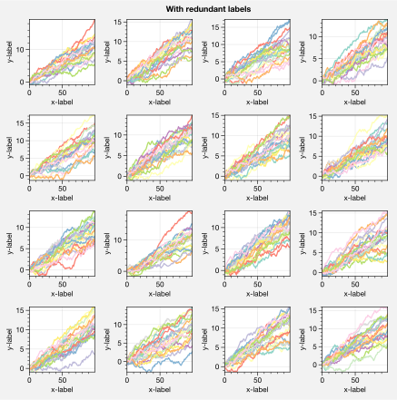

.. image:: quickstart/quickstart_54_1.svg

Axis tick locations
-------------------

ProPlot lets you easily specify tick locations with
``~proplot.axes.BaseAxes.format`` (keywords ``xlocator``, ``ylocator``,
``xminorlocator``, and ``yminorlocator``, or their aliases ``xticks``,
``yticks``, ``xminorticks``, and ``yminorticks``). Pass a number to tick
every ``N`` data values, lookup a builtin matplotlib
``~matplotlib.ticker`` with a string key name, or pass a list of numbers
to tick specific locations. I recommend using ProPlot’s
``~proplot.utils.arange`` function to generate lists of ticks – it’s
like numpy’s ``~numpy.arange``, but is **endpoint-inclusive**, which is
usually what you’ll want in this context. See
``~proplot.axes.XYAxes.format_partial`` and
``~proplot.axistools.Locator`` for details.

.. code:: ipython3

    import proplot as plot
    import numpy as np
    plot.rc.facecolor = plot.shade('powder blue', 1.15) # shade makes it a bit brighter, multiplies luminance channel by this much!
    plot.rc.update(linewidth=1, small=10, large=12, color='dark blue', suptitlecolor='dark blue')
    f, axs = plot.subplots(nrows=5, axwidth=5, aspect=(8,1), share=0, span=0, hspace=0.3)
    # Basic locators
    axs[0].format(xlim=(0,200), xminorlocator=10, xlocator=30, suptitle='Declaring tick locations with ProPlot')
    axs[1].format(xlim=(0,10), xlocator=[0, 0.3,0.8,1.6, 4.4, 8, 8.8, 10], xminorlocator=0.1)
    axs[2].format(xlim=(1,100), xscale='log', xformatter='default') # use this to prevent exponential notation
    axs[3].format(xlim=(1,10), xscale='inverse', xlocator='linear')
    # Index locators are weird...require something plotted in the axes, will only label up bounds of data range
    # For below, could also use ('index', [...]) (i.e. an IndexFormatter), but not sure why this exists when we can just use FixedFormatter
    axs[4].plot(np.arange(10)-5, np.random.rand(10), alpha=0) # index locators 
    axs[4].format(xlim=(0,6), xlocator='index',
                  xformatter=[r'$\alpha$', r'$\beta$', r'$\gamma$', r'$\delta$', r'$\epsilon$', r'$\zeta$', r'$\eta$'])

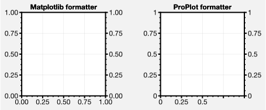

Axis tick labels
----------------

ProPlot changes the default axis formatter (i.e. the class used to
convert float numbers to tick label strings). The new formatter trims
trailing zeros by default, and can be used to *filter tick labels within
some data range*, as demonstrated below. See
``~proplot.axistools.AutoFormatter`` for details.

.. code:: ipython3

    import proplot as plot
    locator = [0, 0.25, 0.5, 0.75, 1]
    plot.rc.linewidth = 2
    plot.rc.small = plot.rc.large = 12
    f, axs = plot.subplots(ncols=2, axwidth=2, share=0, subplotpad=0.5) # change subplotpad to change padding between subplots
    axs[1].format(xlocator=locator, ylocator=locator, xtickrange=[0,0.5], yticklabelloc='both', title='ProPlot formatter', titleweight='bold')
    axs[0].format(xlocator=locator, ylocator=locator, yticklabelloc='both', xformatter='scalar', yformatter='scalar', title='Matplotlib formatter', titleweight='bold')

.. image:: quickstart/quickstart_60_0.png
   :width: 569px
   :height: 237px

ProPlot also lets you easily change the axis formatter with
``~proplot.axes.BaseAxes.format`` (keywords ``xformatter`` and
``yformatter``, or their aliases ``xticklabels`` and ``yticklabels``).
The builtin matplotlib formatters can be referenced by string name, and
several new formatters have been introduced – for example, you can now
easily label your axes as fractions or as geographic coordinates. You
can also just pass a list of strings or a ``%``-style format directive.
See ``~proplot.axes.XYAxes.format_partial`` and
``~proplot.axistools.Formatter`` for details.

.. code:: ipython3

    import proplot as plot
    import numpy as np
    plot.rc.update(linewidth=1.2, small=10, large=12, facecolor='gray8', figurefacecolor='gray8',
                   suptitlecolor='w', gridcolor='w', color='w')
    f, axs = plot.subplots(nrows=6, axwidth=5, aspect=(8,1), share=0, span=0, hspace=0.3)
    axs[0].format(xlim=(0,4*np.pi), xlocator=plot.arange(0, 4, 0.25)*np.pi, xformatter='pi')
    axs[1].format(xlim=(0,2*np.e), xlocator=plot.arange(0, 2, 0.5)*np.e, xticklabels='e')
    axs[2].format(xlim=(-90,90), xlocator=plot.arange(-90, 90, 30), xformatter='deglat')
    axs[3].format(xlim=(-1.01,1), xlocator=0.5, xticklabels=['a', 'b', 'c', 'd', 'e'])
    axs[4].format(xlim=(0, 0.001), xlocator=0.0001, xformatter='%.E')
    axs[5].format(xlim=(0,100), xtickminor=False, xlocator=20, xformatter='{x:.1f}')
    axs.format(ylocator='null', suptitle='Setting tick styles with ProPlot')

.. image:: quickstart/quickstart_62_0.svg

Datetime axes
-------------

Labeling datetime axes is incredibly easy with ProPlot. Pass a time-unit
string as the ``locator`` argument, and the axis will be ticked at those
units. Pass a ``(unit, interval)`` tuple to tick every ``interval``
``unit``\ s. Use the ``formatter`` argument for `%-style formatting of
datetime <https://docs.python.org/3/library/datetime.html#strftime-strptime-behavior>`__.
Again, see ``~proplot.axes.XYAxes.format_partial``,
``~proplot.axistools.Locator``, and ``~proplot.axistools.Formatter`` for
details.

.. code:: ipython3

    import proplot as plot
    import numpy as np
    plot.rc.update(linewidth=1.2, small=10, large=12, ticklabelweight='bold', ticklenratio=0.7,
                   figurefacecolor='w', facecolor=plot.shade('C0', 2.7), abcformat='BBBa')
    f, axs = plot.subplots(nrows=5, axwidth=6, aspect=(8,1), share=0, span=0, hspace=0.3)
    axs[0].format(xlim=(np.datetime64('2000-01-01'), np.datetime64('2001-01-02')),
                  xrotation=0) # default date locator enabled if you plot datetime data or set datetime limits
    axs[1].format(xlim=(np.datetime64('2000-01-01'), np.datetime64('2050-01-01')), xrotation=0,
                  xlocator=('year', 10), xformatter='\'%y') # minor ticks every month
    axs[2].format(xlim=(np.datetime64('2000-01-01T00:00:00'), np.datetime64('2000-01-01T12:00:00')), xrotation=0,
                  xlocator=('hour',range(0,24,2)), xminorlocator=('minute',range(0,60,10)), xformatter='T%H:%M:%S') # minor ticks every 10 minutes, major every 2
    axs[3].format(xlim=(np.datetime64('2000-01-01'), np.datetime64('2008-01-01')),
                  xlocator='year', xminorlocator='month', xformatter='%b %Y') # minor ticks every month
    axs[4].format(xlim=(np.datetime64('2000-01-01'), np.datetime64('2001-01-01')),
                  xgridminor=True, xgrid=False,
                  xlocator='month', xminorlocator='weekday', xformatter='%B') # minor ticks every Monday, major every month
    axs.format(ylocator='null', suptitle='Datetime axis tick labels with ProPlot')

.. image:: quickstart/quickstart_65_0.svg

Axis scales
-----------

The axis scale (e.g. ``'log'``, ``'linear'``) can now be changed with
``~proplot.axes.BaseAxes.format``, and ProPlot adds several new ones.
The ``'cutoff'`` scale is great when you have weirdly distributed data
(see ``~proplot.axistools.CutoffScaleFactory``). The ``'sine'`` scale
scales the axis as the sine of the coordinate, resulting in an
“area-weighted” spherical latitude coordinate. The ``'inverse'`` scale
is perfect for labeling spectral coordinates (this is more useful with
the ``~proplot.axes.XYAxes.dualx`` and ``~proplot.axes.XYAxes.dualy``
commands; see :ref:``Alternative units``). See
``~proplot.axes.XYAxes.format_partial`` and ``~proplot.axistools.Scale``
for details.

.. code:: ipython3

    import proplot as plot
    f, axs = plot.subplots(ncols=2, axwidth=1.8, share=0, span=False)
    ax = axs[0]
    ax.format(xlim=(0,1), ylim=(1e-3, 1e3), xscale='linear', yscale='log',
              ylabel='log scale', xlabel='linear scale', suptitle='Changing the axis scale')
    ax = axs[1]
    ax.format(xlim=(0,1), ylim=(-1e3, 1e3), yscale='symlog', xlabel='linear', ylabel='symlog scale')

.. image:: quickstart/quickstart_68_0.svg

.. code:: ipython3

    import proplot as plot
    import numpy as np
    # plot.rc.fontname = 'Verdana'
    f, axs = plot.subplots(width=6, nrows=4, aspect=(5,1), sharey=False, sharex=False)
    # Compression
    ax = axs[0]
    x = np.linspace(0,4*np.pi,100)
    dy = np.linspace(-1,1,5)
    y1 = np.sin(x)
    y2 = np.cos(x)
    data = np.random.rand(len(dy)-1, len(x)-1)
    scales = [(3, np.pi), (0.3, 3*np.pi), (np.inf, np.pi, 2*np.pi), (5, np.pi, 2*np.pi)]
    titles = ('Zoom out of left', 'Zoom into left', 'Discrete cutoff', 'Fast jump')
    locators = [np.pi/3, np.pi/3, *([x*np.pi for x in plot.arange(0, 4, 0.25) if not (1 < x <= 2)] for i in range(2))]
    for ax,scale,title,locator in zip(axs,scales,titles,locators):
        ax.pcolormesh(x, dy, data, cmap='grays', cmap_kw={'right': 0.8})
        for y,color in zip((y1,y2), ('coral','sky blue')):
            ax.plot(x, y, lw=4, color=color)
        ax.format(xscale=('cutoff', *scale), title=title,
                  xlim=(0,4*np.pi), ylabel='wave amplitude', # note since 'spanning labels' turned on by default, only one label is drawn
                  xformatter='pi', xlocator=locator,
                  xtickminor=False, xgrid=True, ygrid=False, suptitle='Cutoff scales showcase')

.. image:: quickstart/quickstart_69_0.svg

.. code:: ipython3

    import proplot as plot
    import numpy as np
    f, axs = plot.subplots(nrows=3, ncols=2, axwidth=1.5, span=False, share=0)
    axs.format(rowlabels=['Power\nscales', 'Exp\nscales', 'Geographic\nscales'], suptitle='Esoteric scales showcase')
    x = np.linspace(0,1,50)
    y = 10*x
    data = np.random.rand(len(y)-1, len(x)-1)
    # Power scales
    colors = ('coral','sky blue')
    for ax,power,color in zip(axs[:2],(2,1/4),colors):
        ax.pcolormesh(x, y, data, cmap='grays', cmap_kw={'right': 0.8})
        ax.plot(x, y, lw=4, color=color)
        ax.format(ylim=(0.1,10), yscale=('power',power), title=f'$x^{{{power}}}$')
    # Exp scales
    for ax,a,c,color in zip(axs[2:4],(np.e,2),(0.5,-1),colors):
        ax.pcolormesh(x, y, data, cmap='grays', cmap_kw={'right': 0.8})
        ax.plot(x, y, lw=4, color=color)
        ax.format(ylim=(0.1,10), yscale=('exp',a,c), title=f'${a}^{{{c}x}}$')
    # Geographic scales
    n = 20
    x = np.linspace(-180,180,n)
    y = np.linspace(-85,85,n) # note sine just truncated values not in [-90,90], but Mercator transformation can reflect them
    y2 = np.linspace(-85,85,n) # for pcolor
    data = np.random.rand(len(x), len(y2))
    for ax,scale,color in zip(axs[4:],('sine','mercator'),('coral','sky blue')):
        ax.plot(x, y, '-', color=color, lw=4)
        ax.pcolormesh(x, y2, data, cmap='grays', cmap_kw={'right': 0.8}) # use 'right' to trim the colormap from 0-1 color range to 0-0.8 color range
        ax.format(title=scale.title() + ' y-axis', yscale=scale,
                  ytickloc='left',
                  yformatter='deglat', grid=False, ylocator=20,
                  xscale='linear', xlim=None, ylim=(-85,85))

.. image:: quickstart/quickstart_70_0.svg

Alternative units
-----------------

The new ``~proplot.axes.XYAxes.dualx`` and
``~proplot.axes.XYAxes.dualy`` methods build duplicate *x* and *y* axes
meant to represent *alternate units* in the same coordinate range as the
“parent” axis.

For simple transformations, just use the ``offset`` and ``scale``
keyword args. For more complex transformations, pass the name of any
registered “axis scale” to the ``xscale`` or ``yscale`` keyword args
(see below).

.. code:: ipython3

    import proplot as plot
    plot.rc.update({'grid.alpha':0.4, 'linewidth':1, 'grid.linewidth':1})
    f, axs = plot.subplots(ncols=2, share=0, span=0, aspect=2.2, axwidth=3)
    N = 200
    c1, c2 = plot.shade('cerulean', 0.5), plot.shade('red', 0.5)
    # These first 2 are for general users
    ax = axs[0]
    ax.format(yformatter='null', xlabel='meters', xlocator=1000, xlim=(0,5000),
              xcolor=c2, gridcolor=c2,
              suptitle='Duplicate x-axes with simple, custom transformations', ylocator=[], # locator=[] has same result as locator='null'
              )
    ax.dualx(scale=1e-3, xlabel='kilometers', grid=True, xcolor=c1, gridcolor=c1)
    ax = axs[1]
    ax.format(yformatter='null', xlabel='temperature (K)', title='', xlim=(200,300), ylocator='null',
             xcolor=c2, gridcolor=c2)
    ax.dualx(offset=-273.15, xlabel='temperature (\N{DEGREE SIGN}C)',
             xcolor=c1, gridcolor=c1, grid=True)
    
    # These next 2 are for atmospheric scientists; note the assumed scale height is 7km
    f, axs = plot.subplots(ncols=2, share=0, span=0, aspect=0.4, axwidth=1.8)
    ax = axs[0]
    ax.format(xformatter='null', ylabel='pressure (hPa)', ylim=(1000,10), xlocator=[], 
              gridcolor=c1, ycolor=c1)
    ax.dualy(yscale='height', ylabel='height (km)', yticks=2.5, color=c2, gridcolor=c2, grid=True)
    ax = axs[1] # span
    ax.format(xformatter='null', ylabel='height (km)', ylim=(0,20), xlocator='null', gridcolor=c2, ycolor=c2,
              suptitle='Duplicate y-axes with special transformations', grid=True)
    ax.dualy(yscale='pressure', ylabel='pressure (hPa)', ylocator=100, grid=True, color=c1, gridcolor=c1)

.. image:: quickstart/quickstart_73_0.svg

.. image:: quickstart/quickstart_73_1.svg

.. code:: ipython3

    # Plot the response function for an imaginary 5-day lowpass filter
    import proplot as plot
    import numpy as np
    plot.rc['axes.ymargin'] = 0
    cutoff = 0.3
    x = np.linspace(0.01,0.5,1000) # in wavenumber days
    response = (np.tanh(-((x - cutoff)/0.03)) + 1)/2 # imgarinary response function
    f, ax = plot.subplots(aspect=(3,1), width=6)#, tight=False, top=2)
    ax.fill_between(x, 0, response, facecolor='none', edgecolor='gray8', lw=1, clip_on=True)
    red = plot.shade('red', 0.5)
    ax.axvline(cutoff, lw=2, ls='-', color=red)
    ax.fill_between([0.27, 0.33], 0, 1, color=red, alpha=0.3)
    ax.format(xlabel='wavenumber (days$^{-1}$)', ylabel='response', gridminor=True)
    ax.dualx(xscale='inverse', xlocator=np.array([20, 10, 5, 2, 1, 0.5, 0.2, 0.1, 0.05]),
              xlabel='period (days)',
              title='Imgaginary response function',
              suptitle='Duplicate x-axes with wavenumber and period', 
              )

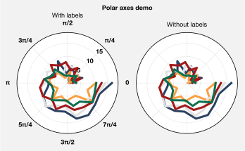

Polar projections
-----------------

Polar axes in ProPlot work just like Cartesian axes, except the
``~proplot.axes.XYAxes`` ``~proplot.axes.XYAxes.format_partial`` ``x``
and ``y`` keyword args correspond to the “theta” and “radius” axes,
respectively. To declare polar axes, use ``~proplot.subplots.subplots``
to set the global projection ``proj='polar'`` or an axes-specific
projection ``proj={1:'polar'}``; see :ref:``Map projection axes`` for
more on specifying the projection.

.. code:: ipython3

    import proplot as plot
    import numpy as np
    # Figure
    f, axs = plot.subplots(proj='polar', ncols=2)
    axs.format(suptitle='Polar axes demo', collabels=['Line 1', 'Line 2'])
    # Plot and format
    N = 20
    axs.plot(np.linspace(0, 2*np.pi, N), np.random.rand(N,5).cumsum(axis=0), cycle='ggplot', lw=3)
    axs.format(linewidth=1.2, ticklabelsize=9, ticklabelweight='bold',
               xformatter='pi', ylocator=2, ytickloc=45)

.. image:: quickstart/quickstart_77_0.svg

Map projection axes
===================

ProPlot includes seamless integration with the ``cartopy`` and
``~mpl_toolkits.basemap`` packages. This feature is optional – if you
don’t care about cartographic projections, you don’t need to have
``cartopy`` or ``~mpl_toolkits.basemap`` installed.

To specify the projection, supply ``~proplot.subplots.subplots`` with
the ``proj`` keyword arg. To specify the projection properties, use the
``proj_kw`` keyword arg (see below). To toggle ``~mpl_toolkits.basemap``
for arbitrary subplots, use the ``basemap`` keyword arg. See
``~proplot.subplots.subplots`` for details.

Note that in 2020, active development for ``~mpl_toolkits.basemap`` will
stop. Its users are encouraged to switch to ``cartopy``, which is
integrated more closely with the matplotlib API and has more room for
growth. However for the time being, ``~mpl_toolkits.basemap`` has one
major advantage: meridian and parallel labeling. With ``cartopy``,
gridline labels are only possible with equirectangular and Mercator
projections. With ``~mpl_toolkits.basemap``, labels are possible with
all projections. Further, the ``~matplotlib.axes.Axes.tight_layout``
method does not currently detect ``cartopy`` gridline labels – so when
labels are present, the :ref:``Automatic subplot spacing`` feature must
be automatically disabled.

Registered cartopy projections
------------------------------

Below is an illustration of the available ``cartopy`` projections. See
the ``~proplot.projs`` documentation for a table of projection names,
short names, and links to the
`PROJ.4 <https://proj4.org/operations/projections/index.html>`__
documentation (both ``cartopy`` and ``~mpl_toolkits.basemap`` are
internally powered by `PROJ.4 <https://proj4.org>`__).

Note that you no longer have to reference the ``cartopy.crs.Projection``
classes directly – instead, just like ``~mpl_toolkits.basemap``, you can
specify a native PROJ.4 short name (e.g. ``'robin'`` or ``'merc'``).
ProPlot also adds to ``cartopy`` the previously unavailable Aitoff,
Hammer, Winkel Tripel, and Kavrisky VII projections by subclassing the
``cartopy.crs.Projection`` class.

.. code:: ipython3

    import proplot as plot
    import numpy as np
    projs = ['cyl', 'merc', 'mill', 'lcyl', 'tmerc',
             'robin', 'hammer', 'moll', 'kav7', 'aitoff', 'wintri', 'sinu',
             'geos', 'ortho', 'nsper', 'aea', 'eqdc', 'lcc', 'gnom', 'npstere', 'igh',
             'eck1', 'eck2', 'eck3', 'eck4', 'eck5', 'eck6']
    f, axs = plot.subplots(ncols=3, nrows=9, left=0.1, bottom=0.1, right=0.1, top=0.5, proj=projs)
    axs.format(land=True, reso='lo', labels=False, suptitle='Table of cartopy projections')
    for proj,ax in zip(projs,axs):
        ax.format(title=proj, titleweight='bold', labels=False)

.. parsed-literal::

    /Users/ldavis/anaconda3/lib/python3.6/site-packages/cartopy/mpl/feature_artist.py:163: UserWarning: Unable to determine extent. Defaulting to global.
      warnings.warn('Unable to determine extent. Defaulting to global.')

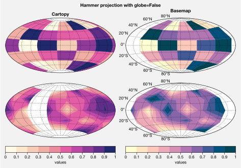

Registered basemap projections
------------------------------

Below is an illustration of the available ``~mpl_toolkits.basemap``
projections. ``~mpl_toolkits.basemap`` projection bounds are more
limited than ``cartopy`` bounds, and tend to be “rectangles.” Also, with
the default ``~mpl_toolkits.basemap`` API, you must specify projection
keyword args *explicitly* or an error is thrown (e.g. failing to set
``lon_0`` or ``lat_0``). To prevent this annoyance, ProPlot passes
default keyword args to ``~mpl_toolkits.basemap.Basemap`` if you fail to
specify them.

.. code:: ipython3

    import proplot as plot
    import numpy as np
    projs = ['cyl', 'merc', 'mill', 'cea', 'gall', 'sinu',
             'eck4', 'robin', 'moll', 'kav7', 'hammer', 'mbtfpq',
             'geos', 'ortho', 'nsper',
             'vandg', 'aea', 'eqdc', 'gnom', 'cass', 'lcc',
             'npstere', 'npaeqd', 'nplaea', 'spstere', 'spaeqd', 'splaea']
    f, axs = plot.subplots(ncols=3, nrows=9, left=0.1, bottom=0.1, right=0.1, top=0.5, basemap=True, proj=projs)
    axs.format(land=True, labels=False, suptitle='Table of basemap projections')
    for proj,ax in zip(projs,axs):
        ax.format(title=proj, titleweight='bold', labels=False)

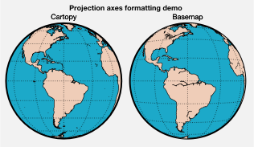

Geophysical data
----------------

The below demonstrates how to plot geophysical data with ProPlot. You’ll
note that ProPlot considerably simplifies ``~mpl_toolkits.basemap``
usage. For data plotted on ``~mpl_toolkits.basemap`` projections, the
longitudes are *cyclically permuted* so that the “center” aligns with
the central longitude of the projection. You can also simply call the
axes method, e.g. ``~matplotlib.axes.Axes.contourf``, instead of calling
the method on the ``~mpl_toolkits.basemap.Basemap`` instance! And for
``cartopy`` axes, you no longer need to pass
``transform=crs.PlateCarree()`` to the plotting method (as I found
myself doing 99% of the time); ProPlot makes this the default. Finally,
for both ``~mpl_toolkits.basemap`` and ``cartopy``, you can pass
``globe=True`` to plotting commands to ensure global data coverage.

These features are powered by the ``~proplot.axes.cartopy_gridfix`` and
``~proplot.axes.basemap_gridfix`` wrappers.

.. code:: ipython3

    import proplot as plot
    import numpy as np
    # First make figure
    offset = -40
    x = plot.arange(0+offset, 360+offset-1, 60)
    y = plot.arange(-60,60+1,30)
    data = np.random.rand(len(y), len(x))
    for globe in (False,True):
        f, axs = plot.subplots(ncols=2, nrows=2, axwidth=3,
                               colorbars='b', proj='hammer', proj_kw={'lon_0':0},
                               basemap={(1,3):False, (2,4):True},
                               )
        for ax,p,pcolor,basemap in zip(axs,range(4),[1,1,0,0],[0,1,0,1]):
            m = None
            cmap = ('sunset', 'sunrise')[basemap]
            levels = [0, .3, .5, .7, .9, 1]
            levels = np.linspace(0,1,11)
            if pcolor:
                m = ax.pcolor(x, y, data, levels=levels, cmap=cmap, extend='neither', globe=globe)
                ax.scatter(np.random.rand(50)*180, 180*np.random.rand(50), color='charcoal')
            if not pcolor:
                m = ax.contourf(x, y, data, levels=levels, cmap=cmap, extend='neither', globe=globe)
                ax.scatter(np.random.rand(50)*180, 180*np.random.rand(50), color='charcoal')
            ax.format(suptitle=f'Hammer projection with globe={globe}', collabels=['Cartopy', 'Basemap'], labels=True)
            if p<2:
                c = f.bpanel[p].colorbar(m, label='values', tickminor=False)

.. parsed-literal::

    Warning: Cannot label meridians on Hammer basemapWarning: Cannot label meridians on Hammer basemapWarning: Cannot label meridians on Hammer basemapWarning: Cannot label meridians on Hammer basemap

.. image:: quickstart/quickstart_88_1.svg

.. image:: quickstart/quickstart_88_2.svg

Projection formatting
---------------------

To pass keywords to ``~mpl_toolkits.basemap.Basemap`` and
``cartopy.crs.Projection`` classes on instantiation, pass a ``proj_kw``
dictionary of keyword args to ``~proplot.subplots.subplots``. With
ProPlot, you can supply native PROJ.4 keyword names to the
``cartopy.crs.Projection`` classes just like ``~mpl_toolkits.basemap``
(e.g. ``lon_0`` instead of ``central_longitude``). This is just meant to
make things a bit less verbose.

To add and stylize geographic features (e.g. coastlines, land, country
borders, and state borders), just use the
``~proplot.axes.BaseAxes.format`` method as with ordinary Cartesian
axes. This time, ``~proplot.axes.BaseAxes.format`` will call the special
``~proplot.axes.MapAxes`` ``~proplot.axes.MapAxes.format_partial``
method. See ``~proplot.subplots.subplots``,
``~proplot.axes.MapAxes.format_partial``, and ``~proplot.projs.Proj``
for details.

.. code:: ipython3

    import proplot as plot
    import numpy as np
    N = 40
    f, ax = plot.subplots(axwidth=4, ncols=1, proj='robin', basemap=True)
    ax.pcolormesh(np.linspace(-180,180,N+1), np.linspace(-90,90,N+1), np.random.rand(N,N), globe=True,
               cmap='grays', cmap_kw={'left':0.2, 'right':0.8})
    ax.format(land=True, landcolor='w', suptitle='Geographic features with ProPlot',
               borderscolor='w', coastcolor='k', innerborderscolor='k', # these are rc settings, without dots
               geogridlinewidth=1.5, geogridcolor='red', geogridalpha=0.8, # these are rc settings, without dots
               coast=True, innerborders=True, borders=True, labels=False) # these are "global" rc settings (setting names that dont' have dots)

.. image:: quickstart/quickstart_91_0.svg

.. code:: ipython3

    import proplot as plot
    import numpy as np
    f, axs = plot.subplots(ncols=2, nrows=2,
                           proj={(1,2):'ortho', (3,4):'npstere'},
                           basemap={(1,3):False, (2,4):True},
                           proj_kw={(1,2):{'lon_0':-60, 'lat_0':0}, (3,4):{'lon_0':-60, 'boundinglat':40}})
    axs.format(collabels=['Cartopy', 'Basemap'], rowlabels=['proj="ortho"', 'proj="spstere"'])
    axs[0::2].format(reso='med', land=True, coast=True, landcolor='desert sand', facecolor='pacific blue', titleweight='bold', linewidth=2, labels=False)
    axs[1::2].format(land=True, coast=True, landcolor='desert sand', facecolor='pacific blue', titleweight='bold', linewidth=2, labels=False)

.. image:: quickstart/quickstart_92_0.svg

Zooming into projections
------------------------

Zooming into projections is done much as before. For
``~mpl_toolkits.basemap`` projections, simply pass ``proj_kw`` to
``~proplot.subplots.subplots`` with any of the ``llcrnrlon``,
``llcrnrlat``, ``urcrnrlon``, ``urcrnrlat``, ``llcrnrx``, ``llcrnry``,
``urcrnrx``, ``urcrnry``, ``width``, and/or ``height`` keyword args. For
``cartopy`` projections, you can use
``~cartopy.mpl.geoaxes.GeoAxes.set_extent``, or alternatively pass
``lonlim`` and/or ``latlim`` to
``~proplot.axes.MapAxes.format_partial``.

.. code:: ipython3

    import proplot as plot
    f, axs = plot.subplots(nrows=2, proj='pcarree', axwidth=3.3,
                           basemap={1:False, 2:True},
                           proj_kw={1:{'lon_0':0}, 2:{'llcrnrlon':-20, 'llcrnrlat':-20, 'urcrnrlon':180, 'urcrnrlat':80}})
    axs[0].format(lonlim=(-20,180), latlim=(-20,80), title='Cartopy')
    axs[1].format(title='Basemap')
    axs.format(land=True, landcolor='blue green',
               coast=True, coastcolor='forest green', coastlinewidth=1.5,
               suptitle='Zooming into projections')

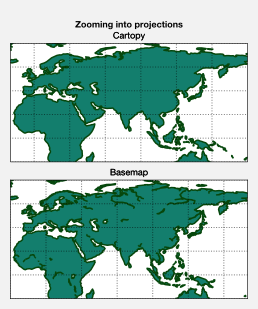

Color usage
===========

ProPlot isn’t just an alternative to ``~matplotlib.pyplot``. It also
adds some neat features to help you use colors effectively in your
figures, and integrates palettes from several online data visualization
tools.

First things first, ProPlot makes a distinction between *colormaps* and
*color cycles*.

-  A *colormap* is a palette constructed by sampling some *smooth,
   linear* function between two end colors. Colormaps are generally used
   for 2-D or 3-D plots, where the color serves as an extra “dimension”.
   This is implemented in matplotlib with the
   ``~matplotlib.colors.LinearSegmentedColormap`` class, and also with
   the special ProPlot
   ``~proplot.colortools.PerceptuallyUniformColormap`` subclass (see
   :ref:``On-the-fly colormaps``).
-  A *color cycle* is a palette composed of a *jumbled set* of distinct
   colors. Interpolation between these colors does not make sense. Color
   cycles are generally used with line plots, bar plots, and other plot
   elements. They are conceptually implemented in matplotlib with the
   ``~matplotlib.colors.ListedColormap`` class (although it is often
   improperly used). ProPlot uses this class to register color cycles,
   and the color cycles are “applied” by globally or axes-locally
   modifying the `property
   cycler <https://matplotlib.org/3.1.0/tutorials/intermediate/color_cycle.html>`__.
   *Colormaps* can also be cut up and used as color cycles (see
   :ref:``On-the-fly color cycles``).

This section documents the colormaps and cycles registered after
importing ProPlot, explains how to make custom colormaps and cycles, and
shows how to apply them to your plots using axes methods wrapped by
``~proplot.wrappers.cmap_wrapper`` or
``~proplot.wrappers.cycle_wrapper``.

Registered colormaps
--------------------

On import, ProPlot registers a few sample
``~proplot.colortools.PerceptuallyUniformColormap`` colormaps (see
:ref:``Perceptually uniform colormaps``) plus a ton of other colormaps
from other online data viz projects. Use
``~proplot.colortools.show_cmaps`` to generate a table of registered
maps, as shown below. The figure is broken down into the following
sections:

-  “User” colormaps, i.e. colormaps saved to your ``~/.proplot/cmaps``
   folder. A great way to save colormaps to this folder is using the
   ``~proplot.colortools.Colormap`` constructor function. See
   :ref:``On-the-fly colormaps`` for details.
-  Original matplotlib and seaborn colormaps.
-  ProPlot maps belonging to the
   ``~proplot.colortools.PerceptuallyUniformColormap`` class. See the
   :ref:``Perceptually uniform colormaps`` section.
-  `ColorBrewer <http://colorbrewer2.org/>`__ maps, included with
   matplotlib by default.
-  `cmOcean <https://matplotlib.org/cmocean/>`__ colormaps, originally
   intended for oceanographic visualizations but useful for all
   scientific fields.
-  Miscellaneous diverging colormaps.
-  Maps from the
   `SciVisColor <https://sciviscolor.org/home/colormoves/>`__ online
   interactive tool. There are so many of these maps because they are
   intended to be *merged* with one another – suitable for complex
   datasets with complex statistical distributions.

ProPlot removes some default matplotlib colormaps with erratic color
transitions. Note that colormap and color cycle identification is now
flexible: names are *case-insensitive* (e.g. ``'Viridis'``,
``'viridis'``, and ``'ViRiDiS'`` are equivalent) and can be specified in
their “reversed” form (e.g. ``'BuRd'`` is equivalent to ``'RdBu_r'``).
See ``~proplot.colortools.CmapDict`` for more info.

.. code:: ipython3

    import proplot as plot
    f = plot.show_cmaps(31)

.. parsed-literal::

    User colormaps: test1, test2
    Deleted colormaps: binary, gist_yarg, gist_gray, gray, bone, pink, spring, summer, autumn, winter, cool, wistia, multi, cividis, afmhot, gist_heat, copper, multi, cividis, coolwarm, bwr, seismic, flag, prism, ocean, gist_earth, terrain, gist_stern, gnuplot, gnuplot2, cmrmap, brg, hsv, hot, rainbow, gist_rainbow, jet, nipy_spectral, gist_ncar, cubehelix

.. image:: quickstart/quickstart_99_1.svg

On-the-fly colormaps
--------------------

You can make a new colormap with ProPlot’s on-the-fly colormap
generator! Every command that accepts a ``cmap`` argument (see
``~proplot.wrappers.cmap_wrapper``) is passed to the
``~proplot.colortools.Colormap`` constructor.
``~proplot.colortools.Colormap`` keyword arguments can be specified with
``cmap_kw``. If you want to save your own colormap into ``~/.proplot``,
simply pass ``save=True`` to the ``~proplot.colortools.Colormap``
constructor (or supply a plotting command with
``cmap_kw={'save':True, 'name':name}``, and it will be loaded every time
you import ProPlot. See ``~proplot.colortools.Colormap`` and
``~proplot.wrappers.cmap_wrapper`` for details.

As a first example: To merge colormaps, simply pass multiple arguments
to the ``~proplot.colortools.Colormap`` constructor. This makes it easy
to create complex SciVisColor-style colormaps, desirable for complex
datasets with funky statistical distributions. The below reconstructs
the colormap from `this
example <https://sciviscolor.org/wp-content/uploads/sites/14/2018/04/colormoves-icon-1.png>`__.

.. code:: ipython3

    import proplot as plot
    import numpy as np
    f, axs = plot.subplots(ncols=2, axwidth=2.5, colorbars='b', bottom=0.1)
    data = np.random.rand(100,100).cumsum(axis=1)
    # Make colormap, save as "test1.json"
    cmap = plot.Colormap('Green1_r', 'Orange5', 'Blue1_r', 'Blue6', name='test1', save=True)
    m = axs[0].contourf(data, cmap=cmap, levels=100)
    f.bpanel[0].colorbar(m, locator='none')
    # Make colormap, save as "test2.json"
    cmap = plot.Colormap('Green1_r', 'Orange5', 'Blue1_r', 'Blue6', ratios=(1,3,5,10), name='test2', save=True)
    m = axs[1].contourf(data, cmap=cmap, levels=100)
    f.bpanel[1].colorbar(m, locator='none')
    axs.format(xticks='none', yticks='none', suptitle='Merging existing colormaps')
    for ax,title in zip(axs, ['Evenly spaced', 'Matching SciVisColor example']):
        ax.format(title=title)

.. parsed-literal::

    Saved colormap to "test1.json".
    Saved colormap to "test2.json".

.. image:: quickstart/quickstart_102_1.svg

To build monochromatic colormaps from arbitrary colors, just pass a
color name, hex string, or RGB tuple to
``~proplot.colortools.Colormap``. The colormaps will vary from the
specified color to some shade near white – this is controlled by the
``fade`` keyword argument. The default is to fade to pure white. The
first plot shows several of these maps merged into one, and the second
is just one map.

.. code:: ipython3

    import proplot as plot
    import numpy as np
    f, axs = plot.subplots(ncols=2, axwidth=2.4, aspect=1, colorbars='b', bottom=0.1)
    data = np.random.rand(50,50).cumsum(axis=1)
    cmap = plot.Colormap('charcoal', 'navy', 'brick red', fade=90, reverse=True)
    m = axs[0].contourf(data, cmap=cmap, levels=12)
    f.bpanel[0].colorbar(m, locator='null')
    m = axs[1].contourf(data, cmap='ocean blue')
    f.bpanel[1].colorbar(m, locator='null')
    axs.format(xticks='none', yticks='none', suptitle='On-the-fly monochromatic maps')
    for ax,title in zip(axs, ['Three monochromatic colormaps, merged', 'Single monochromatic colormap']):
        ax.format(title=title)

.. image:: quickstart/quickstart_104_0.svg

To modify a diverging colormap by cutting out some central colors, pass
the ``cut`` argument to ``~proplot.colortools.Colormap``. This is great
when you want to have a sharper cutoff between negative and positive
values.

.. code:: ipython3

    import proplot as plot
    import numpy as np
    f, axs = plot.subplots(ncols=3, axcolorbars='b', axwidth=2)
    data = np.random.rand(50,50).cumsum(axis=0) - 50
    for ax,cut in zip(axs,(0, 0.1, 0.2)):
        m = ax.contourf(data, cmap='NegPos2', cmap_kw={'cut':cut}, levels=13)
        ax.format(xlabel='x axis', ylabel='y axis', title=f'cut = {cut}',
                  suptitle='Cutting out the central colors from a diverging colormap')
        ax.bpanel.colorbar(m, locator='null')

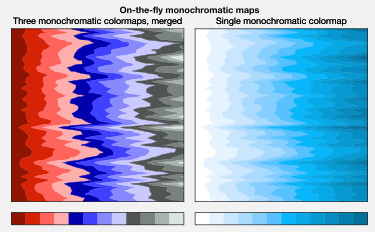

To rotate a cyclic colormap, pass the ``shift`` argument to
``~proplot.colortools.Colormap``. Cyclic colormaps are colormaps for
which ``cyclic=True`` was passed to ``~proplot.colortools.Colormap`` on
construction. ProPlot ensures the colors at the ends of these maps are
distinct, so that levels don’t blur together.

.. code:: ipython3

    import proplot as plot
    import numpy as np
    f, axs = plot.subplots(ncols=3, axcolorbars='b', axwidth=2)
    data = (np.random.rand(50,50)-0.48).cumsum(axis=1).cumsum(axis=0) - 50
    for ax,shift in zip(axs,(0, 90, 180)):
        m = ax.contourf(data, cmap='twilight', cmap_kw={'shift':shift}, levels=12)
        ax.format(xlabel='x axis', ylabel='y axis', title=f'shift = {shift}',
                  suptitle='Rotating the colors in a cyclic colormap')
        ax.bpanel.colorbar(m, locator='null')

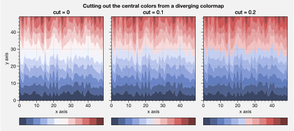

Perceptually uniform colormaps
------------------------------

ProPlot’s custom colormaps are instances of the new
``PerceptuallyUniformColormap`` class (see :ref:``Registered colormaps``
for a table). These classes employ *linear transitions* between channel
values in any of three possible “perceptually uniform”, HSV-like
colorspaces. These colorspaces can be described as follows:

-  **HCL**: A purely perceptually uniform colorspace, where colors are
   broken down into “hue” (color, range 0-360), “chroma” (saturation,
   range 0-100), and “luminance” (brightness, range 0-100).
-  **HPLuv**: As with HCL, but 100 saturation is scaled to be the
   *minimum maximum saturation* across all hues for a given luminance,
   and is hence more appropriate for multi-hue colormaps.
-  **HSLuv**: As with HCL, but 100 saturation is scaled to be the
   *maximum possible saturation* for a given hue and luminance. This is
   more appropriate for single-hue colormaps, because crossing hues in
   this space make it more likely that bands of higher absolute
   saturation are crossed.

The HCL space is the only “purely” perceptually uniform colorspace. But
during a linear transition between two values, we may cross over
“impossible” colors (i.e. colors with RGB channels >1). The HSLuv and
HPLuv colorspaces were developed to resolve this issue by (respectively)
scaling and clipping high-saturation colors across different hues and
luminances.

Use ``~proplot.colortools.colorspace_breakdown`` to plot arbitrary
cross-sections of these colorspaces. Also see `this
page <http://www.hsluv.org/comparison/>`__.

.. code:: ipython3

    import proplot as plot
    f = plot.colorspace_breakdown(luminance=50)

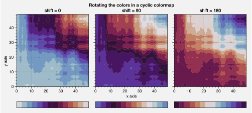

.. code:: ipython3

    import proplot as plot
    f = plot.colorspace_breakdown(saturation=60)

.. image:: quickstart/quickstart_112_0.svg

.. code:: ipython3

    import proplot as plot
    f = plot.colorspace_breakdown(hue=0)

.. image:: quickstart/quickstart_113_0.svg

You can generate your own
``~proplot.colortools.PerceptuallyUniformColormap`` on-the-fly by
passing a dictionary as the ``cmap`` keyword argument. This is powered
by the ``~proplot.colortools.PerceptuallyUniformColormap.from_hsl``
static method. See :ref:``Perceptually uniform colormaps`` for details.

The ``h``, ``s``, and ``l`` arguments can be single numbers, color
strings, or lists thereof. Numbers just indicate the channel value. For
color strings, the corresponding channel value (i.e. hue, saturation, or
luminance) for that color will be looked up. You can end any color
string with ``+N`` or ``-N`` to offset the channel value by the number
``N``, as shown below.

.. code:: ipython3

    import proplot as plot
    import numpy as np
    f, axs = plot.subplots(ncols=2, span=False, axcolorbars='b', axwidth=2.5, aspect=1.5)
    ax = axs[0]
    cmap = plot.Colormap({'hue':['red-120', 'red+90'], 'saturation':[50, 70, 30], 'luminance':[20, 100], 'space':'hcl'})
    m = ax.contourf(np.random.rand(10,10), levels=plot.arange(0.1,0.9,0.1), extend='both', colorbar='b', cmap=cmap)
    ax.format(xlabel='x axis', ylabel='y axis', title='Matter look-alike',
              suptitle='On-the-fly PerceptuallyUniformColormap')
    ax = axs[1]
    cmap = plot.Colormap({'hue':['red', 'red-720'], 'saturation':[80,20], 'luminance':[20, 100], 'space':'hpl'})
    m = ax.contourf(np.random.rand(10,10), levels=plot.arange(0.1,0.9,0.05), extend='both', colorbar='b', colorbar_kw={'locator':0.1}, cmap=cmap)
    ax.format(xlabel='x axis', ylabel='y axis', title='cubehelix look-alike')

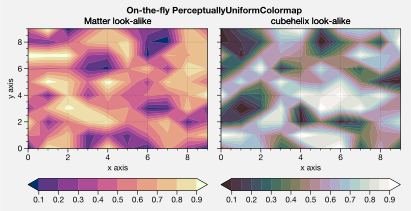

It is also easy to change the “gamma” of a
``~proplot.colortools.PerceptuallyUniformColormap`` uniform colormap
on-the-fly. The “gamma” controls how the luminance and saturation
channels vary across the two ends of the colormap. A gamma larger than
``1`` emphasizes high luminance, low saturation colors, and a gamma
smaller than ``1`` emphasizes low luminance, high saturation colors. See
``~proplot.colortools.PerceptuallyUniformColormap`` for details.

.. code:: ipython3

    import proplot as plot
    import numpy as np
    f, axs = plot.subplots(ncols=3, nrows=2, axcolorbars='r', aspect=1)
    data = np.random.rand(10,10).cumsum(axis=1)
    i = 0
    for cmap in ('boreal','fire'):
        for gamma in (0.8, 1.0, 1.4):
            ax = axs[i]
            m1 = ax.pcolormesh(data, cmap=cmap, cmap_kw={'gamma':gamma}, levels=10, extend='both')
            ax.rpanel.colorbar(m1, locator='none')
            ax.format(title=f'gamma = {gamma}', xlabel='x axis', ylabel='y axis', suptitle='Varying the "PerceptuallyUniformColormap" gamma')
            i += 1

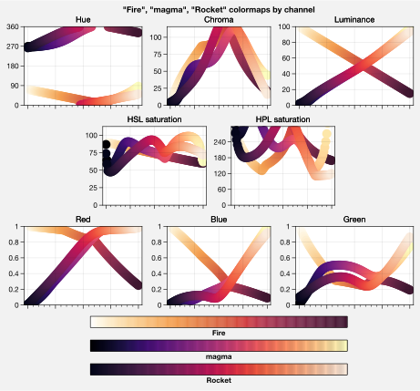

To see how the colors in a colormap vary across different colorspaces,
use the ``~proplot.colortools.cmap_breakdown`` function. This is done
below for the builtin “viridis” colormap and the “Fire”
``~proplot.colortools.PerceptuallyUniformColormap``. We see that
transitions for “Fire” are linear in HSL space, while transitions for
“virids” are linear in hue and luminance for all colorspaces, but
non-linear in saturation.

.. code:: ipython3

    import proplot as plot
    plot.cmap_breakdown('fire')
    plot.cmap_breakdown('viridis')

.. parsed-literal::

    /Users/ldavis/anaconda3/lib/python3.6/site-packages/matplotlib/contour.py:1557: UserWarning: Warning: converting a masked element to nan.
            self.zmax = float(z.max())
    /Users/ldavis/anaconda3/lib/python3.6/site-packages/matplotlib/contour.py:1558: UserWarning: Warning: converting a masked element to nan.
            self.zmin = float(z.min())

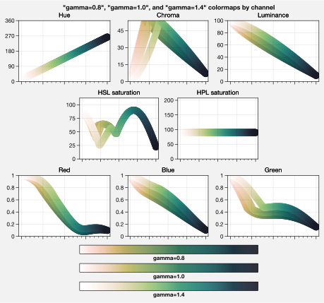

.. image:: quickstart/quickstart_119_2.svg

Adding online colormaps
-----------------------

There are plenty of online interactive tools for generating perceptually
uniform colormaps, including
`HCLWizard <http://hclwizard.org:64230/hclwizard/>`__,
`Chroma.js <https://gka.github.io/palettes/#colors=lightyellow,orange,deeppink,darkred%7Csteps=7%7Cbez=1%7CcoL=1>`__,
`SciVisColor <https://sciviscolor.org/home/colormaps/>`__, and `HCL
picker <http://tristen.ca/hcl-picker/#/hlc/12/0.99/C6F67D/0B2026>`__.

To add colormaps downloaded from any of these sources, save the colormap
data to a file in your ``~/.proplot/cmaps`` folder, then call
``~proplot.colortools.register_cmaps``. The file should be named
``name.ext``, where ``name`` is the registered colormap name and ``ext``
is the file extension. See ``~proplot.colortools.register_cmaps`` for
valid file extensions.

Registered color cycles
-----------------------

Use ``~proplot.colortools.show_cycles`` to generate a table of the color
cycles registered by default and loaded from your ``~/.proplot/cycles``
folder. You can make your own color cycles using the
``~proplot.colortools.Cycle`` constructor function. See the
:ref:``Color usage`` introduction for more on the differences between
colormaps and color cycles.

.. code:: ipython3

    import proplot as plot
    f = plot.show_cycles()

.. parsed-literal::

    /Users/ldavis/proplot/proplot/subplots.py:831: ProPlotWarning: Got negative bottom margin in smart tight layout.

.. image:: quickstart/quickstart_124_1.svg

On-the-fly color cycles
-----------------------

With ProPlot, you can specify the color cycle by passing ``cycle`` to
plotting commands like ``~matplotlib.axes.Axes.plot`` or
``~matplotlib.axes.Axes.scatter`` (e.g. ``ax.plot(..., cycle='538')`` –
see ``~proplot.wrappers.cycle_wrapper``), or by changing the global
default cycle (e.g. ``plot.rc.cycle = '538'`` – see the
``~proplot.rcmod`` documentation). In both cases, the arguments are
passed to the ``~proplot.colortools.Cycle`` constructor.
``~proplot.colortools.Cycle`` keyword arguments can be specified by
passing ``cycle_kw`` to a plotting command. If you want to save your own
color cycle into ``~/.proplot``, simply pass ``save=True`` to the
``~proplot.colortools.Cycle`` constructor (or supply a plotting command
with ``cycle_kw={'save':True, 'name':name}``), and it will be loaded
every time you import ProPlot. The below example demonstrates these
methods.

.. code:: ipython3

    import proplot as plot
    import numpy as np
    data = (np.random.rand(12,12)-0.45).cumsum(axis=0)
    plot.rc.cycle = 'contrast'
    lw = 5
    f, axs = plot.subplots(ncols=3, axwidth=1.7)
    # Here the default cycle is used
    ax = axs[0]
    ax.plot(data, lw=lw)
    # Note that specifying "cycle" does not reset the color cycle
    ax = axs[1]
    ax.plot(data, cycle='qual2', lw=lw)
    ax = axs[2]
    for i in range(data.shape[1]):
        ax.plot(data[:,i], cycle='qual2', lw=lw)
    # Format
    axs.format(xformatter=[], yformatter=[], suptitle='Local and global color cycles demo')

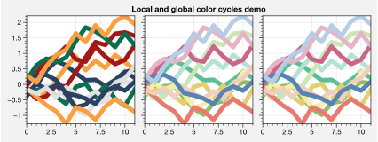

Finally, *colormaps* (or combinations thereof) can be used as sources
for generating color cycles. Just pass a tuple of colormap name(s) to
the ``~proplot.colortools.Cycle`` constructor, with the last entry of
the tuple indicating the number of samples you want to draw. To exclude
near-white colors on the end of a colormap, just pass e.g. ``left=x`` to
``~proplot.colortools.Cycle`` (or supply a plotting command with e.g.
``cycle_kw={'left':x}``). This cuts out the leftmost ``x`` proportion of
the colormap before drawing colors from said map. See
``~proplot.colortools.Colormap`` for details.

.. code:: ipython3

    import proplot as plot
    import numpy as np
    f, axs = plot.subplots(ncols=2, colorbars='b', share=0, span=False, axwidth=2.2, aspect=1.5)
    data = (20*np.random.rand(10,21)-10).cumsum(axis=0)
    # Example 1
    ax = axs[0]
    lines = ax.plot(data[:,:5], cycle='purples', cycle_kw={'left':0.3}, lw=5)
    f.bpanel[0].colorbar(lines, values=np.arange(0,len(lines)), label='clabel')
    ax.format(title='Simple cycle')
    # Example 2
    ax = axs[1]
    cycle = plot.Cycle('blues', 'reds', 'oranges', 21, left=[0.1]*3)
    lines = ax.plot(data, cycle=cycle, lw=5)
    f.bpanel[1].colorbar(lines, values=np.arange(0,len(lines)), label='clabel')
    ax.format(title='Complex cycle', suptitle='Color cycles from colormaps demo')

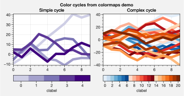

``~proplot.wrappers.cycle_wrapper`` can also be used to change
properties other than color. Below, a single-color dash style cycler is
generated using the ``~proplot.colortools.Cycle`` function and applied
to the axes locally. To apply it globally, simply use
``plot.rc['axes.prop_cycle'] = cycle``.

.. code:: ipython3

    import proplot as plot
    import numpy as np
    import pandas as pd
    f, ax = plot.subplots(axwidth=3, aspect=2)
    data = (np.random.rand(20,4)-0.5).cumsum(axis=0)
    data = pd.DataFrame(data, columns=pd.Index(['a','b','c','d'], name='label'))
    ax.format(suptitle='Plot without color cycle')
    cycle = plot.Cycle(dashes=[(1,0.5),(1,1.5),(3,1.5),(5,3)])
    obj = ax.plot(data, lw=2, cycle=cycle, legend='ul', legend_kw={'ncols':2, 'handlelength':3})

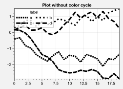

Adding online color cycles
--------------------------

There are plenty of online interactive tools for generating and testing
color cycles, including `i want
hue <http://tools.medialab.sciences-po.fr/iwanthue/index.php>`__,
`coolers <https://coolors.co>`__, and `viz
palette <https://projects.susielu.com/viz-palette>`__.

To add color cycles downloaded from any of these sources, save the cycle
data to a file in your ``~/.proplot/cycles`` folder, then call
``~proplot.colortools.register_cycles``. The file should be named
``name.ext``, where ``name`` is the registered cycle name and ``ext`` is
the file extension. See ``~proplot.colortools.register_cmaps`` for valid
file extensions.

Registered color names
----------------------

ProPlot defines new color names from the `XKCD “color
survey” <https://blog.xkcd.com/2010/05/03/color-survey-results/>`__,
official `Crayola crayon
colors <https://en.wikipedia.org/wiki/List_of_Crayola_crayon_colors>`__,
and from the `“Open color” <https://github.com/yeun/open-color>`__
Github project. This was inspired by
`seaborn <https://seaborn.pydata.org/tutorial/color_palettes.html>`__.
Use ``~proplot.colortools.show_colors`` to generate tables of these
colors, as shown below. Note that the native matplotlib `CSS4 named
colors <https://matplotlib.org/examples/color/named_colors.html>`__ are
still registered, but I encourage using colors from the tables instead.

To reduce the number of registered color names to a more manageable
size, XKCD and Crayola colors must have *sufficiently distinct
coordinates* in the HCL perceptually uniform colorspace before they are
added to ProPlot. This makes it a bit easier to pick out colors from a
table generated with ``~proplot.colortools.show_colors``. Similar names
were also cleaned up – for example, “reddish” and “reddy” are changed to
“red”.

.. code:: ipython3

    import proplot as plot
    f = plot.show_colors()

.. image:: quickstart/quickstart_136_0.svg

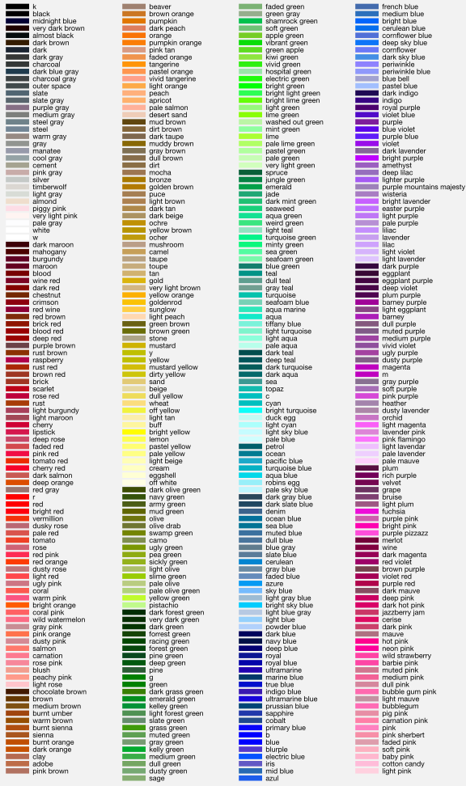

Individual color sampling
-------------------------

If you want to draw an individual color from a smooth colormap or a
color cycle, use ``color=(cmapname, position)`` or
``color=(cyclename, index)`` with any command that accepts the ``color``
keyword! The ``position`` should be between 0 and 1, while the ``index``
is the index on the list of colors in the cycle. This feature is powered
by the ``~proplot.colortools.ColorCacheDict`` class.

.. code:: ipython3

    import proplot as plot
    import numpy as np
    f, axs = plot.subplots(nrows=3, aspect=(2,1), axwidth=3.5, axcolorbars='r', share=False)
    m = axs[0].pcolormesh(np.random.rand(10,10), cmap='thermal', levels=np.linspace(0, 1, 101))
    axs[0].rpanel.colorbar(m, label='colormap', locator=0.2)
    axs[0].format(title='Thermal colormap')
    l = []
    for idx in plot.arange(0, 1, 0.1):
        h = axs[1].plot((np.random.rand(20)-0.4).cumsum(), lw=5, color=('thermal', idx), label=f'idx {idx:.1f}')
        l.append(h)
    axs[1].rpanel.legend(l, ncols=1)
    axs[1].format(title='Drawing from the Thermal colormap')
    l = []
    idxs = np.arange(7)
    np.random.shuffle(idxs)
    for idx in idxs:
        h = axs[2].plot((np.random.rand(20)-0.4).cumsum(), lw=5, color=('ggplot', idx), label=f'idx {idx:.0f}')
        l.append(h)
    axs[2].rpanel.legend(l, ncols=1)
    axs[2].format(title='Drawing randomly from the ggplot color cycle')
    axs.format(xlocator='null', abc=True, abcloc='ul', suptitle='Getting individual colors from colormaps and cycles')

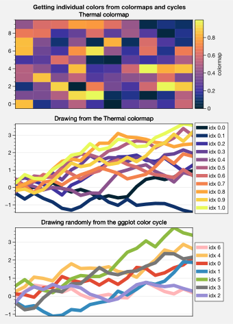

Plotting enhancements
=====================

Various matplotlib plotting commands have new features thanks to a set
of wrapper functions (see the ``~proplot.axes`` documentation). The most
interesting of these are ``~proplot.wrappers.cmap_wrapper`` and
``~proplot.wrappers.cycle_wrapper``, which allow constructing
:ref:``On-the-fly colormaps`` and :ref:``On-the-fly color cycles``
(follow links for details). Here we document *other* features enabled by
the plotting wrappers, starting with ``~matplotlib.axes.Axes.plot``.

Contourf and pcolor
-------------------

``~proplot.wrappers.cmap_wrapper`` assigns the
``~proplot.colortools.BinNorm`` “meta-normalizer” as the data normalizer
for all colormap plots. This allows for discrete levels in all
situations – that is, ``~matplotlib.axes.Axes.pcolor`` and
``~matplotlib.axes.Axes.pcolormesh`` now accept a ``levels`` keyword
arg, just like ``~matplotlib.axes.Axes.contourf``.
``~proplot.colortools.BinNorm`` also ensures the colorbar colors span
the entire colormap range, and that “cyclic” colorbar colors are
distinct on each end. ``~proplot.wrappers.cmap_wrapper`` also fixes the
well-documented
`white-lines-between-filled-contours <https://stackoverflow.com/q/8263769/4970632>`__
and
`white-lines-between-pcolor-rectangles <https://stackoverflow.com/q/27092991/4970632>`__
issues by automatically changing the edge colors after
``~matplotlib.axes.Axes.contourf``, ``~matplotlib.axes.Axes.pcolor``,
and ``~matplotlib.axes.Axes.pcolormesh`` are called. To disable this
behavior, use ``edgefix=False``.

.. code:: ipython3

    import proplot as plot
    import numpy as np
    f, axs = plot.subplots(ncols=5, width=8, wratios=(5,3,3,3,3), axcolorbars='b')
    axs.format(suptitle='Demo of colorbar color-range standardization')
    levels = plot.arange(0,360,45)
    data = (20*(np.random.rand(20,20) - 0.4).cumsum(axis=0).cumsum(axis=1)) % 360
    ax = axs[0]
    ax.contourf(data, levels=levels, cmap='phase', extend='neither', colorbar='b')
    ax.format(title='Cyclic map with separate ends')
    for ax,extend in zip(axs[1:], ('min','max','neither','both')):
        ax.contourf(data, levels=levels, cmap='spectral', extend=extend, colorbar='b', colorbar_kw={'locator':90})
        ax.format(title=f'Map with extend={extend}')

.. image:: quickstart/quickstart_144_0.svg

Levels and labels
-----------------

.. code:: ipython3

    import proplot as plot
    import numpy as np
    f, axs = plot.subplots(ncols=2, axwidth=1.5, axcolorbars={1:'l', 2:'r'})
    cmap = 'orange5'
    data = np.random.rand(20,20)
    axs.format(suptitle='Pcolor with levels demo')
    ax = axs[0]
    ax.pcolor(data, cmap=cmap, colorbar='l', vmin=0, vmax=1, levels=200, colorbar_kw={'locator':0.2})
    ax.format(title='Fine transitions', yformatter='null')
    ax = axs[1]
    ax.pcolor(data, cmap=cmap, colorbar='r', levels=np.linspace(0,1,6), colorbar_kw={'locator':0.2})
    ax.format(title='Discernible levels')

.. image:: quickstart/quickstart_146_0.svg

If you pass unevenly spaced ``levels``, the
``~proplot.colortools.LinearSegmentedNorm`` normalizer is applied by
default. This results in even color gradations across *indices* of the
level list, no matter their spacing. To use an arbitrary colormap
normalizer, just pass ``norm`` and optionally ``norm_kw`` to a command
wrapped by ``~proplot.wrappers.cmap_wrapper``. These arguments are
passed to the ``~proplot.colortools.Norm`` constructor.

.. code:: ipython3

    import proplot as plot
    import numpy as np
    f, axs = plot.subplots(colorbars='b', ncols=2, axwidth=2.5, aspect=1.5)
    data = 10**(2*np.random.rand(20,20).cumsum(axis=0)/7)
    ticks = [5, 10, 20, 50, 100, 200, 500, 1000]
    for i,(norm,title) in enumerate(zip(('linear','segments'),('Linear normalizer','LinearSegmentedNorm (default)'))):
        m = axs[i].contourf(data, values=ticks, extend='both', cmap='blue2', norm=norm)
        f.bpanel[i].colorbar(m, label='clabel', locator=ticks, fixticks=False)
        axs[i].format(title=title)
    axs.format(suptitle='Level normalizers demo')

.. image:: quickstart/quickstart_148_0.svg

To add ``~matplotlib.axes.Axes.clabel`` labels to
``~matplotlib.axes.Axes.contour`` plots or add grid box labels to
``~matplotlib.axes.Axes.pcolor`` and
``~matplotlib.axes.Axes.pcolormesh`` plots, just pass ``labels=True`` to
any command wrapped by ``~proplot.wrappers.cmap_wrapper``. For grid box
labels, the label color is automatically chosen based on the luminance
of the underlying box color.

.. code:: ipython3

    import proplot as plot
    import numpy as np
    f, axs = plot.subplots(ncols=2, span=False, share=False)
    data = np.random.rand(7,7)
    axs.format(suptitle='Labels demo')
    ax = axs[0]
    m = ax.pcolormesh(data, cmap='greys', labels=True, levels=100)
    ax.format(xlabel='xlabel', ylabel='ylabel', title='Pcolor plot with labels')
    ax = axs[1]
    m = ax.contourf(data.cumsum(axis=0), cmap='greys', cmap_kw={'right':0.8})
    m = ax.contour(data.cumsum(axis=0), color='k', labels=True)
    ax.format(xlabel='xlabel', ylabel='ylabel', title='Contour plot with labels')

.. image:: quickstart/quickstart_150_0.svg

Parametric plots
----------------

``~matplotlib.axes.Axes.plot`` now accepts a ``cmap`` keyword – this
lets you draw line collections that map individual segments of the line
to individual colors. This can be useful for drawing “parametric” plots,
where you want to indicate the time or some other coordinate at each
point on the line. See ``~proplot.axes.BaseAxes.cmapline`` for details.

.. code:: ipython3

    import proplot as plot
    import numpy as np
    f, axs = plot.subplots(span=False, share=False, ncols=2, wratios=(2,1), axcolorbars='b', axwidth='5cm', aspect=(2,1))
    ax = axs[0]
    m = ax.plot((np.random.rand(50)-0.5).cumsum(), np.random.rand(50),
                cmap='thermal', values=np.arange(50), lw=7, extend='both')
    ax.format(xlabel='xlabel', ylabel='ylabel', title='Line with smooth color gradations', titleweight='bold')
    ax.bpanel.colorbar(m, label='parametric coordinate', locator=5)
    N = 12
    ax = axs[1]
    values = np.arange(1, N+1)
    radii = np.linspace(1,0.2,N)
    angles = np.linspace(0,4*np.pi,N)
    x = radii*np.cos(1.4*angles)
    y = radii*np.sin(1.4*angles)
    m = ax.plot(x, y, values=values,
                linewidth=15, interp=False, cmap='thermal')
    ax.format(xlim=(-1,1), ylim=(-1,1), title='With step gradations', titleweight='bold',
              xlabel='cosine angle', ylabel='sine angle')
    ax.bpanel.colorbar(m, locator=None, label=f'parametric coordinate')

.. parsed-literal::

    <matplotlib.colorbar.Colorbar at 0xd234b0a20>

.. image:: quickstart/quickstart_153_1.svg

Area plots
----------

Make area plots with the convenient aliases
``~proplot.axes.BaseAxes.area`` and ``~proplot.axes.BaseAxes.areax``.
These point to the ``~matplotlib.axes.Axes.fill_between`` and
``~matplotlib.axes.Axes.fill_betweenx`` methods, which are wrapped with
``~proplot.wrappers.fill_between_wrapper`` and
``~proplot.wrappers.fill_betweenx_wrapper``. The wrappers enable
“stacking” successive columns of a 2D input array like in ``pandas``,
and add a new “``negpos``” keyword for creating area plots with
different colors where the area boundaries cross each other.

.. code:: ipython3

    import proplot as plot
    import numpy as np
    f, axs = plot.subplots(array=[[1,2],[3,3]], hratios=(1,0.8), span=False, share=0)
    axs.format(xlabel='xlabel', ylabel='ylabel', suptitle='Area plot demo')
    data = np.random.rand(5,3).cumsum(axis=0)
    ax = axs[0]
    ax.areax(np.arange(5), data, data + np.random.rand(5)[:,None], stacked=False, alpha=0.5,
            legend='uc', legend_kw={'center':True, 'ncols':2, 'labels':['z','y','qqqq']},
            )
    ax.format(title='Fill between columns')
    ax = axs[1]
    ax.area(data, stacked=True, alpha=0.8,
            legend='ul', legend_kw={'center':True, 'ncols':2, 'labels':['z','y','qqqq']},
            )
    ax.format(title='Stack between columns')
    ax = axs[2]
    data = 5*(np.random.rand(20)-0.5)
    ax.area(np.arange(len(data)), 0, data, negpos=True, negcolor='blue7', poscolor='red7')
    ax.format(title='Negative and positive data', xlabel='xlabel', ylabel='ylabel')

.. image:: quickstart/quickstart_156_0.svg

Scatter plots
-------------

Thanks to ``~proplot.wrappers.scatter_wrapper`` and
``~proplot.wrappers.cycle_wrapper``, ``~matplotlib.axes.Axes.scatter``
now accepts 2D arrays, just like ``~matplotlib.axes.Axes.plot``, and
successive calls to ``~matplotlib.axes.Axes.scatter`` can apply property
cycle keys other than ``color`` – for example, ``marker`` and
``markersize``. ``~matplotlib.axes.Axes.scatter`` also now optionally
accepts keywords that look like the ``~matplotlib.axes.Axes.plot``
keywords, which is a bit less confusing. You can also pass colormaps to
``~matplotlib.axes.Axes.scatter`` just as with matplotlib.

.. code:: ipython3

    import proplot as plot
    import numpy as np
    import pandas as pd
    f, axs = plot.subplots(ncols=2, share=1)
    x = (np.random.rand(20)-0).cumsum()
    data = (np.random.rand(20,4)-0.5).cumsum(axis=0)
    data = pd.DataFrame(data, columns=pd.Index(['a','b','c','d'], name='label'))
    # Scatter demo
    ax = axs[0]
    ax.format(title='New prop cycle properties', suptitle='Scatter plot demo')
    obj = ax.scatter(x, data, legend='ul', cycle='538', legend_kw={'ncols':2},
                    cycle_kw={'marker':['x','o','x','o'], 'markersize':[5,10,20,30]})
    ax = axs[1]
    ax.format(title='With colormap and colorbar')
    data = (np.random.rand(2,100)-0.5)
    obj = ax.scatter(*data, color=data.sum(axis=0), size=10*(data.sum(axis=0)+1),
                     marker='*', cmap='fire', colorbar='ll', colorbar_kw={'locator':0.5, 'label':'label'})
    axs.format(xlabel='xlabel', ylabel='ylabel')

.. image:: quickstart/quickstart_159_0.svg

Bars plots
----------

``~proplot.wrappers.bar_wrapper`` and
``~proplot.wrappers.cycle_wrapper`` make it easier to generate useful
bar plots. You can now pass 2d arrays to ``~matplotlib.axes.Axes.bar``
or ``~matplotlib.axes.Axes.barh``, and columns of data will be grouped
or stacked together. You can also request that columns are interpreted
as data ranges, with the means or medians represented by bars and the
spread represented by error bars.

.. code:: ipython3

    import proplot as plot
    import numpy as np
    import pandas as pd
    plot.rc['title.loc'] = 'ci'
    plot.rc['axes.ymargin'] = plot.rc['axes.xmargin'] = 0.05
    f, axs = plot.subplots(nrows=3, aspect=2, axwidth=3, span=False, share=False)
    data = np.random.rand(5,5).cumsum(axis=0).cumsum(axis=1)[:,::-1]
    data = pd.DataFrame(data, columns=pd.Index(np.arange(1,6), name='column'), index=pd.Index(['a','b','c','d','e'], name='row idx'))
    ax = axs[0]
    obj = ax.bar(data, cycle='Reds', cycle_kw={'left':0.2}, colorbar='ul', colorbar_kw={'frameon':False})
    ax.format(xlocator=1, xminorlocator=0.5, ytickminor=False, title='Side-by-side', suptitle='Bar plot wrapper demo')
    ax = axs[1]
    obj = ax.barh(data.iloc[::-1,:], cycle='Grays', legend='ur', stacked=True)
    ax.format(title='Stacked')
    ax = axs[2]
    obj = ax.barh(data, color='red orange', means=True)
    ax.format(title='Column statistics')

.. image:: quickstart/quickstart_162_0.svg

Box plots and violins
---------------------

``~matplotlib.axes.Axes.boxplot`` and
``~matplotlib.axes.Axes.violinplot`` are now wrapped with
``~proplot.wrappers.boxplot_wrapper``,
``~proplot.wrappers.violinplot_wrapper``, and
``~proplot.wrappers.cycle_wrapper``, making it much easier to plot
distributions of data with aesthetically pleasing default settings and
automatic axis labeling.

.. code:: ipython3

    import proplot as plot
    import numpy as np
    import pandas as pd
    f, axs = plot.subplots(ncols=2)
    data = np.random.normal(size=(20,5)) + 2*(np.random.rand(20,5)-0.5)
    data = pd.DataFrame(data, columns=pd.Index(['a','b','c','d','e'], name='xlabel'))
    ax = axs[0]
    obj1 = ax.boxplot(data, lw=0.7, marker='x', fillcolor='gray5', medianlw=1, mediancolor='k')#, boxprops={'color':'C0'})#, labels=data.columns)
    ax.format(title='Box plots', titleloc='uc')
    ax = axs[1]
    obj2 = ax.violinplot(data, lw=0.7, fillcolor='gray7', showmeans=True)
    ax.format(title='Violin plots', titleloc='uc')
    axs.format(ymargin=0.1, xmargin=0.1, suptitle='Boxes and violins demo')

.. image:: quickstart/quickstart_165_0.svg

