Introduction
============

Matplotlib APIs
---------------

Matplotlib has `two
APIs <https://matplotlib.org/api/api_overview.html>`__ – the “pyplot”
API (which is MATLAB-like), and the “object-oriented” API (which is more
“pythonic”). Contrary to the similar names, this package is not meant to
be a pyplot replacement. ProPlot’s features are invoked with the
“object-oriented” API, thanks to subclasses of the
`~matplotlib.axes.Axes` and `~matplotlib.figure.Figure` classes.

.. code:: ipython3

    # PyPlot API
    import matplotlib.pyplot as plt
    import numpy as np
    plt.figure(figsize=(5,3))
    plt.plot(np.random.rand(10,10), lw=3)
    plt.title('Title')
    plt.xlabel('x axis')
    plt.ylabel('y axis')

.. code:: ipython3

    # Object-oriented API
    import matplotlib.pyplot as plt
    import numpy as np
    f, ax = plt.subplots(figsize=(5,3))
    ax.plot(np.random.rand(10,10), lw=3)
    ax.set_title('Title')
    ax.set_xlabel('x axis')
    ax.set_ylabel('y axis')

The subplots command
--------------------

The `~proplot.subplots.subplots` command is your gateway to all of
ProPlot’s features. Its usage is similar to the pyplot
`~matplotlib.pyplot.subplots` command, but it is packed with new
features and generates a subclassed figure and specially subclassed
axes.

.. code:: ipython3

    import proplot as plot
    f, ax = plot.subplots()
    ax.format(title='ProPlot API', xlabel='x axis', ylabel='y axis')

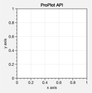

Most matplotlib sizing arguments assume the units inches or some
*relative* unit size – e.g. relative to the axes width. With ProPlot,
all sizing arguments are interpreted the same way. If numeric, the units
are inches, and if string, the units are interpreted by
`~proplot.utils.units`. A table of acceptable units is found in the
`~proplot.utils.units` documentation – they include cm, mm, and
pixels. See `~proplot.subplots.subplots` for details.

.. code:: ipython3

    import proplot as plot
    f, axs = plot.subplots(ncols=3, tightsubplot=False, width='12cm', height='55mm', wspace=('10pt', '20pt'))
    axs.format(suptitle='Figure title', xlabel='x axis', ylabel='y axis')

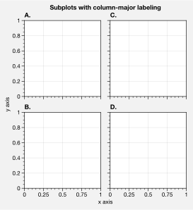

A-b-c subplot labeling is another useful ProPlot feature. The label
order is row-major by default; to change this, use the
`~proplot.subplots.subplots` ``order`` keyword arg. Change the label
position with the ``abcloc`` `~proplot.rcmod` option, or the label
style with the ``abcformat`` `~proplot.rcmod` option. Toggle labeling
with ``abc=True``. See :ref:`The format command` and
:ref:`Rc settings control` for details.

.. code:: ipython3

    import proplot as plot
    f, axs = plot.subplots(nrows=2, ncols=2, order='F', axwidth=1.5)
    axs.format(abc=True, abcloc='l', abcformat='A.', xlabel='x axis', ylabel='y axis', suptitle='Subplots with column-major labeling')
    f, axs = plot.subplots(nrows=8, ncols=8, axwidth=0.5, flush=True) # not 
    axs.format(abc=True, abcloc='ur', xlabel='x axis', ylabel='y axis', xticks=[], yticks=[], suptitle='Grid of "flush" subplots')

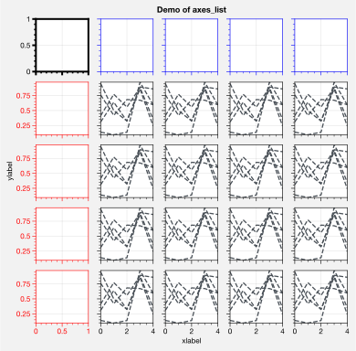

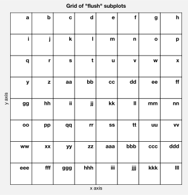

To set up a complex grid of subplots, use a 2D array of integers. You
can think of this array as a “picture” of your figure. This lets you
build the below grid in just one line of code, instead of 6 lines. The
numbering determines the order of a-b-c labels. See
`~proplot.subplots.subplots` for details.

.. code:: ipython3

    # Arbitrarily complex array of subplots, with shared/spanning x/y axes detected automatically
    import proplot as plot
    import numpy as np
    f, axs = plot.subplots([[1, 1, 2], [1, 1, 6], [3, 4, 4], [3, 5, 5]], span=1, share=3, width=5)
    axs.format(suptitle='Complex subplot grid with axis-sharing + spanning labels', xlabel='time (seconds)', ylabel='temperature (K)', abc=True)
    axs[0].plot(2*(np.random.rand(100,5)-0.5).cumsum(axis=0), lw=2)

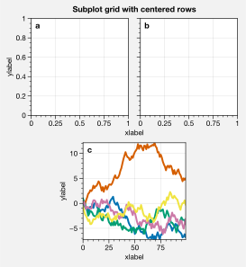

Automatic subplot spacing
-------------------------

With ProPlot, you will always get just the right amount of spacing
between subplots so that elements don’t overlap, and just the right
amount of space around the figure edge so that labels and whatnot are
not cut off. Furthermore, despite all of the complex adjustments this
requires, the original subplot aspect ratios are **always preserved**.
Even when axes panels are present, the main subplot aspect ratios will
stay fixed (see below for more on panels).

You can disable this feature by passing ``tight=False`` to
`~proplot.subplots.subplots`, but it is unbelievably useful. It works
by scaling either the figure width or height dimension (whichever one
you didn’t specify) such that the subplot aspect ratios will not change,
and by taking advantage of ProPlot’s subplot layout restrictions. Some
examples are below.

Sometimes, ``tight=True`` is not possible (when using the cartopy
``set_extent`` method or when using cartopy meridian and parallel
labeling; a warning will be raised in these instances). Even when
``tight=False``, ProPlot tries to make the default spacing reasonable.

.. code:: ipython3

    import proplot as plot
    for share in (3,0):
        f, axs = plot.subplots(nrows=3, ncols=3, aspect=1, axwidth=1, share=share, span=False, tight=True)
        axs[4].format(title='title\ntitle\ntitle', suptitle='"Smart tight layout" automatic spacing')
        axs[1].format(ylabel='ylabel', xlabel='xlabel')

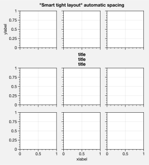

.. image:: quickstart/quickstart_15_1.svg

.. code:: ipython3

    import proplot as plot
    f, axs = plot.subplots([[1,2],[3,2],[3,4]], share=0, span=0, axwidth=1.5)
    axs[0].format(xlabel='xlabel\nxlabel\nxlabel', title='Title', suptitle='"Smart tight layout" automatic spacing')
    axs[1].format(ylabel='ylabel\nylabel', xformatter='null', yticklabelloc='both')
    axs[2].format(yformatter='null', title='Title', ytickloc='both')
    axs[3].format(yformatter='null', xlabel='xlabel\nxlabel\nxlabel')

.. image:: quickstart/quickstart_16_0.svg

.. code:: ipython3

    import proplot as plot
    f, axs = plot.subplots(axwidth=2, ncols=2, span=False, share=0, axpanels='lr', axpanels_kw={'rshare':False})
    axs.format(ylabel='ylabel', xlabel='xlabel')
    axs[0].lpanel.format(ytickloc='right', yticklabelloc='right')
    axs[0].rpanel.format(ylabel='ylabel', ytickloc='right', yticklabelloc='right',
                         suptitle='"Smart tight layout" automatic spacing with panels', collabels=['Column 1', 'Column 2'])

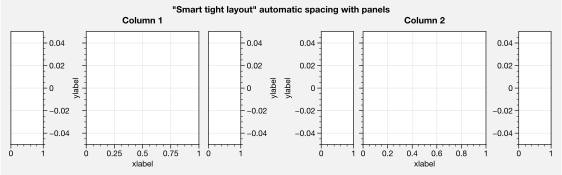

Axis sharing and spanning
-------------------------

Matplotlib has an “axis sharing” feature – but all this can do is hold
the axis limits the same. ProPlot introduces **4 axis-sharing “levels”**
and a new **axis-spanning label** feature, as shown below. This helps
condense redundant information for figures with lots of subplots. See
`~proplot.subplots.subplots` for details.

.. code:: ipython3

    import proplot as plot
    import numpy as np
    N = 50
    M = 40
    colors = plot.colors('grays_r', M, 90, left=0.1, right=0.8)
    for share in (0,1,2,3):
        f, axs = plot.subplots(ncols=4, aspect=1, wspace=0.5, axwidth=1.2, sharey=share, spanx=share//2)
        gen = lambda scale: scale*(np.random.rand(N,M)-0.5).cumsum(axis=0)[N//2:,:]
        for ax,scale,color in zip(axs,(1,3,7,0.2),('gray9','gray7','gray5','gray3')):
            array = gen(scale)
            for l in range(array.shape[1]):
                ax.plot(array[:,l], color=colors[l])
            ax.format(suptitle=f'Axis-sharing level: {share}, spanning labels {["off","on"][share//2]}', ylabel='y-label', xlabel='x-axis label')

.. image:: quickstart/quickstart_20_0.svg

.. image:: quickstart/quickstart_20_1.svg

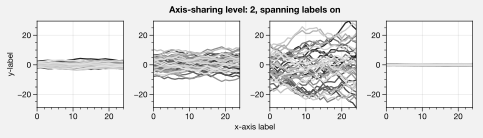

.. image:: quickstart/quickstart_20_3.svg

.. code:: ipython3

    import proplot as plot
    import numpy as np
    plot.rc.cycle = 'Set3'
    titles = ['With redundant labels', 'Without redundant labels']
    for mode in (0,1):
        f, axs = plot.subplots(nrows=4, ncols=4, share=3*mode, span=1*mode, axwidth=1)
        for ax in axs:
            ax.plot((np.random.rand(100,20)-0.4).cumsum(axis=0))
        axs.format(xlabel='x-label', ylabel='y-label', suptitle=titles[mode], abc=mode, abcloc='ul')

.. image:: quickstart/quickstart_21_0.svg

.. image:: quickstart/quickstart_21_1.svg

The format command
------------------

The `~proplot.subplots.subplots` method populates the
`~proplot.subplots.Figure` object with either
`~proplot.axes.CartesianAxes` (for cartesian axes) or
`~proplot.axes.ProjectionAxes` (for cartopy or basemap projection
axes) axes objects. Both of these classes inherit from the base class
`~proplot.axes.BaseAxes`.

The **most important** new method you need to know is
`~proplot.axes.BaseAxes.format`. This is your one-stop-shop for
changing axis labels, tick labels, titles, etc. Keyword args passed to
this function are interpreted as follows:

1. Any keyword arg matching the name of a ProPlot or matplotlib “rc”
   setting will be applied to the axes. If the name has “dots”, simply
   omit them. See the `~proplot.rcmod` documentation for details.
2. Remaining keyword args are passed to the
   `~proplot.axes.CartesianAxes` or `~proplot.axes.ProjectionAxes`
   ``format_partial`` methods. Use these to change settings specific to
   Cartesian or map projection axes, e.g. changing tick locations (the
   former) or toggling geographic features (the latter).
3. Remaining keyword args are passed to the `~proplot.axes.BaseAxes`
   ``format_partial`` method. This one controls settings shared by
   `~proplot.axes.CartesianAxes` and `~proplot.axes.ProjectionAxes`
   axes – namely, titles, “super titles”, row and column labels, and
   a-b-c subplot labeling.

Instead of needing all of these verbose, one-liner matplotlib commands
like ``ax.set_title`` and ``ax.xaxis.tick_params``, or even using
verbose abstract classes like the matplotlib `~matplotlib.ticker`
classes, `~proplot.axes.BaseAxes.format` lets you change everything at
once and adds several useful shorthands. This effectively eliminates the
need for boilerplate plotting code.

The axes returned by `~proplot.subplots.subplots` are also contained
in a special `~proplot.subplots.axes_list` list. This lets you call
any method (e.g. `~proplot.axes.BaseAxes.format`) on every axes
**simultaneously**. This is used in the below example.

.. code:: ipython3

    import proplot as plot
    f, axs = plot.subplots(ncols=2, nrows=2, share=False, span=False, tight=True, axwidth=1.5)
    axs.format(xlabel='x-axis', ylabel='y-axis', xlim=(1,10), xlocator=1, xscale='log',
              ylim=(0,4), ylocator=plot.arange(0,4), yticklabels=('a', 'bb', 'c', 'dd', 'e'),
              title='Main title', titleloc='c', suptitle='Demo of the format command',
              abc=True, abcloc='ul', abcformat='a.', xtickdir='inout',
              urtitle='Title A', lltitle='Title B', lrtitle='Title C', # extra titles
              ytickloc='both', yticklabelloc='both', ygridminor=True, xtickminor=False,
              collabels=['Column label 1', 'Column label 2'], rowlabels=['Row label 1', 'Row label 2'])

.. image:: quickstart/quickstart_23_0.svg

Automatic formatting
--------------------

With ProPlot, when you pass a `~pandas.DataFrame` or
`~xarray.DataArray` to any plotting command, labels and colorbars can
be generated automatically, and the x-axis label, y-axis label, legend
label, colorbar label, and/or title are configured from the metadata.
This restores some of the convenience you get with the builtin
`pandas` and `xarray` plotting tools. To disable automatic
labelling, pass ``autoformat=False`` to `~proplot.subplots.subplots`.

The below examples showcase these features for 1-dimensional and
2-dimensional datasets. For more on the ``colorbar`` and ``legend``
keywords, see `~proplot.wrappers.cmap_wrapper`,
`~proplot.wrappers.cycle_wrapper`, and :ref:`Plotting enhancements`
sections. For more on panels, see the :ref:`Panels` section.

.. code:: ipython3

    import xarray as xr
    import numpy as np
    import pandas as pd
    import proplot as plot
    plot.rc['axes.formatter.timerotation']
    # DataArray
    # Must be column major since plot draws lines from columns of arrays
    data = np.sin(np.linspace(0, 2*np.pi, 20))[:,None] + np.random.rand(20,8).cumsum(axis=1)
    da = xr.DataArray(data, dims=('x', 'cat'), coords={
        'x':xr.DataArray(np.linspace(0,1,20), dims=('x',), attrs={'long_name':'distance', 'units':'km'}),
        'cat':xr.DataArray(np.arange(0,80,10), dims=('cat',), attrs={'long_name':'parameter', 'units':'K'})
        }, name='position series')
    # DataFrame
    ts = pd.date_range('1/1/2000', periods=20)
    data = (np.cos(np.linspace(0, 2*np.pi, 20))**4)[:,None] + np.random.rand(20,5)**2
    df = pd.DataFrame(data, index=ts, columns=['foo','bar','baz','zap','baf'])
    df.name = 'time series'
    df.index.name = 'time (s)'
    df.columns.name = 'columns'
    # Series
    series = pd.Series(np.random.rand(20).cumsum())
    # Figure
    f, axs = plot.subplots(ncols=2, axwidth=1.8, share=False, span=False)
    axs.format(suptitle='Automatic subplot formatting')
    # Plot DataArray
    ax = axs[0]
    ax.plot(da, cycle=plot.shade('sky blue', 0.2), cycle_kw={'fade':90}, lw=3,
            colorbar='ll', colorbar_kw={'length':'2cm', 'frameon':True})
    # Plot Dataframe
    ax = axs[1]
    ax.plot(df, cycle=plot.shade('dark green', 0.15), cycle_kw={'fade':90}, legend='uc', legend_kw={'frameon':True}, lw=3)
    ax.format(xrotation=45)

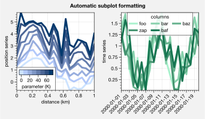

.. code:: ipython3

    import xarray as xr
    import numpy as np
    import pandas as pd
    import proplot as plot
    from string import ascii_lowercase
    # DataArray
    data = 50*(np.sin(np.linspace(0, 2*np.pi, 20) + 0)**2) * np.cos(np.linspace(0, np.pi, 20)+np.pi/2)[:,None]**2
    da = xr.DataArray(data, dims=('plev','lat'), coords={
        'plev':xr.DataArray(np.linspace(1000,0,20), dims=('plev',), attrs={'long_name':'pressure', 'units':'hPa'}),
        'lat':xr.DataArray(np.linspace(-90,90,20), dims=('lat',), attrs={'units':'deg_N'}), # if long_name absent, variable name is used
        }, name='u', attrs={'long_name':'zonal wind', 'units':'m/s'})
    # DataFrame
    data = np.random.rand(20,20)
    df = pd.DataFrame(data.cumsum(axis=0).cumsum(axis=1), index=[*ascii_lowercase[:20]])
    df.name = 'funky data'
    df.index.name = 'index'
    df.columns.name = 'time (days)'
    # Figure
    # We must make room for the axes panels during subplots call!
    f, axs = plot.subplots(nrows=2, axcolorbars={1:'r', 2:'l'}, axwidth=1.8, share=False, span=False)
    axs.format(collabels=['Automatic subplot formatting']) # suptitle will look off center with the empty left panel
    # Plot DataArray
    ax = axs[1]
    ax.contourf(da, cmap='Tempo', cmap_kw={'left':0.05}, colorbar='l')
    # Plot DataFrame
    ax = axs[0]
    ax.contourf(df, cmap='Ice_r', colorbar='r')
    ax.format(xtickminor=False)

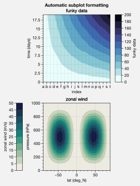

Rc settings control
-------------------

A special object named `~proplot.rcmod.rc`, belonging to the
`~proplot.rcmod.rc_configurator` class, is created whenever you import
ProPlot. This object gives you advanced control over the look of your
plots. **Use** `~proplot.rcmod.rc` **as your one-stop shop for
changing global settings**.

To modify a setting for just one subplot, pass it to the
`~proplot.axes.BaseAxes.format` command. To reset everything to the
default state, use `~proplot.rcmod.rc_configurator.reset`. See the
`~proplot.rcmod` documentation for more information.

.. code:: ipython3

    import proplot as plot
    import numpy as np
    # A bunch od different ways to update settings
    plot.rc.cycle = 'colorblind'
    plot.rc.linewidth = 1.5
    plot.rc.update({'fontname': 'DejaVu Sans'})
    plot.rc['figure.facecolor'] = 'gray3'
    plot.rc['axes.facecolor'] = 'gray5'
    # Make plot
    f, axs = plot.subplots(ncols=2, aspect=1, width=6, span=0, sharey=2)
    N, M = 100, 6
    values = np.arange(1,M+1)
    for i,ax in enumerate(axs):
        data = np.cumsum(np.random.rand(N,M)-0.5, axis=0)
        lines = ax.plot(data, linewidth=3, cycle=('C0','C1',data.shape[1]), cycle_kw={'fade':80}) # see "Changing the color cycle" for details
    axs.format(ytickloc='both', ycolor='blue7',
               hatch='xxx', hatchcolor='w',
               xlabel='x label', ylabel='y label',
               yticklabelloc='both',
               suptitle='Applying new rc settings')
    ay = axs[-1].twinx()
    ay.format(ycolor='r', ylabel='secondary axis')
    ay.plot((np.random.rand(100)-0.2).cumsum(), color='r', lw=3)

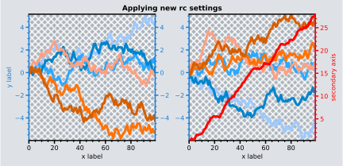

Font control
------------

DejaVu Sans is the default matplotlib font, but it’s not exactly the
best of the best and it can be tricky to change when using multiple
workstations with different fonts installed. ProPlot adds a bunch of
sans-serif fonts, introudces a `~proplot.fonttools.show_fonts` command
to display them (see below), and makes Helvetica the default, as in
MATLAB.Generally speaking, simple, clean sans-serif fonts are more
appropriate for figures than serif fonts.

You can register your own fonts by adding ``.ttf`` and ``.otf`` files to
the ``~/.proplot/fonts`` directory and calling
`~proplot.fonttools.register_fonts` (which is also called on import).
To change the default font, use the `~proplot.rcmod.rc` object or by
modifying your ``~/.proplotrc``. See the `~proplot.fonttools` and
`~proplot.rcmod` documentation for more info.

.. code:: ipython3

    import proplot as plot
    f = plot.show_fonts()

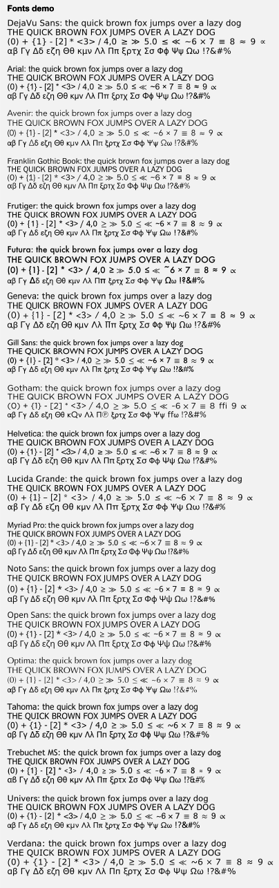

