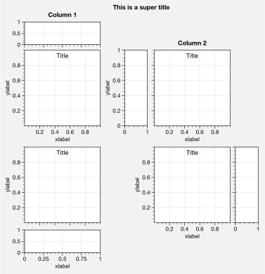
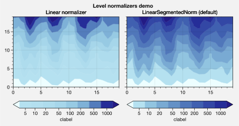

Panels, colorbars, and legends
==============================

It is common to need colorbars and legends along the edges of axes and
figures. It is also common to need “panels” along the edges of axes, for
plotting secondary 1-dimensional datasets and summary statistics.
ProPlot satisfies both of these needs by introducing the “panels”
construct, powered by the `~proplot.axes.PanelAxes` class and the
`~proplot.subplots.subplots` command.

Axes panels
-----------

To add arbitrary combinations of panels to the left, bottom, right, or
top sides of axes, pass the ``axpanel`` or ``axpanels`` keyword args to
`~proplot.subplots.subplots`. To modify panel properties, simply use
the ``axpanel_kw`` or ``axpanels_kw`` dictionary keyword args.

Axes panels are stored on each subplot as the attributes
``bottompanel``, ``leftpanel``, ``rightpanel``, and ``toppanel`` and the
shorthands ``bpanel``, ``lpanel``, ``rpanel``, and ``tpanel``. The
subplots will stay correctly aligned no matter the combination of
panels. See `~proplot.subplots.subplots` and
`~proplot.subplots.Figure.add_subplot_and_panels` for details.

.. code:: ipython3

    # Arbitrarily complex combinations are possible, and inner spaces still determined automatically
    import proplot as plot
    f, axs = plot.subplots(axwidth=2, nrows=2, ncols=2,
                           axpanels={1:'t', 2:'l', 3:'b', 4:'r'},
                           tight=True, share=0, span=0, wratios=[1,2])
    axs.format(title='Title', suptitle='This is a super title', collabels=['Column 1','Column 2'],
               abcloc='ul', titleloc='uc', xlabel='xlabel', ylabel='ylabel', abc=True, top=False)
    axs.format(xlim=(0,1), ylim=(0,1), ylocator=plot.arange(0.2,0.8,0.2), xlocator=plot.arange(0.2,0.8,0.2))

If you intend to turn your panels into *colorbars* (see
:ref:`Colorbars`), you should use the ``axcolorbar``, ``axcolorbars``,
``axcolorbar_kw``, or ``axcolorbars_kw`` keyword args instead of
``axpanel``, etc. The behavior is identical, except the *default* width
of the resulting panels will be more appropriate for “filling” the panel
with a colorbar.

Similarly, if you intend to turn your panels into *legends* (see
:ref:`Legends`), you should use the ``axlegend``, ``axlegends``,
``axlegend_kw``, and ``axlegends_kw`` keyword args. You can modify the
default panel settings with a custom ``.proplotrc`` file (see the
`~proplot.rctools` documentation for details).

If you want panels “flush” against the subplot, simply use the ``flush``
keyword args. If you want to disable “axis sharing” with the parent
subplot (i.e. you want to draw tick labels on the panel, and do not want
to inherit axis limits from the main subplot), use any of the ``share``
keyword args. See `~proplot.subplots.subplots` and
`~proplot.subplots.Figure.add_subplot_and_panels` for details.

.. code:: ipython3

    import proplot as plot
    import numpy as np
    f, axs = plot.subplots(axwidth=1.7, nrows=2, ncols=2, share=0, span=False, panelpad=0.1,
                           axpanels='r', axcolorbars='b', axpanels_kw={'rshare':False, 'rflush':True})
    axs.format(xlabel='xlabel', ylabel='ylabel', suptitle='This is a super title')
    for i,ax in enumerate(axs):
        ax.format(title=f'Dataset {i+1}')
    data = (np.random.rand(20,20)-0.1).cumsum(axis=1)
    m = axs.contourf(data, cmap='glacial', levels=plot.arange(-1,11))[0]
    axs.rpanel.plot(data.mean(axis=1), np.arange(20), color='k')
    axs.rpanel.format(title='Mean')
    axs.bpanel.colorbar(m, label='cbar')
    # axs.colorbar(m, loc='b', label='cbar') # also works!

.. image:: quickstart/quickstart_38_1.svg

Figure panels
-------------

ProPlot also supports “figure” panels. These panels are generally filled
with colorbars and legends as *global* references for content that
appears in more than one subplot. Figure panels are declared with the
``panel``, ``colorbar``, ``legend``, ``panels``, ``colorbars``, and
``legends`` keyword args. They can extend across entire sides of the
figure, or across arbitrary contiguous rows and columns of subplots,
using the ``barray``, ``rarray``, or ``larray`` keyword args. Figure
panel axes are stored on the `~proplot.subplots.Figure` instance as
the attributes ``bottompanel``, ``leftpanel``, and ``rightpanel`` and
the shorthands ``bpanel``, ``lpanel``, and ``rpanel``. See
`~proplot.subplots.subplots` for details.

.. code:: ipython3

    import proplot as plot
    import numpy as np
    f, axs = plot.subplots(ncols=3, nrows=3, axwidth=1.2, colorbar='br', barray=[1,2,2])
    m = axs.pcolormesh(np.random.rand(20,20), cmap='grays', levels=np.linspace(0,1,11), extend='both')[0]
    axs.format(suptitle='Super title', abc=True, abcloc='l', abcformat='a.', xlabel='xlabel', ylabel='ylabel')
    f.bpanel[0].colorbar(m, label='label', ticks=0.5)
    f.bpanel[1].colorbar(m, label='label', ticks=0.2)
    f.rpanel.colorbar(m, label='label', ticks=0.1, length=0.7)

.. image:: quickstart/quickstart_41_1.svg

.. code:: ipython3

    import proplot as plot
    import numpy as np
    f, axs = plot.subplots(ncols=4, axwidth=1.3, colorbar='b', barray=[1,1,2,2], share=0, span=0, wspace=0.3)
    data = (np.random.rand(50,50)-0.1).cumsum(axis=0)
    m = axs[:2].contourf(data, cmap='grays', extend='both')
    cycle = plot.colors('grays', 5)
    hs = []
    for abc,color in zip('ABCDEF',cycle):
        h = axs[2:].plot(np.random.rand(10), lw=3, color=color, label=f'line {abc}')
        hs.extend(h[0])
    f.bpanel[0].colorbar(m[0], length=0.8, label='label')
    f.bpanel[1].legend(hs, ncols=5, label='label', frame=False)
    axs.format(suptitle='Global colorbar and global legend', abc=True, abcloc='ul', abcformat='A')
    for ax,title in zip(axs, ['2D dataset #1', '2D dataset #2', 'Line set #1', 'Line set #2']):
        ax.format(xlabel='xlabel', title=title)

.. image:: quickstart/quickstart_42_0.svg

Stacked panels
--------------

ProPlot also allows arbitrarily *stacking* panels with the ``lstack``,
``bstack``, ``rstack``, and ``tstack`` keyword args. This can be useful
when you want multiple figure colorbars, when you have illustrations
with multiple colormaps inside a single axes, or when you need multiple
panels for displaing various statistics across one dimension of a
primary axes. The stacked panel spacing is adjusted automatically to
account for axis and tick labels. See `~proplot.subplots.subplots` for
details.

.. code:: ipython3

    import proplot as plot
    import numpy as np
    f, axs = plot.subplots(nrows=2, axwidth=0.8, span=False, share=0,
                          axcolorbars='l', axcolorbars_kw={'lstack':3},
                          axpanels='r', axpanels_kw={'rstack':2, 'rflush':True, 'rwidth':0.5}
                          )
    axs[0].format(title='Stacked panel demo', titleweight='bold')
    # Draw stuff in axes
    n = 10
    for ax in axs:
        # Colormap data
        ax.format(xlabel='data', xlocator=np.linspace(0, 0.8, 5))
        for i,(x0,y0,x1,y1,cmap,scale) in enumerate(((0,0.5,1,1,'greys',0.5), (0,0,0.5,0.5,'reds',1), (0.5,0,1,0.5,'blues',2))):
            data = np.random.rand(n,n)*scale
            x, y = np.linspace(x0, x1, 11), np.linspace(y0, y1, 11)
            m = ax.pcolormesh(x, y, data, cmap=cmap, levels=np.linspace(0,scale,11))
            ax.lpanel[i].colorbar(m)
        # Plot data
        for i,pax in enumerate(ax.rpanel):
            func = data.mean if i==0 else data.std
            pax.plot(func(axis=1), plot.arange(0.05, 0.95, 0.1), lw=2, color='k')
            pax.format(xlabel='mean' if i==0 else 'stdev', xlim=(0,1), xlocator=(0,0.5))

Colorbars
---------

All ProPlot “panels” are instances of the `~proplot.axes.PanelAxes`
class (see :ref:`Axes panels` and :ref:`Figure panels`), which is a
subclass of `~proplot.axes.CartesianAxes`. When you call
`~proplot.axes.BaseAxes.colorbar` on a
`~proplot.axes.CartesianAxes`, an *inset* colorbar is generated. When
you call `~proplot.axes.PanelAxes.colorbar` on a
`~proplot.axes.PanelAxes`, the panel is “*filled*” with a colorbar.

You can also draw an *inset* or “*filled*” colorbar by passing the
``colorbar`` keyword arg to methods wrapped by
`~proplot.colortools.cmap_wrapper` and
`~proplot.colortools.cycle_wrapper`. Or, you can draw a “*filled*”
colorbar by calling `~proplot.axes.BaseAxes.colorbar` on the *main*
axes with e.g. ``loc='bottom'`` (see `~proplot.axes.BaseAxes.colorbar`
for details).

.. code:: ipython3

    import proplot as plot
    import numpy as np
    f, ax = plot.subplots(colorbar='b', tight=True, axwidth=2)
    m = ax.contourf((np.random.rand(20,20)).cumsum(axis=0), extend='both', levels=np.linspace(0,10,11), cmap='matter')
    ax.format(xlabel='xlabel', ylabel='ylabel', xlim=(0,19), ylim=(0,19))
    ax.colorbar(m, ticks=2, label='data label', frameon=True)
    ax.colorbar(m, ticks=2, loc='lower left', frameon=False)
    f.bpanel.colorbar(m, label='standard outer colorbar', length=0.9)
    ax.format(suptitle='ProPlot colorbars')

.. image:: quickstart/quickstart_47_0.svg

ProPlot adds several new features to the
`~matplotlib.figure.Figure.colorbar` command, powered by
`~proplot.wrappers.colorbar_wrapper`. A particular handy feature is
the ability to draw colorbars from lists of colors or lists of artists,
instead of just “mappable” objects. A colormap is constructed from the
corresponding colors on-the-fly, as shown below.
`~proplot.wrappers.colorbar_wrapper` also lets you change major and
minor tick locations, handles colorbars normalized by
`~matplotlib.colors.LogNorm` correctly, and lets you change outline,
divider, tick, tick label, and colorbar label settings.

.. code:: ipython3

    import proplot as plot
    import numpy as np
    plot.rc.cycle = 'qual2'
    f, ax = plot.subplots(colorbar='b', axwidth=3, aspect=1.5)
    hs = ax.plot((np.random.rand(12,12)-0.45).cumsum(axis=0), lw=5)
    ax.format(suptitle='ProPlot line object colorbar', xlabel='x axis', ylabel='y axis')
    f.bpanel.colorbar(hs, values=np.arange(0,len(hs)), label='numeric values', tickloc='bottom')

.. image:: quickstart/quickstart_49_1.svg

Legends
-------

Just like with :ref:`Colorbars`, when you call
`~proplot.axes.BaseAxes.legend` on a `~proplot.axes.CartesianAxes`,
an *inset* legend is generated. When you call
`~proplot.axes.PanelAxes.legend` on a `~proplot.axes.PanelAxes`, the
panel is “*filled*” with a legend – that is, a legend is drawn in the
center of the panel, and the panel spines and background patch are
hidden.

You can also draw an *inset* or “*filled*” legend by passing the
``legend`` keyword arg to methods wrapped by
`~proplot.colortools.cycle_wrapper`. Or, you can draw a “*filled*”
legend by calling `~proplot.axes.BaseAxes.legend` on the *main* axes
with e.g. ``loc='bottom'`` (see `~proplot.axes.BaseAxes.legend` for
details).

ProPlot adds several new features to the
`~matplotlib.axes.Axes.legend` command, powered by
`~proplot.wrappers.legend_wrapper`. You can also *center legend rows*
with the ``center`` keyword arg, or by passing a list of lists of plot
handles. This is accomplished by stacking multiple single-row,
horizontally centered legends, then manually adding an encompassing
legend frame. `~proplot.wrappers.legend_wrapper` also lets you switch
between row-major and column-major order for legend entries (the new
default is row-major), and lets you modify legend text properties and
handle properties.

.. code:: ipython3

    import proplot as plot
    import numpy as np
    plot.rc.cycle = 'contrast'
    labels = ['a', 'bb', 'ccc', 'dddd', 'eeeee', 'ffffff']
    f, axs = plot.subplots(ncols=2, legends='b', panels='r', span=False, share=0)
    hs = []
    for i,label in enumerate(labels):
        h = axs.plot(np.random.rand(20), label=label, lw=3)[0]
        hs.extend(h)
    axs[0].legend(order='F', frameon=True, loc='lower left')
    f.bpanel[0].legend(hs, ncols=4, center=False, frameon=True)
    f.bpanel[1].legend(hs, ncols=4, center=True)
    f.rpanel.legend(hs, ncols=1, center=True)
    axs.format(ylim=(-0.1, 1.1), xlabel='xlabel', ylabel='ylabel',
               suptitle='ProPlot legend options')
    for ax,title in zip(axs, ['Inner and outer legends', 'Outer centered-row legends']):
        ax.format(title=title)

.. image:: quickstart/quickstart_52_0.svg

