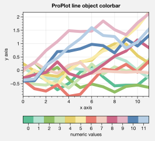

Panels, colorbars, and legends
==============================

It is common to need “panels” for plotting secondary 1-dimensional
datasets or summary statistics. It is also common to need colorbars or
legends along the edges of axes or the figure. Setting these up can be
incredibly time-consuming with the default matplotlib API. To make this
easier, ProPlot introduces the “panels” construct, powered by the
`~proplot.axes.PanelAxes` class.

Axes panels
-----------

To add arbitrary combinations of panels to the left, bottom, right, or
top sides of axes with the `~proplot.subplots.subplots` ``axpanels``
keyword arg. To modify panel properties, simply pass a dictionary to
``axpanels_kw``. The subplots will stay correctly aligned no matter the
combination of panels. See `~proplot.subplots.subplots` and
`~proplot.subplots.Figure.add_subplot_and_panels` for details.

.. code:: ipython3

    # Arbitrarily complex combinations are possible, and inner spaces still determined automatically
    import proplot as plot
    f, axs = plot.subplots(axwidth=2, nrows=2, ncols=2,
                           axpanels={1:'t', 2:'l', 3:'b', 4:'r'},
                           tight=True, share=0, span=0, wratios=[1,2])
    axs.format(title='Title', suptitle='This is a super title', collabels=['Column 1','Column 2'],
               abcloc='ul', titleloc='uc', xlabel='xlabel', ylabel='ylabel', abc=True, top=False)
    axs.format(xlim=(0,1), ylim=(0,1), ylocator=plot.arange(0.2,0.8,0.2), xlocator=plot.arange(0.2,0.8,0.2))

.. image:: quickstart/quickstart_37_0.svg

If you want “colorbar” panels, the simplest option is to use the
``axcolorbar`` and ``axcolorbar_kw`` keywords instead of ``axpanels``
and ``axpanels_kw``. This makes the width of the panels more appropriate
for filling with a colorbar. Similarly, you can also use the
``axlegend`` and ``axlegend_kw`` args. You can modify these default
spacings with a custom ``.proplotrc`` file (see the `~proplot.rcmod`
documentation).

If you want panels “flush” against the subplot, simply use the ``flush``
keyword args. If you want to disable “axis sharing” with the parent
subplot (i.e. you want to draw tick labels on the panel, and do not want
to inherit axis limits from the main subplot), use any of the ``share``
keyword args. Again, see `~proplot.subplots.subplots` and
`~proplot.subplots.Figure.add_subplot_and_panels` for details.

.. code:: ipython3

    import proplot as plot
    import numpy as np
    f, axs = plot.subplots(axwidth=1.7, nrows=2, ncols=2, share=0, span=False, panelpad=0.1,
                           axpanels='r', axcolorbars='b', axpanels_kw={'rshare':False, 'rflush':True})
    axs.format(xlabel='xlabel', ylabel='ylabel', suptitle='This is a super title')
    for i,ax in enumerate(axs):
        ax.format(title=f'Dataset {i+1}')
    data = (np.random.rand(20,20)-0.1).cumsum(axis=1)
    m = axs.contourf(data, cmap='glacial', levels=plot.arange(-1,11))[0]
    axs.rpanel.plot(data.mean(axis=1), np.arange(20), color='k')
    axs.rpanel.format(title='Mean')
    axs.bpanel.colorbar(m, label='cbar')

.. image:: quickstart/quickstart_39_1.svg

Figure panels
-------------

ProPlot also supports “global” colorbars or legends, meant to reference
multiple subplots at once. Global colorbars and legends can extend
across entire sides of the figure, or across arbitrary contiguous rows
and columns of subplots. The associated axes instances are found on the
`~proplot.subplots.Figure` instance under the names ``bottompanel``,
``leftpanel``, and ``rightpanel`` (or the shorthands ``bpanel``,
``lpanel``, and ``rpanel``). See `~proplot.subplots.subplots` for
details.

.. code:: ipython3

    import proplot as plot
    import numpy as np
    f, axs = plot.subplots(ncols=3, nrows=3, axwidth=1.2, colorbar='br', bspan=[1,2,2])
    m = axs.pcolormesh(np.random.rand(20,20), cmap='grays', levels=np.linspace(0,1,11), extend='both')[0]
    axs.format(suptitle='Super title', abc=True, abcloc='l', abcformat='a.', xlabel='xlabel', ylabel='ylabel')
    f.bpanel[0].colorbar(m, label='label', ticks=0.5)
    f.bpanel[1].colorbar(m, label='label', ticks=0.2)
    f.rpanel.colorbar(m, label='label', ticks=0.1, length=0.7)

.. image:: quickstart/quickstart_42_1.svg

.. code:: ipython3

    import proplot as plot
    import numpy as np
    f, axs = plot.subplots(ncols=4, axwidth=1.3, colorbar='b', bspan=[1,1,2,2], share=0, span=0, wspace=0.3)
    data = (np.random.rand(50,50)-0.1).cumsum(axis=0)
    m = axs[:2].contourf(data, cmap='grays', extend='both')
    cycle = plot.colors('grays', 5)
    hs = []
    for abc,color in zip('ABCDEF',cycle):
        h = axs[2:].plot(np.random.rand(10), lw=3, color=color, label=f'line {abc}')
        hs.extend(h[0])
    f.bpanel[0].colorbar(m[0], length=0.8, label='label')
    f.bpanel[1].legend(hs, ncols=5, label='label', frame=False)
    axs.format(suptitle='Global colorbar and global legend', abc=True, abcloc='ul', abcformat='A')
    for ax,title in zip(axs, ['2D dataset #1', '2D dataset #2', 'Line set #1', 'Line set #2']):
        ax.format(xlabel='xlabel', title=title)

.. image:: quickstart/quickstart_43_0.svg

Stacked panels
--------------

ProPlot also allows arbitrarily *stacking* panels with the ``lstack``,
``bstack``, ``rstack``, and ``tstack`` keyword args. This can be useful
when you want multiple figure colorbars, when you have illustrations
with multiple colormaps inside a single axes, or when you need multiple
panels for displaing various statistics across one dimension of a
primary axes. The stacked panel spacing is adjusted automatically to
account for axis and tick labels. See `~proplot.subplots.subplots` for
details.

.. code:: ipython3

    import proplot as plot
    import numpy as np
    f, axs = plot.subplots(nrows=2, axwidth=0.8, span=False, share=0,
                          axcolorbars='l', axcolorbars_kw={'lstack':3},
                          axpanels='r', axpanels_kw={'rstack':2, 'rflush':True, 'rwidth':0.5}
                          )
    axs[0].format(title='Stacked panel demo', titleweight='bold')
    # Draw stuff in axes
    n = 10
    for ax in axs:
        # Colormap data
        ax.format(xlabel='data', xlocator=np.linspace(0, 0.8, 5))
        for i,(x0,y0,x1,y1,cmap,scale) in enumerate(((0,0.5,1,1,'greys',0.5), (0,0,0.5,0.5,'reds',1), (0.5,0,1,0.5,'blues',2))):
            data = np.random.rand(n,n)*scale
            x, y = np.linspace(x0, x1, 11), np.linspace(y0, y1, 11)
            m = ax.pcolormesh(x, y, data, cmap=cmap, levels=np.linspace(0,scale,11))
            ax.lpanel[i].colorbar(m)
        # Plot data
        for i,pax in enumerate(ax.rpanel):
            func = data.mean if i==0 else data.std
            pax.plot(func(axis=1), plot.arange(0.05, 0.95, 0.1), lw=2, color='k')
            pax.format(xlabel='mean' if i==0 else 'stdev', xlim=(0,1), xlocator=(0,0.5))

.. image:: quickstart/quickstart_45_0.svg

Colorbars
---------

To generate colorbars, simply use the ``colorbar`` methods on the
`~proplot.axes.BaseAxes` and `~proplot.axes.PanelAxes` classes. When
you call `~proplot.axes.BaseAxes.colorbar` on a
`~proplot.axes.BaseAxes`, an **inset** colorbar is generated. When you
call `~proplot.axes.PanelAxes.colorbar` on a
`~proplot.axes.PanelAxes`, the axes is **filled** with a colorbar (see
:ref:`Axes panels` and :ref:`Figure panels`). You can also generate
colorbars by passing the ``colorbar`` keyword arg to methods wrapped by
`~proplot.colortools.cmap_wrapper` and
`~proplot.colortools.cycle_wrapper`.

.. code:: ipython3

    import proplot as plot
    import numpy as np
    f, ax = plot.subplots(colorbar='b', tight=True, axwidth=2)
    m = ax.contourf((np.random.rand(20,20)).cumsum(axis=0), extend='both', levels=np.linspace(0,10,11), cmap='matter')
    ax.format(xlabel='xlabel', ylabel='ylabel', xlim=(0,19), ylim=(0,19))
    ax.colorbar(m, ticks=2, label='data label', frameon=True)
    ax.colorbar(m, ticks=2, loc='lower left', frameon=False)
    f.bpanel.colorbar(m, label='standard outer colorbar', length=0.9)
    ax.format(suptitle='ProPlot colorbars')

.. image:: quickstart/quickstart_48_0.svg

ProPlot adds several new features to the
`~matplotlib.figure.Figure.colorbar` command, powered by the
`~proplot.wrappers.colorbar_wrapper` wrapper. A particular handy
feature is the ability to draw colorbars from lists of colors or lists
of artists, instead of just “mappable” objects (e.g. the return value of
`~matplotlib.axes.Axes.contourf`). A colormap is constructed
on-the-fly from the corresponding colors, as shown below.

.. code:: ipython3

    import proplot as plot
    import numpy as np
    plot.rc.cycle = 'qual2'
    f, ax = plot.subplots(colorbar='b', axwidth=3, aspect=1.5)
    hs = ax.plot((np.random.rand(12,12)-0.45).cumsum(axis=0), lw=5)
    ax.format(suptitle='ProPlot line object colorbar', xlabel='x axis', ylabel='y axis')
    f.bpanel.colorbar(hs, values=np.arange(0,len(hs)), label='numeric values', tickloc='bottom')

Legends
-------

ProPlot also adds new features to the `~matplotlib.axes.Axes.legend`
command, powered by the `~proplot.wrappers.legend_wrapper` wrapper.
When you call `~proplot.axes.PanelAxes.legend` on a
`~proplot.axes.PanelAxes`, the axes is **filled** with a legend (see
:ref:`Axes panels` and :ref:`Figure panels`). That is, a centered
legend is drawn and the axes spines are made invisible. You can also
generate legends by passing the ``legends`` keyword arg to methods
wrapped by `~proplot.colortools.cycle_wrapper`.

Legend entries are now sorted in row-major order by default; you can
switch back to column-major by passing ``order='F'`` to
`~proplot.wrappers.legend_wrapper`. You can also *center legend rows*
with the ``center`` keyword arg, or by passing a list of lists of plot
handles. This is accomplished by stacking multiple single-row,
horizontally centered legends, then manually adding an encompassing
legend frame.

.. code:: ipython3

    import proplot as plot
    import numpy as np
    plot.rc.cycle = 'contrast'
    labels = ['a', 'bb', 'ccc', 'dddd', 'eeeee', 'ffffff']
    f, axs = plot.subplots(ncols=2, legends='b', panels='r', span=False, share=0)
    hs = []
    for i,label in enumerate(labels):
        h = axs.plot(np.random.rand(20), label=label, lw=3)[0]
        hs.extend(h)
    axs[0].legend(order='F', frameon=True, loc='lower left')
    f.bpanel[0].legend(hs, ncols=4, center=False, frameon=True)
    f.bpanel[1].legend(hs, ncols=4, center=True)
    f.rpanel.legend(hs, ncols=1, center=True)
    axs.format(ylim=(-0.1, 1.1), xlabel='xlabel', ylabel='ylabel',
               suptitle='ProPlot legend options')
    for ax,title in zip(axs, ['Inner and outer legends', 'Outer centered-row legends']):
        ax.format(title=title)

.. image:: quickstart/quickstart_53_0.svg

