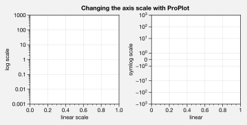
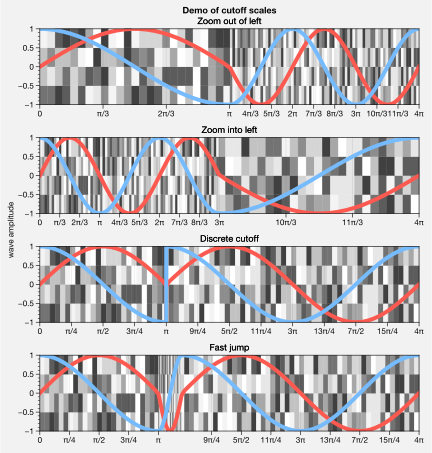
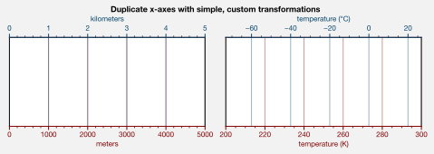
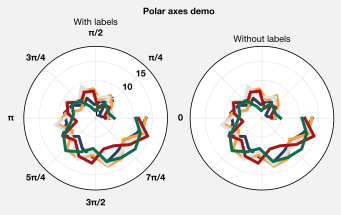

Cartesian axes features
=======================

`~proplot.axes.CartesianAxes` is the *default* axes type returned by
`~proplot.subplots.subplots`. The previous sections discussed features
relevant to all figures generated with ProPlot, or with axes regardless
of whether or not they are `~proplot.axes.ProjectionAxes`. This
section documents the features specific to
`~proplot.axes.CartesianAxes`.

Axis tick locations
-------------------

ProPlot lets you easily specify tick locations with
`~proplot.axes.BaseAxes.format` (keywords ``xlocator``, ``ylocator``,
``xminorlocator``, and ``yminorlocator``, or their aliases ``xticks``,
``yticks``, ``xminorticks``, and ``yminorticks``). Pass a number to tick
every ``N`` data values, lookup a builtin matplotlib
`~matplotlib.ticker` with a string key name, or pass a list of numbers
to tick specific locations. I recommend using ProPlot’s
`~proplot.utils.arange` function to generate lists of ticks – it’s
like numpy’s `~numpy.arange`, but is **endpoint-inclusive**, which is
usually what you’ll want in this context. See
`~proplot.axes.CartesianAxes.format_partial` and
`~proplot.axistools.Locator` for details.

.. code:: ipython3

    import proplot as plot
    import numpy as np
    plot.rc.facecolor = plot.shade('powder blue', 1.15) # shade makes it a bit brighter, multiplies luminance channel by this much!
    plot.rc.update(linewidth=1, small=10, large=12, color='dark blue', suptitlecolor='dark blue')
    f, axs = plot.subplots(nrows=5, axwidth=5, aspect=(8,1), share=0, span=0, hspace=0.3)
    # Basic locators
    axs[0].format(xlim=(0,200), xminorlocator=10, xlocator=30, suptitle='Declaring tick locations with ProPlot')
    axs[1].format(xlim=(0,10), xlocator=[0, 0.3,0.8,1.6, 4.4, 8, 8.8, 10], xminorlocator=0.1)
    axs[2].format(xlim=(1,100), xscale='log', xformatter='default') # use this to prevent exponential notation
    axs[3].format(xlim=(1,10), xscale='inverse', xlocator='linear')
    # Index locators are weird...require something plotted in the axes, will only label up bounds of data range
    # For below, could also use ('index', [...]) (i.e. an IndexFormatter), but not sure why this exists when we can just use FixedFormatter
    axs[4].plot(np.arange(10)-5, np.random.rand(10), alpha=0) # index locators 
    axs[4].format(xlim=(0,6), xlocator='index',
                  xformatter=[r'$\alpha$', r'$\beta$', r'$\gamma$', r'$\delta$', r'$\epsilon$', r'$\zeta$', r'$\eta$'])

.. image:: quickstart/quickstart_53_0.svg

Axis tick labels
----------------

ProPlot changes the default axis formatter (i.e. the class used to
convert float numbers to tick label strings). The new formatter trims
trailing zeros by default, and can be used to *filter tick labels within
some data range*, as demonstrated below. See
`~proplot.axistools.AutoFormatter` for details.

.. code:: ipython3

    import proplot as plot
    plot.rc.reset()
    locator = [0, 0.25, 0.5, 0.75, 1]
    plot.rc.linewidth = 2
    plot.rc.small = plot.rc.large = 12
    f, axs = plot.subplots(ncols=2, axwidth=2, share=0, subplotpad=0.5) # change subplotpad to change padding between subplots
    axs[1].format(xlocator=locator, ylocator=locator, xtickrange=[0,0.5], yticklabelloc='both', title='ProPlot formatter', titleweight='bold')
    axs[0].format(xlocator=locator, ylocator=locator, yticklabelloc='both', xformatter='scalar', yformatter='scalar', title='Matplotlib formatter', titleweight='bold')

.. image:: quickstart/quickstart_56_0.svg

ProPlot also lets you easily change the axis formatter with
`~proplot.axes.BaseAxes.format` (keywords ``xformatter`` and
``yformatter``, or their aliases ``xticklabels`` and ``yticklabels``).
The builtin matplotlib formatters can be referenced by string name, and
several new formatters have been introduced – for example, you can now
easily label your axes as fractions or as geographic coordinates. You
can also just pass a list of strings or a ``%``-style format directive.
See `~proplot.axes.CartesianAxes.format_partial` and
`~proplot.axistools.Formatter` for details.

.. code:: ipython3

    import proplot as plot
    import numpy as np
    plot.rc.update(linewidth=1.2, small=10, large=12, facecolor='gray8', figurefacecolor='gray8',
                   suptitlecolor='w', gridcolor='w', color='w')
    f, axs = plot.subplots(nrows=6, axwidth=5, aspect=(8,1), share=0, span=0, hspace=0.3)
    axs[0].format(xlim=(0,4*np.pi), xlocator=plot.arange(0, 4, 0.25)*np.pi, xformatter='pi')
    axs[1].format(xlim=(0,2*np.e), xlocator=plot.arange(0, 2, 0.5)*np.e, xticklabels='e')
    axs[2].format(xlim=(-90,90), xlocator=plot.arange(-90, 90, 30), xformatter='deglat')
    axs[3].format(xlim=(-1.01,1), xlocator=0.5, xticklabels=['a', 'b', 'c', 'd', 'e'])
    axs[4].format(xlim=(0, 0.001), xlocator=0.0001, xformatter='%.E')
    axs[5].format(xlim=(0,100), xtickminor=False, xlocator=20, xformatter='{x:.1f}')
    axs.format(ylocator='null', suptitle='Setting tick styles with ProPlot')

.. image:: quickstart/quickstart_58_0.svg

Axis scales
-----------

The axis scale (e.g. ``'log'``, ``'linear'``) can now be changed with
`~proplot.axes.BaseAxes.format`, and ProPlot adds several new ones.
The ``'cutoff'`` scale is great when you have weirdly distributed data
(see `~proplot.axistools.CutoffScaleFactory`). The ``'sine'`` scale
scales the axis as the sine of the coordinate, resulting in an
“area-weighted” spherical latitude coordinate. The ``'inverse'`` scale
is perfect for labeling spectral coordinates (this is more useful with
the `~proplot.axes.CartesianAxes.dualx` and
`~proplot.axes.CartesianAxes.dualy` commands; see
:ref:`Dual unit axes`). See
`~proplot.axes.CartesianAxes.format_partial` and
`~proplot.axistools.Scale` for details.

.. code:: ipython3

    import proplot as plot
    plot.rc.reset()
    f, axs = plot.subplots(ncols=2, axwidth=1.8, share=0, span=False)
    ax = axs[0]
    ax.format(xlim=(0,1), ylim=(1e-3, 1e3), xscale='linear', yscale='log',
              ylabel='log scale', xlabel='linear scale', suptitle='Changing the axis scale with ProPlot')
    ax = axs[1]
    ax.format(xlim=(0,1), ylim=(-1e3, 1e3), yscale='symlog', xlabel='linear', ylabel='symlog scale')

.. image:: quickstart/quickstart_61_0.svg

.. code:: ipython3

    import proplot as plot
    import numpy as np
    # plot.rc.fontname = 'Verdana'
    f, axs = plot.subplots(width=6, nrows=4, aspect=(5,1), sharey=False, sharex=False)
    # Compression
    ax = axs[0]
    x = np.linspace(0,4*np.pi,100)
    dy = np.linspace(-1,1,5)
    y1 = np.sin(x)
    y2 = np.cos(x)
    data = np.random.rand(len(dy)-1, len(x)-1)
    scales = [(3, np.pi), (0.3, 3*np.pi), (np.inf, np.pi, 2*np.pi), (5, np.pi, 2*np.pi)]
    titles = ('Zoom out of left', 'Zoom into left', 'Discrete cutoff', 'Fast jump')
    locators = [np.pi/3, np.pi/3, *([x*np.pi for x in plot.arange(0, 4, 0.25) if not (1 < x <= 2)] for i in range(2))]
    for ax,scale,title,locator in zip(axs,scales,titles,locators):
        ax.pcolormesh(x, dy, data, cmap='grays', cmap_kw={'right': 0.8})
        for y,color in zip((y1,y2), ('coral','sky blue')):
            ax.plot(x, y, lw=4, color=color)
        ax.format(xscale=('cutoff', *scale), title=title,
                  xlim=(0,4*np.pi), ylabel='wave amplitude', # note since 'spanning labels' turned on by default, only one label is drawn
                  xformatter='pi', xlocator=locator,
                  xtickminor=False, xgrid=True, ygrid=False, suptitle='Demo of cutoff scales')

.. code:: ipython3

    import proplot as plot
    import numpy as np
    plot.rc.reset()
    f, axs = plot.subplots(nrows=3, ncols=2, axwidth=1.5, span=False, share=0)
    axs.format(rowlabels=['Power\nscales', 'Exponential\nscales', 'Geographic\nscales'], suptitle='Demo of esoteric axis scales')
    x = np.linspace(0,1,50)
    y = 10*x
    data = np.random.rand(len(y)-1, len(x)-1)
    # Power scales
    colors = ('coral','sky blue')
    for ax,power,color in zip(axs[:2],(2,1/4),colors):
        ax.pcolormesh(x, y, data, cmap='grays', cmap_kw={'right': 0.8})
        ax.plot(x, y, lw=4, color=color)
        ax.format(ylim=(0.1,10), yscale=('power',power), title=f'$x^{{{power}}}$')
    # Exp scales
    for ax,a,c,color in zip(axs[2:4],(np.e,2),(0.5,-1),colors):
        ax.pcolormesh(x, y, data, cmap='grays', cmap_kw={'right': 0.8})
        ax.plot(x, y, lw=4, color=color)
        ax.format(ylim=(0.1,10), yscale=('exp',a,c), title=f'${(a,"e")[a==np.e]}^{{{c}x}}$')
    # Geographic scales
    n = 20
    x = np.linspace(-180,180,n)
    y = np.linspace(-85,85,n) # note sine just truncated values not in [-90,90], but Mercator transformation can reflect them
    y2 = np.linspace(-85,85,n) # for pcolor
    data = np.random.rand(len(x), len(y2))
    for ax,scale,color in zip(axs[4:],('sine','mercator'),('coral','sky blue')):
        ax.plot(x, y, '-', color=color, lw=4)
        ax.pcolormesh(x, y2, data, cmap='grays', cmap_kw={'right': 0.8}) # use 'right' to trim the colormap from 0-1 color range to 0-0.8 color range
        ax.format(title=scale.title() + ' y-axis', yscale=scale,
                  ytickloc='left',
                  yformatter='deglat', grid=False, ylocator=20,
                  xscale='linear', xlim=None, ylim=(-85,85))

.. image:: quickstart/quickstart_63_0.svg

Time axis formatting
--------------------

Labeling datetime axes is incredibly easy with ProPlot. Pass a time-unit
string as the ``locator`` argument, and the axis will be ticked at those
units. Pass a ``(unit, interval)`` tuple to tick every ``interval``
``unit``\ s. Use the ``formatter`` argument for `%-style formatting of
datetime <https://docs.python.org/3/library/datetime.html#strftime-strptime-behavior>`__.
Again, see `~proplot.axes.CartesianAxes.format_partial`,
`~proplot.axistools.Locator`, and `~proplot.axistools.Formatter` for
details.

.. code:: ipython3

    import proplot as plot
    import numpy as np
    plot.rc.update(linewidth=1.2, small=10, large=12, ticklabelweight='bold', ticklenratio=0.7,
                   figurefacecolor='w', facecolor=plot.shade('C0', 2.7), abcformat='BBBa')
    f, axs = plot.subplots(nrows=5, axwidth=6, aspect=(8,1), share=0, span=0, hspace=0.3)
    axs[0].format(xlim=(np.datetime64('2000-01-01'), np.datetime64('2001-01-02')),
                  xrotation=0) # default date locator enabled if you plot datetime data or set datetime limits
    axs[1].format(xlim=(np.datetime64('2000-01-01'), np.datetime64('2050-01-01')), xrotation=0,
                  xlocator=('year', 10), xformatter='\'%y') # minor ticks every month
    axs[2].format(xlim=(np.datetime64('2000-01-01T00:00:00'), np.datetime64('2000-01-01T12:00:00')), xrotation=0,
                  xlocator=('hour',range(0,24,2)), xminorlocator=('minute',range(0,60,10)), xformatter='T%H:%M:%S') # minor ticks every 10 minutes, major every 2
    axs[3].format(xlim=(np.datetime64('2000-01-01'), np.datetime64('2008-01-01')),
                  xlocator='year', xminorlocator='month', xformatter='%b %Y') # minor ticks every month
    axs[4].format(xlim=(np.datetime64('2000-01-01'), np.datetime64('2001-01-01')),
                  xgridminor=True, xgrid=False,
                  xlocator='month', xminorlocator='weekday', xformatter='%B') # minor ticks every Monday, major every month
    axs.format(ylocator='null', suptitle='Tick locators and formatters with time axes in ProPlot')

Dual unit axes
--------------

The new `~proplot.axes.CartesianAxes.dualx` and
`~proplot.axes.CartesianAxes.dualy` methods build duplicate *x* and
*y* axes meant to represent *alternate units* in the same coordinate
range as the “parent” axis. For simple transformations, just use the
``offset`` and ``scale`` keyword args. For more complex transformations,
pass the name of any registered “axis scale” to the ``xscale`` or
``yscale`` keyword args (see below).

.. code:: ipython3

    import proplot as plot
    plot.rc.reset()
    plot.rc.update({'grid.alpha':0.4, 'linewidth':1, 'grid.linewidth':1})
    f, axs = plot.subplots(ncols=2, share=0, span=0, aspect=2.2, axwidth=3)
    N = 200
    c1, c2 = plot.shade('cerulean', 0.5), plot.shade('red', 0.5)
    # These first 2 are for general users
    ax = axs[0]
    ax.format(yformatter='null', xlabel='meters', xlocator=1000, xlim=(0,5000),
              xcolor=c2, gridcolor=c2,
              suptitle='Duplicate x-axes with simple, custom transformations', ylocator=[], # locator=[] has same result as locator='null'
              )
    ax.dualx(scale=1e-3, xlabel='kilometers', grid=True, xcolor=c1, gridcolor=c1)
    ax = axs[1]
    ax.format(yformatter='null', xlabel='temperature (K)', title='', xlim=(200,300), ylocator='null',
             xcolor=c2, gridcolor=c2)
    ax.dualx(offset=-273.15, xlabel='temperature (\N{DEGREE SIGN}C)',
             xcolor=c1, gridcolor=c1, grid=True)
    
    # These next 2 are for atmospheric scientists; note the assumed scale height is 7km
    f, axs = plot.subplots(ncols=2, share=0, span=0, aspect=0.4, axwidth=1.8)
    ax = axs[0]
    ax.format(xformatter='null', ylabel='pressure (hPa)', ylim=(1000,10), xlocator=[], 
              gridcolor=c1, ycolor=c1)
    ax.dualy(yscale='height', ylabel='height (km)', yticks=2.5, color=c2, gridcolor=c2, grid=True)
    ax = axs[1] # span
    ax.format(xformatter='null', ylabel='height (km)', ylim=(0,20), xlocator='null', gridcolor=c2, ycolor=c2,
              suptitle='Duplicate y-axes with special transformations', grid=True)
    ax.dualy(yscale='pressure', ylabel='pressure (hPa)', ylocator=100, grid=True, color=c1, gridcolor=c1)

.. image:: quickstart/quickstart_69_0.svg

.. image:: quickstart/quickstart_69_1.svg

.. code:: ipython3

    # Plot the response function for an imaginary 5-day lowpass filter
    import proplot as plot
    import numpy as np
    plot.rc.reset()
    plot.rc['axes.ymargin'] = 0
    cutoff = 0.3
    x = np.linspace(0.01,0.5,1000) # in wavenumber days
    response = (np.tanh(-((x - cutoff)/0.03)) + 1)/2 # imgarinary response function
    f, ax = plot.subplots(aspect=(3,1), width=6)#, tight=False, top=2)
    ax.fill_between(x, 0, response, facecolor='none', edgecolor='gray8', lw=1, clip_on=True)
    red = plot.saturate(plot.shade('red', 0.7), 3)
    ax.axvline(cutoff, lw=2, ls='-', color=red)
    ax.fill_between([0.27, 0.33], 0, 1, color=red, alpha=0.3)
    ax.format(xlabel='wavenumber (days$^{-1}$)', ylabel='response', gridminor=True)
    ax.dualx(xscale='inverse', xlocator=np.array([20, 10, 5, 2, 1, 0.5, 0.2, 0.1, 0.05]),
              xlabel='period (days)',
              title='Imgaginary response function',
              suptitle='Duplicate x-axes with wavenumber and period', 
              )

Polar axes
----------

Polar axes in ProPlot work just like Cartesian axes, except the
`~proplot.axes.CartesianAxes.format_partial` ``x`` and ``y`` keyword
args correspond to the “theta” and “radius” axes, respectively. To
declare polar axes, pass ``proj='polar'`` or something like
``proj={1:'polar'}`` to `~proplot.subplots.subplots`. See
:ref:`Projection axes features` for more on specifying subplot
projections.

.. code:: ipython3

    import proplot as plot
    import numpy as np
    f, axs = plot.subplots(proj='polar', ncols=2)
    axs.format(suptitle='Polar axes demo', collabels=['With labels', 'Without labels'], collabelweight='normal')
    N = 20
    x = np.linspace(0, 2*np.pi, N)
    y = np.random.rand(N,5).cumsum(axis=0) + 5*np.random.rand(N,5)
    axs.plot(x, y, cycle='contrast', lw=3)
    axs.format(linewidth=0.8, ticklabelsize=9, ticklabelweight='bold', ylocator=5, ytickloc=45, ylim=(0,19))
    axs[0].format(xformatter='pi')
    axs[1].format(xformatter='none', yformatter='none')

