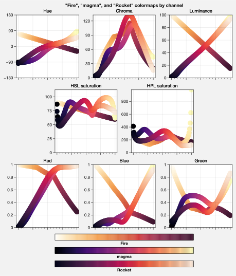
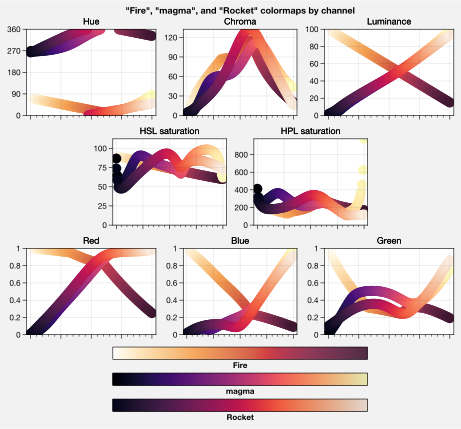
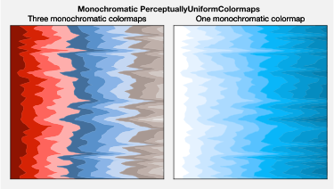
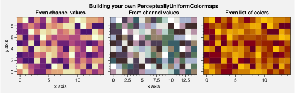
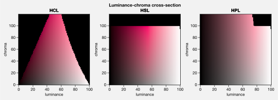
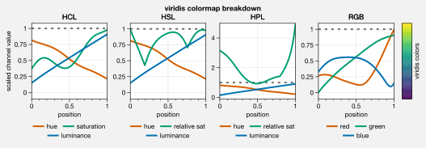
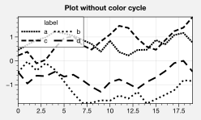
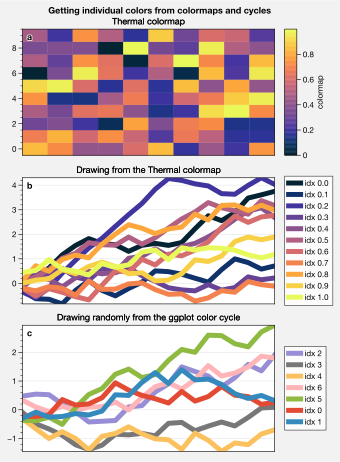

Color usage
===========

ProPlot isn’t just an alternative to `~matplotlib.pyplot`. It also
adds some neat features to help you use colors effectively in your
figures, and integrates palettes from several online data visualization
tools.

First things first, ProPlot makes a distinction between *colormaps* and
*color cycles*.

-  A *colormap* is a palette constructed by sampling some *smooth,
   linear* function between two end colors. Colormaps are generally used
   for 2-D or 3-D plots, where the color serves as an extra “dimension”.
   This is implemented in matplotlib with the
   `~matplotlib.colors.LinearSegmentedColormap` class, and also with
   the special ProPlot
   `~proplot.colortools.PerceptuallyUniformColormap` subclass (see
   :ref:`On-the-fly colormaps`).
-  A *color cycle* is a palette composed of a *jumbled set* of distinct
   colors. Interpolation between these colors does not make sense. Color
   cycles are generally used with line plots, bar plots, and other plot
   elements. They are conceptually implemented in matplotlib with the
   `~matplotlib.colors.ListedColormap` class (although it is often
   improperly used). ProPlot uses this class to register color cycles,
   and the color cycles are “applied” by globally or axes-locally
   modifying the `property
   cycler <https://matplotlib.org/3.1.0/tutorials/intermediate/color_cycle.html>`__.
   *Colormaps* can also be cut up and used as color cycles (see
   :ref:`On-the-fly color cycles`).

This section documents the colormaps and cycles registered after
importing ProPlot, explains how to make custom colormaps and cycles, and
shows how to apply them to your plots using axes methods wrapped by
`~proplot.wrappers.cmap_wrapper` or
`~proplot.wrappers.cycle_wrapper`.

Registered colormaps
--------------------

On import, ProPlot registers a few sample
`~proplot.colortools.PerceptuallyUniformColormap` colormaps (see
:ref:`Perceptually uniform colormaps`) plus a ton of other colormaps
from other online data viz projects. Use
`~proplot.colortools.show_cmaps` to generate a table of registered
maps, as shown below. The figure is broken down into the following
sections:

-  “User” colormaps, i.e. colormaps saved to your ``~/.proplot/cmaps``
   folder. A great way to save colormaps to this folder is using the
   `~proplot.colortools.Colormap` constructor function. See
   :ref:`On-the-fly colormaps` for details.
-  Original matplotlib and seaborn colormaps.
-  ProPlot maps belonging to the
   `~proplot.colortools.PerceptuallyUniformColormap` class. See the
   :ref:`Perceptually uniform colormaps` section.
-  `ColorBrewer <http://colorbrewer2.org/>`__ maps, included with
   matplotlib by default.
-  `cmOcean <https://matplotlib.org/cmocean/>`__ colormaps, originally
   intended for oceanographic visualizations but useful for all
   scientific fields.
-  Miscellaneous diverging colormaps.
-  Maps from the
   `SciVisColor <https://sciviscolor.org/home/colormoves/>`__ online
   interactive tool. There are so many of these maps because they are
   intended to be *merged* with one another – suitable for complex
   datasets with complex statistical distributions.

ProPlot removes some default matplotlib colormaps with erratic color
transitions. Note that colormap and color cycle identification is now
flexible: names are *case-insensitive* (e.g. ``'Viridis'``,
``'viridis'``, and ``'ViRiDiS'`` are equivalent) and can be specified in
their “reversed” form (e.g. ``'BuRd'`` is equivalent to ``'RdBu_r'``).
See `~proplot.colortools.CmapDict` for more info.

.. code:: ipython3

    import proplot as plot
    f = plot.show_cmaps(31)

.. image:: quickstart/quickstart_100_1.svg

On-the-fly colormaps
--------------------

You can make a new colormap with ProPlot’s on-the-fly colormap
generator! Every command that accepts a ``cmap`` argument (see
`~proplot.wrappers.cmap_wrapper`) is passed to the
`~proplot.colortools.Colormap` constructor.
`~proplot.colortools.Colormap` keyword arguments can be specified with
``cmap_kw``. If you want to save your own colormap into ``~/.proplot``,
simply pass ``save=True`` to the `~proplot.colortools.Colormap`
constructor (or supply a plotting command with
``cmap_kw={'save':True, 'name':name}``, and it will be loaded every time
you import ProPlot. See `~proplot.colortools.Colormap` and
`~proplot.wrappers.cmap_wrapper` for details.

As a first example: To merge colormaps, simply pass multiple arguments
to the `~proplot.colortools.Colormap` constructor. This makes it easy
to create complex SciVisColor-style colormaps, desirable for complex
datasets with funky statistical distributions. The below reconstructs
the colormap from `this
example <https://sciviscolor.org/wp-content/uploads/sites/14/2018/04/colormoves-icon-1.png>`__.

.. code:: ipython3

    import proplot as plot
    import numpy as np
    f, axs = plot.subplots(ncols=2, axwidth=2.5, colorbars='b', bottom=0.1)
    data = np.random.rand(100,100).cumsum(axis=1)
    # Make colormap, save as "test1.json"
    cmap = plot.Colormap('Green1_r', 'Orange5', 'Blue1_r', 'Blue6', name='test1', save=True)
    m = axs[0].contourf(data, cmap=cmap, levels=100)
    f.bpanel[0].colorbar(m, locator='none')
    # Make colormap, save as "test2.json"
    cmap = plot.Colormap('Green1_r', 'Orange5', 'Blue1_r', 'Blue6', ratios=(1,3,5,10), name='test2', save=True)
    m = axs[1].contourf(data, cmap=cmap, levels=100)
    f.bpanel[1].colorbar(m, locator='none')
    axs.format(xticks='none', yticks='none', suptitle='Merging existing colormaps')
    for ax,title in zip(axs, ['Evenly spaced', 'Matching SciVisColor example']):
        ax.format(title=title)

.. image:: quickstart/quickstart_103_1.svg

To build monochromatic colormaps from arbitrary colors, just pass a
color name, hex string, or RGB tuple to
`~proplot.colortools.Colormap`. The colormaps will vary from the
specified color to some shade near white – this is controlled by the
``fade`` keyword argument. The default is to fade to pure white. The
first plot shows several of these maps merged into one, and the second
is just one map.

.. code:: ipython3

    import proplot as plot
    import numpy as np
    f, axs = plot.subplots(ncols=2, axwidth=2.4, aspect=1, colorbars='b', bottom=0.1)
    data = np.random.rand(50,50).cumsum(axis=1)
    cmap = plot.Colormap('charcoal', 'navy', 'brick red', fade=90, reverse=True)
    m = axs[0].contourf(data, cmap=cmap, levels=12)
    f.bpanel[0].colorbar(m, locator='null')
    m = axs[1].contourf(data, cmap='ocean blue')
    f.bpanel[1].colorbar(m, locator='null')
    axs.format(xticks='none', yticks='none', suptitle='On-the-fly monochromatic maps')
    for ax,title in zip(axs, ['Three monochromatic colormaps, merged', 'Single monochromatic colormap']):
        ax.format(title=title)

To modify a diverging colormap by cutting out some central colors, pass
the ``cut`` argument to `~proplot.colortools.Colormap`. This is great
when you want to have a sharper cutoff between negative and positive
values.

.. code:: ipython3

    import proplot as plot
    import numpy as np
    f, axs = plot.subplots(ncols=3, axcolorbars='b', axwidth=2)
    data = np.random.rand(50,50).cumsum(axis=0) - 50
    for ax,cut in zip(axs,(0, 0.1, 0.2)):
        m = ax.contourf(data, cmap='NegPos2', cmap_kw={'cut':cut}, levels=13)
        ax.format(xlabel='x axis', ylabel='y axis', title=f'cut = {cut}',
                  suptitle='Cutting out the central colors from a diverging colormap')
        ax.bpanel.colorbar(m, locator='null')

To rotate a cyclic colormap, pass the ``shift`` argument to
`~proplot.colortools.Colormap`. Cyclic colormaps are colormaps for
which ``cyclic=True`` was passed to `~proplot.colortools.Colormap` on
construction. ProPlot ensures the colors at the ends of these maps are
distinct, so that levels don’t blur together.

.. code:: ipython3

    import proplot as plot
    import numpy as np
    f, axs = plot.subplots(ncols=3, axcolorbars='b', axwidth=2)
    data = (np.random.rand(50,50)-0.48).cumsum(axis=1).cumsum(axis=0) - 50
    for ax,shift in zip(axs,(0, 90, 180)):
        m = ax.contourf(data, cmap='twilight', cmap_kw={'shift':shift}, levels=12)
        ax.format(xlabel='x axis', ylabel='y axis', title=f'shift = {shift}',
                  suptitle='Rotating the colors in a cyclic colormap')
        ax.bpanel.colorbar(m, locator='null')

Perceptually uniform colormaps
------------------------------

ProPlot’s custom colormaps are instances of the new
``PerceptuallyUniformColormap`` class (see :ref:`Registered colormaps`
for a table). These classes employ *linear transitions* between channel
values in any of three possible “perceptually uniform”, HSV-like
colorspaces. These colorspaces can be described as follows:

-  **HCL**: A purely perceptually uniform colorspace, where colors are
   broken down into “hue” (color, range 0-360), “chroma” (saturation,
   range 0-100), and “luminance” (brightness, range 0-100).
-  **HPLuv**: As with HCL, but 100 saturation is scaled to be the
   *minimum maximum saturation* across all hues for a given luminance,
   and is hence more appropriate for multi-hue colormaps.
-  **HSLuv**: As with HCL, but 100 saturation is scaled to be the
   *maximum possible saturation* for a given hue and luminance. This is
   more appropriate for single-hue colormaps, because crossing hues in
   this space make it more likely that bands of higher absolute
   saturation are crossed.

The HCL space is the only “purely” perceptually uniform colorspace. But
during a linear transition between two values, we may cross over
“impossible” colors (i.e. colors with RGB channels >1). The HSLuv and
HPLuv colorspaces were developed to resolve this issue by (respectively)
scaling and clipping high-saturation colors across different hues and
luminances.

Use `~proplot.colortools.show_colorspaces` to plot arbitrary
cross-sections of these colorspaces. Also see `this
page <http://www.hsluv.org/comparison/>`__.

.. code:: ipython3

    import proplot as plot
    f = plot.show_colorspaces(luminance=50)

.. code:: ipython3

    import proplot as plot
    f = plot.show_colorspaces(saturation=60)

.. image:: quickstart/quickstart_113_0.svg

.. code:: ipython3

    import proplot as plot
    f = plot.show_colorspaces(hue=0)

.. image:: quickstart/quickstart_114_0.svg

You can generate your own
`~proplot.colortools.PerceptuallyUniformColormap` on-the-fly by
passing a dictionary as the ``cmap`` keyword argument. This is powered
by the `~proplot.colortools.PerceptuallyUniformColormap.from_hsl`
static method. See :ref:`Perceptually uniform colormaps` for details.

The ``h``, ``s``, and ``l`` arguments can be single numbers, color
strings, or lists thereof. Numbers just indicate the channel value. For
color strings, the corresponding channel value (i.e. hue, saturation, or
luminance) for that color will be looked up. You can end any color
string with ``+N`` or ``-N`` to offset the channel value by the number
``N``, as shown below.

.. code:: ipython3

    import proplot as plot
    import numpy as np
    f, axs = plot.subplots(ncols=2, span=False, axcolorbars='b', axwidth=2.5, aspect=1.5)
    ax = axs[0]
    cmap = plot.Colormap({'hue':['red-120', 'red+90'], 'saturation':[50, 70, 30], 'luminance':[20, 100], 'space':'hcl'})
    m = ax.contourf(np.random.rand(10,10), levels=plot.arange(0.1,0.9,0.1), extend='both', colorbar='b', cmap=cmap)
    ax.format(xlabel='x axis', ylabel='y axis', title='Matter look-alike',
              suptitle='Building your own PerceptuallyUniformColormaps')
    ax = axs[1]
    cmap = plot.Colormap({'hue':['red', 'red-720'], 'saturation':[80,20], 'luminance':[20, 100], 'space':'hpl'})
    m = ax.contourf(np.random.rand(10,10), levels=plot.arange(0.1,0.9,0.05), extend='both', colorbar='b', colorbar_kw={'locator':0.1}, cmap=cmap)
    ax.format(xlabel='x axis', ylabel='y axis', title='cubehelix look-alike')

It is also easy to change the “gamma” of a
`~proplot.colortools.PerceptuallyUniformColormap` uniform colormap
on-the-fly. The “gamma” controls how the luminance and saturation
channels vary across the two ends of the colormap. A gamma larger than
``1`` emphasizes high luminance, low saturation colors, and a gamma
smaller than ``1`` emphasizes low luminance, high saturation colors. See
`~proplot.colortools.PerceptuallyUniformColormap` for details.

.. code:: ipython3

    import proplot as plot
    import numpy as np
    f, axs = plot.subplots(ncols=3, nrows=2, axcolorbars='r', aspect=1)
    data = np.random.rand(10,10).cumsum(axis=1)
    i = 0
    for cmap in ('boreal','fire'):
        for gamma in (0.8, 1.0, 1.4):
            ax = axs[i]
            m1 = ax.pcolormesh(data, cmap=cmap, cmap_kw={'gamma':gamma}, levels=10, extend='both')
            ax.rpanel.colorbar(m1, locator='none')
            ax.format(title=f'gamma = {gamma}', xlabel='x axis', ylabel='y axis', suptitle='Modifying existing PerceptuallyUniformColormaps')
            i += 1

.. image:: quickstart/quickstart_118_0.svg

To see how the colors in a colormap vary across different colorspaces,
use the `~proplot.colortools.cmap_breakdown` function. This is done
below for the builtin “viridis” colormap and the “Fire”
`~proplot.colortools.PerceptuallyUniformColormap`. We see that
transitions for “Fire” are linear in HSL space, while transitions for
“virids” are linear in hue and luminance for all colorspaces, but
non-linear in saturation.

.. code:: ipython3

    import proplot as plot
    plot.breakdown_cmap('fire')
    plot.breakdown_cmap('viridis')

.. image:: quickstart/quickstart_120_1.svg

Adding online colormaps
-----------------------

There are plenty of online interactive tools for generating perceptually
uniform colormaps, including
`HCLWizard <http://hclwizard.org:64230/hclwizard/>`__,
`Chroma.js <https://gka.github.io/palettes/#colors=lightyellow,orange,deeppink,darkred%7Csteps=7%7Cbez=1%7CcoL=1>`__,
`SciVisColor <https://sciviscolor.org/home/colormaps/>`__, and `HCL
picker <http://tristen.ca/hcl-picker/#/hlc/12/0.99/C6F67D/0B2026>`__.

To add colormaps downloaded from any of these sources, save the colormap
data to a file in your ``~/.proplot/cmaps`` folder, then call
`~proplot.colortools.register_cmaps`. The file should be named
``name.ext``, where ``name`` is the registered colormap name and ``ext``
is the file extension. See `~proplot.colortools.register_cmaps` for
valid file extensions.

Registered color cycles
-----------------------

Use `~proplot.colortools.show_cycles` to generate a table of the color
cycles registered by default and loaded from your ``~/.proplot/cycles``
folder. You can make your own color cycles using the
`~proplot.colortools.Cycle` constructor function. See the
:ref:`Color usage` introduction for more on the differences between
colormaps and color cycles.

.. code:: ipython3

    import proplot as plot
    f = plot.show_cycles()

.. image:: quickstart/quickstart_125_1.svg

On-the-fly color cycles
-----------------------

With ProPlot, you can specify the color cycle by passing ``cycle`` to
plotting commands like `~matplotlib.axes.Axes.plot` or
`~matplotlib.axes.Axes.scatter` (e.g. ``ax.plot(..., cycle='538')`` –
see `~proplot.wrappers.cycle_wrapper`), or by changing the global
default cycle (e.g. ``plot.rc.cycle = '538'`` – see the
`~proplot.rcmod` documentation). In both cases, the arguments are
passed to the `~proplot.colortools.Cycle` constructor.
`~proplot.colortools.Cycle` keyword arguments can be specified by
passing ``cycle_kw`` to a plotting command. If you want to save your own
color cycle into ``~/.proplot``, simply pass ``save=True`` to the
`~proplot.colortools.Cycle` constructor (or supply a plotting command
with ``cycle_kw={'save':True, 'name':name}``), and it will be loaded
every time you import ProPlot. The below example demonstrates these
methods.

.. code:: ipython3

    import proplot as plot
    import numpy as np
    data = (np.random.rand(12,12)-0.45).cumsum(axis=0)
    plot.rc.cycle = 'contrast'
    lw = 5
    f, axs = plot.subplots(ncols=3, axwidth=1.7)
    # Here the default cycle is used
    ax = axs[0]
    ax.plot(data, lw=lw)
    # Note that specifying "cycle" does not reset the color cycle
    ax = axs[1]
    ax.plot(data, cycle='qual2', lw=lw)
    ax = axs[2]
    for i in range(data.shape[1]):
        ax.plot(data[:,i], cycle='qual2', lw=lw)
    # Format
    axs.format(xformatter=[], yformatter=[], suptitle='Local and global color cycles demo')

.. image:: quickstart/quickstart_128_0.svg

Finally, *colormaps* (or combinations thereof) can be used as sources
for generating color cycles. Just pass a tuple of colormap name(s) to
the `~proplot.colortools.Cycle` constructor, with the last entry of
the tuple indicating the number of samples you want to draw. To exclude
near-white colors on the end of a colormap, just pass e.g. ``left=x`` to
`~proplot.colortools.Cycle` (or supply a plotting command with e.g.
``cycle_kw={'left':x}``). This cuts out the leftmost ``x`` proportion of
the colormap before drawing colors from said map. See
`~proplot.colortools.Colormap` for details.

.. code:: ipython3

    import proplot as plot
    import numpy as np
    f, axs = plot.subplots(ncols=2, colorbars='b', share=0, span=False, axwidth=2.2, aspect=1.5)
    data = (20*np.random.rand(10,21)-10).cumsum(axis=0)
    # Example 1
    ax = axs[0]
    lines = ax.plot(data[:,:5], cycle='purples', cycle_kw={'left':0.3}, lw=5)
    f.bpanel[0].colorbar(lines, values=np.arange(0,len(lines)), label='clabel')
    ax.format(title='Simple cycle')
    # Example 2
    ax = axs[1]
    cycle = plot.Cycle('blues', 'reds', 'oranges', 21, left=[0.1]*3)
    lines = ax.plot(data, cycle=cycle, lw=5)
    f.bpanel[1].colorbar(lines, values=np.arange(0,len(lines)), label='clabel')
    ax.format(title='Complex cycle', suptitle='Color cycles from colormaps demo')

.. image:: quickstart/quickstart_130_0.svg

`~proplot.wrappers.cycle_wrapper` can also be used to change
properties other than color. Below, a single-color dash style cycler is
generated using the `~proplot.colortools.Cycle` function and applied
to the axes locally. To apply it globally, simply use
``plot.rc['axes.prop_cycle'] = cycle``.

.. code:: ipython3

    import proplot as plot
    import numpy as np
    import pandas as pd
    f, ax = plot.subplots(axwidth=3, aspect=2)
    data = (np.random.rand(20,4)-0.5).cumsum(axis=0)
    data = pd.DataFrame(data, columns=pd.Index(['a','b','c','d'], name='label'))
    ax.format(suptitle='Plot without color cycle')
    cycle = plot.Cycle(dashes=[(1,0.5),(1,1.5),(3,1.5),(5,3)])
    obj = ax.plot(data, lw=2, cycle=cycle, legend='ul', legend_kw={'ncols':2, 'handlelength':3})

Adding online color cycles
--------------------------

There are plenty of online interactive tools for generating and testing
color cycles, including `i want
hue <http://tools.medialab.sciences-po.fr/iwanthue/index.php>`__,
`coolers <https://coolors.co>`__, and `viz
palette <https://projects.susielu.com/viz-palette>`__.

To add color cycles downloaded from any of these sources, save the cycle
data to a file in your ``~/.proplot/cycles`` folder, then call
`~proplot.colortools.register_cycles`. The file should be named
``name.ext``, where ``name`` is the registered cycle name and ``ext`` is
the file extension. See `~proplot.colortools.register_cmaps` for valid
file extensions.

Registered color names
----------------------

ProPlot defines new color names from the `XKCD “color
survey” <https://blog.xkcd.com/2010/05/03/color-survey-results/>`__,
official `Crayola crayon
colors <https://en.wikipedia.org/wiki/List_of_Crayola_crayon_colors>`__,
and from the `“Open color” <https://github.com/yeun/open-color>`__
Github project. This was inspired by
`seaborn <https://seaborn.pydata.org/tutorial/color_palettes.html>`__.
Use `~proplot.colortools.show_colors` to generate tables of these
colors, as shown below. Note that the native matplotlib `CSS4 named
colors <https://matplotlib.org/examples/color/named_colors.html>`__ are
still registered, but I encourage using colors from the tables instead.

To reduce the number of registered color names to a more manageable
size, XKCD and Crayola colors must have *sufficiently distinct
coordinates* in the HCL perceptually uniform colorspace before they are
added to ProPlot. This makes it a bit easier to pick out colors from a
table generated with `~proplot.colortools.show_colors`. Similar names
were also cleaned up – for example, “reddish” and “reddy” are changed to
“red”.

.. code:: ipython3

    import proplot as plot
    f = plot.show_colors()

.. image:: quickstart/quickstart_137_0.svg

.. image:: quickstart/quickstart_137_1.svg

Individual color sampling
-------------------------

If you want to draw an individual color from a smooth colormap or a
color cycle, use ``color=(cmapname, position)`` or
``color=(cyclename, index)`` with any command that accepts the ``color``
keyword! The ``position`` should be between 0 and 1, while the ``index``
is the index on the list of colors in the cycle. This feature is powered
by the `~proplot.colortools.ColorCacheDict` class.

.. code:: ipython3

    import proplot as plot
    import numpy as np
    f, axs = plot.subplots(nrows=3, aspect=(2,1), axwidth=3.5, axcolorbars='r', share=False)
    m = axs[0].pcolormesh(np.random.rand(10,10), cmap='thermal', levels=np.linspace(0, 1, 101))
    axs[0].rpanel.colorbar(m, label='colormap', locator=0.2)
    axs[0].format(title='Thermal colormap')
    l = []
    for idx in plot.arange(0, 1, 0.1):
        h = axs[1].plot((np.random.rand(20)-0.4).cumsum(), lw=5, color=('thermal', idx), label=f'idx {idx:.1f}')
        l.append(h)
    axs[1].rpanel.legend(l, ncols=1)
    axs[1].format(title='Drawing from the Thermal colormap')
    l = []
    idxs = np.arange(7)
    np.random.shuffle(idxs)
    for idx in idxs:
        h = axs[2].plot((np.random.rand(20)-0.4).cumsum(), lw=5, color=('ggplot', idx), label=f'idx {idx:.0f}')
        l.append(h)
    axs[2].rpanel.legend(l, ncols=1)
    axs[2].format(title='Drawing randomly from the ggplot color cycle')
    axs.format(xlocator='null', abc=True, abcloc='ul', suptitle='Getting individual colors from colormaps and cycles')

