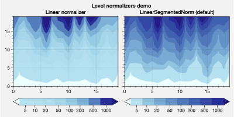
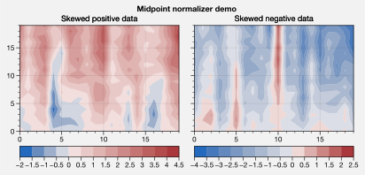
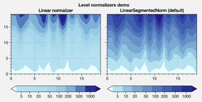
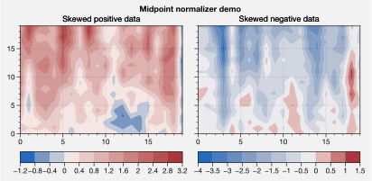
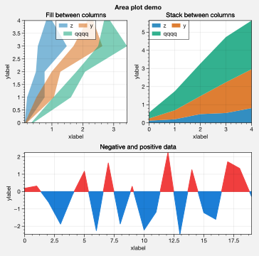
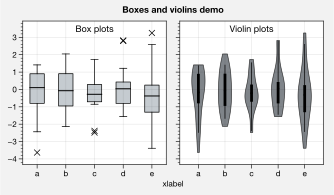

Plotting enhancements
=====================

Various matplotlib plotting commands have new features thanks to a set
of wrapper functions (see the `~proplot.axes` documentation). The most
interesting of these are `~proplot.wrappers.cmap_wrapper` and
`~proplot.wrappers.cycle_wrapper`, which allow constructing
:ref:`On-the-fly colormaps` and :ref:`On-the-fly color cycles`
(follow links for details). Here we document *other* features enabled by
the plotting wrappers, starting with `~matplotlib.axes.Axes.plot`.

Colormap normalizers
--------------------

`~proplot.wrappers.cmap_wrapper` assigns the
`~proplot.colortools.BinNorm` “meta-normalizer” as the data normalizer
for all colormap plots. This allows for discrete levels in all
situations – that is, `~matplotlib.axes.Axes.pcolor` and
`~matplotlib.axes.Axes.pcolormesh` now accept a ``levels`` keyword
arg, just like `~matplotlib.axes.Axes.contourf`.
`~proplot.colortools.BinNorm` also ensures the colorbar colors span
the entire colormap range, and that “cyclic” colorbar colors are
distinct on each end.

`~proplot.wrappers.cmap_wrapper` also fixes the well-documented
`white-lines-between-filled-contours <https://stackoverflow.com/q/8263769/4970632>`__
and
`white-lines-between-pcolor-rectangles <https://stackoverflow.com/q/27092991/4970632>`__
issues by automatically changing the edge colors after
`~matplotlib.axes.Axes.contourf`, `~matplotlib.axes.Axes.pcolor`,
and `~matplotlib.axes.Axes.pcolormesh` are called. To disable this
behavior, use ``edgefix=False``.

.. code:: ipython3

    import proplot as plot
    import numpy as np
    f, axs = plot.subplots(ncols=5, width=8, wratios=(5,3,3,3,3), axcolorbars='b')
    axs.format(suptitle='Demo of colorbar color-range standardization')
    levels = plot.arange(0,360,45)
    data = (20*(np.random.rand(20,20) - 0.4).cumsum(axis=0).cumsum(axis=1)) % 360
    ax = axs[0]
    ax.contourf(data, levels=levels, cmap='phase', extend='neither', colorbar='b')
    ax.format(title='Cyclic map with separate ends')
    for ax,extend in zip(axs[1:], ('min','max','neither','both')):
        ax.contourf(data, levels=levels, cmap='spectral', extend=extend, colorbar='b', colorbar_kw={'locator':90})
        ax.format(title=f'Map with extend={extend}')

.. code:: ipython3

    import proplot as plot
    import numpy as np
    f, axs = plot.subplots(ncols=2, axwidth=1.5, axcolorbars={1:'l', 2:'r'})
    cmap = 'orange5'
    data = np.random.rand(20,20)
    axs.format(suptitle='Pcolor with levels demo')
    ax = axs[0]
    ax.pcolor(data, cmap=cmap, colorbar='l', vmin=0, vmax=1, levels=200, colorbar_kw={'locator':0.2})
    ax.format(title='Fine transitions', yformatter='null')
    ax = axs[1]
    ax.pcolor(data, cmap=cmap, colorbar='r', levels=np.linspace(0,1,6), colorbar_kw={'locator':0.2})
    ax.format(title='Discernible levels')

If you pass unevenly spaced ``levels``, the
`~proplot.colortools.LinearSegmentedNorm` normalizer is applied by
default. This results in even color gradations across *indices* of the
level list, no matter their spacing. To use an arbitrary colormap
normalizer, just pass ``norm`` and optionally ``norm_kw`` to a command
wrapped by `~proplot.wrappers.cmap_wrapper`. These arguments are
passed to the `~proplot.colortools.Norm` constructor.

.. code:: ipython3

    import proplot as plot
    import numpy as np
    f, axs = plot.subplots(colorbars='b', ncols=2, axwidth=2.5, aspect=1.5)
    data = 10**(2*np.random.rand(20,20).cumsum(axis=0)/7)
    ticks = [5, 10, 20, 50, 100, 200, 500, 1000]
    for i,(norm,title) in enumerate(zip(('linear','segments'),('Linear normalizer','LinearSegmentedNorm (default)'))):
        m = axs[i].contourf(data, values=ticks, extend='both', cmap='blue2', norm=norm)
        f.bpanel[i].colorbar(m, locator=ticks, fixticks=False)
        axs[i].format(title=title)
    axs.format(suptitle='Level normalizers demo')

Finally, there is a new `~proplot.colortools.MidpointNorm` class that
warps your colormap so that its midpoint lies on some central data
value, no matter the minimum and maximum colormap colors. Any normalizer
can be manually selected by passing the ``norm`` and ``norm_kw`` keyword
args to any command wrapped by `~proplot.wrappers.cmap_wrapper`.

.. code:: ipython3

    import proplot as plot
    import numpy as np
    data1 = (np.random.rand(20,20) - 0.43).cumsum(axis=0)
    data2 = (np.random.rand(20,20) - 0.57).cumsum(axis=0)
    f, axs = plot.subplots(ncols=2, axwidth=2.5, aspect=1.5, axcolorbars='b')
    cmap = plot.Colormap('Vlag', cut=0.1)
    axs.format(suptitle='Midpoint normalizer demo')
    axs[0].contourf(data1, norm='midpoint', cmap=cmap, colorbar='b')
    axs[0].format(title='Skewed positive data')
    axs[1].contourf(data2, norm='midpoint', cmap=cmap, colorbar='b')
    axs[1].format(title='Skewed negative data')

Contourf and pcolor labels
--------------------------

To add `~matplotlib.axes.Axes.clabel` labels to
`~matplotlib.axes.Axes.contour` plots or add grid box labels to
`~matplotlib.axes.Axes.pcolor` and
`~matplotlib.axes.Axes.pcolormesh` plots, just pass ``labels=True`` to
any command wrapped by `~proplot.wrappers.cmap_wrapper`. For grid box
labels, the label color is automatically chosen based on the luminance
of the underlying box color.

.. code:: ipython3

    import proplot as plot
    import numpy as np
    f, axs = plot.subplots(ncols=2, span=False, share=False)
    data = np.random.rand(7,7)
    axs.format(suptitle='Labels demo')
    ax = axs[0]
    m = ax.pcolormesh(data, cmap='greys', labels=True, levels=100)
    ax.format(xlabel='xlabel', ylabel='ylabel', title='Pcolor plot with labels')
    ax = axs[1]
    m = ax.contourf(data.cumsum(axis=0), cmap='greys', cmap_kw={'right':0.8})
    m = ax.contour(data.cumsum(axis=0), color='k', labels=True)
    ax.format(xlabel='xlabel', ylabel='ylabel', title='Contour plot with labels')

.. image:: quickstart/quickstart_155_0.svg

Parametric plots
----------------

`~matplotlib.axes.Axes.plot` now accepts a ``cmap`` keyword – this
lets you draw line collections that map individual segments of the line
to individual colors. This can be useful for drawing “parametric” plots,
where you want to indicate the time or some other coordinate at each
point on the line. See `~proplot.axes.BaseAxes.cmapline` for details.

.. code:: ipython3

    import proplot as plot
    import numpy as np
    f, axs = plot.subplots(span=False, share=False, ncols=2, wratios=(2,1), axcolorbars='b', axwidth='5cm', aspect=(2,1))
    ax = axs[0]
    m = ax.plot((np.random.rand(50)-0.5).cumsum(), np.random.rand(50),
                cmap='thermal', values=np.arange(50), lw=7, extend='both')
    ax.format(xlabel='xlabel', ylabel='ylabel', title='Line with smooth color gradations', titleweight='bold')
    ax.bpanel.colorbar(m, label='parametric coordinate', locator=5)
    N = 12
    ax = axs[1]
    values = np.arange(1, N+1)
    radii = np.linspace(1,0.2,N)
    angles = np.linspace(0,4*np.pi,N)
    x = radii*np.cos(1.4*angles)
    y = radii*np.sin(1.4*angles)
    m = ax.plot(x, y, values=values,
                linewidth=15, interp=False, cmap='thermal')
    ax.format(xlim=(-1,1), ylim=(-1,1), title='With step gradations', titleweight='bold',
              xlabel='cosine angle', ylabel='sine angle')
    ax.bpanel.colorbar(m, locator=None, label=f'parametric coordinate')

.. image:: quickstart/quickstart_158_1.svg

Area plots
----------

Make area plots with the convenient aliases
`~proplot.axes.BaseAxes.area` and `~proplot.axes.BaseAxes.areax`.
These point to the `~matplotlib.axes.Axes.fill_between` and
`~matplotlib.axes.Axes.fill_betweenx` methods, which are wrapped with
`~proplot.wrappers.fill_between_wrapper` and
`~proplot.wrappers.fill_betweenx_wrapper`.

The wrappers enable “stacking” successive columns of a 2D input array
like in `pandas`. They also add a new “``negpos``” keyword for
creating area plots that change color when the fill boundaries cross
each other. The most common use case for this is highlighting negative
and positive area underneath a line, as shown below.

.. code:: ipython3

    import proplot as plot
    import numpy as np
    f, axs = plot.subplots(array=[[1,2],[3,3]], hratios=(1,0.8), span=False, share=0)
    axs.format(xlabel='xlabel', ylabel='ylabel', suptitle='Area plot demo')
    data = np.random.rand(5,3).cumsum(axis=0)
    ax = axs[0]
    ax.areax(np.arange(5), data, data + np.random.rand(5)[:,None], stacked=False, alpha=0.5,
            legend='uc', legend_kw={'center':True, 'ncols':2, 'labels':['z','y','qqqq']},
            )
    ax.format(title='Fill between columns')
    ax = axs[1]
    ax.area(data, stacked=True, alpha=0.8,
            legend='ul', legend_kw={'center':True, 'ncols':2, 'labels':['z','y','qqqq']},
            )
    ax.format(title='Stack between columns')
    ax = axs[2]
    data = 5*(np.random.rand(20)-0.5)
    ax.area(np.arange(len(data)), 0, data, negpos=True, negcolor='blue7', poscolor='red7')
    ax.format(title='Negative and positive data', xlabel='xlabel', ylabel='ylabel')

Bars plots
----------

`~proplot.wrappers.bar_wrapper` and
`~proplot.wrappers.cycle_wrapper` make it easier to generate useful
bar plots. You can now pass 2d arrays to `~matplotlib.axes.Axes.bar`
or `~matplotlib.axes.Axes.barh`, and columns of data will be grouped
or stacked together. You can also request that columns are interpreted
as data ranges, with the means or medians represented by bars and the
spread represented by error bars.

.. code:: ipython3

    import proplot as plot
    import numpy as np
    import pandas as pd
    plot.rc['title.loc'] = 'ci'
    plot.rc['axes.ymargin'] = plot.rc['axes.xmargin'] = 0.05
    f, axs = plot.subplots(nrows=3, aspect=2, axwidth=3, span=False, share=False)
    data = np.random.rand(5,5).cumsum(axis=0).cumsum(axis=1)[:,::-1]
    data = pd.DataFrame(data, columns=pd.Index(np.arange(1,6), name='column'), index=pd.Index(['a','b','c','d','e'], name='row idx'))
    ax = axs[0]
    obj = ax.bar(data, cycle='Reds', cycle_kw={'left':0.2}, colorbar='ul', colorbar_kw={'frameon':False})
    ax.format(xlocator=1, xminorlocator=0.5, ytickminor=False, title='Side-by-side', suptitle='Bar plot wrapper demo')
    ax = axs[1]
    obj = ax.barh(data.iloc[::-1,:], cycle='Grays', legend='ur', stacked=True)
    ax.format(title='Stacked')
    ax = axs[2]
    obj = ax.barh(data, color='red orange', means=True)
    ax.format(title='Column statistics')

.. image:: quickstart/quickstart_164_0.svg

Box plots and violins
---------------------

`~matplotlib.axes.Axes.boxplot` and
`~matplotlib.axes.Axes.violinplot` are now wrapped with
`~proplot.wrappers.boxplot_wrapper`,
`~proplot.wrappers.violinplot_wrapper`, and
`~proplot.wrappers.cycle_wrapper`, making it much easier to plot
distributions of data with aesthetically pleasing default settings and
automatic axis labeling.

.. code:: ipython3

    import proplot as plot
    import numpy as np
    import pandas as pd
    f, axs = plot.subplots(ncols=2)
    data = np.random.normal(size=(20,5)) + 2*(np.random.rand(20,5)-0.5)
    data = pd.DataFrame(data, columns=pd.Index(['a','b','c','d','e'], name='xlabel'))
    ax = axs[0]
    obj1 = ax.boxplot(data, lw=0.7, marker='x', fillcolor='gray5', medianlw=1, mediancolor='k')#, boxprops={'color':'C0'})#, labels=data.columns)
    ax.format(title='Box plots', titleloc='uc')
    ax = axs[1]
    obj2 = ax.violinplot(data, lw=0.7, fillcolor='gray7', showmeans=True)
    ax.format(title='Violin plots', titleloc='uc')
    axs.format(ymargin=0.1, xmargin=0.1, suptitle='Boxes and violins demo')

Scatter plots
-------------

Thanks to `~proplot.wrappers.scatter_wrapper` and
`~proplot.wrappers.cycle_wrapper`, `~matplotlib.axes.Axes.scatter`
now accepts 2D arrays, just like `~matplotlib.axes.Axes.plot`, and
successive calls to `~matplotlib.axes.Axes.scatter` can apply property
cycle keys other than ``color`` – for example, ``marker`` and
``markersize``. `~matplotlib.axes.Axes.scatter` also now optionally
accepts keywords that look like the `~matplotlib.axes.Axes.plot`
keywords, which is a bit less confusing. You can also pass colormaps to
`~matplotlib.axes.Axes.scatter` just as with matplotlib.

.. code:: ipython3

    import proplot as plot
    import numpy as np
    import pandas as pd
    f, axs = plot.subplots(ncols=2, share=1)
    x = (np.random.rand(20)-0).cumsum()
    data = (np.random.rand(20,4)-0.5).cumsum(axis=0)
    data = pd.DataFrame(data, columns=pd.Index(['a','b','c','d'], name='label'))
    # Scatter demo
    ax = axs[0]
    ax.format(title='New prop cycle properties', suptitle='Scatter plot demo')
    obj = ax.scatter(x, data, legend='ul', cycle='538', legend_kw={'ncols':2},
                    cycle_kw={'marker':['x','o','x','o'], 'markersize':[5,10,20,30]})
    ax = axs[1]
    ax.format(title='With colormap and colorbar')
    data = (np.random.rand(2,100)-0.5)
    obj = ax.scatter(*data, color=data.sum(axis=0), size=10*(data.sum(axis=0)+1),
                     marker='*', cmap='fire', colorbar='ll', colorbar_kw={'locator':0.5, 'label':'label'})
    axs.format(xlabel='xlabel', ylabel='ylabel')

.. image:: quickstart/quickstart_170_0.svg
