Subplot arrays
--------------

Use ``subplots`` to generate plots of arbitrary complexity, turn some
axes into map projections, add panels to the edges of subplots or the
entire figure, and much more. I also expanded the builtin “`shared
axis <https://matplotlib.org/examples/pylab_examples/shared_axis_demo.html>`__”
matplotlib feature and added a “spanning” label feature, as demonstrated
below. See the ``subplots`` function for usage details.

Sidenote: The default ``rc`` settings make figures drawn in interactive
sessions have *gray backgrounds with white axes*, while the default
``save`` keyword args will save figures with *transparent axes and
figure canvas*.

.. code:: ipython3

    import proplot as plot
    import numpy as np
    plot.nbsetup()
    N = 50
    M = 40
    colors = plot.Colors('grays_r', M, x=(0.1, 0.8))
    for share in (0,1,2,3):
        f, axs = plot.subplots(ncols=4, aspect=1.2, wspace=0.5, axwidth=1.2, sharey=share, spanx=share//2)
        gen = lambda scale: scale*(np.random.rand(N,M)-0.5).cumsum(axis=0)[N//2:,:]
        for ax,scale,color in zip(axs,(1,3,7,0.2),('gray9','gray7','gray5','gray3')):
            array = gen(scale)
            for l in range(array.shape[1]):
                ax.plot(array[:,l], color=colors[l])
            ax.format(suptitle=f'Axis-sharing level: {share}, spanning labels {["off","on"][share//2]}', ylabel='y-label', xlabel='x-axis label')

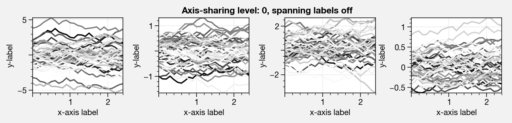

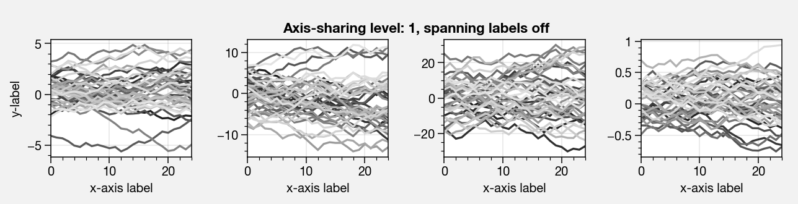

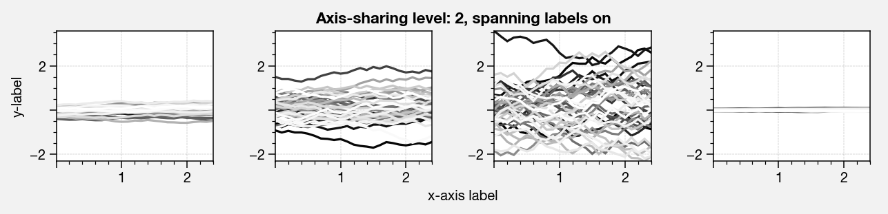

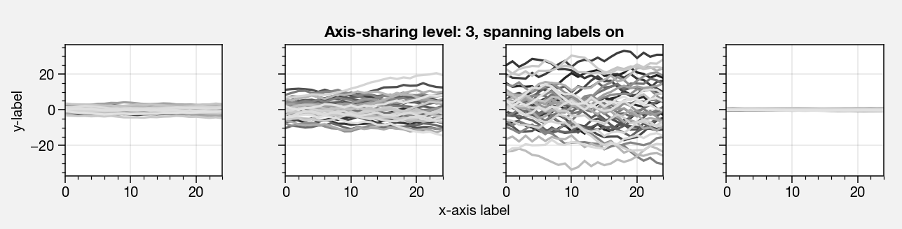

.. code:: ipython3

    import proplot as plot
    import numpy as np
    plot.nbsetup()
    plot.rc.cycle = 'Set4'
    titles = ['With redundant labels', 'Without redundant labels']
    for mode in (0,1):
        f, axs = plot.subplots(nrows=4, ncols=4, share=3*mode, span=1*mode, axwidth=1,
                               wspace=0.2 + 0.4*(1-mode), hspace=0.15 + 0.25*(1-mode))
        for ax in axs:
            ax.plot((np.random.rand(100,20)-0.4).cumsum(axis=0))
        axs.format(xlabel='x-label', ylabel='y-label', suptitle=titles[mode], abc=mode)

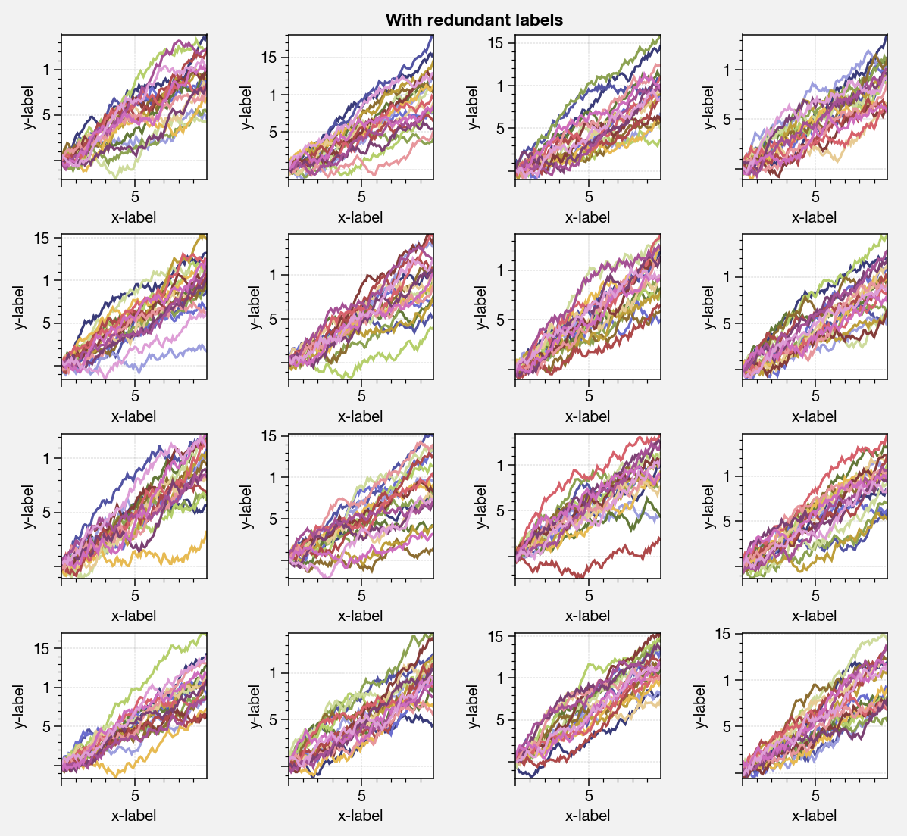

.. image:: _static/showcase/showcase_2_2.png
   :width: 490px
   :height: 490px

Set up a complex grid of subplots using a 2D array of integers. Call a
method on every axes in the ``axes_list`` returned by ``subplots``
**simultaneously**, thanks to the special ``axes_list`` class (this is
particularly handy with the ``format`` function). Note you can also get
a list of item attributes for every axes in the list using
``axes_list.item``.

.. code:: ipython3

    # Arbitrarily complex array of subplots, with shared/spanning x/y axes detected automatically
    import proplot as plot
    import numpy as np
    plot.nbsetup()
    f, axs = plot.subplots([[1, 1, 2], [1, 1, 6], [3, 4, 4], [3, 5, 5]],
                           span=1, share=3,
                           wspace=0.6, hspace=0.5, width=5)
    axs.format(suptitle='Complex subplot grid with axis-sharing + spanning labels', xlabel='time (seconds)', ylabel='temperature (K)', abc=True)
    axs[0].plot(2*(np.random.rand(100,5)-0.5).cumsum(axis=0), lw=2)

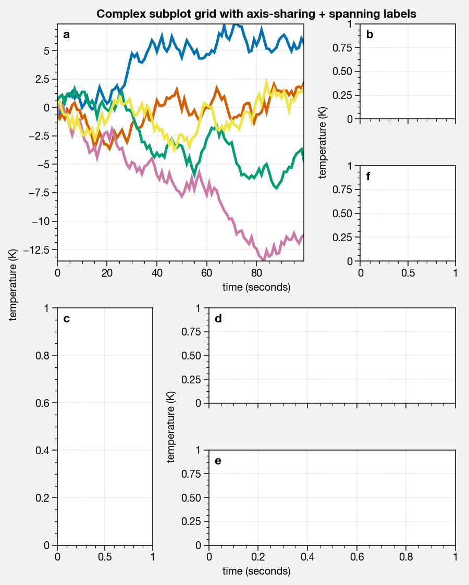

Formatting and panels
---------------------

Easily label rows and columns of your plot, add figure titles, add
colorbars and legends along the edges of your figure, label subplots
with a-b-c enumeration, and reposition titles automatically. In this
example, we use outer “panels” to draw colorbars. Each panel may *span
arbitrary contiguous rows and columns*. For more information on panels,
see the `documentation <https://lukelbd.github.io/tools/proplot/doc>`__.

.. code:: ipython3

    # Multiple subplots, long axes
    import proplot as plot
    import numpy as np
    plot.nbsetup()
    f, axs = plot.subplots(tight=True, spany=False, sharey=3, sharex=1,
                           nrows=3, ncols=3, axwidth=1.5, aspect=1,
                           wratios=[2,1,1], hratios=[2,1,1],
                           bottom=0.5, left=0.5, lspace=0.5,
                           hspace=0.3, wspace=(0.2, 0.6),
                           # hspace=(0.1, 0.4), wspace=(0.1, 0.4),
                           bottompanel=True, rightpanels=[1,2,2])
    m = axs[0].contourf(np.random.rand(10,10).cumsum(axis=0), rowmajor=True, extend='both')
    # axs[:3].format(title='Minor titles')
    axs.format(abc=True, abcpos='li', abcformat='a.',
               suptitle='SuperTitle is automatically offset and centered above main axes',
               title='Inner title', titlepos='inside', # title_kw={'fancy':True},
               collabels=['Column A', 'Column B', 'Column C'], collabels_kw=dict(color='k', weight='bold'),
               rowlabels=['Row 1', 'Row 2', 'Row 3'], rowlabels_kw=dict(color='k', weight='bold'),
               xlabel='xlabel', ylabel='ylabel')
    # axs[-1].format(color='r', linewidth=1.1)
    axs[-1].format(linewidth=1.1, color='r')
    f.bottompanel.colorbar(m, length=0.9, cgrid=True, cformatter='none', clocator='none')
    res = f.rightpanel[:2].colorbar(m, clabel='clabel', ctickminor=True, clocator=1, cminorlocator=0.5, extend='neither') # draws two colorbars simultaneously

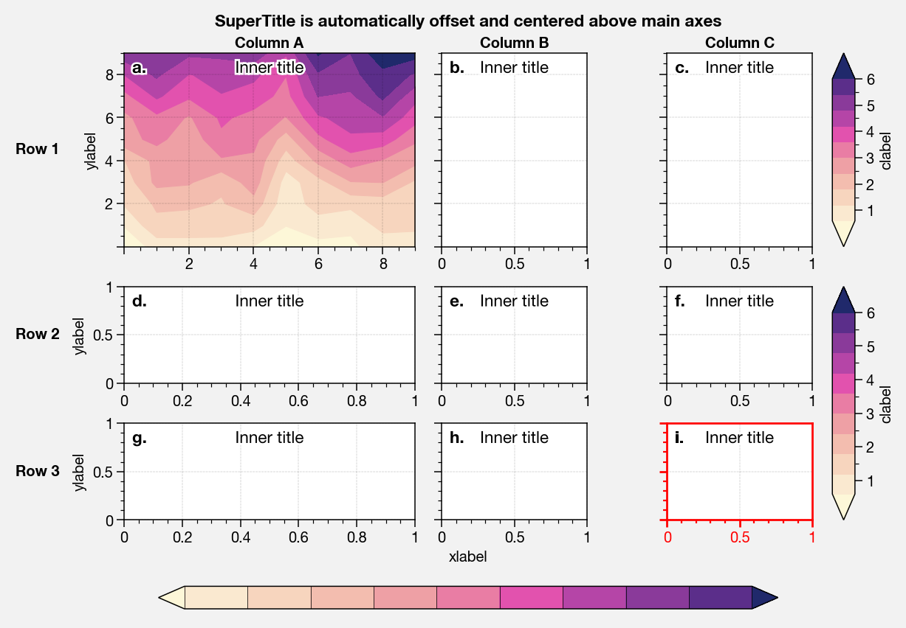

Modify global settings with ``plot.rc['prop']`` or ``plot.rc.prop``.
This includes ``rcParams`` settings (i.e. builtin matplotlib global
settings), custom ``rcParams_new`` settings, and some bulk ``rcGlobals``
settings that apply to multiple other settings. See the
`documentation <https://lukelbd.github.io/tools/proplot/doc>`__ for more
information settings configuration in ProPlot.

.. code:: ipython3

    import proplot as plot
    import numpy as np
    plot.nbsetup()
    plot.rc.linewidth = 1.2
    f, axs = plot.subplots(nrows=1, ncols=2, aspect=0.8, width=6,
                           spanx=1, spany=0, right=0.6, wspace=0.5,
                           sharex=0, sharey=2, hspace=0.7, bottom=0.5,
                           innerpanels='b', bottomcolorbar=True,
                          )
                         # innerpanels=True, whichpanels='b')
    N, M = 100, 6
    values = np.arange(1,M+1)
    for i,ax in enumerate(axs):
        plot.rc.cycle = ['C0','C1',6]
        data = np.cumsum(np.random.rand(N,M)-0.5, axis=0)
        lines = ax.plot(data, linewidth=2)
        ax.bottompanel.plot(data.mean(axis=1), color='gray7', lw=2)
    axs.format(ytickloc='both', ycolor='blue7', xlabel='spanning x label', ylabel='ylabel', abc=True, abcpos='il',
               yticklabelloc='both',
               suptitle='Various features demonstrated below')
    ay = axs[-1].twinx()
    ay.format(ycolor='r', ylabel='secondary axis')
    ay.plot((np.random.rand(100)-0.2).cumsum(), color='r', lw=2)
    f.bottompanel.colorbar(lines, values=values, length=0.7, extend='both', clocator=values, clabel='time series no.')

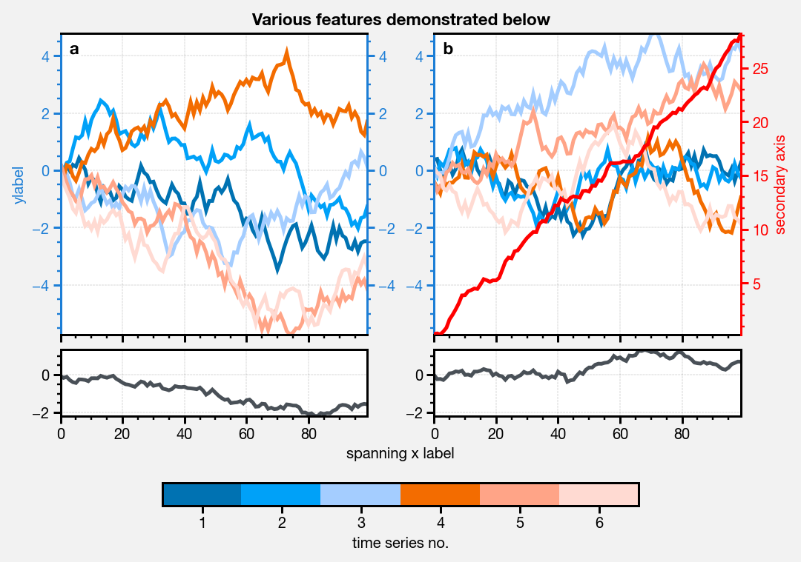

Easily switch between different fonts using the ``fontname`` rc
property. The ``ttf`` files from several fonts are distributed with this
package, and can be locally installed to your matplotlib distribution
using ``plot.install_fonts`` (may require restarting iPython session).
Most notable is the addition of ``Helvetica``, **the new default font**.
Below is a showcase of the available fonts.

.. code:: ipython3

    import proplot as plot
    plot.nbsetup()
    plot.rc['small'] = plot.rc['large'] = 10
    plot.rc['fontname'] = 'Helvetica'
    f, axs = plot.subplots(ncols=4, nrows=3, share=False, span=False,
                           axwidth=2.0, aspect=0.85, wspace=0.5, hspace=0.5)
    # options = ['ultralight', 'light', 'normal', 'regular', 'book', 'medium', 'roman',
    #            'semibold', 'demibold', 'demi', 'bold', 'heavy', 'extra bold', 'black',
    #            'italic', 'oblique'] # remove redundancies below
    options = ['ultralight', 'light', 'normal', 'medium', 'demi', 'bold', 'extra bold', 'black']
    fonts = ['Helvetica', 'Helvetica Neue', 'DejaVu Sans', 'Bitstream Vera Sans', 'Verdana', 'Tahoma',
             'Arial', 'Geneva', 'Times New Roman', 'Palatino', 'Inconsolata', 'Myriad Pro'] #Comic Sans MS', 'Myriad Pro']
    for ax,font in zip(axs,fonts):
        plot.rc['fontname'] = font
        math  = r'$\alpha\beta + \gamma\delta \times \epsilon\zeta \cdot \eta\theta$'
        math += ('\n' + r'$\Sigma\kappa\lambda\mu\pi\rho\sigma\tau\psi\phi\omega$')
        ax.text(0.5, 0, math + '\n' + 'The quick brown fox\njumps over the lazy dog.\n0123456789\n!@#$%^&*()[]{};:,./?',
                weight='normal', ha='center', va='bottom')
        ax.format(xlabel='xlabel', ylabel='ylabel')#, title=font, titlepos='il', title_kw={'border':False, 'weight':'bold'}) #, rc_kw={'fontname':font})
        for i,option in enumerate(options):
            if option in ('italic', 'oblique'):
                kw = {'style':option, 'weight':'normal'} # otherwise defaults to *lightest* one!
            elif option in ('small-caps',):
                kw = {'variant':option}
            else:
                kw = {'weight':option}
            kw.update({'stretch':'normal'})
            ax.text(0.03, 0.97 - (i*1.2*(plot.rc['small']/72)/ax.height), f'{option}', ha='left', va='top', **kw)
            ax.text(0.97, 0.97 - (i*1.2*(plot.rc['small']/72)/ax.height), f'{font[:14].strip()}',   ha='right', va='top', **kw)

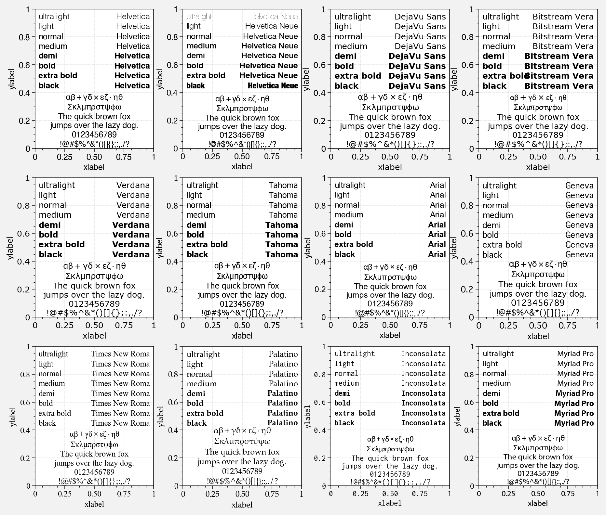

Map projections
---------------

Thanks to the ``subplots`` command, you can painlessly plot geographic
data with either of the cartopy or basemap packages, as shown below. We
can also see how Cartopy’s low-level integration with the matplotlib API
shines – although cartopy is still unable to draw coordinate labels for
most projections.

.. code:: ipython3

    import proplot as plot
    import numpy as np
    plot.nbsetup()
    # First make figure
    f, axs = plot.subplots(ncols=2, nrows=2, width=7, hspace=0.2, wspace=0.3, top=0.5,
                           bottomcolorbars=True, bwidth=0.2, bottom=0.2,
                           proj='hammer', proj_kw={'lon_0':0},
                           # basemap=False,
                           basemap={(1,3):False, (2,4):True},
                           )
    offset = 20
    x = plot.arange(-180+offset,180+offset-1,60)
    y = plot.arange(-60,60+1,30)
    data = np.random.rand(len(y), len(x))
    for ax,p,pcolor,basemap in zip(axs,range(4),[1,1,0,0],[0,1,0,1]):
        m = None
        cmap = ['sunset', 'sunrise'][basemap]
        levels = [0, .3, .5, .7, .9, 1]
        levels = np.linspace(0,1,11)
        if pcolor:
            m = ax.pcolorpoly(x, y, data, levels=levels, cmap=cmap, extend='both')
            ax.scatter(np.random.rand(5,5)*180, 180*np.random.rand(5,5))
        if not pcolor:
            m = ax.contourf(x, y, data, levels=levels, cmap=cmap, extend='both')
            ax.scatter(np.random.rand(5,5)*180, 180*np.random.rand(5,5))
        ax.format(facecolor='gray2', suptitle='Hammer projection in different mapping frameworks', collabels=['Cartopy', 'Basemap'])
        if p<2:
            c = f.bottompanel[p].colorbar(m, clabel='values', ctickminor=False)

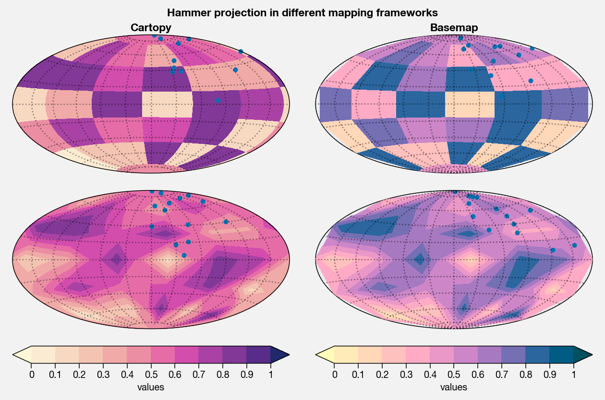

Easily add geographic features using either basemap or cartopy as the
projection backend. Change the axes background color (``facecolor``) and
line width of the boundary (``linewidth``) just like with Cartesian
axes.

.. code:: ipython3

    import proplot as plot
    import numpy as np
    plot.nbsetup()
    f, axs = plot.subplots(ncols=2, nrows=2,
                           proj={(1,2):'ortho', (3,4):'npstere'},
                           basemap={(1,3):False, (2,4):True},
                           proj_kw={(1,2):{'lon_0':0, 'lat_0':0}, (3,4):{'lon_0':0, 'boundinglat':40}})
    axs[0::2].format(reso='med', land=True, coastline=True, landcolor='desert sand', facecolor='blue green', title_kw={'weight':'bold'}, linewidth=3)
    axs[1::2].format(land=True, coastline=True, landcolor='desert sand', facecolor='blue green', title_kw={'weight':'bold'}, linewidth=3)
    axs.format(collabels=['Cartopy', 'Basemap'])

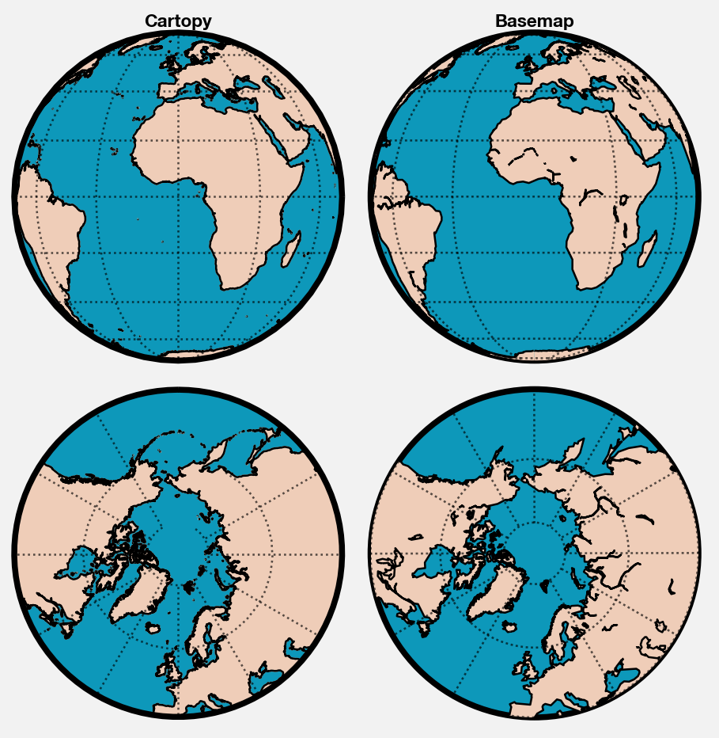

Cartopy can do latitude and longitude labels for just the Mercator and
equirectangular projections. It can also perform more complex plotting
methods like ``tricontourf``.

.. code:: ipython3

    import proplot as plot
    plot.nbsetup()
    import numpy as np
    f, axs = plot.subplots(ncols=1, width=3.5, proj='merc', wspace=0.5, basemap=False,
                           proj_kw={'lon_0':0}, left=0.4, right=0.4, bottom=0.2)
    # First the tricolor cartopy plot
    axs.set_adjustable('box')
    ax = axs[0]
    np.random.seed(3498)
    x, y = np.random.uniform(size=(100, 2)).T
    z = np.exp(-x**2 - y**2)
    x = (x-0.5)*360
    y = (y-0.5)*180
    levels = np.linspace(0, 1, 100)
    cnt = ax.tripcolor(x, y, z, levels=levels, cmap='Turquoise')
    ax.format(title='Tricontour plot, latitude and longitude labels', xlabels='b', ylabels='l', xlocator=60, ylocator=20, latmax=90)

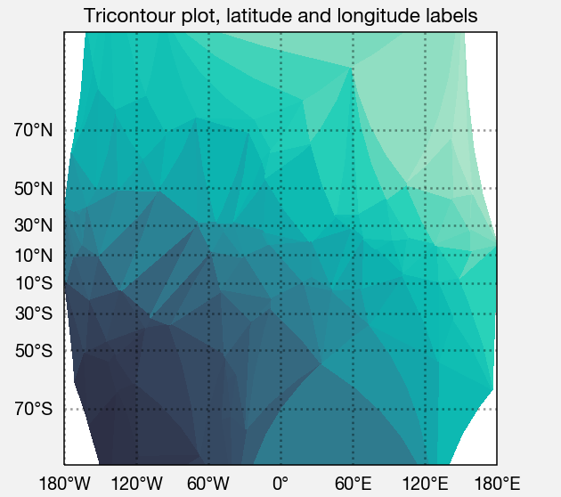

Axis scales
-----------

This package also provides some special axis “scales”, along with a tool
for creating arbitrary scales with “jumps” and “zooms”. The ``sine``
scale creates a geographically “area-weighted” latitude axis. The
``mercator`` scale creates an axis in Mercator latitude coordinates.

.. code:: ipython3

    import proplot as plot
    import numpy as np
    plot.nbsetup()
    plot.rc.update(color='gray7', facehatch='xxxx')
    f, axs = plot.subplots(ncols=2, width=7, share=0, span=0, wspace=0.7, left=0.6)
    n = 30
    x = np.linspace(-180,180,n)
    y = np.linspace(-85,85,n) # note sine just truncated values not in [-90,90], but Mercator transformation can reflect them
    y2 = np.linspace(-85,85,n) # for pcolor
    for i,(ax,scale,color) in enumerate(zip(axs,['mercator','sine'],['sky blue','coral'])):
        ax = axs[i-1]
        ax.plot(x, y, '-', color=color, lw=4)
        data = np.random.rand(len(x), len(y2))
        ax.pcolormesh(x, y2, data, cmap='grays', cmap_kw={'right': 0.8}) # use 'right' to trim the colormap from 0-1 color range to 0-0.8 color range
        ax.format(xlabel='longitude', ylabel='latitude', title=scale.title() + '-latitude y-axis', yscale=scale,
                  ytickloc='left', suptitle='Projection coordinate y-axes',
                  xformatter='deglon', yformatter='deglat', grid=False,
                  xscale='linear', xlim=None, ylim=(-85,85))

.. image:: _static/showcase/showcase_19_1.png
   :width: 630px
   :height: 325px

The ``inverse`` scale is useful primarily where you’d like to show the
wavenumber and wavelength on the same axis.

.. code:: ipython3

    # Plot the response function for an imaginary 5-day lowpass filter
    import proplot as plot
    import numpy as np
    plot.nbsetup()
    plot.rc['axes.ymargin'] = 0
    cutoff = 0.3
    x = np.linspace(0.01,0.5,1000) # in wavenumber days
    response = (np.tanh(-((x - cutoff)/0.03)) + 1)/2 # imgarinary response function
    f, ax = plot.subplots(aspect=(3,1), width=6)#, tight=False, top=2)
    ax.fill_between(x, 0, response, hatch='xxx', facecolor='none', edgecolor='gray8', lw=1, clip_on=True)
    ax.axvline(cutoff, lw=2, dashes=(0.2,2), color='red')
    ax.format(xlabel='wavenumber (days$^{-1}$)', ylabel='response', grid=False)
    axy = ax.twiny()
    axy.format(xlim=(1/max(x), 1/min(x)), xlocator=np.array([20, 10, 5, 2, 1, 0.5, 0.2, 0.1, 0.05]),
              xscale='inverse', xlabel='period (days)',
              title='Title automatically offset above axis labels', titlepos='oc',
              suptitle='SuperTitle above everything', 
              )

.. image:: _static/showcase/showcase_21_1.png
   :width: 540px
   :height: 279px

(If you’re not an atmospheric scientist, you can skip this part.) Scale
a height coordinate to correspond linearly with pressure using the
``'height'`` scale. Scale a pressure coordinate to correspond linearly
with height using the ``'pressure'`` scale. Note the scale height
assumed for these conversions is 7km, and can be changed. See the
``axistools`` module for details.

.. code:: ipython3

    import proplot as plot
    import numpy as np
    plot.nbsetup()
    cutoff = 0.1
    f, axs = plot.subplots(aspect=(1,2.5), ncols=2,
                           bottom=0.4,
                           span=False, share=False, wspace=1, width=5, bottomlegend=True)
    N = 500
    H = 7.0
    p0 = 1000.0
    ylim = np.array([0, 25])
    ylims = [ylim, p0*np.exp(-ylim/H)]
    ylabs = ['height (km)', 'pressure (mb)']
    yscales = ['height', 'pressure']
    ylocators = [5, None]
    x = np.linspace(*ylim, N)
    xs = [x, 1000.0*np.exp(-x/H)]
    y = np.cumsum((np.random.rand(len(x))-0.5), axis=0)
    y = y - min(y)
    colors = ['gray5', 'gray7']
    ls = ['-', '--']
    label = 'z = scale height = 7km, p = p$_{0}$/e = 368mb'
    kw = dict(y=7, color='red', label=label, lw=2)
    for i,ax in enumerate(axs):
        i = 1-i
        ax.plot(y, xs[i], color=colors[i], lw=2, ls=ls[i])
        ax.format(ylim=ylims[i], xlabel='quantity (units)', ylabel=ylabs[i],
                  ylocator=ylocators[i], gridminor=True,
                  suptitle='Profiles with pressure and height as the linear scale', abc=True)
        if i==0:
            h = ax.axhline(**kw)
        ax = ax.twinx()
        i = 1-i
        ax.format(ylim=ylims[i], ylabel=ylabs[i], yscale=yscales[i], ylocator=ylocators[i])
        if i==0:
            h = ax.axhline(**kw)
    f.bottompanel.legend([h])

.. image:: _static/showcase/showcase_23_2.png
   :width: 450px
   :height: 411px

Use so-called “cutoff scales” to create axes with discrete cutoffs, or
to change the “rate of change” of values along parts of an axis. Useful
when you have data with large outliers or with a strange, non-linear
distribution.

.. code:: ipython3

    import proplot as plot
    import numpy as np
    plot.nbsetup()
    # plot.rc.fontname = 'Verdana'
    f, axs = plot.subplots(width=6, nrows=4, aspect=(5,1),
                         hspace=0.5,
                         sharey=False, sharex=False)
    # Compression
    ax = axs[0]
    x = np.linspace(0,4*np.pi,1000)
    xticks = plot.arange(0,12,1.0)
    y = np.sin(x)
    y2 = np.cos(x)
    scales = [(3, np.pi), (0.3, 3*np.pi), (np.inf, np.pi, 2*np.pi), (5, np.pi, 2*np.pi)]
    titles = ('Zoom out of left', 'Zoom into left', 'Discrete cutoff', 'Fast jump')
    locators = [np.pi/3, np.pi/3, *([x*np.pi for x in plot.arange(0, 4, 0.25) if not (1 < x <= 2)] for i in range(2))]
    for ax,scale,title,locator in zip(axs,scales,titles,locators):
        ax.plot(x, y, lw=3, color='blue7')
        ax.plot(x, y2, lw=3, color='red7')
        ax.format(xscale=('cutoff', *scale), title=title,
                  xlim=(0,4*np.pi), ylabel='Wave amplitude', # note since 'spanning labels' turned on by default, only one label is drawn
                  xformatter='pi', xlocator=locator,
                  xtickminor=False, xgrid=True, ygrid=False)

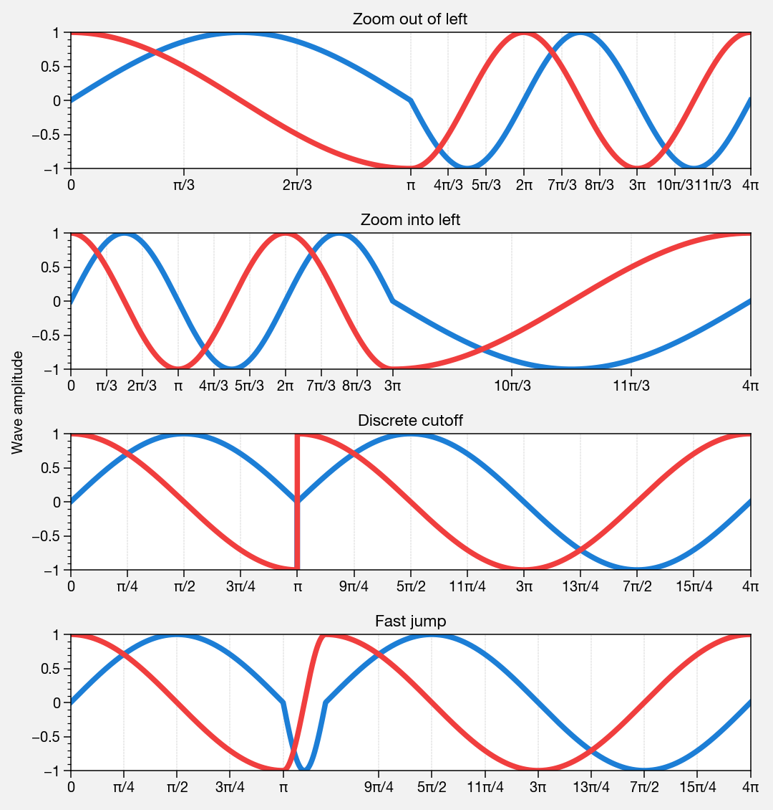

Perceptually uniform colorspaces
--------------------------------

ProPlot’s colormap generating tools, and some of the colormaps I provide
by default, are based on linear transitions for each channel in any of
the three HSV-like colorspaces shown below. For more info, check out
`this page <http://www.hsluv.org/comparison/>`__.

.. code:: ipython3

    import proplot as plot
    plot.nbsetup()
    f = plot.colorspace_breakdown(luminance=50)

.. image:: _static/showcase/showcase_27_1.png
   :width: 847px
   :height: 297px

.. code:: ipython3

    import proplot as plot
    plot.nbsetup()
    f = plot.colorspace_breakdown(chroma=60)

.. image:: _static/showcase/showcase_28_1.svg

.. code:: ipython3

    import proplot as plot
    plot.nbsetup()
    f = plot.colorspace_breakdown(hue=0)

.. image:: _static/showcase/showcase_29_1.svg

.. code:: ipython3

    import proplot as plot
    plot.nbsetup()
    plot.cmap_breakdown('NegPos')

.. image:: _static/showcase/showcase_30_3.svg

.. code:: ipython3

    import proplot as plot
    plot.nbsetup()
    plot.cmap_breakdown('Sunset')

.. image:: _static/showcase/showcase_31_3.svg

Colormaps
---------

Below is a table of the new colormaps. The ProPlot ones were designed
using linear transitions in the “perceptually uniform” colorspaces
described above. See the ``colortools`` module for more info.

.. code:: ipython3

    import proplot as plot
    plot.nbsetup()
    f = plot.cmap_show(31)

.. image:: _static/showcase/showcase_33_1.png
   :width: 481px
   :height: 5434px

Color cycles
------------

The below example shows the registered ``LinearSegmentedColormap`` maps,
or “color cycles” – i.e. colormaps whose transitions are not meant to be
smooth. See the ``colortools`` module for more info. Note any discrete
colormap name can be used as the ``cmap`` argument in a plotting command
(e.g. ``contourf``), and any smooth colormap name can be used as the
``cycler`` argument in a plotting command. The distinction between these
is fluid!

.. code:: ipython3

    import proplot as plot
    plot.nbsetup()
    f = plot.cycle_show()

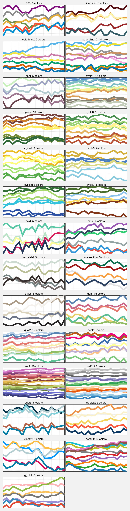

Color names
-----------

The first example shows the new `Open
Color <https://github.com/yeun/open-color>`__ colors. The second example
shows the remaining registered colors, consisting of the standard
ROYGBIV names, “crayon” color names, and XKCD crowd-sourced color names.
I limit the named colors to those sufficiently distinct in the HCL
colorspace, to eliminate redundant colors – as you can see, this gives
us a nice table that can be consulted when you’re deciding on the color
for some plot element.

.. code:: ipython3

    import proplot as plot
    plot.nbsetup()
    f = plot.color_show(['open'])

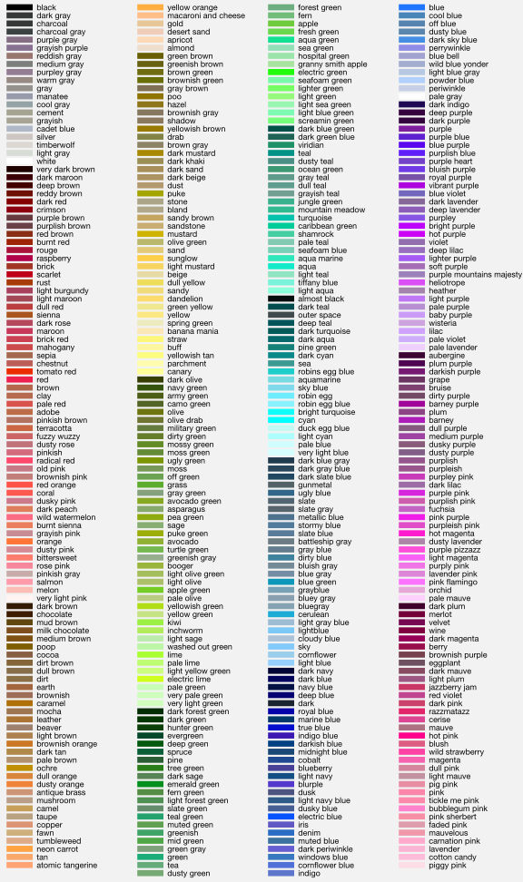

.. code:: ipython3

    import proplot as plot
    plot.nbsetup()
    f = plot.color_show(nbreak=13)

.. image:: _static/showcase/showcase_38_1.png
   :width: 720px
   :height: 1203px

On-the-fly colormaps
--------------------

The below builds colormaps on-the-fly in a number of different ways.
This is one of the most versatile features offered by ProPlot. Note also
that the distinctions between “colormaps” and “color cycles” is now
**fluid**; cycles can be used as colormaps, and vice versa. See the
``colortools`` module for details.

.. code:: ipython3

    import numpy as np
    import proplot as plot
    plot.nbsetup()
    N = 12
    flymap = {'h':['blue-360','red'], 'l':[98, 20], 'space':'hpl', 'gamma':1.4}
    listmap = ('light green', 'blue violet', 'sky blue', 'blue green', 'red violet')
    cmaps  = ['maroon',     ('C0','C2'),    'tropical', 'glacial',         flymap,     [listmap], 'blood', 'blood']
    cycles = [('maroon',N), ('C0','C2', N), 'tropical', ('glacial', N//2), (flymap, 5), listmap,  'blood', 'blood']
    kws = [{}]*(len(cycles) - 1) + [{'left':0.3, 'right':0.9}] # clip colors on the last colormap
    f, axs = plot.subplots(ncols=2, nrows=(len(cmaps)+1)//2,
                           axwidth=3, aspect=(5,4), share=3,
                           innerpanels_kw={'hspace':0.1, 'wwidth':0.8}, hspace=0.1,
                           innerpanels='r', innercolorbars='b')
    # Lines
    lines = np.random.rand(20,N) - 0.5
    lines = lines[:,:1] + lines.cumsum(axis=1) + np.arange(0,N)[None,:]
    ylim = (0,11)
    scales = [0.1, 0.3, 0.5, 0.7]
    for i,(ax,cmap,cycle,kw) in enumerate(zip(axs,cmaps,cycles,kws)):
        data = np.cos(np.sin(scales[i//2] * np.linspace(0,N,N)[None,:] * np.linspace(0,N,N)[:,None])) # psychadelic colors
        m = ax.contourf(data, cmap=cmap, cmap_kw=kw, levels=10)
        y = np.arange(lines.shape[0])
        plot.rc.cycle = (cycle, kw)
        for i in range(N):
            ax.rightpanel.plot(lines[:,i], lw=2) # one for each line
        ax.rightpanel.format(ylocator='none', ylim=ylim)
        ax.bottompanel.colorbar(m, clocator='none')
    axs.format(suptitle='Various ways to declare colormaps and cycles', abc=True, abcpos='il',
               xlim=None, xticks='none', ylim=ylim)

.. image:: _static/showcase/showcase_40_1.png
   :width: 634px
   :height: 983px

The below shows how gamma can be changed for my new “perceptually
uniform colormaps” on the fly. See the ``PerceptuallyUniformColormap``
class for details. Note I’ve also added support for pcolormesh *levels*
and “extend” options, which is not provided by default API! This is
often very useful for interpreting physical data with coarse resolution.

.. code:: ipython3

    import proplot as plot
    import numpy as np
    plot.nbsetup()
    f, axs = plot.subplots(ncols=3, nrows=2, innercolorbars='r',
                           hspace=0.3, wspace=0.2, aspect=1.2,
                           bspace=0.1)
    data = np.random.rand(10,10).cumsum(axis=1)
    def show(ax, cmap, gamma):
        m1 = ax.pcolormesh(data, cmap=cmap, cmap_kw={'gamma2':gamma}, levels=10, extend='both')
        ax.rightpanel.colorbar(m1, clocator='none')
        ax.format(title=f'gamma = {gamma}', xlabel='x axis', ylabel='y axis', suptitle='Varying gamma, and demo of new pcolor options')
    cmap = 'verdant'
    show(axs[0], cmap, 0.8)
    show(axs[1], cmap, 1.0)
    show(axs[2], cmap, 1.4)
    cmap = 'fire'
    show(axs[3], cmap, 0.8)
    show(axs[4], cmap, 1.0)
    show(axs[5], cmap, 1.4)

.. image:: _static/showcase/showcase_42_1.png
   :width: 652px
   :height: 417px

The below example shows how the new ``plot`` method can be used to map
colormap colors to each (x,y) pair on a line. You can also draw “stacked
colorbars”, which can be particularly useful when more than one colormap
is being used in the same subplot.

.. code:: ipython3

    import proplot as plot
    import numpy as np
    plot.nbsetup()
    # Make a pretty spiral
    N = 12
    values = np.arange(1, N+1)
    radii = np.linspace(1,0.2,N)
    angles = np.linspace(0,4*np.pi,N)
    # Figure
    f, axs = plot.subplots(bottomcolorbar=True, ncols=2, wspace=0.35, aspect=1, axwidth=2.2, bwidth=0.8, span=False)
    cmaps = [('blues', 'reds'), 'golden']
    multipliers = [1.2, 1.4]
    for i,(ax,cmap) in enumerate(zip(axs,cmaps)):
        x = radii*np.cos(multipliers[i]*angles)
        y = radii*np.sin(multipliers[i]*angles)
        m = ax.plot(x, y, cmap=cmap, values=values+i*12,
                    linewidth=15, interp=1-i, cmap_kw={'left':i*0.05})
        ax.format(xlim=(-1,1), ylim=(-1,1), suptitle='Lines with smooth colormap gradations',
                  xlabel='cosine angle', ylabel='sine angle')
        c = f.bottompanel.colorbar(m,  space=0.37, i=i, n=2, locator=None, label=f'label {i}')

.. image:: _static/showcase/showcase_44_1.png
   :width: 504px
   :height: 384px

