Tutorial
========

This is a tutorial of “ProPlot”, a matplotlib wrapper I made that helps
to create beautiful, publication-quality graphics. Not just intended for
atmospheric scientists – this is for everyone! To differentiate from
pyplot, we import it as ``plot``.

APIS
====

Matplotlib has two APIs – the “pyplot” API (which is MATLAB-like), and
the “object-oriented” API (which is more “pythonic”, more clear, more
flexible, and you should consider using!). This package is not a pyplot
replacement – it adds to the “object-oriented” API by subclassing
matplotlib Artists classes, like ``Axes`` and ``Figure``.

.. code:: ipython3

    import matplotlib.pyplot as plt
    plt.figure(figsize=(5,3))
    plt.plot(np.random.rand(10,10), lw=3)
    plt.title('PyPlot API (discouraged)')

.. image:: showcase/showcase_3_1.png
   :width: 450px
   :height: 270px

.. code:: ipython3

    import matplotlib.pyplot as plt
    f, ax = plt.subplots(figsize=(5,3))
    ax.plot(np.random.rand(10,10), lw=3)
    ax.set_title('Object-oriented API (recommended)')

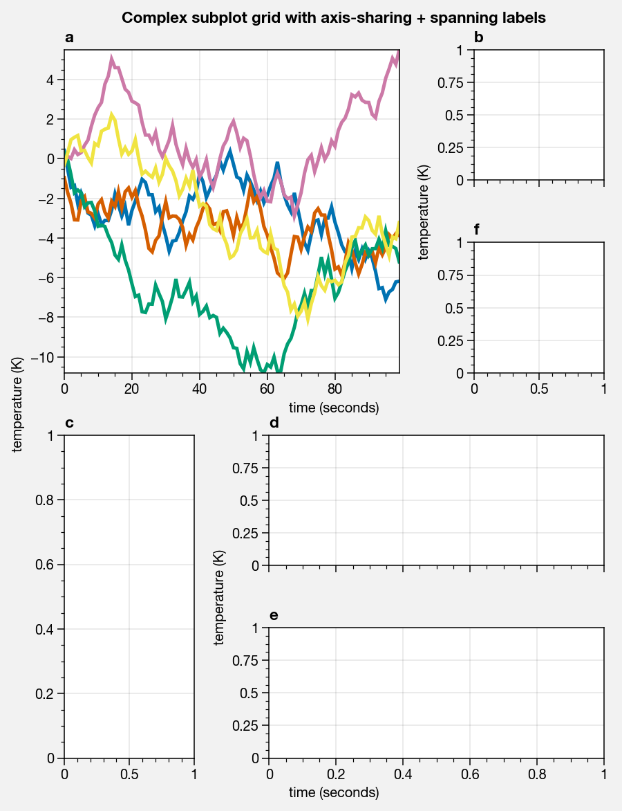

.. code:: ipython3

    import matplotlib.pyplot as plt
    plt.figure(figsize=(5,3))
    plt.plot(np.random.rand(10,10), lw=3)
    plt.title('PyPlot API')

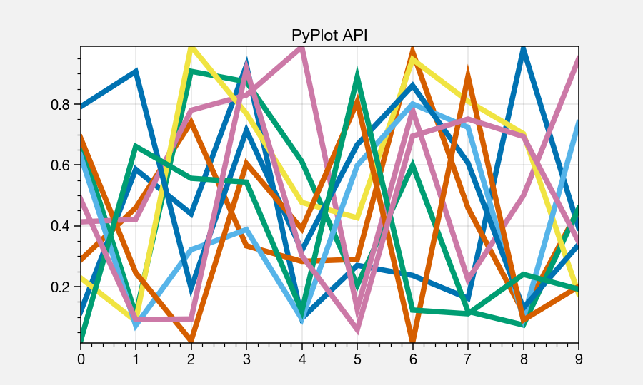

Colors
======

Perceptually uniform colorspaces
--------------------------------

This package includes colormaps from several other projects (see below),
but also introduces new colormaps. The new colormaps were created by
drawing lines across the “perceptually uniform” HCL colorspaces, or its
two variants, the HSL and HPL colorspaces. For more info, check out
`this page <http://www.hsluv.org/comparison/>`__.

.. code:: ipython3

    import proplot as plot
    plot.nbsetup()
    f = plot.colorspace_breakdown(luminance=50)

.. image:: showcase/showcase_9_1.png
   :width: 847px
   :height: 297px

.. code:: ipython3

    import proplot as plot
    plot.nbsetup()
    f = plot.colorspace_breakdown(chroma=60)

.. image:: showcase/showcase_10_1.svg

.. code:: ipython3

    import proplot as plot
    plot.nbsetup()
    f = plot.colorspace_breakdown(hue=0)

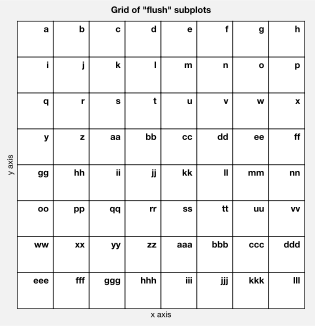

The below shows of how the “NegPos” colormap varies in the three
HSV-like colorspaces. We see that the transitions are linear only in HSl
space. The ``cmap_breakdown`` function can be used to test virtually any
registered colormap.

.. code:: ipython3

    import proplot as plot
    plot.nbsetup()
    plot.cmap_breakdown('NegPos')

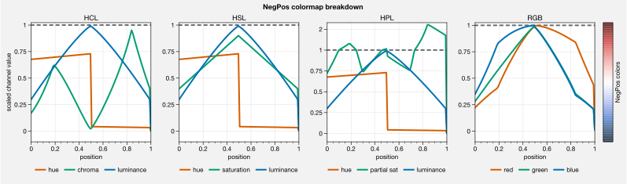

Colormaps
---------

The below showcases every registered colormap included with ProPlot.
We’ve filtered some older, less uniform colormaps, kept the better
builtin ones, added our own, and added several from projects like
`SciVisColor <https://sciviscolor.org/home/colormoves/>`__ and
`cmOcean <https://matplotlib.org/cmocean/>`__.

.. code:: ipython3

    import proplot as plot
    plot.nbsetup()
    f = plot.cmap_show(31)

.. image:: showcase/showcase_16_1.png
   :width: 481px
   :height: 5110px

Color cycles
------------

Added new concept of “color cycle” names. Adjust with
``plot.rc.cycle = name``, or by passing ``cycle=name`` to any plotting
command.

.. code:: ipython3

    import proplot as plot
    plot.nbsetup()
    f = plot.cycle_show()

.. image:: showcase/showcase_19_0.png
   :width: 540px
   :height: 1528px

Colors
------

Registered new colors from the “Open Color” github project. Used for
website UI design, but also great for selecting colors in scientific
visualizations.

.. code:: ipython3

    import proplot as plot
    plot.nbsetup()
    f = plot.color_show(['open'])

.. image:: showcase/showcase_22_0.png
   :width: 630px
   :height: 225px

Filtered all other color names to the below table, from the XKCD “color
survey” (crowd-sourced naming of random HEX strings) and from Crayola
crayon colors. The colors were filtered to be *sufficiently “distinct”
in the perceptually uniform HCL colorspace*, and their names
standardized.

.. code:: ipython3

    import proplot as plot
    plot.nbsetup()
    f = plot.color_show(nbreak=13)

.. image:: showcase/showcase_24_0.png
   :width: 720px
   :height: 1203px

Usage
-----

Make a new colormap with ProPlot’s on-the-fly colormap generator, and it
can be saved and stored in your home folder!

.. code:: ipython3

    import proplot as plot
    import numpy as np
    plot.nbsetup()
    f, axs = plot.subplots(ncols=2, axwidth=2, bottomcolorbars=True, bottom=0.1)
    data = np.random.rand(100,100).cumsum(axis=0)
    m = axs[0].contourf(data, cmap='charcoal95')
    f.bottompanel[0].colorbar(m)
    m = axs[1].contourf(data, cmap=('C0', 'C1', 'charcoal'))
    f.bottompanel[1].colorbar(m)
    axs.format(xticks='none', yticks='none', collabels=('Single color', 'Multi-color'))

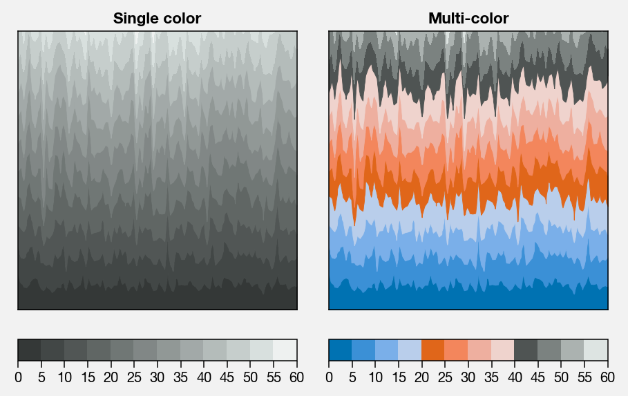

All of the SciVisColor colormaps from their GUI “ColorMoves” interface
are included. Easily recreate complex, beautiful colormaps, without
having to use the GUI, thanks to ProPlot’s on-the-fly colormap
generator!

.. code:: ipython3

    import proplot as plot
    import numpy as np
    plot.nbsetup()
    f, axs = plot.subplots(ncols=2, axwidth=2.5, bottomcolorbars=True, bottom=0.1)
    data = np.random.rand(100,100).cumsum(axis=1)
    cmap = plot.Colormap('Green1_r', 'Orange5', 'Blue1_r', 'Blue6', name='test1', save=True)
    m = axs[0].contourf(data, cmap=cmap, levels=100)
    f.bottompanel[0].colorbar(m, clocator='none')
    cmap = plot.Colormap('Green1_r', 'Orange5', 'Blue1_r', 'Blue6', ratios=(1,3,5,10), name='test2', save=True)
    m = axs[1].contourf(data, cmap=cmap, levels=100)
    f.bottompanel[1].colorbar(m, clocator='none')
    axs.format(xticks='none', yticks='none', collabels=['Evenly spaced', 'Matching SciVisColor example'])

.. image:: showcase/showcase_28_1.png
   :width: 544px
   :height: 317px

Specify color cyclers with the ``cycle`` keyword arg, or set globally
with ``plot.rc.cycle = name``.

.. code:: ipython3

    import proplot as plot
    import numpy as np
    plot.nbsetup()
    f, axs = plot.subplots(nrows=2, ncols=3, axwidth=2)
    for ax,cycle in zip(axs,('colorblind', 'field', 'qual1', 'qual2', 'set4', 'set5')):
        for i in range(10):
            ax.plot((np.random.rand(20) - 0.5).cumsum(), cycle=cycle, lw=5)
    axs.format(xformatter='none', yformatter='none', suptitle='Various named color cycles')

.. image:: showcase/showcase_30_0.png
   :width: 652px
   :height: 447px

Colormaps and color cycles are totally interchangeable! You can also
pass a list of objects with ``get_color`` methods or a list of color
strings or RGB tuples, and a colorbar will be constructed from said
list. Note also that ``pcolormesh`` now accepts a ``levels`` argument,
just like ``contourf``! This was previously really tricky, but now
discrete colormap levels in ``pcolor`` and ``pcolormesh`` plots are a
breeze.

.. code:: ipython3

    import proplot as plot
    import numpy as np
    plot.nbsetup()
    f, axs = plot.subplots(ncols=2, bottomcolorbars=[1,2], bottom=0.3, axwidth=2.2)
    m = axs[0].pcolormesh(np.random.rand(20,20), cmap='colorblind', levels=np.linspace(0,1,7))
    f.bottompanel[0].colorbar(m)
    lines = axs[1].plot(20*np.random.rand(10,10), cycle=('reds', 10), lw=3)
    axs.format(collabels=['Color cycler as colormap', 'Colormap as cycler, with "colorbar legend"'])
    f.bottompanel[1].colorbar(lines, values=np.arange(0,len(lines)))

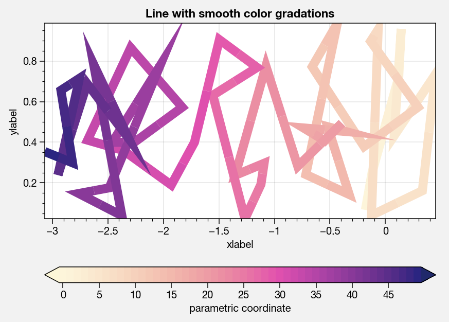

Easily change the “gamma” of a perceptually uniform colormap on-the-fly.

.. code:: ipython3

    import proplot as plot
    import numpy as np
    plot.nbsetup()
    f, axs = plot.subplots(ncols=3, nrows=2, innercolorbars='r',
                           hspace=0.3, wspace=0.2, aspect=1,
                           bspace=0.1)
    data = np.random.rand(10,10).cumsum(axis=1)
    def show(ax, cmap, gamma):
        m1 = ax.pcolormesh(data, cmap=cmap, cmap_kw={'gamma':gamma}, levels=10, extend='both')
        ax.rightpanel.colorbar(m1, clocator='none')
        ax.format(title=f'gamma = {gamma}', xlabel='x axis', ylabel='y axis', suptitle='Varying gamma, inner colorbars')
    cmap = 'verdant'
    show(axs[0], cmap, 0.8)
    show(axs[1], cmap, 1.0)
    show(axs[2], cmap, 1.4)
    cmap = 'fire'
    show(axs[3], cmap, 0.8)
    show(axs[4], cmap, 1.0)
    show(axs[5], cmap, 1.4)

.. image:: showcase/showcase_34_0.png
   :width: 652px
   :height: 422px

Cartesian
=========

Aspect ratio and tight subplots
-------------------------------

Normally, you have to specify the “figure size”, and the aspect ratios
are hard to configure. The ProPlot default behavior fixes axes aspect
ratios by varying either the figure width or height dimension! The
default aspect ratio is 1, and the figure *width* is fixed while the
height is allowed to vary. ProPlot will also adjust “inner spaces” to
accomadate tick labels and whatnot, so you don’t have to mess with
``wspace`` and ``hspace``!

.. code:: ipython3

    import proplot as plot
    plot.nbsetup()
    f, axs = plot.subplots(nrows=3, ncols=3, aspect=1, axwidth=1, share=0, span=0, tight=False)
    axs[4].format(ylabel='ylabel', xlabel='xlabel', title='title\ntitle\ntitle', suptitle='Without tight subplots')

.. image:: showcase/showcase_38_0.png
   :width: 382px
   :height: 373px

.. code:: ipython3

    import proplot as plot
    plot.nbsetup()
    f, axs = plot.subplots(nrows=3, ncols=3, aspect=1, axwidth=1.2, share=0, span=0)
    axs[4].format(ylabel='ylabel', xlabel='xlabel', title='title\ntitle\ntitle', suptitle='With tight subplots')

.. image:: showcase/showcase_39_0.png
   :width: 436px
   :height: 463px

Axis sharing
------------

Matplotlib has an “axis sharing” feature – but this only holds the axis
limits the same. I introduce 4 “levels” of axis sharing, visualized
below. I also introduce an “axis spanning” label feature.

.. code:: ipython3

    import proplot as plot
    import numpy as np
    plot.nbsetup()
    N = 50
    M = 40
    colors = plot.Colors('grays_r', M, x=(0.1, 0.8))
    for share in (0,1,2,3):
        f, axs = plot.subplots(ncols=4, aspect=1, wspace=0.5, axwidth=1.2, sharey=share, spanx=share//2)
        gen = lambda scale: scale*(np.random.rand(N,M)-0.5).cumsum(axis=0)[N//2:,:]
        for ax,scale,color in zip(axs,(1,3,7,0.2),('gray9','gray7','gray5','gray3')):
            array = gen(scale)
            for l in range(array.shape[1]):
                ax.plot(array[:,l], color=colors[l])
            ax.format(suptitle=f'Axis-sharing level: {share}, spanning labels {["off","on"][share//2]}', ylabel='y-label', xlabel='x-axis label')

.. image:: showcase/showcase_42_0.png
   :width: 643px
   :height: 174px

.. image:: showcase/showcase_42_1.png
   :width: 643px
   :height: 172px

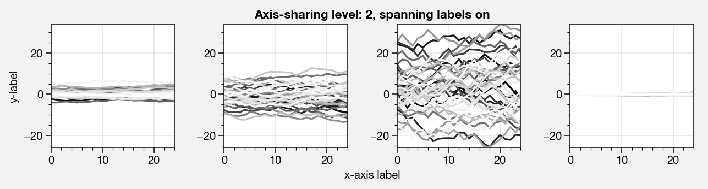

.. image:: showcase/showcase_42_3.png
   :width: 643px
   :height: 173px

Limit redundancy
----------------

Many new features limit redundant information in your figures. Also
check out how easy it is add a-b-c labels to your plots now!

.. code:: ipython3

    import proplot as plot
    import numpy as np
    plot.nbsetup()
    plot.rc.cycle = 'Set4'
    titles = ['With redundant labels', 'Without redundant labels']
    for mode in (0,1):
        f, axs = plot.subplots(nrows=4, ncols=4, share=3*mode, span=1*mode, axwidth=1)
        for ax in axs:
            ax.plot((np.random.rand(100,20)-0.4).cumsum(axis=0))
        axs.format(xlabel='x-label', ylabel='y-label', suptitle=titles[mode], abc=mode, abcpos='il')

.. image:: showcase/showcase_45_0.png
   :width: 490px
   :height: 491px

.. image:: showcase/showcase_45_1.png
   :width: 490px
   :height: 498px

Complex subplots
----------------

Set up a complex grid of subplots using a 2D array of integers – think
of the array as a “picture” of your figure. Order of numbers determines
order of a-b-c labels.

.. code:: ipython3

    # Arbitrarily complex array of subplots, with shared/spanning x/y axes detected automatically
    import proplot as plot
    import numpy as np
    plot.nbsetup()
    f, axs = plot.subplots([[1, 1, 2], [1, 1, 6], [3, 4, 4], [3, 5, 5]],
                           span=1, share=3, width=5)
    axs.format(suptitle='Complex subplot grid with axis-sharing + spanning labels', xlabel='time (seconds)', ylabel='temperature (K)', abc=True)
    axs[0].plot(2*(np.random.rand(100,5)-0.5).cumsum(axis=0), lw=2)

.. image:: showcase/showcase_48_1.png
   :width: 450px
   :height: 543px

Formatting axes
---------------

Use the format command to set up your ticks, axis labels, and more! Call
a method on every axes in the ``axes_list`` returned by ``subplots``
**simultaneously**, thanks to the special ``axes_list`` class (this is
particularly handy with the ``format`` function).

.. code:: ipython3

    f, axs = plot.subplots(ncols=2, nrows=2, axwidth=2.2, share=False, span=False)
    axs.format(xlabel='x-axis', ylabel='y-axis', xlim=(0,10), xlocator=2,
              ylim=(0,4), ylocator=plot.arange(0,4), yticklabels=('a', 'bb', 'ccc', 'dd', 'e'),
              title='Inner title', titlepos='ci', suptitle='Outer title',
              abc=True, abcpos='il', abcformat='a.',
              ytickloc='both', yticklabelloc='both', ygridminor=True, xtickminor=False,
              linewidth=1, collabels=['Column label 1', 'Column label 2'], rowlabels=['Row label 1', 'Row label 2'])

.. image:: showcase/showcase_51_0.png
   :width: 490px
   :height: 397px

Temporarily apply an “rc” setting by passing it to the “format” command!

.. code:: ipython3

    import proplot as plot
    import numpy as np
    plot.nbsetup()
    # A bunch od different ways to update settings
    plot.rc.linewidth = 1.2
    plot.rc.update({'fontname': 'DejaVu Sans'})
    plot.rc['figure.facecolor'] = 'w'
    plot.rc.axes_facecolor = '#eeeeee' # underscore replaces the "dot"!
    # Make plot
    f, axs = plot.subplots(nrows=1, ncols=2, aspect=1, width=6,
                           span=0, wspace=0.5, sharey=2, hspace=0.7)
    N, M = 100, 6
    values = np.arange(1,M+1)
    for i,ax in enumerate(axs):
        plot.rc.cycle = ['C0','C1',6]
        data = np.cumsum(np.random.rand(N,M)-0.5, axis=0)
        lines = ax.plot(data, linewidth=2)
    axs.format(ytickloc='both', ycolor='blue7', hatch='xxx',
               xlabel='x label', ylabel='y label',
               yticklabelloc='both',
               suptitle='Set temporary rc settings')
    ay = axs[-1].twinx()
    ay.format(ycolor='r', ylabel='secondary axis')
    ay.plot((np.random.rand(100)-0.2).cumsum(), color='r', lw=2)

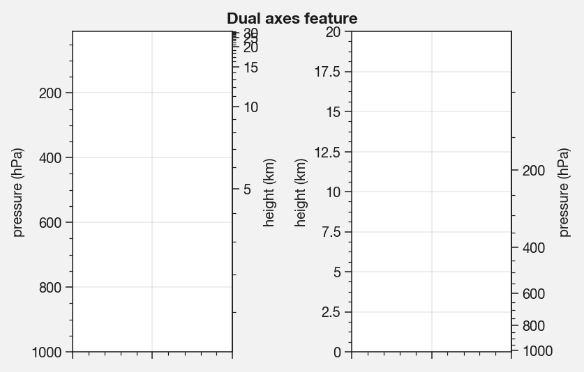

Helvetica
---------

Helvetica is the MATLAB default. Matplotlib does not come packaged with
it and does not use it as the default, but ProPlot does! Easily change
the default font with a custom ``.proplotrc``.

.. code:: ipython3

    import proplot as plot
    plot.nbsetup()
    plot.rc['small'] = plot.rc['large'] = 10
    plot.rc['fontname'] = 'Helvetica'
    f, axs = plot.subplots(ncols=4, nrows=3, share=False, span=False,
                           axwidth=2.0, aspect=0.85, wspace=0.5, hspace=0.5)
    # options = ['ultralight', 'light', 'normal', 'regular', 'book', 'medium', 'roman',
    #            'semibold', 'demibold', 'demi', 'bold', 'heavy', 'extra bold', 'black',
    #            'italic', 'oblique'] # remove redundancies below
    options = ['ultralight', 'light', 'normal', 'medium', 'demi', 'bold', 'extra bold', 'black']
    fonts = ['Helvetica', 'Helvetica Neue', 'DejaVu Sans', 'Bitstream Vera Sans', 'Verdana', 'Tahoma',
             'Arial', 'Geneva', 'Times New Roman', 'Palatino', 'Inconsolata', 'Myriad Pro'] #Comic Sans MS', 'Myriad Pro']
    for ax,font in zip(axs,fonts):
        plot.rc['fontname'] = font
        math  = r'$\alpha\beta + \gamma\delta \times \epsilon\zeta \cdot \eta\theta$'
        math += ('\n' + r'$\Sigma\kappa\lambda\mu\pi\rho\sigma\tau\psi\phi\omega$')
        ax.text(0.5, 0, math + '\n' + 'The quick brown fox\njumps over the lazy dog.\n0123456789\n!@#$%^&*()[]{};:,./?',
                weight='normal', ha='center', va='bottom')
        ax.format(xlabel='xlabel', ylabel='ylabel', suptitle='Table of font names')
        for i,option in enumerate(options):
            if option in ('italic', 'oblique'):
                kw = {'style':option, 'weight':'normal'} # otherwise defaults to *lightest* one!
            elif option in ('small-caps',):
                kw = {'variant':option}
            else:
                kw = {'weight':option}
            kw.update({'stretch':'normal'})
            ax.text(0.03, 0.97 - (i*1.2*(plot.rc['small']/72)/ax.height), f'{option}', ha='left', va='top', **kw)
            ax.text(0.97, 0.97 - (i*1.2*(plot.rc['small']/72)/ax.height), f'{font[:14].strip()}',   ha='right', va='top', **kw)

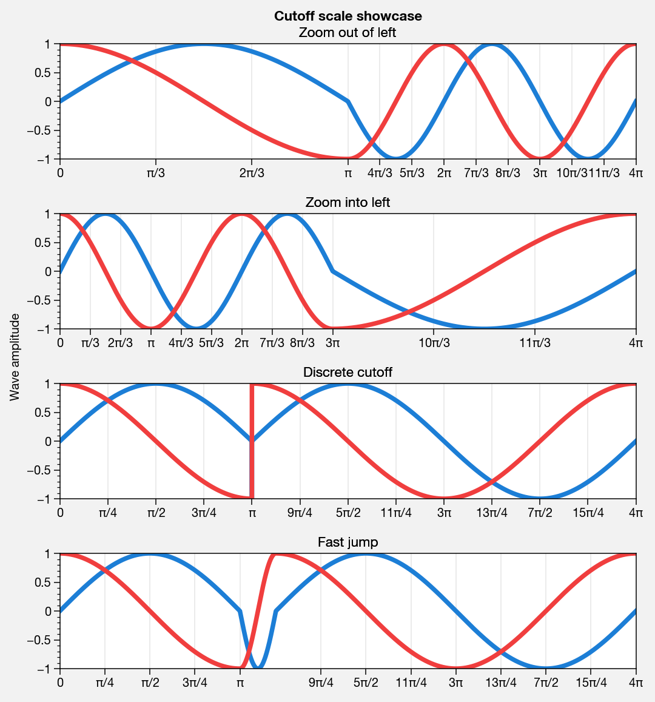

Inner and outer panels, colorbars
---------------------------------

I often want “panels” that represent averages across dimensions of a
main subplot, or some secondary 1-dimensional dataset. This is hard to
do with matplotlib by default, but easy with ProPlot!

.. code:: ipython3

    f, ax = plot.subplots(ncols=2, innerpanels='tr')
    data = np.random.rand(50,50)
    ax.pcolormesh(data, cmap='Greys')
    ax.rightpanel.plot(data.mean(axis=1), np.arange(50), lw=2, color='k') # note ax.panel returns on an axes_list will also return an axes_list
    ax.toppanel.plot(data.mean(axis=0), lw=2, color='k')
    ax.toppanel.format(title='Averages in panels', titleweight='bold')

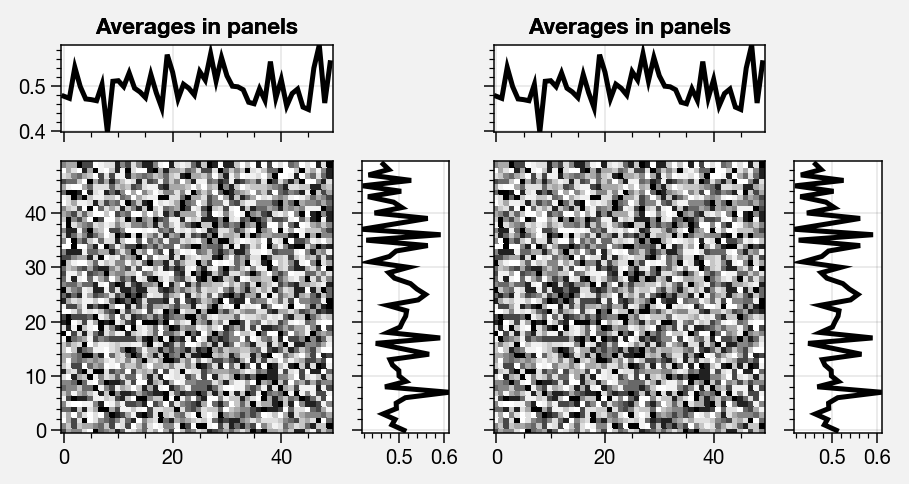

I also often want “global” colorbars or legends meant to reference
multiple subplots. This is easy to do with ProPlot too! These “global”
colorbars can extend across all rows/columns of the subplot array, or
arbitrary contiguous rows/columns.

.. code:: ipython3

    import proplot as plot
    import numpy as np
    plot.nbsetup()
    f, axs = plot.subplots(ncols=4, axwidth=1.5, bottomcolorbars=[1,1,2,2], share=0, span=0, wspace=0.3)
    data = (np.random.rand(50,50)-0.5).cumsum(axis=0)
    m = axs[:2].contourf(data, cmap='grays')
    cycle = plot.Cycle('grays', 5)
    hs = []
    for i,color in enumerate(cycle):
        hs += axs[2:].plot(np.random.rand(10), lw=3, color=color, label=f'line{i}')[0]
    f.bottompanel[0].colorbar(m, length=0.8)
    f.bottompanel[1].legend(hs, ncols=5, align=True)
    axs.format(suptitle='Global colorbar and global legend')

.. image:: showcase/showcase_61_0.png
   :width: 697px
   :height: 229px

New axis formatters
-------------------

Changed the default axis formatter (the class used to convert float
numbers to tick label strings). New formatter trims trailing zeros by
default, and can be used to filter tick labels within some data range.

.. code:: ipython3

    locator = [0, 0.25, 0.5, 0.75, 1]
    f, axs = plot.subplots(ncols=2, axwidth=2, share=0)
    axs[1].format(xlocator=locator, ylocator=locator, xtickrange=[0,0.5], yticklabelloc='both', title='ProPlot formatter', titleweight='bold')
    axs[0].format(xlocator=locator, ylocator=locator, yticklabelloc='both', xformatter='scalar', yformatter='scalar', title='Matplotlib formatter', titleweight='bold')

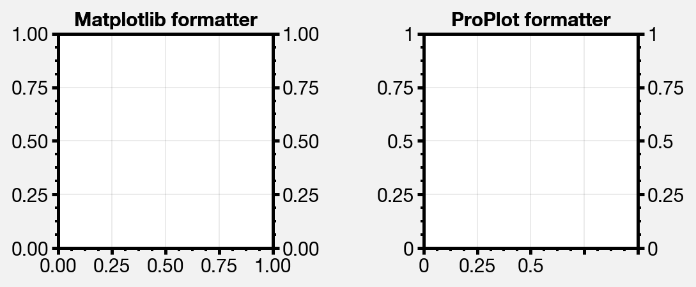

Lots of handy new axes formatters that can be referenced by string name!
Easily mark your axes as fractions or geographic coordinates. Forgot to
mention, ProPlot includes an endpoint-inclusive ``arange`` function.

.. code:: ipython3

    f, axs = plot.subplots(nrows=3, axwidth=5, aspect=(8,1), share=0, span=0, hspace=0.3)
    axs[0].format(xlim=(0,4*np.pi), xlocator=plot.arange(0, 4, 0.25)*np.pi, xformatter='pi')
    axs[1].format(xlim=(0,2*np.e), xlocator=plot.arange(0, 2, 0.5)*np.e, xformatter='e')
    axs[2].format(xlim=(-90,90), xlocator=plot.arange(-90, 90, 30), xformatter='deglat')
    axs.format(ylocator='null', suptitle='Showcase of new formatters')

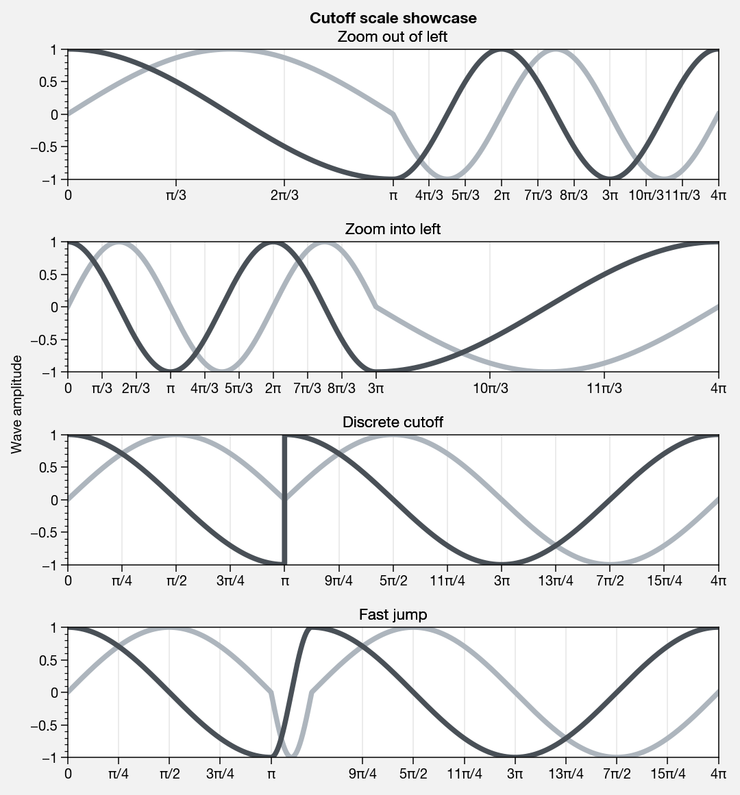

New axis scales
---------------

Also added handy new axis scales! The first two scale the axes as the
sine of the latitude (i.e. **area-weighted** latitude), and as with
latitude in the Mercator projection.

.. code:: ipython3

    import proplot as plot
    import numpy as np
    plot.nbsetup()
    plot.rc.update(color='gray7', hatch='xxxx')
    f, axs = plot.subplots(ncols=2, width=6, share=0, span=0, wspace=0.7, left=0.6)
    n = 30
    x = np.linspace(-180,180,n)
    y = np.linspace(-85,85,n) # note sine just truncated values not in [-90,90], but Mercator transformation can reflect them
    y2 = np.linspace(-85,85,n) # for pcolor
    for i,(ax,scale,color) in enumerate(zip(axs,['mercator','sine'],['sky','coral'])):
        ax = axs[i-1]
        ax.plot(x, y, '-', color=color, lw=4)
        data = np.random.rand(len(x), len(y2))
        ax.pcolormesh(x, y2, data, cmap='grays', cmap_kw={'right': 0.8}) # use 'right' to trim the colormap from 0-1 color range to 0-0.8 color range
        ax.format(xlabel='longitude', ylabel='latitude', title=scale.title() + '-latitude y-axis', yscale=scale,
                  ytickloc='left', suptitle='Projection coordinate y-axes',
                  xformatter='deglon', yformatter='deglat', grid=False,
                  xscale='linear', xlim=None, ylim=(-85,85))

.. image:: showcase/showcase_69_0.png
   :width: 540px
   :height: 282px

The “inverse” scale is perfect for labeling spectral coordinates. Note
that the title and super title are automatically adjusted to make room
for tick labels and axis labels on the top of the subplot! Below we plot
an imaginary response function.

.. code:: ipython3

    # Plot the response function for an imaginary 5-day lowpass filter
    import proplot as plot
    import numpy as np
    plot.nbsetup()
    plot.rc['axes.ymargin'] = 0
    cutoff = 0.3
    x = np.linspace(0.01,0.5,1000) # in wavenumber days
    response = (np.tanh(-((x - cutoff)/0.03)) + 1)/2 # imgarinary response function
    f, ax = plot.subplots(aspect=(3,1), width=6)#, tight=False, top=2)
    ax.fill_between(x, 0, response, hatch='xxx', facecolor='none', edgecolor='gray8', lw=1, clip_on=True)
    ax.axvline(cutoff, lw=2, dashes=(0.2,2), color='red')
    ax.format(xlabel='wavenumber (days$^{-1}$)', ylabel='response', grid=False)
    axy = ax.twiny()
    axy.format(xlim=(1/max(x), 1/min(x)), xlocator=np.array([20, 10, 5, 2, 1, 0.5, 0.2, 0.1, 0.05]),
              xscale='inverse', xlabel='period (days)',
              title='Title automatically offset above axis labels', titlepos='oc',
              suptitle='SuperTitle above everything', 
              )

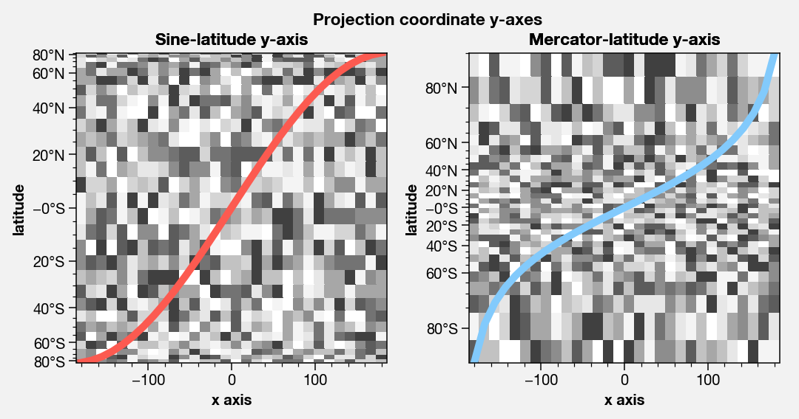

The “cutoff” scale is great when you have data with a very strange
distribution in space.

.. code:: ipython3

    import proplot as plot
    import numpy as np
    plot.nbsetup()
    # plot.rc.fontname = 'Verdana'
    f, axs = plot.subplots(width=6, nrows=4, aspect=(5,1),
                         hspace=0.5,
                         sharey=False, sharex=False)
    # Compression
    ax = axs[0]
    x = np.linspace(0,4*np.pi,1000)
    xticks = plot.arange(0,12,1.0)
    y = np.sin(x)
    y2 = np.cos(x)
    scales = [(3, np.pi), (0.3, 3*np.pi), (np.inf, np.pi, 2*np.pi), (5, np.pi, 2*np.pi)]
    titles = ('Zoom out of left', 'Zoom into left', 'Discrete cutoff', 'Fast jump')
    locators = [np.pi/3, np.pi/3, *([x*np.pi for x in plot.arange(0, 4, 0.25) if not (1 < x <= 2)] for i in range(2))]
    for ax,scale,title,locator in zip(axs,scales,titles,locators):
        ax.plot(x, y, lw=3, color='blue7')
        ax.plot(x, y2, lw=3, color='red7')
        ax.format(xscale=('cutoff', *scale), title=title,
                  xlim=(0,4*np.pi), ylabel='Wave amplitude', # note since 'spanning labels' turned on by default, only one label is drawn
                  xformatter='pi', xlocator=locator,
                  xtickminor=False, xgrid=True, ygrid=False, suptitle='Cutoff scale showcase')

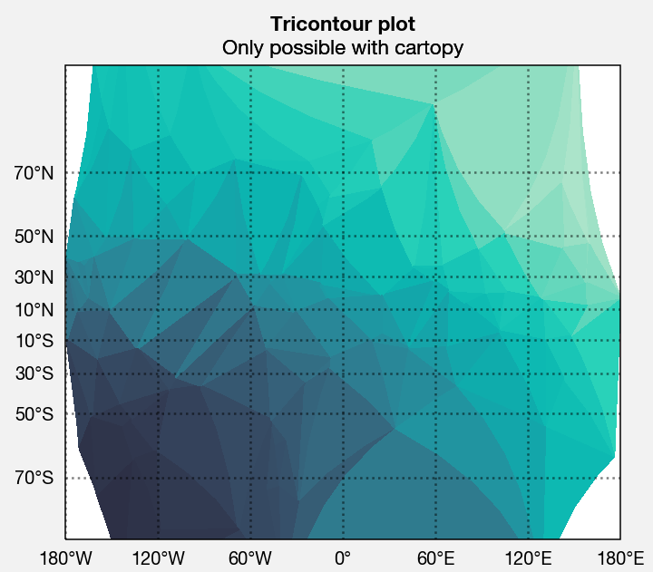

Map projections
===============

ProPlot isn’t just great for typical Cartesian-axis plotting. It also
includes seamless integration with the “cartopy” and “basemap” packages.
Note these features are **optional** – if you don’t want to use them,
you don’t need to have “cartopy” and “basemap” installed!

Cartopy vs. basemap
-------------------

Plotting with basemap is much easier – now, you just plot exactly like
you would in Cartesian coordinates. No need to directly reference a
``Basemap`` object! Plotting with cartopy is also much easier – now,
there’s no need to reference the individual cartopy ``crs.Projection``
class, and there’s no need to use ``transform=crs.PlateCarree()`` with
every plotting command (this is now the default behavior).

Why cartopy? Generally **cleaner integration** with matplotlib API. Why
basemap? Has some **useful features** still.

.. code:: ipython3

    import proplot as plot
    import numpy as np
    plot.nbsetup()
    # First make figure
    f, axs = plot.subplots(ncols=2, nrows=2, width=7, hspace=0.2, wspace=0.3, top=0.5,
                           bottomcolorbars=True, bwidth=0.2, bottom=0.2,
                           proj='hammer', proj_kw={'lon_0':0},
                           # basemap=False,
                           basemap={(1,3):False, (2,4):True},
                           )
    offset = 20
    x = plot.arange(-180+offset,180+offset-1,60)
    y = plot.arange(-60,60+1,30)
    data = np.random.rand(len(y), len(x))
    for ax,p,pcolor,basemap in zip(axs,range(4),[1,1,0,0],[0,1,0,1]):
        m = None
        cmap = ['sunset', 'sunrise'][basemap]
        levels = [0, .3, .5, .7, .9, 1]
        levels = np.linspace(0,1,11)
        if pcolor:
            m = ax.pcolorpoly(x, y, data, levels=levels, cmap=cmap, extend='neither')
            ax.scatter(np.random.rand(5,5)*180, 180*np.random.rand(5,5))
        if not pcolor:
            m = ax.contourf(x, y, data, levels=levels, cmap=cmap, extend='neither')
            ax.scatter(np.random.rand(5,5)*180, 180*np.random.rand(5,5))
        ax.format(facecolor='gray2', suptitle='Hammer projection in different mapping frameworks', collabels=['Cartopy', 'Basemap'], geogrid_labels=True)
        if p<2:
            c = f.bottompanel[p].colorbar(m, clabel='values', ctickminor=False)

.. image:: showcase/showcase_78_1.png
   :width: 630px
   :height: 417px

.. code:: ipython3

    import proplot as plot
    import numpy as np
    plot.nbsetup()
    # First make figure
    f, axs = plot.subplots(ncols=2, nrows=2, width=7, hspace=0.2, wspace=0.3, top=0.5,
                           bottomcolorbars=True, bwidth=0.2, bottom=0.2,
                           proj='hammer', proj_kw={'lon_0':0},
                           # basemap=False,
                           basemap={(1,3):False, (2,4):True},
                           )
    offset = 20
    x = plot.arange(-180+offset,180+offset-1,60)
    y = plot.arange(-60,60+1,30)
    data = np.random.rand(len(y), len(x))
    for ax,p,pcolor,basemap in zip(axs,range(4),[1,1,0,0],[0,1,0,1]):
        m = None
        cmap = ['sunset', 'sunrise'][basemap]
        levels = [0, .3, .5, .7, .9, 1]
        levels = np.linspace(0,1,11)
        if pcolor:
            m = ax.pcolorpoly(x, y, data, levels=levels, cmap=cmap, extend='neither', globe=True)
            ax.scatter(np.random.rand(5,5)*180, 180*np.random.rand(5,5))
        if not pcolor:
            m = ax.contourf(x, y, data, levels=levels, cmap=cmap, extend='neither', globe=True)
            ax.scatter(np.random.rand(5,5)*180, 180*np.random.rand(5,5))
        ax.format(facecolor='gray2', suptitle='Hammer projection in different mapping frameworks', collabels=['Cartopy', 'Basemap'], geogridlabels=True)
        if p<2:
            c = f.bottompanel[p].colorbar(m, clabel='values', ctickminor=False)

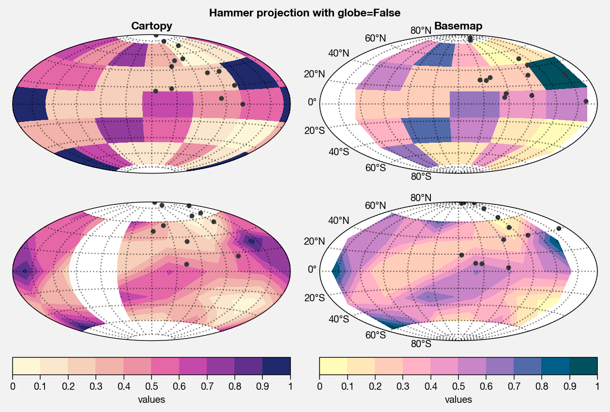

.. code:: ipython3

    # Tricontour is only possible with cartopy! But also note, cartopy only
    # supports lat lon labels for Mercator and equirectangular projections.
    import proplot as plot
    plot.nbsetup()
    import numpy as np
    f, axs = plot.subplots(ncols=1, width=3.5, proj='merc', wspace=0.5, basemap=False,
                           proj_kw={'lon_0':0}, left=0.4, right=0.4, bottom=0.2)
    axs.set_adjustable('box')
    ax = axs[0]
    np.random.seed(3498)
    x, y = np.random.uniform(size=(100, 2)).T
    z = np.exp(-x**2 - y**2)
    x = (x-0.5)*360
    y = (y-0.5)*180
    levels = np.linspace(0, 1, 100)
    cnt = ax.tripcolor(x, y, z, levels=levels, cmap='Turquoise')
    ax.format(title='Tricontour plot, latitude and longitude labels', xlabels='b', ylabels='l', xlocator=60, ylocator=20, latmax=90, titleweight='bold')

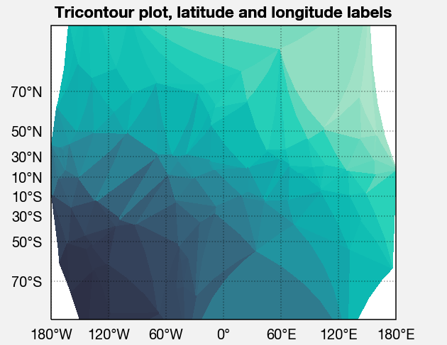

Geography
---------

Easily add and format geographic features. Pass keyword args to the
``basemap.Basemap`` and ``cartopy.crs.Projection`` initializers with the
``proj_kw`` keyword arg.

.. code:: ipython3

    import proplot as plot
    import numpy as np
    plot.nbsetup()
    f, axs = plot.subplots(ncols=2, nrows=2,
                           proj={(1,2):'ortho', (3,4):'npstere'},
                           basemap={(1,3):False, (2,4):True},
                           proj_kw={(1,2):{'lon_0':0, 'lat_0':0}, (3,4):{'lon_0':0, 'boundinglat':40}})
    axs.format(collabels=['Cartopy', 'Basemap'])
    axs[0::2].format(reso='med', land=True, coast=True, land_color='desert sand', facecolor='blue green', title_kw={'weight':'bold'}, linewidth=2)
    axs[1::2].format(land=True, coast=True, land_color='desert sand', facecolor='blue green', title_kw={'weight':'bold'}, linewidth=2)

.. image:: showcase/showcase_83_0.png
   :width: 454px
   :height: 466px

Tables of projections
---------------------

Many of the PROJ.4 projections are included in cartopy. ProPlot adds the
Aitoff, Hammer, Winkel Tripel, and Kavrisky VII projections. A table of
available cartopy projections is below.

.. code:: ipython3

    import proplot as plot
    import numpy as np
    plot.nbsetup()
    projs = ['cyl', 'merc', 'mill', 'lcyl', 'tmerc',
             'robin', 'hammer', 'moll', 'kav7', 'aitoff', 'wintri', 'sinu',
             'geos', 'ortho', 'nsper', 'aea', 'eqdc', 'lcc', 'gnom', 'npstere', 'igh',
             'eck1', 'eck2', 'eck3', 'eck4', 'eck5', 'eck6']
    f, axs = plot.subplots(ncols=3, nrows=9, left=0.1, bottom=0.1, right=0.1, top=0.5, proj=projs)
    axs.format(land=True, reso='lo', labels=False, suptitle='Table of cartopy projections')
    for proj,ax in zip(projs,axs):
        ax.format(title=proj, title_kw={'weight':'bold'}, labels=False)

.. image:: showcase/showcase_86_1.png
   :width: 594px
   :height: 1007px

Basemap tends to prefer “rectangles” over their projections. A table of
available basemap projections is below. Note that with the default API,
projection keyword args need to be specified explicitly or an error is
thrown. ProPlot supplies some default keyword args to prevent this.

.. code:: ipython3

    import proplot as plot
    import numpy as np
    plot.nbsetup()
    projs = ['cyl', 'merc', 'mill', 'cea', 'gall', 'sinu',
             'eck4', 'robin', 'moll', 'kav7', 'hammer', 'mbtfpq',
             'geos', 'ortho', 'nsper',
             'vandg', 'aea', 'eqdc', 'gnom', 'cass', 'lcc',
             'npstere', 'npaeqd', 'nplaea', 'spstere', 'spaeqd', 'splaea']
    f, axs = plot.subplots(ncols=3, nrows=9, left=0.1, bottom=0.1, right=0.1, top=0.5, basemap=True, proj=projs)
    axs.format(land=True, labels=False, suptitle='Table of basemap projections')
    for proj,ax in zip(projs,axs):
        ax.format(title=proj, title_kw={'weight':'bold'}, labels=False)

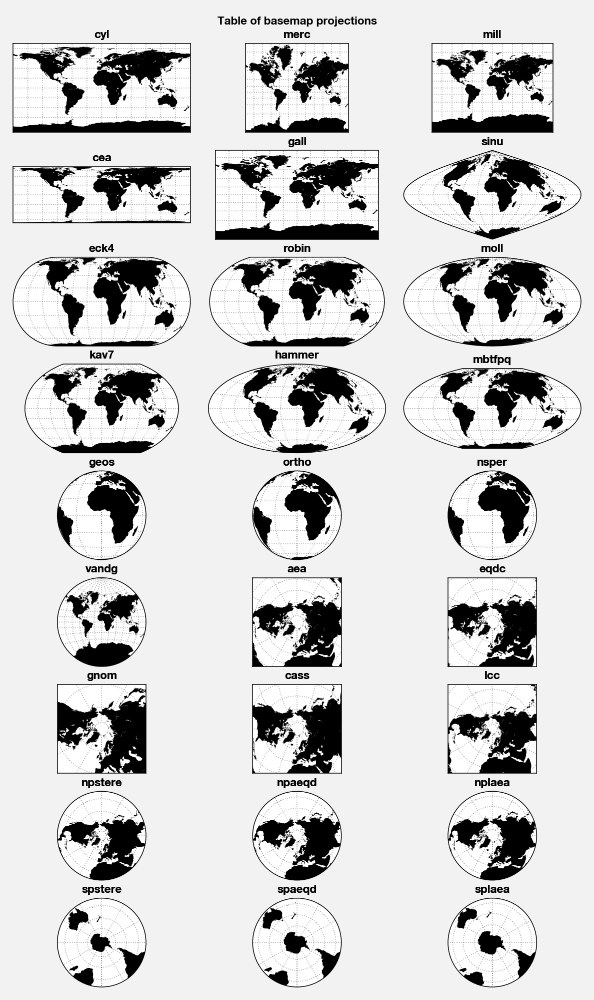

