Introduction
============

APIS
----

Matplotlib has two APIs – the “pyplot” API (which is MATLAB-like), and
the “object-oriented” API (which is more “pythonic”, more clear, more
flexible, and you should consider using!).

Contrary to the similar names, this package is not meant to be a pyplot
replacement – it adds to the “object-oriented” API by subclassing
matplotlib Artists classes, like `~matplotlib.axes.Axes` and
`~matplotlib.figure.Figure`.

.. code:: ipython3

    import matplotlib.pyplot as plt
    plt.figure(figsize=(5,3))
    plt.plot(np.random.rand(10,10), lw=3)
    plt.title('PyPlot API (discouraged)')

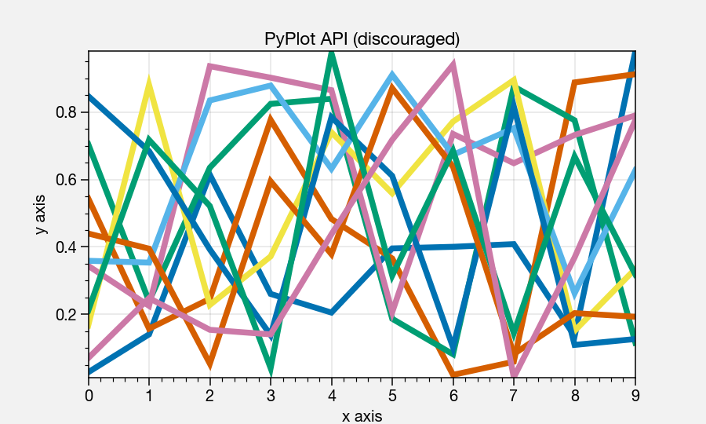

.. code:: ipython3

    import matplotlib.pyplot as plt
    f, ax = plt.subplots(figsize=(5,3))
    ax.plot(np.random.rand(10,10), lw=3)
    ax.set_title('Object-oriented API (recommended)')

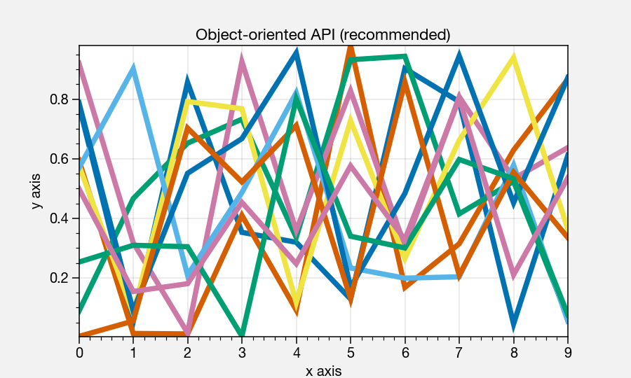

The basics
----------

The `~proplot.subplots.subplots` command is your gateway to all of
ProPlot’s features. Its usage is sort of like the pyplot
`~matplotlib.pyplot.subplots` version, but it is packed with new
features and generates a subclassed figure and specially subclassed
axes.

.. code:: ipython3

    import proplot as plot
    plot.nbsetup()
    f, ax = plot.subplots(width=2)
    f, ax = plot.subplots(ncols=3, nrows=2, width=5)

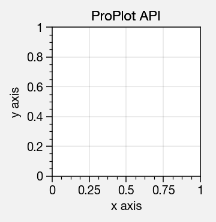

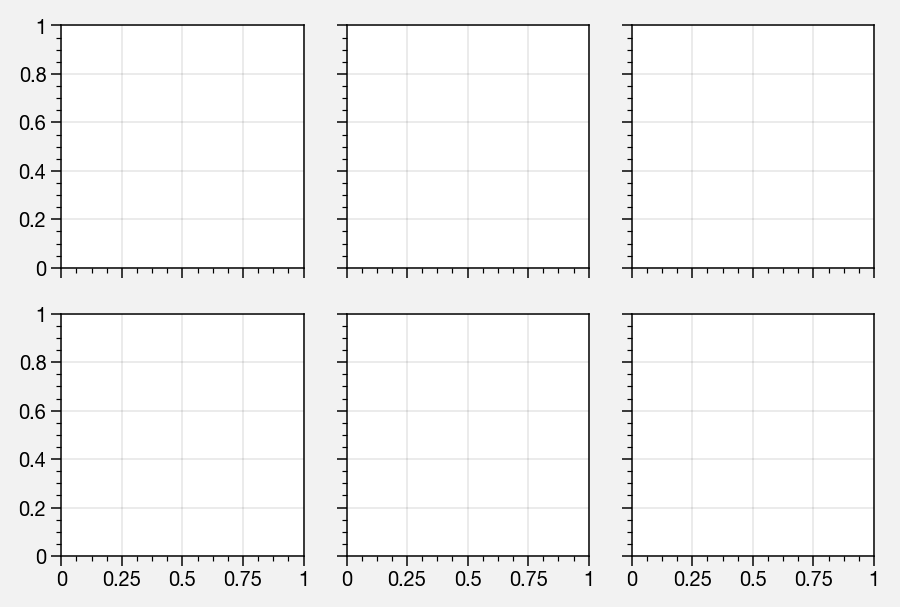

Complex subplot grids
---------------------

Set up a complex grid of subplots using a 2D array of integers – just
think of the array as a “picture” of your figure. Now the below grid is
built from just one line of code, instead of 6 lines. The order of
numbers determines order of a-b-c labels. See
`~proplot.subplots.subplots` for details.

.. code:: ipython3

    # Arbitrarily complex array of subplots, with shared/spanning x/y axes detected automatically
    import proplot as plot
    import numpy as np
    plot.nbsetup()
    f, axs = plot.subplots([[1, 1, 2], [1, 1, 6], [3, 4, 4], [3, 5, 5]], span=1, share=3, width=5)
    axs.format(suptitle='Complex subplot grid with axis-sharing + spanning labels', xlabel='time (seconds)', ylabel='temperature (K)', abc=True)
    axs[0].plot(2*(np.random.rand(100,5)-0.5).cumsum(axis=0), lw=2)

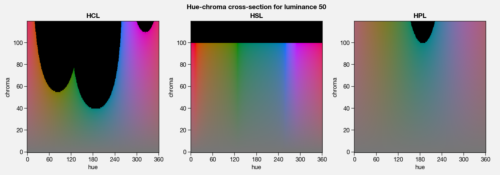

Arbitrary units
---------------

By default, most matplotlib sizing arguments assume the units “inches”
or some “relative” unit size – e.g. relative to the axes width. With
ProPlot, virtually **every** sizing argument is interpreted in the same
way – if numeric, the units are inches, and if string, the units are
interpreted by `~proplot.utils.units` (see `~proplot.utils.units`
documentation for a handy table). Note this means even
`~matplotlib.gridspec.GridSpec` arguments like ``wspace`` and
``hspace`` are now in inches by default (see
`~proplot.subplots.subplots` for details).

.. code:: ipython3

    import proplot as plot
    plot.nbsetup()
    f, ax = plot.subplots(ncols=2, axwidth=1, axheight='15mm')
    f, ax = plot.subplots(width='5cm', aspect=(3,1))
    f, ax = plot.subplots(height='120pt', aspect=1.5)

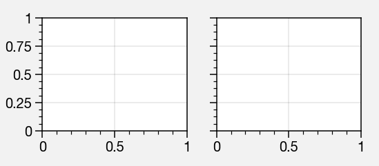

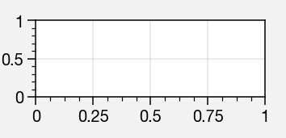

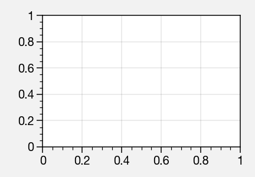

A smarter “tight layout”
------------------------

With ProPlot, you will always get just the right amount of spacing
between subplots so that elements don’t overlap, and just the right
amount of space around the figure edge so that labels and whatnot are
not cut off. Furthermore, despite all of the complex adjustments this
requires, the original subplot aspect ratios are **always preserved**.
Even when inner panels are present, the main subplot aspect ratios will
stay fixed (see below for more on panels).

You can disable this feature by passing ``tight=False`` to
`~proplot.subplots.subplots`, but it is unbelievably useful. It works
by scaling either the figure width or height dimension (whichever one
you didn’t specify) such that the subplot aspect ratios will not change,
and by taking advantage of ProPlot’s subplot layout restrictions. Some
examples are below.

.. code:: ipython3

    import proplot as plot
    plot.nbsetup()
    f, axs = plot.subplots(nrows=3, ncols=3, aspect=1, axwidth=1, share=0, span=0, tight=False)
    axs[4].format(ylabel='ylabel', xlabel='xlabel', title='title\ntitle\ntitle', suptitle='Without tight subplots')

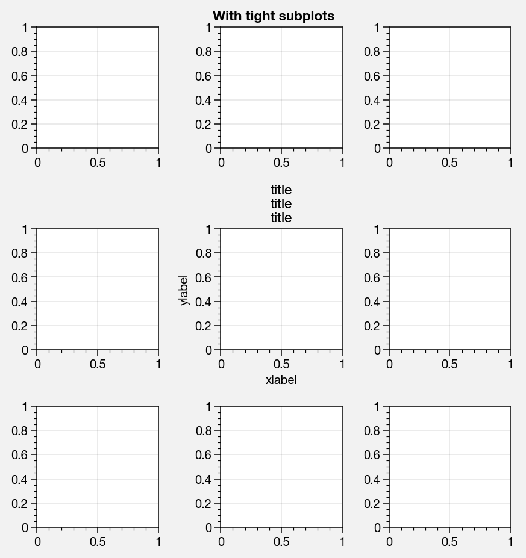

.. code:: ipython3

    import proplot as plot
    plot.nbsetup()
    f, axs = plot.subplots(nrows=3, ncols=3, aspect=1, axwidth=1.2, share=0, span=0)
    axs[4].format(ylabel='ylabel', xlabel='xlabel', title='title\ntitle\ntitle', suptitle='With tight subplots')

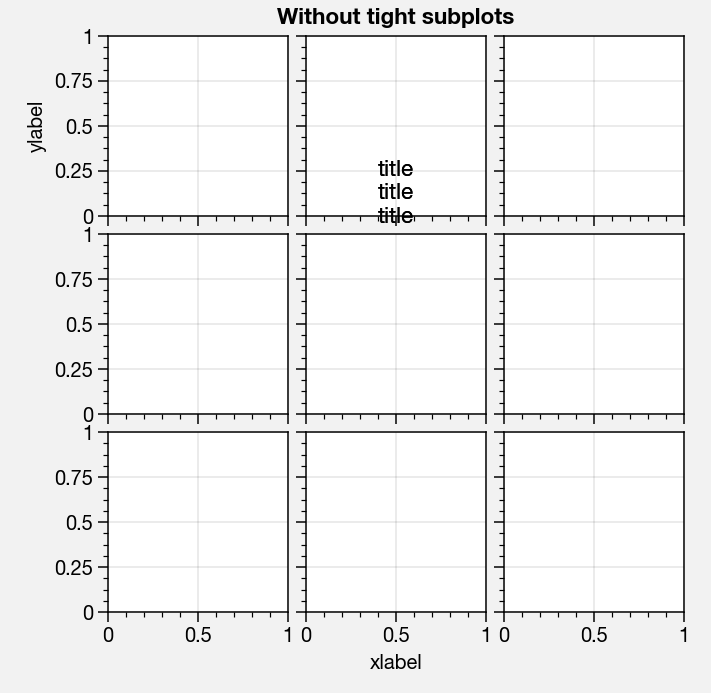

.. code:: ipython3

    import proplot as plot
    plot.nbsetup()
    f, axs = plot.subplots([[1,2],[3,2],[3,4]], share=0, span=0, axwidth=1.5)
    axs[0].format(xlabel='xlabel\nxlabel\nxlabel', title='Title', suptitle='Super title')
    axs[1].format(ylabel='ylabel\nylabel', xformatter='null', yticklabelloc='both')
    axs[2].format(yformatter='null', title='Title', ytickloc='both')
    axs[3].format(yformatter='null', xlabel='xlabel\nxlabel\nxlabel')

.. code:: ipython3

    import proplot as plot
    plot.nbsetup()
    f, axs = plot.subplots(axwidth=3, ncols=2, span=False, share=0, innerpanels='lr', inner_kw={'rshare':False})
    axs.format(ylabel='ylabel', xlabel='xlabel')
    axs[0].rpanel.format(ylabel='ylabel', ytickloc='right', yticklabelloc='right', suptitle='Super title', collabels=['Column 1', 'Column 2'])

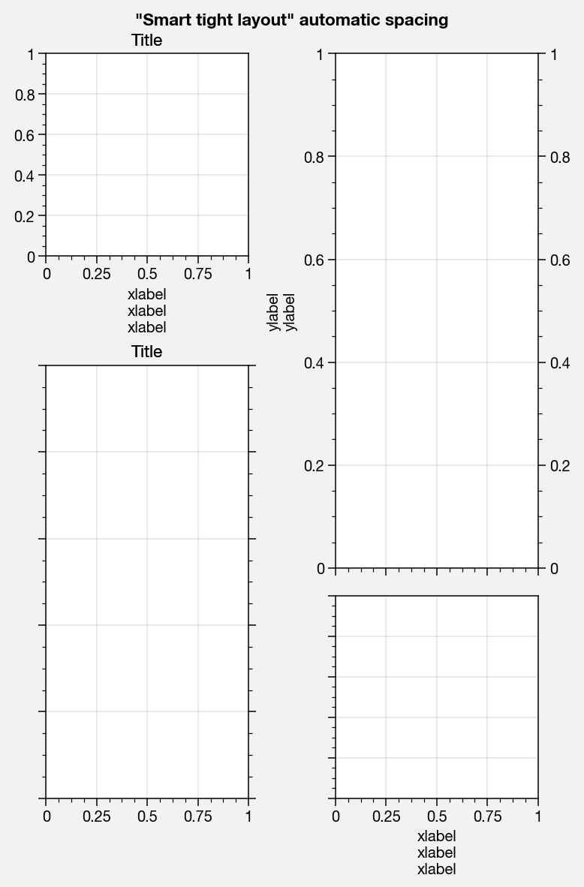

Formatting your axes
--------------------

The `~proplot.subplots.subplots` method populates the
`~proplot.subplots.Figure` object with either `~proplot.axes.XYAxes`
(for cartesian axes) or `~proplot.axes.MapAxes` (for cartopy or
basemap map projection axes). Both of these classes inherit from the
base class `~proplot.axes.BaseAxes`.

The **most important** new method you need to know is
`~proplot.axes.BaseAxes.format`. This is your one-stop-shop for
changing axis labels, tick labels, titles, etc. Keyword args passed to
this function are interpreted as follows:

1. Any keyword arg matching the name of a ProPlot or native matplotlib
   “rc” setting will be applied to the axes (see the `~proplot.rcmod`
   documentation). If the name has “dots”, **simply omit them** – for
   example, ``title.weight`` becomes ``titleweight``, and ``title.pos``
   becomes ``titlepos``.
2. Remaining keyword args are passed to the ``smart_update`` methods of
   the top-level class – that is, the `~proplot.axes.XYAxes`
   `~proplot.axes.XYAxes.smart_update` or `~proplot.axes.MapAxes`
   `~proplot.axes.MapAxes.smart_update` methods. Use these to change
   settings specific to Cartesian axes or specific to map projections,
   like tick locations and toggling geographic features.
3. Finally, the remaining keyword args are passed to the
   `~proplot.axes.BaseAxes` `~proplot.axes.BaseAxes.smart_update`
   method. This one controls “universal” settings – namely, titles,
   “super titles”, row and column labels, and a-b-c subplot labelling.

Now, instead of having to remember all of these verbose, one-liner
matplotlib commands like ``ax.set_title`` and ``ax.xaxis.tick_params``,
or even having to directly use verbose classes like the matplotlib
`~matplotlib.ticker` classes, `~proplot.axes.BaseAxes.format` lets
you change everything all at once. This basically eliminates the need
for boilerplate plotting code!

Also note the axes returned by `~proplot.subplots.subplots` function
are in a special `~proplot.subplots.axes_list` list. This lets you
call any method, including `~proplot.axes.BaseAxes.format`, on every
axes **simultaneously** (as in the below example).

.. code:: ipython3

    import proplot as plot
    plot.nbsetup()
    f, axs = plot.subplots(ncols=2, nrows=2, axwidth=2.2, share=False, span=False)
    axs.format(xlabel='x-axis', ylabel='y-axis', xlim=(0,10), xlocator=2,
              ylim=(0,4), ylocator=plot.arange(0,4), yticklabels=('a', 'bb', 'ccc', 'dd', 'e'),
              title='Inner title', titlepos='ci', suptitle='Super title',
              abc=True, abcpos='il', abcformat='a.',
              ytickloc='both', yticklabelloc='both', ygridminor=True, xtickminor=False,
              collabels=['Column label 1', 'Column label 2'], rowlabels=['Row label 1', 'Row label 2'])

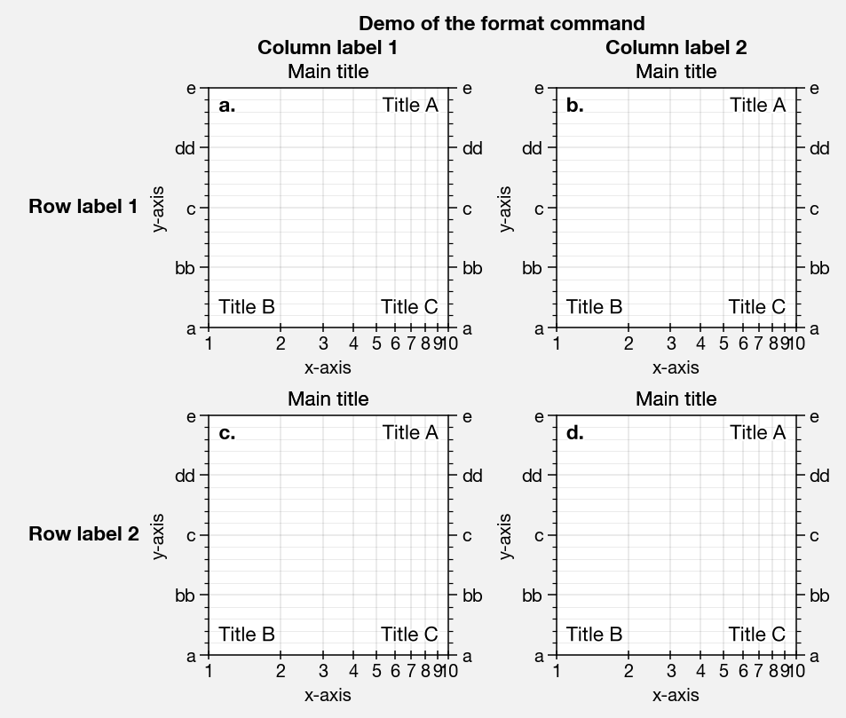

Default configuration settings
------------------------------

A special object named `~proplot.rcmod.rc`, belonging to the
`~proplot.rcmod.rc_configurator` class, is created whenever you import
ProPlot. This object gives you advanced control over the look of your
plots. **Use** `~proplot.rcmod.rc` **as your one-stop shop for
changing global settings**.

The `~proplot.rcmod.rc` object controls built-in
`~matplotlib.rcParams` settings, a few custom :ref:`rcParams_new`
settings, and some magic :ref:`rcGlobals` settings that apply to
groups of other settings and keep them synced. Tables of these settings
are found in the `~proplot.rcmod` documentation. To modify any
:ref:`rcGlobals`, :ref:`rcParams_new`, or `~matplotlib.rcParams`
setting, you have four options:

1. Change the default settings for good by creating a ``.proplotrc``
   file in your home folder. For more information, see
   :ref:`.proplotrc file`.
2. Change one global setting using ``plot.rc.name = value`` or
   ``plot.rc['name'] = value``. Note that, for settings with ‘dots’ in
   their name, you will have to use ``plot.rc['category.name'] = value``
3. Update several global settings at once using
   ``plot.rc.update({'name1':value1, 'name2':value2})`` or
   ``plot.rc.update(name1=value1, name2=value2)``, just like you would
   update a dictionary.
4. Change settings for a single axes using
   ``ax.format(rc_kw={'name1':value1, 'name2':value2})`` or
   ``ax.format(name1=value1, name2=value2)``, as discussed above.

To access a single setting, use ``rc.name`` or ``rc['name']``. To access
a group of setting by category name, use e.g. ``rc.axes`` and a
dictionary of settings will be returned. To reset everything to the
default state, use `~proplot.rcmod.rc_configurator.reset`. By default,
settings are reset every time a figure is drawn – that is, when a figure
is rendered by the matplotlib backend or saved to file.

.. code:: ipython3

    import proplot as plot
    import numpy as np
    plot.nbsetup()
    # A bunch od different ways to update settings
    plot.rc.cycle = 'colorblind'
    plot.rc.linewidth = 1.5
    plot.rc.update({'fontname': 'DejaVu Sans'})
    plot.rc['figure.facecolor'] = 'w'
    plot.rc['axes.facecolor'] = 'gray5' # underscore replaces the "dot"!
    # Make plot
    f, axs = plot.subplots(nrows=1, ncols=2, aspect=1, width=6,
                           span=0, wspace=0.5, sharey=2, hspace=0.7)
    N, M = 100, 6
    values = np.arange(1,M+1)
    for i,ax in enumerate(axs):
        data = np.cumsum(np.random.rand(N,M)-0.5, axis=0)
        lines = ax.plot(data, linewidth=3, cycle=('C0','C1',6)) # see "Changing the color cycle" for details
    axs.format(ytickloc='both', ycolor='blue7',
               hatch='xxx', hatchcolor='w',
               xlabel='x label', ylabel='y label',
               yticklabelloc='both',
               suptitle='Using "format" and "plot.rc" to apply new rc settings')
    ay = axs[-1].twinx()
    ay.format(ycolor='r', ylabel='secondary axis')
    ay.plot((np.random.rand(100)-0.2).cumsum(), color='r', lw=3)

.. image:: showcase/showcase_21_1.png
   :width: 540px
   :height: 260px

Colorbars and legends
---------------------

ProPlot adds several new features to the
`~matplotlib.axes.Axes.legend` and
`~matplotlib.figure.Figure.colorbar` commands, respectively powered by
the `~proplot.axes.legend_factory` and
`~proplot.axes.colorbar_factory` functions (see documentation for
usage information).

I’ve also added ``colorbar`` methods to the `~proplot.axes.BaseAxes`
and special `~proplot.axes.PanelAxes` axes. When you call
`~proplot.axes.BaseAxes.colorbar` on a `~proplot.axes.BaseAxes`, an
**inset** colorbar is generated. When you call
`~proplot.axes.PanelAxes.colorbar` on a `~proplot.axes.PanelAxes`,
the axes is **filled** with a colorbar. See
`~proplot.subplots.subplots` and
`~proplot.subplots.Figure.panel_factory` for more on panels.

.. code:: ipython3

    import proplot as plot
    import numpy as np
    plot.nbsetup()
    f, ax = plot.subplots(bottompanel=True, tight=1, axwidth=2.5)
    m = ax.contourf((np.random.rand(20,20)).cumsum(axis=0), extend='both', levels=np.linspace(0,10,11), cmap='glacial')
    ax.format(xlabel='xlabel', ylabel='ylabel', xlim=(0,19), ylim=(0,19))
    ax.colorbar(m, ticks=2, label='inset colorbar')
    ax.colorbar(m, ticks=2, loc='lower left')
    f.bottompanel.colorbar(m, label='standard outer colorbar', length=0.9)
    ax.format(suptitle='Title')

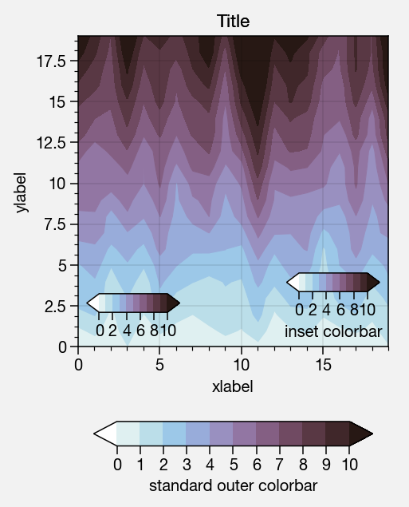

A particularly useful `~proplot.axes.colorbar_factory` feature is the
following, you no longer have to pass a “mappable” object (i.e. the
output of `~matplotlib.axes.Axes.contourf` or similar). ``colorbar``
will now accept any list of objects with ``get_color`` methods, or a
list of color strings/RGB tuples! A colormap is constructed on-the-fly
from the corresponding colors.

.. code:: ipython3

    f, ax = plot.subplots(bcolorbar=True, axwidth=3, aspect=1.5)
    plot.rc.cycle = 'qual2'
    # plot.rc['axes.labelweight'] = 'bold'
    hs = ax.plot((np.random.rand(12,12)-0.45).cumsum(axis=0), lw=5)
    ax.format(suptitle='Colorbar from line handles', xlabel='x axis', ylabel='y axis')
    f.bpanel.colorbar(hs, values=np.arange(0,12),
                      label='Label for lines that map to numeric values',
                      tickdir='top', # because why not?
                     )

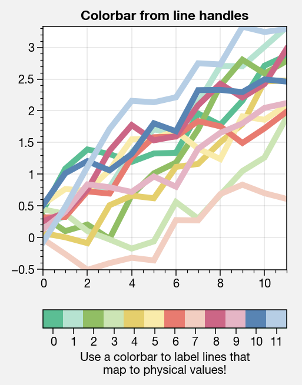

As shown below, when you call `~proplot.axes.PanelAxes.legend` on a
`~proplot.axes.PanelAxes`, the axes is **filled** with a legend – that
is, a centered legend is drawn, and the axes patch and spines are made
invisible.

Some other notes: legend entries are now sorted in *row-major* order by
default (not sure why the matplotlib authors chose column-major), and
this is configurable with the ``order`` keyword arg. You can also
disable vertical alignment of legend entries with the ``align`` keyword
arg, or by passing a list of lists of plot handles. Under the hood, this
is done by stacking multiple single-row, horizontally centered legends
and forcing the background to be invisible.

.. code:: ipython3

    import proplot as plot
    import numpy as np
    plot.nbsetup()
    plot.rc.cycle = 'intersection'
    labels = ['a', 'bb', 'ccc', 'dddd', 'eeeee', 'ffffff']
    f, axs = plot.subplots(ncols=2, bottomlegends=True, span=False, share=0)
    hs = []
    for i,label in enumerate(labels):
        hs += axs.plot(np.random.rand(20), label=label, lw=3)[0]
    axs[0].legend(order='F', frameon=True, loc='lower left')
    f.bpanel[0].legend(hs, ncols=4, align=True, frameon=True)
    f.bpanel[1].legend(hs, ncols=4, align=False)
    axs.format(ylim=(-0.1, 1.1), xlabel='xlabel', ylabel='ylabel',
               suptitle='Demo of new legend options',
               collabels=['Inner legend, outer aligned legend', 'Outer un-aligned legend'], collabelweight='normal')

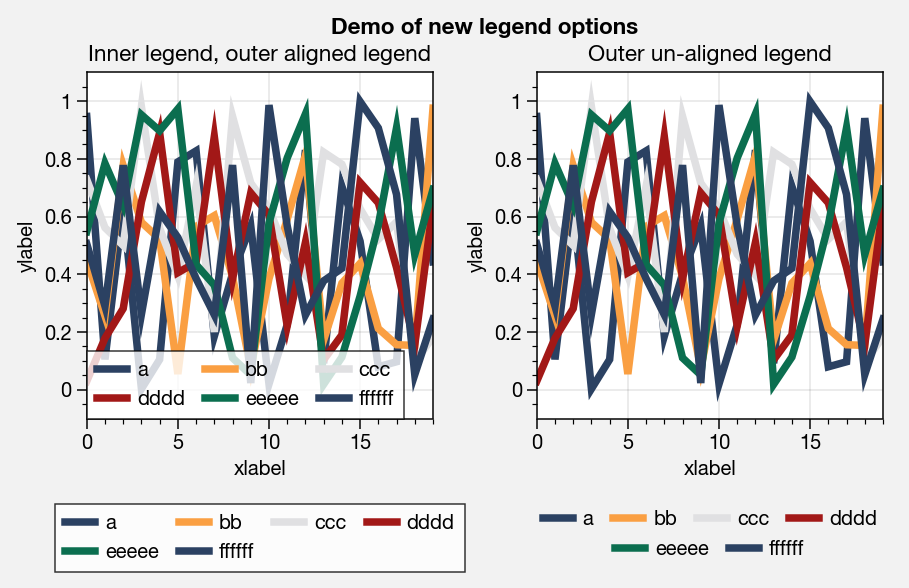

Improved plotting methods
-------------------------

Now, `~matplotlib.axes.Axes.pcolor` and
`~matplotlib.axes.Axes.pcolormesh` accept a ``levels`` argument, just
like `~matplotlib.axes.Axes.contourf`. This was previously really
tricky to implement. Discrete levels can be preferred for scientific
visualization, because it is easier to map colors to particular numbers
with your eye. See `~proplot.axes.wrapper_cmap` for details.

I’ve also fixed the well-documented
`white-lines-between-filled-contours <https://stackoverflow.com/q/8263769/4970632>`__
and
`white-lines-between-pcolor-rectangles <https://stackoverflow.com/q/27092991/4970632>`__
issues by automatically changing the edge colors after ``contourf``,
``pcolor``, and ``pcolormesh`` are called.

.. code:: ipython3

    f, axs = plot.subplots(ncols=2, innercolorbars='b')
    data = 20*(np.random.rand(20,20) - 0.5).cumsum(axis=0).cumsum(axis=1)
    N, step = 100, 20
    ax = axs[0]
    m = ax.pcolormesh(data, levels=np.arange(-N,N,0.2), cmap='temperature', extend='both')
    ax.format(title='Pcolor without discernible levels', suptitle='Pcolor demo')
    ax.bpanel.colorbar(m, locator=step)
    ax = axs[1]
    m = ax.pcolormesh(data, levels=plot.arange(-N,N,step), cmap='temperature', extend='both')
    ax.format(title='Pcolor plot with levels')
    ax.bpanel.colorbar(m, locator=step)

.. image:: showcase/showcase_31_1.png
   :width: 454px
   :height: 293px

I’ve also added a ``cmap`` option to the `~matplotlib.axes.Axes.plot`
command – this lets you draw line collections that map individual
segments of the line to individual colors. This can be useful for
drawing “parametric” plots, where you want to indicate the time or some
other coordinate at each point on the line. See
`~proplot.axes.BaseAxes.cmapline` for details.

.. code:: ipython3

    import proplot as plot
    import numpy as np
    plot.nbsetup()
    f, axs = plot.subplots(bottompanel=True, axwidth=4, aspect=(2,1))
    m = axs.plot((np.random.rand(50)-0.5).cumsum(), np.random.rand(50), cmap='sunset', values=np.arange(50), lw=7, extend='both')
    axs.format(xlabel='xlabel', ylabel='ylabel', suptitle='Line with smooth color gradations')
    f.bottompanel.colorbar(m, label='parametric coordinate', locator=5)

.. code:: ipython3

    import proplot as plot
    import numpy as np
    plot.nbsetup()
    # Make a pretty spiral
    N = 12
    values = np.arange(1, N+1)
    radii = np.linspace(1,0.2,N)
    angles = np.linspace(0,4*np.pi,N)
    # Figure
    f, axs = plot.subplots(innercolorbars='b', ncols=2, axwidth=2, bwidth=0.8, span=False)
    axs = axs[::-1]
    cmaps = [('slate blue', 'sienna'), 'thermal']
    multipliers = [1.2, 1.4]
    for i,(ax,cmap) in enumerate(zip(axs,cmaps)):
        x = radii*np.cos(multipliers[i]*angles)
        y = radii*np.sin(multipliers[i]*angles)
        m = ax.plot(x, y, cmap=cmap, values=values+i*12,
                    linewidth=15, interp=1-i, cmap_kw={'left':i*0.05})
        ax.format(xlim=(-1,1), ylim=(-1,1), suptitle='Lines with smooth color gradations',
                  xlabel='cosine angle', ylabel='sine angle', title=f'Dataset #{i+1}')
        ax.bpanel.colorbar(m, locator=None, label=f'parametric coordinate')

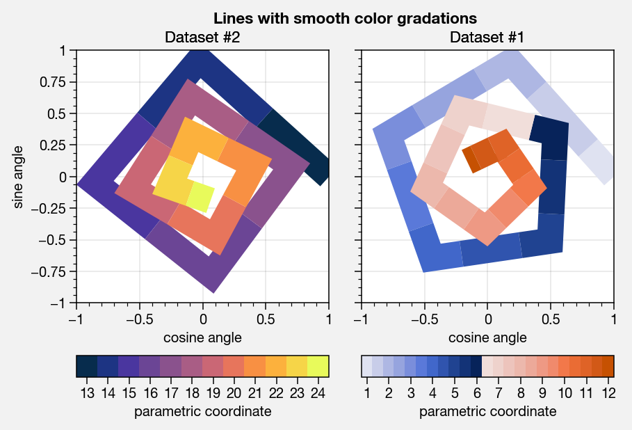

Inner panels, colorbars
-----------------------

It is common to need “panels” that represent averages across some axis
of the main subplot, or some secondary 1-dimensional dataset. This is
hard to do with matplotlib, but easy with ProPlot! You can specify
arbitrary combinations of inner panels for specific axes, and ProPlot
will always keep the subplots aligned. See
`~proplot.subplots.subplots` and
`~proplot.subplots.Figure.panel_factory` for details.

.. code:: ipython3

    # Arbitrarily complex combinations are possible, and inner spaces still determined automatically
    f, axs = plot.subplots(axwidth=2, nrows=2, ncols=2,
                           inner={1:'t', 2:'l', 3:'b', 4:'r'}, inner_kw={'flush':False}, innerpad=0.001,
                           tight=1, innertight=1, share=0, span=0, wratios=[1,2])
    axs.format(title='Title', suptitle='This is a super title', collabels=['Column 1','Column 2'],
               titlepos='ci', xlabel='xlabel', ylabel='ylabel', abc=True, top=False)
    axs.format(ylocator=plot.arange(0.2,0.8,0.2), xlocator=plot.arange(0.2,0.8,0.2))

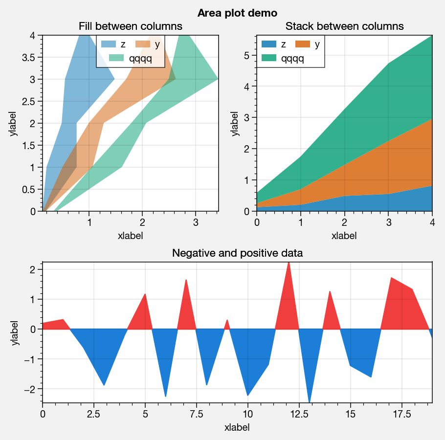

If you want “colorbar” panels, the simplest option is to use the
``innercolorbars`` keyword instead of ``innerpanels``. This makes the
width of the panels more appropriate for filling with a colorbar. You
can modify these default spacings with a custom ``.proplotrc`` file (see
the `~proplot.rcmod` documentation).

If you want panels “flush” against the subplot, simply use the ``flush``
keyword args. If you want to disable “axis sharing” with the parent
subplot (i.e. you want to draw tick labels on the panel, and do not want
to inherit axis limits from the main subplot), use any of the ``share``
keyword args. Again, see `~proplot.subplots.subplots` and
`~proplot.subplots.Figure.panel_factory` for details.

.. code:: ipython3

    import proplot as plot
    import numpy as np
    plot.nbsetup()
    f, axs = plot.subplots(axwidth=2, nrows=2, ncols=2, share=0, span=False, innerpad=0.1, innertight=True,
                           innerpanels='r', innercolorbars='b', inner_kw={'rshare':False, 'rflush':True})
    axs.format(xlabel='xlabel', ylabel='ylabel', suptitle='This is a super title')
    for i,ax in enumerate(axs):
        ax.format(title=f'Dataset {i+1}')
    data = (np.random.rand(20,20)-0.1).cumsum(axis=1)
    m = axs.contourf(data, cmap='glacial')[0]
    axs.rpanel.plot(data.mean(axis=1), np.arange(20), color='k')
    axs.rpanel.format(title='Mean')
    axs.bpanel.colorbar(m, label='cbar')

.. image:: showcase/showcase_39_1.png
   :width: 454px
   :height: 487px

Outer panels, colorbars
-----------------------

It is also common to need “global” colorbars or legends, meant to
reference multiple subplots at once. This is easy to do with ProPlot
too!

The “global” colorbars can extend across every row and column of the
subplot array, or across arbitrary contiguous rows and columns. The
associated axes instances are found on the `~proplot.figure.Figure`
instance under the names ``bottompanel``, ``leftpanel``, and
``rightpanel`` (you can also use the shorthand ``bpanel``, ``lpanel``,
and ``rpanel``). See `~proplot.subplots.subplots` for details.

.. code:: ipython3

    f, axs = plot.subplots(ncols=3, nrows=3, axwidth=1, bottompanels=[1,2,2], rightpanel=True)
    m = axs.pcolormesh(np.random.rand(20,20), cmap='grays', levels=np.linspace(0,1,11), extend='both')[0]
    axs.format(suptitle='Super title', abc=True, abcpos='ol', abcformat='a.', xlabel='xlabel', ylabel='ylabel')
    f.bpanel[0].colorbar(m, label='label', ticks=0.5)
    f.bpanel[1].colorbar(m, label='label', ticks=0.2)
    f.rpanel.colorbar(m, label='label', ticks=0.1, length=0.7)

.. image:: showcase/showcase_42_1.png
   :width: 460px
   :height: 496px

.. code:: ipython3

    import proplot as plot
    import numpy as np
    plot.nbsetup()
    f, axs = plot.subplots(ncols=4, axwidth=1.5, bottomcolorbars=[1,1,2,2], rightpanel=True, share=0, span=0, wspace=0.3)
    data = (np.random.rand(50,50)-0.1).cumsum(axis=0)
    m = axs[:2].contourf(data, cmap='grays', extend='both')
    cycle = plot.Cycle('grays', 5)
    hs = []
    for abc,color in zip('ABCDEF',cycle):
        hs += axs[2:].plot(np.random.rand(10), lw=3, color=color, label=f'line {abc}')[0]
    f.bottompanel[0].colorbar(m, length=0.8, label='label')
    f.bottompanel[1].legend(hs, ncols=5, align=True)
    f.rightpanel.legend(hs, ncols=1)
    axs.format(suptitle='Global colorbar and global legend', abc=True, abcpos='ol', abcformat='A',
              collabels=['2D dataset #1', '2D dataset #2', 'Line set #1', 'Line set #2'], collabelweight='normal')

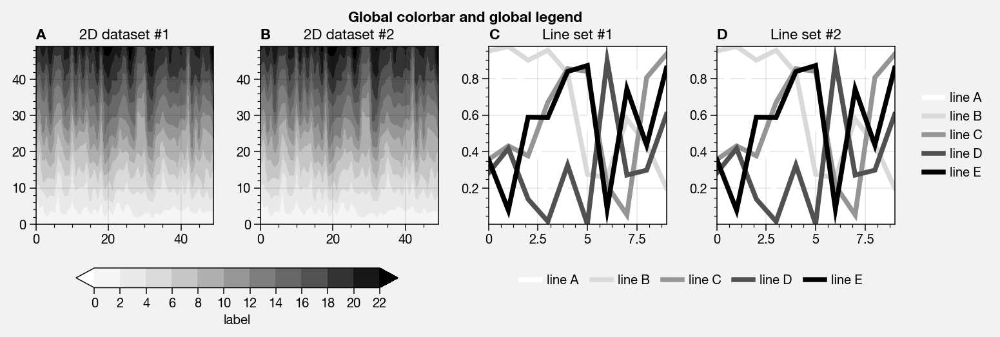

Helvetica as the default font
-----------------------------

Helvetica is the MATLAB default, but matplotlib does not come packaged
with it and defaults to a font called “DejaVu Sans”. ProPlot adds back
Helvetica and makes it the default.

In my opinion, Helvetica is much more professional-looking than the
DejaVu Sans. You can change the default font by modifying your
``.proplotrc`` (see the `~proplot.rcmod` documentation).

.. code:: ipython3

    import proplot as plot
    plot.nbsetup()
    plot.rc['small'] = plot.rc['large'] = 10
    plot.rc['fontname'] = 'Helvetica'
    f, axs = plot.subplots(ncols=4, nrows=3, share=False, span=False,
                           axwidth=2.0, aspect=0.85, wspace=0.5, hspace=0.5)
    # options = ['ultralight', 'light', 'normal', 'regular', 'book', 'medium', 'roman',
    #            'semibold', 'demibold', 'demi', 'bold', 'heavy', 'extra bold', 'black',
    #            'italic', 'oblique'] # remove redundancies below
    options = ['ultralight', 'light', 'normal', 'medium', 'demi', 'bold', 'extra bold', 'black']
    fonts = ['Helvetica', 'Helvetica Neue', 'DejaVu Sans', 'Bitstream Vera Sans', 'Verdana', 'Tahoma',
             'Arial', 'Geneva', 'Times New Roman', 'Palatino', 'Inconsolata', 'Myriad Pro'] #Comic Sans MS', 'Myriad Pro']
    for ax,font in zip(axs,fonts):
        plot.rc['fontname'] = font
        math  = r'$\alpha\beta + \gamma\delta \times \epsilon\zeta \cdot \eta\theta$'
        math += ('\n' + r'$\Sigma\kappa\lambda\mu\pi\rho\sigma\tau\psi\phi\omega$')
        ax.text(0.5, 0, math + '\n' + 'The quick brown fox\njumps over the lazy dog.\n0123456789\n!@#$%^&*()[]{};:,./?',
                weight='normal', ha='center', va='bottom')
        ax.format(xlabel='xlabel', ylabel='ylabel', suptitle='Table of font names')
        for i,option in enumerate(options):
            if option in ('italic', 'oblique'):
                kw = {'style':option, 'weight':'normal'} # otherwise defaults to *lightest* one!
            elif option in ('small-caps',):
                kw = {'variant':option}
            else:
                kw = {'weight':option}
            kw.update({'stretch':'normal'})
            ax.text(0.03, 0.97 - (i*1.2*(plot.rc['small']/72)/ax.height), f'{option}', ha='left', va='top', **kw)
            ax.text(0.97, 0.97 - (i*1.2*(plot.rc['small']/72)/ax.height), f'{font[:14].strip()}',   ha='right', va='top', **kw)

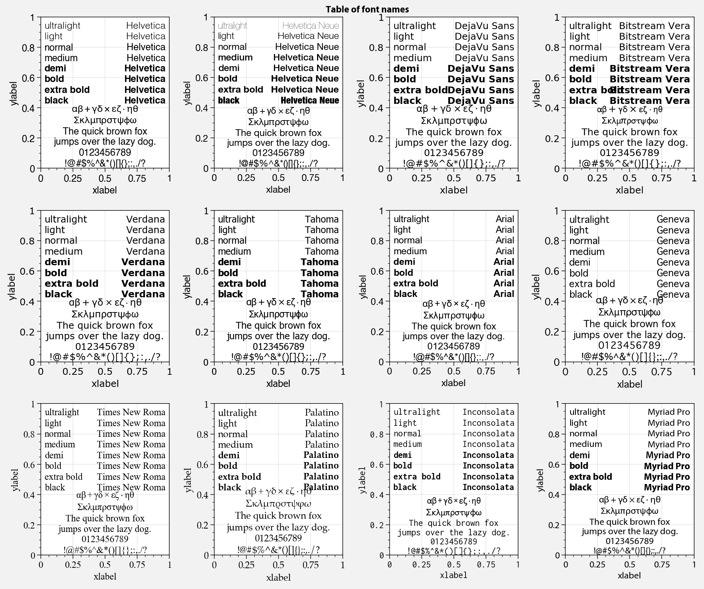

Cartesian axes
==============

Limiting redundancy
-------------------

Matplotlib has an “axis sharing” feature – but all this can do is hold
the axis limits the same. ProPlot introduces **4 axis-sharing
“levels”**, as demonstrated below. It also introduces a new
**axis-spanning label** feature, as seen below. See
`~proplot.subplots.subplots` for details.

.. code:: ipython3

    import proplot as plot
    import numpy as np
    plot.nbsetup()
    N = 50
    M = 40
    colors = plot.colors('grays_r', M, x=(0.1, 0.8))
    for share in (0,1,2,3):
        f, axs = plot.subplots(ncols=4, aspect=1, wspace=0.5, axwidth=1.2, sharey=share, spanx=share//2)
        gen = lambda scale: scale*(np.random.rand(N,M)-0.5).cumsum(axis=0)[N//2:,:]
        for ax,scale,color in zip(axs,(1,3,7,0.2),('gray9','gray7','gray5','gray3')):
            array = gen(scale)
            for l in range(array.shape[1]):
                ax.plot(array[:,l], color=colors[l])
            ax.format(suptitle=f'Axis-sharing level: {share}, spanning labels {["off","on"][share//2]}', ylabel='y-label', xlabel='x-axis label')

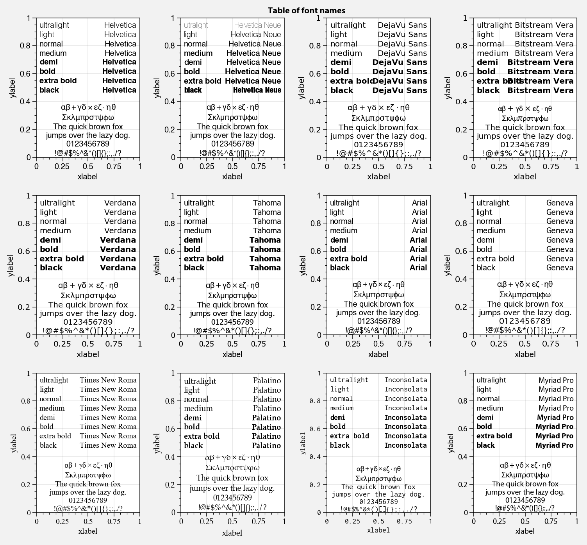

.. image:: showcase/showcase_50_1.png
   :width: 643px
   :height: 176px

.. image:: showcase/showcase_50_2.png
   :width: 643px
   :height: 175px

.. image:: showcase/showcase_50_3.png
   :width: 643px
   :height: 190px

.. code:: ipython3

    import proplot as plot
    import numpy as np
    plot.nbsetup()
    plot.rc.cycle = 'Set4'
    titles = ['With redundant labels', 'Without redundant labels']
    for mode in (0,1):
        f, axs = plot.subplots(nrows=4, ncols=4, share=3*mode, span=1*mode, axwidth=1)
        for ax in axs:
            ax.plot((np.random.rand(100,20)-0.4).cumsum(axis=0))
        axs.format(xlabel='x-label', ylabel='y-label', suptitle=titles[mode], abc=mode, abcpos='il')

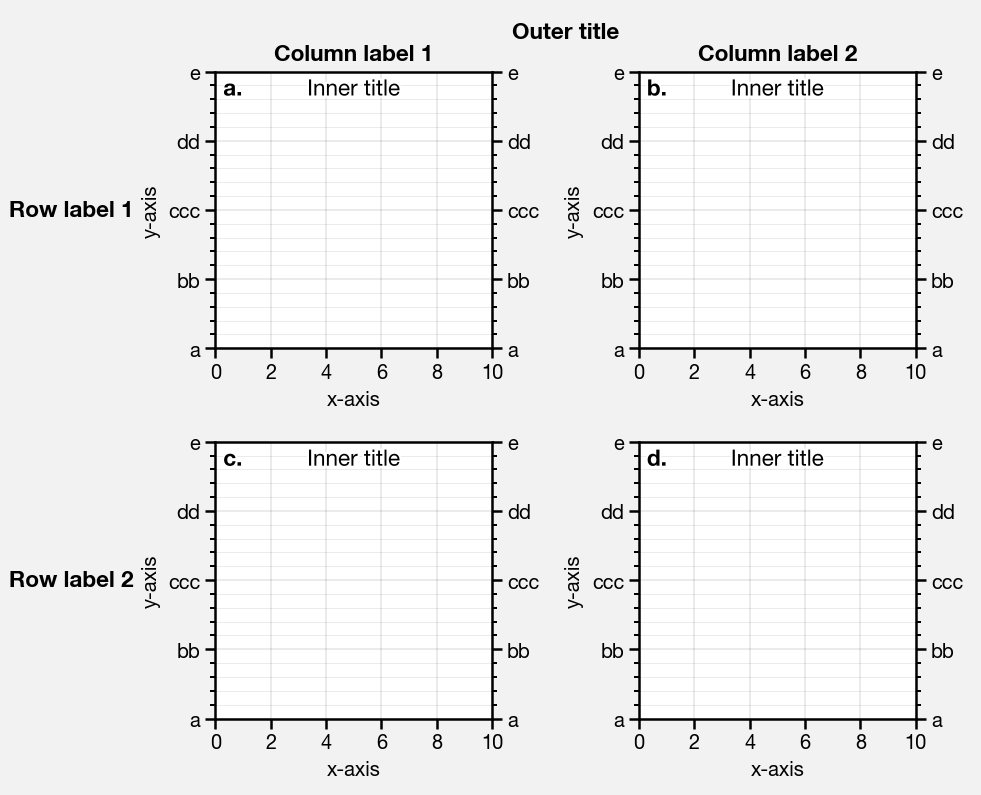

.. image:: showcase/showcase_51_1.png
   :width: 490px
   :height: 498px

Alternate unit axes
-------------------

The new `~proplot.axes.XYAxes.dualx` and
`~proplot.axes.XYAxes.dualy` functions let you easily produce
duplicate *x* and *y* axes meant to represent *alternate units* in the
same coordinate range.

.. code:: ipython3

    import proplot as plot
    plot.nbsetup()
    plot.rc.update({'grid.alpha':0.4, 'grid.linewidth':1.0})
    f, axs = plot.subplots(ncols=2, share=0, span=0, aspect=2.2, axwidth=3)
    N = 200
    c1, c2 = plot.shade('C0', 0.8), plot.shade('C1', 0.8)
    # These first 2 are for general users
    ax = axs[0]
    ax.format(yformatter='null', xlabel='meters', xlocator=1000, xlim=(0,5000),
              xcolor=c2, gridcolor=c2,
              suptitle='Duplicate x-axes with custom unit transformations', ylocator=[], # locator=[] has same result as locator='null'
              )
    ax.dualx(scale=1e-3, xlabel='kilometers', grid=True, xcolor=c1, gridcolor=c1)
    ax = axs[1]
    ax.format(yformatter='null', xlabel='temperature (K)', title='', xlim=(200,300), ylocator='null',
             xcolor=c2, gridcolor=c2)
    ax.dualx(offset=-273.15, xscale='linear', xlabel='temperature (\N{DEGREE SIGN}C)',
             xcolor=c1, gridcolor=c1, grid=True)
    
    # These next 2 are for atmospheric scientists; note the assumed scale height is 7km
    f, axs = plot.subplots(ncols=2, share=0, span=0, aspect=0.4, axwidth=1.8)
    ax = axs[0]
    ax.format(xformatter='null', ylabel='pressure (hPa)', ylim=(1000,10), xlocator=[], 
              gridcolor=c1, ycolor=c1)
    ax.dualy(yscale='height', ylabel='height (km)', color=c2, gridcolor=c2, grid=True)
    ax = axs[1] # span
    ax.format(xformatter='null', ylabel='height (km)', ylim=(0,20), xlocator='null', gridcolor=c2, ycolor=c2,
              suptitle='Duplicate *y*-axes with special transformations', grid=True)
    ax.dualy(yscale='pressure', ylabel='pressure (hPa)', ylocator=100, grid=True, color=c1, gridcolor=c1)

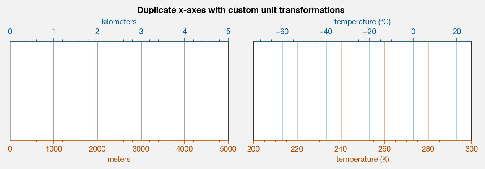

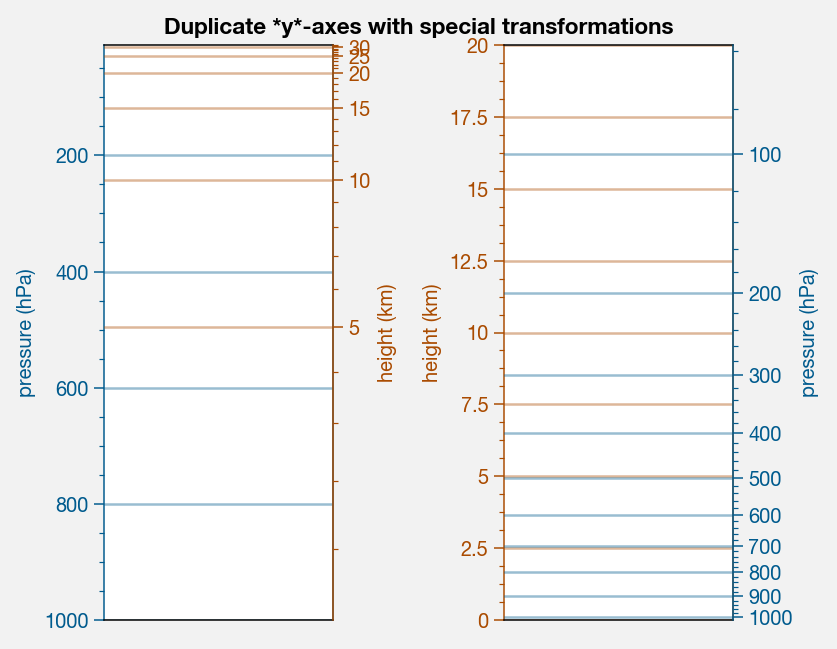

.. code:: ipython3

    # Plot the response function for an imaginary 5-day lowpass filter
    import proplot as plot
    import numpy as np
    plot.nbsetup()
    plot.rc['axes.ymargin'] = 0
    cutoff = 0.3
    x = np.linspace(0.01,0.5,1000) # in wavenumber days
    response = (np.tanh(-((x - cutoff)/0.03)) + 1)/2 # imgarinary response function
    f, ax = plot.subplots(aspect=(3,1), width=6)#, tight=False, top=2)
    ax.fill_between(x, 0, response, facecolor='none', edgecolor='gray8', lw=1, clip_on=True)
    ax.axvline(cutoff, lw=2, ls='-', color='red')
    ax.fill_between([0.27, 0.33], 0, 1, color='red', alpha=0.3)
    ax.format(xlabel='wavenumber (days$^{-1}$)', ylabel='response', gridminor=True)
    # axy = ax.twiny()
    ax.dualx(xlocator=np.array([20, 10, 5, 2, 1, 0.5, 0.2, 0.1, 0.05]),
              xscale='inverse', xlabel='period (days)',
              title='Imgaginary response function', titlepos='oc',
              suptitle='Duplicate x-axes with wavenumber and its inverse (i.e. wavelength)', 
              )

.. image:: showcase/showcase_55_0.png
   :width: 540px
   :height: 272px

Axis ticks and scales
---------------------

Specifying tick locations is much easier and much less verbose with
ProPlot. Pass a number to tick every ``N`` data values, look up a
builtin matplotlib `~matplotlib.ticker` with a string key name, or
pass a list of numbers to tick specific locations. I recommend using
ProPlot’s `~proplot.arange` function to generate lists of ticks – it’s
like numpy’s `~numpy.arange`, but is **endpoint-inclusive**, which
more often than not is what you’ll want in this context.

See `~proplot.axes.XYAxes.smart_update` and
`~proplot.axistools.Locator` for details.

.. code:: ipython3

    import proplot as plot
    import numpy as np
    plot.nbsetup()
    plot.rc.facecolor = plot.shade('powder blue', 1.15) # shade makes it a bit brighter, multiplies luminance channel by this much!
    plot.rc.update(linewidth=1, small=10, large=12, color='dark blue', suptitlecolor='dark blue')
    f, axs = plot.subplots(nrows=5, axwidth=5, aspect=(8,1), share=0, span=0, hspace=0.3)
    # Basic locators
    axs[0].format(xlim=(0,200), xminorlocator=10, xlocator=30, suptitle='Declaring tick locations with ProPlot')
    axs[1].format(xlim=(0,10), xlocator=[0, 0.3,0.8,1.6, 4.4, 8, 8.8, 10], xminorlocator=0.1)
    axs[2].format(xlim=(1,100), xscale='log', xformatter='default') # use this to prevent exponential notation
    axs[3].format(xlim=(1,10), xscale='inverse', xlocator='linear')
    # Index locators are weird...require something plotted in the axes, will only label up bounds of data range
    # For below, could also use ('index', [...]) (i.e. an IndexFormatter), but not sure why this exists when we can just use FixedFormatter
    axs[4].plot(np.arange(10)-5, np.random.rand(10), alpha=0) # index locators 
    axs[4].format(xlim=(0,6), xlocator='index',
                  xformatter=[r'$\alpha$', r'$\beta$', r'$\gamma$', r'$\delta$', r'$\epsilon$', r'$\zeta$', r'$\eta$'])

.. image:: showcase/showcase_58_0.png
   :width: 526px
   :height: 500px

Axis tick labels
----------------

ProPlot also lets you easily change the axis formatter with
`~proplot.axes.BaseAxes.format` (keywords ``xformatter`` and
``yformatter``, or their aliases ``xticklabels`` and ``yticklabels``).
The builtin matplotlib formatters can be referenced by string name, and
several new formatters have been introduced – for example, you can now
easily label your axes as fractions or as geographic coordinates. You
can also just pass a list of strings or a ``%``-style format directive.

See `~proplot.axes.XYAxes.smart_update` and
`~proplot.axes.XYAxes.Formatter` for details.

.. code:: ipython3

    import proplot as plot
    import numpy as np
    plot.nbsetup()
    f, axs = plot.subplots(nrows=6, axwidth=5, aspect=(8,1), share=0, span=0, hspace=0.3)
    plot.rc.update(linewidth=1.2, small=10, large=12, facecolor='gray8', figurefacecolor='gray8',
                   suptitlecolor='w', gridcolor='w', color='w')
    axs[0].format(xlim=(0,4*np.pi), xlocator=plot.arange(0, 4, 0.25)*np.pi, xformatter='pi')
    axs[1].format(xlim=(0,2*np.e), xlocator=plot.arange(0, 2, 0.5)*np.e, xticklabels='e')
    axs[2].format(xlim=(-90,90), xlocator=plot.arange(-90, 90, 30), xformatter='deglat')
    axs[3].format(xlim=(-1.01,1), xlocator=0.5, xticklabels=['a', 'b', 'c', 'd', 'e'])
    axs[4].format(xlim=(0, 0.001), xlocator=0.0001, xformatter='%.E')
    axs[5].format(xlim=(0,100), xtickminor=False, xlocator=20, xformatter='{x:.1f}')
    axs.format(ylocator='null', suptitle='Setting tick styles with ProPlot')

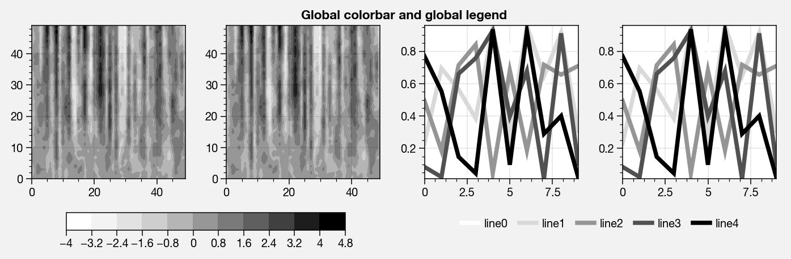

ProPlot changes the default axis formatter (i.e. the class used to
convert float numbers to tick label strings). The new formatter trims
trailing zeros by default, and can be used to *filter tick labels within
some data range*, as demonstrated below. See
`~proplot.axistools.ScalarFormatter` for details.

.. code:: ipython3

    import proplot as plot
    plot.nbsetup()
    locator = [0, 0.25, 0.5, 0.75, 1]
    plot.rc.linewidth = 2
    plot.rc.small = plot.rc.large = 12
    f, axs = plot.subplots(ncols=2, axwidth=2.5, share=0, subplotpad=0.5) # change subplotpad to change padding between subplots
    axs[1].format(xlocator=locator, ylocator=locator, xtickrange=[0,0.5], yticklabelloc='both', title='ProPlot formatter', titleweight='bold')
    axs[0].format(xlocator=locator, ylocator=locator, yticklabelloc='both', xformatter='scalar', yformatter='scalar', title='Matplotlib formatter', titleweight='bold')

.. image:: showcase/showcase_63_0.png
   :width: 544px
   :height: 224px

Datetime axes
-------------

Labelling datetime axes is incredibly easy with ProPlot. Pass a
time-unit string as the ``locator`` argument, and the axis will be
ticked at those units. Pass a ``(unit, interval)`` tuple to tick every
``interval`` ``unit``\ s. Use the ``formatter`` argument for `%-style
formatting of
datetime <https://docs.python.org/3/library/datetime.html#strftime-strptime-behavior>`__.
Again, see `~proplot.axistools.Locator` and
`~proplot.axistools.Formatter` for details.

.. code:: ipython3

    import proplot as plot
    import numpy as np
    plot.nbsetup()
    plot.rc.update(linewidth=2, small=9, large=10, ticklabelweight='bold',
                   figurefacecolor='w', facecolor=plot.shade('C0', 2.7), abcformat='BBBa')
    f, axs = plot.subplots(nrows=5, axwidth=8, aspect=(8,1), share=0, span=0, hspace=0.3)
    axs[0].format(xlim=(np.datetime64('2000-01-01'), np.datetime64('2001-01-02'))) # default date locator enabled if you plot datetime data or set datetime limits
    axs[1].format(xlim=(np.datetime64('2000-01-01'), np.datetime64('2001-01-01')),
                  xgridminor=True, xgrid=False,
                  xlocator='month', xminorlocator='weekday', xformatter='%B') # minor ticks every Monday, major every month
    axs[2].format(xlim=(np.datetime64('2000-01-01'), np.datetime64('2008-01-01')),
                  xlocator='year', xminorlocator='month', xformatter='%b %Y') # minor ticks every month
    axs[3].format(xlim=(np.datetime64('2000-01-01'), np.datetime64('2050-01-01')),
                  xlocator=('year', 10), xformatter='\'%y') # minor ticks every month
    axs[4].format(xlim=(np.datetime64('2000-01-01T00:00:00'), np.datetime64('2000-01-01T12:00:00')),
                  xlocator=('hour',range(0,24,2)), xminorlocator=('minute', range(0,60,10)), xformatter='T%H:%M:%S') # minor ticks every 10 minutes, major every 2
    axs.format(ylocator='null', suptitle='Datetime axis tick labelling with ProPlot')

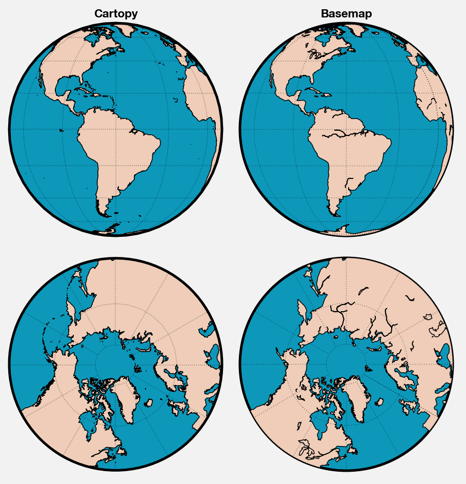

New axis scales
---------------

ProPlot adds several handy axis “scales” that can make axis coordinates
non-linear, like the builtin ``'log'`` scale. The axis scale can be
changed with `~proplot.axes.BaseAxes.format`.

The ``'inverse'`` scale is perfect for labeling spectral coordinates –
for example, wavenumber on one axis, wavelength on the opposite axis.
The ``'cutoff'`` scale is great when you have weirdly distributed data
(see `~proplot.axistools.CutoffScaleFactory`). The ``'sine'`` scale
scales the axis as the sine of the latitude – this is useful for getting
an area-weighted latitude coordinate. The ``'mercator'`` scale scales
the axis as with latitude in the Mercator projection.

See `~proplot.axes.XYAxes.smart_update` and
`~proplot.axistools.Scale` for details.

.. code:: ipython3

    import proplot as plot
    import numpy as np
    plot.nbsetup()
    plot.rc.update(ticklabelweight='normal', axeslabelweight='bold', titleweight='bold')
    f, axs = plot.subplots(ncols=2, width=6, share=0, span=0, wspace=0.7, left=0.6)
    n = 30
    x = np.linspace(-180,180,n)
    y = np.linspace(-85,85,n) # note sine just truncated values not in [-90,90], but Mercator transformation can reflect them
    y2 = np.linspace(-85,85,n) # for pcolor
    for i,(ax,scale,color) in enumerate(zip(axs,['mercator','sine'],['sky','coral'])):
        ax = axs[i-1]
        ax.plot(x, y, '-', color=color, lw=4)
        data = np.random.rand(len(x), len(y2))
        ax.pcolormesh(x, y2, data, cmap='grays', cmap_kw={'right': 0.8}) # use 'right' to trim the colormap from 0-1 color range to 0-0.8 color range
        ax.format(xlabel='x axis', ylabel='latitude', title=scale.title() + '-latitude y-axis', yscale=scale,
                  ytickloc='left', suptitle='Projection coordinate y-axes',
                  yformatter='deglat', grid=False,
                  xscale='linear', xlim=None, ylim=(-85,85))

.. image:: showcase/showcase_69_1.png
   :width: 540px
   :height: 282px

.. code:: ipython3

    import proplot as plot
    import numpy as np
    plot.nbsetup()
    # plot.rc.fontname = 'Verdana'
    f, axs = plot.subplots(width=6, nrows=4, aspect=(5,1),
                         hspace=0.5,
                         sharey=False, sharex=False)
    # Compression
    ax = axs[0]
    x = np.linspace(0,4*np.pi,1000)
    xticks = plot.arange(0,12,1.0)
    y = np.sin(x)
    y2 = np.cos(x)
    scales = [(3, np.pi), (0.3, 3*np.pi), (np.inf, np.pi, 2*np.pi), (5, np.pi, 2*np.pi)]
    titles = ('Zoom out of left', 'Zoom into left', 'Discrete cutoff', 'Fast jump')
    locators = [np.pi/3, np.pi/3, *([x*np.pi for x in plot.arange(0, 4, 0.25) if not (1 < x <= 2)] for i in range(2))]
    for ax,scale,title,locator in zip(axs,scales,titles,locators):
        ax.plot(x, y, lw=3, color='red orange')
        ax.plot(x, y2, lw=3, color='cerulean')
        ax.format(xscale=('cutoff', *scale), title=title,
                  xlim=(0,4*np.pi), ylabel='Wave amplitude', # note since 'spanning labels' turned on by default, only one label is drawn
                  xformatter='pi', xlocator=locator,
                  xtickminor=False, xgrid=True, ygrid=False, suptitle='Cutoff scale showcase')

.. image:: showcase/showcase_70_0.png
   :width: 540px
   :height: 580px

Map projection axes
===================

ProPlot isn’t just great for Cartesian-axis plotting. It also includes
seamless integration with the `cartopy` and `basemap` packages. See
`~proplot.subplots.subplots` and
`~proplot.axes.MapAxes.smart_update` for details. Note these features
are **optional** – if you don’t want to use them, you don’t need to have
`cartopy` or `basemap` installed.

Formatting map axes is just like formatting Cartesian axes: just pass
arguments like ``lonlim``, and ``lonlocator`` to
`~proplot.axes.BaseAxes.format`, as before.

Plotting geophysical data is also much easier. For basemap axes, you can
plot geophysical data by calling axes methods (e.g.
`~matplotlib.axes.Axes.contourf`, `~matplotlib.axes.Axes.plot`) as
usual – there is no need to directly reference the
``~mpl_toolkits.basemap.Basemap`` instance! For cartopy axes, you no
longer need to pass ``transform=crs.PlateCarree()`` to the plotting
command, as I found myself doing 99% of the time – this is the new
default. Declaring projections with cartopy is also much easier: now,
just like basemap, you can specify a native
`PROJ.4 <https://proj4.org/operations/projections/index.html>`__
projection name like ``'robin'`` or ``'merc'``, instead of referencing
the cumbersome `~cartopy.crs.Projection` classes directly.

Cartopy and basemap
-------------------

Why cartopy? Generally **cleaner integration** with matplotlib API; it’s
the way of the future. Why basemap? It still has some **useful
features**. While complex plotting algorithms like
`~matplotlib.axes.Axes.tricontourf` only work with cartopy, gridline
labels are only possible on equirectangular and Mercator projections.
Also, unfortunately, matplotlib’s
`~matplotlib.figure.Figure.tight_layout` method detects basemap
labels, but **does not detect cartopy labels** – so ProPlot has to
disable its own “tight layout” feature. I am currently looking for a
work-around.

Anyway, the below examples show how to plot geophysical data with
ProPlot. Note that longitudes are cyclically permuted so that the
“center” of your data aligns with the central longitude of the
projection! You can also use the ``globe`` keyword arg with commands
like `~matplotlib.axes.Axes.contourf` to ensure global data coverage.
These featuers are powered by the
`~proplot.axes.wrapper_cartopy_gridfix` and
`~proplot.axes.wrapper_basemap_gridfix` wrappers.

.. code:: ipython3

    import proplot as plot
    import numpy as np
    plot.nbsetup()
    # First make figure
    for globe in (False,True):
        f, axs = plot.subplots(ncols=2, nrows=2, width=7, hspace=0.2, wspace=0.3, top=0.5,
                               bottomcolorbars=True, bwidth=0.2, bottom=0.2,
                               proj='hammer', proj_kw={'lon_0':0},
                               # basemap=False,
                               basemap={(1,3):False, (2,4):True},
                               )
        offset = -40
        x = plot.arange(0+offset, 360+offset-1, 60)
        y = plot.arange(-60,60+1,30)
        data = np.random.rand(len(y), len(x))
        for ax,p,pcolor,basemap in zip(axs,range(4),[1,1,0,0],[0,1,0,1]):
            m = None
            cmap = ['sunset', 'sunrise'][basemap]
            levels = [0, .3, .5, .7, .9, 1]
            levels = np.linspace(0,1,11)
            if pcolor:
                m = ax.pcolor(x, y, data, levels=levels, cmap=cmap, extend='neither', globe=globe)
                ax.scatter(np.random.rand(5,5)*180, 180*np.random.rand(5,5), color='charcoal')
            if not pcolor:
                m = ax.contourf(x, y, data, levels=levels, cmap=cmap, extend='neither', globe=globe)
                ax.scatter(np.random.rand(5,5)*180, 180*np.random.rand(5,5), color='charcoal')
            ax.format(suptitle=f'Hammer projection with globe={globe}', collabels=['Cartopy', 'Basemap'], labels=True)
            if p<2:
                c = f.bottompanel[p].colorbar(m, clabel='values', ctickminor=False)

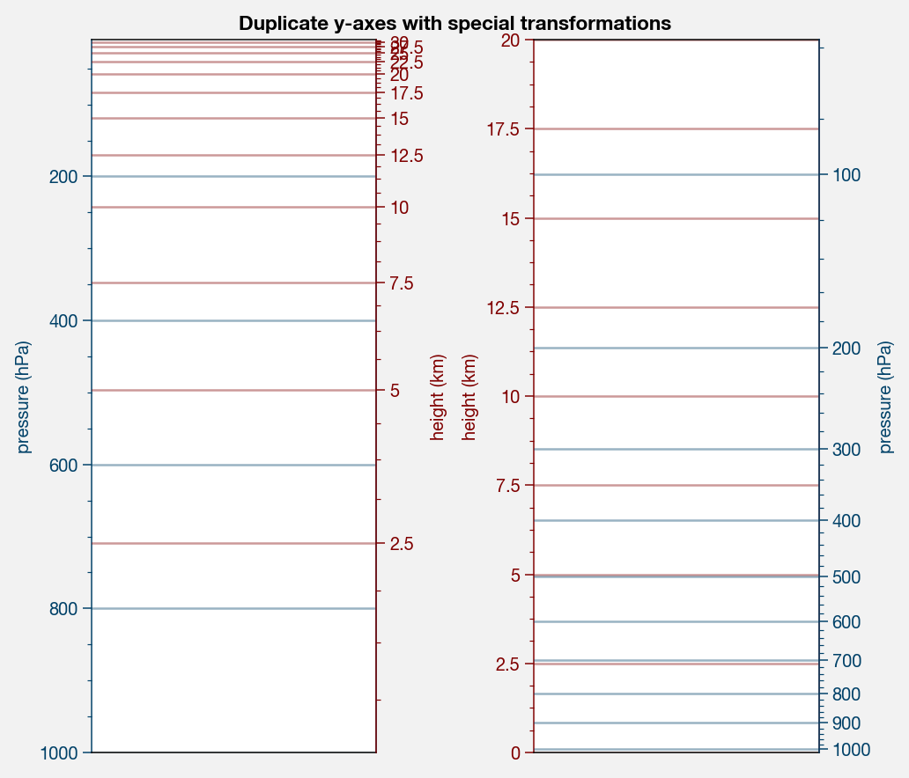

.. image:: showcase/showcase_75_2.png
   :width: 630px
   :height: 434px

.. code:: ipython3

    # Tricontour is only possible with cartopy! But also note, cartopy only
    # supports lat lon labels for Mercator and equirectangular projections.
    import proplot as plot
    plot.nbsetup()
    import numpy as np
    f, axs = plot.subplots(ncols=1, width=5, proj='merc', wspace=0.5, basemap=False,
                           rightcolorbar=True, rspace=1,
                           proj_kw={'lon_0':0}, top=0.4, left=0.4, right=0.2, bottom=0.2)
    axs.set_adjustable('box')
    ax = axs[0]
    np.random.seed(3498)
    x, y = np.random.uniform(size=(100, 2)).T
    z = np.exp(-x**2 - y**2)
    x = (x-0.5)*360
    y = (y-0.5)*180
    levels = np.linspace(0, 1, 100)
    cnt = ax.tripcolor(x, y, z, levels=levels, cmap='Turquoise')
    z = np.exp(-(x-10)**2 - (y+10)**2)
    ax.format(suptitle='Pros and cons', title='"Tight subplots" must be disabled when labels present',
              xlabels='b', ylabels='lr', xlocator=60, ylocator=20, latmax=90)
    f.rightpanel.colorbar(cnt, tickloc='left', formatter='%.2f', label='clabel')

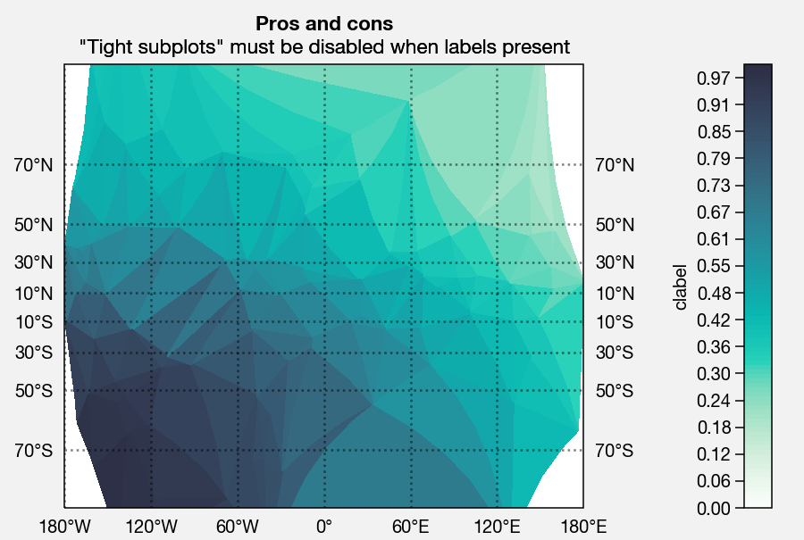

Geographic features
-------------------

To modify the projections, you can also pass keyword args to the
`~basemap.Basemap` and `~cartopy.crs.Projection` initializers with
the ``proj_kw`` keyword arg. Note that native
`PROJ.4 <https://proj4.org/operations/projections/index.html>`__ keyword
options are now accepted along with their more verbose cartopy aliases –
for example, you can use ``lon_0`` instead of ``central_longitude``. You
can also easily add and stylize geographic features (like coastlines,
land, country borders, and state borders), using the
`~proplot.axes.BaseAxes.format` method as before.

Again, see `~proplot.subplots.subplots` and
`~proplot.axes.MapAxes.smart_update` for details.

.. code:: ipython3

    import proplot as plot
    import numpy as np
    plot.nbsetup()
    f, axs = plot.subplots(ncols=2, nrows=2,
                           proj={(1,2):'ortho', (3,4):'npstere'},
                           basemap={(1,3):False, (2,4):True},
                           proj_kw={(1,2):{'lon_0':-60, 'lat_0':0}, (3,4):{'lon_0':-60, 'boundinglat':40}})
    axs.format(collabels=['Cartopy', 'Basemap'], suptitle='Geographic features with ProPlot')
    axs[0::2].format(reso='med', land=True, coast=True, landcolor='desert sand', facecolor='pacific blue', titleweight='bold', linewidth=2, labels=False)
    axs[1::2].format(land=True, coast=True, landcolor='desert sand', facecolor='pacific blue', titleweight='bold', linewidth=2, labels=False)

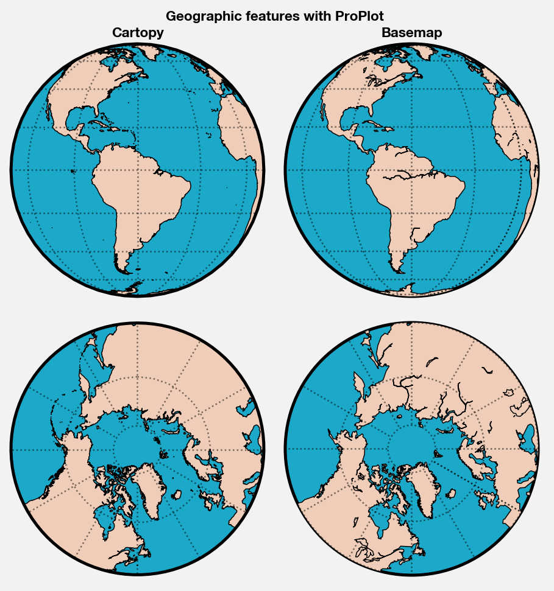

.. code:: ipython3

    import proplot as plot
    import numpy as np
    plot.nbsetup()
    N = 40
    f, axs = plot.subplots(axwidth=4, ncols=2, proj='robin', basemap={1:False, 2:True})
    axs.pcolormesh(np.linspace(-180,180,N+1), np.linspace(-90,90,N+1), np.random.rand(N,N), globe=True,
               cmap='grays', cmap_kw={'x':(0.3,0.9)}) # the 'x' argument truncates the colormap to within those bounds
    axs.format(collabels=['Cartopy', 'Basemap'], land=True, landcolor='jade',
               suptitle='More geographic features',
               borderscolor='w', coastcolor='w', innerborderscolor='w', # these are rc settings, without dots
               geogridlinewidth=1.5, geogridcolor='red', geogridalpha=0.8, # these are rc settings, without dots
               coast=True, innerborders=True, borders=True, labels=False) # these are "global" rc settings (setting names that dont' have dots)

.. image:: showcase/showcase_80_1.png
   :width: 814px
   :height: 245px

Tables of projections
---------------------

Next we produce tables of available cartopy and basemap projections. For
a nice table of full projection names, links to the
`PROJ.4 <https://proj4.org/operations/projections/index.html>`__
documentation, and their short-name keywords, see the `~proplot.projs`
documentation.

Many of the
`PROJ.4 <https://proj4.org/operations/projections/index.html>`__
projections are already included with cartopy, but ProPlot adds the
Aitoff, Hammer, Winkel Tripel, and Kavrisky VII projections by
subclassing their `~cartopy.crs.Projection` class (these may be
directly added to the cartopy package at some point). The available
cartopy projections are plotted below.

.. code:: ipython3

    import proplot as plot
    import numpy as np
    plot.nbsetup()
    projs = ['cyl', 'merc', 'mill', 'lcyl', 'tmerc',
             'robin', 'hammer', 'moll', 'kav7', 'aitoff', 'wintri', 'sinu',
             'geos', 'ortho', 'nsper', 'aea', 'eqdc', 'lcc', 'gnom', 'npstere', 'igh',
             'eck1', 'eck2', 'eck3', 'eck4', 'eck5', 'eck6']
    f, axs = plot.subplots(ncols=3, nrows=9, left=0.1, bottom=0.1, right=0.1, top=0.5, proj=projs)
    axs.format(land=True, reso='lo', labels=False, suptitle='Table of cartopy projections')
    for proj,ax in zip(projs,axs):
        ax.format(title=proj, title_kw={'weight':'bold'}, labels=False)

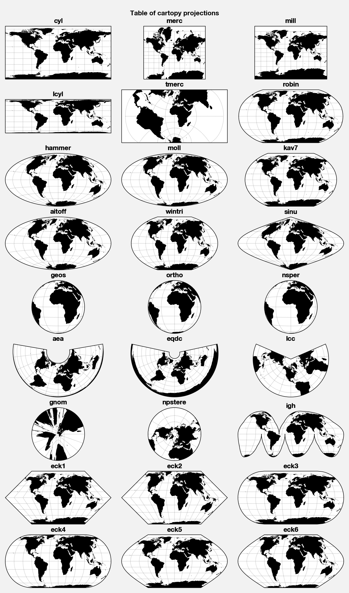

Basemap tends to prefer “rectangles” over their projections. The
available basemap projections are plotted below. Note that with the
default API, projection keyword args need to be specified explicitly or
an error is thrown – e.g. if you fail to specify ``lon_0`` or ``lat_0``.
To get around this, ProPlot supplies basemap with some default keyword
args if you don’t specify them.

.. code:: ipython3

    import proplot as plot
    import numpy as np
    plot.nbsetup()
    projs = ['cyl', 'merc', 'mill', 'cea', 'gall', 'sinu',
             'eck4', 'robin', 'moll', 'kav7', 'hammer', 'mbtfpq',
             'geos', 'ortho', 'nsper',
             'vandg', 'aea', 'eqdc', 'gnom', 'cass', 'lcc',
             'npstere', 'npaeqd', 'nplaea', 'spstere', 'spaeqd', 'splaea']
    f, axs = plot.subplots(ncols=3, nrows=9, left=0.1, bottom=0.1, right=0.1, top=0.5, basemap=True, proj=projs)
    axs.format(land=True, labels=False, suptitle='Table of basemap projections')
    for proj,ax in zip(projs,axs):
        ax.format(title=proj, title_kw={'weight':'bold'}, labels=False)

.. image:: showcase/showcase_85_1.png
   :width: 594px
   :height: 998px

Colormaps and colors
====================

Perceptually uniform colorspaces
--------------------------------

This package includes colormaps from several other projects (see below),
but also introduces some brand new colormaps. The new colormaps were
created by drawing lines across the “perceptually uniform” HCL
colorspace, or across its two variants: the HSL and HPL colorspaces. For
more info, check out `this page <http://www.hsluv.org/comparison/>`__.

You can generate your own cross-sections of these colorspaces with the
handy `~proplot.demos.colorspace_breakdown` function, as shown below.

.. code:: ipython3

    import proplot as plot
    plot.nbsetup()
    f = plot.colorspace_breakdown(luminance=50)

.. image:: showcase/showcase_89_1.png
   :width: 847px
   :height: 297px

.. code:: ipython3

    import proplot as plot
    plot.nbsetup()
    f = plot.colorspace_breakdown(chroma=60)

.. image:: showcase/showcase_90_1.svg

.. code:: ipython3

    import proplot as plot
    plot.nbsetup()
    f = plot.colorspace_breakdown(hue=0)

.. image:: showcase/showcase_91_1.svg

Use `~proplot.demos.cmap_breakdown` with any colormap to get a
depiction of how its colors vary in different colorspaces. The below
depicts the builtin “viridis” colormap and the new ProPlot “Fire”
colormap. We see that the “Fire” transitions are linear in HSL space,
while the “virids” transitions are linear in hue and luminance but
relatively non-linear in saturation.

.. code:: ipython3

    import proplot as plot
    plot.nbsetup()
    plot.cmap_breakdown('viridis')
    plot.cmap_breakdown('fire')

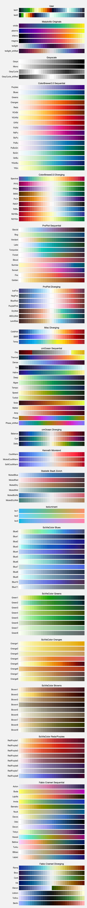

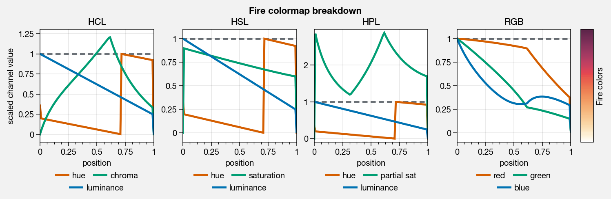

Table of colormaps
------------------

Use `~proplot.demos.cmap_show` to generate a table of registered
colormaps, as shown below.

The “User” section is automatically populated with colormaps saved to
your ``.proplot`` folder in the home directory (the “test1” and “test2”
maps were created from an example farther down). The other sections
break down the colormaps by category: original matplotlib maps, new
ProPlot maps belonging to the
`~proplot.colortools.PerceptuallyUniformColormap` class,
`ColorBrewer <http://colorbrewer2.org/>`__ maps (already included with
matplotlib), and maps from several other projects like
`SciVisColor <https://sciviscolor.org/home/colormoves/>`__ and
`cmOcean <https://matplotlib.org/cmocean/>`__. Many outdated colormaps
are removed, including the infamous ``'jet'`` map. Only the colormaps
with poor, perceptually un-uniform transitions were thrown out.

See `~proplot.axes.wrapper_cmap` and `~proplot.colortools.Colormap`
for usage details.

.. code:: ipython3

    import proplot as plot
    plot.nbsetup()
    f = plot.cmap_show(31)

.. image:: showcase/showcase_96_1.png
   :width: 436px
   :height: 4509px

Table of color cycles
---------------------

Use `~proplot.demos.cycle_show` to generate a table of registered
color cycles, as shown below.

These can be used for the matplotlib “property cycler” – that is, the
list of colors that `~matplotlib.axes.Axes.plot` loops through when
you call it without a ``color`` argument. Change the color cycler with
``plot.rc.cycle = name``, or by passing ``cycle=name`` to any plotting
command.

See `~proplot.axes.wrapper_cycle`, `~proplot.colortools.Cycle`, and
`~proplot.rcmod` for usage details.

.. code:: ipython3

    import proplot as plot
    plot.nbsetup()
    f = plot.cycle_show()

.. image:: showcase/showcase_99_0.png
   :width: 540px
   :height: 1615px

Table of colors
---------------

Use `~proplot.demos.color_show` to generate a table of registered
color names, as shown below.

ProPlot adds the below table. Colors in the first table are from the
`XKCD “color
survey” <https://blog.xkcd.com/2010/05/03/color-survey-results/>`__
(crowd-sourced naming of random HEX strings) and the list of `Crayola
crayon color
names <https://en.wikipedia.org/wiki/List_of_Crayola_crayon_colors>`__
(inspired by
`seaborn <https://seaborn.pydata.org/generated/seaborn.crayon_palette.html>`__).
Colors from these sources were filtered to be *sufficiently “distinct”
in the HCL perceptually uniform colorspace*. This makes it a bit easier
to pick colors from the table. Similar color names were also cleaned up
– for example, “reddish” and “reddy” were changed to “red”, and “bluish”
and “bluey” were changed to “blue”.

ProPlot also includes new colors from the `“Open
color” <https://www.google.com/search?q=opencolor+github&oq=opencolor+github&aqs=chrome..69i57.2152j0j1&sourceid=chrome&ie=UTF-8>`__
github project (the second table). These colors are used for website UI
design, but can also be useful for selecting colors for scientific
visualizations.

The native matplotlib `CSS4 named
colors <https://matplotlib.org/examples/color/named_colors.html>`__ are
still registered, but I encourage using the below table instead.

.. code:: ipython3

    import proplot as plot
    plot.nbsetup()
    f = plot.color_show(nbreak=13)

.. image:: showcase/showcase_102_0.png
   :width: 720px
   :height: 1316px

.. code:: ipython3

    import proplot as plot
    plot.nbsetup()
    f = plot.color_show(True)

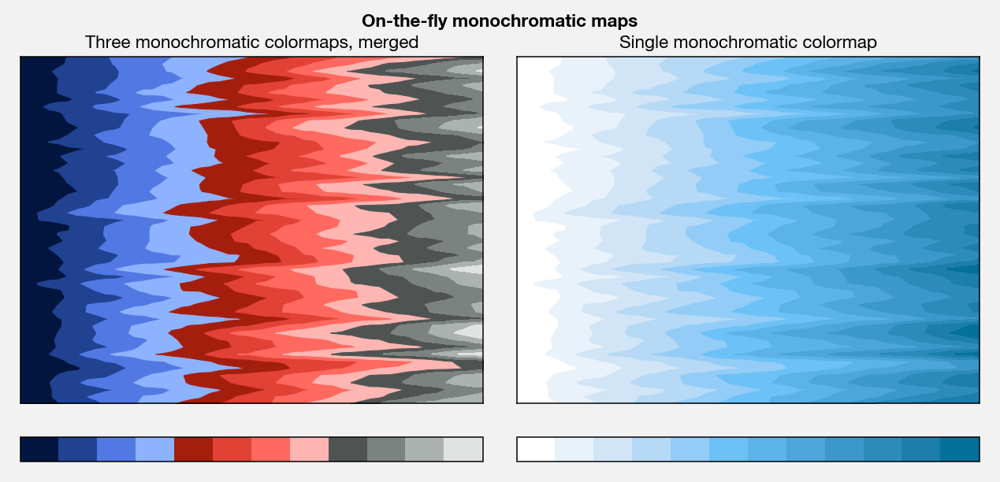

On-the-fly colormaps
--------------------

You can make a new colormap with ProPlot’s on-the-fly colormap
generator! Every ``cmap`` argument for the commands in the
`~proplot.axes.cmap_methods` list (like
`~matplotlib.axes.Axes.contourf` and
`~matplotlib.axes.Axes.pcolormesh`) is passed to the
`~proplot.colortools.Colormap` constructor, as are keyword args
specified with ``cmap_kw``. See `~proplot.colortools.Colormap` and
`~proplot.axes.wrapper_cmap` for details.

In the below example, monochromatic colormaps are built from registered
color names (this is done by varying the luminance channel from white to
that color). The first plot shows several of these maps merged into one,
and the second shows how the intensity of the “white” can be changed by
adding a number to the end of the color string.

.. code:: ipython3

    import proplot as plot
    import numpy as np
    plot.nbsetup()
    f, axs = plot.subplots(ncols=2, axwidth=3, aspect=(4,3), bottomcolorbars=True, bottom=0.1)
    data = np.random.rand(50,50).cumsum(axis=1)
    m = axs[0].contourf(data, cmap=('navy', 'brick red', 'charcoal'), cmap_kw={'reverse':[True]*3})
    f.bottompanel[0].colorbar(m, locator='null')
    m = axs[1].contourf(data, cmap='ocean blue100', cmap_kw={'reverse':False})
    f.bottompanel[1].colorbar(m, locator='null')
    axs.format(xticks='none', yticks='none', suptitle='On-the-fly monochromatic maps',
               collabels=('Three monochromatic colormaps, merged', 'Single monochromatic colormap'), collabelweight='normal')

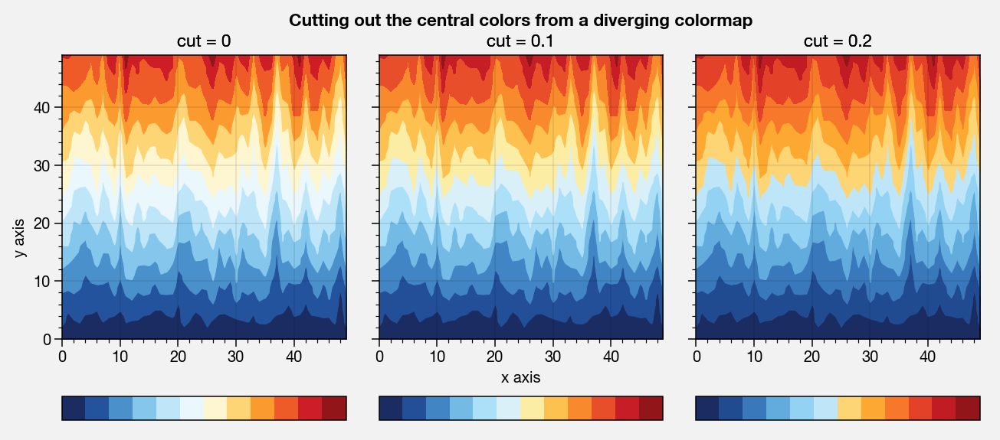

Diverging colormaps are easy to modify. Just use the ``cut`` argument to
`~proplot.colortools.Colormap`; this is great when you want to have a
sharper cutoff between negative and positive values for a diverging
colormap. Again, see `~proplot.axes.wrapper_cmap` for details.

.. code:: ipython3

    import proplot as plot
    import numpy as np
    plot.nbsetup()
    f, axs = plot.subplots(ncols=3, innercolorbars='b')
    data = np.random.rand(50,50).cumsum(axis=0) - 50
    for ax,cut in zip(axs,(0, 0.1, 0.2)):
        m = ax.contourf(data, cmap='ColdHot', cmap_kw={'cut':cut})
        ax.format(xlabel='x axis', ylabel='y axis', title=f'cut = {cut}',
                  suptitle='Cutting out the central colors from a diverging colormap')
        ax.bpanel.colorbar(m, locator='null')

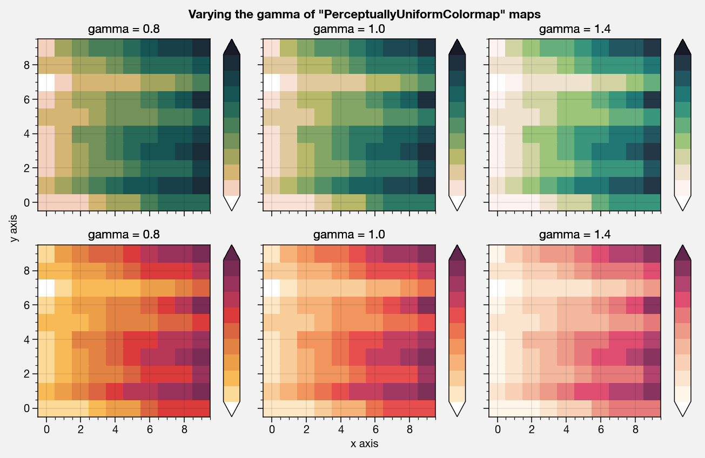

It is also easy to change the “gamma” of perceptually uniform colormap
on-the-fly. The “gamma” controls how the luminance and saturation
channels vary for a `~proplot.colortools.PerceptuallyUniformColromap`
map. A gamma larger than 1 emphasizes high luminance, low saturation
colors, and vice versa. Again, see `~proplot.axes.wrapper_cmap` for
details.

.. code:: ipython3

    import proplot as plot
    import numpy as np
    plot.nbsetup()
    f, axs = plot.subplots(ncols=3, nrows=2, innercolorbars='r', aspect=1)
    data = np.random.rand(10,10).cumsum(axis=1)
    i = 0
    for cmap in ('verdant','fire'):
        for gamma in (0.8, 1.0, 1.4):
            ax = axs[i]
            m1 = ax.pcolormesh(data, cmap=cmap, cmap_kw={'gamma':gamma}, levels=10, extend='both')
            ax.rightpanel.colorbar(m1, clocator='none')
            ax.format(title=f'gamma = {gamma}', xlabel='x axis', ylabel='y axis', suptitle='Varying the gamma of "PerceptuallyUniformColormap" maps')
            i += 1

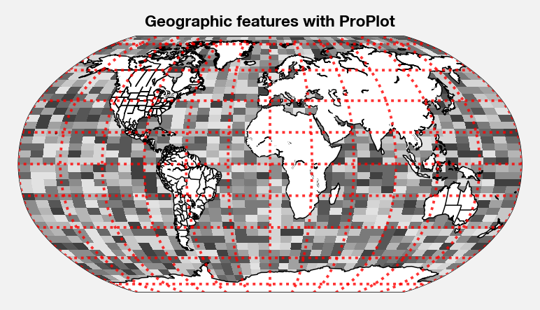

Since all of the SciVisColor colormaps from the “ColorMoves” GUI are
included, you can easily create SciVisColor-style merged colormaps with
ProPlot’s on-the-fly colormap generator! An example is below. The
resulting colormaps are saved to the ``.proplot`` folder in your home
directory by passing ``save`` to the `~proplot.colortools.Colormap`
constructor. All files in this folder will be loaded by ProPlot on
import.

.. code:: ipython3

    import proplot as plot
    import numpy as np
    plot.nbsetup()
    f, axs = plot.subplots(ncols=2, axwidth=2.5, bottomcolorbars=True, bottom=0.1)
    data = np.random.rand(100,100).cumsum(axis=1)
    # Make colormap, save as "test1.json"
    cmap = plot.Colormap('Green1_r', 'Orange5', 'Blue1_r', 'Blue6', name='test1', save=True)
    m = axs[0].contourf(data, cmap=cmap, levels=100)
    f.bottompanel[0].colorbar(m, clocator='none')
    # Make colormap, save as "test2.json"
    cmap = plot.Colormap('Green1_r', 'Orange5', 'Blue1_r', 'Blue6', ratios=(1,3,5,10), name='test2', save=True)
    m = axs[1].contourf(data, cmap=cmap, levels=100)
    f.bottompanel[1].colorbar(m, clocator='none')
    axs.format(xticks='none', yticks='none', suptitle='Merging existing colormaps',
               collabels=['Evenly spaced', 'Matching SciVisColor example'], collabelweight='normal')

.. image:: showcase/showcase_111_1.png
   :width: 544px
   :height: 334px

You can generate your own
`~proplot.colortools.PerceptuallyUniformColormap` on-the-fly by
passing a dictionary as the ``cmap`` keyword argument. This is powerd by
the `~proplot.colortools.PerceptuallyUniformColormap.from_hsl` static
method.

The ``h``, ``s``, and ``l`` arguments can be single numbers, lists of
numbers, or single/lists of color strings. In the latter case, the
corresponding channel value (hue, chroma, or luminance) for that color
will be looked up and applied. You can end any color string with ``+N``
or ``-N`` to offset the channel value by the number ``N``, as shown
below.

.. code:: ipython3

    import proplot as plot
    import numpy as np
    plot.nbsetup()
    f, axs = plot.subplots(ncols=2, innercolorbars='b', axwidth=3.5, aspect=1.5)
    ax = axs[0]
    m = ax.contourf(np.random.rand(10,10),
                   cmap={'h':['red-120', 'red+90'], 'c':[50, 70, 30], 'l':[20, 100], 'space':'hcl'},
                   levels=plot.arange(0.1,0.9,0.1), extend='both',
                   )
    ax.bpanel.colorbar(m, label='colormap')
    ax.format(xlabel='x axis', ylabel='y axis', title='Warm colors',
              suptitle='On-the-fly "PerceptuallyUniformColormap"s')
    ax = axs[1]
    m = ax.contourf(np.random.rand(10,10),
                   cmap={'h':['red', 'red-720'], 'c':[80,20], 'l':[20, 100], 'space':'hpl'},
                   levels=plot.arange(0.1,0.9,0.05), extend='both')
    ax.bpanel.colorbar(m, label='colormap', locator=0.1)
    ax.format(xlabel='x axis', ylabel='y axis', title='Reminiscent of "cubehelix"')

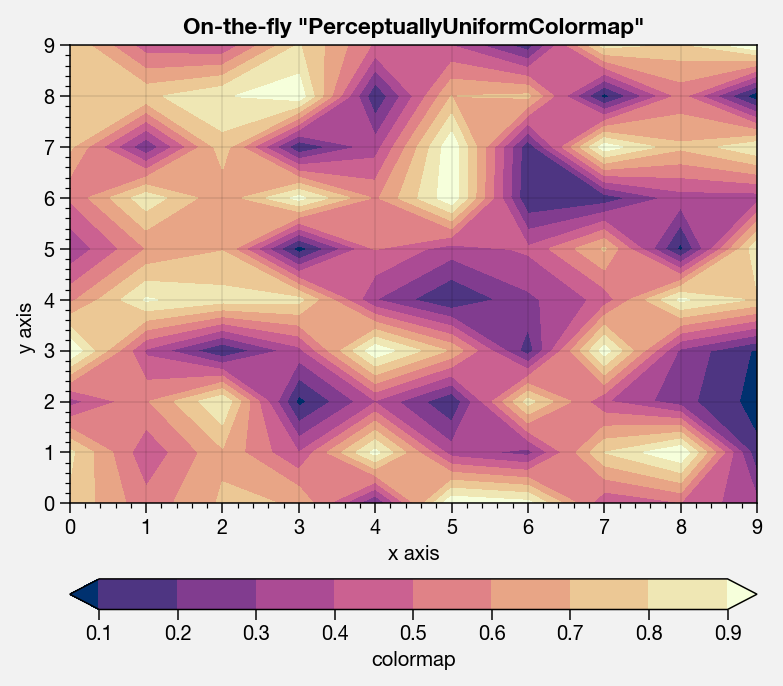

Flexible identification
-----------------------

All colormap names are now **case-insensitive** – this was done by
replacing the matplotlib colormap dictionary with an instance of the
magic `~proplot.colortools.CmapDict` class. You can also select
reversed diverging colormaps by their “reversed” name – for example,
``'BuRd'`` is equivalent to ``'RdBu_r'``.

.. code:: ipython3

    import proplot as plot
    import numpy as np
    plot.nbsetup()
    data = np.random.rand(10,10) - 0.5
    f, axs = plot.subplots(ncols=3, nrows=2, axwidth=1.6, aspect=1, innercolorbars='b', innercolorbars_kw={'hspace':0.2})
    for i,cmap in enumerate(('RdBu', 'BuRd', 'RdBu_r', 'DryWet', 'WetDry', 'WetDry_r')):
        ax = axs[i]
        m = ax.pcolormesh(data, cmap=cmap, levels=np.linspace(-0.5,0.5,11))
        ax.bottompanel.colorbar(m, locator=0.2)
        ax.format(xlocator='null', ylocator='null', title=cmap)
    axs.format(suptitle='Flexible naming specification for diverging colormaps')

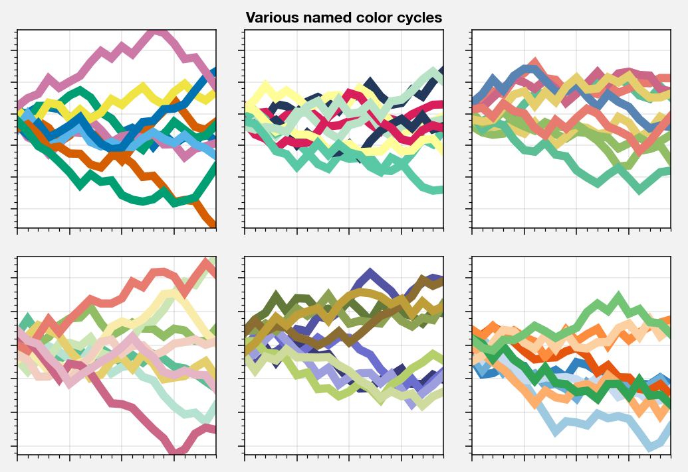

Changing the color cycle
------------------------

You can specify the color cycler by passing ``cycle`` to any plotting
command, or by changing the global default cycle with
``plot.rc.cycle = name``. Also note that colormaps and color cycles are
totally interchangeable! You can use a colormap as a color cycler, and
(though this isn’t recommended) vice versa.

See `~proplot.colortools.Cycle` and `~proplot.axes.wrapper_cycle`
for details.

.. code:: ipython3

    import proplot as plot
    import numpy as np
    plot.nbsetup()
    f, axs = plot.subplots(nrows=2, ncols=3, axwidth=1.5)
    for ax,cycle in zip(axs,('colorblind', 'field', 'qual1', 'qual2', 'set4', 'set5')):
        for i in range(10):
            ax.plot((np.random.rand(20) - 0.5).cumsum(), cycle=cycle, lw=5)
    axs.format(xformatter='none', yformatter='none', suptitle='Various named color cycles')

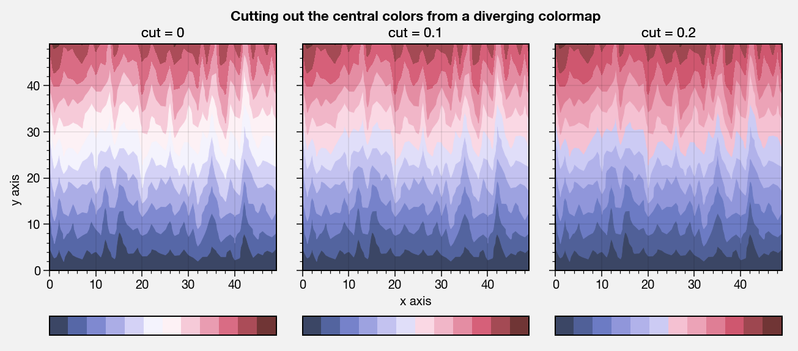

.. code:: ipython3

    import proplot as plot
    import numpy as np
    plot.nbsetup()
    f, axs = plot.subplots(ncols=2, bottomcolorbars=[1,2], span=False, axwidth=3, aspect=1.5)
    m = axs[0].pcolormesh(np.random.rand(20,20).cumsum(axis=1), cmap='set5', levels=np.linspace(0,11,21))
    f.bottompanel[0].colorbar(m, label='clabel', formatter='%.1f')
    lines = axs[1].plot(20*np.random.rand(10,10), cycle=('reds', 10), lw=5)
    axs.format(xlabel='xlabel', ylabel='ylabel', suptitle='Another colormap demo')
    axs[0].format(title='Color cycler as colormap')
    axs[1].format(title='Colormap as cycler, with "colorbar legend"')
    f.bottompanel[1].colorbar(lines, values=np.arange(0,len(lines)), label='clabel')

.. image:: showcase/showcase_119_1.png
   :width: 634px
   :height: 318px

Sampling cycles and colormaps
-----------------------------

If you want to draw an individual color from a smooth colormap or a
color cycle, use ``color=(cmapname, position)`` or
``color=(cyclename, index)`` with any command that accepts the ``color``
keyword! The ``position`` should be between 0 and 1, while the ``index``
is the index on the list of colors in the cycle. This feature is powered
by the `~proplot.colortools.ColorDictSpecial` class.

.. code:: ipython3

    import proplot as plot
    import numpy as np
    plot.nbsetup()
    f, axs = plot.subplots(nrows=3, aspect=(2,1), axwidth=4, innercolorbars='r', share=False)
    m = axs[0].pcolormesh(np.random.rand(10,10), cmap='thermal', levels=np.linspace(0, 1, 101))
    axs[0].rpanel.colorbar(m, label='colormap', locator=0.2)
    axs[0].format(title='The "thermal" colormap')
    l = []
    for idx in plot.arange(0, 1, 0.1):
        l += axs[1].plot((np.random.rand(20)-0.4).cumsum(), lw=5, color=('thermal', idx), label=f'idx {idx:.1f}')
    axs[1].rpanel.legend(l, ncols=1)
    axs[1].format(title='Colors from the "thermal" colormap')
    l = []
    idxs = np.arange(7)
    np.random.shuffle(idxs)
    for idx in idxs:
        l += axs[2].plot((np.random.rand(20)-0.4).cumsum(), lw=5, color=('ggplot', idx), label=f'idx {idx:.0f}')
    axs[2].rpanel.legend(l, ncols=1)
    axs[2].format(title='Colors from the "ggplot" color cycle')
    axs.format(xlocator='null', abc=True, abcpos='li', suptitle='Getting individual colors from colormaps and cycles')

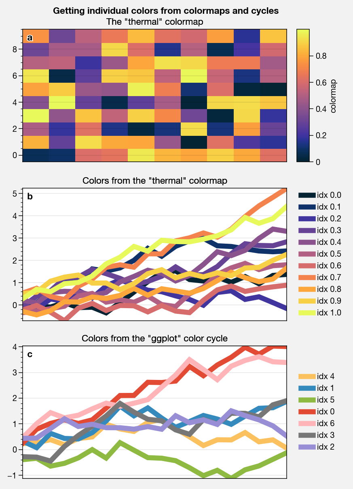

