APIS
====

Matplotlib has two APIs – the “pyplot” API (which is MATLAB-like), and
the “object-oriented” API (which is more “pythonic”, more clear, more
flexible, and you should consider using!). Contrary to the similar
names, this package is not meant to be a pyplot replacement – it adds to
the “object-oriented” API by subclassing matplotlib Artists classes,
like ``Axes`` and ``Figure``.

.. code:: ipython3

    import matplotlib.pyplot as plt
    plt.figure(figsize=(5,3))
    plt.plot(np.random.rand(10,10), lw=3)
    plt.title('PyPlot API (discouraged)')

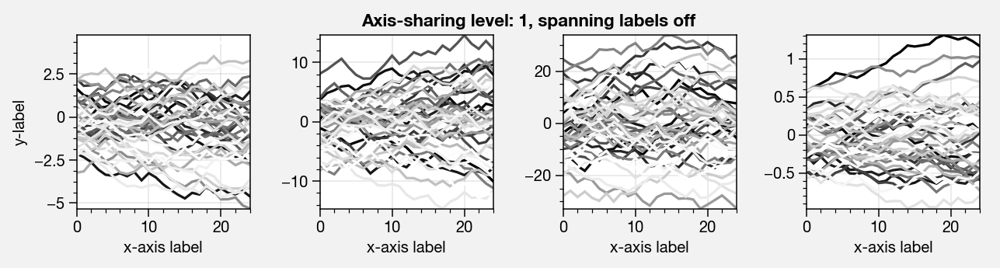

.. code:: ipython3

    import matplotlib.pyplot as plt
    f, ax = plt.subplots(figsize=(5,3))
    ax.plot(np.random.rand(10,10), lw=3)
    ax.set_title('Object-oriented API (recommended)')

.. image:: showcase/showcase_2_1.png
   :width: 450px
   :height: 270px

General
=======

The basics
----------

The ``subplots`` command is your gateway to all of ProPlot’s features.
Its usage is sort of like the ``pyplot`` version, but it is packed with
new features and generates a subclassed figure and specially subclassed
axes.

.. code:: ipython3

    f, ax = plot.subplots(width=2)
    f, ax = plot.subplots(ncols=3, nrows=2, width=5)

.. image:: showcase/showcase_6_0.png
   :width: 180px
   :height: 174px

.. image:: showcase/showcase_6_1.png
   :width: 450px
   :height: 303px

Complex subplot grids
---------------------

Set up a complex grid of subplots using a 2D array of integers – think
of the array as a “picture” of your figure. Order of numbers determines
order of a-b-c labels.

.. code:: ipython3

    # Arbitrarily complex array of subplots, with shared/spanning x/y axes detected automatically
    import proplot as plot
    import numpy as np
    plot.nbsetup()
    f, axs = plot.subplots([[1, 1, 2], [1, 1, 6], [3, 4, 4], [3, 5, 5]],
                           span=1, share=3, width=5)
    axs.format(suptitle='Complex subplot grid with axis-sharing + spanning labels', xlabel='time (seconds)', ylabel='temperature (K)', abc=True)
    axs[0].plot(2*(np.random.rand(100,5)-0.5).cumsum(axis=0), lw=2)

.. image:: showcase/showcase_9_1.png
   :width: 450px
   :height: 543px

A smarter “tight layout”
------------------------

With ProPlot, you will always get just the right amount of spacing
between subplots so that elements don’t overlap, and just the right
amount of space around the figure edge so that labels and whatnot are
not cut off. Furthermore, despite all of the complex adjustments this
requires, the original subplot aspect ratios are **always preserved**.
Even when inner panels are present, the main subplot aspect ratios will
stay fixed (see below for more on panels).

You can disable this feature by passing ``tight=False`` to ``subplots``,
but it is unbelievably useful. It works by scaling either the figure
width or height dimension (whichever one you didn’t specify) such that
the subplot aspect ratios will not change, and by taking advantage of
ProPlot’s subplot layout restrictions. The below examples demonstrate
its power.

.. code:: ipython3

    import proplot as plot
    plot.nbsetup()
    f, axs = plot.subplots(nrows=3, ncols=3, aspect=1, axwidth=1, share=0, span=0, tight=False)
    axs[4].format(ylabel='ylabel', xlabel='xlabel', title='title\ntitle\ntitle', suptitle='Without tight subplots')

.. image:: showcase/showcase_12_0.png
   :width: 382px
   :height: 373px

.. code:: ipython3

    import proplot as plot
    plot.nbsetup()
    f, axs = plot.subplots(nrows=3, ncols=3, aspect=1, axwidth=1.2, share=0, span=0)
    axs[4].format(ylabel='ylabel', xlabel='xlabel', title='title\ntitle\ntitle', suptitle='With tight subplots')

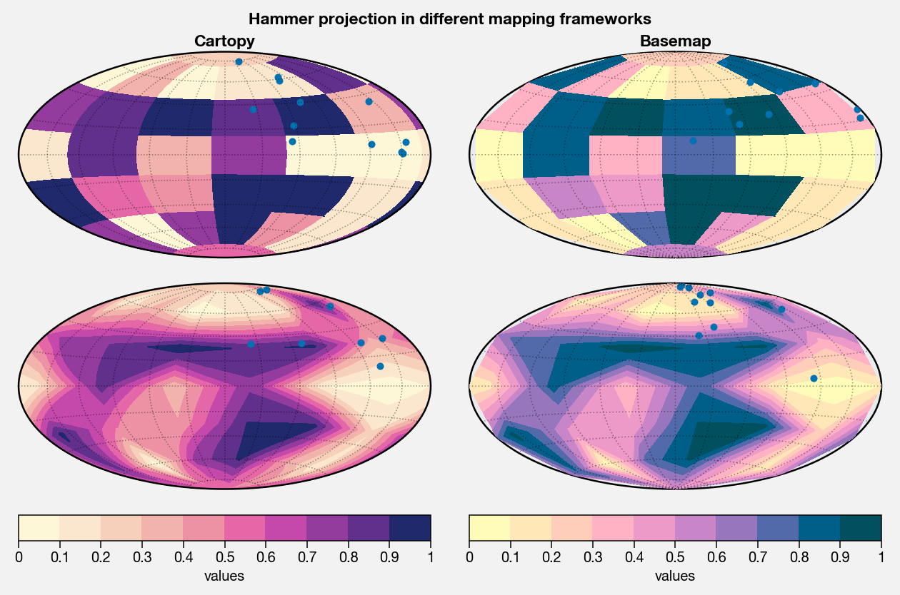

.. code:: ipython3

    import proplot as plot
    plot.nbsetup()
    f, axs = plot.subplots([[1,2],[3,2],[3,4]], share=0, span=0, axwidth=1.5)
    axs[0].format(xlabel='xlabel\nxlabel\nxlabel', title='Title', suptitle='Super title')
    axs[1].format(ylabel='ylabel\nylabel', xformatter='null', yticklabelloc='both')
    axs[2].format(yformatter='null', title='Title', ytickloc='both')
    axs[3].format(yformatter='null', xlabel='xlabel\nxlabel\nxlabel')

.. image:: showcase/showcase_14_0.png
   :width: 364px
   :height: 557px

.. code:: ipython3

    f, axs = plot.subplots(axwidth=3, ncols=2, span=False, share=0, innerpanels='lr', inner_kw={'rshare':False}, innertight=False)
    axs.format(ylabel='ylabel', xlabel='xlabel')
    axs[0].rpanel.format(ylabel='ylabel', ytickloc='right', yticklabelloc='right', suptitle='Super title', collabels=['Column 1', 'Column 2'])

.. image:: showcase/showcase_15_0.png
   :width: 634px
   :height: 214px

Adding labels, titles, etc.
---------------------------

Use the ``format`` command to set up your ticks, axis labels, and more!
The special ``axes_list`` class lets you call any method, including
``format``, on every axes in the ``axes_list`` returned by ``subplots``
**simultaneously**. To change any ``rc`` setting, either builtin or
custom to ProPlot (see the quick start), just pass it to ``format``. If
the setting has dots, simply omit them – for example, the ProPlot custom
settings ``title.pos`` and ``title.weight`` can be changed with
``titleweight='bold'`` and ``titlepos='ci'``.

.. code:: ipython3

    import proplot as plot
    plot.nbsetup()
    f, axs = plot.subplots(ncols=2, nrows=2, axwidth=2.2, share=False, span=False)
    axs.format(xlabel='x-axis', ylabel='y-axis', xlim=(0,10), xlocator=2,
              ylim=(0,4), ylocator=plot.arange(0,4), yticklabels=('a', 'bb', 'ccc', 'dd', 'e'),
              title='Inner title', titlepos='ci', suptitle='Super title',
              abc=True, abcpos='il', abcformat='a.',
              ytickloc='both', yticklabelloc='both', ygridminor=True, xtickminor=False,
              linewidth=1, collabels=['Column label 1', 'Column label 2'], rowlabels=['Row label 1', 'Row label 2'])

.. image:: showcase/showcase_18_0.png
   :width: 490px
   :height: 397px

.. code:: ipython3

    import proplot as plot
    import numpy as np
    plot.nbsetup()
    # A bunch od different ways to update settings
    plot.rc.linewidth = 1.2
    plot.rc.update({'fontname': 'DejaVu Sans'})
    plot.rc['figure.facecolor'] = 'w'
    plot.rc.axes_facecolor = '#eeeeee' # underscore replaces the "dot"!
    # Make plot
    f, axs = plot.subplots(nrows=1, ncols=2, aspect=1, width=6,
                           span=0, wspace=0.5, sharey=2, hspace=0.7)
    N, M = 100, 6
    values = np.arange(1,M+1)
    for i,ax in enumerate(axs):
        plot.rc.cycle = ['C0','C1',6]
        data = np.cumsum(np.random.rand(N,M)-0.5, axis=0)
        lines = ax.plot(data, linewidth=2)
    axs.format(ytickloc='both', ycolor='blue7', hatch='xxx',
               xlabel='x label', ylabel='y label',
               yticklabelloc='both',
               suptitle='Set temporary rc settings')
    ay = axs[-1].twinx()
    ay.format(ycolor='r', ylabel='secondary axis')
    ay.plot((np.random.rand(100)-0.2).cumsum(), color='r', lw=2)

.. image:: showcase/showcase_19_1.png
   :width: 540px
   :height: 266px

Colorbars and legends
---------------------

I’ve added several new features to the ``ax.legend`` method, and created
a new ``ax.colorbar`` method. The latter draws a smaller colorbar
**inside** the axes, sort of like a legend. A demonstration is below.

.. code:: ipython3

    import proplot as plot
    import numpy as np
    plot.nbsetup()
    f, ax = plot.subplots(bottompanel=True, tight=1)
    m = ax.contourf((np.random.rand(20,20)).cumsum(axis=0), extend='both', levels=np.linspace(0,10,11), cmap='glacial')
    ax.format(xlabel='xlabel', ylabel='ylabel', xlim=(0,19), ylim=(0,19))
    ax.colorbar(m, ticks=2, label='inset colorbar')
    ax.colorbar(m, ticks=2, loc='lower left')
    f.bottompanel.colorbar(m, label='standard outer colorbar', length=0.9)
    ax.format(title='Title')

.. image:: showcase/showcase_22_0.png
   :width: 256px
   :height: 317px

.. code:: ipython3

    import proplot as plot
    import numpy as np
    plot.nbsetup()
    labels = ['a', 'bb', 'ccc', 'dddd', 'eeeee', 'ffffff']
    f, axs = plot.subplots(ncols=2, bottomlegends=True, span=False, share=0)
    hs = []
    for i,label in enumerate(labels):
        hs += axs.plot(np.random.rand(20), label=label, lw=2)[0]
    axs[0].legend(order='F', frameon=True, loc='lower left')
    f.bpanel[0].legend(hs, ncols=4, align=True, frameon=True)
    f.bpanel[1].legend(hs, ncols=4, align=False)
    axs.format(ylim=(-0.1, 1.1), xlabel='xlabel', ylabel='ylabel',
               suptitle='Demo of new legend options',
               collabels=['Inner legend, outer aligned legend', 'Outer un-aligned legend'], collabelweight='normal')

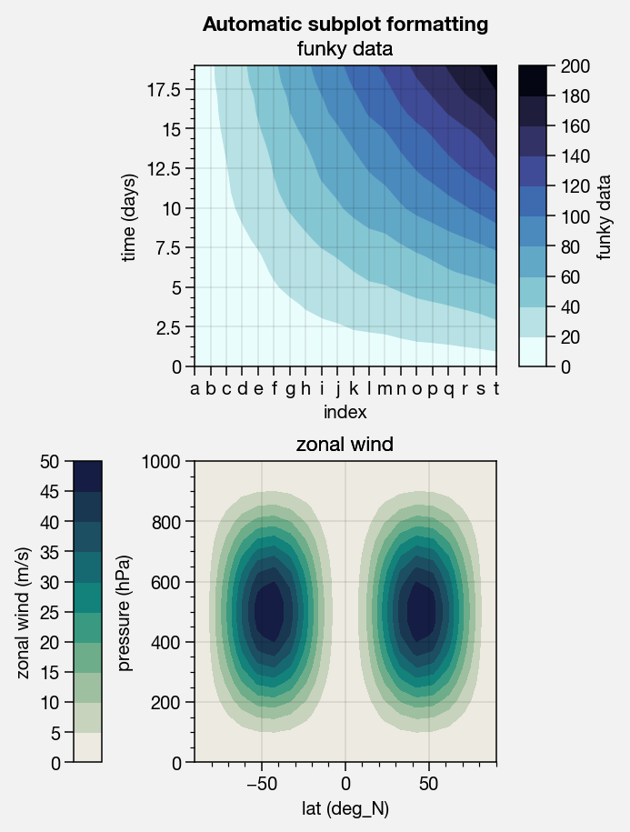

One particularly useful new ``colorbar`` feature is that, instead of
passing a “mappable”, you can alternatively pass a list of objects with
``get_color`` methods or a list of color strings/RGB tuples. A colorbar
will be constructed from the corresponding colors!

.. code:: ipython3

    f, ax = plot.subplots(bcolorbar=True)
    plot.rc.cycle = 'qual2'
    hs = ax.plot((np.random.rand(12,12)-0.3).cumsum(axis=0), lw=4)
    ax.format(suptitle='Colorbar from line handles')
    f.bpanel.colorbar(hs, values=np.arange(0,12), label='Use a colorbar to label lines that\nmap to physical values!')

.. image:: showcase/showcase_25_1.png
   :width: 256px
   :height: 327px

Enhanced plotting methods
-------------------------

Now, ``pcolor`` and ``pcolormesh`` accept a ``levels`` argument, just
like ``contourf``. This was previously really tricky to implement.
Discrete levels can be better for scientific visualization, because it
is easier to map colors to particular numbers with your eye.

.. code:: ipython3

    f, axs = plot.subplots(ncols=2, innercolorbars='b')
    data = np.random.rand(30,30)*40
    ax = axs[0]
    m = ax.pcolormesh(data, levels=np.arange(0,40,0.2), cmap='temperature')
    ax.format(title='Pcolor without discernible levels', suptitle='Pcolor demo')
    ax.bpanel.colorbar(m, locator=5)
    ax = axs[1]
    m = ax.pcolormesh(data, levels=plot.arange(0,40,5), cmap='temperature')
    ax.format(title='Pcolor plot with levels')
    ax.bpanel.colorbar(m, locator=5)

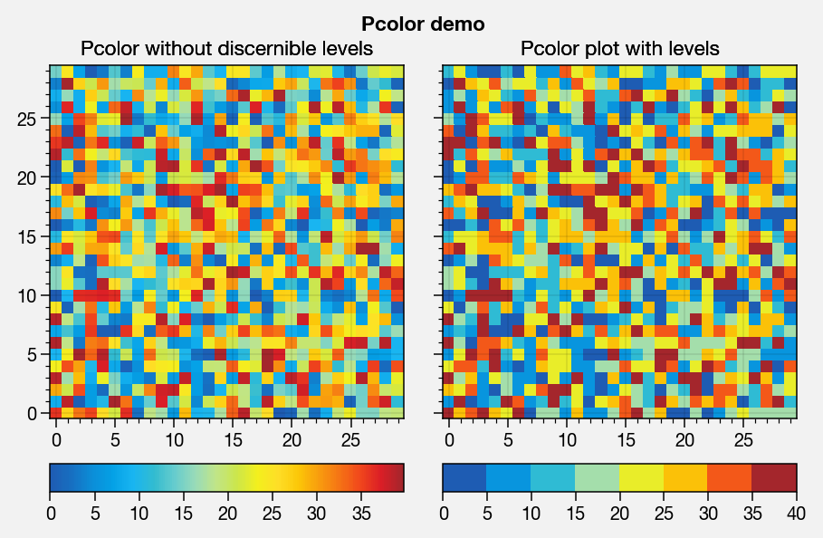

I’ve also added a ``cmap`` option to the ``plot`` command – this lets
you draw line collections that map individual segments of the line to
individual colors. This can be useful for drawing “parametric” plots,
where you want to indicate the time (or some other coordinate) at each
point on the line.

.. code:: ipython3

    import proplot as plot
    import numpy as np
    plot.nbsetup()
    # Make a pretty spiral
    N = 12
    values = np.arange(1, N+1)
    radii = np.linspace(1,0.2,N)
    angles = np.linspace(0,4*np.pi,N)
    # Figure
    f, axs = plot.subplots(innercolorbars='b', ncols=2, wspace=0.35, aspect=1, axwidth=2.2, bwidth=0.8, span=False)
    cmaps = [('blues', 'reds'), 'golden']
    multipliers = [1.2, 1.4]
    for i,(ax,cmap) in enumerate(zip(axs,cmaps)):
        x = radii*np.cos(multipliers[i]*angles)
        y = radii*np.sin(multipliers[i]*angles)
        m = ax.plot(x, y, cmap=cmap, values=values+i*12,
                    linewidth=15, interp=1-i, cmap_kw={'left':i*0.05})
        ax.format(xlim=(-1,1), ylim=(-1,1), suptitle='Lines with smooth colormap gradations',
                  xlabel='cosine angle', ylabel='sine angle', title=f'Parametric plot #{i+1}')
        ax.bpanel.colorbar(m, locator=None, label=f'line {i+1}')

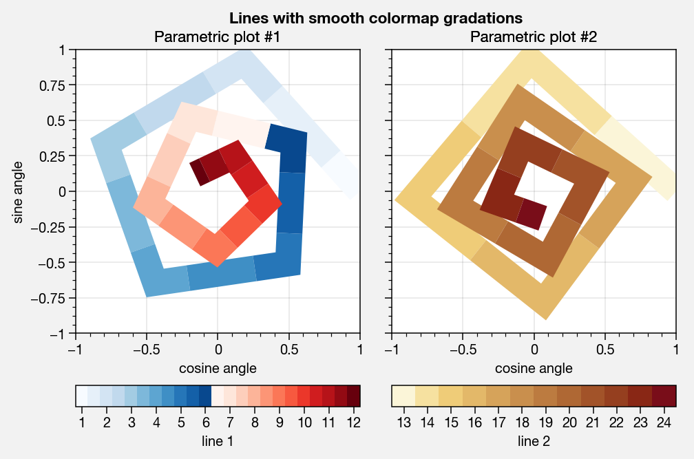

Inner panels, colorbars
-----------------------

I often want “panels” that represent averages across dimensions of a
main subplot, or some secondary 1-dimensional dataset. This is hard to
do with matplotlib by default, but easy with ProPlot! You can specify
arbitrary combinations of inner panels for specific axes, and ProPlot
will always keep the subplots aligned.

.. code:: ipython3

    # Arbitrarily complex combinations are possible, and inner spaces still determined automatically
    f, axs = plot.subplots(axwidth=2, nrows=2, ncols=2,
                           inner={1:'t', 2:'l', 3:'b', 4:'r'}, inner_kw={'flush':False}, innerpad=0.001,
                           tight=1, innertight=1, share=0, span=0, wratios=[1,2])
    axs.format(title='Title', suptitle='This is a super title', collabels=['Column 1','Column 2'],
               titlepos='ci', xlabel='xlabel', ylabel='ylabel', abc=True, top=False)
    axs.format(ylocator=plot.arange(0.2,0.8,0.2), xlocator=plot.arange(0.2,0.8,0.2))

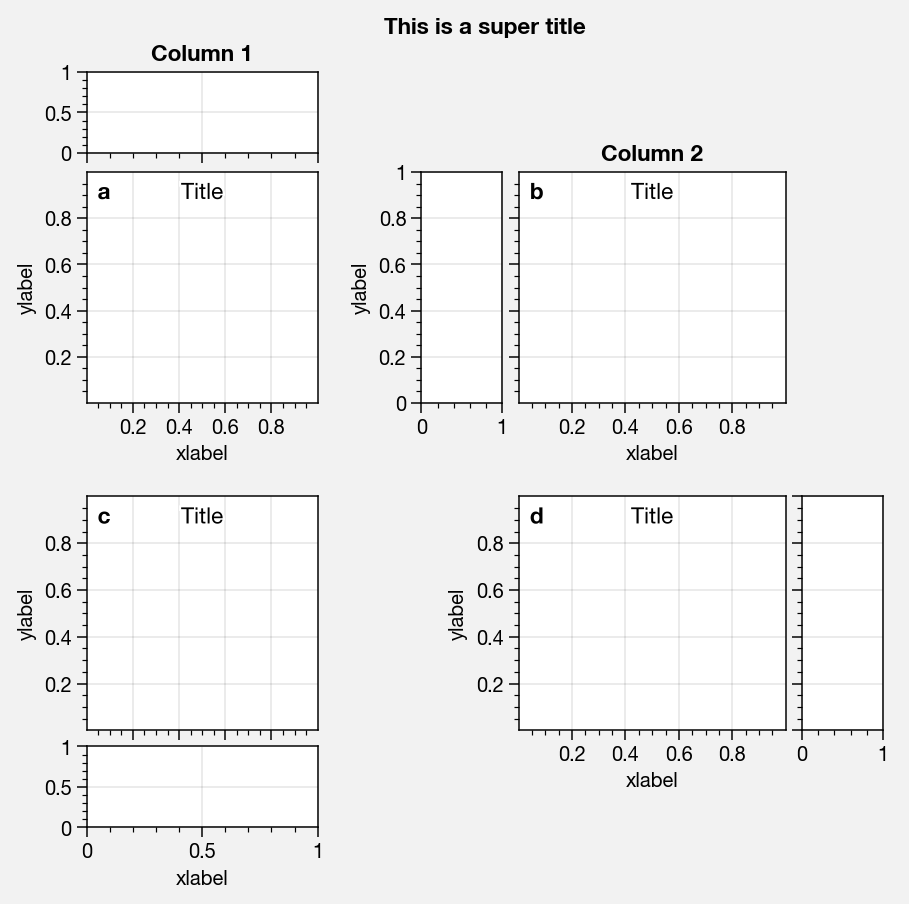

If you want “colorbar” panels, the simplest option is to use
``innercolorbars`` instead of ``innerpanels``. This makes the width of
the panels more appropriate for filling with a colorbar. You can modify
these default spacings with a custom ``.proplotrc`` file (see
documentation).

If you want panels “flush” against the subplot, simply use the ``flush``
keyword args. If you want to disable “axis sharing” with the parent
subplot (i.e. you want to draw tick labels on the panel, and do not want
to inherit axis limits from the main subplot), use any of the ``share``
keyword args.

.. code:: ipython3

    import proplot as plot
    import numpy as np
    plot.nbsetup()
    f, axs = plot.subplots(axwidth=2, nrows=2, ncols=2, share=0, span=False, innerpad=0.1, innertight=True,
                           innerpanels='r', innercolorbars='b', inner_kw={'rshare':False, 'rflush':True})
    axs.format(xlabel='xlabel', ylabel='ylabel', suptitle='This is a super title')
    for i,ax in enumerate(axs):
        ax.format(title=f'Dataset {i+1}')
    data = (np.random.rand(20,20)-0.1).cumsum(axis=1)
    m = axs.contourf(data)[0]
    axs.rpanel.plot(data.mean(axis=1), np.arange(20), color='k')
    axs.rpanel.format(title='Mean')
    axs.bpanel.colorbar(m, label='cbar')

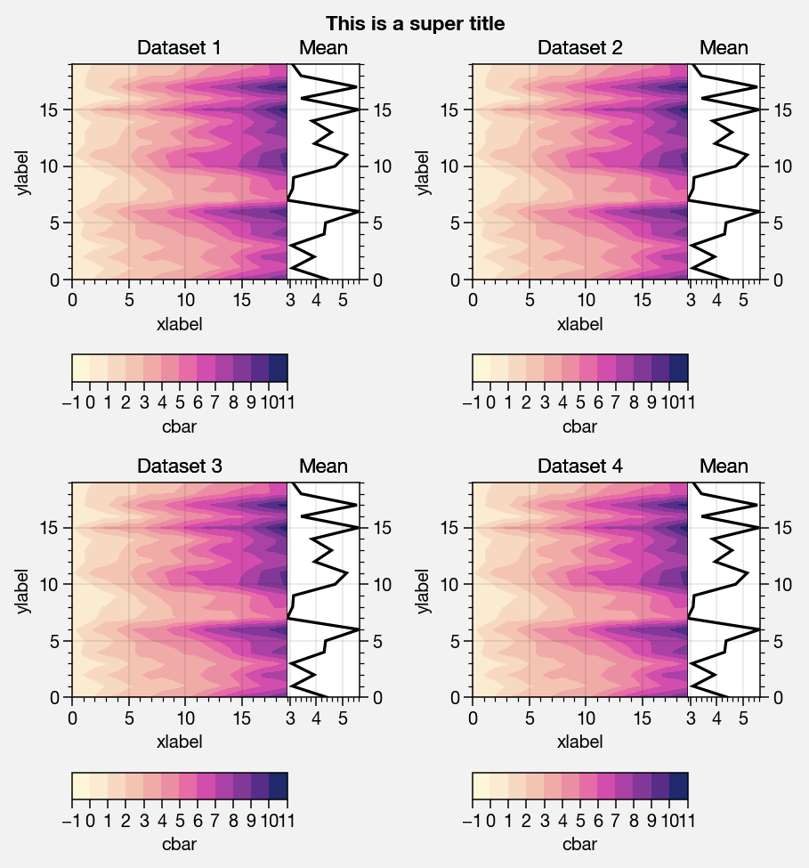

Outer panels, colorbars
-----------------------

It is also common to need “global” colorbars or legends, meant to
reference multiple subplots at once. This is easy to do with ProPlot
too! These “global” colorbars can extend across every row and column of
the subplot array, or across arbitrary contiguous rows and columns.
Refer to panel attributes with their full names (“bottompanel”,
“toppanel”, “leftpanel”, and “rightpanel”), or with their shorthands
(“bpanel”, “lpanel”, “rpanel”, or “tpanel”).

.. code:: ipython3

    f, axs = plot.subplots(ncols=3, nrows=3, axwidth=1, bottompanels=[1,2,2], rightpanel=True)
    m = axs.pcolormesh(np.random.rand(20,20), cmap='grays', levels=np.linspace(0,1,11), extend='both')[0]
    axs.format(suptitle='Super title', abc=True, abcpos='ol', abcformat='a.', xlabel='xlabel', ylabel='ylabel')
    f.bpanel[0].colorbar(m, label='label', ticks=0.5)
    f.bpanel[1].colorbar(m, label='label', ticks=0.2)
    f.rpanel.colorbar(m, label='label', ticks=0.1, length=0.7)

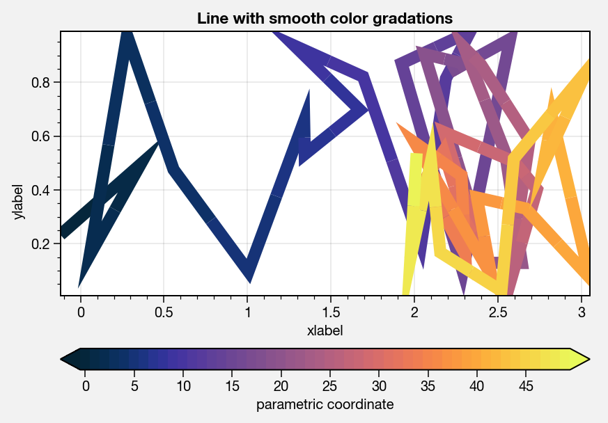

.. code:: ipython3

    import proplot as plot
    import numpy as np
    plot.nbsetup()
    f, axs = plot.subplots(ncols=4, axwidth=1.5, bottomcolorbars=[1,1,2,2], rightpanel=True, share=0, span=0, wspace=0.3)
    data = (np.random.rand(50,50)-0.1).cumsum(axis=0)
    m = axs[:2].contourf(data, cmap='grays', extend='both')
    cycle = plot.Cycle('grays', 5)
    hs = []
    for abc,color in zip('ABCDEF',cycle):
        hs += axs[2:].plot(np.random.rand(10), lw=3, color=color, label=f'line {abc}')[0]
    f.bottompanel[0].colorbar(m, length=0.8, label='label')
    f.bottompanel[1].legend(hs, ncols=5, align=True)
    f.rightpanel.legend(hs, ncols=1)
    axs.format(suptitle='Global colorbar and global legend', abc=True, abcpos='ol', abcformat='A',
              collabels=['2D dataset #1', '2D dataset #2', 'Line set #1', 'Line set #2'], collabelweight='normal')

.. image:: showcase/showcase_39_0.png
   :width: 775px
   :height: 261px

Helvetica as the default font
-----------------------------

Helvetica is the MATLAB default, but matplotlib does not come packaged
with it and defaults to a font called “DejaVu Sans”. ProPlot adds back
Helvetica and makes it the default.

In my opinion, Helvetica is much more professional-looking than the
DejaVu Sans. You can change the default font by modifying your
``.proplotrc`` (see documentation).

.. code:: ipython3

    import proplot as plot
    plot.nbsetup()
    plot.rc['small'] = plot.rc['large'] = 10
    plot.rc['fontname'] = 'Helvetica'
    f, axs = plot.subplots(ncols=4, nrows=3, share=False, span=False,
                           axwidth=2.0, aspect=0.85, wspace=0.5, hspace=0.5)
    # options = ['ultralight', 'light', 'normal', 'regular', 'book', 'medium', 'roman',
    #            'semibold', 'demibold', 'demi', 'bold', 'heavy', 'extra bold', 'black',
    #            'italic', 'oblique'] # remove redundancies below
    options = ['ultralight', 'light', 'normal', 'medium', 'demi', 'bold', 'extra bold', 'black']
    fonts = ['Helvetica', 'Helvetica Neue', 'DejaVu Sans', 'Bitstream Vera Sans', 'Verdana', 'Tahoma',
             'Arial', 'Geneva', 'Times New Roman', 'Palatino', 'Inconsolata', 'Myriad Pro'] #Comic Sans MS', 'Myriad Pro']
    for ax,font in zip(axs,fonts):
        plot.rc['fontname'] = font
        math  = r'$\alpha\beta + \gamma\delta \times \epsilon\zeta \cdot \eta\theta$'
        math += ('\n' + r'$\Sigma\kappa\lambda\mu\pi\rho\sigma\tau\psi\phi\omega$')
        ax.text(0.5, 0, math + '\n' + 'The quick brown fox\njumps over the lazy dog.\n0123456789\n!@#$%^&*()[]{};:,./?',
                weight='normal', ha='center', va='bottom')
        ax.format(xlabel='xlabel', ylabel='ylabel', suptitle='Table of font names')
        for i,option in enumerate(options):
            if option in ('italic', 'oblique'):
                kw = {'style':option, 'weight':'normal'} # otherwise defaults to *lightest* one!
            elif option in ('small-caps',):
                kw = {'variant':option}
            else:
                kw = {'weight':option}
            kw.update({'stretch':'normal'})
            ax.text(0.03, 0.97 - (i*1.2*(plot.rc['small']/72)/ax.height), f'{option}', ha='left', va='top', **kw)
            ax.text(0.97, 0.97 - (i*1.2*(plot.rc['small']/72)/ax.height), f'{font[:14].strip()}',   ha='right', va='top', **kw)

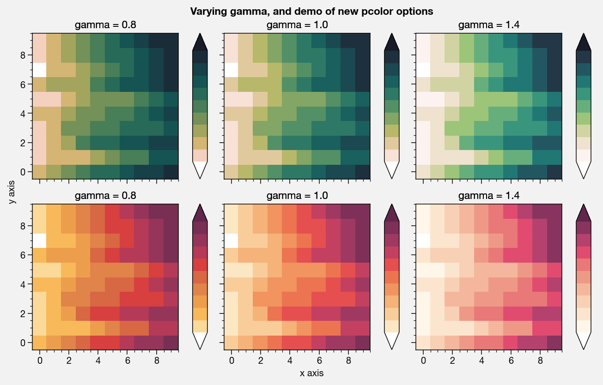

Cartesian axes
==============

Limiting redundancy
-------------------

Matplotlib has an “axis sharing” feature – but all this can do is hold
the axis limits the same. ProPlot introduces **4 axis-sharing
“levels”**, as demonstrated below. It also introduces a new
**axis-spanning label** feature, as seen below.

.. code:: ipython3

    import proplot as plot
    import numpy as np
    plot.nbsetup()
    N = 50
    M = 40
    colors = plot.colors('grays_r', M, x=(0.1, 0.8))
    for share in (0,1,2,3):
        f, axs = plot.subplots(ncols=4, aspect=1, wspace=0.5, axwidth=1.2, sharey=share, spanx=share//2)
        gen = lambda scale: scale*(np.random.rand(N,M)-0.5).cumsum(axis=0)[N//2:,:]
        for ax,scale,color in zip(axs,(1,3,7,0.2),('gray9','gray7','gray5','gray3')):
            array = gen(scale)
            for l in range(array.shape[1]):
                ax.plot(array[:,l], color=colors[l])
            ax.format(suptitle=f'Axis-sharing level: {share}, spanning labels {["off","on"][share//2]}', ylabel='y-label', xlabel='x-axis label')

.. image:: showcase/showcase_46_0.png
   :width: 643px
   :height: 166px

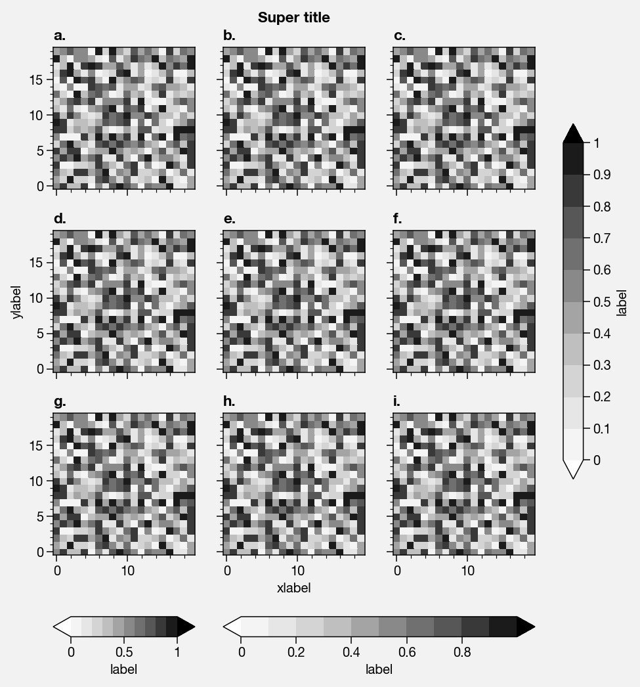

.. image:: showcase/showcase_46_2.png
   :width: 643px
   :height: 175px

.. image:: showcase/showcase_46_3.png
   :width: 643px
   :height: 190px

.. code:: ipython3

    import proplot as plot
    import numpy as np
    plot.nbsetup()
    plot.rc.cycle = 'Set4'
    titles = ['With redundant labels', 'Without redundant labels']
    for mode in (0,1):
        f, axs = plot.subplots(nrows=4, ncols=4, share=3*mode, span=1*mode, axwidth=1)
        for ax in axs:
            ax.plot((np.random.rand(100,20)-0.4).cumsum(axis=0))
        axs.format(xlabel='x-label', ylabel='y-label', suptitle=titles[mode], abc=mode, abcpos='il')

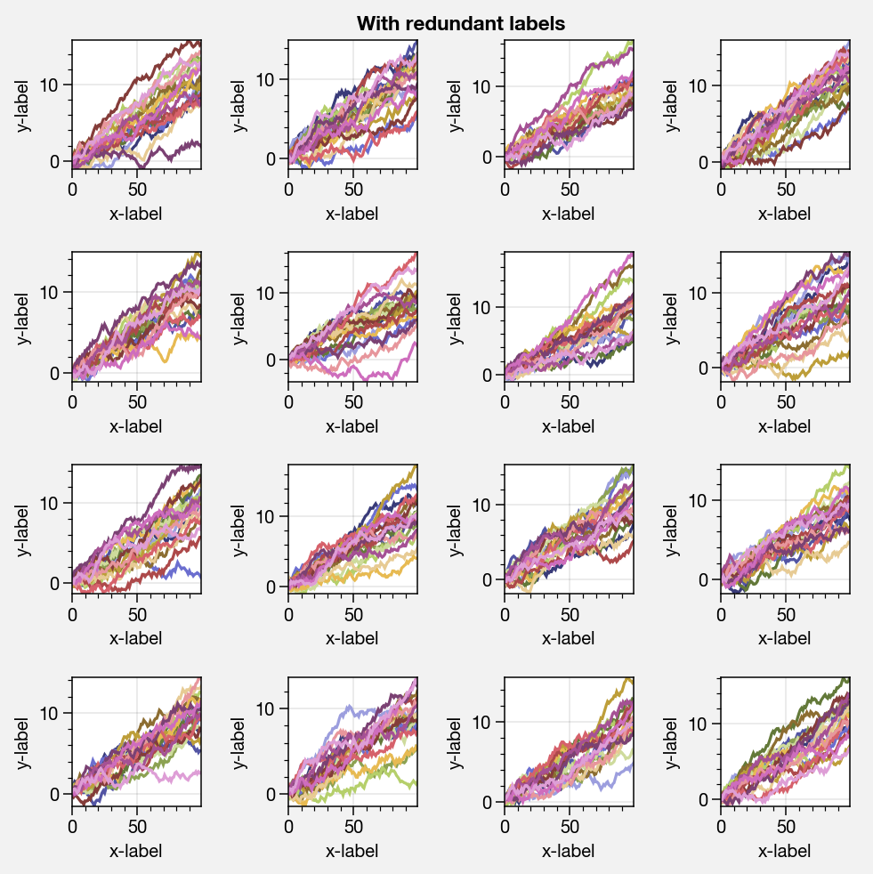

.. image:: showcase/showcase_47_1.png
   :width: 490px
   :height: 498px

“Dual” x and y axes
-------------------

The new “dual axis” feature lets you easily produce duplicate *x* and
*y* axes meant to represent *alternate units* in the same coordinate
range.

.. code:: ipython3

    import proplot as plot
    plot.nbsetup()
    f, axs = plot.subplots(ncols=2, share=0, span=0, aspect=3)
    # These first 2 are for general users
    ax = axs[0]
    ax.format(yformatter='null', xlabel='wavenumber', xlocator=plot.arange(0.1,0.9,0.2), xlim=(0.1,1),
              suptitle='Dual axes feature')
    ax.dualx(xscale='inverse', xlabel='wavelength')
    ax = axs[1]
    ax.format(yformatter='null', xlabel='temperature (K)', title='', xlim=(200,300))
    ax.dualx(offset=-273.15, xscale='linear')#, xlabel='temperature (\N{DEGREE SIGN}C)')
    # These next 2 are for atmospheric scientists; note the assumed scale height is 7km
    f, axs = plot.subplots(ncols=2, share=0, span=0, aspect=0.5, axwidth=1.8)
    ax = axs[0]
    ax.format(xformatter='null', ylabel='pressure (hPa)', ylim=(1000,10))
    ax.dualy(yscale='height', ylabel='height (km)')
    ax = axs[1] # span
    ax.format(xformatter='null', ylabel='height (km)', ylim=(0,20), suptitle='Dual axes feature')
    ax.dualy(yscale='pressure', ylabel='pressure (hPa)')

.. image:: showcase/showcase_50_0.png
   :width: 454px
   :height: 154px

.. image:: showcase/showcase_50_1.png
   :width: 418px
   :height: 267px

New axis formatters
-------------------

ProPlot changes the default axis formatter (i.e. the class used to
convert float numbers to tick label strings). The new formatter trims
trailing zeros by default, and can be used to filter tick labels within
some data range, as demonstrated below.

.. code:: ipython3

    locator = [0, 0.25, 0.5, 0.75, 1]
    f, axs = plot.subplots(ncols=2, axwidth=2, share=0)
    axs[1].format(xlocator=locator, ylocator=locator, xtickrange=[0,0.5], yticklabelloc='both', title='ProPlot formatter', titleweight='bold')
    axs[0].format(xlocator=locator, ylocator=locator, yticklabelloc='both', xformatter='scalar', yformatter='scalar', title='Matplotlib formatter', titleweight='bold')

.. image:: showcase/showcase_53_0.png
   :width: 454px
   :height: 205px

Lots of handy new axes formatters that can be referenced by string name!
Easily mark your axes as fractions or geographic coordinates. Forgot to
mention, ProPlot includes an endpoint-inclusive ``arange`` function.

.. code:: ipython3

    f, axs = plot.subplots(nrows=3, axwidth=5, aspect=(8,1), share=0, span=0, hspace=0.3)
    axs[0].format(xlim=(0,4*np.pi), xlocator=plot.arange(0, 4, 0.25)*np.pi, xformatter='pi')
    axs[1].format(xlim=(0,2*np.e), xlocator=plot.arange(0, 2, 0.5)*np.e, xformatter='e')
    axs[2].format(xlim=(-90,90), xlocator=plot.arange(-90, 90, 30), xformatter='deglat')
    axs.format(ylocator='null', suptitle='Showcase of new formatters')

.. image:: showcase/showcase_55_0.png
   :width: 526px
   :height: 284px

New axis scales
---------------

ProPlot adds several handy axis scales. The ``'sine'`` scale scales the
axis as the sine of the latitude – this is useful for getting an
**area-weighted** latitude coordinate. The ``'mercator'`` scale scales
the axis as with latitude in the Mercator projection.

.. code:: ipython3

    import proplot as plot
    import numpy as np
    plot.nbsetup()
    plot.rc.update(color='gray7', hatch='xxxx')
    f, axs = plot.subplots(ncols=2, width=6, share=0, span=0, wspace=0.7, left=0.6)
    n = 30
    x = np.linspace(-180,180,n)
    y = np.linspace(-85,85,n) # note sine just truncated values not in [-90,90], but Mercator transformation can reflect them
    y2 = np.linspace(-85,85,n) # for pcolor
    for i,(ax,scale,color) in enumerate(zip(axs,['mercator','sine'],['sky','coral'])):
        ax = axs[i-1]
        ax.plot(x, y, '-', color=color, lw=4)
        data = np.random.rand(len(x), len(y2))
        ax.pcolormesh(x, y2, data, cmap='grays', cmap_kw={'right': 0.8}) # use 'right' to trim the colormap from 0-1 color range to 0-0.8 color range
        ax.format(xlabel='longitude', ylabel='latitude', title=scale.title() + '-latitude y-axis', yscale=scale,
                  ytickloc='left', suptitle='Projection coordinate y-axes',
                  xformatter='deglon', yformatter='deglat', grid=False,
                  xscale='linear', xlim=None, ylim=(-85,85))

.. image:: showcase/showcase_58_0.png
   :width: 540px
   :height: 282px

The ``'inverse'`` scale is perfect for labeling spectral coordinates –
for example, wavenumber on one axis, wavelength on the opposite axis.

Note also that the title and super title are automatically adjusted to
make room for tick labels and axis labels on the top of the subplot.

.. code:: ipython3

    # Plot the response function for an imaginary 5-day lowpass filter
    import proplot as plot
    import numpy as np
    plot.nbsetup()
    plot.rc['axes.ymargin'] = 0
    cutoff = 0.3
    x = np.linspace(0.01,0.5,1000) # in wavenumber days
    response = (np.tanh(-((x - cutoff)/0.03)) + 1)/2 # imgarinary response function
    f, ax = plot.subplots(aspect=(3,1), width=6)#, tight=False, top=2)
    ax.fill_between(x, 0, response, hatch='xxx', facecolor='none', edgecolor='gray8', lw=1, clip_on=True)
    ax.axvline(cutoff, lw=2, ls='-', color='red')
    ax.fill_between([0.27, 0.33], 0, 1, color='red', alpha=0.3)
    ax.format(xlabel='wavenumber (days$^{-1}$)', ylabel='response', grid=False)
    axy = ax.twiny()
    axy.format(xlim=(1/max(x), 1/min(x)), xlocator=np.array([20, 10, 5, 2, 1, 0.5, 0.2, 0.1, 0.05]),
              xscale='inverse', xlabel='period (days)',
              title='Imgaginary response function', titlepos='oc',
              suptitle='SuperTitle', 
              )

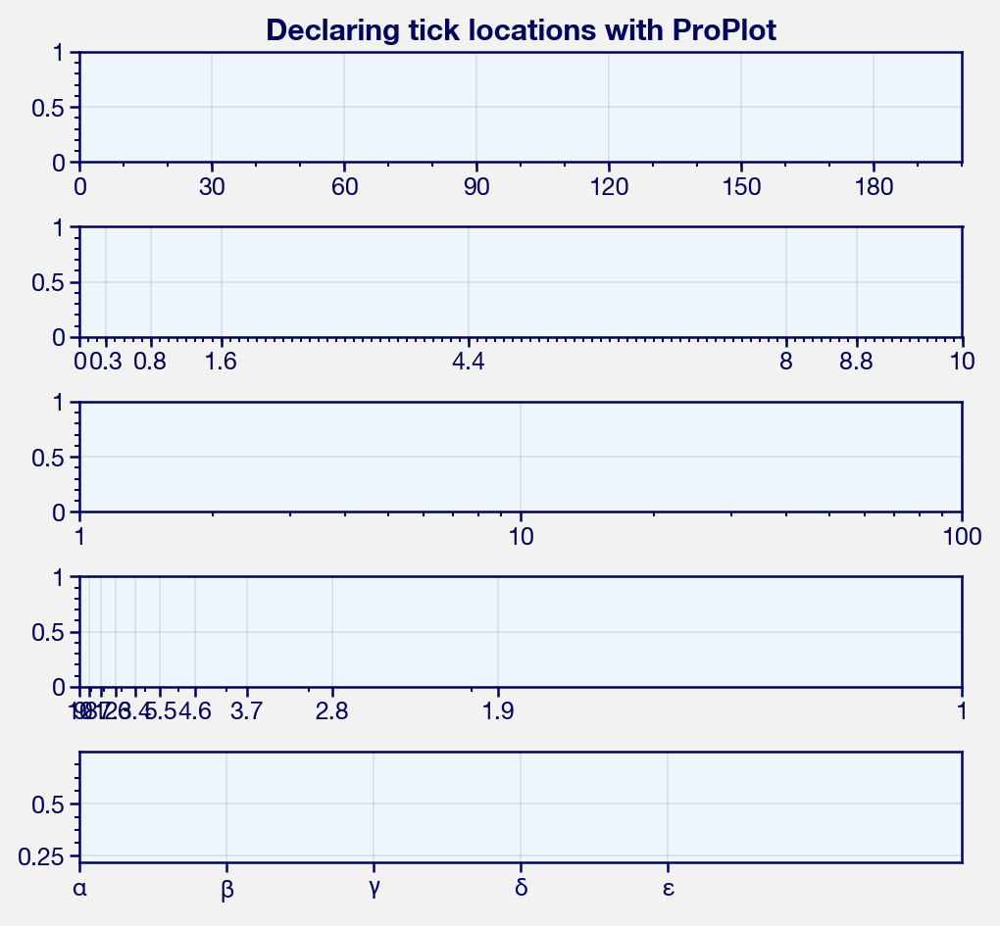

The ``'cutoff'`` scale is great when you have data with a strange
spatial distribution. Use it to “zoom” in and out along parts of the
axis, or to jump between two points in one go.

.. code:: ipython3

    import proplot as plot
    import numpy as np
    plot.nbsetup()
    # plot.rc.fontname = 'Verdana'
    f, axs = plot.subplots(width=6, nrows=4, aspect=(5,1),
                         hspace=0.5,
                         sharey=False, sharex=False)
    # Compression
    ax = axs[0]
    x = np.linspace(0,4*np.pi,1000)
    xticks = plot.arange(0,12,1.0)
    y = np.sin(x)
    y2 = np.cos(x)
    scales = [(3, np.pi), (0.3, 3*np.pi), (np.inf, np.pi, 2*np.pi), (5, np.pi, 2*np.pi)]
    titles = ('Zoom out of left', 'Zoom into left', 'Discrete cutoff', 'Fast jump')
    locators = [np.pi/3, np.pi/3, *([x*np.pi for x in plot.arange(0, 4, 0.25) if not (1 < x <= 2)] for i in range(2))]
    for ax,scale,title,locator in zip(axs,scales,titles,locators):
        ax.plot(x, y, lw=3, color='blue7')
        ax.plot(x, y2, lw=3, color='red7')
        ax.format(xscale=('cutoff', *scale), title=title,
                  xlim=(0,4*np.pi), ylabel='Wave amplitude', # note since 'spanning labels' turned on by default, only one label is drawn
                  xformatter='pi', xlocator=locator,
                  xtickminor=False, xgrid=True, ygrid=False, suptitle='Cutoff scale showcase')

.. image:: showcase/showcase_62_0.png
   :width: 540px
   :height: 578px

Map projection axes
===================

ProPlot isn’t just great for Cartesian-axis plotting. It also includes
seamless integration with the “cartopy” and “basemap” packages. Note
these features are **optional** – if you don’t want to use them, you
don’t need to have “cartopy” and “basemap” installed!

Cartopy vs. basemap
-------------------

Plotting with basemap is much easier – now, you just plot exactly like
you would with ordinary Cartesian axes. No need to directly reference a
``Basemap`` instance! Plotting with cartopy is also much easier – now,
there’s no need to reference the individual cartopy ``crs.Projection``
class, and there’s no need to use ``transform=crs.PlateCarree()`` with
every plotting command (this is now the default behavior).

Why cartopy? Generally **cleaner integration** with matplotlib API, the
way of the future. Why basemap? It still has some **useful features**.

.. code:: ipython3

    import proplot as plot
    import numpy as np
    plot.nbsetup()
    # First make figure
    f, axs = plot.subplots(ncols=2, nrows=2, width=7, hspace=0.2, wspace=0.3, top=0.5,
                           bottomcolorbars=True, bwidth=0.2, bottom=0.2,
                           proj='hammer', proj_kw={'lon_0':0},
                           # basemap=False,
                           basemap={(1,3):False, (2,4):True},
                           )
    offset = 20
    x = plot.arange(-180+offset,180+offset-1,60)
    y = plot.arange(-60,60+1,30)
    data = np.random.rand(len(y), len(x))
    for ax,p,pcolor,basemap in zip(axs,range(4),[1,1,0,0],[0,1,0,1]):
        m = None
        cmap = ['sunset', 'sunrise'][basemap]
        levels = [0, .3, .5, .7, .9, 1]
        levels = np.linspace(0,1,11)
        if pcolor:
            m = ax.pcolorpoly(x, y, data, levels=levels, cmap=cmap, extend='neither', globe=True)
            ax.scatter(np.random.rand(5,5)*180, 180*np.random.rand(5,5))
        if not pcolor:
            m = ax.contourf(x, y, data, levels=levels, cmap=cmap, extend='neither', globe=True)
            ax.scatter(np.random.rand(5,5)*180, 180*np.random.rand(5,5))
        ax.format(suptitle='Hammer projection in different mapping frameworks', collabels=['Cartopy', 'Basemap'], labels=True)
        if p<2:
            c = f.bottompanel[p].colorbar(m, clabel='values', ctickminor=False)

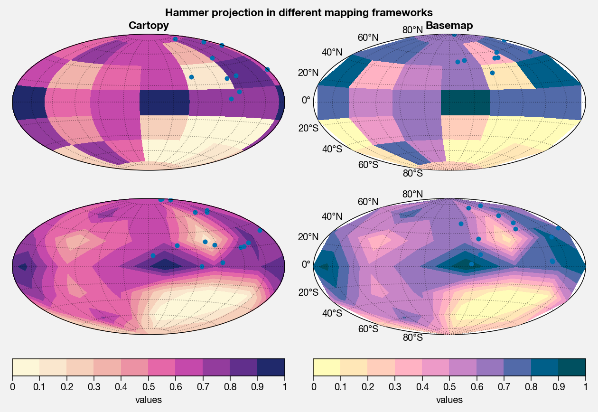

Another demonstration of cartopy’s strengths and weaknesses: complex
plotting algorithms like ``tricontourf`` only work with cartopy, but
gridline labels are only possible on equirectangular and Mercator
projections. Also, unfortunately, matplotlib’s ``tight_layout`` method
detects basemap labels, but **does not detect cartopy labels** – so
ProPlot has to disable it’s own “tight layout” feature. I am currently
looking for a work-around.

.. code:: ipython3

    # Tricontour is only possible with cartopy! But also note, cartopy only
    # supports lat lon labels for Mercator and equirectangular projections.
    import proplot as plot
    plot.nbsetup()
    import numpy as np
    f, axs = plot.subplots(ncols=1, width=4, proj='merc', wspace=0.5, basemap=False,
                           proj_kw={'lon_0':0}, top=0.4, left=0.4, right=0.2, bottom=0.2)
    axs.set_adjustable('box')
    ax = axs[0]
    np.random.seed(3498)
    x, y = np.random.uniform(size=(100, 2)).T
    z = np.exp(-x**2 - y**2)
    x = (x-0.5)*360
    y = (y-0.5)*180
    levels = np.linspace(0, 1, 100)
    cnt = ax.tripcolor(x, y, z, levels=levels, cmap='Turquoise')
    ax.format(suptitle='Tricontour plot', title='Only possible with cartopy', xlabels='b', ylabels='l', xlocator=60, ylocator=20, latmax=90)

Geographic features
-------------------

Easily add and format geographic features like coastlines, land, country
borders, and state borders. To modify the projections, you can also pass
keyword args to the ``basemap.Basemap`` and ``cartopy.crs.Projection``
initializers with the ``proj_kw`` keyword arg. Note that native
``PROJ.4`` keyword options are now accepted along with their more
verbose cartopy aliases – for example, you can use ``lon_0`` instead of
``central_longitude``.

.. code:: ipython3

    import proplot as plot
    import numpy as np
    plot.nbsetup()
    f, axs = plot.subplots(ncols=2, nrows=2,
                           proj={(1,2):'ortho', (3,4):'npstere'},
                           basemap={(1,3):False, (2,4):True},
                           proj_kw={(1,2):{'lon_0':-60, 'lat_0':0}, (3,4):{'lon_0':-60, 'boundinglat':40}})
    axs.format(collabels=['Cartopy', 'Basemap'])
    axs[0::2].format(reso='med', land=True, coast=True, landcolor='desert sand', facecolor='blue green', titleweight='bold', linewidth=2, labels=False)
    axs[1::2].format(land=True, coast=True, landcolor='desert sand', facecolor='blue green', titleweight='bold', linewidth=2, labels=False)

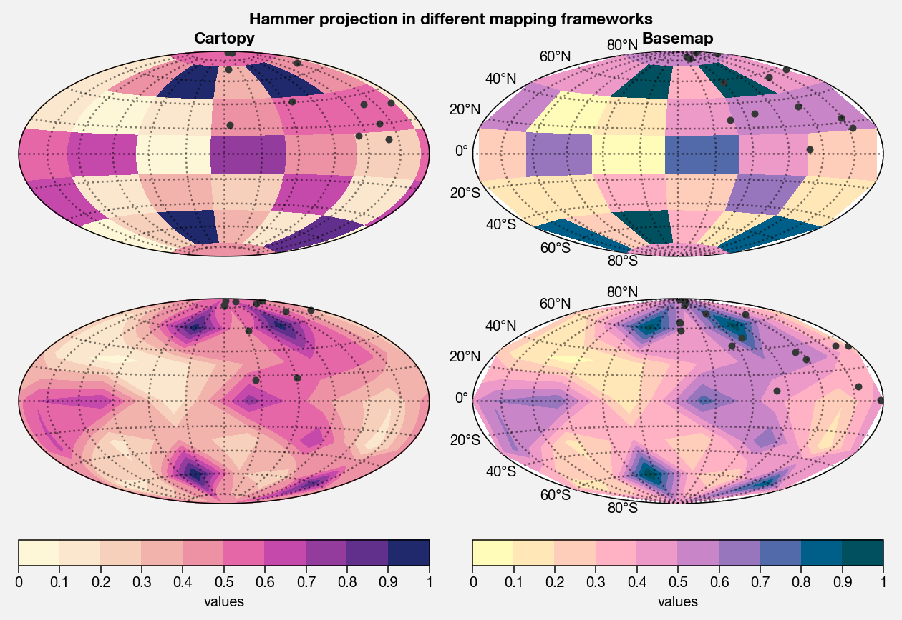

.. code:: ipython3

    import proplot as plot
    import numpy as np
    plot.nbsetup()
    N = 40
    f, axs = plot.subplots(axwidth=4, ncols=2, proj='robin', basemap={1:False, 2:True})
    axs.format(collabels=['Cartopy', 'Basemap'], land=True, landcolor='light sage',
               suptitle='Ocean data, with continents on top',
               coast=True, innerborders=True, borders=True, labels=False)
    axs.contourf(np.linspace(-180,180,N), np.linspace(-90,90,N), np.random.rand(N,N).cumsum(axis=0),
                 cmap='ice_r', cmap_kw={'right':0.8})

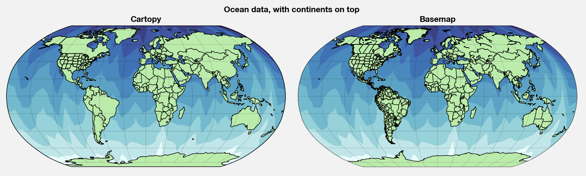

Tables of projections
---------------------

Many of the PROJ.4 projections are included in cartopy. ProPlot adds the
Aitoff, Hammer, Winkel Tripel, and Kavrisky VII projections. A table of
available cartopy projections is below.

.. code:: ipython3

    import proplot as plot
    import numpy as np
    plot.nbsetup()
    projs = ['cyl', 'merc', 'mill', 'lcyl', 'tmerc',
             'robin', 'hammer', 'moll', 'kav7', 'aitoff', 'wintri', 'sinu',
             'geos', 'ortho', 'nsper', 'aea', 'eqdc', 'lcc', 'gnom', 'npstere', 'igh',
             'eck1', 'eck2', 'eck3', 'eck4', 'eck5', 'eck6']
    f, axs = plot.subplots(ncols=3, nrows=9, left=0.1, bottom=0.1, right=0.1, top=0.5, proj=projs)
    axs.format(land=True, reso='lo', labels=False, suptitle='Table of cartopy projections')
    for proj,ax in zip(projs,axs):
        ax.format(title=proj, title_kw={'weight':'bold'}, labels=False)

.. image:: showcase/showcase_76_1.png
   :width: 594px
   :height: 1007px

Basemap tends to prefer “rectangles” over their projections. A table of
available basemap projections is below. Note that with the default API,
projection keyword args need to be specified explicitly or an error is
thrown. ProPlot supplies some default keyword args to prevent this.

.. code:: ipython3

    import proplot as plot
    import numpy as np
    plot.nbsetup()
    projs = ['cyl', 'merc', 'mill', 'cea', 'gall', 'sinu',
             'eck4', 'robin', 'moll', 'kav7', 'hammer', 'mbtfpq',
             'geos', 'ortho', 'nsper',
             'vandg', 'aea', 'eqdc', 'gnom', 'cass', 'lcc',
             'npstere', 'npaeqd', 'nplaea', 'spstere', 'spaeqd', 'splaea']
    f, axs = plot.subplots(ncols=3, nrows=9, left=0.1, bottom=0.1, right=0.1, top=0.5, basemap=True, proj=projs)
    axs.format(land=True, labels=False, suptitle='Table of basemap projections')
    for proj,ax in zip(projs,axs):
        ax.format(title=proj, title_kw={'weight':'bold'}, labels=False)

.. image:: showcase/showcase_78_1.png
   :width: 594px
   :height: 998px

Colormaps and colors
====================

Perceptually uniform colorspaces
--------------------------------

This package includes colormaps from several other projects (see below),
but also introduces some brand new colormaps. The new colormaps were
created by drawing lines across the “perceptually uniform” HCL
colorspace – or across its two variants, the HSL and HPL colorspaces.
For more info, check out `this
page <http://www.hsluv.org/comparison/>`__.

.. code:: ipython3

    import proplot as plot
    plot.nbsetup()
    f = plot.colorspace_breakdown(luminance=50)

.. image:: showcase/showcase_82_1.png
   :width: 847px
   :height: 297px

.. code:: ipython3

    import proplot as plot
    plot.nbsetup()
    f = plot.colorspace_breakdown(chroma=60)

.. image:: showcase/showcase_83_1.svg

.. code:: ipython3

    import proplot as plot
    plot.nbsetup()
    f = plot.colorspace_breakdown(hue=0)

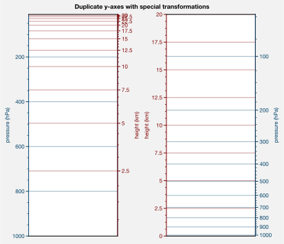

The below shows how the builtin “viridis” colormap and the new ProPlot
“fire” colormap vary in the three HSV-like colorspaces. We see that the
“Fire” transitions are linear in HSL space, while the “virids”
transitions are linear in hue and luminance but relatively non-linear in
saturation. The ``cmap_breakdown`` function can be used to test
virtually any registered colormap.

.. code:: ipython3

    import proplot as plot
    plot.nbsetup()
    plot.cmap_breakdown('viridis')
    plot.cmap_breakdown('fire')

.. image:: showcase/showcase_86_1.png
   :width: 1009px
   :height: 306px

.. image:: showcase/showcase_86_2.png
   :width: 1009px
   :height: 304px

Table of colormaps
------------------

The below showcases every registered colormap included with ProPlot.
We’ve filtered some older, less uniform colormaps, kept the better
builtin ones, added our own, and added several from projects like
`SciVisColor <https://sciviscolor.org/home/colormoves/>`__ and
`cmOcean <https://matplotlib.org/cmocean/>`__.

.. code:: ipython3

    import proplot as plot
    plot.nbsetup()
    f = plot.cmap_show(31)

.. image:: showcase/showcase_89_1.png
   :width: 481px
   :height: 5110px

Table of color cycles
---------------------

Added new concept of “color cycle” names. Adjust with
``plot.rc.cycle = name``, or by passing ``cycle=name`` to any plotting
command.

.. code:: ipython3

    import proplot as plot
    plot.nbsetup()
    f = plot.cycle_show()

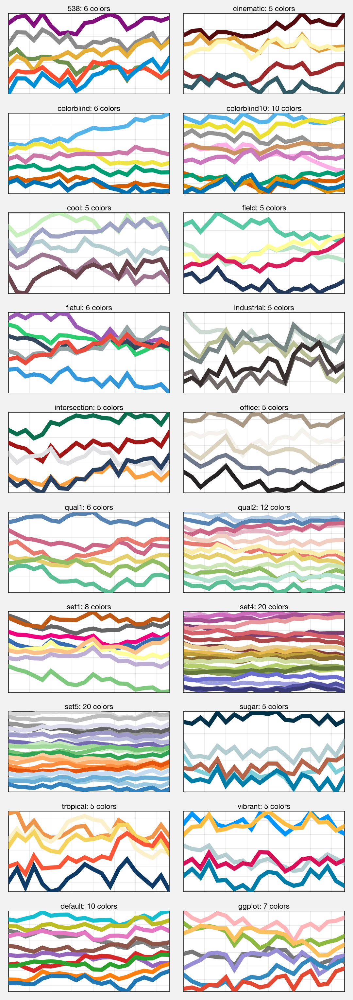

Table of colors
---------------

ProPlot reduces the available named colors to the below table – they are
either primary colors, or come from the XKCD “color survey”
(crowd-sourced naming of random HEX strings) and from Crayola crayon
colors. The colors were filtered to be *sufficiently “distinct” in the
perceptually uniform HCL colorspace*, and their names were cleaned up –
for example, “reddish” and “reddy” were changed to “red”, and “bluish”
and “bluey” were changed to “blue”.

.. code:: ipython3

    import proplot as plot
    plot.nbsetup()
    f = plot.color_show(nbreak=13)

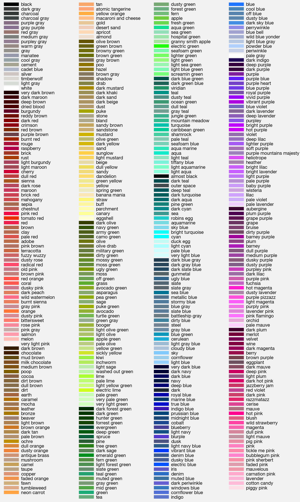

ProPlot also includes new colors from the “Open Color” github project.
These colors are used for website UI design, but also great for
selecting colors for scientific visualizations.

.. code:: ipython3

    import proplot as plot
    plot.nbsetup()
    f = plot.color_show(['open'])

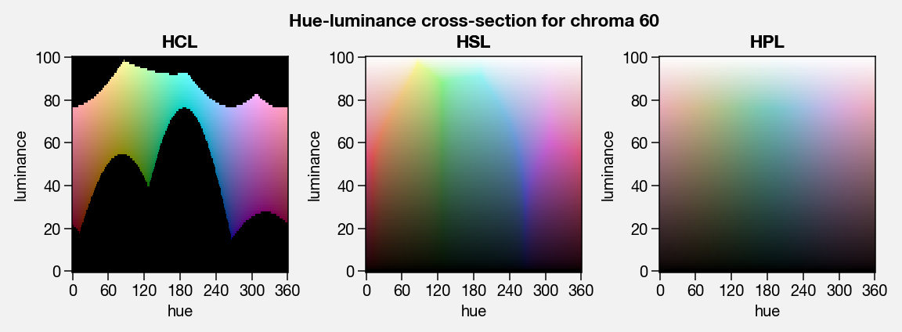

On-the-fly colormaps
--------------------

You can make a new colormap with ProPlot’s on-the-fly colormap
generator! Every ``cmap`` argument is passed to the ``proplot.Colormap``
constructor, as are keyword args specified with ``cmap_kw``.

.. code:: ipython3

    import proplot as plot
    import numpy as np
    plot.nbsetup()
    f, axs = plot.subplots(ncols=2, axwidth=3, aspect=2, bottomcolorbars=True, bottom=0.1)
    data = np.random.rand(50,50).cumsum(axis=1)
    m = axs[0].contourf(data, cmap='dark slate blue', cmap_kw={'reverse':False})
    f.bottompanel[0].colorbar(m, locator='null')
    m = axs[1].contourf(data, cmap=('cerulean', 'orange', 'steel'), cmap_kw={'reverse':[True]*3})
    f.bottompanel[1].colorbar(m, locator='null')
    axs.format(xticks='none', yticks='none', suptitle='On-the-fly monochromatic maps',
               collabels=('Single colormap', 'Three colormaps, merged'), collabelweight='normal')

.. image:: showcase/showcase_99_0.png
   :width: 634px
   :height: 232px

All of the SciVisColor colormaps from their GUI “ColorMoves” interface
are included. Easily recreate SciVisColor-style merged colormaps without
having to use the GUI, thanks to ProPlot’s on-the-fly colormap
generator! You can also save custom colormaps in a ``.proplot`` folder
in your home directory by passing ``save`` to the ``Colormap``
constructor. Maps in this folder will be loaded by ProPlot on import.

.. code:: ipython3

    import proplot as plot
    import numpy as np
    plot.nbsetup()
    f, axs = plot.subplots(ncols=2, axwidth=2.5, bottomcolorbars=True, bottom=0.1)
    data = np.random.rand(100,100).cumsum(axis=1)
    # Make colormap, save as "test1.json"
    cmap = plot.Colormap('Green1_r', 'Orange5', 'Blue1_r', 'Blue6', name='test1', save=True)
    m = axs[0].contourf(data, cmap=cmap, levels=100)
    f.bottompanel[0].colorbar(m, clocator='none')
    # Make colormap, save as "test2.json"
    cmap = plot.Colormap('Green1_r', 'Orange5', 'Blue1_r', 'Blue6', ratios=(1,3,5,10), name='test2', save=True)
    m = axs[1].contourf(data, cmap=cmap, levels=100)
    f.bottompanel[1].colorbar(m, clocator='none')
    axs.format(xticks='none', yticks='none', suptitle='Merging existing colormaps',
               collabels=['Evenly spaced', 'Matching SciVisColor example'], collabelweight='normal')

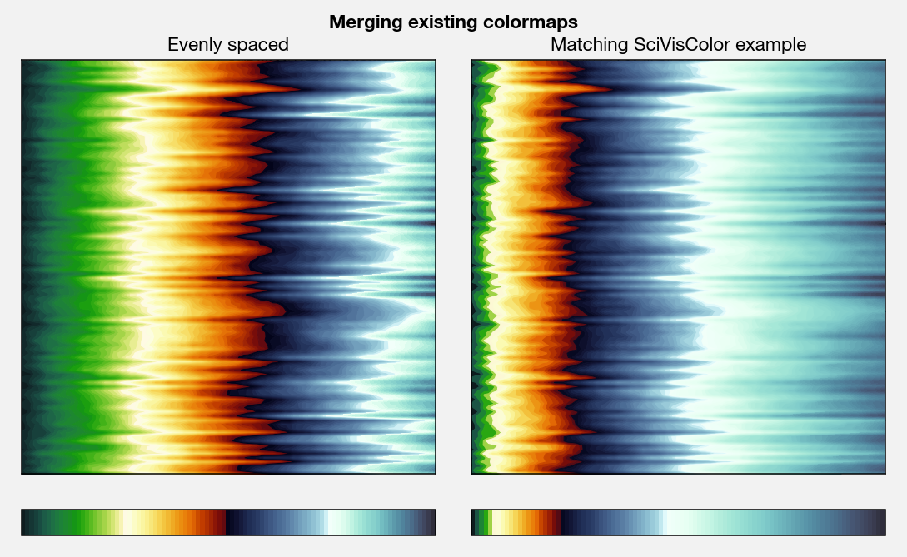

You can also change the “gamma” of a perceptually uniform colormap
on-the-fly.

.. code:: ipython3

    import proplot as plot
    import numpy as np
    plot.nbsetup()
    f, axs = plot.subplots(ncols=3, nrows=2, innercolorbars='r',
                           hspace=0.3, wspace=0.2, aspect=1,
                           bspace=0.1)
    data = np.random.rand(10,10).cumsum(axis=1)
    def show(ax, cmap, gamma):
        m1 = ax.pcolormesh(data, cmap=cmap, cmap_kw={'gamma':gamma}, levels=10, extend='both')
        ax.rightpanel.colorbar(m1, clocator='none')
        ax.format(title=f'gamma = {gamma}', xlabel='x axis', ylabel='y axis', suptitle='Varying gamma, inner colorbars')
    cmap = 'verdant'
    show(axs[0], cmap, 0.8)
    show(axs[1], cmap, 1.0)
    show(axs[2], cmap, 1.4)
    cmap = 'fire'
    show(axs[3], cmap, 0.8)
    show(axs[4], cmap, 1.0)
    show(axs[5], cmap, 1.4)

.. image:: showcase/showcase_103_0.png
   :width: 652px
   :height: 422px

Changing the color cycle
------------------------

You can specify the color cycler by passing ``cycle`` to any plotting
command, or by changing the global default cycle with
``plot.rc.cycle = name``. The below example demonstrates the former
approach.

.. code:: ipython3

    import proplot as plot
    import numpy as np
    plot.nbsetup()
    f, axs = plot.subplots(nrows=2, ncols=3, axwidth=1.5)
    for ax,cycle in zip(axs,('colorblind', 'field', 'qual1', 'qual2', 'set4', 'set5')):
        for i in range(10):
            ax.plot((np.random.rand(20) - 0.5).cumsum(), cycle=cycle, lw=5)
    axs.format(xformatter='none', yformatter='none', suptitle='Various named color cycles')

.. image:: showcase/showcase_106_0.png
   :width: 517px
   :height: 356px

Also note that colormaps and color cycles are totally interchangeable!
You can use a colormap as a color cycler, and (though this isn’t
recommended) vice versa.

.. code:: ipython3

    import proplot as plot
    import numpy as np
    plot.nbsetup()
    f, axs = plot.subplots(ncols=2, bottomcolorbars=[1,2], span=False, axwidth=2.2)
    m = axs[0].pcolormesh(np.random.rand(20,20), cmap='538', levels=np.linspace(0,1,7))
    f.bottompanel[0].colorbar(m, label='clabel')
    lines = axs[1].plot(20*np.random.rand(10,10), cycle=('reds', 10), lw=3)
    axs.format(xlabel='xlabel', ylabel='ylabel', suptitle='Another colormap demo')
    axs[0].format(title='Color cycler as colormap')
    axs[1].format(title='Colormap as cycler, with "colorbar legend"')
    f.bottompanel[1].colorbar(lines, values=np.arange(0,len(lines)), label='clabel')

.. image:: showcase/showcase_108_1.png
   :width: 490px
   :height: 334px

