Introduction
============

Matplotlib APIs
---------------

Matplotlib has `two
APIs <https://matplotlib.org/api/api_overview.html>`__ – the “pyplot”
API (which is MATLAB-like), and the “object-oriented” API (which is more
“pythonic”). Contrary to the similar names, this package is not meant to
be a pyplot replacement. ProPlot’s features are invoked with the
“object-oriented” API, thanks to subclasses of the
`~matplotlib.axes.Axes` and `~matplotlib.figure.Figure` classes.

.. code:: ipython3

    # PyPlot API
    import matplotlib.pyplot as plt
    import numpy as np
    plt.figure(figsize=(5,3))
    plt.plot(np.random.rand(10,10), lw=3)
    plt.title('Title')
    plt.xlabel('x axis')
    plt.ylabel('y axis')

.. code:: ipython3

    # Object-oriented API
    import matplotlib.pyplot as plt
    import numpy as np
    f, ax = plt.subplots(figsize=(5,3))
    ax.plot(np.random.rand(10,10), lw=3)
    ax.set_title('Title')
    ax.set_xlabel('x axis')
    ax.set_ylabel('y axis')

The subplots command
--------------------

The `~proplot.subplots.subplots` command is your gateway to all of
ProPlot’s features. Its usage is similar to the pyplot
`~matplotlib.pyplot.subplots` command, but it is packed with new
features and generates a subclassed figure and specially subclassed
axes.

.. code:: ipython3

    import proplot as plot
    f, ax = plot.subplots()
    ax.format(title='ProPlot API', xlabel='x axis', ylabel='y axis')

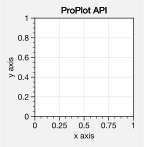

Most matplotlib sizing arguments assume the units inches or some
*relative* unit size – e.g. relative to the axes width. With ProPlot,
all sizing arguments are interpreted the same way. If numeric, the units
are inches, and if string, the units are interpreted by
`~proplot.utils.units`. A table of acceptable units is found in the
`~proplot.utils.units` documentation – they include cm, mm, and
pixels. See `~proplot.subplots.subplots` for details.

.. code:: ipython3

    import proplot as plot
    f, axs = plot.subplots(ncols=3, tightsubplot=False, width='12cm', height='55mm', wspace=('10pt', '20pt'))
    axs.format(suptitle='Figure title', xlabel='x axis', ylabel='y axis')

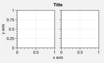

A-b-c subplot labeling is another useful ProPlot feature. The label
order is row-major by default; to change this, use the
`~proplot.subplots.subplots` ``order`` keyword arg. Change the label
position with the ``abcpos`` `~proplot.rcmod` option, or the label
style with the ``abcformat`` `~proplot.rcmod` option. Toggle labeling
with ``abc=True``. See :ref:`The format command` and
:ref:`Rc settings control` for details.

.. code:: ipython3

    import proplot as plot
    f, axs = plot.subplots(nrows=2, ncols=2, order='F', axwidth=1.5)
    axs.format(abc=True, abcpos='ol', abcformat='A.', xlabel='x axis', ylabel='y axis', suptitle='Subplots with column-major labeling')
    f, axs = plot.subplots(nrows=8, ncols=8, axwidth=0.5, flush=True) # not 
    axs.format(abc=True, abcpos='ir', xlabel='x axis', ylabel='y axis', xticks=[], yticks=[], suptitle='Grid of "flush" subplots')

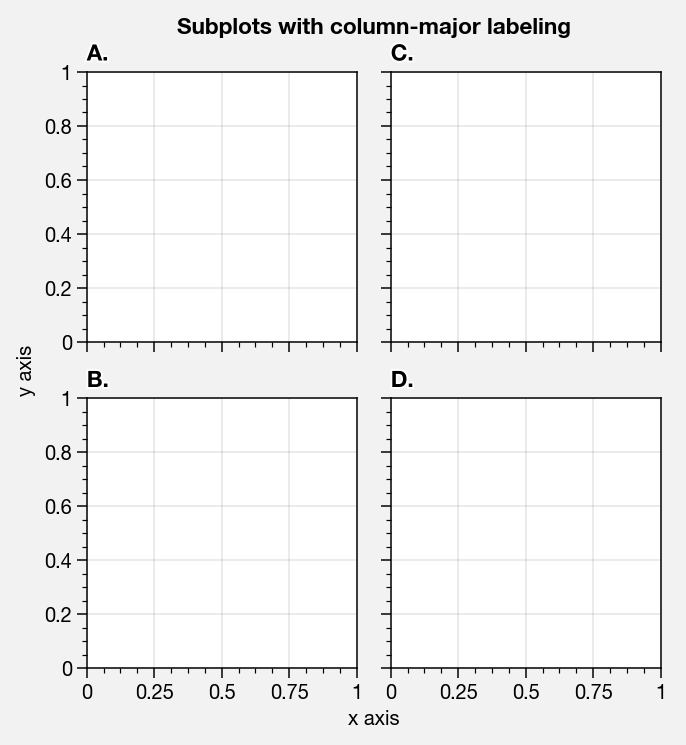

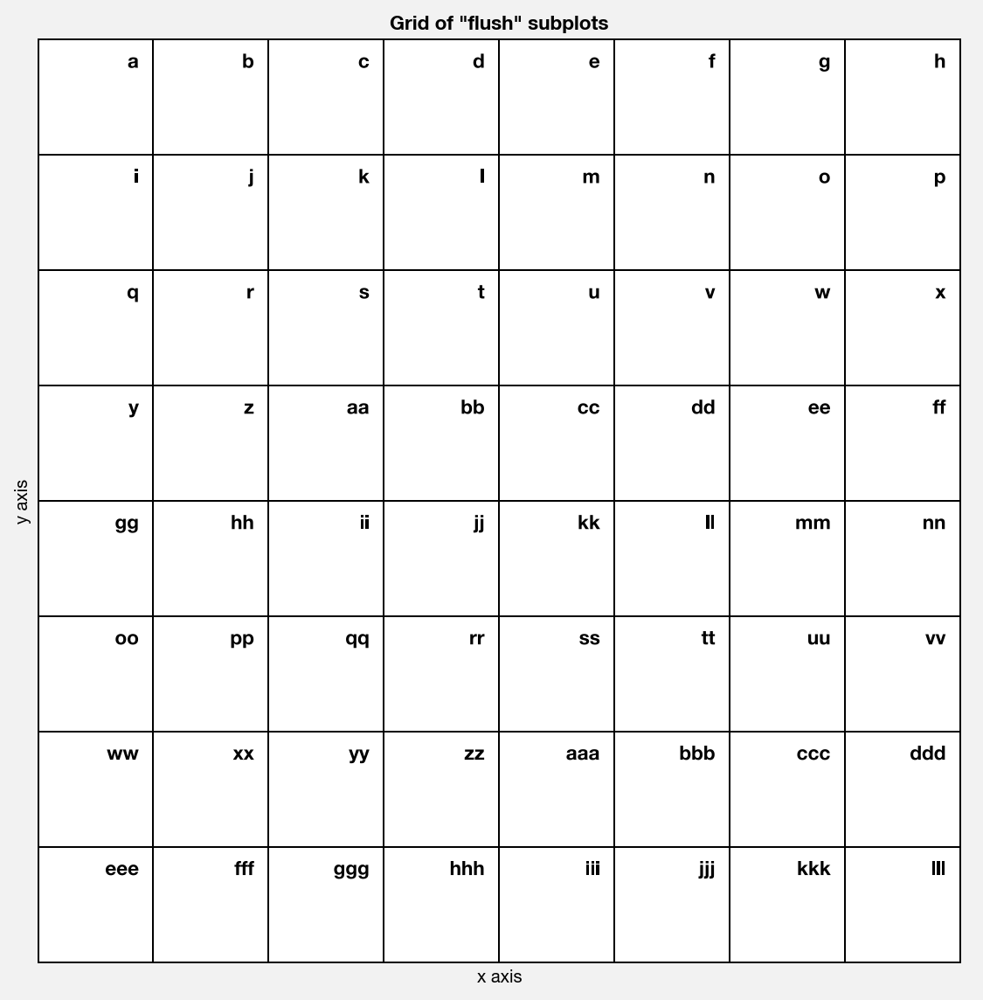

To set up a complex grid of subplots, use a 2D array of integers. You
can think of this array as a “picture” of your figure. This lets you
build the below grid in just one line of code, instead of 6 lines. The
numbering determines the order of a-b-c labels. See
`~proplot.subplots.subplots` for details.

.. code:: ipython3

    # Arbitrarily complex array of subplots, with shared/spanning x/y axes detected automatically
    import proplot as plot
    import numpy as np
    f, axs = plot.subplots([[1, 1, 2], [1, 1, 6], [3, 4, 4], [3, 5, 5]], span=1, share=3, width=5)
    axs.format(suptitle='Complex subplot grid with axis-sharing + spanning labels', xlabel='time (seconds)', ylabel='temperature (K)', abc=True)
    axs[0].plot(2*(np.random.rand(100,5)-0.5).cumsum(axis=0), lw=2)

.. image:: showcase/showcase_12_1.svg

Automatic subplot spacing
-------------------------

With ProPlot, you will always get just the right amount of spacing
between subplots so that elements don’t overlap, and just the right
amount of space around the figure edge so that labels and whatnot are
not cut off. Furthermore, despite all of the complex adjustments this
requires, the original subplot aspect ratios are **always preserved**.
Even when axes panels are present, the main subplot aspect ratios will
stay fixed (see below for more on panels).

You can disable this feature by passing ``tight=False`` to
`~proplot.subplots.subplots`, but it is unbelievably useful. It works
by scaling either the figure width or height dimension (whichever one
you didn’t specify) such that the subplot aspect ratios will not change,
and by taking advantage of ProPlot’s subplot layout restrictions. Some
examples are below.

Sometimes, ``tight=True`` is not possible (when using the cartopy
``set_extent`` method or when using cartopy meridian and parallel
labeling; a warning will be raised in these instances). Even when
``tight=False``, ProPlot tries to make the default spacing reasonable.

.. code:: ipython3

    import proplot as plot
    for share in (3,0):
        f, axs = plot.subplots(nrows=3, ncols=3, aspect=1, axwidth=1, share=share, span=False, tight=True)
        axs[4].format(title='title\ntitle\ntitle', suptitle='"Smart tight layout" automatic spacing')
        axs[1].format(ylabel='ylabel', xlabel='xlabel')

.. image:: showcase/showcase_15_0.svg

.. image:: showcase/showcase_15_1.svg

.. code:: ipython3

    import proplot as plot
    f, axs = plot.subplots([[1,2],[3,2],[3,4]], share=0, span=0, axwidth=1.5)
    axs[0].format(xlabel='xlabel\nxlabel\nxlabel', title='Title', suptitle='"Smart tight layout" automatic spacing')
    axs[1].format(ylabel='ylabel\nylabel', xformatter='null', yticklabelloc='both')
    axs[2].format(yformatter='null', title='Title', ytickloc='both')
    axs[3].format(yformatter='null', xlabel='xlabel\nxlabel\nxlabel')

.. image:: showcase/showcase_16_0.svg

.. code:: ipython3

    import proplot as plot
    f, axs = plot.subplots(axwidth=2, ncols=2, span=False, share=0, axpanels='lr', axpanels_kw={'rshare':False})
    axs.format(ylabel='ylabel', xlabel='xlabel')
    axs[0].lpanel.format(ytickloc='right', yticklabelloc='right')
    axs[0].rpanel.format(ylabel='ylabel', ytickloc='right', yticklabelloc='right',
                         suptitle='"Smart tight layout" automatic spacing with panels', collabels=['Column 1', 'Column 2'])

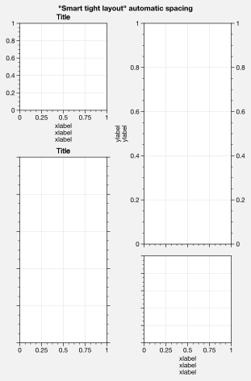

The format command
------------------

The `~proplot.subplots.subplots` method populates the
`~proplot.subplots.Figure` object with either `~proplot.axes.XYAxes`
(for cartesian axes) or `~proplot.axes.MapAxes` (for cartopy or
basemap projection axes) axes objects. Both of these classes inherit
from the base class `~proplot.axes.BaseAxes`.

The **most important** new method you need to know is
`~proplot.axes.BaseAxes.format`. This is your one-stop-shop for
changing axis labels, tick labels, titles, etc. Keyword args passed to
this function are interpreted as follows:

1. Any keyword arg matching the name of a ProPlot or matplotlib “rc”
   setting will be applied to the axes. If the name has “dots”, simply
   omit them. See the `~proplot.rcmod` documentation for details.
2. Remaining keyword args are passed to the `~proplot.axes.XYAxes` or
   `~proplot.axes.MapAxes` ``format_partial`` methods. Use these to
   change settings specific to Cartesian or map projection axes,
   e.g. changing tick locations (the former) or toggling geographic
   features (the latter).
3. Remaining keyword args are passed to the `~proplot.axes.BaseAxes`
   ``format_partial`` method. This one controls settings shared by
   `~proplot.axes.XYAxes` and `~proplot.axes.MapAxes` axes – namely,
   titles, “super titles”, row and column labels, and a-b-c subplot
   labeling.

Instead of needing all of these verbose, one-liner matplotlib commands
like ``ax.set_title`` and ``ax.xaxis.tick_params``, or even using
verbose abstract classes like the matplotlib `~matplotlib.ticker`
classes, `~proplot.axes.BaseAxes.format` lets you change everything at
once and adds several useful shorthands. This effectively eliminates the
need for boilerplate plotting code.

The axes returned by `~proplot.subplots.subplots` are also contained
in a special `~proplot.subplots.axes_list` list. This lets you call
any method (e.g. `~proplot.axes.BaseAxes.format`) on every axes
**simultaneously**. See the below example.

.. code:: ipython3

    import proplot as plot
    f, axs = plot.subplots(ncols=2, nrows=2, share=False, span=False, tight=True, axwidth=1.5)
    axs.format(xlabel='x-axis', ylabel='y-axis', xlim=(0,10), xlocator=2,
              ylim=(0,4), ylocator=plot.arange(0,4), yticklabels=('a', 'bb', 'ccc', 'dd', 'e'),
              title='Axes title', titlepos='co', suptitle='Super title',
              abc=True, abcpos='il', abcformat='a.',
              ytickloc='both', yticklabelloc='both', ygridminor=True, xtickminor=False,
              collabels=['Column label 1', 'Column label 2'], rowlabels=['Row label 1', 'Row label 2'])

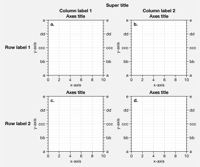

Automatic formatting
--------------------

With ProPlot, when you pass a `~pandas.DataFrame` or
`~xarray.DataArray` to any plotting command, labels and colorbars can
be generated automatically, and the x-axis label, y-axis label, legend
label, colorbar label, and/or title are configured from the metadata.
This restores some of the convenience you get with the builtin
`pandas` and `xarray` plotting tools. To disable automatic
labelling, pass ``autoformat=False`` to `~proplot.subplots.subplots`.

The below examples showcase these features for 1-dimensional and
2-dimensional datasets. For more on the ``colorbar`` and ``legend``
keywords, see `~proplot.wrappers.cmap_wrapper`,
`~proplot.wrappers.cycle_wrapper`, and :ref:`Plotting enhancements`
sections. For more on panels, see the :ref:`Panels` section.

.. code:: ipython3

    import xarray as xr
    import numpy as np
    import pandas as pd
    import proplot as plot
    plot.rc['axes.formatter.timerotation']
    # DataArray
    # Must be column major since plot draws lines from columns of arrays
    data = np.sin(np.linspace(0, 2*np.pi, 20))[:,None] + np.random.rand(20,8).cumsum(axis=1)
    da = xr.DataArray(data, dims=('x', 'cat'), coords={
        'x':xr.DataArray(np.linspace(0,1,20), dims=('x',), attrs={'long_name':'distance', 'units':'km'}),
        'cat':xr.DataArray(np.arange(0,80,10), dims=('cat',), attrs={'long_name':'parameter', 'units':'K'})
        }, name='position series')
    # DataFrame
    ts = pd.date_range('1/1/2000', periods=20)
    data = (np.cos(np.linspace(0, 2*np.pi, 20))**4)[:,None] + np.random.rand(20,5)**2
    df = pd.DataFrame(data, index=ts, columns=['foo','bar','baz','zap','baf'])
    df.name = 'time series'
    df.index.name = 'time (s)'
    df.columns.name = 'columns'
    # Series
    series = pd.Series(np.random.rand(20).cumsum())
    # Figure
    f, axs = plot.subplots(ncols=2, axwidth=1.8, share=False, span=False)
    axs.format(suptitle='Automatic subplot formatting')
    # Plot DataArray
    ax = axs[0]
    ax.plot(da, cycle=plot.shade('sky blue', 0.2), cycle_kw={'fade':90}, lw=3,
            colorbar='ll', colorbar_kw={'length':'2cm', 'frameon':True})
    # Plot Dataframe
    ax = axs[1]
    ax.plot(df, cycle=plot.shade('dark green', 0.15), cycle_kw={'fade':90}, legend='uc', legend_kw={'frameon':True}, lw=3)
    ax.format(xrotation=45)

.. image:: showcase/showcase_22_0.svg

.. code:: ipython3

    import xarray as xr
    import numpy as np
    import pandas as pd
    import proplot as plot
    from string import ascii_lowercase
    # DataArray
    data = 50*(np.sin(np.linspace(0, 2*np.pi, 20) + 0)**2) * np.cos(np.linspace(0, np.pi, 20)+np.pi/2)[:,None]**2
    da = xr.DataArray(data, dims=('plev','lat'), coords={
        'plev':xr.DataArray(np.linspace(1000,0,20), dims=('plev',), attrs={'long_name':'pressure', 'units':'hPa'}),
        'lat':xr.DataArray(np.linspace(-90,90,20), dims=('lat',), attrs={'units':'deg_N'}), # if long_name absent, variable name is used
        }, name='u', attrs={'long_name':'zonal wind', 'units':'m/s'})
    # DataFrame
    data = np.random.rand(20,20)
    df = pd.DataFrame(data.cumsum(axis=0).cumsum(axis=1), index=[*ascii_lowercase[:20]])
    df.name = 'funky data'
    df.index.name = 'index'
    df.columns.name = 'time (days)'
    # Figure
    # We must make room for the axes panels during subplots call!
    f, axs = plot.subplots(nrows=2, axcolorbars={1:'r', 2:'l'}, axwidth=1.8, share=False, span=False)
    axs.format(collabels=['Automatic subplot formatting']) # suptitle will look off center with the empty left panel
    # Plot DataArray
    ax = axs[1]
    ax.contourf(da, cmap='Tempo', cmap_kw={'left':0.05}, colorbar='l')
    # Plot DataFrame
    ax = axs[0]
    ax.contourf(df, cmap='Ice_r', colorbar='r')
    ax.format(xtickminor=False)

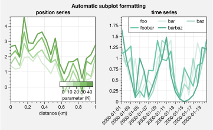

Rc settings control
-------------------

A special object named `~proplot.rcmod.rc`, belonging to the
`~proplot.rcmod.rc_configurator` class, is created whenever you import
ProPlot. This object gives you advanced control over the look of your
plots. **Use** `~proplot.rcmod.rc` **as your one-stop shop for
changing global settings**.

To modify a setting for just one subplot, pass it to the
`~proplot.axes.BaseAxes.format` command. To reset everything to the
default state, use `~proplot.rcmod.rc_configurator.reset`. See the
`~proplot.rcmod` documentation for more information.

.. code:: ipython3

    import proplot as plot
    import numpy as np
    # A bunch od different ways to update settings
    plot.rc.cycle = 'colorblind'
    plot.rc.linewidth = 1.5
    plot.rc.update({'fontname': 'DejaVu Sans'})
    plot.rc['figure.facecolor'] = 'gray3'
    plot.rc['axes.facecolor'] = 'gray5'
    # Make plot
    f, axs = plot.subplots(ncols=2, aspect=1, width=6, span=0, sharey=2)
    N, M = 100, 6
    values = np.arange(1,M+1)
    for i,ax in enumerate(axs):
        data = np.cumsum(np.random.rand(N,M)-0.5, axis=0)
        lines = ax.plot(data, linewidth=3, cycle=('C0','C1',data.shape[1]), cycle_kw={'fade':80}) # see "Changing the color cycle" for details
    axs.format(ytickloc='both', ycolor='blue7',
               hatch='xxx', hatchcolor='w',
               xlabel='x label', ylabel='y label',
               yticklabelloc='both',
               suptitle='Applying new rc settings')
    ay = axs[-1].twinx()
    ay.format(ycolor='r', ylabel='secondary axis')
    ay.plot((np.random.rand(100)-0.2).cumsum(), color='r', lw=3)

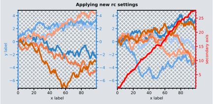

Font control
------------

Deja Vu Sans is the default matplotlib font, but IMHO it ain’t pretty.
ProPlot adds all of the fonts below and makes Helvetica the default, as
in MATLAB. Generally speaking, simple, clean sans-serif fonts are more
appropriate for figures than serif fonts. You can also register your own
fonts by adding ``.ttf`` and ``.otf`` files to the ``~/.proplot/fonts``
directory and calling `~proplot.fonttools.register_fonts` (also called
on import). To change the default font, use the `~proplot.rcmod.rc`
object or by modifying your ``~/.proplotrc``. See the
`~proplot.fonttools` and `~proplot.rcmod` documentation for more
info.

.. code:: ipython3

    import proplot as plot
    size = 12
    plot.rc.small = plot.rc.large = size
    fonts = ['DejaVu Sans', 'Arial', 'Avenir', 'Franklin Gothic Book', 'Frutiger', 'Futura',
             'Gotham', 'Helvetica', 'Helvetica Neue', 'Geneva', 'Gill Sans',
             'Lucida Grande', 'Noto Sans', 'Myriad Pro', 'Open Sans', 'Optima', 'Tahoma', 'Univers', 'Verdana']
    math = r'(0) + {1} - [2] * <3> / 4,0 $\geq\gg$ 5.0 $\leq\ll$ ~6 $\times$ 7 $\equiv$ 8 $\approx$ 9 $\propto$'
    greek = r'$\alpha\beta$ $\Gamma\gamma$ $\Delta\delta$ $\epsilon\zeta\eta$ $\Theta\theta$ $\kappa\mu\nu$ $\Lambda\lambda$ $\Pi\pi$ $\xi\rho\tau\chi$ $\Sigma\sigma$ $\Phi\phi$ $\Psi\psi$ $\Omega\omega$ !?&#%'
    # letters = 'Aa Bb Cc Dd Ee Ff Gg Hh Ii Jj Kk Ll Mm Nn Oo Pp Qq Rr Ss Tt Uu Vv Ww Xx Yy Zz'
    letters = 'quick brown fox jumps over the lazy dog QUICK BROWN FOX JUMPS OVER THE LAZY DOG'
    for weight in ('normal',):
        f, axs = plot.subplots(ncols=1, nrows=len(fonts), flush=True, axwidth=7.5, axheight=3.5*size/72)
        axs.format(xloc='neither', yloc='neither', xlocator='null', ylocator='null', alpha=0)
        axs[0].format(title='Fonts demo', titlepos='ol', titleweight='bold')
        for i,ax in enumerate(axs):
            font = fonts[i]
            plot.rc.fontname = font
            ax.text(0, 0.5, f'{font}: {letters}\n{math} {greek}', weight=weight, ha='left', va='center')

Plotting enhancements
---------------------

Various matplotlib plotting commands have new features thanks to a set
of wrapper functions (see the `~proplot.axes` documentation). The most
interesting of these are `~proplot.wrappers.cmap_wrapper` and
`~proplot.wrappers.cycle_wrapper`. For details on the former, see
:ref:`On-the-fly colormaps`. For details on the latter, see
:ref:`On-the-fly color cycles`. Here we document *other* features
enabled by the plotting wrappers, staring with
`~matplotlib.axes.Axes.plot`.

`~matplotlib.axes.Axes.plot` now accepts a ``cmap`` keyword – this
lets you draw line collections that map individual segments of the line
to individual colors. This can be useful for drawing “parametric” plots,
where you want to indicate the time or some other coordinate at each
point on the line. See `~proplot.axes.BaseAxes.cmapline` for details.

.. code:: ipython3

    import proplot as plot
    import numpy as np
    f, axs = plot.subplots(span=False, share=False, ncols=2, wratios=(2,1), axcolorbars='b', axwidth='5cm', aspect=(2,1))
    ax = axs[0]
    m = ax.plot((np.random.rand(50)-0.5).cumsum(), np.random.rand(50),
                cmap='thermal', values=np.arange(50), lw=7, extend='both')
    ax.format(xlabel='xlabel', ylabel='ylabel', title='Line with smooth color gradations', titleweight='bold')
    ax.bpanel.colorbar(m, label='parametric coordinate', locator=5)
    N = 12
    ax = axs[1]
    values = np.arange(1, N+1)
    radii = np.linspace(1,0.2,N)
    angles = np.linspace(0,4*np.pi,N)
    x = radii*np.cos(1.4*angles)
    y = radii*np.sin(1.4*angles)
    m = ax.plot(x, y, values=values,
                linewidth=15, interp=False, cmap='thermal')
    ax.format(xlim=(-1,1), ylim=(-1,1), title='With step gradations', titleweight='bold',
              xlabel='cosine angle', ylabel='sine angle')
    ax.bpanel.colorbar(m, locator=None, label=f'parametric coordinate')

.. image:: showcase/showcase_31_1.svg

`~proplot.wrappers.cycle_wrapper` can be used to change arbitrary
properties in the property cycle – not just color. Below, a single-color
dash style cycler is used by passing a ``cycle_kw`` dictionary to
`~matplotlib.axes.Axes.plot`. To change the local property cycle, you
can also pass the `~cycler.Cycler` returned by
`~proplot.colortools.Cycle` to
`~matplotlib.axes.Axes.set_prop_cycle`. To change it globally, set the
relevant `~proplot.rcmod.rc` property with
``plot.rc['axes.prop_cycle'] = cycle``.

Thanks to `~proplot.wrappers.scatter_wrapper` and
`~proplot.wrappers.cycle_wrapper`, `~matplotlib.axes.Axes.scatter`
now accepts 2D arrays, just like `~matplotlib.axes.Axes.plot`. Also,
successive calls to `~matplotlib.axes.Axes.scatter` can apply property
cycle keys other than ``color`` – for example, ``marker`` and
``markersize``. `~matplotlib.axes.Axes.scatter` also now optionally
accepts keywords that look like the `~matplotlib.axes.Axes.plot`
keywords, which is a bit less confusing.

.. code:: ipython3

    import proplot as plot
    import numpy as np
    import pandas as pd
    f, axs = plot.subplots(ncols=3, share=1)
    # Plot demo
    x = (np.random.rand(20)-0).cumsum()
    data = (np.random.rand(20,4)-0.5).cumsum(axis=0)
    data = pd.DataFrame(data, columns=pd.Index(['a','b','c','d'], name='label'))
    ax = axs[0]
    ax.format(title='Plot without color cycle', suptitle='Demo of minor features')
    cycle = plot.Cycle(dashes=[(1,0.5),(1,1.5),(3,1.5),(3,3)])
    obj = ax.plot(x, data, lw=2, legend='ul', legend_kw={'ncols':2}, cycle=cycle)
    # Scatter demo
    ax = axs[1]
    ax.format(title='Scatter prop cycle')
    obj = ax.scatter(x, data, legend='ul', cycle='538', legend_kw={'ncols':2},
                    cycle_kw={'marker':['x','o','x','o'], 'markersize':[5,10,20,30]})
    ax = axs[2]
    ax.format(title='Scatter with colormap')
    data = (np.random.rand(2,100)-0.5)
    obj = ax.scatter(*data, color=data.sum(axis=0), size=10*(data.sum(axis=0)+1),
                     marker='*', cmap='fire', colorbar='ll', colorbar_kw={'locator':0.5, 'label':'label'})
    axs.format(xlabel='xlabel', ylabel='ylabel')

.. image:: showcase/showcase_33_0.svg

`~proplot.wrappers.bar_wrapper` and
`~proplot.wrappers.cycle_wrapper` make it easier to generate useful
bar plots. You can now pass 2d arrays to `~matplotlib.axes.Axes.bar`
or `~matplotlib.axes.Axes.barh`, and columns of data will be grouped
or stacked together. You can also request that columns are interpreted
as data ranges, with the means or medians represented by bars and the
spread represented by error bars.

.. code:: ipython3

    import proplot as plot
    import numpy as np
    import pandas as pd
    plot.rc['title.pos'] = 'ci'
    plot.rc['axes.ymargin'] = plot.rc['axes.xmargin'] = 0.05
    f, axs = plot.subplots(nrows=3, aspect=2, axwidth=3, span=False, share=False)
    data = np.random.rand(5,5).cumsum(axis=0).cumsum(axis=1)[:,::-1]
    data = pd.DataFrame(data, columns=pd.Index(np.arange(1,6), name='column'), index=pd.Index(['a','b','c','d','e'], name='row idx'))
    ax = axs[0]
    obj = ax.bar(data, cycle='Reds', cycle_kw={'left':0.2}, colorbar='ul', colorbar_kw={'frameon':False})
    ax.format(xlocator=1, xminorlocator=0.5, ytickminor=False, title='Side-by-side', suptitle='Bar plot wrapper demo')
    ax = axs[1]
    obj = ax.barh(data.iloc[::-1,:], cycle='Grays', legend='ur', stacked=True)
    ax.format(title='Stacked')
    ax = axs[2]
    obj = ax.barh(data, color='red orange', means=True)
    ax.format(title='Column statistics')

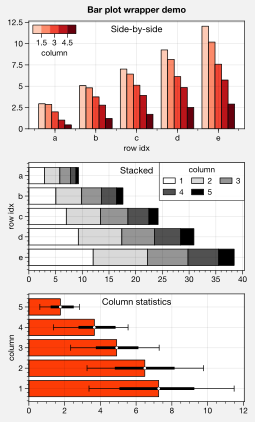

Make area plots with the convenient aliases
`~proplot.axes.BaseAxes.area` and `~proplot.axes.BaseAxes.areax`.
These point to the `~matplotlib.axes.Axes.fill_between` and
`~matplotlib.axes.Axes.fill_betweenx` methods, which are wrapped with
`~proplot.wrappers.fill_between_wrapper` and
`~proplot.wrappers.fill_betweenx_wrapper`. The wrappers enable
“stacking” successive columns of a 2D input array like in `pandas`,
and add a new “``negpos``” keyword for creating area plots with
different colors where the area boundaries cross each other.

.. code:: ipython3

    import proplot as plot
    import numpy as np
    f, axs = plot.subplots(array=[[1,2],[3,3]], hratios=(1,0.8), span=False, share=0)
    axs.format(xlabel='xlabel', ylabel='ylabel', suptitle='Area plot demo')
    data = np.random.rand(5,3).cumsum(axis=0)
    ax = axs[0]
    ax.areax(np.arange(5), data, data + np.random.rand(5)[:,None], stacked=False, alpha=0.5,
            legend='uc', legend_kw={'center':True, 'ncols':2, 'labels':['z','y','qqqq']},
            )
    ax.format(title='Fill between columns')
    ax = axs[1]
    ax.area(data, stacked=True, alpha=0.8,
            legend='ul', legend_kw={'center':True, 'ncols':2, 'labels':['z','y','qqqq']},
            )
    ax.format(title='Stack between columns')
    ax = axs[2]
    data = 5*(np.random.rand(20)-0.5)
    ax.area(np.arange(len(data)), 0, data, negpos=True, negcolor='blue7', poscolor='red7')
    ax.format(title='Negative and positive data', xlabel='xlabel', ylabel='ylabel')

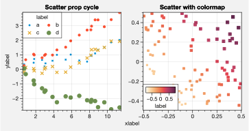

`~matplotlib.axes.Axes.boxplot` and
`~matplotlib.axes.Axes.violinplot` are now wrapped with
`~proplot.wrappers.boxplot_wrapper`,
`~proplot.wrappers.violinplot_wrapper`, and
`~proplot.wrappers.cycle_wrapper`, making it much easier to plot
distributions of data with aesthetically pleasing default settings and
automatic axis labeling.

.. code:: ipython3

    import proplot as plot
    import numpy as np
    import pandas as pd
    f, axs = plot.subplots(ncols=2)
    data = np.random.normal(size=(20,5)) + 2*(np.random.rand(20,5)-0.5)
    data = pd.DataFrame(data, columns=pd.Index(['a','b','c','d','e'], name='xlabel'))
    ax = axs[0]
    obj1 = ax.boxplot(data, lw=0.7, marker='x', fillcolor='gray5', medianlw=1, mediancolor='k')#, boxprops={'color':'C0'})#, labels=data.columns)
    ax.format(title='Box plots', titlepos='ci')
    ax = axs[1]
    obj2 = ax.violinplot(data, lw=0.7, fillcolor='gray7', showmeans=True)
    ax.format(title='Violin plots', titlepos='ci')
    axs.format(ymargin=0.1, xmargin=0.1, suptitle='Boxes and violins demo')

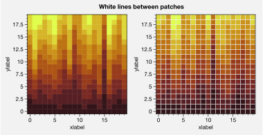

`~proplot.wrappers.cmap_wrapper` assigns the
`~proplot.colortools.BinNorm` “meta-normalizer” as the data normalizer
for all colormap plots. This allows for discrete levels in all
situations – that is, `~matplotlib.axes.Axes.pcolor` and
`~matplotlib.axes.Axes.pcolormesh` now accept a ``levels`` keyword
arg, just like `~matplotlib.axes.Axes.contourf`.
`~proplot.colortools.BinNorm` also ensures the colorbar colors span
the entire colormap range, and that “cyclic” colorbar colors are
distinct on each end. `~proplot.wrappers.cmap_wrapper` also fixes the
well-documented
`white-lines-between-filled-contours <https://stackoverflow.com/q/8263769/4970632>`__
and
`white-lines-between-pcolor-rectangles <https://stackoverflow.com/q/27092991/4970632>`__
issues by automatically changing the edge colors after
`~matplotlib.axes.Axes.contourf`, `~matplotlib.axes.Axes.pcolor`,
and `~matplotlib.axes.Axes.pcolormesh` are called. To disable this
behavior, use ``edgefix=False``.

.. code:: ipython3

    import proplot as plot
    import numpy as np
    f, axs = plot.subplots(ncols=5, width=8, wratios=(5,3,3,3,3), axcolorbars='b')
    axs.format(suptitle='Colorbar color range demo')
    levels = plot.arange(0,360,45)
    data = 20*(np.random.rand(20,20) - 0.4).cumsum(axis=0).cumsum(axis=1) % 360
    ax = axs[0]
    ax.contourf(data, levels=levels, cmap='phase', extend='neither', colorbar='b')
    ax.format(title='Cyclic map with separate ends')
    for ax,extend in zip(axs[1:], ('min','max','neither','both')):
        ax.contourf(data, levels=levels, cmap='spectral', extend=extend, colorbar='b', colorbar_kw={'locator':90})
        ax.format(title=f'Map with extend={extend}')

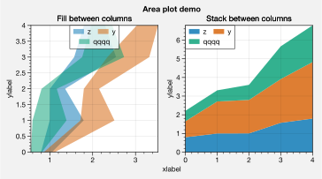

.. code:: ipython3

    import proplot as plot
    import numpy as np
    f, axs = plot.subplots(ncols=2, axwidth=1.5, axcolorbars={1:'l', 2:'r'})
    cmap = 'orange5'
    data = np.random.rand(20,20)
    axs.format(suptitle='Pcolor with levels demo')
    ax = axs[0]
    ax.pcolor(data, cmap=cmap, colorbar='l', vmin=0, vmax=1, levels=200, colorbar_kw={'locator':0.2})
    ax.format(title='Fine transitions', yformatter='null')
    ax = axs[1]
    ax.pcolor(data, cmap=cmap, colorbar='r', levels=np.linspace(0,1,6), colorbar_kw={'locator':0.2})
    ax.format(title='Discernible levels')

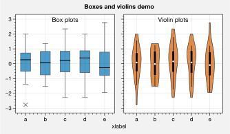

If you pass unevenly spaced ``levels``, the
`~proplot.colortools.LinearSegmentedNorm` normalizer is applied by
default. This results in even color gradations across *indices* of the
level list, no matter their spacing. To use an arbitrary colormap
normalizer, just pass ``norm`` and optionally ``norm_kw`` to a command
wrapped by `~proplot.wrappers.cmap_wrapper`. These arguments are
passed to the `~proplot.colortools.Norm` constructor.

.. code:: ipython3

    import proplot as plot
    import numpy as np
    f, axs = plot.subplots(colorbars='b', ncols=2, axwidth=2.5, aspect=1.5)
    data = 10**(2*np.random.rand(20,20).cumsum(axis=0)/7)
    ticks = [5, 10, 20, 50, 100, 200, 500, 1000]
    for i,(norm,title) in enumerate(zip(('linear','segments'),('Linear normalizer','LinearSegmentedNorm (default)'))):
        m = axs[i].contourf(data, values=ticks, extend='both', cmap='blue2', norm=norm)
        f.bpanel[i].colorbar(m, label='clabel', locator=ticks, fixticks=False)
        axs[i].format(title=title)
    axs.format(suptitle='Level normalizers demo')

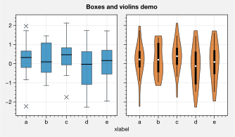

To add `~matplotlib.axes.Axes.clabel` labels to
`~matplotlib.axes.Axes.contour` plots or add grid box labels to
`~matplotlib.axes.Axes.pcolor` and
`~matplotlib.axes.Axes.pcolormesh` plots, just pass ``labels=True`` to
any command wrapped by `~proplot.wrappers.cmap_wrapper`. For grid box
labels, the label color is automatically chosen based on the luminance
of the underlying box color.

.. code:: ipython3

    import proplot as plot
    import numpy as np
    f, axs = plot.subplots(ncols=2, span=False, share=False)
    data = np.random.rand(7,7)
    axs.format(suptitle='Labels demo')
    ax = axs[0]
    m = ax.pcolormesh(data, cmap='greys', labels=True, levels=100)
    ax.format(xlabel='xlabel', ylabel='ylabel', title='Pcolor plot with labels')
    ax = axs[1]
    m = ax.contourf(data.cumsum(axis=0), cmap='greys', cmap_kw={'right':0.8})
    m = ax.contour(data.cumsum(axis=0), color='k', labels=True)
    ax.format(xlabel='xlabel', ylabel='ylabel', title='Contour plot with labels')

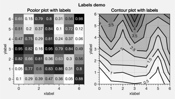

