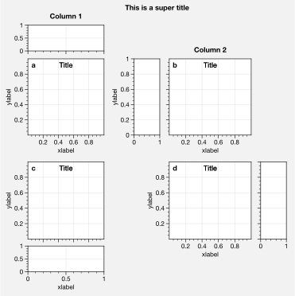
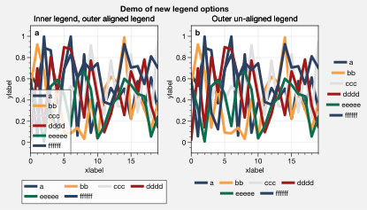

Plotting and panels
===================

Various native matplotlib plotting methods have been enhanced using
wrapper functions (see the `~proplot.axes` documentation). The most
interesting of these are `~proplot.wrappers.cmap_wrapper` and
`~proplot.wrappers.cycle_wrapper`. For details on the former, see
:ref:`On-the-fly colormaps`. For details on the latter, see
:ref:`On-the-fly color cycles`. This section documents *other*
features enabled by the plotting wrappers, along with axes and figure
“panels”.

1d plot wrappers
----------------

`~matplotlib.axes.Axes.plot` now accepts a ``cmap`` keyword – this
lets you draw line collections that map individual segments of the line
to individual colors. This can be useful for drawing “parametric” plots,
where you want to indicate the time or some other coordinate at each
point on the line. See `~proplot.axes.BaseAxes.cmapline` for details.

.. code:: ipython3

    import proplot as plot
    import numpy as np
    f, axs = plot.subplots(span=False, share=False, ncols=2, wratios=(2,1), axcolorbars='b', axwidth='5cm', aspect=(2,1))
    ax = axs[0]
    m = ax.plot((np.random.rand(50)-0.5).cumsum(), np.random.rand(50),
                cmap='thermal', values=np.arange(50), lw=7, extend='both')
    ax.format(xlabel='xlabel', ylabel='ylabel', title='Line with smooth color gradations', titleweight='bold')
    ax.bpanel.colorbar(m, label='parametric coordinate', locator=5)
    N = 12
    ax = axs[1]
    values = np.arange(1, N+1)
    radii = np.linspace(1,0.2,N)
    angles = np.linspace(0,4*np.pi,N)
    x = radii*np.cos(1.4*angles)
    y = radii*np.sin(1.4*angles)
    m = ax.plot(x, y, values=values,
                linewidth=15, interp=False, cmap='thermal')
    ax.format(xlim=(-1,1), ylim=(-1,1), title='With step gradations', titleweight='bold',
              xlabel='cosine angle', ylabel='sine angle')
    ax.bpanel.colorbar(m, locator=None, label=f'parametric coordinate')

.. image:: showcase/showcase_33_1.svg

`~proplot.wrappers.cycle_wrapper` is primarily meant to let you easily
change the color cycle, but it can also change arbitrary properties in
the property cycle. It is used below by passing a ``cycle_kw``
dictionary to `~matplotlib.axes.Axes.plot`, enabling a single-color
dash style cycler. You can also get a `~cycler.cycler` object directly
by calling the `~proplot.colortools.Cycle` command, and apply it to
axes with `~matplotlib.axes.Axes.set_prop_cycle`.

.. code:: ipython3

    import proplot as plot
    import numpy as np
    import pandas as pd
    f, axs = plot.subplots(ncols=1, share=1)
    x = (np.random.rand(20)-0).cumsum()
    data = (np.random.rand(20,4)-0.5).cumsum(axis=0)
    data = pd.DataFrame(data, columns=['a','b','c','d'])
    ax = axs[0]
    ax.format(title='Plot without color cycle', titleweight='bold')
    obj = ax.plot(x, data, lw=2, legend='ul', legend_kw={'ncols':2}, cycle_kw={'dashes':[(1,0.5),(1,1.5),(3,1.5),(3,3)]})

.. image:: showcase/showcase_35_0.svg

Thanks to `~proplot.wrappers.scatter_wrapper` and
`~proplot.wrappers.cycle_wrapper`, `~matplotlib.axes.Axes.scatter`
now accepts 2D arrays like `~matplotlib.axes.Axes.plot`, and
successive calls to `~matplotlib.axes.Axes.scatter` can apply property
cycle keys other than ``color`` – for example, ``marker`` and
``markersize``. `~matplotlib.axes.Axes.scatter` also now optionally
accepts keywords that look like the `~matplotlib.axes.Axes.plot`
keywords, which is a bit less confusing.

.. code:: ipython3

    import proplot as plot
    import numpy as np
    import pandas as pd
    f, axs = plot.subplots(ncols=2, share=1)
    x = (np.random.rand(20)-0).cumsum()
    data = (np.random.rand(20,4)-0.5).cumsum(axis=0)
    data = pd.DataFrame(data, columns=pd.Index(['a','b','c','d'], name='label'))
    ax = axs[0]
    ax.format(title='Scatter prop cycle')
    obj = ax.scatter(x, data, legend='ul', cycle='538', legend_kw={'ncols':2},
                    cycle_kw={'marker':['x','o','x','o'], 'markersize':[5,10,20,30]})
    ax = axs[1]
    ax.format(title='Scatter with colormap')
    data = (np.random.rand(2,100)-0.5)
    obj = ax.scatter(*data, color=data.sum(axis=0), size=10*(data.sum(axis=0)+1),
                     marker='s', cmap='fire', colorbar='ll', colorbar_kw={'locator':0.5, 'label':'label'})
    axs.format(xlabel='xlabel', ylabel='ylabel', titleweight='bold')

.. image:: showcase/showcase_37_0.svg

`~proplot.wrappers.bar_wrapper` and
`~proplot.wrappers.cycle_wrapper` make it easier to generate useful
bar plots. You can now pass 2d arrays to `~matplotlib.axes.Axes.bar`
or `~matplotlib.axes.Axes.barh`, and columns of data will be grouped
or stacked together. You can also request that columns are interpreted
as data ranges, and use bars to plot the medians with error bars
representing percentile ranges.

.. code:: ipython3

    import proplot as plot
    import numpy as np
    import pandas as pd
    plot.rc['title.pos'] = 'ci'
    plot.rc['axes.ymargin'] = plot.rc['axes.xmargin'] = 0.05
    f, axs = plot.subplots(nrows=3, aspect=2, axwidth=3, span=False, share=False)
    data = np.random.rand(5,5).cumsum(axis=0).cumsum(axis=1)[:,::-1]
    data = pd.DataFrame(data, columns=pd.Index(np.arange(1,6), name='column'), index=pd.Index(['a','b','c','d','e'], name='row idx'))
    ax = axs[0]
    obj = ax.bar(data, cycle='Reds', colorbar='ul', colorbar_kw={'frameon':False})
    ax.format(xlocator=1, xminorlocator=0.5, ytickminor=False, title='Side-by-side', suptitle='Bar plot wrapper demo')
    ax = axs[1]
    obj = ax.barh(data.iloc[::-1,:], cycle='Grays', legend='ur', stacked=True)
    ax.format(title='Stacked')
    ax = axs[2]
    obj = ax.barh(data.iloc[:,:], color='red orange', means=True)
    ax.format(title='Column statistics')

.. image:: showcase/showcase_39_0.svg

`~matplotlib.axes.Axes.boxplot` and
`~matplotlib.axes.Axes.violinplot` are now wrapped with
`~proplot.wrappers.boxplot_wrapper`,
`~proplot.wrappers.violinplot_wrapper`, and
`~proplot.wrappers.cycle_wrapper`, making it much easier to plot
distributions of data with aesthetically pleasing default settings and
automatic axis labelling.

.. code:: ipython3

    import proplot as plot
    import numpy as np
    import pandas as pd
    f, axs = plot.subplots(ncols=2)
    data = np.random.normal(size=(20,5))
    data = pd.DataFrame(data, columns=pd.Index(['a','b','c','d','e'], name='xlabel'))
    ax = axs[0]
    obj1 = ax.boxplot(data, lw=0.7, marker='x', color='gray7', medianlw=1, mediancolor='k')#, boxprops={'color':'C0'})#, labels=data.columns)
    ax.format(title='Box plots', titlepos='ci')
    ax = axs[1]
    obj2 = ax.violinplot(data, lw=0.7, fillcolor='C1', showmeans=True)
    ax.format(title='Violin plots', titlepos='ci')
    axs.format(ymargin=0.1, xmargin=0.1, suptitle='Boxes and violins demo')

.. image:: showcase/showcase_41_0.svg

2d plot wrappers
----------------

`~proplot.wrappers.cmap_wrapper` assigns the
`~proplot.colortools.BinNorm` “meta-normalizer” as the data normalizer
for all plots. This allows for discrete levels in all situations – that
is, `~matplotlib.axes.Axes.pcolor` and
`~matplotlib.axes.Axes.pcolormesh` now accept a ``levels`` keyword
arg, just like `~matplotlib.axes.Axes.contourf`.
`~proplot.colortools.BinNorm` also ensures the colorbar colors span
the entire colormap range, and that “cyclic” colorbar colors are
distinct on each end.

`~proplot.wrappers.cmap_wrapper` also fixes the well-documented
`white-lines-between-filled-contours <https://stackoverflow.com/q/8263769/4970632>`__
and
`white-lines-between-pcolor-rectangles <https://stackoverflow.com/q/27092991/4970632>`__
issues by automatically changing the edge colors after
`~matplotlib.axes.Axes.contourf`, `~matplotlib.axes.Axes.pcolor`,
and `~matplotlib.axes.Axes.pcolormesh` are called. Use
``edgefix=False`` to disable this behavior.

.. code:: ipython3

    import proplot as plot
    import numpy as np
    f, axs = plot.subplots(ncols=2, axcolorbars='b')
    axs.format(suptitle='Pcolor demo', titleweight='bold')
    data = 20*(np.random.rand(20,20) - 0.4).cumsum(axis=0).cumsum(axis=1) % 360
    N, step = 360, 45
    ax = axs[0]
    m = ax.pcolormesh(data, levels=plot.arange(0,N,0.2), cmap='phase', extend='neither')
    ax.format(title='Pcolor without discernible levels')
    ax.bpanel.colorbar(m, locator=2*step)
    ax = axs[1]
    m = ax.pcolormesh(data, levels=plot.arange(0,N,step), cmap='phase', extend='neither')
    ax.format(title='Pcolor plot with levels')
    ax.bpanel.colorbar(m, locator=2*step)

.. image:: showcase/showcase_44_1.svg

To change the colormap normalizer, just pass ``norm`` and optionally
``norm_kw`` to a command wrapped by `~proplot.wrappers.cmap_wrapper`.
These arguments are passed to the `~proplot.colortools.Norm`
constructor. If you pass unevenly spaced ``levels``,the
`~proplot.colortools.LinearSegmentedNorm` is selected by default. This
results in even color gradations across *indices* of the level list, no
matter their spacing.

.. code:: ipython3

    import proplot as plot
    import numpy as np
    f, axs = plot.subplots(colorbars='b', ncols=2, axwidth=2.5, aspect=1.5)
    data = 10**(2*np.random.rand(20,20).cumsum(axis=0)/7)
    ticks = [5, 10, 20, 50, 100, 200, 500, 1000]
    for i,norm in enumerate(('linear','segments')):
        m = axs[i].contourf(data, values=ticks, extend='both', cmap='mublue', norm=norm)
        f.bpanel[i].colorbar(m, label='clabel', locator=ticks, fixticks=False)
    axs.format(suptitle='Unevenly spaced color levels', collabels=['Linear normalizer', 'LinearSegmentedNorm'])

.. image:: showcase/showcase_46_0.svg

To add `~matplotlib.axes.Axes.clabel` labels to
`~matplotlib.axes.Axes.contour` plots or add grid box labels to
`~matplotlib.axes.Axes.pcolor` and
`~matplotlib.axes.Axes.pcolormesh` plots, just pass ``labels=True`` to
any command wrapped by `~proplot.wrappers.cmap_wrapper`. For grid box
labels, the label color is automatically chosen based on the luminance
of the underlying box color.

.. code:: ipython3

    import proplot as plot
    import numpy as np
    f, axs = plot.subplots(ncols=2, span=False, share=False)
    data = np.random.rand(7,7)
    ax = axs[0]
    m = ax.pcolormesh(data, cmap='greys', labels=True, levels=100)
    ax.format(xlabel='xlabel', ylabel='ylabel', title='Pcolor plot with labels', titleweight='bold')
    ax = axs[1]
    m = ax.contourf(data.cumsum(axis=0), cmap='greys', cmap_kw={'right':0.8})
    m = ax.contour(data.cumsum(axis=0), color='k', labels=True)
    ax.format(xlabel='xlabel', ylabel='ylabel', title='Contour plot with labels', titleweight='bold')

.. image:: showcase/showcase_48_0.svg

Colorbars and legends
---------------------

ProPlot adds several new features to the
`~matplotlib.axes.Axes.legend` and
`~matplotlib.figure.Figure.colorbar` commands, respectively powered by
the `~proplot.wrappers.legend_wrapper` and
`~proplot.wrappers.colorbar_wrapper` wrappers (see documentation for
details).

To generate colorbars, simply use the ``colorbar`` methods on the
`~proplot.axes.BaseAxes` and `~proplot.axes.PanelAxes` classes. When
you call `~proplot.axes.BaseAxes.colorbar` on a
`~proplot.axes.BaseAxes`, an **inset** colorbar is generated. When you
call `~proplot.axes.PanelAxes.colorbar` on a
`~proplot.axes.PanelAxes`, the axes is **filled** with a colorbar (see
:ref:`Axes panels` and :ref:`Figure panels`). You can also generate
colorbars by passing the ``colorbar`` keyword arg to methods wrapped by
`~proplot.colortools.cmap_wrapper` or
`~proplot.colortools.cycle_wrapper`.

.. code:: ipython3

    import proplot as plot
    import numpy as np
    f, ax = plot.subplots(colorbar='b', tight=True, axwidth=2)
    m = ax.contourf((np.random.rand(20,20)).cumsum(axis=0), extend='both', levels=np.linspace(0,10,11), cmap='matter')
    ax.format(xlabel='xlabel', ylabel='ylabel', xlim=(0,19), ylim=(0,19))
    ax.colorbar(m, ticks=2, label='data label', frameon=True)
    ax.colorbar(m, ticks=2, loc='lower left', frameon=False)
    f.bpanel.colorbar(m, label='standard outer colorbar', length=0.9)
    ax.format(suptitle='ProPlot colorbars')

Generating legends is the same as with matplotlib. When you call
`~proplot.axes.PanelAxes.legend` on a `~proplot.axes.PanelAxes`, the
axes is **filled** with a legend (see :ref:`Axes panels` and
:ref:`Figure panels`). That is, a centered legend is drawn and the
axes spines are made invisible. You can also generate legends by passing
the ``legends`` keyword arg to methods wrapped by
`~proplot.colortools.cycle_wrapper`.

Legend entries are now sorted in row-major order by default; you can
switch back to column-major by passing ``order='F'`` to
`~proplot.wrappers.legend_wrapper`. You can also *center legend rows*
with the ``center`` keyword arg, or by passing a list of lists of plot
handles. This is accomplished by stacking multiple single-row,
horizontally centered legends, then manually adding an encompassing
legend frame.

.. code:: ipython3

    import proplot as plot
    import numpy as np
    plot.rc.cycle = 'contrast'
    labels = ['a', 'bb', 'ccc', 'dddd', 'eeeee', 'ffffff']
    f, axs = plot.subplots(ncols=2, legends='b', panels='r', span=False, share=0)
    hs = []
    for i,label in enumerate(labels):
        h = axs.plot(np.random.rand(20), label=label, lw=3)[0]
        hs.extend(h)
    axs[0].legend(order='F', frameon=True, loc='lower left')
    f.bpanel[0].legend(hs, ncols=4, center=False, frameon=True)
    f.bpanel[1].legend(hs, ncols=4, center=True)
    f.rpanel.legend(hs, ncols=1, center=True)
    axs.format(ylim=(-0.1, 1.1), xlabel='xlabel', ylabel='ylabel',
               suptitle='Demo of new legend options')
    for ax,title in zip(axs, ['Inner and outer legends', 'Outer centered-row legends']):
        ax.format(title=title)

A particularly useful `~proplot.wrappers.colorbar_wrapper` feature is
that it does not require a “mappable” object (i.e. the output of
`~matplotlib.axes.Axes.contourf` or similar). It will also accept any
list of objects with ``get_color`` methods (for example, the “handles”
returned by `~matplotlib.axes.Axes.plot`), or a list of color
strings/RGB tuples! A colormap is constructed on-the-fly from the
corresponding colors.

.. code:: ipython3

    import proplot as plot
    import numpy as np
    plot.rc.cycle = 'qual2'
    f, ax = plot.subplots(colorbar='b', axwidth=3, aspect=1.5)
    # plot.rc['axes.labelweight'] = 'bold'
    hs = ax.plot((np.random.rand(12,12)-0.45).cumsum(axis=0), lw=5)
    ax.format(suptitle='Line handle colorbar', xlabel='x axis', ylabel='y axis')
    f.bpanel.colorbar(hs, values=np.arange(0,len(hs)),
                      label='numeric values',
                      tickloc='bottom', # because why not?
                     )

.. image:: showcase/showcase_55_1.svg

Axes panels
-----------

It is common to need “panels” that represent averages across some axis
of the main subplot, or some secondary 1-dimensional dataset. With
ProPlot, you can add arbitrary combinations of panels to the left,
bottom, right, or top sides of axes with the
`~proplot.subplots.subplots` ``axpanels`` keyword arg. To modify panel
properties, simply pass a dictionary to ``axpanels_kw``. The subplots
will stay correctly aligned no matter the combination of panels. See
`~proplot.subplots.subplots` and
`~proplot.subplots.Figure.add_subplot_and_panels` for details.

.. code:: ipython3

    # Arbitrarily complex combinations are possible, and inner spaces still determined automatically
    import proplot as plot
    f, axs = plot.subplots(axwidth=2, nrows=2, ncols=2,
                           axpanels={1:'t', 2:'l', 3:'b', 4:'r'},
                           tight=True, share=0, span=0, wratios=[1,2])
    axs.format(title='Title', suptitle='This is a super title', collabels=['Column 1','Column 2'],
               titlepos='ci', xlabel='xlabel', ylabel='ylabel', abc=True, top=False)
    axs.format(ylocator=plot.arange(0.2,0.8,0.2), xlocator=plot.arange(0.2,0.8,0.2))

.. image:: showcase/showcase_58_0.svg

If you want “colorbar” panels, the simplest option is to use the
``axcolorbar`` and ``axcolorbar_kw`` keywords instead of ``axpanels``
and ``axpanels_kw``. This makes the width of the panels more appropriate
for filling with a colorbar. Similarly, you can also use the
``axlegend`` and ``axlegend_kw`` args. You can modify these default
spacings with a custom ``.proplotrc`` file (see the `~proplot.rcmod`
documentation).

If you want panels “flush” against the subplot, simply use the ``flush``
keyword args. If you want to disable “axis sharing” with the parent
subplot (i.e. you want to draw tick labels on the panel, and do not want
to inherit axis limits from the main subplot), use any of the ``share``
keyword args. Again, see `~proplot.subplots.subplots` and
`~proplot.subplots.Figure.add_subplot_and_panels` for details.

.. code:: ipython3

    import proplot as plot
    import numpy as np
    f, axs = plot.subplots(axwidth=1.7, nrows=2, ncols=2, share=0, span=False, panelpad=0.1,
                           axpanels='r', axcolorbars='b', axpanels_kw={'rshare':False, 'rflush':True})
    axs.format(xlabel='xlabel', ylabel='ylabel', suptitle='This is a super title')
    for i,ax in enumerate(axs):
        ax.format(title=f'Dataset {i+1}')
    data = (np.random.rand(20,20)-0.1).cumsum(axis=1)
    m = axs.contourf(data, cmap='glacial', levels=plot.arange(-1,11))[0]
    axs.rpanel.plot(data.mean(axis=1), np.arange(20), color='k')
    axs.rpanel.format(title='Mean')
    axs.bpanel.colorbar(m, label='cbar')

.. image:: showcase/showcase_60_1.svg

Figure panels
-------------

ProPlot also supports “global” colorbars or legends, meant to reference
multiple subplots at once. Global colorbars and legends can extend
across entire sides of the figure, or across arbitrary contiguous rows
and columns of subplots. The associated axes instances are found on the
`~proplot.subplots.Figure` instance under the names ``bottompanel``,
``leftpanel``, and ``rightpanel`` (or the shorthands ``bpanel``,
``lpanel``, and ``rpanel``). See `~proplot.subplots.subplots` for
details.

.. code:: ipython3

    import proplot as plot
    import numpy as np
    f, axs = plot.subplots(ncols=3, nrows=3, axwidth=1.2, colorbar='br', bspan=[1,2,2])
    m = axs.pcolormesh(np.random.rand(20,20), cmap='grays', levels=np.linspace(0,1,11), extend='both')[0]
    axs.format(suptitle='Super title', abc=True, abcpos='ol', abcformat='a.', xlabel='xlabel', ylabel='ylabel')
    f.bpanel[0].colorbar(m, label='label', ticks=0.5)
    f.bpanel[1].colorbar(m, label='label', ticks=0.2)
    f.rpanel.colorbar(m, label='label', ticks=0.1, length=0.7)

.. image:: showcase/showcase_63_1.svg

.. code:: ipython3

    import proplot as plot
    import numpy as np
    f, axs = plot.subplots(ncols=4, axwidth=1.3, colorbar='b', bspan=[1,1,2,2], share=0, span=0, wspace=0.3)
    data = (np.random.rand(50,50)-0.1).cumsum(axis=0)
    m = axs[:2].contourf(data, cmap='grays', extend='both')
    cycle = plot.colors('grays', 5)
    hs = []
    for abc,color in zip('ABCDEF',cycle):
        h = axs[2:].plot(np.random.rand(10), lw=3, color=color, label=f'line {abc}')
        hs.extend(h[0])
    f.bpanel[0].colorbar(m[0], length=0.8, label='label')
    f.bpanel[1].legend(hs, ncols=5, label='label', frame=False)
    axs.format(suptitle='Global colorbar and global legend', abc=True, abcpos='ol', abcformat='A')
    for ax,title in zip(axs, ['2D dataset #1', '2D dataset #2', 'Line set #1', 'Line set #2']):
        ax.format(xlabel='xlabel', title=title)

.. image:: showcase/showcase_64_0.svg

Stacked panels
--------------

ProPlot also allows arbitrarily *stacking* panels with the ``lstack``,
``bstack``, ``rstack``, and ``tstack`` keyword args. This can be useful
when you want multiple figure colorbars, when you have illustrations
with multiple colormaps inside a single axes, or when you need multiple
panels for displaing various statistics across one dimension of a
primary axes. The stacked panel spacing is adjusted automatically to
account for axis and tick labels. See `~proplot.subplots.subplots` for
details.

.. code:: ipython3

    import proplot as plot
    import numpy as np
    f, axs = plot.subplots(nrows=2, axwidth=0.8, span=False, share=0,
                          axcolorbars='l', axcolorbars_kw={'lstack':3},
                          axpanels='r', axpanels_kw={'rstack':2, 'rflush':True, 'rwidth':0.5}
                          )
    axs[0].format(title='Stacked panel demo', titleweight='bold')
    # Draw stuff in axes
    n = 10
    for ax in axs:
        # Colormap data
        ax.format(xlabel='data', xlocator=np.linspace(0, 0.8, 5))
        for i,(x0,y0,x1,y1,cmap,scale) in enumerate(((0,0.5,1,1,'greys',0.5), (0,0,0.5,0.5,'reds',1), (0.5,0,1,0.5,'blues',2))):
            data = np.random.rand(n,n)*scale
            x, y = np.linspace(x0, x1, 11), np.linspace(y0, y1, 11)
            m = ax.pcolormesh(x, y, data, cmap=cmap, levels=np.linspace(0,scale,11))
            ax.lpanel[i].colorbar(m)
        # Plot data
        for i,pax in enumerate(ax.rpanel):
            func = data.mean if i==0 else data.std
            pax.plot(func(axis=1), plot.arange(0.05, 0.95, 0.1), lw=2, color='k')
            pax.format(xlabel='mean' if i==0 else 'stdev', xlim=(0,1), xlocator=(0,0.5))

.. image:: showcase/showcase_66_0.svg

