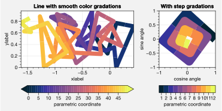
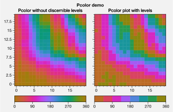
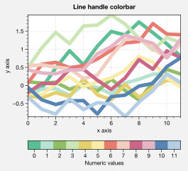
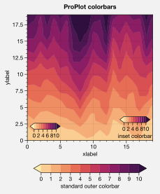
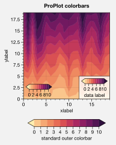
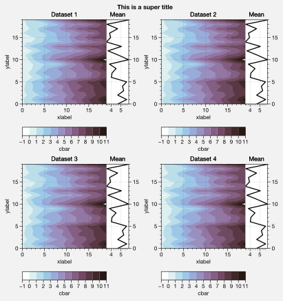
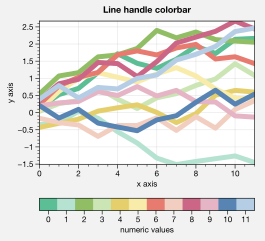
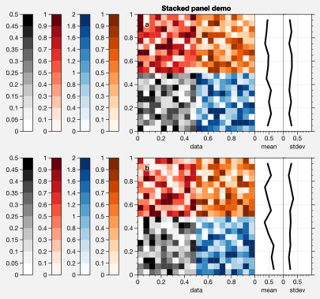

Plotting and panels
===================

2d plot wrappers
----------------

Various native matplotlib plotting methods have been enhanced using
wrapper functions (see the `~proplot.axes` documentation). The most
interesting of these are `~proplot.axes.cmap_wrapper` and
`~proplot.axes.cycle_wrapper`. For details on the former, see the
below examples and :ref:`On-the-fly colormaps`. For details on the
latter, see :ref:`On-the-fly color cycles`.

`~proplot.axes.cmap_wrapper` assigns the
`~proplot.colortools.BinNorm` “meta-normalizer” as the data normalizer
for all plots. This allows for discrete levels in all situations – that
is, `~matplotlib.axes.Axes.pcolor` and
`~matplotlib.axes.Axes.pcolormesh` now accept a ``levels`` keyword
arg, just like `~matplotlib.axes.Axes.contourf`. It was previously
really tricky to implement discrete levels for ``pcolor`` plots, even
though they are arguably preferable for many scientific applications
(discrete levels make it easier to associate particular colors with hard
numbers). `~proplot.colortools.BinNorm` also does some other handy
things, like ensuring that colors on the ends of “cyclic” colormaps are
never the same (see below).

.. code:: ipython3

    import proplot as plot
    import numpy as np
    f, axs = plot.subplots(ncols=2, axcolorbars='b')
    axs.format(suptitle='Pcolor demo', titleweight='bold')
    data = 20*(np.random.rand(20,20) - 0.4).cumsum(axis=0).cumsum(axis=1) % 360
    N, step = 360, 45
    ax = axs[0]
    m = ax.pcolormesh(data, levels=plot.arange(0,N,0.2), cmap='phase', extend='neither')
    ax.format(title='Pcolor without discernible levels')
    ax.bpanel.colorbar(m, locator=2*step)
    ax = axs[1]
    m = ax.pcolormesh(data, levels=plot.arange(0,N,step), cmap='phase', extend='neither')
    ax.format(title='Pcolor plot with levels')
    ax.bpanel.colorbar(m, locator=2*step)

`~proplot.axes.cmap_wrapper` also adds the ability to label
`~matplotlib.axes.Axes.contourf` plots with
`~matplotlib.axes.Axes.clabel` in one go, and the added ability to
label grid boxes in `~matplotlib.axes.Axes.pcolor` and
`~matplotlib.axes.Axes.pcolormesh` plots.

.. code:: ipython3

    import proplot as plot
    import numpy as np
    f, axs = plot.subplots(ncols=2, span=False, share=False)
    data = np.random.rand(7,7)
    ax = axs[0]
    m = ax.pcolormesh(data, cmap='greys', labels=True, levels=100)
    ax.format(xlabel='xlabel', ylabel='ylabel', title='Pcolor plot with labels', titleweight='bold')
    ax = axs[1]
    m = ax.contourf(data.cumsum(axis=0), cmap='greys', cmap_kw={'right':0.8})
    m = ax.contour(data.cumsum(axis=0), color='k', labels=True)
    ax.format(xlabel='xlabel', ylabel='ylabel', title='Contour plot with labels', titleweight='bold')

.. image:: showcase/showcase_35_0.svg

`~proplot.axes.cmap_wrapper` also lets you provide arbitrarily spaced,
monotonically increasing levels, and by default the color gradations
between each number in the level list will be the same, no matter the
step size. This is powered by the
`~proplot.colortools.LinearSegmentedNorm` normalizer, and can be
overridden with the ``norm`` keyword arg, which constructs an arbitrary
normalizer from the `~proplot.colortools.Norm` constructor.

.. code:: ipython3

    import proplot as plot
    import numpy as np
    f, axs = plot.subplots(colorbars='b', ncols=2, axwidth=2.5, aspect=1.5)
    data = 10**(2*np.random.rand(20,20).cumsum(axis=0)/7)
    ticks = [5, 10, 20, 50, 100, 200, 500, 1000]
    for i,norm in enumerate(('linear','segments')):
        m = axs[i].contourf(data, values=ticks, extend='both', cmap='mutedblue', norm=norm)
        f.bpanel[i].colorbar(m, label='clabel', locator=ticks, fixticks=False)
    axs.format(suptitle='Unevenly spaced color levels', collabels=['Linear normalizer', 'LinearSegmentedNorm'])

.. image:: showcase/showcase_37_0.svg

Finally, `~proplot.axes.cmap_wrapper` fixes the well-documented
`white-lines-between-filled-contours <https://stackoverflow.com/q/8263769/4970632>`__
and
`white-lines-between-pcolor-rectangles <https://stackoverflow.com/q/27092991/4970632>`__
issues by automatically changing the edge colors after ``contourf``,
``pcolor``, and ``pcolormesh`` are called. Use ``edgefix=False`` to
disable this behavior (it does slow down figure rendering a bit). Note
that if you manually specify line properties for a ``pcolor`` plot, this
feature is disabled (see below).

.. code:: ipython3

    import proplot as plot
    import numpy as np
    f, axs = plot.subplots(ncols=2, span=False, share=False)
    axs[0].pcolormesh(np.random.rand(20,20).cumsum(axis=0), cmap='solar') # fixed bug
    axs[1].pcolormesh(np.random.rand(20,20).cumsum(axis=0), cmap='solar', lw=0.5, color='gray2') # deliberate lines
    axs.format(xlabel='xlabel', ylabel='ylabel', suptitle='White lines between patches')

.. image:: showcase/showcase_39_0.svg

1d plot wrappers
----------------

`~matplotlib.axes.Axes.plot` now accepts a ``cmap`` keyword – this
lets you draw line collections that map individual segments of the line
to individual colors. This can be useful for drawing “parametric” plots,
where you want to indicate the time or some other coordinate at each
point on the line. See `~proplot.axes.BaseAxes.cmapline` for details.

.. code:: ipython3

    import proplot as plot
    import numpy as np
    f, axs = plot.subplots(span=False, share=False, ncols=2, wratios=(2,1), axcolorbars='b', axwidth=3, aspect=(2,1))
    ax = axs[0]
    m = ax.plot((np.random.rand(50)-0.5).cumsum(), np.random.rand(50),
                cmap='thermal', values=np.arange(50), lw=7, extend='both')
    ax.format(xlabel='xlabel', ylabel='ylabel', title='Line with smooth color gradations', titleweight='bold')
    ax.bpanel.colorbar(m, label='parametric coordinate', locator=5)
    N = 12
    ax = axs[1]
    values = np.arange(1, N+1)
    radii = np.linspace(1,0.2,N)
    angles = np.linspace(0,4*np.pi,N)
    x = radii*np.cos(1.4*angles)
    y = radii*np.sin(1.4*angles)
    m = ax.plot(x, y, values=values,
                linewidth=15, interp=False, cmap='thermal')
    ax.format(xlim=(-1,1), ylim=(-1,1), title='With step gradations', titleweight='bold',
              xlabel='cosine angle', ylabel='sine angle')
    ax.bpanel.colorbar(m, locator=None, label=f'parametric coordinate')

Colorbars and legends
---------------------

ProPlot adds several new features to the
`~matplotlib.axes.Axes.legend` and
`~matplotlib.figure.Figure.colorbar` commands, respectively powered by
the `~proplot.axes.legend` and `~proplot.axes.colorbar` functions
(see documentation for usage information).

I’ve also added ``colorbar`` methods to the `~proplot.axes.BaseAxes`
and special `~proplot.axes.PanelAxes` axes. When you call
`~proplot.axes.BaseAxes.colorbar` on a `~proplot.axes.BaseAxes`, an
**inset** colorbar is generated. When you call
`~proplot.axes.PanelAxes.colorbar` on a `~proplot.axes.PanelAxes`,
the axes is **filled** with a colorbar. See
`~proplot.subplots.subplots` and
`~proplot.subplots.Figure.add_subplot_and_panels` for more on panels.

.. code:: ipython3

    import proplot as plot
    import numpy as np
    f, ax = plot.subplots(colorbar='b', tight=True, axwidth=2.5)
    m = ax.contourf((np.random.rand(20,20)).cumsum(axis=0), extend='both', levels=np.linspace(0,10,11), cmap='matter')
    ax.format(xlabel='xlabel', ylabel='ylabel', xlim=(0,19), ylim=(0,19))
    ax.colorbar(m, ticks=2, label='inset colorbar')
    ax.colorbar(m, ticks=2, loc='lower left')
    f.bpanel.colorbar(m, label='standard outer colorbar', length=0.9)
    ax.format(suptitle='ProPlot colorbars')

.. image:: showcase/showcase_45_0.svg

A particularly useful `~proplot.axes.colorbar_factory` feature is that
it does not require a “mappable” object (i.e. the output of
`~matplotlib.axes.Axes.contourf` or similar). It will also accept any
list of objects with ``get_color`` methods (for example, the “handles”
returned by `~matplotlib.axes.Axes.plot`), or a list of color
strings/RGB tuples! A colormap is constructed on-the-fly from the
corresponding colors.

.. code:: ipython3

    import proplot as plot
    import numpy as np
    f, ax = plot.subplots(colorbar='b', axwidth=3, aspect=1.5)
    plot.rc.cycle = 'qual2'
    # plot.rc['axes.labelweight'] = 'bold'
    hs = ax.plot((np.random.rand(12,12)-0.45).cumsum(axis=0), lw=5)
    ax.format(suptitle='Line handle colorbar', xlabel='x axis', ylabel='y axis')
    f.bpanel.colorbar(hs, values=np.arange(0,len(hs)),
                      label='Numeric values',
                      tickloc='bottom', # because why not?
                     )

As shown below, when you call `~proplot.axes.PanelAxes.legend` on a
`~proplot.axes.PanelAxes`, the axes is **filled** with a legend – that
is, a centered legend is drawn, and the axes patch and spines are made
invisible.

Some other notes: legend entries are now sorted in *row-major* order by
default (not sure why the matplotlib authors chose column-major), and
this is configurable with the ``order`` keyword arg. You can also
disable vertical alignment of legend entries with the ``align`` keyword
arg, or by passing a list of lists of plot handles. Under the hood, this
is done by stacking multiple single-row, horizontally centered legends
and forcing the background to be invisible.

.. code:: ipython3

    import proplot as plot
    import numpy as np
    plot.rc.cycle = 'intersection'
    labels = ['a', 'bb', 'ccc', 'dddd', 'eeeee', 'ffffff']
    f, axs = plot.subplots(ncols=2, legends='b', panels='r', span=False, share=0)
    hs = []
    for i,label in enumerate(labels):
        h = axs.plot(np.random.rand(20), label=label, lw=3)[0]
        hs.append(h)
    axs[0].legend(order='F', frameon=True, loc='lower left')
    f.bpanel[0].legend(hs, ncols=4, align=True, frameon=True)
    f.bpanel[1].legend(hs, ncols=4, align=False)
    f.rpanel.legend(hs, ncols=1, align=False)
    axs.format(ylim=(-0.1, 1.1), xlabel='xlabel', ylabel='ylabel',
               suptitle='Demo of new legend options')
    for ax,title in zip(axs, ['Inner legend, outer aligned legend', 'Outer un-aligned legend']):
        ax.format(title=title)

Axes panels
-----------

It is common to need “panels” that represent averages across some axis
of the main subplot, or some secondary 1-dimensional dataset. This is
hard to do with matplotlib, but easy with ProPlot! You can specify
arbitrary combinations of inner panels for specific axes, and ProPlot
will always keep the subplots aligned. See
`~proplot.subplots.subplots` and
`~proplot.subplots.Figure.add_subplot_and_panels` for details.

.. code:: ipython3

    # Arbitrarily complex combinations are possible, and inner spaces still determined automatically
    import proplot as plot
    f, axs = plot.subplots(axwidth=2, nrows=2, ncols=2,
                           axpanels={1:'t', 2:'l', 3:'b', 4:'r'},
                           tight=True, share=0, span=0, wratios=[1,2])
    axs.format(title='Title', suptitle='This is a super title', collabels=['Column 1','Column 2'],
               titlepos='ci', xlabel='xlabel', ylabel='ylabel', abc=True, top=False)
    axs.format(ylocator=plot.arange(0.2,0.8,0.2), xlocator=plot.arange(0.2,0.8,0.2))

If you want “colorbar” panels, the simplest option is to use the
``axcolorbars`` keyword instead of ``axpanels``. This makes the width of
the panels more appropriate for filling with a colorbar. You can modify
these default spacings with a custom ``.proplotrc`` file (see the
`~proplot.rcmod` documentation).

If you want panels “flush” against the subplot, simply use the ``flush``
keyword args. If you want to disable “axis sharing” with the parent
subplot (i.e. you want to draw tick labels on the panel, and do not want
to inherit axis limits from the main subplot), use any of the ``share``
keyword args. Again, see `~proplot.subplots.subplots` and
`~proplot.subplots.Figure.add_subplot_and_panels` for details.

.. code:: ipython3

    import proplot as plot
    import numpy as np
    f, axs = plot.subplots(axwidth=1.7, nrows=2, ncols=2, share=0, span=False, panelpad=0.1,
                           axpanels='r', axcolorbars='b', axpanels_kw={'rshare':False, 'rflush':True})
    axs.format(xlabel='xlabel', ylabel='ylabel', suptitle='This is a super title')
    for i,ax in enumerate(axs):
        ax.format(title=f'Dataset {i+1}')
    data = (np.random.rand(20,20)-0.1).cumsum(axis=1)
    m = axs.contourf(data, cmap='glacial', levels=plot.arange(-1,11))[0]
    axs.rpanel.plot(data.mean(axis=1), np.arange(20), color='k')
    axs.rpanel.format(title='Mean')
    axs.bpanel.colorbar(m, label='cbar')

Figure panels
-------------

It is also common to need “global” colorbars or legends, meant to
reference multiple subplots at once. This is easy to do with ProPlot
too!

The “global” colorbars can extend across every row and column of the
subplot array, or across arbitrary contiguous rows and columns. The
associated axes instances are found on the `~proplot.subplots.Figure`
instance under the names ``bottompanel``, ``leftpanel``, and
``rightpanel`` (you can also use the shorthand ``bpanel``, ``lpanel``,
and ``rpanel``). See `~proplot.subplots.subplots` for details.

.. code:: ipython3

    import proplot as plot
    import numpy as np
    f, axs = plot.subplots(ncols=3, nrows=3, axwidth=1.2, colorbar='br', bspan=[1,2,2])
    m = axs.pcolormesh(np.random.rand(20,20), cmap='grays', levels=np.linspace(0,1,11), extend='both')[0]
    axs.format(suptitle='Super title', abc=True, abcpos='ol', abcformat='a.', xlabel='xlabel', ylabel='ylabel')
    f.bpanel[0].colorbar(m, label='label', ticks=0.5)
    f.bpanel[1].colorbar(m, label='label', ticks=0.2)
    f.rpanel.colorbar(m, label='label', ticks=0.1, length=0.7)

.. code:: ipython3

    import proplot as plot
    import numpy as np
    f, axs = plot.subplots(ncols=4, axwidth=1.3, colorbar='b', bspan=[1,1,2,2], share=0, span=0, wspace=0.3)
    data = (np.random.rand(50,50)-0.1).cumsum(axis=0)
    m = axs[:2].contourf(data, cmap='grays', extend='both')
    cycle = plot.Cycle('grays', 5)
    hs = []
    for abc,color in zip('ABCDEF',cycle):
        hs += axs[2:].plot(np.random.rand(10), lw=3, color=color, label=f'line {abc}')
    f.bpanel[0].colorbar(m, length=0.8, label='label')
    f.bpanel[1].legend(hs, ncols=5, align=True)
    axs.format(suptitle='Global colorbar and global legend', abc=True, abcpos='ol', abcformat='A')
    for ax,title in zip(axs, ['2D dataset #1', '2D dataset #2', 'Line set #1', 'Line set #2']):
        ax.format(title=title)

.. image:: showcase/showcase_58_0.svg

Stacked panels
--------------

ProPlot also allows arbitrarily *stacking* panels with the ``lstack``,
``bstack``, ``rstack``, and ``tstack`` keyword args. This can be useful
when you want multiple figure colorbars, when you have illustrations
with multiple colormaps inside a single axes, or when you need multiple
panels for displaing various statistics across one dimension of a
primary axes.

.. code:: ipython3

    import proplot as plot
    import numpy as np
    f, axs = plot.subplots(nrows=2, axwidth=1, span=False, share=0,
                          axcolorbars='l', axcolorbars_kw={'lstack':4},
                          axpanels='r', axpanels_kw={'rstack':2, 'rflush':True, 'rwidth':0.5}
                          )
    axs[0].format(title='Stacked panel demo', titleweight='bold')
    # Draw stuff in axes
    n = 10
    for ax in axs:
        # Colormap data
        ax.format(xlabel='data', xlocator=np.linspace(0, 0.8, 5))
        for i,(x0,y0,cmap,scale) in enumerate(((0,0,'greys',0.5), (0,0.5,'reds',1), (0.5,0,'blues',2), (0.5,0.5,'oranges',1))):
            data = np.random.rand(n,n)*scale
            x, y = np.linspace(x0, x0+0.5, 11), np.linspace(y0, y0+0.5, 11)
            m = ax.pcolormesh(x, y, data, cmap=cmap, levels=np.linspace(0,scale,11))
            ax.lpanel[i].colorbar(m)
        # Plot data
        for i,pax in enumerate(ax.rpanel):
            func = data.mean if i==0 else data.std
            pax.plot(func(axis=1), plot.arange(0.05, 0.95, 0.1), lw=2, color='k')
            pax.format(xlabel='mean' if i==0 else 'stdev', xlim=(0,1), xlocator=(0,0.5))

