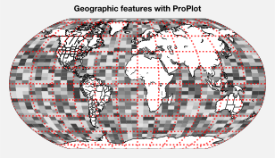

Map projection axes
===================

ProPlot includes seamless integration with the `cartopy` and
`~mpl_toolkits.basemap` packages. This feature is optional – if you
don’t care about cartographic projections, you don’t need to have
`cartopy` or `~mpl_toolkits.basemap` installed.

To specify the projection, supply `~proplot.subplots.subplots` with
the ``proj`` keyword arg. To specify the projection properties, use the
``proj_kw`` keyword arg (see below). To toggle `~mpl_toolkits.basemap`
for arbitrary subplots, use the `basemap` keyword arg. See
`~proplot.subplots.subplots` for details.

Note that in 2020, active development for `~mpl_toolkits.basemap` will
stop. Its users are encouraged to switch to `cartopy`, which is
integrated more closely with the matplotlib API and has more room for
growth. However for the time being, `~mpl_toolkits.basemap` has one
major advantage: meridian and parallel labelling. With `cartopy`,
gridline labels are only possible with equirectangular and Mercator
projections. With `~mpl_toolkits.basemap`, labels are possible with
all projections. Further, the `~matplotlib.axes.Axes.tight_layout`
method does not currently detect `cartopy` gridline labels – so when
labels are present, the :ref:`Automatic subplot spacing` feature must
be automatically disabled.

Table of cartopy projections
----------------------------

Below is an illustration of the available `cartopy` projections. See
the `~proplot.projs` documentation for a table of projection names,
short names, and links to the
`PROJ.4 <https://proj4.org/operations/projections/index.html>`__
documentation (both `cartopy` and `~mpl_toolkits.basemap` are
internally powered by `PROJ.4 <https://proj4.org>`__).

Note that you no longer have to reference the `cartopy.crs.Projection`
classes directly – instead, just like `~mpl_toolkits.basemap`, you can
specify a native PROJ.4 short name (e.g. ``'robin'`` or ``'merc'``).
ProPlot also adds to `cartopy` the previously unavailable Aitoff,
Hammer, Winkel Tripel, and Kavrisky VII projections by subclassing the
`cartopy.crs.Projection` class.

.. code:: ipython3

    import proplot as plot
    import numpy as np
    projs = ['cyl', 'merc', 'mill', 'lcyl', 'tmerc',
             'robin', 'hammer', 'moll', 'kav7', 'aitoff', 'wintri', 'sinu',
             'geos', 'ortho', 'nsper', 'aea', 'eqdc', 'lcc', 'gnom', 'npstere', 'igh',
             'eck1', 'eck2', 'eck3', 'eck4', 'eck5', 'eck6']
    f, axs = plot.subplots(ncols=3, nrows=9, left=0.1, bottom=0.1, right=0.1, top=0.5, proj=projs)
    axs.format(land=True, reso='lo', labels=False, suptitle='Table of cartopy projections')
    for proj,ax in zip(projs,axs):
        ax.format(title=proj, titleweight='bold', labels=False)

.. image:: showcase/showcase_91_1.svg

Table of basemap projections
----------------------------

Below is an illustration of the available `~mpl_toolkits.basemap`
projections. `~mpl_toolkits.basemap` projection bounds are more
limited than `cartopy` bounds, and tend to be “rectangles.” Also, with
the default `~mpl_toolkits.basemap` API, you must specify projection
keyword args *explicitly* or an error is thrown (e.g. failing to set
``lon_0`` or ``lat_0``). To prevent this annoyance, ProPlot passes
default keyword args to `~mpl_toolkits.basemap.Basemap` if you fail to
specify them.

.. code:: ipython3

    import proplot as plot
    import numpy as np
    projs = ['cyl', 'merc', 'mill', 'cea', 'gall', 'sinu',
             'eck4', 'robin', 'moll', 'kav7', 'hammer', 'mbtfpq',
             'geos', 'ortho', 'nsper',
             'vandg', 'aea', 'eqdc', 'gnom', 'cass', 'lcc',
             'npstere', 'npaeqd', 'nplaea', 'spstere', 'spaeqd', 'splaea']
    f, axs = plot.subplots(ncols=3, nrows=9, left=0.1, bottom=0.1, right=0.1, top=0.5, basemap=True, proj=projs)
    axs.format(land=True, labels=False, suptitle='Table of basemap projections')
    for proj,ax in zip(projs,axs):
        ax.format(title=proj, titleweight='bold', labels=False)

.. image:: showcase/showcase_94_0.svg

Geophysical data
----------------

The below demonstrates how to plot geophysical data with ProPlot. You’ll
note that ProPlot considerably simplifies `~mpl_toolkits.basemap`
usage. For data plotted on `~mpl_toolkits.basemap` projections, the
longitudes are *cyclically permuted* so that the “center” aligns with
the central longitude of the projection. You can also simply call the
axes method, e.g. `~matplotlib.axes.Axes.contourf`, instead of calling
the method on the `~mpl_toolkits.basemap.Basemap` instance! And for
`cartopy` axes, you no longer need to pass
``transform=crs.PlateCarree()`` to the plotting method (as I found
myself doing 99% of the time); ProPlot makes this the default. Finally,
for both `~mpl_toolkits.basemap` and `cartopy`, you can pass
``globe=True`` to plotting commands to ensure global data coverage.

These features are powered by the `~proplot.axes.cartopy_gridfix` and
`~proplot.axes.basemap_gridfix` wrappers.

.. code:: ipython3

    import proplot as plot
    import numpy as np
    # First make figure
    offset = -40
    x = plot.arange(0+offset, 360+offset-1, 60)
    y = plot.arange(-60,60+1,30)
    data = np.random.rand(len(y), len(x))
    for globe in (False,True):
        f, axs = plot.subplots(ncols=2, nrows=2, axwidth=3,
                               colorbars='b', proj='hammer', proj_kw={'lon_0':0},
                               basemap={(1,3):False, (2,4):True},
                               )
        for ax,p,pcolor,basemap in zip(axs,range(4),[1,1,0,0],[0,1,0,1]):
            m = None
            cmap = ['sunset', 'sunrise'][basemap]
            levels = [0, .3, .5, .7, .9, 1]
            levels = np.linspace(0,1,11)
            if pcolor:
                m = ax.pcolor(x, y, data, levels=levels, cmap=cmap, extend='neither', globe=globe)
                ax.scatter(np.random.rand(50)*180, 180*np.random.rand(50), color='charcoal')
            if not pcolor:
                m = ax.contourf(x, y, data, levels=levels, cmap=cmap, extend='neither', globe=globe)
                ax.scatter(np.random.rand(50)*180, 180*np.random.rand(50), color='charcoal')
            ax.format(suptitle=f'Hammer projection with globe={globe}', collabels=['Cartopy', 'Basemap'], labels=True)
            if p<2:
                c = f.bpanel[p].colorbar(m, label='values', tickminor=False)

.. image:: showcase/showcase_97_1.svg

.. image:: showcase/showcase_97_2.svg

Projection formatting
---------------------

To pass keywords to `~mpl_toolkits.basemap.Basemap` and
`cartopy.crs.Projection` classes on instantiation, pass a ``proj_kw``
dictionary of keyword args to `~proplot.subplots.subplots`. With
ProPlot, you can supply native PROJ.4 keyword names to the
`cartopy.crs.Projection` classes just like `~mpl_toolkits.basemap`
(e.g. ``lon_0`` instead of ``central_longitude``). This is just meant to
make things a bit less verbose.

To add and stylize geographic features (e.g. coastlines, land, country
borders, and state borders), just use the
`~proplot.axes.BaseAxes.format` method as with ordinary Cartesian
axes. This time, `~proplot.axes.BaseAxes.format` will call the special
`~proplot.axes.MapAxes` `~proplot.axes.MapAxes.smart_update` method.
See `~proplot.subplots.subplots`,
`~proplot.axes.MapAxes.smart_update`, and `~proplot.projs.Proj` for
details.

.. code:: ipython3

    import proplot as plot
    import numpy as np
    N = 40
    f, ax = plot.subplots(axwidth=4, ncols=1, proj='robin', basemap=True)
    ax.pcolormesh(np.linspace(-180,180,N+1), np.linspace(-90,90,N+1), np.random.rand(N,N), globe=True,
               cmap='grays', cmap_kw={'left':0.2, 'right':0.8})
    ax.format(land=True, landcolor='w', suptitle='Geographic features with ProPlot',
               borderscolor='w', coastcolor='k', innerborderscolor='k', # these are rc settings, without dots
               geogridlinewidth=1.5, geogridcolor='red', geogridalpha=0.8, # these are rc settings, without dots
               coast=True, innerborders=True, borders=True, labels=False) # these are "global" rc settings (setting names that dont' have dots)

.. code:: ipython3

    import proplot as plot
    import numpy as np
    f, axs = plot.subplots(ncols=2, nrows=2,
                           proj={(1,2):'ortho', (3,4):'npstere'},
                           basemap={(1,3):False, (2,4):True},
                           proj_kw={(1,2):{'lon_0':-60, 'lat_0':0}, (3,4):{'lon_0':-60, 'boundinglat':40}})
    axs.format(collabels=['Cartopy', 'Basemap'], rowlabels=['proj="ortho"', 'proj="spstere"'])
    axs[0::2].format(reso='med', land=True, coast=True, landcolor='desert sand', facecolor='pacific blue', titleweight='bold', linewidth=2, labels=False)
    axs[1::2].format(land=True, coast=True, landcolor='desert sand', facecolor='pacific blue', titleweight='bold', linewidth=2, labels=False)

.. image:: showcase/showcase_101_0.svg

Zooming into projections
------------------------

Zooming into projections is done much as before. For
`~mpl_toolkits.basemap` projections, simply pass ``proj_kw`` to
`~proplot.subplots.subplots` with any of the ``llcrnrlon``,
``llcrnrlat``, ``urcrnrlon``, ``urcrnrlat``, ``llcrnrx``, ``llcrnry``,
``urcrnrx``, ``urcrnry``, ``width``, and/or ``height`` keyword args. For
`cartopy` projections, you can use
`~cartopy.mpl.geoaxes.GeoAxes.set_extent`, or alternatively pass
``lonlim`` and/or ``latlim`` to `~proplot.axes.MapAxes.smart_update`.

.. code:: ipython3

    import proplot as plot
    f, axs = plot.subplots(nrows=2, proj='pcarree', axwidth=3.3,
                           basemap={1:False, 2:True},
                           proj_kw={1:{'lon_0':0}, 2:{'llcrnrlon':-20, 'llcrnrlat':-20, 'urcrnrlon':180, 'urcrnrlat':80}})
    axs[0].format(lonlim=(-20,180), latlim=(-20,80), title='Cartopy')
    axs[1].format(title='Basemap')
    axs.format(land=True, landcolor='blue green',
               coast=True, coastcolor='forest green', coastlinewidth=1.5,
               suptitle='Zooming into projections')

.. image:: showcase/showcase_103_0.svg

