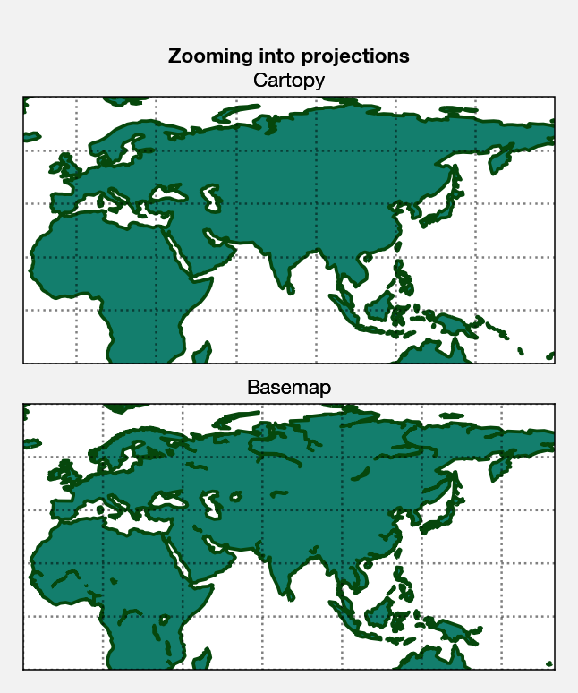
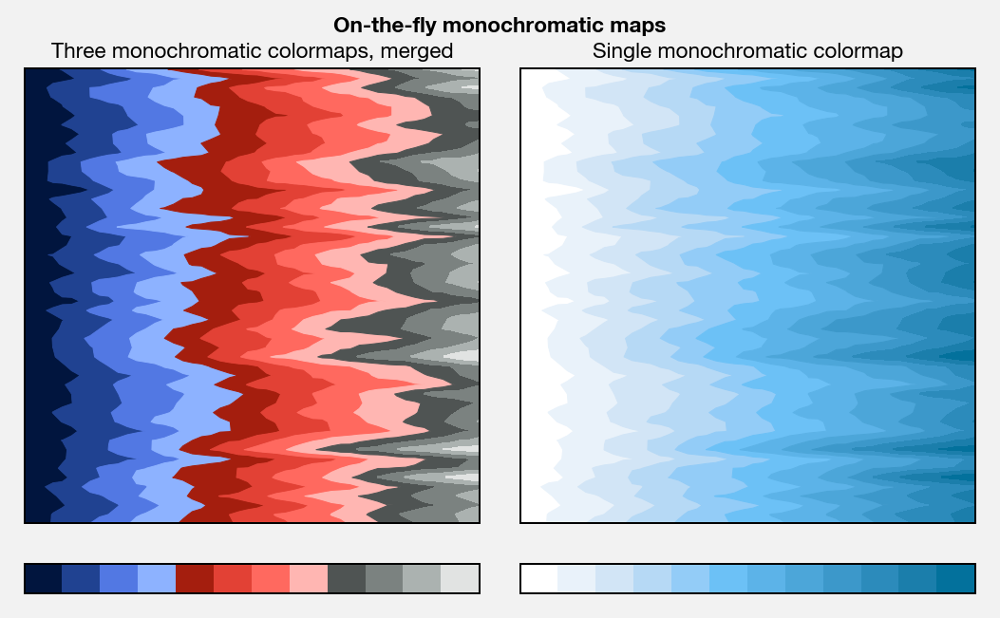
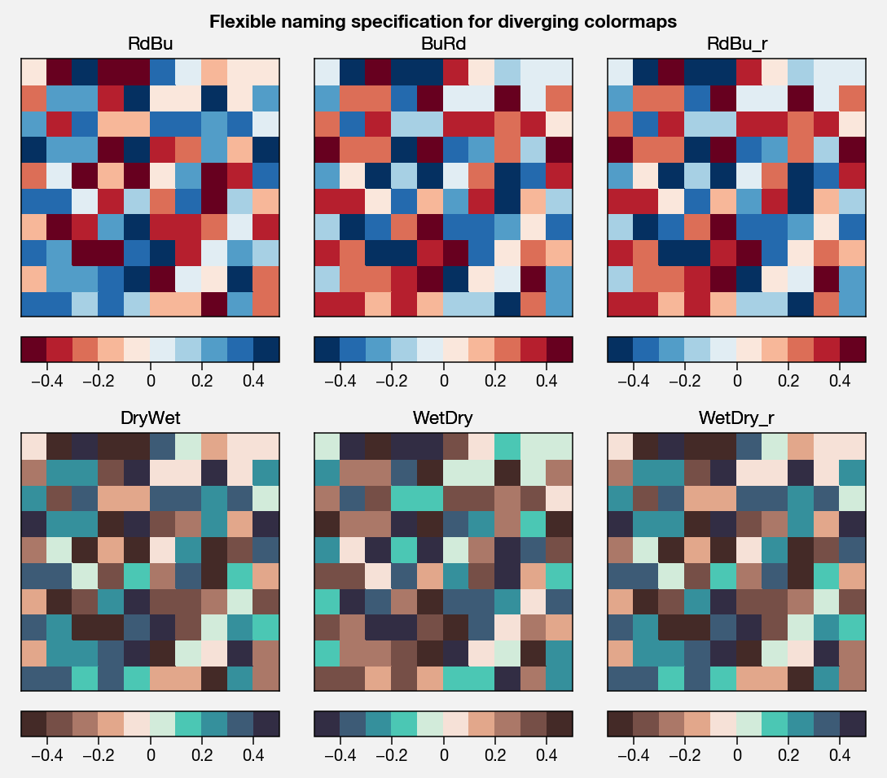

Color usage
===========

ProPlot isn’t just an alternative to `~matplotlib.pyplot`. It also
introduces some neat features to help you use colors effectively and
make your visualizations as aesthetically pleasing as possible. This
section documents these features.

Background
----------

“Colorspaces” are 3-D coordinate systems used to encode colors. The most
common ones are red-green-blue (RGB) and hue-saturation-value (HSV). It
might seem reasonable to create a colormap by drawing a “line” across
this 3-D space, like the “jet” colormap does. Unfortunately, this tends
to result in colormaps that are misleading to the eye, with eratic jumps
in color or brightness.

The hue-chroma-luminance (HCL) colorspace represents colors with
“perceptually uniform” coordinates – that is, lines drawn in this space
create smooth, aesthetically pleasing colormaps. Since some of the
colors in this space are impossible, we can also use two variants: the
HSL and HPL colorspaces. These are perceptually uniform in hue and
luminance, but not saturation.

Use `~proplot.demos.colorspace_breakdown` to plot arbitrary
cross-sections of these colorspaces, as shown below. Also see `this
page <http://www.hsluv.org/comparison/>`__.

.. code:: ipython3

    import proplot as plot
    f = plot.colorspace_breakdown(luminance=50)

.. image:: showcase/showcase_101_0.png
   :width: 576px
   :height: 212px

.. code:: ipython3

    import proplot as plot
    f = plot.colorspace_breakdown(chroma=60)

.. image:: showcase/showcase_102_0.png
   :width: 576px
   :height: 212px

.. code:: ipython3

    import proplot as plot
    f = plot.colorspace_breakdown(hue=0)

.. image:: showcase/showcase_103_0.png
   :width: 576px
   :height: 212px

In light of the above, ProPlot adds the new
`~proplot.colortools.PerceptuallyUniformColormap` class for generating
colormaps from the HCL, HSL, or HPL colorspaces. It also registers
several new colormaps that are members of this class by default.

Use `~proplot.demos.cmap_breakdown` with any colormap to visualize how
its colors vary in different colorspaces. The below depicts the builtin
“viridis” colormap and the “Fire”
`~proplot.colortools.PerceptuallyUniformColormap`. We see that
transitions for “Fire” are linear in HSL space, while transitions for
“virids” are linear in hue and luminance for all colorspaces, but
non-linear in saturation.

.. code:: ipython3

    import proplot as plot
    plot.cmap_breakdown('fire')
    plot.cmap_breakdown('viridis')

.. image:: showcase/showcase_105_1.png
   :width: 748px
   :height: 249px

.. image:: showcase/showcase_105_2.png
   :width: 748px
   :height: 245px

Table of colormaps
------------------

In addition to `~proplot.colortools.PerceptuallyUniformColormap` maps,
ProPlot adds colormaps from a bunch of cool data viz projects. Use
`~proplot.demos.cmap_show` to generate a table of registered
colormaps, as shown below.

The “User” section is automatically populated with colormaps saved to
your ``~/.proplot`` folder (see :ref:`On-the-fly colormaps`). You can
make your own colormaps using the `~proplot.colortools.Colormap`
constructor function. See below for details.

The other sections break down the colormaps by category: original
matplotlib maps, new ProPlot maps belonging to the
`~proplot.colortools.PerceptuallyUniformColormap` class,
`ColorBrewer <http://colorbrewer2.org/>`__ maps (already included with
matplotlib), and maps from several other projects like
`SciVisColor <https://sciviscolor.org/home/colormoves/>`__ and
`cmOcean <https://matplotlib.org/cmocean/>`__. Many outdated colormaps
are removed, including the infamous ``'jet'`` map. Only the colormaps
with poor, perceptually un-uniform transitions were thrown out.

.. code:: ipython3

    import proplot as plot
    f = plot.cmap_show(31)

.. image:: showcase/showcase_108_1.png
   :width: 436px
   :height: 4333px

Table of color cycles
---------------------

When you plot successive lines in matplotlib and don’t specify the
color, or when you plot patch objects (e.g. bar plots), line/patch
colors are selected from a “property cycler” (see the
``axes.prop_cycle`` `~matplotlib.rcParams` property).

ProPlot makes it easy to switch between different property cycles,
focusing on color changes. To change the property cycle, set the
`~proplot.rc` ``cycle`` property (e.g. ``plot.rc.cycle = '538'``; see
the `~proplot.rcmod` documentation for details) or pass ``cycle=name``
to any plotting command (powered by the `~proplot.axes.wrapper_cycle`
function). See below for details.

Use `~proplot.demos.cycle_show` to generate a table of registered
color cycles, as shown below. This will also show color cycles saved to
your ``~/.proplot`` folder (see :ref:`On-the-fly color cycles`). You
can make your own color cycles using the `~proplot.colortools.Cycle`
constructor function. See below for details.

.. code:: ipython3

    import proplot as plot
    f = plot.cycle_show()

Table of colors
---------------

ProPlot defined a lot of new color names. Use
`~proplot.demos.color_show` to generate tables of these new colors, as
shown below. Note that the native matplotlib `CSS4 named
colors <https://matplotlib.org/examples/color/named_colors.html>`__ are
still registered, but I encourage using colors from the below table
instead.

The colors in the first table are from the `XKCD “color
survey” <https://blog.xkcd.com/2010/05/03/color-survey-results/>`__
(crowd-sourced naming of random HEX strings) and `Crayola crayon
colors <https://en.wikipedia.org/wiki/List_of_Crayola_crayon_colors>`__
(inspired by
`seaborn <https://seaborn.pydata.org/generated/seaborn.crayon_palette.html>`__).
To reduce this list to a more manageable size, colors must be
*sufficiently “distinct”* in the HCL perceptually uniform colorspace
before they are added to ProPlot. This makes it a bit easier to pick out
colors from a table. Similar names were also cleaned up – for example,
“reddish” and “reddy” were changed to “red”.

The colors in the second table are from the `“Open
color” <https://www.google.com/search?q=opencolor+github&oq=opencolor+github&aqs=chrome..69i57.2152j0j1&sourceid=chrome&ie=UTF-8>`__
Github project. This project was intended for web UI design, but it is
also useful for selecting colors for scientific visualizations.

.. code:: ipython3

    import proplot as plot
    f = plot.color_show(nbreak=13)

.. code:: ipython3

    import proplot as plot
    f = plot.color_show(True)

.. image:: showcase/showcase_115_0.png
   :width: 630px
   :height: 225px

On-the-fly colormaps
--------------------

You can make a new colormap with ProPlot’s on-the-fly colormap
generator! Every command that accepts a ``cmap`` argument (see
`~proplot.axes.wrapper_cmap`) is passed to the
`~proplot.colortools.Colormap` constructor.
`~proplot.colortools.Colormap` keyword arguments can be specified with
``cmap_kw``. If you want to save your own custom colormap into
``~/.proplot``, simply pass ``save=True`` to the
`~proplot.colortools.Colormap` constructor (or supply a plotting
command with ``cmap_kw={'save':True, 'name':name}``, and it will be
loaded every time you import ProPlot. See
`~proplot.colortools.Colormap` and `~proplot.axes.wrapper_cmap` for
details.

Since all of the SciVisColor colormaps from the “ColorMoves” GUI are
included, you can easily create SciVisColor-style merged colormaps with
ProPlot’s on-the-fly colormap generator! The below reconstructs the
colormap from `this
example <https://sciviscolor.org/wp-content/uploads/sites/14/2018/04/colormoves-icon-1.png>`__.

.. code:: ipython3

    import proplot as plot
    import numpy as np
    f, axs = plot.subplots(ncols=2, axwidth=2.5, colorbars='b', bottom=0.1)
    data = np.random.rand(100,100).cumsum(axis=1)
    # Make colormap, save as "test1.json"
    cmap = plot.Colormap('Green1_r', 'Orange5', 'Blue1_r', 'Blue6', name='test1', save=True)
    m = axs[0].contourf(data, cmap=cmap, levels=100)
    f.bpanel[0].colorbar(m, locator='none')
    # Make colormap, save as "test2.json"
    cmap = plot.Colormap('Green1_r', 'Orange5', 'Blue1_r', 'Blue6', ratios=(1,3,5,10), name='test2', save=True)
    m = axs[1].contourf(data, cmap=cmap, levels=100)
    f.bpanel[1].colorbar(m, locator='none')
    axs.format(xticks='none', yticks='none', suptitle='Merging existing colormaps')
    for ax,title in zip(axs, ['Evenly spaced', 'Matching SciVisColor example']):
        ax.format(title=title)

.. image:: showcase/showcase_118_1.png
   :width: 544px
   :height: 334px

You can generate your own
`~proplot.colortools.PerceptuallyUniformColormap` on-the-fly by
passing a dictionary as the ``cmap`` keyword argument. This is powered
by the `~proplot.colortools.PerceptuallyUniformColormap.from_hsl`
static method.

The ``h``, ``s``, and ``l`` arguments can be single numbers, color
strings, or lists thereof. Numbers just indicate the channel value. For
color strings, the corresponding channel value (i.e. hue, saturation, or
luminance) for that color will be looked up. You can end any color
string with ``+N`` or ``-N`` to offset the channel value by the number
``N``, as shown below.

.. code:: ipython3

    import proplot as plot
    import numpy as np
    f, axs = plot.subplots(ncols=2, axcolorbars='b', axwidth=3.5, aspect=1.5)
    ax = axs[0]
    m = ax.contourf(np.random.rand(10,10),
                   cmap={'h':['red-120', 'red+90'], 'c':[50, 70, 30], 'l':[20, 100], 'space':'hcl'},
                   levels=plot.arange(0.1,0.9,0.1), extend='both',
                   )
    ax.bpanel.colorbar(m, label='colormap')
    ax.format(xlabel='x axis', ylabel='y axis', title='Reminiscent of "Matter"',
              suptitle='On-the-fly "PerceptuallyUniformColormap"')
    ax = axs[1]
    m = ax.contourf(np.random.rand(10,10),
                   cmap={'h':['red', 'red-720'], 'c':[80,20], 'l':[20, 100], 'space':'hpl'},
                   levels=plot.arange(0.1,0.9,0.05), extend='both')
    ax.bpanel.colorbar(m, label='colormap', locator=0.1)
    ax.format(xlabel='x axis', ylabel='y axis', title='Reminiscent of "cubehelix"')

In the below example, monochromatic colormaps are built from registered
color names (this is done by varying the luminance channel from white to
that color). The first plot shows several of these maps merged into one,
and the second shows how the intensity of the “white” can be changed by
adding a number to the end of the color string.

.. code:: ipython3

    import proplot as plot
    import numpy as np
    f, axs = plot.subplots(ncols=2, axwidth=2.4, aspect=1, colorbars='b', bottom=0.1)
    data = np.random.rand(50,50).cumsum(axis=1)
    cmap = plot.Colormap('navy90', 'brick red90', 'charcoal90', reverse=[True,True,True])
    m = axs[0].contourf(data, cmap=cmap, levels=12)
    f.bpanel[0].colorbar(m, locator='null')
    m = axs[1].contourf(data, cmap='ocean blue')
    f.bpanel[1].colorbar(m, locator='null')
    axs.format(xticks='none', yticks='none', suptitle='On-the-fly monochromatic maps')
    for ax,title in zip(axs, ['Three monochromatic colormaps, merged', 'Single monochromatic colormap']):
        ax.format(title=title)

.. image:: showcase/showcase_122_0.png
   :width: 526px
   :height: 325px

Diverging colormaps are easy to modify. Just use the ``cut`` argument to
`~proplot.colortools.Colormap`; this is great when you want to have a
sharper cutoff between negative and positive values for a diverging
colormap.

.. code:: ipython3

    import proplot as plot
    import numpy as np
    f, axs = plot.subplots(ncols=3, axcolorbars='b', axwidth=2)
    data = np.random.rand(50,50).cumsum(axis=0) - 50
    for ax,cut in zip(axs,(0, 0.1, 0.2)):
        m = ax.contourf(data, cmap='PurplePink', cmap_kw={'cut':cut}, levels=12)
        ax.format(xlabel='x axis', ylabel='y axis', title=f'cut = {cut}',
                  suptitle='Cutting out the central colors from a diverging colormap')
        ax.bpanel.colorbar(m, locator='null')

.. image:: showcase/showcase_124_0.png
   :width: 652px
   :height: 287px

Cyclic colormaps are also easy to modify. Just pass the ``shift``
argument to `~proplot.colortools.Colormap` to rotate the colors in
your map.

.. code:: ipython3

    import proplot as plot
    import numpy as np
    f, axs = plot.subplots(ncols=3, axcolorbars='b', axwidth=2)
    data = (np.random.rand(50,50)-0.48).cumsum(axis=1).cumsum(axis=0) - 50
    for ax,shift in zip(axs,(0, 90, 180)):
        m = ax.contourf(data, cmap='twilight', cmap_kw={'shift':shift}, levels=12)
        ax.format(xlabel='x axis', ylabel='y axis', title=f'shift = {shift}',
                  suptitle='Rotating the colors in a cyclic colormap')
        ax.bpanel.colorbar(m, locator='null')

.. image:: showcase/showcase_126_0.png
   :width: 652px
   :height: 287px

It is also easy to change the “gamma” of perceptually uniform colormap
on-the-fly. The “gamma” controls how the luminance and saturation
channels vary for a `~proplot.colortools.PerceptuallyUniformColromap`
map. A gamma larger than 1 emphasizes high luminance, low saturation
colors, and vice versa.

.. code:: ipython3

    import proplot as plot
    import numpy as np
    f, axs = plot.subplots(ncols=3, nrows=2, axcolorbars='r', aspect=1)
    data = np.random.rand(10,10).cumsum(axis=1)
    i = 0
    for cmap in ('verdant','fire'):
        for gamma in (0.8, 1.0, 1.4):
            ax = axs[i]
            m1 = ax.pcolormesh(data, cmap=cmap, cmap_kw={'gamma':gamma}, levels=10, extend='both')
            ax.rpanel.colorbar(m1, locator='none')
            ax.format(title=f'gamma = {gamma}', xlabel='x axis', ylabel='y axis', suptitle='Varying the "PerceptuallyUniformColormap" gamma')
            i += 1

.. image:: showcase/showcase_128_0.png
   :width: 652px
   :height: 424px

On-the-fly color cycles
-----------------------

You can specify the color cycler by passing ``cycle`` to any plotting
command, or by changing the global default cycle with
``plot.rc.cycle = name``. `~proplot.colortools.Cycle` keyword
arguments can be specified with ``cycle_kw``. If you want to save your
own, custom color cycler, simply pass ``save=True`` to the
`~proplot.colortools.Cycle` constructor (or supply a plotting command
with ``cycle_kw={'save':True, 'name':name}``, and it will be loaded
every time you import ProPlot. See `~proplot.colortools.Cycle` and
`~proplot.axes.wrapper_cycle` for details.

.. code:: ipython3

    import proplot as plot
    import numpy as np
    f, axs = plot.subplots(nrows=2, ncols=3, axwidth=1.5)
    for ax,cycle in zip(axs,('colorblind', 'field', 'qual1', 'qual2', 'set4', 'set5')):
        for i in range(10):
            ax.plot((np.random.rand(20) - 0.5).cumsum(), cycle=cycle, lw=5)
    axs.format(xformatter='none', yformatter='none', suptitle='Various named color cycles')

.. image:: showcase/showcase_131_0.png
   :width: 465px
   :height: 326px

Also note that colormaps and color cycles are totally interchangeable!
You can use a colormap as a color cycler, and (though this isn’t
recommended) vice versa.

Note it is common to want colors from a sequential colormap *excluding*
the brightest, near-white colors. This can be done by passing ``left=x``
to `~proplot.colors.Cycle`, which cuts out the leftmost ``x``
proportion of the smooth colormap before drawing colors from said map.
See `~proplot.colors.Colormap` for details.

.. code:: ipython3

    import proplot as plot
    import numpy as np
    f, axs = plot.subplots(ncols=2, colorbars='b', span=False, axwidth=3, aspect=1.5)
    m = axs[0].pcolormesh(np.random.rand(20,20).cumsum(axis=1), cmap='set5', levels=np.linspace(0,11,21))
    f.bpanel[0].colorbar(m, label='clabel', formatter='%.1f')
    lines = axs[1].plot(20*np.random.rand(10,5), cycle=('reds', 5), cycle_kw={'left':0.3}, lw=5)
    axs.format(xlabel='xlabel', ylabel='ylabel', suptitle='Another colormap demo')
    axs[0].format(title='Color cycler as colormap with colorbar')
    axs[1].format(title='Colormap as cycler with "colorbar legend"')
    f.bpanel[1].colorbar(lines, values=np.arange(0,len(lines)), label='clabel')

.. image:: showcase/showcase_133_1.png
   :width: 619px
   :height: 311px

Flexible identification
-----------------------

All colormap and color cycle names are now **case-insensitive** – this
was done by replacing the matplotlib colormap dictionary with an
instance of the magic `~proplot.colortools.CmapDict` class. You can
also select reversed diverging colormaps by their “reversed” name – for
example, ``'BuRd'`` is equivalent to ``'RdBu_r'``.

.. code:: ipython3

    import proplot as plot
    import numpy as np
    data = np.random.rand(10,10) - 0.5
    f, axs = plot.subplots(ncols=3, nrows=2, axwidth=1.6, aspect=1, axcolorbars='b', axcolorbars_kw={'hspace':0.2})
    for i,cmap in enumerate(('RdBu', 'BuRd', 'RdBu_r', 'DryWet', 'WetDry', 'WetDry_r')):
        ax = axs[i]
        m = ax.pcolormesh(data, cmap=cmap, levels=np.linspace(-0.5,0.5,11))
        ax.bpanel.colorbar(m, locator=0.2)
        ax.format(xlocator='null', ylocator='null', title=cmap)
    axs.format(suptitle='Flexible naming specification for diverging colormaps')

.. image:: showcase/showcase_135_0.png
   :width: 544px
   :height: 478px

Sub-sampling
------------

If you want to draw an individual color from a smooth colormap or a
color cycle, use ``color=(cmapname, position)`` or
``color=(cyclename, index)`` with any command that accepts the ``color``
keyword! The ``position`` should be between 0 and 1, while the ``index``
is the index on the list of colors in the cycle. This feature is powered
by the `~proplot.colortools.ColorDictSpecial` class.

.. code:: ipython3

    import proplot as plot
    import numpy as np
    f, axs = plot.subplots(nrows=3, aspect=(2,1), axwidth=4, axcolorbars='r', share=False)
    m = axs[0].pcolormesh(np.random.rand(10,10), cmap='thermal', levels=np.linspace(0, 1, 101))
    axs[0].rpanel.colorbar(m, label='colormap', locator=0.2)
    axs[0].format(title='The "thermal" colormap')
    l = []
    for idx in plot.arange(0, 1, 0.1):
        l += axs[1].plot((np.random.rand(20)-0.4).cumsum(), lw=5, color=('thermal', idx), label=f'idx {idx:.1f}')
    axs[1].rpanel.legend(l, ncols=1)
    axs[1].format(title='Colors from the "thermal" colormap')
    l = []
    idxs = np.arange(7)
    np.random.shuffle(idxs)
    for idx in idxs:
        l += axs[2].plot((np.random.rand(20)-0.4).cumsum(), lw=5, color=('ggplot', idx), label=f'idx {idx:.0f}')
    axs[2].rpanel.legend(l, ncols=1)
    axs[2].format(title='Colors from the "ggplot" color cycle')
    axs.format(xlocator='null', abc=True, abcpos='li', suptitle='Getting individual colors from colormaps and cycles')

.. image:: showcase/showcase_138_0.png
   :width: 431px
   :height: 582px
