Introduction
============

The subplots command
--------------------

The `~proplot.subplots.subplots` command is your starting point for
creating ProPlot figures, meant to replace the *pyplot* command of the
same name. It returns a special `~proplot.subplots.Figure` instance
and an `~proplot.subplots.axes_grid` of special `~proplot.axes.Axes`
instances.

Just like with pyplot, you can use `~proplot.subplots.subplots`
without arguments to generate a single-axes subplot or with ``ncols`` or
``nrows`` to set up simple grids of subplots. But unlike pyplot, you can
set up complex subplot grids by passing a 2D array of integers to
`~proplot.subplots.subplots`. Just think of this array as a “picture”
of your figure, where each unique number corresponds to a unique axes,
and the number order determines the order the subplots appear in the
`~proplot.subplots.axes_grid`.

Note that ProPlot should be used with the more “pythonic”
`object-oriented
API <https://matplotlib.org/api/api_overview.html#the-object-oriented-api>`__
rather than the MATLAB-like `pyplot
API <https://matplotlib.org/api/api_overview.html#the-pyplot-api>`__.
These APIs are compared in the below examples.

.. code:: ipython3

    # PyPlot API
    import matplotlib.pyplot as plt
    import numpy as np
    plt.figure(figsize=(5,3))
    plt.suptitle('PyPlot API')
    plt.subplot(121)
    plt.plot(2*(np.random.rand(100,5)-0.5).cumsum(axis=0), lw=2)
    plt.title('Title')
    plt.xlabel('x axis')
    plt.ylabel('y axis')
    plt.xticks(np.arange(0,100,10))
    plt.minorticks_off()
    plt.subplot(122)
    plt.title('Title')
    plt.xlabel('x axis')
    plt.ylabel('y axis')
    plt.xticks(np.arange(0,10))
    plt.minorticks_off()

.. code:: ipython3

    # Object-oriented API
    import matplotlib.pyplot as plt
    import numpy as np
    f, axs = plt.subplots(ncols=2, figsize=(5,3))
    f.suptitle('Object-Oriented API')
    axs[0].plot(2*(np.random.rand(100,5)-0.5).cumsum(axis=0), lw=2)
    axs[0].set_xticks(np.arange(0,100,10))
    axs[0].minorticks_off()
    for ax in axs:
        ax.set_title('Title')
        ax.set_xlabel('x axis')
        ax.set_ylabel('y axis')

.. code:: ipython3

    # ProPlot API
    import proplot as plot
    import numpy as np
    f, axs = plot.subplots(ncols=2)
    axs[0].plot(2*(np.random.rand(100,5)-0.5).cumsum(axis=0), lw=2)
    axs[0].format(xticks=20, xtickminor=False)
    axs.format(suptitle='ProPlot API', title='Title', xlabel='x axis', ylabel='y axis')

.. image:: tutorial/tutorial_5_0.svg

.. code:: ipython3

    # ProPlot API
    import proplot as plot
    import numpy as np
    data = 2*(np.random.rand(100,5)-0.5).cumsum(axis=0)
    f, axs = plot.subplots([[1,1,2,2],[0,3,3,0]], axwidth=1.5)
    axs.format(abc=True, abcloc='ul', suptitle='Subplot grid with centered rows', xlabel='xlabel', ylabel='ylabel')
    axs[2].plot(data, lw=2)
    f, axs = plot.subplots([[1,1,2],[1,1,6],[3,4,4],[3,5,5]], width=5)
    axs.format(suptitle='Complex subplot grid with axis-sharing + spanning labels', xlabel='xlabel', ylabel='ylabel', abc=True)
    axs[0].plot(data, lw=2)

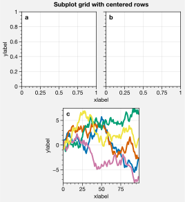

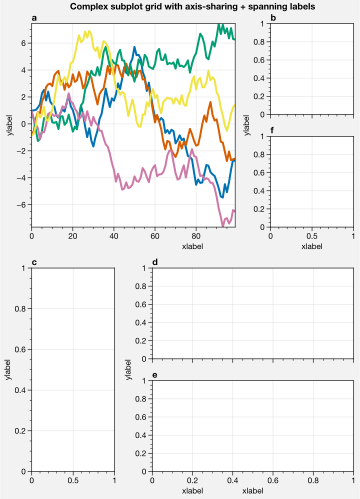

The axes grid container
-----------------------

The `~proplot.subplots.axes_grid` container returned by
`~proplot.subplots.subplots` lets you call *any command* on multiple
axes at once. It supports both 2D indexing (e.g. ``axs[1,2]``) and 1D
indexing (e.g. ``axs[2]``; note this is row-major by default). Further,
slicing an `~proplot.subplots.axes_grid` (e.g. ``axs[:,0]``) returns
another `~proplot.subplots.axes_grid`. In the below example,
`~proplot.subplots.axes_grid` is used to call
:ref:`The format command` on several axes at once.

.. code:: ipython3

    import proplot as plot
    import numpy as np
    f, axs = plot.subplots(ncols=5, nrows=5, axwidth=0.8)
    axs[:,0].format(color='red8')
    axs[0,:].format(color='blue8')
    for ax in axs[1:,1:]:
        ax.plot(np.random.rand(10,4), color='gray7', cycle_kw={'linestyle':('-',':','--','-.')})
    axs[0].format(color='black', linewidth=2)
    axs.format(xlabel='xlabel', ylabel='ylabel', suptitle='Demo of axes_grid')

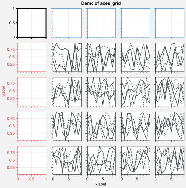

The format command
------------------

The special `~matplotlib.axes.Axes` instances returned by
`~proplot.subplots.subplots` add several new methods and wrap several
old ones (see :ref:`Plotting wrappers`). But the most important method
you need to know is ``format``, described in detail in the
`~proplot.axes.Axes`, `~proplot.axes.CartesianAxes`, and
`~proplot.axes.ProjectionAxes` documentation. This is your
one-stop-shop for changing axes settings. Keyword args passed to
``format`` are interpreted as follows.

1. Any keyword arg matching the name of a ProPlot or matplotlib “rc”
   setting will be applied to the axes using
   `~proplot.axes.Axes.context`. If the name has “dots”, simply omit
   them. See the `~proplot.rctools` documentation for details.
2. Remaining keyword args are passed to ``format`` on the
   `~proplot.axes.CartesianAxes` or `~proplot.axes.ProjectionAxes`
   classes. This changes settings specific to Cartesian or map
   projection axes, e.g. changing tick locations (the former) or
   parallel and meridian gridlines (the latter).
3. The last keyword args are passed to ``format`` on the
   `~proplot.axes.Axes` class. This changes settings shared by both
   `~proplot.axes.CartesianAxes` and `~proplot.axes.ProjectionAxes`
   – namely titles, a-b-c subplot labeling, and “super titles”.

Instead of using a series of verbose, one-liner setter methods like
``ax.set_title``, ``ax.set_xlabel``, and ``ax.xaxis.tick_params``,
``format`` provides simple shorthands for changing everything all at
once. It also integrates with the `~proplot.axistools.Locator`,
`~proplot.axistools.Formatter`, and `~proplot.axistools.Scale`
constructors, so you don’t have to directly invoke verbose abstract
classes. The goal of ``format`` is to reduce the amount of boilerplate
code needed for drawing highly customized plots. The power of ``format``
is demonstrated in the below example.

.. code:: ipython3

    import proplot as plot
    f, axs = plot.subplots(ncols=2, nrows=2, share=0, tight=True, axwidth=1.5)
    axs.format(xlabel='x-axis', ylabel='y-axis', xlim=(1,10), xlocator=1, xscale='log',
              ylim=(0,4), ylocator=plot.arange(0,4), yticklabels=('a', 'bb', 'c', 'dd', 'e'),
              title='Main', ltitle='Left', rtitle='Right', # different titles
              titleloc='c', suptitle='Demo of the format command',
              abc=True, abcloc='ul', abcformat='a.', xtickdir='inout',
              urtitle='Title A', lltitle='Title B', lrtitle='Title C', # extra titles
              ytickloc='both', yticklabelloc='both', ygridminor=True, xtickminor=False,
              collabels=['Column label 1', 'Column label 2'], rowlabels=['Row label 1', 'Row label 2'])

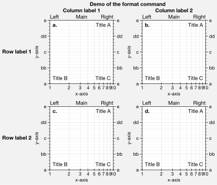

Plotting commands
-----------------

In ProPlot, axes plotting commands like
`~matplotlib.axes.Axes.contourf`,
`~matplotlib.axes.Axes.pcolormesh`, `~matplotlib.axes.Axes.plot`
work just like they do in matplotlib, but with several new features.
There are also a few new plotting commands, like
`~proplot.axes.Axes.heatmap`, `~proplot.axes.Axes.area`, and
`~proplot.axes.Axes.areax`. For details on these features, see
:ref:`Plotting wrappers` and :ref:`Color usage`.

.. code:: ipython3

    import proplot as plot
    f, axs = plot.subplots(axwidth=1.5, ncols=2, nrows=2, share=False)
    cycle = plot.Cycle('blues', 5)
    data = np.random.rand(10,10)
    axs[0].plot(data, cycle=cycle, lw=3)
    for i in range(5):
        axs[1].scatter(data[:,i], data[:,5+i], s=50, cycle=cycle)
    axs[2].pcolormesh(data, cmap='reds', colorbar='b')
    axs[3].contourf(data, cmap='reds', colorbar='b')
    axs.format(suptitle='Super title', title='Title')

.. image:: tutorial/tutorial_12_0.svg

Axes colorbars and legends
--------------------------

Drawing colorbars and legends is a much smoother experience with
ProPlot. To draw a colorbar or legend along the outside of an axes, use
the `~proplot.axes.Axes.colorbar` and `~proplot.axes.Axes.legend`
``Axes`` methods with e.g. ``loc='right'``. If you do this multiple
times, the colorbars and legends will be “stacked”. Room for colorbars
and legends is allocated from the space between subplot rows and columns
– it is no longer stolen from the axes.

To plot data and draw a colorbar or legend in one go, pass e.g.
``colorbar='right'`` to any method wrapped by
`~proplot.wrappers.cmap_wrapper`, or e.g. ``colorbar='right'`` or
``legend='right'`` to any method wrapped by
`~proplot.wrappers.cycle_wrapper`. To draw an *inset* colorbar, use
one of the *inset* locations, e.g. ``colorbar='upper right'`` or
``colorbar='ur'``. Inset colorbars have optional rectangular
backgrounds, just like inset legends.

.. code:: ipython3

    import proplot as plot
    import numpy as np
    with plot.rc.context(abc=True):
        f, axs = plot.subplots(ncols=2, share=0)
    # Colorbars
    ax = axs[0]
    m = ax.heatmap(np.random.rand(10,10), colorbar='t', cmap='dusk')
    ax.colorbar(m, loc='r')
    ax.colorbar(m, loc='ll', label='colorbar label')
    ax.format(title='Axes colorbars', suptitle='Axes colorbars and legends demo')
    # Legends
    ax = axs[1]
    ax.format(title='Axes legends', titlepad='0em')
    hs = ax.plot((np.random.rand(10,5)-0.5).cumsum(axis=0), lw=3, legend='t', cycle='sharp',
            labels=list('abcde'), legend_kw={'ncols':5, 'frame':False})
    ax.legend(hs, loc='r', ncols=1, frame=False)
    ax.legend(hs, loc='ll', label='legend label')
    axs.format(xlabel='xlabel', ylabel='ylabel')

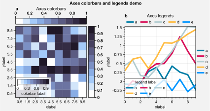

.. code:: ipython3

    import proplot as plot
    import numpy as np
    f, axs = plot.subplots(nrows=2, share=0, axwidth='4cm', panelpad='1em')
    axs.format(suptitle='Stacked colorbars demo')
    N = 10
    for j,ax in enumerate(axs):
        ax.format(xlabel='data', xlocator=np.linspace(0, 0.8, 5), title=f'Subplot #{j+1}')
        for i,(x0,y0,x1,y1,cmap,scale) in enumerate(((0,0.5,1,1,'grays',0.5), (0,0,0.5,0.5,'reds',1), (0.5,0,1,0.5,'blues',2))):
            if j == 1 and i == 0:
                continue
            data = np.random.rand(N,N)*scale
            x, y = np.linspace(x0, x1, 11), np.linspace(y0, y1, 11)
            m = ax.pcolormesh(x, y, data, cmap=cmap, levels=np.linspace(0,scale,11))
            ax.colorbar(m, loc='l', label=f'dataset #{i+1}')

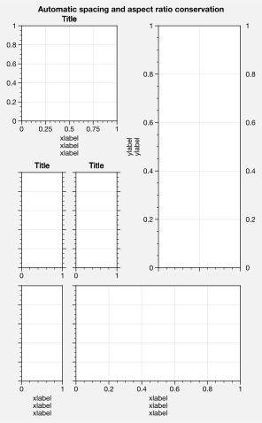

Figure colorbars and legends
----------------------------

To draw a colorbar or legend along the edge of a figure, use the
`~proplot.subplots.Figure.colorbar` or
`~proplot.subplots.Figure.legend` ``Figure`` methods. The colorbar or
legend will be aligned between edges of the subplot grid. As with axes
panels, drawing successive colorbars or legends along the same side will
“stack” them.

To draw a colorbar or legend beneath particular row(s) and column(s) of
the subplot grid, use the ``row``, ``rows``, ``col``, or ``cols``
keyword arguments. Pass an integer to draw the colorbar or legend beside
a single row or column, or pass a tuple to draw it beside a range of
rows or columns.

.. code:: ipython3

    import proplot as plot
    import numpy as np
    f, axs = plot.subplots(ncols=3, nrows=3, axwidth=1.2)
    m = axs.pcolormesh(np.random.rand(20,20), cmap='grays', levels=np.linspace(0,1,11), extend='both')[0]
    axs.format(suptitle='Figure colorbars and legends demo', abc=True, abcloc='l', abcformat='a.', xlabel='xlabel', ylabel='ylabel')
    f.colorbar(m, label='column 1', ticks=0.5, loc='b', col=1)
    f.colorbar(m, label='columns 2-3', ticks=0.2, loc='b', cols=(2,3))
    f.colorbar(m, label='stacked colorbar', ticks=0.1, loc='b', minorticks=0.05) # this one is stacked
    f.colorbar(m, label='colorbar with length <1', ticks=0.1, loc='r', length=0.7)

.. image:: tutorial/tutorial_17_1.svg

.. code:: ipython3

    import proplot as plot
    import numpy as np
    f, axs = plot.subplots(ncols=2, nrows=2, axwidth=1.3, share=0, wspace=0.3, order='F')
    data = (np.random.rand(50,50)-0.1).cumsum(axis=0)
    m = axs[:2].contourf(data, cmap='grays', extend='both')
    cycle = plot.colors('grays', 5)
    hs = []
    for abc,color in zip('ABCDEF',cycle):
        h = axs[2:].plot(np.random.rand(10), lw=3, color=color, label=f'line {abc}')
        hs.extend(h[0])
    f.colorbar(m[0], length=0.8, label='colorbar label', loc='b', col=1)
    f.colorbar(m[0], label='colorbar label', loc='l')
    f.legend(hs, ncols=2, center=True, frame=False, loc='b', col=2)
    f.legend(hs, ncols=1, label='legend label', frame=False, loc='r')
    axs.format(suptitle='Figure colorbars and legends demo', abc=True, abcloc='ul', abcformat='A')
    for ax,title in zip(axs, ['2D dataset #1', '2D dataset #2', 'Line set #1', 'Line set #2']):
        ax.format(xlabel='xlabel', title=title)

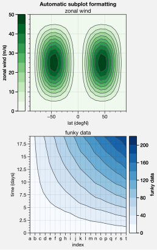

New colorbar and legend features
--------------------------------

The `~proplot.subplots.Figure` and `~proplot.axes.Axes` ``colorbar``
and ``legend`` methods are wrapped by
`~proplot.wrappers.colorbar_wrapper` and
`~proplot.wrappers.legend_wrapper`, which add several new features.

`~proplot.wrappers.colorbar_wrapper` can draw colorbars from *lists of
colors* or *lists of artists* by passing a list instead of a “mappable”
object – a colormap is constructed from the corresponding colors
on-the-fly. To change outline, divider, tick location, tick label, and
colorbar label settings, just pass the appropriate keyword arg to
`~proplot.wrappers.colorbar_wrapper`.

`~proplot.wrappers.legend_wrapper` can draw legends with *centered
legend rows*, either by passing ``center=True`` or by passing *list of
lists* of plot handles. This is accomplished by stacking multiple
single-row, horizontally centered legends, then manually adding an
encompassing legend frame. You can also switch between row-major and
column-major order for legend entries (the new default is row-major),
and modify legend text properties and handle properties.

.. code:: ipython3

    import proplot as plot
    import numpy as np
    f, axs = plot.subplots(share=0, ncols=2)
    ax = axs[0]
    data = 1 + (np.random.rand(12,10)-0.45).cumsum(axis=0)
    cycle = plot.Cycle('algae')
    hs = ax.plot(data, lw=4, cycle=cycle, colorbar='lr', colorbar_kw={'length':'14em', 'label':'numeric values'})
    ax.colorbar(hs, loc='t', values=np.linspace(0.5,9.5,10)*2, label='alt numeric values', ticks=2)
    ax = axs[1]
    m = ax.contourf(data.T, extend='both', cmap='algae')
    f.colorbar(m, length=0.6, loc='b', label='flipped tick location', tickloc='top', grid=True)
    ax.colorbar(m, loc='ul', length=1, ticks=0.5, tickminor=True, extendrect=True,
                label='changing colors', labelcolor='gray7', labelweight='bold',
                linewidth=1, edgecolor='gray7', ticklabelcolor='gray7', alpha=0.5)
    axs.format(suptitle='Colorbar formatting demo', xlabel='xlabel', ylabel='ylabel')

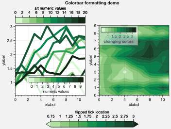

.. code:: ipython3

    import proplot as plot
    import numpy as np
    plot.rc.cycle = 'contrast'
    labels = ['a', 'bb', 'ccc', 'dddd', 'eeeee']
    f, axs = plot.subplots(ncols=2, span=False, share=1)
    hs1, hs2 = [], []
    # Plot lines and add to legends on-the-fly
    for i,label in enumerate(labels):
        data = (np.random.rand(20)-0.45).cumsum(axis=0)
        h1 = axs[0].plot(data, lw=4, label=label, legend='ul',
                         legend_kw={'order':'F', 'title':'column major'}) # add to legend in upper left
        hs1.extend(h1)
        h2 = axs[1].plot(data, lw=4, label=label, legend='r', cycle='floral',
                         legend_kw={'ncols':1, 'frame':False, 'title':'no frame'}) # add to legend in right panel
        hs2.extend(h2)
    # Outer legends
    ax = axs[0]
    ax.legend(hs1, loc='b', ncols=3, linewidth=2, title='row major', order='C',
              edgecolor='gray4', facecolor='gray2')
    ax = axs[1]
    ax.legend(hs2, loc='b', ncols=3, center=True, title='centered legend',
             handlelength=1) # also works!
    axs.format(xlabel='xlabel', ylabel='ylabel', suptitle='Legend formatting demo')

.. image:: tutorial/tutorial_22_0.svg

Pandas and xarray integration
-----------------------------

With ProPlot, when you pass a `pandas
DataFrame <https://pandas.pydata.org/pandas-docs/stable/reference/api/pandas.DataFrame.html>`__
or `xarray
DataArray <http://xarray.pydata.org/en/stable/data-structures.html>`__
to any plotting command, the x-axis label, y-axis label, legend label,
colorbar label, and/or title are configured from the metadata, and
legends and colorbars can be generated on-the-fly. This restores some of
the convenience you get with the builtin
`pandas <https://pandas.pydata.org>`__ and
`xarray <https://pandas.pydata.org>`__ plotting tools. This feature is
*optional*, and does not require that `pandas` and `xarray` are
installed.

This feature is showcased below for 1-dimensional and 2-dimensional
datasets. For more on the ``colorbar`` and ``legend`` keyword args, see
`~proplot.wrappers.cmap_wrapper`, `~proplot.wrappers.cycle_wrapper`,
and :ref:`On-the-fly axes panels`.

.. code:: ipython3

    import xarray as xr
    import numpy as np
    import pandas as pd
    import proplot as plot
    # DataArray
    # Must be column major since plot draws lines from columns of arrays
    data = np.sin(np.linspace(0, 2*np.pi, 20))[:,None] + np.random.rand(20,8).cumsum(axis=1)
    da = xr.DataArray(data, dims=('x', 'cat'), coords={
        'x':xr.DataArray(np.linspace(0,1,20), dims=('x',), attrs={'long_name':'distance', 'units':'km'}),
        'cat':xr.DataArray(np.arange(0,80,10), dims=('cat',), attrs={'long_name':'parameter', 'units':'K'})
        }, name='position series')
    # DataFrame
    plot.rc.reset()
    ts = pd.date_range('1/1/2000', periods=20)
    data = (np.cos(np.linspace(0, 2*np.pi, 20))**4)[:,None] + np.random.rand(20,5)**2
    df = pd.DataFrame(data, index=ts, columns=['foo','bar','baz','zap','baf'])
    df.name = 'time series'
    df.index.name = 'time (s)'
    df.columns.name = 'columns'

.. code:: ipython3

    # Figure
    f, axs = plot.subplots(ncols=2, axwidth=2.2, share=0)
    axs.format(suptitle='Automatic subplot formatting')
    # Plot DataArray
    cycle = plot.Cycle(plot.shade('light blue', 0.4), fade=90, space='hcl')
    axs[0].plot(da, cycle=cycle, lw=3, colorbar='ul', colorbar_kw={'locator':20})
    # Plot Dataframe
    cycle = plot.Cycle(plot.shade('jade', 0.4), fade=90, space='hcl')
    axs[1].plot(df, cycle=cycle, lw=3, legend='uc')

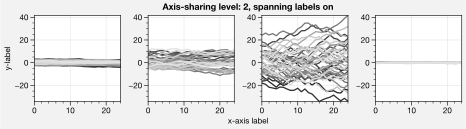

.. code:: ipython3

    import xarray as xr
    import numpy as np
    import pandas as pd
    import proplot as plot
    from string import ascii_lowercase
    # DataArray
    data = 50*(np.sin(np.linspace(0, 2*np.pi, 20) + 0)**2) * np.cos(np.linspace(0, np.pi, 20)+np.pi/2)[:,None]**2
    da = xr.DataArray(data, dims=('plev','lat'), coords={
        'plev':xr.DataArray(np.linspace(1000,0,20), dims=('plev',), attrs={'long_name':'pressure', 'units':'hPa'}),
        'lat':xr.DataArray(np.linspace(-90,90,20), dims=('lat',), attrs={'units':'degN'}), # if long_name absent, variable name is used
        }, name='u', attrs={'long_name':'zonal wind', 'units':'m/s'})
    # DataFrame
    data = np.random.rand(20,20)
    df = pd.DataFrame(data.cumsum(axis=0).cumsum(axis=1), index=[*ascii_lowercase[:20]])
    df.name = 'funky data'
    df.index.name = 'index'
    df.columns.name = 'time (days)'

.. code:: ipython3

    # Figure
    f, axs = plot.subplots(nrows=2, axwidth=2.2, share=0)
    axs.format(collabels=['Automatic subplot formatting']) # suptitle will look off center with the empty left panel
    # Plot DataArray
    axs[0].contourf(da, cmap='Greens', cmap_kw={'left':0.05}, colorbar='l', linewidth=0.7, color='gray7')
    axs[0].format(yreverse=True)
    # Plot DataFrame
    axs[1].contourf(df, cmap='Blues', colorbar='r', linewidth=0.7, color='gray7')
    axs[1].format(xtickminor=False)

.. image:: tutorial/tutorial_28_0.svg

Automatic subplot spacing
-------------------------

Matplotlib has a `tight layout
feature <https://matplotlib.org/3.1.1/tutorials/intermediate/tight_layout_guide.html>`__
whereby the spacing between subplot content and the figure edge, and
between content in adjacent subplots, is automatically adjusted.

ProPlot introduces a new tight layout algorithm that permits *variable
figure dimensions* and *variable spacing* between subplot rows and
columns (see `~proplot.subplots.FlexibleGridSpecBase`). This allows
the algorithm to preserve subplot aspect ratios, panel widths, and
optionally, subplot physical dimensions, all without producing extra
whitespace. The algorithm is also more robust to complex geometry. To
turn it off, pass ``tight=False`` to `~proplot.subplots.subplots`. If
you explicitly pass a spacing argument to
`~proplot.subplots.subplots`, e.g. ``left='3em'`` or ``wspace='2em'``,
it will override the tight layout algorithm.

To fix the figure dimension(s), pass ``width``, ``height``, or
``figsize`` to `~proplot.subplots.subplots`. To fix the reference
subplot dimension(s), use ``axwidth``, ``axheight``, or ``aspect``. To
set the reference subplot, use ``ref`` (defaults to ``1``, i.e. the
subplot in the upper left corner). If the `aspect ratio
mode <https://matplotlib.org/2.0.2/examples/pylab_examples/equal_aspect_ratio.html>`__
is set to ``'equal'``, as with :ref:`Projection axes` and
`~matplotlib.axes.Axes.imshow` plots, the data ratio will be used
instead.

.. code:: ipython3

    import proplot as plot
    for ref in (1,2):
        f, axs = plot.subplots(ref=ref, nrows=3, ncols=3, aspect=1, axwidth=1, wratios=(3,2,2), share=0)
        axs[ref-1].format(title='reference axes', titleweight='bold', titleloc='uc', titlecolor='red9')
        axs[4].format(title='title\ntitle\ntitle', suptitle='Tight layout with simple grids')
        axs[1].format(ylabel='ylabel\nylabel\nylabel')
        axs[:4:2].format(xlabel='xlabel\nxlabel\nxlabel')
        axs.format(rowlabels=['Row 1', 'Row 2', 'Row 3'], collabels=['Column 1', 'Column 2', 'Column 3'])

.. image:: tutorial/tutorial_31_0.svg

.. image:: tutorial/tutorial_31_1.svg

.. code:: ipython3

    import proplot as plot
    f, axs = plot.subplots([[1,1,2],[1,1,3],[4,5,3],[4,6,6],[7,7,8]], span=False)
    axs.format(xlabel='xlabel', ylabel='ylabel', suptitle='Super title')
    axs[0].format(xlabel='xlabel\nxlabel\nxlabel', title='reference axes', titleweight='bold', titleloc='uc', titlecolor='red9')
    axs[1].format(ylabel='ylabel\nylabel\nylabel', ytickloc='both', yticklabelloc='both', title='Title')
    axs[2:4].format(yformatter='null', title='Title', ytickloc='both', yticklabelloc='both')
    axs[4:].format(yformatter='null', xlabel='xlabel\nxlabel\nxlabel')
    axs.format(suptitle='Tight layout with complex grids', rowlabels=['Row 1', 'Row 2', 'Row 3'], collabels=['Column 1', 'Column 2'])

.. image:: tutorial/tutorial_32_0.svg

.. code:: ipython3

    import proplot as plot
    f, axs = plot.subplots(axwidth=1.2, ncols=2, share=0, axpanels='lrbt', axpanels_kw={'bstack':1, 'share':False})
    axs[0].format(ylim=(0,1e-3), title='reference axes', titleweight='bold', titleloc='uc', titlecolor='red9')
    axs[0].lpanel.format(ytickloc='right', yticklabelloc='right')
    axs[0].rpanel.format(ylabel='ylabel', ytickloc='right', yticklabelloc='right')
    axs[0].bpanel.format(xlabel='xlabel')
    axs[1].rpanel.format(ylim=(0, 0.01), ylabel='ylabel')
    axs[1].format(ylabel='ylabel\nylabel\nylabel', xlabel='xlabel\nxlabel\nxlabel',
                  title='Title', top=False, collabels=['Column 1', 'Column 2'],
                  suptitle='Tight layout with axes panels')

.. image:: tutorial/tutorial_33_0.svg

Axis sharing and spanning
-------------------------

Matplotlib has an “axis sharing” feature that holds axis limits the same
for axes within a grid of subplots. But this has no effect on the axis
labels and tick labels, which can lead to lots of redundant labels. To
help you eliminate these redundancies, ProPlot introduces *4
axis-sharing options* and a new *spanning label option*, controlled by
the ``share``, ``sharex``, ``sharey``, ``span``, ``spanx``, and
``spany`` keyword args. See `~proplot.subplots.sublots` and the below
example for details.

.. code:: ipython3

    import proplot as plot
    import numpy as np
    N = 50
    M = 40
    colors = plot.colors('grays_r', M, left=0.1, right=0.8)
    for share in (0,1,2,3):
        f, axs = plot.subplots(ncols=4, aspect=1, axwidth=1.2, sharey=share, spanx=share//2)
        gen = lambda scale: scale*(np.random.rand(N,M)-0.5).cumsum(axis=0)[N//2:,:]
        for ax,scale,color in zip(axs,(1,3,7,0.2),('gray9','gray7','gray5','gray3')):
            array = gen(scale)
            for l in range(array.shape[1]):
                ax.plot(array[:,l], color=colors[l])
            ax.format(suptitle=f'Axis-sharing level: {share}, spanning labels {["off","on"][share//2]}', ylabel='y-label', xlabel='x-axis label')

.. image:: tutorial/tutorial_36_0.svg

.. image:: tutorial/tutorial_36_1.svg

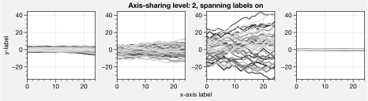

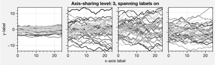

.. code:: ipython3

    import proplot as plot
    import numpy as np
    plot.rc.reset()
    plot.rc.cycle = 'Set3'
    titles = ['With redundant labels', 'Without redundant labels']
    for mode in (0,1):
        f, axs = plot.subplots(nrows=4, ncols=4, share=3*mode, span=1*mode, axwidth=1)
        for ax in axs:
            ax.plot((np.random.rand(100,20)-0.4).cumsum(axis=0))
        axs.format(xlabel='x-label', ylabel='y-label', suptitle=titles[mode], abc=mode, abcloc='ul')

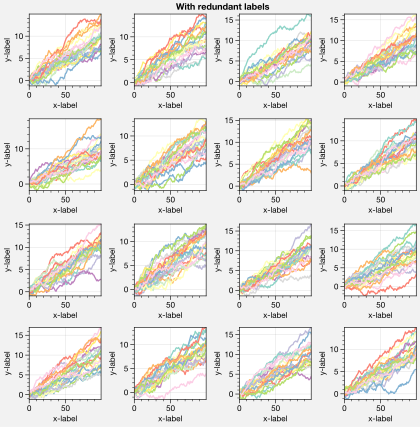

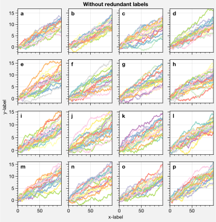

A-b-c subplot labels
--------------------

It is easy to add a-b-c labels to axes generated by
`~proplot.subplots.subplots`. The label order is set by the array
numbers – or if an array was not provided, it is row-major by default
and controlled by the `~proplot.subplots.subplots` ``order`` keyword
arg. The label position can be changed with the ``abc.loc``
`~proplot.rctools.rc` option, and the label style can be changed with
the ``abc.format`` `~proplot.rctools.rc` option. See
:ref:`The format command` and :ref:`The rc object` for details.

.. code:: ipython3

    import proplot as plot
    f, axs = plot.subplots(nrows=8, ncols=8, axwidth=0.7, space=0) 
    axs.format(abc=True, abcloc='ur', xlabel='x axis', ylabel='y axis',
               xticks=[], yticks=[], suptitle='A-b-c labels on grid of flush subplots')

.. image:: tutorial/tutorial_39_0.svg

Arbitrary physical units
------------------------

*Arbitrary units* are supported for most arguments to ProPlot functions.
That is, if a sizing argument is numeric, the units are inches or
points, and if string, the units are interpreted by
`~proplot.utils.units`. A table of acceptable units is found in the
`~proplot.utils.units` documentation (they include centimeters,
millimeters, and pixels).

.. code:: ipython3

    import proplot as plot
    import numpy as np
    f, axs = plot.subplots(ncols=3, width='12cm', height='55mm', wspace=('10pt', '20pt'))
    axs.format(small='12px', large='15px', linewidth='0.5mm')
    axs.format(suptitle='Arguments with arbitrary units', xlabel='x axis', ylabel='y axis')

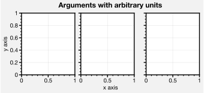

The rc object
-------------

A special object named `~proplot.rctools.rc`, belonging to the
`~proplot.rctools.rc_configurator` class, is created whenever you
import ProPlot. This object gives you advanced control over the look of
your plots – it is your **one-stop shop for changing global settings**.
`~proplot.rctools.rc` can be used to change matplotlib
`rcParams <https://matplotlib.org/users/customizing.html>`__ settings,
custom ProPlot :ref:`rcExtraParams` settings, and special
:ref:`rcGlobals` meta-settings. See the `~proplot.rctools`
documentation for more info.

To modify a setting for just one subplot, pass it to the
`~proplot.axes.Axes.format` command. To reset everything to the
default state, use `~proplot.rctools.rc_configurator.reset`. To
temporarily modify global settings for a block of code, use
`~proplot.rctools.rc_configurator.context`.

.. code:: ipython3

    import proplot as plot
    import numpy as np
    # A bunch of different ways to update settings
    plot.rc.reset()
    plot.rc.cycle = 'colorblind'
    plot.rc.update({'fontname': 'DejaVu Sans'})
    plot.rc['figure.facecolor'] = 'gray3'
    plot.rc['axes.facecolor'] = 'gray5'
    with plot.rc.context(linewidth=1.5): # above mods are persistent, context mod only applies to figure
        f, axs = plot.subplots(ncols=2, aspect=1, width=6, span=False, sharey=2)
    # Make plot
    N, M = 100, 6
    values = np.arange(1,M+1)
    cycle = plot.Cycle('C0', 'C1', M, fade=80)
    for i,ax in enumerate(axs):
        data = np.cumsum(np.random.rand(N,M)-0.5, axis=0)
        lines = ax.plot(data, linewidth=3, cycle=cycle) # see "Changing the color cycle" for details
    axs.format(ytickloc='both', ycolor='blue7', 
               xlabel='x label', ylabel='y label',
               yticklabelloc='both',
               suptitle='Applying new rc settings',
               patch_kw={'hatch':'xxx', 'edgecolor':'w'})
    ay = axs[-1].twinx()
    ay.format(ycolor='r', linewidth=1.5, ylabel='secondary axis')
    ay.plot((np.random.rand(100)-0.2).cumsum(), color='r', lw=3)

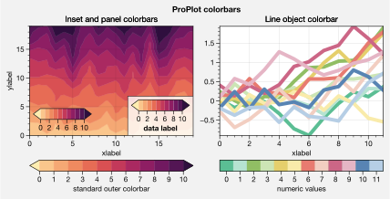

