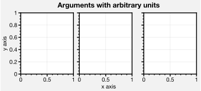
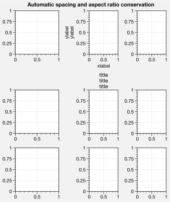
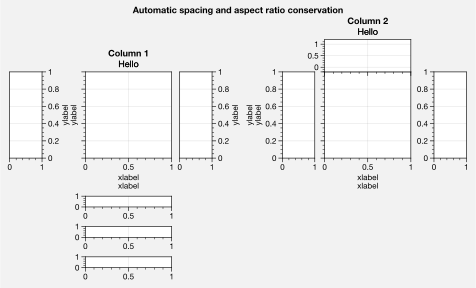
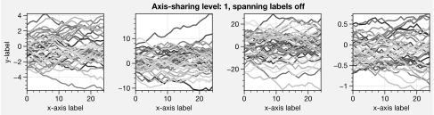
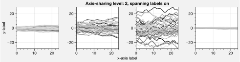
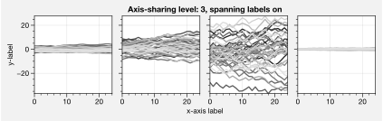
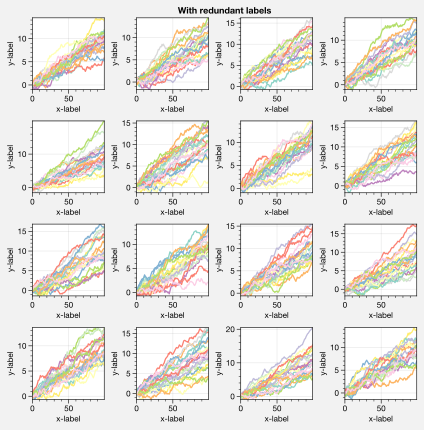
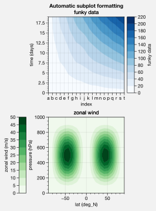
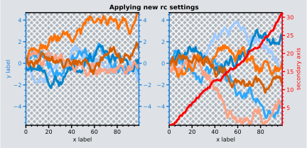

Introduction
============

The subplots command
--------------------

Matplotlib has `two
APIs <https://matplotlib.org/api/api_overview.html>`__ – the “pyplot”
API (which is MATLAB-like), and the “object-oriented” API (which is more
“pythonic”). Contrary to the similar names, this package is not meant to
be a pyplot replacement, where everything is done using commands on the
top-level module. ProPlot’s features are invoked with the
“object-oriented” API, using the objects returned by ProPlot’s version
of the `~proplot.subplots.subplots` command.

`~proplot.subplots.subplots` is your gateway to all of ProPlot’s
features. It returns a special `~proplot.subplots.Figure` instance and
an `~proplot.subplots.axes_grid` of special
`~proplot.axes.CartesianAxes` (see :ref:`Cartesian axes`) or
`~proplot.axes.ProjectionAxes` (see :ref:`Map projection axes`).
`~proplot.subplots.axes_grid` is a magical container that lets you
call any method on multiple axes *simultaneously*. This is used
repeatedly in the examples.

The below is a simple worked example comparing the 3 APIs. For more on
the `~proplot.axes.BaseAxes.format` command, see
:ref:`The format command` section.

.. code:: ipython3

    # PyPlot API
    import matplotlib.pyplot as plt
    import numpy as np
    plt.figure(figsize=(5,3))
    plt.suptitle('PyPlot API')
    plt.subplot(121)
    plt.plot(np.random.rand(10,5).cumsum(axis=1), lw=2)
    plt.title('Title')
    plt.xlabel('x axis')
    plt.ylabel('y axis')
    plt.xticks(np.arange(0,10))
    plt.minorticks_off()
    plt.subplot(122)
    plt.title('Title')
    plt.xlabel('x axis')
    plt.ylabel('y axis')
    plt.xticks(np.arange(0,10))
    plt.minorticks_off()

.. code:: ipython3

    # Object-oriented API
    import matplotlib.pyplot as plt
    import numpy as np
    f, axs = plt.subplots(ncols=2, figsize=(5,3))
    f.suptitle('Object-Oriented API')
    axs[0].plot(np.random.rand(10,5).cumsum(axis=1), lw=2)
    axs[0].set_xticks(np.arange(0,10))
    axs[0].minorticks_off()
    for ax in axs:
        ax.set_title('Title')
        ax.set_xlabel('x axis')
        ax.set_ylabel('y axis')

.. code:: ipython3

    # ProPlot API
    import proplot as plot
    import numpy as np
    f, axs = plot.subplots(ncols=2)
    axs[0].plot(np.random.rand(10,5).cumsum(axis=1), lw=2)
    axs[0].format(xticks=1, xtickminor=False)
    axs.format(suptitle='ProPlot API', title='Title', xlabel='x axis', ylabel='y axis')

.. image:: tutorial/tutorial_5_0.svg

You can set up complex grids of subplots by passing 2D arrays of
integers to `~proplot.subplots.subplots`. Just think of this array as
a “picture” of your figure, where each unique number corresponds to a
unique axes. This feature allows us to build the below grid in just one
line of code, instead of 6 lines. The number order determines the order
of a-b-c labels, and the order in which the axes appear in the
`~proplot.subplots.axes_grid`. See `~proplot.subplots.subplots` for
details.

.. code:: ipython3

    import proplot as plot
    import numpy as np
    data = 2*(np.random.rand(100,5)-0.5).cumsum(axis=0)
    f, axs = plot.subplots([[1,1,2,2],[0,3,3,0]], axwidth=1.5)
    axs.format(abc=True, abcloc='ul', suptitle='Subplot grid with centered rows', xlabel='xlabel', ylabel='ylabel')
    axs[2].plot(data, lw=2)
    f, axs = plot.subplots([[1,1,2],[1,1,6],[3,4,4],[3,5,5]], span=1, share=3, width=5)
    axs.format(suptitle='Complex subplot grid with axis-sharing + spanning labels', xlabel='xlabel', ylabel='ylabel', abc=True)
    axs[0].plot(data, lw=2)

.. image:: tutorial/tutorial_7_1.svg

.. image:: tutorial/tutorial_7_2.svg

It is easy to add a-b-c labels to axes generated by
`~proplot.subplots.subplots`. The label order is set by the array
numbers – or if an array was not provided, it is row-major by default
and controlled by the `~proplot.subplots.subplots` ``order`` keyword
arg. The label position can be changed with the ``abc.loc``
`~proplot.rctools.rc` option, and the label style can be changed with
the ``abc.format`` `~proplot.rctools.rc` option. See
:ref:`The format command` and :ref:`Global settings control` for
details.

ProPlot also supports *arbitrary* units for most arguments. That is, if
a sizing argument is numeric, the units are inches or points, and if
string, the units are interpreted by `~proplot.utils.units`. A table
of acceptable units is found in the `~proplot.utils.units`
documentation (they include centimeters, millimeters, and pixels). This
is demonstrated below.

.. code:: ipython3

    import proplot as plot
    f, axs = plot.subplots(nrows=8, ncols=8, axwidth=0.5, flush=True) # not 
    axs.format(abc=True, abcloc='ur', xlabel='x axis', ylabel='y axis', xticks=[], yticks=[], suptitle='Grid of "flush" subplots')
    f, axs = plot.subplots(ncols=3, tightsubplot=False, width='12cm', height='55mm', wspace=('10pt', '20pt'))
    axs.format(small='12px', large='15px', linewidth='0.5mm')
    axs.format(suptitle='Arguments with arbitrary units', xlabel='x axis', ylabel='y axis')

.. image:: tutorial/tutorial_9_0.svg

The `~proplot.subplots.axes_grid` object returned by
`~proplot.subplots.subplots` is extremely powerful. It supports 2D
indexing, and slicing the container will return an
`~proplot.subplots.axes_grid` of the selected axes. This is used below
to call axes methods on multiple axes at once (see
:ref:`The format command` for details). If your subplots do not fit on
a nice 2D grid, simply use 1D indexing.

.. code:: ipython3

    import proplot as plot
    import numpy as np
    f, axs = plot.subplots(ncols=5, nrows=5, axwidth=0.8)
    axs[:,0].format(color='red8')
    axs[0,:].format(color='blue8')
    for ax in axs[1:,1:]:
        ax.plot(np.random.rand(10,4), color='gray7', cycle_kw={'linestyle':('-',':','--','-.')})
    axs[0].format(color='black', linewidth=2)
    axs.format(xlabel='xlabel', ylabel='ylabel', suptitle='Demo of axes_grid')

.. image:: tutorial/tutorial_11_0.svg

Automatic subplot spacing
-------------------------

With ProPlot, you will always get just the right amount of spacing
between subplots so that labels don’t overlap, and just the right amount
of space around the figure edge so that labels are not cut off. When
axes panels are present, the panel widths are held fixed in the scaling
(see :ref:`Panels and insets`). Furthermore, if you did not specify
the figure dimensions, subplot *aspect ratios are preserved*. You can
disable automatic spacing by passing ``tight=False`` to
`~proplot.subplots.subplots`. The below examples rigorously test this
feature.

Automatic inter-subplot spacing keeps you from having to fiddle with the
``wspace`` and ``hspace`` `~matplotlib.gridspec.GridSpec` keyword args
depending on tick label size, whether axis labels are present, etc. This
uses the special `~proplot.gridspec.FlexibleGridSpec` class, which
permits *variable* ``wspace`` and ``hspace`` spacing between different
rows and columns of subplots, where the builtin
`~matplotlib.gridspec.GridSpec` class requires equivalent spacing.

Aspect ratio conservation is *useful* for ordinary Cartesian plots where
an aspect ratio of ``1`` is desirable, and *critical* for grids of map
projections or `~matplotlib.axes.Axes.imshow` plots that require fixed
aspect ratios. It works by making figure dimensions *flexible*: the
width or height is scaled to accommodate the subplot dimensions. The
``aspect`` keyword arg, along with the ``axwidth`` and ``axheight``
keyword args, apply to the *reference* axes specified by the ``ref``
keyword arg (defaults to ``1``, i.e. the subplot in the top-left
corner).

.. code:: ipython3

    import proplot as plot
    for share in (3,0):
        f, axs = plot.subplots(nrows=3, ncols=3, aspect=1, axwidth=1, wratios=(3,2,2), share=share, span=False, tight=True)
        axs[4].format(title='title\ntitle\ntitle', suptitle='Automatic spacing and aspect ratio conservation')
        axs[1].format(ylabel='ylabel\nylabel', xlabel='xlabel')

.. image:: tutorial/tutorial_14_0.svg

.. code:: ipython3

    import proplot as plot
    f, axs = plot.subplots([[1,1,2],[3,4,2],[5,6,6]], wratios=(1,1,2), share=0, span=0, axwidth=1.5)
    axs[0].format(xlabel='xlabel\nxlabel\nxlabel', title='Title', suptitle='Automatic spacing and aspect ratio conservation')
    axs[1].format(ylabel='ylabel\nylabel', xformatter='null', yticklabelloc='both')
    axs[2:4].format(yformatter='null', title='Title', ytickloc='both')
    axs[4:].format(yformatter='null', xlabel='xlabel\nxlabel\nxlabel')

.. image:: tutorial/tutorial_15_0.svg

.. code:: ipython3

    import proplot as plot
    f, axs = plot.subplots(axwidth=1.2, ncols=2, span=False, share=0, axpanels={1:'lrb',2:'lrt'},
               axpanels_kw={'rshare':False, 'bstack':3, 'bwidth':0.15, 'bshare':False, 'tflush':True})
    axs.format(ylabel='ylabel\nylabel', xlabel='xlabel\nxlabel', title='Hello', collabels=['Column 1', 'Column 2'],
               suptitle='Automatic spacing and aspect ratio conservation')
    axs[0].lpanel.format(ytickloc='right', yticklabelloc='right')
    axs[0].rpanel.format(ylabel='ylabel', ytickloc='right', yticklabelloc='right')
    axs[1].tpanel.format(ylim=(-0.2,1.2), ylocator=0.5)

Axis sharing and spanning
-------------------------

Matplotlib has an “axis sharing” feature that holds axis limits the same
for axes within a grid of subplots. But this has no effect on the axis
labels and tick labels, which can lead to lots of redundant labels. To
help you eliminate these redundancies, ProPlot introduces *4
axis-sharing options* and a new *spanning label option*, controlled by
the ``share``, ``sharex``, ``sharey``, ``span``, ``spanx``, and
``spany`` keyword args. See `~proplot.subplots.sublots` and the below
example for details.

.. code:: ipython3

    import proplot as plot
    import numpy as np
    N = 50
    M = 40
    colors = plot.colors('grays_r', M, 90, left=0.1, right=0.8)
    for share in (0,1,2,3):
        f, axs = plot.subplots(ncols=4, aspect=1, wspace=0.5, axwidth=1.2, sharey=share, spanx=share//2)
        gen = lambda scale: scale*(np.random.rand(N,M)-0.5).cumsum(axis=0)[N//2:,:]
        for ax,scale,color in zip(axs,(1,3,7,0.2),('gray9','gray7','gray5','gray3')):
            array = gen(scale)
            for l in range(array.shape[1]):
                ax.plot(array[:,l], color=colors[l])
            ax.format(suptitle=f'Axis-sharing level: {share}, spanning labels {["off","on"][share//2]}', ylabel='y-label', xlabel='x-axis label')

.. image:: tutorial/tutorial_19_0.svg

.. code:: ipython3

    import proplot as plot
    import numpy as np
    plot.rc.cycle = 'Set3'
    titles = ['With redundant labels', 'Without redundant labels']
    for mode in (0,1):
        f, axs = plot.subplots(nrows=4, ncols=4, share=3*mode, span=1*mode, axwidth=1)
        for ax in axs:
            ax.plot((np.random.rand(100,20)-0.4).cumsum(axis=0))
        axs.format(xlabel='x-label', ylabel='y-label', suptitle=titles[mode], abc=mode, abcloc='ul')

.. image:: tutorial/tutorial_20_1.svg

The format command
------------------

The `~proplot.subplots.subplots` method populates the
`~proplot.subplots.Figure` object with either
`~proplot.axes.CartesianAxes` (for Cartesian axes) or
`~proplot.axes.ProjectionAxes` (for cartopy or basemap projection
axes) axes objects. Both of these classes inherit from the base class
`~proplot.axes.BaseAxes`.

The **most important** new method you need to know is
`~proplot.axes.BaseAxes.format`. This is your one-stop-shop for
changing axis labels, tick labels, titles, etc. Keyword args passed to
this function are interpreted as follows:

1. Any keyword arg matching the name of a ProPlot or matplotlib “rc”
   setting will be applied to the axes. If the name has “dots”, simply
   omit them. See the `~proplot.rctools` documentation for details.
2. Remaining keyword args are passed to the
   `~proplot.axes.CartesianAxes` or `~proplot.axes.ProjectionAxes`
   ``format_partial`` methods. Use these to change settings specific to
   Cartesian or map projection axes, e.g. changing tick locations (the
   former) or toggling geographic features (the latter).
3. Remaining keyword args are passed to the `~proplot.axes.BaseAxes`
   ``format_partial`` method. This one controls settings shared by
   `~proplot.axes.CartesianAxes` and `~proplot.axes.ProjectionAxes`
   axes – namely, titles, “super titles”, row and column labels, and
   a-b-c subplot labeling.

Instead of needing all of these verbose, one-liner matplotlib commands
like ``ax.set_title`` and ``ax.xaxis.tick_params``, or even using
verbose abstract classes like the matplotlib `~matplotlib.ticker`
classes, `~proplot.axes.BaseAxes.format` lets you change everything at
once and adds several useful shorthands. This effectively eliminates the
need for boilerplate plotting code.

.. code:: ipython3

    import proplot as plot
    f, axs = plot.subplots(ncols=2, nrows=2, share=False, span=False, tight=True, axwidth=1.5)
    axs.format(xlabel='x-axis', ylabel='y-axis', xlim=(1,10), xlocator=1, xscale='log',
              ylim=(0,4), ylocator=plot.arange(0,4), yticklabels=('a', 'bb', 'c', 'dd', 'e'),
              title='Main', ltitle='Left', rtitle='Right', # different titles
              titleloc='c', suptitle='Demo of the format command',
              abc=True, abcloc='ul', abcformat='a.', xtickdir='inout',
              urtitle='Title A', lltitle='Title B', lrtitle='Title C', # extra titles
              ytickloc='both', yticklabelloc='both', ygridminor=True, xtickminor=False,
              collabels=['Column label 1', 'Column label 2'], rowlabels=['Row label 1', 'Row label 2'])

.. image:: tutorial/tutorial_22_0.svg

Automatic formatting
--------------------

With ProPlot, when you pass a `~pandas.DataFrame` or
`~xarray.DataArray` to any plotting command, labels and colorbars can
be generated automatically, and the x-axis label, y-axis label, legend
label, colorbar label, and/or title are configured from the metadata.
This restores some of the convenience you get with the builtin
`pandas` and `xarray` plotting tools. To disable automatic
labelling, pass ``autoformat=False`` to `~proplot.subplots.subplots`.

The below examples showcase these features for 1-dimensional and
2-dimensional datasets. For more on the ``colorbar`` and ``legend``
keyword args, see `~proplot.wrappers.cmap_wrapper`,
`~proplot.wrappers.cycle_wrapper`, and :ref:`Plotting wrappers`. For
more on panels, see the :ref:`Panels and insets` section.

.. code:: ipython3

    import xarray as xr
    import numpy as np
    import pandas as pd
    import proplot as plot
    # DataArray
    # Must be column major since plot draws lines from columns of arrays
    data = np.sin(np.linspace(0, 2*np.pi, 20))[:,None] + np.random.rand(20,8).cumsum(axis=1)
    da = xr.DataArray(data, dims=('x', 'cat'), coords={
        'x':xr.DataArray(np.linspace(0,1,20), dims=('x',), attrs={'long_name':'distance', 'units':'km'}),
        'cat':xr.DataArray(np.arange(0,80,10), dims=('cat',), attrs={'long_name':'parameter', 'units':'K'})
        }, name='position series')
    # DataFrame
    plot.rc.reset()
    ts = pd.date_range('1/1/2000', periods=20)
    data = (np.cos(np.linspace(0, 2*np.pi, 20))**4)[:,None] + np.random.rand(20,5)**2
    df = pd.DataFrame(data, index=ts, columns=['foo','bar','baz','zap','baf'])
    df.name = 'time series'
    df.index.name = 'time (s)'
    df.columns.name = 'columns'
    # Series
    series = pd.Series(np.random.rand(20).cumsum())
    # Figure
    f, axs = plot.subplots(ncols=2, axwidth=1.8, share=False, span=False)
    axs.format(suptitle='Automatic subplot formatting')
    # Plot DataArray
    ax = axs[0]
    color = plot.shade('sky blue', 0.3)
    cycle_kw = {'fade':90, 'space':'hcl'}
    ax.plot(da, cycle=color, cycle_kw=cycle_kw, lw=3, colorbar='ul', colorbar_kw={'frame':True, 'locator':20})
    # Plot Dataframe
    ax = axs[1]
    color = plot.shade('jade', 0.7)
    ax.plot(df, cycle=color, cycle_kw=cycle_kw, legend='uc', legend_kw={'frameon':True}, lw=3)

.. image:: tutorial/tutorial_25_0.svg

.. code:: ipython3

    import xarray as xr
    import numpy as np
    import pandas as pd
    import proplot as plot
    from string import ascii_lowercase
    # DataArray
    data = 50*(np.sin(np.linspace(0, 2*np.pi, 20) + 0)**2) * np.cos(np.linspace(0, np.pi, 20)+np.pi/2)[:,None]**2
    da = xr.DataArray(data, dims=('plev','lat'), coords={
        'plev':xr.DataArray(np.linspace(1000,0,20), dims=('plev',), attrs={'long_name':'pressure', 'units':'hPa'}),
        'lat':xr.DataArray(np.linspace(-90,90,20), dims=('lat',), attrs={'units':'deg_N'}), # if long_name absent, variable name is used
        }, name='u', attrs={'long_name':'zonal wind', 'units':'m/s'})
    # DataFrame
    data = np.random.rand(20,20)
    df = pd.DataFrame(data.cumsum(axis=0).cumsum(axis=1), index=[*ascii_lowercase[:20]])
    df.name = 'funky data'
    df.index.name = 'index'
    df.columns.name = 'time (days)'
    # Figure
    # We must make room for the axes panels during subplots call!
    f, axs = plot.subplots(nrows=2, axcolorbars={1:'r', 2:'l'}, axwidth=1.8, share=False, span=False)
    axs.format(collabels=['Automatic subplot formatting']) # suptitle will look off center with the empty left panel
    # Plot DataArray
    ax = axs[1]
    ax.contourf(da, cmap='Greens', cmap_kw={'left':0.05}, colorbar='l')
    # Plot DataFrame
    ax = axs[0]
    ax.contourf(df, cmap='Blues', colorbar='r')
    ax.format(xtickminor=False)

Global settings control
-----------------------

A special object named `~proplot.rctools.rc`, belonging to the
`~proplot.rctools.rc_configurator` class, is created whenever you
import ProPlot. This object gives you advanced control over the look of
your plots. **Use** `~proplot.rctools.rc` **as your one-stop shop for
changing global settings**. If you’re curious, it is a common `UNIX
convention <https://stackoverflow.com/a/37728339/4970632>`__ to use the
abbreviation ``rc`` for global settings.

To modify a setting for just one subplot, pass it to the
`~proplot.axes.BaseAxes.format` command. To reset everything to the
default state, use `~proplot.rctools.rc_configurator.reset`. See the
`~proplot.rctools` documentation for more info.

.. code:: ipython3

    import proplot as plot
    import numpy as np
    # A bunch od different ways to update settings
    plot.rc.reset()
    plot.rc.cycle = 'colorblind'
    plot.rc.linewidth = 1.5
    plot.rc.update({'fontname': 'DejaVu Sans'})
    plot.rc['figure.facecolor'] = 'gray3'
    plot.rc['axes.facecolor'] = 'gray5'
    # Make plot
    f, axs = plot.subplots(ncols=2, aspect=1, width=6, span=0, sharey=2)
    N, M = 100, 6
    values = np.arange(1,M+1)
    cycle = plot.Cycle('C0', 'C1', M, fade=80)
    for i,ax in enumerate(axs):
        data = np.cumsum(np.random.rand(N,M)-0.5, axis=0)
        lines = ax.plot(data, linewidth=3, cycle=cycle) # see "Changing the color cycle" for details
    axs.format(ytickloc='both', ycolor='blue7', 
               xlabel='x label', ylabel='y label',
               yticklabelloc='both',
               suptitle='Applying new rc settings',
               patch_kw={'hatch':'xxx', 'edgecolor':'w'})
    ay = axs[-1].twinx()
    ay.format(ycolor='r', ylabel='secondary axis')
    ay.plot((np.random.rand(100)-0.2).cumsum(), color='r', lw=3)

