Introduction
============

The subplots command
--------------------

Matplotlib has `two
APIs <https://matplotlib.org/api/api_overview.html>`__ – the “pyplot”
API (which is MATLAB-like), and the “object-oriented” API (which is more
“pythonic”). This package is not meant to be a pyplot replacement – its
features are invoked with the “object-oriented” API.

`~proplot.subplots.subplots` is your gateway to all of ProPlot’s
features. It returns a special `~proplot.subplots.Figure` instance and
an `~proplot.subplots.axes_grid` of special
`~proplot.axes.CartesianAxes` (see :ref:`Cartesian axes`) or
`~proplot.axes.ProjectionAxes` (see :ref:`Projection axes`).

The below is a simple worked example comparing the 3 APIs. For more on
the `~proplot.axes.BaseAxes.format` command, see
:ref:`The format command` section.

.. code:: ipython3

    # PyPlot API
    import matplotlib.pyplot as plt
    import numpy as np
    plt.figure(figsize=(5,3))
    plt.suptitle('PyPlot API')
    plt.subplot(121)
    plt.plot(np.random.rand(10,5).cumsum(axis=0), lw=2)
    plt.title('Title')
    plt.xlabel('x axis')
    plt.ylabel('y axis')
    plt.xticks(np.arange(0,10))
    plt.minorticks_off()
    plt.subplot(122)
    plt.title('Title')
    plt.xlabel('x axis')
    plt.ylabel('y axis')
    plt.xticks(np.arange(0,10))
    plt.minorticks_off()

.. code:: ipython3

    # Object-oriented API
    import matplotlib.pyplot as plt
    import numpy as np
    f, axs = plt.subplots(ncols=2, figsize=(5,3))
    f.suptitle('Object-Oriented API')
    axs[0].plot(np.random.rand(10,5).cumsum(axis=0), lw=2)
    axs[0].set_xticks(np.arange(0,10))
    axs[0].minorticks_off()
    for ax in axs:
        ax.set_title('Title')
        ax.set_xlabel('x axis')
        ax.set_ylabel('y axis')

.. code:: ipython3

    # ProPlot API
    import proplot as plot
    import numpy as np
    f, axs = plot.subplots(ncols=2)
    axs[0].plot(np.random.rand(10,5).cumsum(axis=0), lw=2)
    axs[0].format(xticks=1, xtickminor=False)
    axs.format(suptitle='ProPlot API', title='Title', xlabel='x axis', ylabel='y axis')

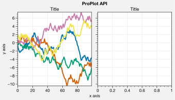

You can set up complex grids of subplots by passing 2D arrays of
integers to `~proplot.subplots.subplots`. Just think of this array as
a “picture” of your figure, where each unique number corresponds to a
unique axes. This allows us to build the below grids in just one line of
code. The number order determines the order of a-b-c labels, and the
order in which the axes appear in the `~proplot.subplots.axes_grid`.

.. code:: ipython3

    import proplot as plot
    import numpy as np
    data = 2*(np.random.rand(100,5)-0.5).cumsum(axis=0)
    f, axs = plot.subplots([[1,1,2,2],[0,3,3,0]], axwidth=1.5)
    axs.format(abc=True, abcloc='ul', suptitle='Subplot grid with centered rows', xlabel='xlabel', ylabel='ylabel')
    axs[2].plot(data, lw=2)
    f, axs = plot.subplots([[1,1,2],[1,1,6],[3,4,4],[3,5,5]], width=5)
    axs.format(suptitle='Complex subplot grid with axis-sharing + spanning labels', xlabel='xlabel', ylabel='ylabel', abc=True)
    axs[0].plot(data, lw=2)

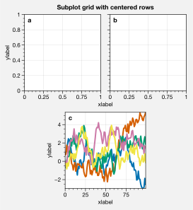

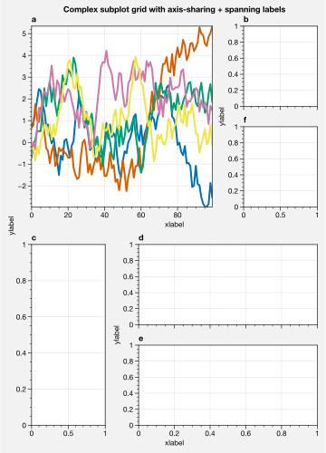

The format command
------------------

The `~proplot.subplots.subplots` method populates the
`~proplot.subplots.Figure` object with either
`~proplot.axes.CartesianAxes` (for Cartesian axes) or
`~proplot.axes.ProjectionAxes` (for cartopy or basemap projection
axes) axes objects. Both of these classes inherit from the base class
`~proplot.axes.BaseAxes`.

The **most important** new method you need to know is ``format``, found
on the `~proplot.axes.BaseAxes`, `~proplot.axes.CartesianAxes`, and
`~proplot.axes.ProjectionAxes` classes. ``format`` is your
one-stop-shop for changing axes settings. Keyword args passed to
``format`` are interpreted as follows.

1. Any keyword arg matching the name of a ProPlot or matplotlib “rc”
   setting will be applied to the axes using
   `~proplot.axes.BaseAxes.context`. If the name has “dots”, simply
   omit them. See the `~proplot.rctools` documentation for details.
2. Remaining keyword args are passed to ``format`` on the
   `~proplot.axes.CartesianAxes` or `~proplot.axes.ProjectionAxes`
   classes. This changes settings specific to Cartesian or map
   projection axes, e.g. changing tick locations (the former) or
   parallel and meridian gridlines (the latter).
3. The last keyword args are passed to ``format`` on the
   `~proplot.axes.BaseAxes` class. This changes settings shared by
   both `~proplot.axes.CartesianAxes` and
   `~proplot.axes.ProjectionAxes` – namely titles, a-b-c subplot
   labeling, and “super titles”.

Instead of using a series of verbose, one-liner setter methods like
``ax.set_title`` and ``ax.xaxis.tick_params``, ``format`` provides
simple shorthands for changing everything all at once. It also
integrates with the `~proplot.axistools.Locator`,
`~proplot.axistools.Formatter`, and `~proplot.axistools.Scale`
constructors, so you don’t have to directly invoke verbose abstract
classes. The goal of ``format`` is to reduce the amount of boilerplate
code needed for drawing highly customized plots. The power of ``format``
is demonstrated in the below example.

.. code:: ipython3

    import proplot as plot
    f, axs = plot.subplots(ncols=2, nrows=2, share=0, tight=True, axwidth=1.5)
    axs.format(xlabel='x-axis', ylabel='y-axis', xlim=(1,10), xlocator=1, xscale='log',
              ylim=(0,4), ylocator=plot.arange(0,4), yticklabels=('a', 'bb', 'c', 'dd', 'e'),
              title='Main', ltitle='Left', rtitle='Right', # different titles
              titleloc='c', suptitle='Demo of the format command',
              abc=True, abcloc='ul', abcformat='a.', xtickdir='inout',
              urtitle='Title A', lltitle='Title B', lrtitle='Title C', # extra titles
              ytickloc='both', yticklabelloc='both', ygridminor=True, xtickminor=False,
              collabels=['Column label 1', 'Column label 2'], rowlabels=['Row label 1', 'Row label 2'])

The axes grid container
-----------------------

Axes returned by `~proplot.subplots.subplots` are stored in the
`~proplot.subplots.axes_grid` container, which lets you call any
method on multiple axes *simultaneously*. It supports 1D and 2D indexing
(e.g. ``axs[2]`` or ``axs[1,2]``), and slicing it returns an
`~proplot.subplots.axes_grid` of the selection. 1D indexing is
row-major by default, but this can be changed with the ``order`` keyword
arg. In the below example, `~proplot.subplots.axes_grid` is used to
call :ref:`The format command` on several axes at once.

.. code:: ipython3

    import proplot as plot
    import numpy as np
    f, axs = plot.subplots(ncols=5, nrows=5, axwidth=0.8)
    axs[:,0].format(color='red8')
    axs[0,:].format(color='blue8')
    for ax in axs[1:,1:]:
        ax.plot(np.random.rand(10,4), color='gray7', cycle_kw={'linestyle':('-',':','--','-.')})
    axs[0].format(color='black', linewidth=2)
    axs.format(xlabel='xlabel', ylabel='ylabel', suptitle='Demo of axes_grid')

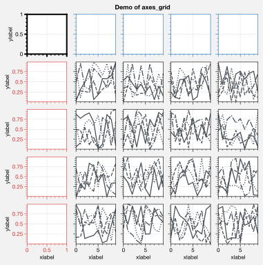

The rc object
-------------

A special object named `~proplot.rctools.rc`, belonging to the
`~proplot.rctools.rc_configurator` class, is created whenever you
import ProPlot. This object gives you advanced control over the look of
your plots – it is your **one-stop shop for changing global settings**.
`~proplot.rctools.rc` can be used to change matplotlib
`rcParams <https://matplotlib.org/users/customizing.html>`__ settings,
custom ProPlot :ref:`rcExtraParams` settings, and special
:ref:`rcGlobals` meta-settings. See the `~proplot.rctools`
documentation for more info.

To modify a setting for just one subplot, pass it to the
`~proplot.axes.BaseAxes.format` command. To reset everything to the
default state, use `~proplot.rctools.rc_configurator.reset`. To
temporarily modify global settings for a block of code, use
`~proplot.rctools.rc_configurator.context`.

.. code:: ipython3

    import proplot as plot
    import numpy as np
    # A bunch of different ways to update settings
    plot.rc.reset()
    plot.rc.cycle = 'colorblind'
    plot.rc.update({'fontname': 'DejaVu Sans'})
    plot.rc['figure.facecolor'] = 'gray3'
    plot.rc['axes.facecolor'] = 'gray5'
    with plot.rc.context(linewidth=1.5): # above mods are persistent, context mod only applies to figure
        f, axs = plot.subplots(ncols=2, aspect=1, width=6, span=False, sharey=2)
    # Make plot
    N, M = 100, 6
    values = np.arange(1,M+1)
    cycle = plot.Cycle('C0', 'C1', M, fade=80)
    for i,ax in enumerate(axs):
        data = np.cumsum(np.random.rand(N,M)-0.5, axis=0)
        lines = ax.plot(data, linewidth=3, cycle=cycle) # see "Changing the color cycle" for details
    axs.format(ytickloc='both', ycolor='blue7', 
               xlabel='x label', ylabel='y label',
               yticklabelloc='both',
               suptitle='Applying new rc settings',
               patch_kw={'hatch':'xxx', 'edgecolor':'w'})
    ay = axs[-1].twinx()
    ay.format(ycolor='r', linewidth=1.5, ylabel='secondary axis')
    ay.plot((np.random.rand(100)-0.2).cumsum(), color='r', lw=3)

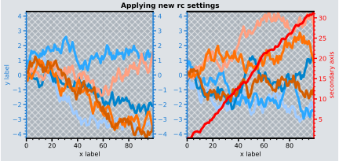

Pandas and xarray integration
-----------------------------

With ProPlot, when you pass a `pandas
DataFrame <https://pandas.pydata.org/pandas-docs/stable/reference/api/pandas.DataFrame.html>`__
or `xarray
DataArray <http://xarray.pydata.org/en/stable/data-structures.html>`__
to any plotting command, the x-axis label, y-axis label, legend label,
colorbar label, and/or title are configured from the metadata, and
labels and colorbars can be generated on-the-fly. This restores some of
the convenience you get with the builtin
`pandas <https://pandas.pydata.org>`__ and
`xarray <https://pandas.pydata.org>`__ plotting tools. This feature is
*optional*, and does not require that `pandas` and `xarray` are
installed.

This feature is showcased below for 1-dimensional and 2-dimensional
datasets. For more on the ``colorbar`` and ``legend`` keyword args, see
`~proplot.wrappers.cmap_wrapper`, `~proplot.wrappers.cycle_wrapper`,
and :ref:`Plotting wrappers`. For more on panels, see the
:ref:`Panels, colorbars, and legends` section.

.. code:: ipython3

    import xarray as xr
    import numpy as np
    import pandas as pd
    import proplot as plot
    # DataArray
    # Must be column major since plot draws lines from columns of arrays
    data = np.sin(np.linspace(0, 2*np.pi, 20))[:,None] + np.random.rand(20,8).cumsum(axis=1)
    da = xr.DataArray(data, dims=('x', 'cat'), coords={
        'x':xr.DataArray(np.linspace(0,1,20), dims=('x',), attrs={'long_name':'distance', 'units':'km'}),
        'cat':xr.DataArray(np.arange(0,80,10), dims=('cat',), attrs={'long_name':'parameter', 'units':'K'})
        }, name='position series')
    # DataFrame
    plot.rc.reset()
    ts = pd.date_range('1/1/2000', periods=20)
    data = (np.cos(np.linspace(0, 2*np.pi, 20))**4)[:,None] + np.random.rand(20,5)**2
    df = pd.DataFrame(data, index=ts, columns=['foo','bar','baz','zap','baf'])
    df.name = 'time series'
    df.index.name = 'time (s)'
    df.columns.name = 'columns'

.. code:: ipython3

    # Figure
    f, axs = plot.subplots(ncols=2, axwidth=2.2, share=0)
    axs.format(suptitle='Automatic subplot formatting')
    # Plot DataArray
    cycle = plot.Cycle(plot.shade('light blue', 0.4), fade=90, space='hcl')
    axs[0].plot(da, cycle=cycle, lw=3, colorbar='ul', colorbar_kw={'locator':20})
    # Plot Dataframe
    cycle = plot.Cycle(plot.shade('jade', 0.7), fade=90, space='hcl')
    axs[1].plot(df, cycle=color, lw=3, legend='uc')

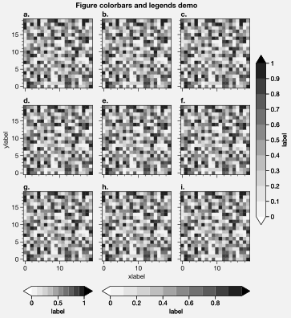

.. code:: ipython3

    import xarray as xr
    import numpy as np
    import pandas as pd
    import proplot as plot
    from string import ascii_lowercase
    # DataArray
    data = 50*(np.sin(np.linspace(0, 2*np.pi, 20) + 0)**2) * np.cos(np.linspace(0, np.pi, 20)+np.pi/2)[:,None]**2
    da = xr.DataArray(data, dims=('plev','lat'), coords={
        'plev':xr.DataArray(np.linspace(1000,0,20), dims=('plev',), attrs={'long_name':'pressure', 'units':'hPa'}),
        'lat':xr.DataArray(np.linspace(-90,90,20), dims=('lat',), attrs={'units':'degN'}), # if long_name absent, variable name is used
        }, name='u', attrs={'long_name':'zonal wind', 'units':'m/s'})
    # DataFrame
    data = np.random.rand(20,20)
    df = pd.DataFrame(data.cumsum(axis=0).cumsum(axis=1), index=[*ascii_lowercase[:20]])
    df.name = 'funky data'
    df.index.name = 'index'
    df.columns.name = 'time (days)'

.. code:: ipython3

    # Figure
    f, axs = plot.subplots(nrows=2, axwidth=2.2, share=0)
    axs.format(collabels=['Automatic subplot formatting']) # suptitle will look off center with the empty left panel
    # Plot DataArray
    axs[0].contourf(da, cmap='Greens', cmap_kw={'left':0.05}, colorbar='l', linewidth=0.7, color='gray7')
    axs[0].format(yreverse=True)
    # Plot DataFrame
    axs[1].contourf(df, cmap='Blues', colorbar='r', linewidth=0.7, color='gray7')
    axs[1].format(xtickminor=False)

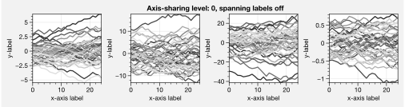

Axis sharing and spanning
-------------------------

Matplotlib has an “axis sharing” feature that holds axis limits the same
for axes within a grid of subplots. But this has no effect on the axis
labels and tick labels, which can lead to lots of redundant labels. To
help you eliminate these redundancies, ProPlot introduces *4
axis-sharing options* and a new *spanning label option*, controlled by
the ``share``, ``sharex``, ``sharey``, ``span``, ``spanx``, and
``spany`` keyword args. See `~proplot.subplots.sublots` and the below
example for details.

.. code:: ipython3

    import proplot as plot
    import numpy as np
    N = 50
    M = 40
    colors = plot.colors('grays_r', M, left=0.1, right=0.8)
    for share in (0,1,2,3):
        f, axs = plot.subplots(ncols=4, aspect=1, axwidth=1.2, sharey=share, spanx=share//2)
        gen = lambda scale: scale*(np.random.rand(N,M)-0.5).cumsum(axis=0)[N//2:,:]
        for ax,scale,color in zip(axs,(1,3,7,0.2),('gray9','gray7','gray5','gray3')):
            array = gen(scale)
            for l in range(array.shape[1]):
                ax.plot(array[:,l], color=colors[l])
            ax.format(suptitle=f'Axis-sharing level: {share}, spanning labels {["off","on"][share//2]}', ylabel='y-label', xlabel='x-axis label')

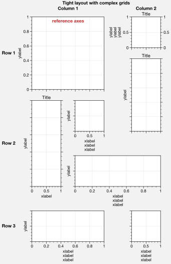

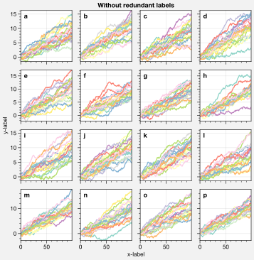

.. image:: tutorial/tutorial_22_2.svg

.. image:: tutorial/tutorial_22_3.svg

.. code:: ipython3

    import proplot as plot
    import numpy as np
    plot.rc.reset()
    plot.rc.cycle = 'Set3'
    titles = ['With redundant labels', 'Without redundant labels']
    for mode in (0,1):
        f, axs = plot.subplots(nrows=4, ncols=4, share=3*mode, span=1*mode, axwidth=1)
        for ax in axs:
            ax.plot((np.random.rand(100,20)-0.4).cumsum(axis=0))
        axs.format(xlabel='x-label', ylabel='y-label', suptitle=titles[mode], abc=mode, abcloc='ul')

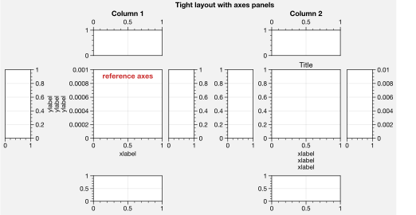

.. image:: tutorial/tutorial_23_1.svg

A-b-c subplot labels
--------------------

It is easy to add a-b-c labels to axes generated by
`~proplot.subplots.subplots`. The label order is set by the array
numbers – or if an array was not provided, it is row-major by default
and controlled by the `~proplot.subplots.subplots` ``order`` keyword
arg. The label position can be changed with the ``abc.loc``
`~proplot.rctools.rc` option, and the label style can be changed with
the ``abc.format`` `~proplot.rctools.rc` option. See
:ref:`The format command` and :ref:`Global settings control` for
details.

.. code:: ipython3

    import proplot as plot
    f, axs = plot.subplots(nrows=8, ncols=8, axwidth=0.7, flush=True) 
    axs.format(abc=True, abcloc='ur', xlabel='x axis', ylabel='y axis',
               xticks=[], yticks=[], suptitle='A-b-c labels on grid of flush subplots')

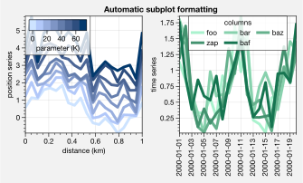

Arbitrary physical units
------------------------

*Arbitrary units* are supported for most arguments to ProPlot functions.
That is, if a sizing argument is numeric, the units are inches or
points, and if string, the units are interpreted by
`~proplot.utils.units`. A table of acceptable units is found in the
`~proplot.utils.units` documentation (they include centimeters,
millimeters, and pixels).

.. code:: ipython3

    import proplot as plot
    import numpy as np
    f, axs = plot.subplots(ncols=3, width='12cm', height='55mm', wspace=('10pt', '20pt'))
    axs.format(small='12px', large='15px', linewidth='0.5mm')
    axs.format(suptitle='Arguments with arbitrary units', xlabel='x axis', ylabel='y axis')

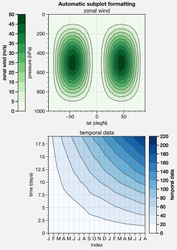

Automatic subplot spacing
-------------------------

Matplotlib has a `tight layout
feature <https://matplotlib.org/3.1.1/tutorials/intermediate/tight_layout_guide.html>`__
whereby the spacing between subplot content and the figure edge, and
between content in adjacent subplots, is automatically adjusted.

ProPlot has a similar tight layout feature, applied automatically when
the figure is drawn (pass ``tight=False`` to turn this off). ProPlot’s
tight layout *preserves subplot aspect ratios, panel widths, and subplot
physical dimensions* – the latter only if ``axwidth`` or ``axheight``
were passed to `~proplot.subplots.subplots` instead of ``width``,
``height``, or ``figsize``. It is also more robust to complex geometry,
and permits *variable spacing between rows and columns* – that is,
``wspace`` and ``hspace`` no longer have to be scalars, thanks to the
`~proplot.subplots.FlexibleGridSpec` class. The below examples are a
stress test of this feature.

Aspect ratio conservation is *useful* for ordinary Cartesian plots where
an aspect ratio of ``1`` is desirable, and *critical* for grids of map
projections or `~matplotlib.axes.Axes.imshow` plots that require fixed
aspect ratios. It works by making figure dimensions *flexible*: the
width or height is scaled to accommodate the subplot dimensions. The
``aspect`` keyword arg, along with the ``axwidth`` and ``axheight``
keyword args, apply to the *reference* axes specified by the ``ref``
keyword arg (defaults to ``1``, i.e. the subplot in the upper left
corner).

.. code:: ipython3

    import proplot as plot
    for ref in (1,2):
        f, axs = plot.subplots(ref=ref, nrows=3, ncols=3, aspect=1, axwidth=1, wratios=(3,2,2), share=0)
        axs[ref-1].format(title='reference axes', titleweight='bold', titleloc='uc', titlecolor='red9')
        axs[4].format(title='title\ntitle\ntitle', suptitle='Tight layout with simple grids')
        axs[1].format(ylabel='ylabel\nylabel\nylabel')
        axs[:4:2].format(xlabel='xlabel\nxlabel\nxlabel')
        axs.format(rowlabels=['Row 1', 'Row 2', 'Row 3'], collabels=['Column 1', 'Column 2', 'Column 3'])

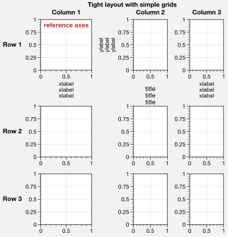

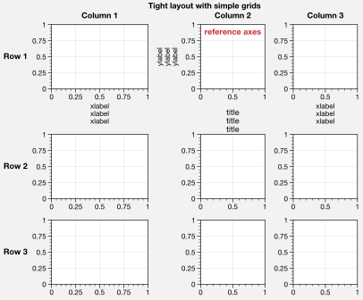

.. code:: ipython3

    import proplot as plot
    f, axs = plot.subplots([[1,1,2],[1,1,3],[4,5,3],[4,6,6],[7,7,8]], span=False)
    axs.format(xlabel='xlabel', ylabel='ylabel', suptitle='Super title')
    axs[0].format(xlabel='xlabel\nxlabel\nxlabel', title='reference axes', titleweight='bold', titleloc='uc', titlecolor='red9')
    axs[1].format(ylabel='ylabel\nylabel\nylabel', ytickloc='both', yticklabelloc='both', title='Title')
    axs[2:4].format(yformatter='null', title='Title', ytickloc='both', yticklabelloc='both')
    axs[3:].format(yformatter='null', xlabel='xlabel\nxlabel\nxlabel')
    axs.format(suptitle='Tight layout with complex grids', rowlabels=['Row 1', 'Row 2', 'Row 3'], collabels=['Column 1', 'Column 2'])

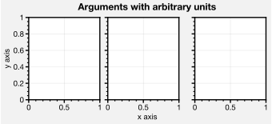

.. code:: ipython3

    import proplot as plot
    f, axs = plot.subplots(axwidth=1.2, ncols=2, share=0, axpanels='lrbt',
               axpanels_kw={'bstack':1, 'share':False})
    axs[0].format(ylim=(0,1e-3), title='reference axes', titleweight='bold', titleloc='uc', titlecolor='red9')
    axs[0].lpanel.format(ytickloc='right', yticklabelloc='right')
    axs[0].rpanel.format(ylabel='ylabel', ytickloc='right', yticklabelloc='right')
    axs[0].bpanel.format(xlabel='xlabel')
    axs[1].rpanel.format(ylim=(0, 0.01), ylabel='ylabel')
    axs[1].format(ylabel='ylabel\nylabel\nylabel', xlabel='xlabel\nxlabel\nxlabel', title='Title', top=False,
                  collabels=['Column 1', 'Column 2'], suptitle='Tight layout with axes panels')
    axs.tpanel.format(ylim=(-0.5,1.5), ylocator=1, ytickminor=False)

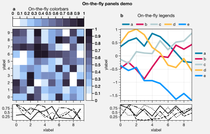

