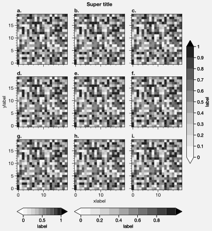
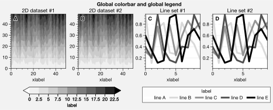
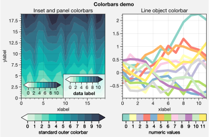
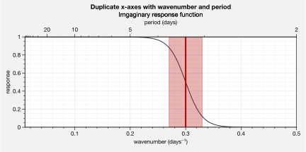

Colorbars, legends, and panels
==============================

It is common to need colorbars and legends along the *edges* of subplots
and figures. It is also common to need “panels” along the edges of
subplots, for plotting secondary 1-dimensional datasets or summary
statistics. ProPlot satisfies both of these needs by introducing the
“panels” construct, powered by `~proplot.axes.BaseAxes.panel`,
`~proplot.subplots.subplots`, and the `~proplot.axes.PanelAxes`
class.

The `~proplot.axes.PanelAxes.colorbar` and
`~proplot.axes.PanelAxes.legend` methods on every
`~proplot.axes.PanelAxes` instance *fill* the panel with colorbars or
legends when invoked. That is, the panel is used as the ``cax`` argument
in the call to `~matplotlib.figure.Figure.colorbar`, or a legend is
drawn in the center of the panel and the axes background and spines are
made invisible.

ProPlot has two types of panels: *axes panels* and *figure panels*. The
former lie along the edge of subplots, and the latter lie along the edge
of figures. This section documents their usage.

On-the-fly axes panels
----------------------

On-the-fly panels is one of the most useful features provided by
ProPlot. There are three ways to generate an on-the-fly axes panel:

1. Pass the ``colorbar`` keyword to any method wrapped by
   `~proplot.wrappers.cmap_wrapper`, or pass the ``colorbar`` or
   ``legend`` keywords to any method wrapped by
   `~proplot.wrappers.cycle_wrapper`. The argument is the panel
   location, e.g. ``colorbar='left'`` or ``colorbar='l'``. To specify
   panel settings, pass the ``panel_kw`` dictionary keyword arg.
2. Pass the ``loc`` keyword to the `~proplot.axes.BaseAxes.colorbar`
   or `~proplot.axes.BaseAxes.legend` `~proplot.axes.BaseAxes`
   methods. Again, the argument is the panel location, e.g.
   ``loc='left'`` or ``loc='l'``. This is what approach #1 does
   internally. To specify panel settings, pass the ``panel_kw``
   dictionary keyword arg.
3. Directly call the `~proplot.axes.BaseAxes.panel` method, e.g.
   ``pax = ax.panel('l', **kwargs)``, and then call the
   `~proplot.axes.PanelAxes.colorbar` or
   `~proplot.axes.PanelAxes.legend` `~proplot.axes.PanelAxes`
   methods on ``pax``. This is what the approach #2 does internally.

No matter the combination of axes panels in your subplot grid, the
layout will stay aligned. To modify default panel settings, use the
`~proplot.rctools.rc` object or create a custom ``.proplotrc`` file
(see the `~proplot.rctools` documentation for details). Note that all
axes panels are stored as the “parent” axes attributes ``bottompanel``,
``leftpanel``, ``rightpanel``, and ``toppanel``, with the shorthand
aliases ``bpanel``, ``lpanel``, ``rpanel``, and ``tpanel``.

.. code:: ipython3

    import proplot as plot
    import numpy as np
    with plot.rc.context(abc=True):
        f, axs = plot.subplots(ncols=2, tight=True, share=0)
    ax = axs[0]
    m = ax.heatmap(np.random.rand(10,10), colorbar='t', cmap='dusk')
    ax.colorbar(m, loc='r')
    ax.format(title='On-the-fly colorbars', suptitle='On-the-fly panels demo')
    ax = axs[1]
    ax.format(title='On-the-fly legends')
    hs = ax.plot((np.random.rand(10,5)-0.5).cumsum(axis=0), lw=3, legend='t', cycle='sharp',
            labels=list('abcde'), legend_kw={'ncols':5, 'frame':False})
    ax.legend(hs, loc='r', ncols=1, frame=False)
    # Calling the panel method
    for ax in axs:
        pax = ax.panel('b', share=True)
        pax.plot(np.random.rand(10,4), cycle_kw={'linestyle':('-','--','-.',':')})
        # ax.bpanel.plot(...) # also works!
    axs.format(xlabel='xlabel', ylabel='ylabel')

.. image:: tutorial/tutorial_33_0.svg

Bulk axes panels
----------------

If you want to plot stuff on panels in a large subplot array, generating
each panel on-the-fly would be cumbersome. That’s why
`~proplot.subplots.subplots` allows you to generate axes panels in
*bulk* with the ``axpanel`` or ``axpanels`` keyword args. To modify
panel properties, use the ``axpanel_kw`` or ``axpanels_kw`` dictionary
keyword args. See `~proplot.subplots.subplots` for details.

If you intend to fill the bulk-generated panels with *colorbars*, you
can use the ``axcolorbar``, ``axcolorbars``, ``axcolorbar_kw``, or
``axcolorbars_kw`` keyword args instead of ``axpanel``, etc. The
behavior is identical, except the *default* panel width is more
appropriate for colorbars. Similarly, if you intend to fill the panels
with *legends*, you should use the ``axlegend``, ``axlegends``,
``axlegend_kw``, and ``axlegends_kw`` keyword args.

The below examples demonstrate a few more panel features. To draw panels
“flush” against the subplot, use the ``bflush``, ``tflush``, ``lflush``,
and ``rflush`` keyword args. If you want to disable “axis sharing” with
the parent subplot (see :ref:`Axis sharing and spanning`), use the
``bshare``, ``tshare``, ``rshare``, and ``lshare`` keyword args. See
`~proplot.axes.BaseAxes.panel` for details.

.. code:: ipython3

    # Arbitrarily complex combinations are possible, and inner spaces still determined automatically
    import proplot as plot
    f, axs = plot.subplots(axwidth=1.5, nrows=2, ncols=2,
                           axpanels={1:'t', 2:'l', 3:'b', 4:'r'},
                           tight=True, share=0)
    axs.format(title='Title', suptitle='This is a super title', collabels=['Column 1','Column 2'],
               abcloc='ul', titleloc='uc', xlabel='xlabel', ylabel='ylabel', abc=True, top=False)
    axs.format(xlim=(0,1), ylim=(0,1), ylocator=plot.arange(0.2,0.8,0.2), xlocator=plot.arange(0.2,0.8,0.2))

.. image:: tutorial/tutorial_36_0.svg

.. code:: ipython3

    import proplot as plot
    import numpy as np
    plot.rc.reset()
    f, axs = plot.subplots(axwidth=1.7, nrows=2, ncols=2, share=0, panelpad=0.1,
                           axpanels='r', axpanels_kw={'share':False, 'flush':True})
    axs.format(xlabel='xlabel', ylabel='ylabel', suptitle='This is a super title')
    for i,ax in enumerate(axs):
        ax.format(title=f'Dataset {i+1}')
    data = (np.random.rand(20,20)-0.1).cumsum(axis=1)
    m = axs.contourf(data, cmap='glacial', levels=plot.arange(-1,11),
                     colorbar='b', colorbar_kw={'label':'cbar'})
    axs.rpanel.plot(data.mean(axis=1), np.arange(20), color='k')
    axs.rpanel.format(title='Mean')

.. image:: tutorial/tutorial_37_0.svg

Global figure panels
--------------------

ProPlot also supports “figure” panels. These panels are generally filled
with colorbars and legends as *global* references for content that
appears in more than one subplot. Figure panels are declared with the
``panel``, ``colorbar``, ``legend``, ``panels``, ``colorbars``, and
``legends`` keyword args. They can extend across entire sides of the
figure, or across arbitrary contiguous rows and columns of subplots,
using the ``barray``, ``rarray``, or ``larray`` keyword args.

Figure panel axes are stored on the `~proplot.subplots.Figure`
instance as the attributes ``bottompanel``, ``leftpanel``, and
``rightpanel`` and the shorthands ``bpanel``, ``lpanel``, and
``rpanel``. See `~proplot.subplots.subplots` for details.

.. code:: ipython3

    import proplot as plot
    import numpy as np
    f, axs = plot.subplots(ncols=3, nrows=3, axwidth=1.2, colorbar='br', barray=[1,2,2])
    m = axs.pcolormesh(np.random.rand(20,20), cmap='grays', levels=np.linspace(0,1,11), extend='both')[0]
    axs.format(suptitle='Super title', abc=True, abcloc='l', abcformat='a.', xlabel='xlabel', ylabel='ylabel')
    f.bpanel[0].colorbar(m, label='label', ticks=0.5)
    f.bpanel[1].colorbar(m, label='label', ticks=0.2)
    f.rpanel.colorbar(m, label='label', ticks=0.1, length=0.7)

.. code:: ipython3

    import proplot as plot
    import numpy as np
    f, axs = plot.subplots(ncols=4, axwidth=1.3, colorbar='b', barray=[1,1,2,2], share=0, wspace=0.3)
    data = (np.random.rand(50,50)-0.1).cumsum(axis=0)
    m = axs[:2].contourf(data, cmap='grays', extend='both')
    cycle = plot.colors('grays', 5)
    hs = []
    for abc,color in zip('ABCDEF',cycle):
        h = axs[2:].plot(np.random.rand(10), lw=3, color=color, label=f'line {abc}')
        hs.extend(h[0])
    f.bpanel[0].colorbar(m[0], length=0.8, label='label')
    f.bpanel[1].legend(hs, ncols=5, label='label', frame=True)
    axs.format(suptitle='Global colorbar and global legend', abc=True, abcloc='ul', abcformat='A')
    for ax,title in zip(axs, ['2D dataset #1', '2D dataset #2', 'Line set #1', 'Line set #2']):
        ax.format(xlabel='xlabel', title=title)

Stacked panels
--------------

ProPlot also allows arbitrarily *stacking* panels with the ``lstack``,
``bstack``, ``rstack``, and ``tstack`` `~proplot.axes.BaseAxes.panel`
keyword args. This can be useful when you want multiple global
colorbars, when using more than one colormap inside a single axes, or
when you need multiple panels for displaying different statistics. The
spacing between stacked panels is adjusted automatically to account for
axis and tick labels. See `~proplot.subplots.subplots` and
`~proplot.subplots.Figure.add_subplot_and_panels` for details.

You can access individual panels in a stack by *indexing* the panel
attribute. The default order is row-major, from top-left to
bottom-right. For example, ``ax.lpanel[1]`` gives you a left panel,
second from the left. If you are stacking *figure* panels and have
different panels for each row and column (see
:ref:`Global figure panels`), you can use 2D indexing. For example,
``fig.bpanel[1,0]`` gives you a panel in the first column, second from
the top.

.. code:: ipython3

    import proplot as plot
    import numpy as np
    f, axs = plot.subplots(nrows=2, axwidth='4cm', share=0)
    axs.panel_axes('l', mode='colorbar', stack=3) # subplots(..., axcolorbars='l') also works
    axs.panel_axes('r', stack=2, flush=True, width=0.5) # subplots(..., axpanels='r') also works
    axs[0].format(title='Stacked panel demo', titleweight='bold')
    # Draw stuff in axes
    N = 10
    for ax in axs:
        # Colormap data
        # Specify colorbar location with colorbar=('l', index) where index is the stack index
        ax.format(xlabel='data', xlocator=np.linspace(0, 0.8, 5))
        for i,(x0,y0,x1,y1,cmap,scale) in enumerate(((0,0.5,1,1,'grays',0.5), (0,0,0.5,0.5,'reds',1), (0.5,0,1,0.5,'blues',2))):
            data = np.random.rand(N,N)*scale
            x, y = np.linspace(x0, x1, 11), np.linspace(y0, y1, 11)
            ax.pcolormesh(x, y, data, cmap=cmap, levels=np.linspace(0,scale,11), colorbar=('l',i))
            # ax.bpanel[i].colorbar(m) # also works
        # Plot data
        for i,pax in enumerate(ax.rpanel):
            func = data.mean if i==0 else data.std
            label = ('mean' if i==0 else 'stdev')
            pax.plot(func(axis=1), plot.arange(0.05, 0.95, 0.1), lw=2, color='k')
            pax.format(yticklen=0, xlabel=label, xlim=(0,1.5), xlocator=1)

.. image:: tutorial/tutorial_43_0.svg

New colorbar features
---------------------

As seen above, `~proplot.axes.BaseAxes` and
`~proplot.axes.PanelAxes` axes have their own colorbar methods. These
methods are packed with new features, powered by the
`~proplot.wrappers.colorbar_wrapper` wrapper. For example, when you
call `~proplot.axes.BaseAxes.colorbar` on an ordinary axes, an *inset*
colorbar is generated. And to draw colorbars from *lists of colors* or
*lists of artists* instead of “mappable” objects, just pass the list to
`~proplot.axes.BaseAxes.colorbar`. A colormap is constructed from the
corresponding colors on-the-fly.

`~proplot.axes.BaseAxes.colorbar` also handles colorbars normalized by
`~matplotlib.colors.LogNorm` correctly, and can be used to change
outline, divider, tick location, tick label, and colorbar label
settings. See `~proplot.wrappers.colorbar_wrapper` for details.

.. code:: ipython3

    import proplot as plot
    import numpy as np
    # Original
    f, axs = plot.subplots(ncols=2, share=0)
    ax = axs[0]
    m = ax.contourf((np.random.rand(20,20)).cumsum(axis=0), extend='both', levels=np.linspace(0,10,11), cmap='marine')
    ax.format(xlabel='xlabel', ylabel='ylabel', xlim=(0,19), ylim=(0,19))
    ax.colorbar(m, ticks=2, label='data label', labelweight='bold', frame=True)
    ax.colorbar(m, ticks=2, loc='lower left', frame=False)
    ax.colorbar(m, loc='b', label='standard outer colorbar', length=0.9)
    ax.format(title='Inset and panel colorbars', suptitle='Colorbars demo')
    # From lines
    ax = axs[1]
    hs = ax.plot((np.random.rand(12,12)-0.45).cumsum(axis=0), lw=4, cycle='set3')
    ax.format(title='Line object colorbar', xlabel='xlabel')
    ax.colorbar(hs, loc='b', values=np.arange(0,len(hs)), label='numeric values', tickloc='bottom')

New legend features
-------------------

ProPlot also adds several new features to the
`~matplotlib.axes.Axes.legend` command, powered by
`~proplot.wrappers.legend_wrapper`. You can *center legend rows* with
the ``center`` keyword arg, or by passing a list of lists of plot
handles. This is accomplished by stacking multiple single-row,
horizontally centered legends, then manually adding an encompassing
legend frame.

You can also switch between row-major and column-major order for legend
entries (the new default is row-major), and modify legend text
properties and handle properties. See
`~proplot.wrappers.legend_wrapper` for details.

.. code:: ipython3

    import proplot as plot
    import numpy as np
    plot.rc.cycle = 'contrast'
    labels = ['a', 'bb', 'ccc', 'dddd', 'eeeee']
    f, axs = plot.subplots(ncols=2, span=False, share=1)
    hs1, hs2 = [], []
    # Plot lines and add to legends on-the-fly
    for i,label in enumerate(labels):
        data = (np.random.rand(20)-0.45).cumsum(axis=0)
        h1 = axs[0].plot(data, lw=4, label=label, legend='ul', legend_kw={'order':'F'}) # add to legend in upper left
        hs1.extend(h1)
        h2 = axs[1].plot(data, lw=4, label=label, legend='r', legend_kw={'ncols':1}, cycle='floral') # add to legend in right panel
        hs2.extend(h2)
    # Outer legends
    ax = axs[0]
    ax.format(title='Added legend features')
    ax.legend(hs1, loc='b', ncols=3, center=False, frame=True)
    ax = axs[1]
    ax.format(title='Row-centered legends')
    ax.legend(hs2, loc='b', ncols=3, center=True) # also works!
    axs.format(xlabel='xlabel', ylabel='ylabel', suptitle='Legends demo')

