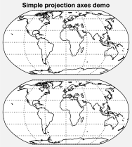
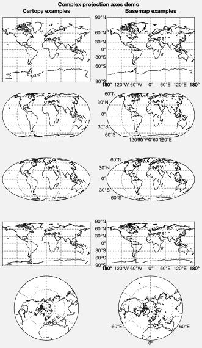
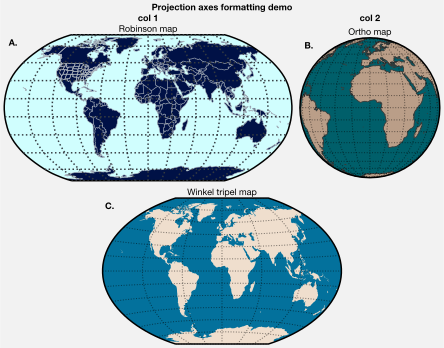
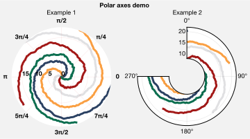

Projection axes
===============

ProPlot includes seamless integration with the builtin matplotlib `polar
projection <https://matplotlib.org/3.1.0/gallery/pie_and_polar_charts/polar_demo.html>`__
and the `cartopy <https://scitools.org.uk/cartopy/docs/latest/>`__ and
`basemap <https://matplotlib.org/basemap/index.html>`__ packages. This
feature is optional – if you don’t care about map projections, you don’t
need to have `cartopy` or `~mpl_toolkits.basemap` installed. Map
projection axes generated by `~proplot.subplots.subplots` belong to
the `~proplot.axes.ProjectionAxes` class, the parent class to
`~proplot.axes.PolarAxes`, `~proplot.axes.CartopyAxes`, and
`~proplot.axes.BasemapAxes`.

Note that in 2020, active development for `~mpl_toolkits.basemap` will
stop. Its users are encouraged to switch to `cartopy`, which is
integrated more closely with the matplotlib API and has more room for
growth. However for the time being, `~mpl_toolkits.basemap` has one
major advantage: meridian and parallel labeling. With `cartopy`,
gridline labels are only possible with equirectangular and Mercator
projections. With `~mpl_toolkits.basemap`, labels are possible with
all projections.

Choosing map projections
------------------------

To specify a projection, supply `~proplot.subplots.subplots` with the
``proj`` keyword arg. To specify projection properties, use the
``proj_kw`` keyword arg (see below). To toggle `~mpl_toolkits.basemap`
for arbitrary subplots, use the ``basemap`` keyword arg. See
`~proplot.subplots.subplots` for details. See the `~proplot.projs`
documentation for a table of full projection names, short projection
names, and links to the
`PROJ.4 <https://proj4.org/operations/projections/index.html>`__
documentation (both `cartopy` and `~mpl_toolkits.basemap` are
internally powered by `PROJ.4 <https://proj4.org>`__).

To pass keyword args to `~mpl_toolkits.basemap.Basemap` and
`cartopy.crs.Projection` classes on instantiation, pass a ``proj_kw``
dictionary of keyword args to `~proplot.subplots.subplots`. With
ProPlot, you can supply native PROJ.4 keyword names to the
`cartopy.crs.Projection` classes just like `~mpl_toolkits.basemap`
(e.g. ``lon_0`` instead of ``central_longitude``). This is just meant to
make things a bit less verbose.

.. code:: ipython3

    import proplot as plot
    # Simple example
    f, axs = plot.subplots(ncols=2, axwidth=2.5, proj='robin', proj_kw={'lon_0':180})
    axs.format(suptitle='Simple projection axes demo', coast=True, latlines=30, lonlines=60)
    # Complex example
    f, axs = plot.subplots(
        basemap={(1,3,5,7,9):False, (2,4,6,8,10):True},
        proj={(1,2):'mill', (3,4):'eck4', (5,6):'moll', (7,8):'cyl', (9,10):'npstere'},
        ncols=2, nrows=5) #, proj_kw={'lon_0':0})
    axs.format(suptitle='Complex projection axes demo')
    axs.format(labels=True, coast=True, latlines=30, lonlines=60)
    axs.format(collabels=['Cartopy examples', 'Basemap examples'])

Plotting geophysical data
-------------------------

The below demonstrates how to plot geophysical data with ProPlot. For
`cartopy` projections, you no longer need to pass
``transform=crs.PlateCarree()`` to the plotting method (as I found
myself doing 99% of the time); ProPlot makes this the default. And
`~mpl_toolkits.basemap` usage is considerably simplified with ProPlot
– you can simply call the axes method instead of calling the method on
the `~mpl_toolkits.basemap.Basemap` instance, and you no longer need
to pass ``latlon=True`` to the plotting command; ProPlot makes this the
default. For both `~mpl_toolkits.basemap` and `cartopy` projections,
you can also pass ``globe=True`` to 2d plotting commands to ensure
global data coverage.

These features are powered by the `~proplot.wrappers.cartopy_gridfix`,
`~proplot.wrappers.cartopy_transform`,
`~proplot.wrappers.basemap_gridfix`, and
`~proplot.wrappers.basemap_latlon` wrappers.

.. code:: ipython3

    import proplot as plot
    import numpy as np
    offset = -40
    x = plot.arange(0+offset, 360+offset-1, 60)
    y = plot.arange(-60,60+1,30)
    data = np.random.rand(len(y), len(x))
    for globe in (False,True):
        f, axs = plot.subplots(ncols=2, nrows=2, axwidth=2.5, colorbars='b',
                               proj='hammer', proj_kw={'lon_0':0}, basemap={(1,3):False, (2,4):True})
        for ax,p,pcolor,basemap in zip(axs,range(4),[1,1,0,0],[0,1,0,1]):
            m = None
            cmap = ('sunset', 'sunrise')[basemap]
            levels = [0, .3, .5, .7, .9, 1]
            levels = np.linspace(0,1,11)
            if pcolor:
                m = ax.pcolor(x, y, data, levels=levels, cmap=cmap, extend='neither', globe=globe)
            if not pcolor:
                m = ax.contourf(x, y, data, levels=levels, cmap=cmap, extend='neither', globe=globe)
            if p<2:
                c = f.bpanel[p].colorbar(m, label='values', tickminor=False)
        axs.format(suptitle=f'Plotting data {("with" if globe else "without")} global coverage',
                   collabels=['Cartopy example', 'Basemap example'],
                   rowlabels=['Pcolor', 'Contourf'], labels=False,
                   abc=True, abcformat='a)', abcloc='ul', abcborder=False)

.. image:: tutorial/tutorial_60_0.svg

.. image:: tutorial/tutorial_60_1.svg

Formatting projection axes
--------------------------

Just like `~proplot.axes.CartesianAxes`, `~proplot.axes.CartopyAxes`
and `~proplot.axes.BasemapAxes` have their own ``format`` methods
(their usage is identical). ``format`` can be used to draw gridlines,
add gridline labels, modify the projection bounding box, and add and
stylize geographic features, like continents and international borders.

.. code:: ipython3

    import proplot as plot
    import numpy as np
    N = 40
    f, axs = plot.subplots([[1,1,2],[3,3,3]], axwidth=4, proj={1:'robin', 2:'ortho', 3:'wintri'})
    ax = axs[0]
    ax.format(title='Robinson map', land=True, landcolor='navy blue', facecolor='pale blue',
               coastcolor='gray5', borderscolor='gray5', innerborderscolor='gray5',
               geogridlinewidth=1.5, geogridcolor='gray8', geogridalpha=1, 
               coast=True, innerborders=True, borders=True)
    ax = axs[1]
    ax.format(title='Ortho map', reso='med', land=True, coast=True, latlines=10, lonlines=15,
              landcolor='mushroom', suptitle='Projection axes formatting demo',
              facecolor='petrol', coastcolor='charcoal', coastlinewidth=0.8, geogridlinewidth=1)
    ax = axs[2]
    ax.format(land=True, facecolor='ocean blue', landcolor='almond', title='Winkel tripel map',
             lonlines=60, latlines=15)
    axs.format(suptitle='Projection axes formatting demo', collabels=['col 1', 'col 2'],
               abc=True, abcformat='A.', abcloc='ul', abcborder=False, linewidth=1.5)

Zooming into projections
------------------------

Zooming into projections is done much as before. For `cartopy`
projections, you can use `~cartopy.mpl.geoaxes.GeoAxes.set_extent`, or
alternatively pass ``lonlim`` and/or ``latlim`` to
`~proplot.axes.ProjectionAxes.format`. For `~mpl_toolkits.basemap`
projections, you must set the limits when declaring the projection by
passing ``proj_kw`` to `~proplot.subplots.subplots` with any of the
``llcrnrlon``, ``llcrnrlat``, ``urcrnrlon``, ``urcrnrlat``, ``llcrnrx``,
``llcrnry``, ``urcrnrx``, ``urcrnry``, ``width``, and/or ``height``
keyword args.

For North or South Pole-centered projections, pass a dictionary
containing the ``'boundinglat'`` key to ``proj_kw``. For `cartopy`
projections, a circular boundary is drawn around zoomed-in polar
projections, just like in `~mpl_toolkits.basemap` (implemented
following `this
example <https://scitools.org.uk/cartopy/docs/latest/gallery/always_circular_stereo.html>`__).
Note that ProPlot also adds the ``'npaeqd'``, ``'spaeqd'``,
``'nplaea'``, and ``'splaea'`` `cartopy` projections to the existing
``'npstere'`` and ``'spstere'`` projections, just like in
`~mpl_toolkits.basemap`.

.. code:: ipython3

    import proplot as plot
    f, axs = plot.subplots(nrows=2, proj='pcarree', axwidth=4.5, basemap={1:False, 2:True},
               proj_kw={1:{'lon_0':0}, 2:{'llcrnrlon':-20, 'llcrnrlat':-10, 'urcrnrlon':180, 'urcrnrlat':50}})
    # Normal projection
    axs[0].format(lonlim=(-20,180), latlim=(-10,50), title='Cartopy example')
    axs[1].format(title='Basemap example')
    axs.format(land=True, suptitle='Zooming into projections')
    # Polar projection
    f, axs = plot.subplots(ncols=2, axwidth=2, basemap={1:False,2:True}, proj={1:'splaea', 2:'npaeqd'},
                          proj_kw={1:{'boundinglat': -30, 'lon_0': 120}, 2:{'boundinglat':60}})
    axs.format(land=True, suptitle='Zooming into polar projections')
    axs[0].format(title='Cartopy example', latmax=80, latlines=20)
    axs[1].format(title='Basemap example', latmax=80, latlines=10)

.. image:: tutorial/tutorial_66_1.svg

Registered cartopy projections
------------------------------

Below is an illustration of the available `cartopy` projections (see
the `~proplot.projs` documentation for a table). Note that you no
longer have to reference the `cartopy.crs.Projection` classes directly
– instead, just like `~mpl_toolkits.basemap`, you can specify a native
PROJ.4 short name (e.g. ``'robin'`` or ``'merc'``). ProPlot also adds to
`cartopy` the previously unavailable Aitoff, Hammer, Winkel Tripel,
and Kavrisky VII projections by subclassing the
`cartopy.crs.Projection` class.

.. code:: ipython3

    import proplot as plot
    import numpy as np
    projs = ['cyl', 'merc', 'mill', 'lcyl', 'tmerc',
             'robin', 'hammer', 'moll', 'kav7', 'aitoff', 'wintri', 'sinu',
             'geos', 'ortho', 'nsper', 'aea', 'eqdc', 'lcc', 'gnom', 'npstere', 'igh',
             'eck1', 'eck2', 'eck3', 'eck4', 'eck5', 'eck6']
    f, axs = plot.subplots(ncols=3, nrows=9, left=0.1, bottom=0.1, right=0.1, top=0.5, proj=projs)
    axs.format(land=True, reso='lo', labels=False, suptitle='Table of cartopy projections')
    for proj,ax in zip(projs,axs):
        ax.format(title=proj, titleweight='bold', labels=False)

.. image:: tutorial/tutorial_69_1.svg

Registered basemap projections
------------------------------

Below is an illustration of the available `~mpl_toolkits.basemap`
projections (see the `~proplot.projs` documentation for a table).
`~mpl_toolkits.basemap` projection bounds are usually rectangles,
while `cartopy` bounds are more flexible. While the default
`~mpl_toolkits.basemap` API requires you to specify projection keyword
args *explicitly* or an error is thrown (e.g. ``lon_0`` and ``lat_0``),
ProPlot passes default keyword args to `~mpl_toolkits.basemap.Basemap`
if you fail to specify them.

.. code:: ipython3

    import proplot as plot
    import numpy as np
    projs = ['cyl', 'merc', 'mill', 'cea', 'gall', 'sinu',
             'eck4', 'robin', 'moll', 'kav7', 'hammer', 'mbtfpq',
             'geos', 'ortho', 'nsper',
             'vandg', 'aea', 'eqdc', 'gnom', 'cass', 'lcc',
             'npstere', 'npaeqd', 'nplaea', 'spstere', 'spaeqd', 'splaea']
    f, axs = plot.subplots(ncols=3, nrows=9, left=0.1, bottom=0.1, right=0.1, top=0.5, basemap=True, proj=projs)
    axs.format(land=True, labels=False, suptitle='Table of basemap projections')
    for proj,ax in zip(projs,axs):
        ax.format(title=proj, titleweight='bold', labels=False)

.. image:: tutorial/tutorial_72_0.svg

Polar projections
-----------------

Matplotlib polar axes are also integrated with ProPlot, thanks to the
`~proplot.axes.PolarAxes` subclass. The
`~proplot.axes.PolarAxes.format` command permits all sorts of polar
axes-specific modifications, including making sector plots, annular
plots, and changing the positive azimuthal direction. To draw polar
axes, just pass e.g. ``proj='polar'`` or ``proj={1:'polar'}`` to
`~proplot.subplots.subplots`.

.. code:: ipython3

    import proplot as plot
    import numpy as np
    f, axs = plot.subplots([[1,1,2,2],[0,3,3,0]], proj='polar')
    axs.format(suptitle='Polar axes demo', collabelweight='normal')
    N = 200
    x = np.linspace(0, 2*np.pi, N)
    y = 100*(np.random.rand(N,5)-0.3).cumsum(axis=0)/N
    for i in range(5):
        axs.plot(x + i*2*np.pi/5, y[:,i], cycle='contrast', zorder=0, lw=3)
    axs.format(linewidth=1, ticklabelsize=9, rlines=0.5, rlim=(0,19))
    axs[0].format(title='Normal plot', thetaformatter='pi', rlines=5, gridalpha=1, gridlinestyle=':',
                  rlabelpos=180, color='gray8', ticklabelweight='bold')
    axs[1].format(title='Sector plot', thetadir=-1, thetalines=90, thetalim=(0,270), theta0='N',
                  rlim=(0,22), rlines=5)
    axs[2].format(title='Annular plot', thetadir=-1, thetalines=10,
                  r0=0, rlim=(10,22), rformatter='null', rlocator=2)
    axs.format(titlepad='1.5em') # matplotlib default title offset is incorrect

.. image:: tutorial/tutorial_75_0.svg

