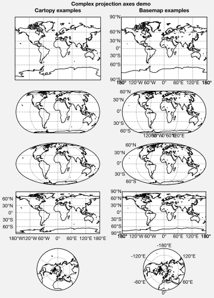
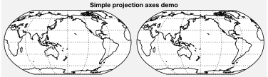
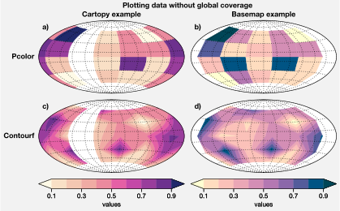
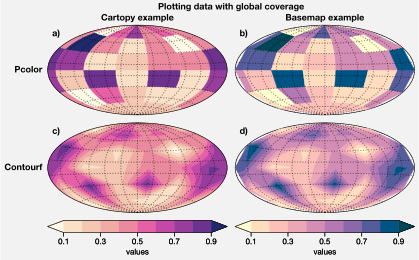
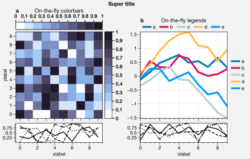
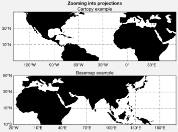
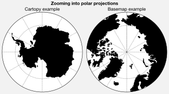
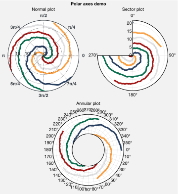

Projection axes
===============

ProPlot includes seamless integration with the builtin matplotlib `polar
projection <https://matplotlib.org/3.1.0/gallery/pie_and_polar_charts/polar_demo.html>`__
and the `cartopy <https://scitools.org.uk/cartopy/docs/latest/>`__ and
`basemap <https://matplotlib.org/basemap/index.html>`__ packages. This
feature is optional – if you don’t care about map projections, you don’t
need to have cartopy or basemap installed. Map projection axes generated
by `~proplot.subplots.subplots` belong to the
`~proplot.axes.ProjectionAxes` class, the parent class to
`~proplot.axes.PolarAxes`, `~proplot.axes.CartopyAxes`, and
`~proplot.axes.BasemapAxes`.

Note that in 2020, active development for basemap will stop. Its users
are encouraged to switch to cartopy, which is integrated more closely
with the matplotlib API and has more room for growth. However for the
time being, basemap has one major advantage: meridian and parallel
labeling. With cartopy, gridline labels are only possible with
equirectangular and Mercator projections. With basemap, labels are
possible with all projections.

Choosing map projections
------------------------

To specify a projection, supply `~proplot.subplots.subplots` with the
``proj`` keyword arg. To toggle basemap for arbitrary subplots, use the
``basemap`` keyword arg. For details on available projections and links
to `PROJ.4 <https://proj4.org/operations/projections/index.html>`__
documentation, see the :ref:`Table of projections`.

Use ``proj_kw`` to pass keyword args to
`~mpl_toolkits.basemap.Basemap` and `cartopy.crs.Projection` classes
on instantiation. ProPlot lets you supply native PROJ.4 keyword names to
the `cartopy.crs.Projection` classes, e.g. ``lon_0`` instead of
``central_longitude``. This makes things a bit less verbose.

.. code:: ipython3

    import proplot as plot
    # Simple example
    plot.rc.coastlinewidth = plot.rc.linewidth = 0.8
    f, axs = plot.subplots(ncols=2, axwidth=2.5, proj='robin', proj_kw={'lon_0':180})
    axs.format(suptitle='Simple projection axes demo', coast=True, latlines=30, lonlines=60)
    # Complex example
    f, axs = plot.subplots(hratios=(1.5,1,1,1,1),
        basemap={(1,3,5,7,9):False, (2,4,6,8,10):True},
        proj={(1,2):'mill', (3,4):'eck4', (5,6):'moll', (7,8):'cyl', (9,10):'npstere'},
        ncols=2, nrows=5) #, proj_kw={'lon_0':0})
    axs.format(suptitle='Complex projection axes demo')
    axs.format(labels=True, coast=True, latlines=30, lonlines=60)
    axs[-1].format(lonlabels=[True,True], lonlines=plot.arange(-180,179,60))
    axs.format(collabels=['Cartopy examples', 'Basemap examples'])

Plotting geophysical data
-------------------------

The below demonstrates how to plot geophysical data with ProPlot. For
cartopy projections, you no longer need to pass
``transform=crs.PlateCarree()`` to the plotting method (as I found
myself doing 99% of the time) – ProPlot makes this the default. And
basemap usage is considerably simplified with ProPlot. You can simply
call the axes method instead of calling the method on the
`~mpl_toolkits.basemap.Basemap` instance, and you no longer need to
pass ``latlon=True`` to the plotting command – ProPlot makes this the
default. For both basemap and cartopy projections, you can also pass
``globe=True`` to 2D plotting commands to ensure global data coverage.

These features are powered by the `~proplot.wrappers.cartopy_gridfix`,
`~proplot.wrappers.cartopy_transform`,
`~proplot.wrappers.basemap_gridfix`, and
`~proplot.wrappers.basemap_latlon` wrappers.

.. code:: ipython3

    import proplot as plot
    import numpy as np
    offset = -40
    x = plot.arange(0+offset, 360+offset-1, 60)
    y = plot.arange(-60,60+1,30)
    data = np.random.rand(len(y), len(x))
    for globe in (False,True):
        f, axs = plot.subplots(ncols=2, nrows=2, axwidth=2.5, colorbars='b',
                               proj='hammer', proj_kw={'lon_0':0}, basemap={(1,3):False, (2,4):True})
        for ax,p,pcolor,basemap in zip(axs,range(4),[1,1,0,0],[0,1,0,1]):
            m = None
            cmap = ('sunset', 'sunrise')[basemap]
            levels = [0, .3, .5, .7, .9, 1]
            levels = np.linspace(0,1,11)
            if pcolor:
                m = ax.pcolor(x, y, data, levels=levels, cmap=cmap, extend='neither', globe=globe)
            if not pcolor:
                m = ax.contourf(x, y, data, levels=levels, cmap=cmap, extend='neither', globe=globe)
            if p<2:
                c = f.bpanel[p].colorbar(m, label='values', tickminor=False)
        axs.format(suptitle=f'Plotting data {("with" if globe else "without")} global coverage',
                   collabels=['Cartopy example', 'Basemap example'],
                   rowlabels=['Pcolor', 'Contourf'], labels=False,
                   abc=True, abcformat='a)', abcloc='ul', abcborder=False)

Formatting projection axes
--------------------------

`~proplot.axes.CartopyAxes` and `~proplot.axes.BasemapAxes` have
``format`` methods with identical usage. ``format`` can be used to draw
gridlines, add gridline labels, set gridline label locations, modify the
projection bounding box, and add and stylize geographic features, like
land masses, coastlines, and international borders. These methods also
call ``format`` on `~proplot.axes.Axes`, and so can be used for
subplot titles, a-b-c labels, and figure titles as before.

.. code:: ipython3

    import proplot as plot
    import numpy as np
    N = 40
    f, axs = plot.subplots([[1,1,2],[3,3,3]], axwidth=4, proj={1:'robin', 2:'ortho', 3:'wintri'})
    ax = axs[0]
    ax.format(title='Robinson map', land=True, landcolor='navy blue', facecolor='pale blue',
               coastcolor='gray5', borderscolor='gray5', innerborderscolor='gray5',
               geogridlinewidth=1.5, geogridcolor='gray8', geogridalpha=1, 
               coast=True, innerborders=True, borders=True)
    ax = axs[1]
    ax.format(title='Ortho map', reso='med', land=True, coast=True, latlines=10, lonlines=15,
              landcolor='mushroom', suptitle='Projection axes formatting demo',
              facecolor='petrol', coastcolor='charcoal', coastlinewidth=0.8, geogridlinewidth=1)
    ax = axs[2]
    ax.format(land=True, facecolor='ocean blue', landcolor='almond', title='Winkel tripel map',
             lonlines=60, latlines=15)
    axs.format(suptitle='Projection axes formatting demo', collabels=['col 1', 'col 2'],
               abc=True, abcformat='A.', abcloc='ul', abcborder=False, linewidth=1.5)

Zooming into projections
------------------------

To zoom into cartopy projections, you can use
`~cartopy.mpl.geoaxes.GeoAxes.set_extent`, or alternatively pass
``lonlim``, ``latlim``, or ``boundinglat`` to
`~proplot.axes.ProjectionAxes.format`. Note that ProPlot always draws
a *circular boundary* around North Polar and South Polar Stereographic,
Azimuthal Equidistant, Lambert Azimuthal Equal-Area, and Gnomic
projections, no matter the “zoom” setting (implemented following `this
example <https://scitools.org.uk/cartopy/docs/latest/gallery/always_circular_stereo.html>`__).

For basemap projections, you must set the limits when declaring the
projection by passing ``proj_kw`` to `~proplot.subplots.subplots` with
any of the ``boundinglat``, ``llcrnrlon``, ``llcrnrlat``, ``urcrnrlon``,
``urcrnrlat``, ``llcrnrx``, ``llcrnry``, ``urcrnrx``, ``urcrnry``,
``width``, and/or ``height`` keyword args.

.. code:: ipython3

    import proplot as plot
    f, axs = plot.subplots(nrows=2, axwidth=4.5,
               proj='pcarree', basemap={1:False, 2:True},
               proj_kw={2:{'llcrnrlon':-20, 'llcrnrlat':-10, 'urcrnrlon':180, 'urcrnrlat':50}})
    # Normal projection
    axs.format(land=True, labels=True, lonlines=20, latlines=20, suptitle='Zooming into projections')
    axs[0].format(lonlim=(-140,60), latlim=(-10,50), labels=True, title='Cartopy example')
    axs[1].format(title='Basemap example')
    # Polar projection
    f, axs = plot.subplots(ncols=2, axwidth=2.2,
               proj={1:'splaea', 2:'npaeqd'}, basemap={1:False,2:True},
               proj_kw={2:{'boundinglat':60}})
    axs.format(land=True, latlines=10, latmax=80, suptitle='Zooming into polar projections')
    axs[0].format(boundinglat=-60, title='Cartopy example')
    axs[1].format(title='Basemap example')

Registered cartopy projections
------------------------------

Below is an illustration of the available `cartopy` projections (see
the :ref:`Table of projections` for details). Note that you no longer
have to reference the `cartopy.crs.Projection` classes directly – now,
just like basemap, you can specify a native PROJ.4 short name (e.g.
``'robin'`` or ``'merc'``).

ProPlot adds to cartopy the previously unavailable Aitoff, Hammer,
Winkel Tripel, and Kavrisky VII projections (i.e. ``'aitoff'``,
``'hammer'``, ``'wintri'``, and ``'kav7'``), as well as North Polar and
South Polar versions of the Stereographic, Azimuthal Equidistant,
Lambert Azimuthal Equal-Area, and Gnomic projections (i.e.
``'npstere'``, ``'spstere'``, ``'npaeqd'``, ``'spaeqd'``, ``'nplaea'``,
``'splaea'``, ``'npgnom'``, and ``'spgnom'``).

.. code:: ipython3

    import proplot as plot
    import numpy as np
    projs = ['cyl', 'merc', 'mill', 'lcyl', 'tmerc',
             'robin', 'hammer', 'moll', 'kav7', 'aitoff', 'wintri', 'sinu',
             'geos', 'ortho', 'nsper', 'aea', 'eqdc', 'lcc', 'gnom',
             'npstere', 'nplaea', 'npaeqd', 'npgnom', 'igh',
             'eck1', 'eck2', 'eck3', 'eck4', 'eck5', 'eck6']
    f, axs = plot.subplots(ncols=3, nrows=10, proj=projs)
    axs.format(land=True, reso='lo', labels=False, suptitle='Table of cartopy projections')
    for proj,ax in zip(projs,axs):
        ax.format(title=proj, titleweight='bold', labels=False)

.. image:: tutorial/tutorial_87_1.svg

Registered basemap projections
------------------------------

Below is an illustration of the available `~mpl_toolkits.basemap`
projections (see the :ref:`Table of projections` for details). Basemap
projection bounds are usually rectangles, while cartopy bounds are more
flexible. Also, while the default `~mpl_toolkits.basemap` API requires
you to specify projection keyword args *explicitly* or an error is
thrown (e.g. ``lon_0`` and ``lat_0``), ProPlot passes default keyword
args to `~mpl_toolkits.basemap.Basemap` if you fail to specify them.

.. code:: ipython3

    import proplot as plot
    import numpy as np
    projs = ['cyl', 'merc', 'mill', 'cea', 'gall', 'sinu',
             'eck4', 'robin', 'moll', 'kav7', 'hammer', 'mbtfpq',
             'geos', 'ortho', 'nsper',
             'vandg', 'aea', 'eqdc', 'gnom', 'cass', 'lcc',
             'npstere', 'npaeqd', 'nplaea']
    f, axs = plot.subplots(ncols=3, nrows=8, basemap=True, proj=projs)
    axs.format(land=True, labels=False, suptitle='Table of basemap projections')
    for proj,ax in zip(projs,axs):
        ax.format(title=proj, titleweight='bold', labels=False)

.. image:: tutorial/tutorial_90_0.svg

Polar projections
-----------------

Matplotlib polar axes are also integrated with ProPlot, thanks to the
`~proplot.axes.PolarAxes` class. The
`~proplot.axes.PolarAxes.format` command permits all sorts of polar
axes-specific modifications, including making sector plots, annular
plots, and changing the positive azimuthal direction. To draw polar
axes, just pass e.g. ``proj='polar'`` or ``proj={1:'polar'}`` to
`~proplot.subplots.subplots`.

.. code:: ipython3

    import proplot as plot
    import numpy as np
    f, axs = plot.subplots([[1,1,2,2],[0,3,3,0]], proj='polar')
    axs.format(suptitle='Polar axes demo', collabelweight='normal')
    N = 200
    x = np.linspace(0, 2*np.pi, N)
    y = 100*(np.random.rand(N,5)-0.3).cumsum(axis=0)/N
    for i in range(5):
        axs.plot(x + i*2*np.pi/5, y[:,i], cycle='contrast', zorder=0, lw=3)
    axs.format(linewidth=1, ticklabelsize=9, rlines=0.5, rlim=(0,19))
    axs[0].format(title='Normal plot', thetaformatter='pi', rlines=5, gridalpha=1, gridlinestyle=':',
                  rlabelpos=180, color='gray8', ticklabelweight='bold')
    axs[1].format(title='Sector plot', thetadir=-1, thetalines=90, thetalim=(0,270), theta0='N',
                  rlim=(0,22), rlines=5)
    axs[2].format(title='Annular plot', thetadir=-1, thetalines=10,
                  r0=0, rlim=(10,22), rformatter='null', rlocator=2)
    axs.format(titlepad='1.5em') # matplotlib default title offset is incorrect

It is common to need colorbars and legends along the outside edge of
*individual axes* or on the inner edge of the *figure*. It is also
common to need “panels” for plotting secondary 1-dimensional datasets or
summary statistics next to a larger subplot. ProPlot satisfies both of
these needs with the `~proplot.axes.PanelAxes` class, which can be
generated with the `~proplot.subplots.subplots` and
`~proplot.axes.Axes.panel_axes` functions.

`~proplot.axes.PanelAxes` have special
`~proplot.axes.PanelAxes.colorbar` and
`~proplot.axes.PanelAxes.legend` methods.
`~proplot.axes.PanelAxes.colorbar` *fills* the panel with a colorbar –
that is, the panel is used as the ``cax`` argument in the call to
`~matplotlib.figure.Figure.colorbar`, and its default width is
changed. `~proplot.axes.PanelAxes.legend` *fills* the panel with a
legend – that is, a legend is drawn in the center, and the axes
background and spines are hidden.

On-the-fly panels are a great way to draw colorbars and legends along
the edges of axes. There are three ways to generate and *fill* an
on-the-fly axes panel.

1. Pass ``colorbar`` to any method wrapped by
   `~proplot.wrappers.cmap_wrapper`, or pass ``colorbar`` or
   ``legend`` to any method wrapped by
   `~proplot.wrappers.cycle_wrapper`. The argument is the panel
   location, e.g. ``colorbar='left'`` or ``colorbar='l'``. To specify
   panel settings, use the ``panel_kw`` keyword arg.
2. Pass ``loc`` to the `~proplot.axes.Axes.colorbar` or
   `~proplot.axes.Axes.legend` ``Axes`` methods. Again, the argument
   is the panel location, e.g. ``loc='left'`` or ``loc='l'``. This is
   what approach #1 does internally. To specify panel settings, use the
   ``panel_kw`` keyword arg.
3. Directly call the `~proplot.axes.Axes.panel_axes` method, e.g.
   ``pax = ax.panel('l', **kwargs)``, and then call the
   `~proplot.axes.PanelAxes.colorbar` or
   `~proplot.axes.PanelAxes.legend` ``PanelAxes`` methods on ``pax``.
   This is what the approach #2 does internally.

No matter the combination of axes panels in your subplot grid, the
layout will stay aligned. To modify default panel settings, use the
`~proplot.rctools.rc` object or create a custom ``.proplotrc`` file
(see the `~proplot.rctools` documentation for details).

.. code:: ipython3

    import proplot as plot
    import numpy as np
    with plot.rc.context(abc=True):
        f, axs = plot.subplots(ncols=2, tight=True, share=0)
    ax = axs[0]
    m = ax.heatmap(np.random.rand(10,10), colorbar='t', cmap='dusk')
    ax.colorbar(m, loc='r')
    ax.format(title='On-the-fly colorbars', suptitle='On-the-fly panels demo')
    ax = axs[1]
    ax.format(title='On-the-fly legends', titlepad='0em')
    hs = ax.plot((np.random.rand(10,5)-0.5).cumsum(axis=0), lw=3, legend='t', cycle='sharp',
            labels=list('abcde'), legend_kw={'ncols':5, 'frame':False})
    ax.legend(hs, loc='r', ncols=1, frame=False)
    # Calling the panel method
    for ax in axs:
        pax = ax.panel('b', share=True)
        pax.plot(np.random.rand(10,4), cycle_kw={'linestyle':('-','--','-.',':')})
        # ax.bpanel.plot(...) # also works!
    axs.format(xlabel='xlabel', ylabel='ylabel', suptitle='Super title')

.. image:: tutorial/tutorial_96_0.svg

