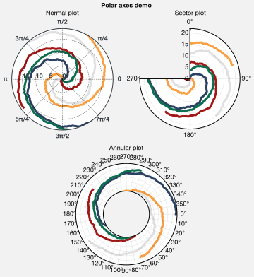
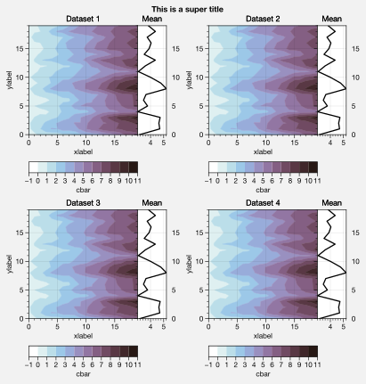
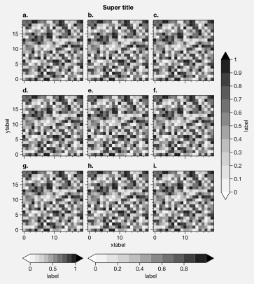
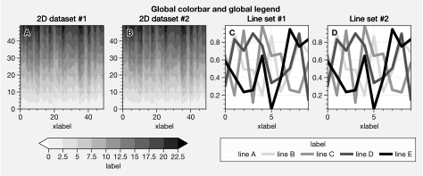
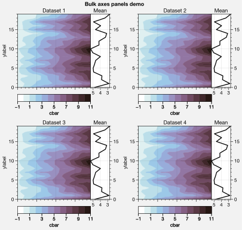
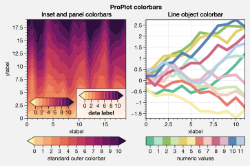

Panels, colorbars, and legends
==============================

It is common to need colorbars and legends along the edges of axes and
figures. It is also common to need “panels” along the edges of axes, for
plotting secondary 1-dimensional datasets and summary statistics.
ProPlot satisfies both of these needs by introducing the “panels”
construct, powered by the `~proplot.axes.PanelAxes` class and the
`~proplot.subplots.subplots` command.

Axes panels
-----------

To add arbitrary combinations of panels to the left, bottom, right, or
top sides of axes, pass the ``axpanel`` or ``axpanels`` keyword args to
`~proplot.subplots.subplots`. To modify panel properties, simply use
the ``axpanel_kw`` or ``axpanels_kw`` dictionary keyword args.

Axes panels are stored on each subplot as the attributes
``bottompanel``, ``leftpanel``, ``rightpanel``, and ``toppanel`` and the
shorthands ``bpanel``, ``lpanel``, ``rpanel``, and ``tpanel``. The
subplots will stay correctly aligned no matter the combination of
panels. See `~proplot.subplots.subplots` and
`~proplot.subplots.Figure.add_subplot_and_panels` for details.

.. code:: ipython3

    # Arbitrarily complex combinations are possible, and inner spaces still determined automatically
    import proplot as plot
    f, axs = plot.subplots(axwidth=1.5, nrows=2, ncols=2,
                           axpanels={1:'t', 2:'l', 3:'b', 4:'r'},
                           tight=True, share=0, span=0)
    axs.format(title='Title', suptitle='This is a super title', collabels=['Column 1','Column 2'],
               abcloc='ul', titleloc='uc', xlabel='xlabel', ylabel='ylabel', abc=True, top=False)
    axs.format(xlim=(0,1), ylim=(0,1), ylocator=plot.arange(0.2,0.8,0.2), xlocator=plot.arange(0.2,0.8,0.2))

If you intend to “fill” your panels with *colorbars* (see
:ref:`Colorbars`), you should use the ``axcolorbar``, ``axcolorbars``,
``axcolorbar_kw``, or ``axcolorbars_kw`` keyword args instead of
``axpanel``, etc. The behavior is identical, except the *default* panel
width is more appropriate for colorbars. Similarly, if you intend to
“fill” your panels with *legends* (see :ref:`Legends`), you should use
the ``axlegend``, ``axlegends``, ``axlegend_kw``, and ``axlegends_kw``
keyword args. You can modify these default widths with a custom
``.proplotrc`` file (see the `~proplot.rctools` documentation for
details).

The below example demonstrates a few more panel features. To draw panels
“flush” against the subplot, use the ``bflush``, ``tflush``, ``lflush``,
and ``rflush`` keyword args. If you want to disable “axis sharing” with
the parent subplot (see :ref:`Axis sharing and spanning`), use the
``bshare``, ``tshare``, ``rshare``, and ``lshare`` keyword args. See
`~proplot.subplots.subplots` and
`~proplot.subplots.Figure.add_subplot_and_panels` for details.

.. code:: ipython3

    import proplot as plot
    import numpy as np
    plot.rc.reset()
    f, axs = plot.subplots(axwidth=1.7, nrows=2, ncols=2, share=0, span=False, panelpad=0.1,
                           axpanels='r', axcolorbars='b', axpanels_kw={'share':False, 'flush':True})
    axs.format(xlabel='xlabel', ylabel='ylabel', suptitle='This is a super title')
    for i,ax in enumerate(axs):
        ax.format(title=f'Dataset {i+1}')
    data = (np.random.rand(20,20)-0.1).cumsum(axis=1)
    m = axs.contourf(data, cmap='glacial', levels=plot.arange(-1,11))[0]
    axs.rpanel.plot(data.mean(axis=1), np.arange(20), color='k')
    axs.rpanel.format(title='Mean')
    axs.bpanel.colorbar(m, label='cbar')
    # axs.colorbar(m, loc='b', label='cbar') # also works!

Figure panels
-------------

ProPlot also supports “figure” panels. These panels are generally filled
with colorbars and legends as *global* references for content that
appears in more than one subplot. Figure panels are declared with the
``panel``, ``colorbar``, ``legend``, ``panels``, ``colorbars``, and
``legends`` keyword args. They can extend across entire sides of the
figure, or across arbitrary contiguous rows and columns of subplots,
using the ``barray``, ``rarray``, or ``larray`` keyword args.

Figure panel axes are stored on the `~proplot.subplots.Figure`
instance as the attributes ``bottompanel``, ``leftpanel``, and
``rightpanel`` and the shorthands ``bpanel``, ``lpanel``, and
``rpanel``. See `~proplot.subplots.subplots` for details.

.. code:: ipython3

    import proplot as plot
    import numpy as np
    f, axs = plot.subplots(ncols=3, nrows=3, axwidth=1.2, colorbar='br', barray=[1,2,2])
    m = axs.pcolormesh(np.random.rand(20,20), cmap='grays', levels=np.linspace(0,1,11), extend='both')[0]
    axs.format(suptitle='Super title', abc=True, abcloc='l', abcformat='a.', xlabel='xlabel', ylabel='ylabel')
    f.bpanel[0].colorbar(m, label='label', ticks=0.5)
    f.bpanel[1].colorbar(m, label='label', ticks=0.2)
    f.rpanel.colorbar(m, label='label', ticks=0.1, length=0.7)

.. code:: ipython3

    import proplot as plot
    import numpy as np
    f, axs = plot.subplots(ncols=4, axwidth=1.3, colorbar='b', barray=[1,1,2,2], share=0, span=0, wspace=0.3)
    data = (np.random.rand(50,50)-0.1).cumsum(axis=0)
    m = axs[:2].contourf(data, cmap='grays', extend='both')
    cycle = plot.colors('grays', 5)
    hs = []
    for abc,color in zip('ABCDEF',cycle):
        h = axs[2:].plot(np.random.rand(10), lw=3, color=color, label=f'line {abc}')
        hs.extend(h[0])
    f.bpanel[0].colorbar(m[0], length=0.8, label='label')
    f.bpanel[1].legend(hs, ncols=5, label='label', frame=False)
    axs.format(suptitle='Global colorbar and global legend', abc=True, abcloc='ul', abcformat='A')
    for ax,title in zip(axs, ['2D dataset #1', '2D dataset #2', 'Line set #1', 'Line set #2']):
        ax.format(xlabel='xlabel', title=title)

Stacked panels
--------------

ProPlot also allows arbitrarily *stacking* panels with the ``lstack``,
``bstack``, ``rstack``, and ``tstack`` keyword args. This can be useful
when you want multiple global colorbars, when using more than one
colormap inside a single axes, or when you need more than one panels for
displaying different statistics. The spacing between stacked panels is
adjusted automatically to account for axis and tick labels. See
`~proplot.subplots.subplots` and
`~proplot.subplots.Figure.add_subplot_and_panels` for details.

You can access individual panels in a “stack” by *indexing* the panel
attribute. The default order is row-major, from top-left to
bottom-right. For example, ``ax.lpanel[1]`` gives you a left panel,
second from the left. If you are stacking *figure* panels and have
different panels for each row and column (see :ref:`Figure panels`),
you can use 2D indexing. For example, ``fig.bpanel[1,0]`` gives you a
panel in the first column, second from the top.

.. code:: ipython3

    import proplot as plot
    import numpy as np
    f, axs = plot.subplots(nrows=2, axwidth='4cm', span=False, share=0,
                          axcolorbars='l', axcolorbars_kw={'stack':3},
                          axpanels='r', axpanels_kw={'stack':2, 'flush':True, 'width':0.5}
                          )
    axs[0].format(title='Stacked panel demo', titleweight='bold')
    # Draw stuff in axes
    n = 10
    for ax in axs:
        # Colormap data
        ax.format(xlabel='data', xlocator=np.linspace(0, 0.8, 5))
        for i,(x0,y0,x1,y1,cmap,scale) in enumerate(((0,0.5,1,1,'grays',0.5), (0,0,0.5,0.5,'reds',1), (0.5,0,1,0.5,'blues',2))):
            data = np.random.rand(n,n)*scale
            x, y = np.linspace(x0, x1, 11), np.linspace(y0, y1, 11)
            m = ax.pcolormesh(x, y, data, cmap=cmap, levels=np.linspace(0,scale,11))
            ax.lpanel[i].colorbar(m)
        # Plot data
        for i,pax in enumerate(ax.rpanel):
            func = data.mean if i==0 else data.std
            pax.plot(func(axis=1), plot.arange(0.05, 0.95, 0.1), lw=2, color='k')
            pax.format(xlabel='mean' if i==0 else 'stdev', xlim=(0,1), xlocator=(0,0.5))

Colorbars
---------

All ProPlot “panels” are instances of the `~proplot.axes.PanelAxes`
class (see :ref:`Axes panels` and :ref:`Figure panels`), which is a
subclass of `~proplot.axes.CartesianAxes`. When you call
`~proplot.axes.BaseAxes.colorbar` on a
`~proplot.axes.CartesianAxes`, an *inset* colorbar is generated. When
you call `~proplot.axes.PanelAxes.colorbar` on a
`~proplot.axes.PanelAxes`, the panel is “*filled*” with a colorbar.

You can also draw an *inset* or “*filled*” colorbar by passing the
``colorbar`` keyword arg to methods wrapped by
`~proplot.styletools.cmap_wrapper` and
`~proplot.styletools.cycle_wrapper`. Or, you can draw a “filled”
colorbar by calling `~proplot.axes.BaseAxes.colorbar` on the *main*
axes with e.g. ``loc='bottom'`` (see `~proplot.axes.BaseAxes.colorbar`
for details).

ProPlot adds several new features to the
`~matplotlib.figure.Figure.colorbar` command, powered by
`~proplot.wrappers.colorbar_wrapper`. A particular handy feature is
the ability to draw colorbars from lists of colors or lists of artists,
instead of just “mappable” objects. A colormap is constructed from the
corresponding colors on-the-fly. `~proplot.wrappers.colorbar_wrapper`
also lets you change major and minor tick locations, handles colorbars
normalized by `~matplotlib.colors.LogNorm` correctly, and lets you
change outline, divider, tick, tick label, and colorbar label settings.

.. code:: ipython3

    import proplot as plot
    import numpy as np
    # Original
    plot.rc.cycle = 'qual2'
    f, axs = plot.subplots(ncols=2, axcolorbar='b', tight=True, axwidth=2.5, aspect=1.5, share=0)
    ax = axs[0]
    m = ax.contourf((np.random.rand(20,20)).cumsum(axis=0), extend='both', levels=np.linspace(0,10,11), cmap='matter')
    ax.format(xlabel='xlabel', ylabel='ylabel', xlim=(0,19), ylim=(0,19))
    ax.colorbar(m, ticks=2, label='data label', labelweight='bold', frame=True)
    ax.colorbar(m, ticks=2, loc='lower left', frame=False)
    ax.colorbar(m, loc='b', label='standard outer colorbar', length=0.9)
    ax.format(title='Inset and panel colorbars', suptitle='ProPlot colorbars')
    # From lines
    ax = axs[1]
    hs = ax.plot((np.random.rand(12,12)-0.45).cumsum(axis=0), lw=4)
    ax.format(title='Line object colorbar', xlabel='xlabel')
    ax.colorbar(hs, loc='b', values=np.arange(0,len(hs)), label='numeric values', tickloc='bottom')

Legends
-------

Just like with :ref:`Colorbars`, when you call
`~proplot.axes.BaseAxes.legend` on a `~proplot.axes.CartesianAxes`,
an *inset* legend is generated. When you call
`~proplot.axes.PanelAxes.legend` on a `~proplot.axes.PanelAxes`, the
panel is “*filled*” with a legend – that is, a legend is drawn in the
center of the panel, and the panel spines and background patch are
hidden.

You can also draw an *inset* or “*filled*” legend by passing the
``legend`` keyword arg to methods wrapped by
`~proplot.styletools.cycle_wrapper`. Or, you can draw a “filled”
legend by calling `~proplot.axes.BaseAxes.legend` on the *main* axes
with e.g. ``loc='bottom'`` (see `~proplot.axes.BaseAxes.legend` for
details).

ProPlot adds several new features to the
`~matplotlib.axes.Axes.legend` command, powered by
`~proplot.wrappers.legend_wrapper`. You can *center legend rows* with
the ``center`` keyword arg, or by passing a list of lists of plot
handles. This is accomplished by stacking multiple single-row,
horizontally centered legends, then manually adding an encompassing
legend frame. `~proplot.wrappers.legend_wrapper` also lets you switch
between row-major and column-major order for legend entries (the new
default is row-major), and lets you modify legend text properties and
handle properties.

.. code:: ipython3

    import proplot as plot
    import numpy as np
    plot.rc.cycle = 'contrast'
    labels = ['a', 'bb', 'ccc', 'dddd', 'eeeee']
    f, axs = plot.subplots(ncols=2, legends='b', panels='r', span=0, share=1)
    hs1, hs2 = [], []
    # Plot lines and draw inner legends
    for i,label in enumerate(labels):
        data = (np.random.rand(20)-0.45).cumsum(axis=0)
        h1 = axs[0].plot(data, lw=4, label=label, legend='ul', legend_kw={'order':'F'}) # add to legend in upper left
        hs1.extend(h1)
        h2 = axs[1].plot(data, lw=4, label=label, cycle='floral')
        hs2.extend(h2)
    # Outer legends
    f.bpanel[0].legend(hs1, ncols=3, center=False, frameon=True)
    f.bpanel[1].legend(hs2, ncols=3, center=True)
    f.rpanel.legend(hs2, ncols=1, center=True, frame=False)
    axs.format(xlabel='xlabel', ylabel='ylabel', suptitle='ProPlot legends')
    for ax,title in zip(axs, ['Inset and panel legends', 'Row-centered legends']):
        ax.format(title=title)

.. image:: tutorial/tutorial_91_1.svg

