Color usage and fonts
=====================

ProPlot isn’t just an alternative to `~matplotlib.pyplot`. It also
adds some neat features to help you use colors effectively in your
figures, and integrates palettes from several online data visualization
tools.

First things first, ProPlot makes a distinction between *colormaps* and
*color cycles*.

-  A *colormap* is a palette constructed by sampling some *smooth,
   linear* function between two end colors. Colormaps are generally used
   for 2-D or 3-D plots, where the color serves as an extra “dimension”.
   This is implemented in matplotlib with the
   `~matplotlib.colors.LinearSegmentedColormap` class, and also with
   the special ProPlot
   `~proplot.styletools.PerceptuallyUniformColormap` subclass (see
   :ref:`Making your own colormaps`).
-  A *color cycle* is a palette composed of a *jumbled set* of distinct
   colors. Interpolation between these colors does not make sense. Color
   cycles are generally used with line plots, bar plots, and other plot
   elements. They are conceptually implemented in matplotlib with the
   `~matplotlib.colors.ListedColormap` class (although it is often
   improperly used). ProPlot uses this class to register color cycles,
   and the color cycles are “applied” by globally or axes-locally
   modifying the `property
   cycler <https://matplotlib.org/3.1.0/tutorials/intermediate/color_cycle.html>`__.
   *Colormaps* can also be cut up and used as color cycles (see
   :ref:`Making your own color cycles`).

This section documents the colormaps and cycles registered after
importing ProPlot, explains how to make custom colormaps and cycles, and
shows how to apply them to your plots using axes methods wrapped by
`~proplot.wrappers.cmap_wrapper` or
`~proplot.wrappers.cycle_wrapper`.

Registered colormaps
--------------------

On import, ProPlot registers a few sample
`~proplot.styletools.PerceptuallyUniformColormap` colormaps (see
:ref:`Perceptually uniform colormaps`) plus a ton of other colormaps
from other online data viz projects. Use
`~proplot.styletools.show_cmaps` to generate a table of registered
maps, as shown below. The figure is broken down into the following
sections:

-  “User” colormaps, i.e. colormaps saved to your ``~/.proplot/cmaps``
   folder. A great way to save colormaps to this folder is using the
   `~proplot.styletools.Colormap` function. See
   :ref:`Making your own colormaps` for details.
-  Matplotlib and seaborn original colormaps.
-  ProPlot colormaps belonging to the
   `~proplot.styletools.PerceptuallyUniformColormap` class. See the
   :ref:`Perceptually uniform colormaps` section.
-  Miscellaneous diverging colormaps.
-  `cmOcean <https://matplotlib.org/cmocean/>`__ colormaps, originally
   intended for oceanographic visualizations but useful for all
   scientific fields.
-  `ColorBrewer <http://colorbrewer2.org/>`__ colormaps, included with
   matplotlib by default.
-  Colormaps from the
   `SciVisColor <https://sciviscolor.org/home/colormoves/>`__ online
   interactive tool. There are so many of these maps because they are
   intended to be *merged* with one another – suitable for complex
   datasets with complex statistical distributions.

ProPlot removes some default matplotlib colormaps with erratic color
transitions. Note that colormap and color cycle identification is now
flexible: names are *case-insensitive* (e.g. ``'Viridis'``,
``'viridis'``, and ``'ViRiDiS'`` are equivalent) and can be specified in
their “reversed” form (e.g. ``'BuRd'`` is equivalent to ``'RdBu_r'``).
See `~proplot.styletools.CmapDict` for more info.

.. code:: ipython3

    import proplot as plot
    f = plot.show_cmaps()

.. image:: tutorial/tutorial_96_0.svg

Perceptually uniform colormaps
------------------------------

ProPlot’s custom colormaps are instances of the new
`~proplot.styletools.PerceptuallyUniformColormap` class (see
:ref:`Registered colormaps` for a table).
`~proplot.styletools.PerceptuallyUniformColormap` objects generate
colors by interpolating between coordinates in any of three possible
“perceptually uniform” colorspaces:

-  **HCL**: A purely perceptually uniform colorspace, where colors are
   broken down into “hue” (color, range 0-360), “chroma” (saturation,
   range 0-100), and “luminance” (brightness, range 0-100).
-  **HPLuv**: Hue and luminance are identical to HCL, but 100 saturation
   is scaled to be the *minimum maximum saturation* across all hues for
   a given luminance. HPLuv is more appropriate for multi-hue colormaps.
-  **HSLuv**: Hue and luminance are identical to HCL, but 100 saturation
   is scaled to be the *maximum possible saturation* for a given hue and
   luminance. HSLuv is more appropriate for single-hue colormaps –
   saturation banding can occur when crossing hue thresholds in this
   space.

HCL is the only “purely” perceptually uniform colorspace. But
interpolating between coordinates in this space can result in
“impossible” colors – colors that, when translated from HCL back into
RGB, result in RGB channels greater than 1. HSLuv and HPLuv help resolve
this issue by respectively *scaling* and *clipping* the
highest-saturation colors across different hues and luminances. See
`this page <http://www.hsluv.org/comparison/>`__ for more info.

To plot arbitrary cross-sections of these colorspaces, use
`~proplot.styletools.show_colorspaces`. The blacked out regions
represent “impossible” colors.

.. code:: ipython3

    import proplot as plot
    f = plot.show_colorspaces(luminance=50)

.. image:: tutorial/tutorial_99_0.svg

.. code:: ipython3

    import proplot as plot
    f = plot.show_colorspaces(saturation=60)

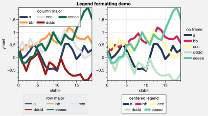

.. code:: ipython3

    import proplot as plot
    f = plot.show_colorspaces(hue=0)

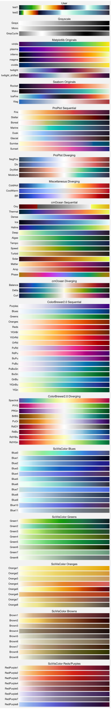

To see how any colormap varies with respect to each channel, use the
`~proplot.styletools.cmap_breakdown` function. Below, we do this for
the “magma”, “rocket”, and ProPlot “Fire” colormaps. The first two are
nicely-designed `~matplotlib.colors.LinearSegmentedColormap` maps, and
the last one is a `~proplot.styletools.PerceptuallyUniformColormap`.
They are all roughly linear across the hue and luminance channels, but
not the chroma channel (top row). “Fire” is linear in the HSL scaling of
the chroma channel (bottom left), while other ProPlot colormaps are
linear in the HPL scaling of the chroma channel (bottom right).

.. code:: ipython3

    import proplot as plot
    f = plot.show_channels('magma', 'rocket', 'fire', minhue=-180, rgb=False)

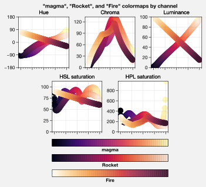

Making your own colormaps
-------------------------

You can make new colormaps with ProPlot’s on-the-fly colormap generator
`~proplot.styletools.Colormap`. Every command that accepts a ``cmap``
argument (see `~proplot.wrappers.cmap_wrapper`) is passed to
`~proplot.styletools.Colormap`, and `~proplot.styletools.Colormap`
keyword args can be specified with ``cmap_kw``. If you want to save your
own colormap into the ``~/.proplot/cmaps`` folder, simply use
``save=True``. Colormaps in this folder are loaded every time you import
ProPlot. See `~proplot.styletools.Colormap` and
`~proplot.wrappers.cmap_wrapper` for details.

To build monochromatic
`~proplot.styletools.PerceptuallyUniformColormap` maps from arbitrary
colors, just pass a color name, hex string, or RGB tuple to
`~proplot.styletools.Colormap`. The colormap colors will vary from the
specified color to some shade near white (controlled by the ``fade``
keyword arg). The default is to fade to pure white. The first plot shows
several of these maps merged into one, and the second is just one map.

.. code:: ipython3

    import proplot as plot
    import numpy as np
    f, axs = plot.subplots(ncols=2, axwidth=2.4, aspect=1, bottom=0.1)
    data = np.random.rand(50,50).cumsum(axis=1)
    cmap1 = plot.Colormap('brick red_r', 'denim_r', 'warm gray_r', fade=90, name='tricolor')
    m = axs[0].contourf(data, cmap=cmap1, levels=12)
    m = axs[1].contourf(data, cmap='ocean blue', cmap_kw={'name':'ocean blue'})
    cmap2 = m.cmap
    axs.format(xticks='none', yticks='none', suptitle='Monochromatic PerceptuallyUniformColormaps')
    for ax,title in zip(axs, ['Three monochromatic colormaps', 'One monochromatic colormap']):
        ax.format(title=title)
    # Breakdowns
    f = plot.show_channels(cmap1, cmap2, rgb=False)

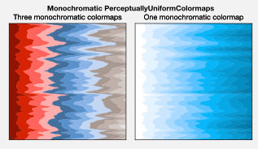

.. image:: tutorial/tutorial_107_1.svg

To generate `~proplot.styletools.PerceptuallyUniformColormap` maps,
you can pass a *dictionary* to `~proplot.styletools.Colormap`, which
calls the `~proplot.styletools.PerceptuallyUniformColormap.from_hsl`
static method, or pass a *list of colors* to
`~proplot.styletools.Colormap`, which calls the
`~proplot.styletools.PerceptuallyUniformColormap.from_list` static
method.

`~proplot.styletools.PerceptuallyUniformColormap.from_list`
interpolates between the listed colors in a perceptually uniform
colorspace (see :ref:`Perceptually uniform colormaps`).
`~proplot.styletools.PerceptuallyUniformColormap.from_hsl` draws lines
between channel values specified by the keyword args ``'hue'``,
``'saturation'``, and ``'luminance'``. The values can be numbers, color
strings, or lists thereof. Numbers indicate the channel value. For color
strings, the channel value is *inferred* from the specified color. You
can end any color string with ``+N`` or ``-N`` to *offset* the channel
value by the number ``N``, as shown below.

.. code:: ipython3

    import proplot as plot
    import numpy as np
    f, axs = plot.subplots(ncols=3, span=False, axwidth=2, aspect=1.5)
    ax = axs[0]
    # From dicts
    data = np.random.rand(10,15)
    cmap1 = plot.Colormap({'hue':['red-90', 'red+90'], 'saturation':[50, 70, 30], 'luminance':[20, 100]}, name='Matter', space='hcl')
    m = ax.pcolormesh(data, cmap=cmap1)
    ax.format(xlabel='x axis', ylabel='y axis', title='From channel values',
              suptitle='Building your own PerceptuallyUniformColormaps')
    ax = axs[1]
    cmap2 = plot.Colormap({'hue':['red', 'red-720'], 'saturation':[80,20], 'luminance':[20, 100]}, name='cubehelix', space='hpl')
    m = ax.pcolormesh(data, cmap=cmap2)
    ax.format(xlabel='x axis', ylabel='y axis', title='From channel values')
    # From list
    ax = axs[2]
    m = ax.pcolormesh(data, cmap=('maroon', 'goldenrod'), cmap_kw={'name':'reddish'})
    cmap3 = m.cmap
    ax.format(title='From list of colors')
    # Breakdowns
    f = plot.show_channels(cmap1, cmap2, cmap3, minhue=-180, rgb=False)

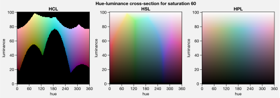

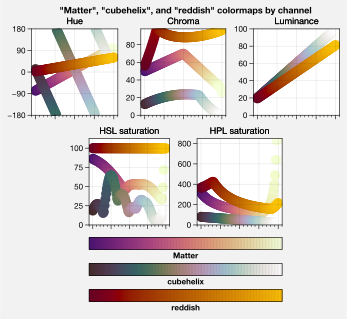

Merging and modifying colormaps
-------------------------------

`~proplot.styletools.Colormap` also lets you merge arbitrary colormaps
and modify existing colormaps. To merge colormaps, simply pass multiple
arguments to the `~proplot.styletools.Colormap` constructor. This
makes it easy to create complex
`SciVisColor <https://sciviscolor.org/home/colormoves/>`__-style
colormaps, which may be desirable for complex datasets with funky
statistical distributions. The below reconstructs the colormap from
`this
example <https://sciviscolor.org/wp-content/uploads/sites/14/2018/04/colormoves-icon-1.png>`__.

.. code:: ipython3

    import proplot as plot
    import numpy as np
    f, axs = plot.subplots(ncols=2, axwidth=2.5, colorbars='b', span=0)
    data = np.random.rand(100,100).cumsum(axis=1)
    # Make colormap, save as "test1.json"
    cmap = plot.Colormap('Green1_r', 'Orange5', 'Blue1_r', 'Blue6', name='test1', save=True)
    m = axs[0].contourf(data, cmap=cmap, levels=100)
    f.bpanel[0].colorbar(m, locator='none')
    # Make colormap, save as "test2.json"
    cmap = plot.Colormap('Green1_r', 'Orange5', 'Blue1_r', 'Blue6', ratios=(1,3,5,10), name='test2', save=True)
    m = axs[1].contourf(data, cmap=cmap, levels=100)
    f.bpanel[1].colorbar(m, locator='none')
    axs.format(xlabel='xlabel', ylabel='ylabel', suptitle='Merging existing colormaps')
    for ax,title in zip(axs, ['Evenly spaced', 'Matching SciVisColor example']):
        ax.format(title=title)

.. image:: tutorial/tutorial_112_1.svg

To modify a diverging colormap by cutting out some central colors, pass
the ``cut`` keyword arg to `~proplot.styletools.Colormap`. This is
great when you want to have a sharper cutoff between negative and
positive values. To cut out colors from the left or right of a colormap,
pass the ``left`` and ``right`` keyword args to
`~proplot.styletools.Colormap`.

To rotate a cyclic colormap, pass the ``shift`` argument to
`~proplot.styletools.Colormap`. Cyclic colormaps are colormaps for
which ``cyclic=True`` was passed to `~proplot.styletools.Colormap` on
construction. ProPlot ensures the colors at the ends of these maps are
distinct, so that levels don’t blur together.

.. code:: ipython3

    import proplot as plot
    import numpy as np
    f, axs = plot.subplots([[1,1,2,2,3,3],[0,4,4,5,5,0]], axcolorbars='b', axwidth=0.8, aspect=0.5)
    data = np.random.rand(50,50).cumsum(axis=0) - 50
    # Cutting central colors
    for ax,cut in zip(axs[:3],(0, 0.1, 0.2)):
        m = ax.contourf(data, cmap='Div', cmap_kw={'cut':cut}, levels=13)
        ax.format(xlabel='xlabel', ylabel='ylabel', title=f'cut = {cut}',
                  suptitle='Slicing existing colormaps')
        ax.colorbar(m, loc='b', locator='null')
    # Cutting left and right
    for ax,cut in zip(axs[3:],(0.2,0.8)):
        if cut<0.5:
            title, cmap, cmap_kw = f'left={cut}', 'grays', {'left':cut}
        else:
            title, cmap, cmap_kw = f'right={cut}', 'grays', {'right':cut}
        ax.contourf(data, cmap=cmap, cmap_kw=cmap_kw, colorbar='b', colorbar_kw={'locator':'null'})
        ax.format(xlabel='xlabel', ylabel='ylabel', title=title)
    # Rotating cyclic
    f, axs = plot.subplots(ncols=3, axcolorbars='b', axwidth=2)
    data = (np.random.rand(50,50)-0.48).cumsum(axis=1).cumsum(axis=0) - 50
    for ax,shift in zip(axs,(0, 90, 180)):
        m = ax.contourf(data, cmap='twilight', cmap_kw={'shift':shift}, levels=12)
        ax.format(xlabel='x axis', ylabel='y axis', title=f'shift = {shift}',
                  suptitle='Rotating cyclic colormaps')
        ax.colorbar(m, loc='b', locator='null')

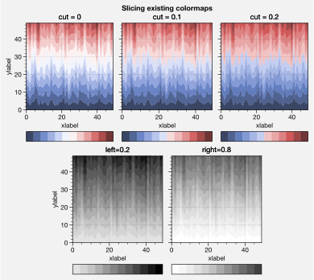

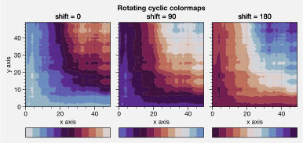

You can also change the “gamma” of any
`~proplot.styletools.PerceptuallyUniformColormap` map on-the-fly. The
“gamma” controls how the luminance and saturation channels vary between
segments of the colormap. A gamma larger than ``1`` emphasizes high
luminance, low saturation colors, and a gamma smaller than ``1``
emphasizes low luminance, high saturation colors. See
`~proplot.styletools.PerceptuallyUniformColormap` for details.

.. code:: ipython3

    import proplot as plot
    import numpy as np
    name = 'boreal'
    # Illustrations
    f, axs = plot.subplots(ncols=3, axcolorbars='r', aspect=1)
    data = np.random.rand(10,10).cumsum(axis=1)
    cmaps = []
    for ax,gamma in zip(axs,(0.8, 1.0, 1.4)):
        cmap = plot.Colormap(name, gamma=gamma)
        cmap.name = f'gamma={gamma}'
        cmaps.append(cmap)
        m = ax.pcolormesh(data, cmap=cmap, levels=10, extend='both')
        ax.colorbar(m, loc='r', locator='none')
        ax.format(title=f'gamma = {gamma}', xlabel='x axis', ylabel='y axis', suptitle='Modifying existing PerceptuallyUniformColormaps')
    # Breakdowns
    f = plot.show_channels(*cmaps, rgb=False)

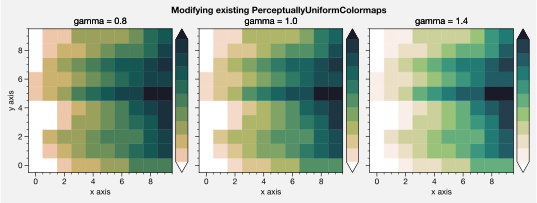

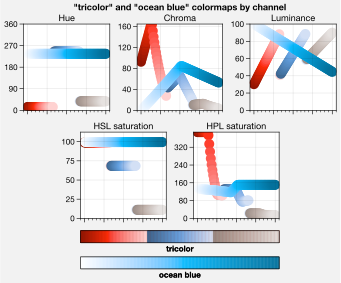

Adding online colormaps
-----------------------

There are plenty of online interactive tools for generating perceptually
uniform colormaps, including
`HCLWizard <http://hclwizard.org:64230/hclwizard/>`__,
`Chroma.js <https://gka.github.io/palettes/#colors=lightyellow,orange,deeppink,darkred%7Csteps=7%7Cbez=1%7CcoL=1>`__,
`SciVisColor <https://sciviscolor.org/home/colormaps/>`__, and `HCL
picker <http://tristen.ca/hcl-picker/#/hlc/12/0.99/C6F67D/0B2026>`__.

To add colormaps downloaded from any of these sources, save the colormap
data to a file in your ``~/.proplot/cmaps`` folder, then call
`~proplot.styletools.register_cmaps`. The file should be named
``name.ext``, where ``name`` is the registered colormap name and ``ext``
is the file extension. See `~proplot.styletools.register_cmaps` for
valid file extensions.

Registered color cycles
-----------------------

Use `~proplot.styletools.show_cycles` to generate a table of the color
cycles registered by default and loaded from your ``~/.proplot/cycles``
folder. You can make your own color cycles using the
`~proplot.styletools.Cycle` constructor function. See
:ref:`Color usage` for more on the differences between colormaps and
color cycles.

.. code:: ipython3

    import proplot as plot
    f = plot.show_cycles()

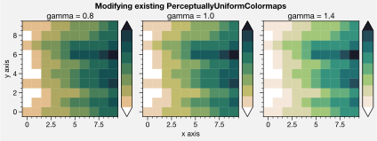

Making your own color cycles
----------------------------

You can make new color cycles with ProPlot’s on-the-fly property cycler
generator `~proplot.styletools.Cycle`. ProPlot lets you specify a
property cycle by passing ``cycle`` to plotting commands like
`~matplotlib.axes.Axes.plot` and `~matplotlib.axes.Axes.scatter`
(see `~proplot.wrappers.cycle_wrapper`), which is passed to
`~proplot.styletools.Cycle`, and `~proplot.styletools.Cycle` keyword
args can be specified with ``cycle_kw``. If you want to save your own
color cycle into the ``~/.proplot/cycles`` folder, simply pass
``save=True`` to `~proplot.styletools.Cycle`. Color cycles in this
folder are loaded every time you import ProPlot. If you want to change
the global property cycler, use the ``plot.rc.cycle`` setting (see the
`~proplot.rctools` documentation).

.. code:: ipython3

    import proplot as plot
    import numpy as np
    data = (np.random.rand(12,12)-0.45).cumsum(axis=0)
    plot.rc.cycle = 'contrast'
    lw = 5
    f, axs = plot.subplots(ncols=3, axwidth=1.7)
    # Here the default cycle is used
    ax = axs[0]
    ax.plot(data, lw=lw)
    # Note that specifying "cycle" does not reset the color cycle
    ax = axs[1]
    ax.plot(data, cycle='qual2', lw=lw)
    ax = axs[2]
    for i in range(data.shape[1]):
        ax.plot(data[:,i], cycle='qual2', lw=lw)
    # Format
    axs.format(suptitle='Local and global color cycles demo')

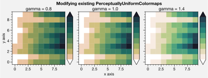

Colormaps or combinations thereof can be used as sources for making
color cycles. Just pass colormap name(s) to the
`~proplot.styletools.Cycle` constructor, with the last positional
argument indicating the number of samples you want to draw. To exclude
near-white colors on the end of a colormap, pass e.g. ``left=x`` to
`~proplot.styletools.Cycle` (or supply a plotting command with e.g.
``cycle_kw={'left':x}``). See `~proplot.styletools.Colormap` for
details.

.. code:: ipython3

    import proplot as plot
    import numpy as np
    f, axs = plot.subplots(ncols=2, colorbars='b', share=0, span=False, axwidth=2.2, aspect=1.5)
    data = (20*np.random.rand(10,21)-10).cumsum(axis=0)
    # Example 1
    ax = axs[0]
    lines = ax.plot(data[:,:5], cycle='purples', cycle_kw={'left':0.3}, lw=5)
    f.bpanel[0].colorbar(lines, values=np.arange(0,len(lines)), label='clabel')
    ax.format(title='Simple cycle')
    # Example 2
    ax = axs[1]
    cycle = plot.Cycle('blues', 'reds', 'oranges', 21, left=[0.1]*3)
    lines = ax.plot(data, cycle=cycle, lw=5)
    f.bpanel[1].colorbar(lines, values=np.arange(0,len(lines)), locator=2, label='clabel')
    ax.format(title='Complex cycle', suptitle='Color cycles from colormaps demo')

.. image:: tutorial/tutorial_126_0.svg

`~proplot.styletools.Cycle` can also generate cyclers that change
properties other than color. Below, a single-color dash style cycler is
constructed and applied to the axes locally. To apply it globally,
simply use ``plot.rc['axes.prop_cycle'] = cycle``.

.. code:: ipython3

    import proplot as plot
    import numpy as np
    import pandas as pd
    f, ax = plot.subplots(axwidth=3, aspect=1.5)
    data = (np.random.rand(20,4)-0.5).cumsum(axis=0)
    data = pd.DataFrame(data, columns=pd.Index(['a','b','c','d'], name='label'))
    ax.format(suptitle='Plot without color cycle')
    cycle = plot.Cycle(dashes=[(1,0.5),(1,1.5),(3,0.5),(3,1.5)])
    obj = ax.plot(data, lw=3, cycle=cycle, legend='ul', legend_kw={'ncols':2, 'handlelength':3})

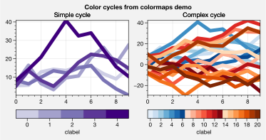

Adding online color cycles
--------------------------

There are plenty of online interactive tools for generating and testing
color cycles, including `i want
hue <http://tools.medialab.sciences-po.fr/iwanthue/index.php>`__,
`coolers <https://coolors.co>`__, and `viz
palette <https://projects.susielu.com/viz-palette>`__.

To add color cycles downloaded from any of these sources, save the cycle
data to a file in your ``~/.proplot/cycles`` folder, then call
`~proplot.styletools.register_cycles`. The file should be named
``name.ext``, where ``name`` is the registered cycle name and ``ext`` is
the file extension. See `~proplot.styletools.register_cmaps` for valid
file extensions.

Registered color names
----------------------

ProPlot defines new color names from the `XKCD “color
survey” <https://blog.xkcd.com/2010/05/03/color-survey-results/>`__,
official `Crayola crayon
colors <https://en.wikipedia.org/wiki/List_of_Crayola_crayon_colors>`__,
and from the `“Open color” <https://github.com/yeun/open-color>`__
Github project. This was inspired by
`seaborn <https://seaborn.pydata.org/tutorial/color_palettes.html>`__.
Use `~proplot.styletools.show_colors` to generate tables of these
colors, as shown below. Note that the native matplotlib `CSS4 named
colors <https://matplotlib.org/examples/color/named_colors.html>`__ are
still registered, but I encourage using colors from the tables instead.

To reduce the number of registered color names to a more manageable
size, XKCD and Crayola colors must have *sufficiently distinct
coordinates* in the HCL perceptually uniform colorspace before they are
added to ProPlot. This makes it a bit easier to pick out colors from a
table generated with `~proplot.styletools.show_colors`. Similar names
were also cleaned up – for example, “reddish” and “reddy” are changed to
“red”.

.. code:: ipython3

    import proplot as plot
    f = plot.show_colors()

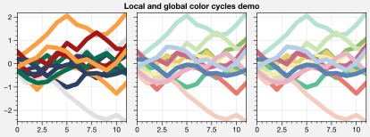

.. image:: tutorial/tutorial_133_1.svg

Individual color sampling
-------------------------

If you want to draw an individual color from a smooth colormap or a
color cycle, use ``color=(cmapname, position)`` or
``color=(cyclename, index)`` with any command that accepts the ``color``
keyword! The ``position`` should be between 0 and 1, while the ``index``
is the index on the list of colors in the cycle. This feature is powered
by the `~proplot.styletools.ColorCacheDict` class.

.. code:: ipython3

    import proplot as plot
    import numpy as np
    plot.rc.reset()
    f, axs = plot.subplots(nrows=2, aspect=2, axwidth=3, axcolorbars='r', share=False)
    # Drawing from colormap
    ax = axs[0]
    cmap = 'deep'
    m = ax.pcolormesh([[0],[1]], cmap=cmap, N=1000)
    idxs = plot.arange(0,1,0.2)
    np.random.shuffle(idxs)
    for idx in idxs:
        h = ax.plot((np.random.rand(20)-0.4).cumsum(), lw=5, color=(cmap, idx),
                    label=f'idx {idx:.1f}', legend='r', legend_kw={'ncols':1})
    ax.colorbar(m, loc='ul', locator=0.2, label='colormap')
    ax.format(title='Drawing from the Solar colormap', grid=True)
    # Drawing from color cycle
    ax = axs[1]
    idxs = np.arange(6)
    np.random.shuffle(idxs)
    for idx in idxs:
        h = ax.plot((np.random.rand(20)-0.4).cumsum(), lw=5, color=('qual1', idx),
                    label=f'idx {idx:.0f}', legend='r', legend_kw={'ncols':1})
    ax.format(title='Drawing from the ggplot color cycle')
    axs.format(xlocator='null', abc=True, abcloc='ul', suptitle='Getting individual colors from colormaps and cycles')

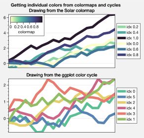

Font selection
--------------

DejaVu Sans is the default matplotlib font, but it’s not very
aesthetically pleasing. ProPlot adds a bunch of sans-serif fonts so that
you have them on every workstation, introduces a
`~proplot.styletools.show_fonts` command to display them (see below),
and makes Helvetica the default, as in MATLAB. Generally speaking,
simple, clean sans-serif fonts are more appropriate for figures than
serif fonts.

You can register your own fonts by adding ``.ttf`` and ``.otf`` files to
the ``~/.proplot/fonts`` directory and calling
`~proplot.styletools.register_fonts` (which is also called on import).
To change the default font, use the `~proplot.rctools.rc` object or
modify your ``~/.proplotrc``. See the `~proplot.styletools` and
`~proplot.rctools` documentation for more info.

.. code:: ipython3

    import proplot as plot
    plot.rc.reset()
    f = plot.show_fonts()

.. image:: tutorial/tutorial_139_0.svg

