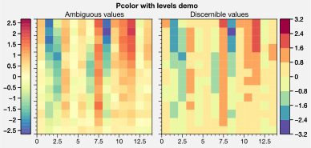
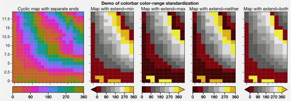
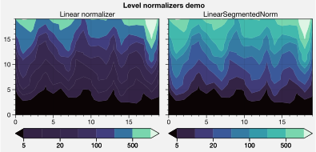
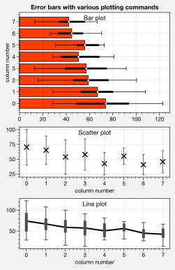
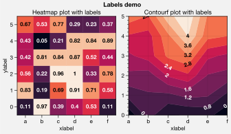
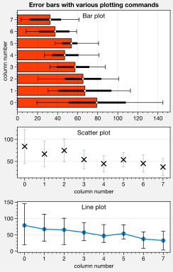
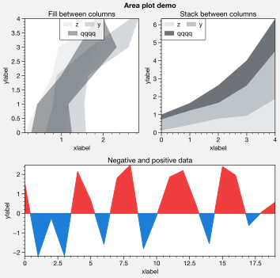
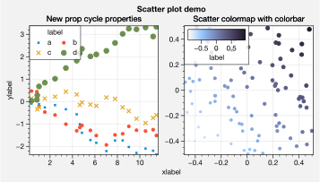
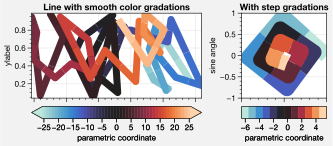
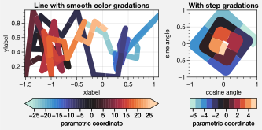

Plotting wrappers
=================

New features have been added to various matplotlib plotting commands
thanks to a set of wrapper functions. These features are a strict
*superset* of the existing matplotlib API – if you want, you can use
plotting commands exactly as you always have. For details, see the
`~proplot.axes` documentation.

Standardized input
------------------

The `~proplot.wrappers.standardize_1d` and
`~proplot.wrappers.standardize_2d` functions are used to standardize
the input of a bunch of different plotting functions. See the
documentation for details.

`~proplot.wrappers.standardize_1d` allows you to optionally omit *x*
coordinates (in which case they are inferred from the *y* coordinates)
or pass 2D *y* coordinate arrays (in which case the plotting method is
called with each column of the array).

`~proplot.wrappers.standardize_2d` allows you to optionally omit *x*
and *y* coordinates (in which case they are inffered from the data
array), guesses graticule edges for ``pcolor`` and ``pcolormesh`` plots,
and optionally enforces global data coverage when plotting in
:ref:`Projection axes`.

Colormaps and cycles
--------------------

The `~proplot.wrappers.cmap_wrapper` and
`~proplot.wrappers.cycle_wrapper` wrappers can be used to create and
apply new colormaps and property cyclers on-the-fly. See
:ref:`Making your own colormaps` and
:ref:`Making your own color cycles` for details.
`~proplot.wrappers.cmap_wrapper` also implements several other useful
features, documented in the next three sections.

Standardized levels
-------------------

`~proplot.wrappers.cmap_wrapper` assigns the
`~proplot.styletools.BinNorm` “meta-normalizer” as the data normalizer
for all plotting commands involving colormaps. This permits discrete
``levels`` even for commands like `~matplotlib.axes.Axes.pcolor` and
`~matplotlib.axes.Axes.pcolormesh`. `~proplot.styletools.BinNorm`
also ensures that colorbar colors span the entire colormap range,
independent of the ``extend`` setting, and that color levels on the ends
of colorbars for “cyclic” colormaps are distinct.

.. code:: ipython3

    import proplot as plot
    import numpy as np
    f, axs = plot.subplots(ncols=2, axwidth=2)
    cmap = 'spectral'
    data = (np.random.rand(15,15)-0.5).cumsum(axis=0)
    axs.format(suptitle='Pcolor with levels demo')
    ax = axs[0]
    ax.pcolor(data, cmap=cmap, N=200, symmetric=True, colorbar='l', colorbar_kw={'locator':0.5})
    ax.format(title='Ambiguous values', yformatter='null')
    ax = axs[1]
    ax.pcolor(data, cmap=cmap, N=8, symmetric=True, colorbar='r')
    ax.format(title='Discernible values')

.. code:: ipython3

    import proplot as plot
    import numpy as np
    f, axs = plot.subplots(ncols=5, axwidth=2, ref=1, wratios=(5,3,3,3,3))
    axs.format(suptitle='Demo of colorbar color-range standardization')
    levels = plot.arange(0,360,45)
    data = (20*(np.random.rand(20,20) - 0.4).cumsum(axis=0).cumsum(axis=1)) % 360
    ax = axs[0]
    ax.pcolormesh(data, levels=levels, cmap='phase', extend='neither', colorbar='b')
    ax.format(title='Cyclic map with separate ends')
    for ax,extend in zip(axs[1:], ('min','max','neither','both')):
        ax.pcolormesh(data[:,:10], levels=levels, cmap='oxy', extend=extend, colorbar='b', colorbar_kw={'locator':90})
        ax.format(title=f'Map with extend={extend}')

New normalizers
---------------

If you pass unevenly spaced ``levels``, the
`~proplot.styletools.LinearSegmentedNorm` normalizer is applied by
default. This results in even color gradations across *indices* of the
level list, no matter their spacing. To use an arbitrary colormap
normalizer, just pass ``norm`` and optionally ``norm_kw`` to a command
wrapped by `~proplot.wrappers.cmap_wrapper`. These arguments are
passed to the `~proplot.styletools.Norm` constructor.

.. code:: ipython3

    import proplot as plot
    import numpy as np
    f, axs = plot.subplots(ncols=2, axwidth=2.5, aspect=1.5)
    data = 10**(2*np.random.rand(20,20).cumsum(axis=0)/7)
    ticks = [5, 10, 20, 50, 100, 200, 500, 1000]
    for i,(norm,title) in enumerate(zip(('linear','segments'),('Linear normalizer','LinearSegmentedNorm'))):
        m = axs[i].contourf(data, levels=ticks, extend='both', cmap='Mako', norm=norm, colorbar='b')
        axs[i].format(title=title)
    axs.format(suptitle='Level normalizers demo')

Finally, there is a new `~proplot.styletools.MidpointNorm` class that
warps your colormap so that its midpoint lies on some central data
value, no matter the minimum and maximum colormap colors. Again, to use
an arbitrary colormap normalizer, just pass ``norm`` and optionally
``norm_kw`` to a command wrapped by `~proplot.wrappers.cmap_wrapper`.
These arguments are passed to the `~proplot.styletools.Norm`
constructor.

.. code:: ipython3

    import proplot as plot
    import numpy as np
    data1 = (np.random.rand(20,20) - 0.43).cumsum(axis=0)
    data2 = (np.random.rand(20,20) - 0.57).cumsum(axis=0)
    f, axs = plot.subplots(ncols=2, axwidth=2.5, aspect=1.5)
    cmap = plot.Colormap('Moisture', cut=0.1)
    axs.format(suptitle='Midpoint normalizer demo')
    axs[0].contourf(data1, norm='midpoint', cmap=cmap, colorbar='b')
    axs[0].format(title='Skewed positive data')
    axs[1].contourf(data2, norm='midpoint', cmap=cmap, colorbar='b')
    axs[1].format(title='Skewed negative data')

Labeled contours and boxes
--------------------------

Thanks to `~proplot.wrappers.cmap_wrapper`, you can now add labels to
`~proplot.axes.Axes.heatmap`, `~matplotlib.axes.Axes.pcolor`,
`~matplotlib.axes.Axes.pcolormesh`, `~matplotlib.axes.Axes.contour`,
and `~matplotlib.axes.Axes.contourf` plots by simply passing
``labels=True``. ProPlot draws contour labels with
`~matplotlib.axes.Axes.clabel` or grid box labels with
`~matplotlib.axes.Axes.text`. Label colors are automatically chosen b
ased on the luminance of the underlying box or contour color. The label
text objects can be changed with the ``labels_kw`` dictionary keyword
arg and the ``precision`` keyword arg. See
`~proplot.wrappers.cmap_wrapper` for details.

.. code:: ipython3

    import proplot as plot
    import pandas as pd
    import numpy as np
    # Heatmap with labels
    f, axs = plot.subplots([[1,1,2,2],[0,3,3,0]], axwidth=2, share=1, span=False)
    data = np.random.rand(6,6)
    data = pd.DataFrame(data, index=pd.Index(['a','b','c','d','e','f']))
    axs.format(xlabel='xlabel', ylabel='ylabel', suptitle='Labels demo')
    ax = axs[0]
    m = ax.heatmap(data, cmap='rocket', labels=True, precision=2, labels_kw={'weight':'bold'})
    ax.format(title='Heatmap plot with labels')
    # Filled contours with labels
    ax = axs[1]
    m = ax.contourf(data.cumsum(axis=0), labels=True, cmap='rocket', labels_kw={'weight':'bold'})
    ax.format(title='Filled contour plot with labels')
    # Simple contour plot
    ax = axs[2]
    ax.contour(data.cumsum(axis=1) - 2, color='gray8', labels=True, lw=2, labels_kw={'weight':'bold'})
    ax.format(title='Contour plot with labels')

.. image:: tutorial/tutorial_158_0.svg

Heatmap plots
-------------

The new `~proplot.axes.Axes.heatmap` command calls
`~matplotlib.axes.Axes.pcolormesh` and applies default formatting that
is suitable for heatmaps – that is, no gridlines, no minor ticks, and
major ticks at the center of each box. Among other things, this is
useful for displaying covariance matrices. See the below example.

.. code:: ipython3

    import proplot as plot
    import numpy as np
    import pandas as pd
    f, ax = plot.subplots(axwidth=4)
    data = np.random.normal(size=(10,10)).cumsum(axis=0)
    data = (data - data.mean(axis=0)) / data.std(axis=0)
    data = (data.T @ data) / data.shape[0]
    data[np.tril_indices(data.shape[0], -1)] = np.nan # empty boxes
    data = pd.DataFrame(data, columns=list('abcdefghij'), index=list('abcdefghij'))
    m = ax.heatmap(data, cmap='ColdHot', vmin=-1, vmax=1, N=100, labels=True, labels_kw={'weight':'bold'})
    ax.format(suptitle='Heatmap demo', title='Pseudo covariance matrix', alpha=0, linewidth=0,
              xloc='top', yloc='right', yreverse=True, ticklabelweight='bold')

Fast error bars
---------------

Thanks to the `~proplot.wrappers.add_errorbars` wrapper, you can now
add error bars when using the `~matplotlib.axes.Axes.plot`,
`~matplotlib.axes.Axes.scatter`, `~matplotlib.axes.Axes.bar`,
`~matplotlib.axes.Axes.barh`, and `~matplotlib.axes.Axes.violinplot`
methods. If you pass 2D arrays of data to these commands with
``means=True`` or ``medians=True``, the *means or medians* of each
column are drawn as points, lines, or bars, and error bars represent the
*spread* in each column. You can draw both thin “bars” with optional
whiskers, and thick “boxes” overlayed on top of these bars. You can also
pass error bar coordinates manually with the ``bardata`` and ``boxdata``
keyword args. See `~proplot.wrappers.add_errorbars` for details.

.. code:: ipython3

    import proplot as plot
    import numpy as np
    import pandas as pd
    plot.rc['title.loc'] = 'uc'
    plot.rc['axes.ymargin'] = plot.rc['axes.xmargin'] = 0.05
    data = np.random.rand(20,8).cumsum(axis=0).cumsum(axis=1)[:,::-1] + 20*np.random.normal(size=(20,8)) + 30
    f, axs = plot.subplots(nrows=3, aspect=1.5, axwidth=3, share=0, hratios=(2,1,1))
    axs.format(suptitle='Error bars with various plotting commands')
    # Asking add_errorbars to calculate bars
    ax = axs[0]
    obj = ax.barh(data, color='red orange', means=True)
    ax.format(title='Column statistics')
    # Showing a standard deviation range instead of percentile range
    ax = axs[1]
    ax.scatter(data, color='k', marker='x', markersize=50, barcolor='gray5',
               medians=True, barstd=True, barrange=(-1,1), barzorder=0, boxes=False, capsize=2)
    # Supplying error bar data manually
    ax = axs[2]
    boxdata = np.percentile(data, (25,75), axis=0)
    bardata = np.percentile(data, (5,95), axis=0)
    ax.plot(data.mean(axis=0), boxes=False, marker='o', markersize=5,
            edgecolor='k', color='cerulean', boxdata=boxdata, bardata=bardata)
    # Formatting
    axs[0].format(ylabel='column number', title='Bar plot', ygrid=False)
    axs[1].format(title='Scatter plot')
    axs[2].format(title='Line plot')
    axs[1:].format(xlabel='column number', xticks=1, xgrid=False)

Bar plots and area plots
------------------------

`~proplot.wrappers.bar_wrapper` and
`~proplot.wrappers.cycle_wrapper` make it easier to generate useful
bar plots. You can now pass 2D arrays to `~matplotlib.axes.Axes.bar`
or `~matplotlib.axes.Axes.barh`, and columns of data will be *grouped*
or *stacked* together. And if *x* coordinates are not provided, default
coordinates are applied, just like with `~matplotlib.axes.Axes.plot`.
See `~proplot.wrappers.bar_wrapper` for details.

.. code:: ipython3

    import proplot as plot
    import numpy as np
    import pandas as pd
    plot.rc.titleloc = 'uc'
    plot.rc.margin = 0.05
    f, axs = plot.subplots(nrows=2, aspect=2, axwidth=3.5, share=0, hratios=(3,2))
    data = np.random.rand(5,5).cumsum(axis=0).cumsum(axis=1)[:,::-1]
    data = pd.DataFrame(data, columns=pd.Index(np.arange(1,6), name='column'), index=pd.Index(['a','b','c','d','e'], name='row idx'))
    ax = axs[0]
    obj = ax.bar(data, cycle='Reds', colorbar='ul', edgecolor='red9', colorbar_kw={'frameon':False})
    ax.format(xlocator=1, xminorlocator=0.5, ytickminor=False, title='Side-by-side', suptitle='Bar plot wrapper demo')
    ax = axs[1]
    obj = ax.barh(data.iloc[::-1,:], cycle='Blues', legend='ur', edgecolor='blue9', stacked=True)
    ax.format(title='Stacked')
    axs.format(grid=False)

To make area plots, use the convenient ``fill_between`` aliases
`~proplot.axes.Axes.area` and `~proplot.axes.Axes.areax`. These are
wrapped with `~proplot.wrappers.fill_between_wrapper` and
`~proplot.wrappers.fill_betweenx_wrapper`.

The ``fill_between`` wrappers enable “stacking” successive columns of a
2D input array like in `pandas`. They also add a new “``negpos``”
keyword for creating area plots that change color when the fill
boundaries cross each other. The most common use case for this is
highlighting negative and positive area underneath a line, as shown
below.

.. code:: ipython3

    import proplot as plot
    import numpy as np
    plot.rc.reset()
    plot.rc.margin = 0
    f, axs = plot.subplots(array=[[1,2],[3,3]], hratios=(1,0.8), share=0)
    axs.format(xlabel='xlabel', ylabel='ylabel', suptitle='Area plot demo')
    data = np.random.rand(5,3).cumsum(axis=0)
    cycle = ('gray3', 'gray5', 'gray7')
    ax = axs[0]
    ax.areax(np.arange(5), data, data + np.random.rand(5)[:,None], cycle=cycle, alpha=0.5,
            legend='uc', legend_kw={'center':True, 'ncols':2, 'labels':['z','y','qqqq']},
            )
    ax.format(title='Fill between columns')
    ax = axs[1]
    ax.area(np.arange(5), data, stacked=True, cycle=cycle, alpha=0.8,
            legend='ul', legend_kw={'center':True, 'ncols':2, 'labels':['z','y','qqqq']},
            )
    ax.format(title='Stack between columns')
    ax = axs[2]
    data = 5*(np.random.rand(20)-0.5)
    ax.area(data, negpos=True, negcolor='blue7', poscolor='red7')
    ax.format(title='Negative and positive data', xlabel='xlabel', ylabel='ylabel')
    axs.format(grid=False)

Box plots and violin plots
--------------------------

`~matplotlib.axes.Axes.boxplot` and
`~matplotlib.axes.Axes.violinplot` are now wrapped with
`~proplot.wrappers.boxplot_wrapper`,
`~proplot.wrappers.violinplot_wrapper`, and
`~proplot.wrappers.cycle_wrapper`, making it much easier to plot
distributions of data with aesthetically pleasing default settings and
automatic axis labeling.

.. code:: ipython3

    import proplot as plot
    import numpy as np
    import pandas as pd
    N = 500
    f, axs = plot.subplots(ncols=2)
    data = np.random.normal(size=(N,5)) + 2*(np.random.rand(N,5)-0.5)*np.arange(5)
    data = pd.DataFrame(data, columns=pd.Index(['a','b','c','d','e'], name='xlabel'))
    ax = axs[0]
    obj1 = ax.boxplot(data, lw=0.7, marker='x', fillcolor='gray5', medianlw=1, mediancolor='k')#, boxprops={'color':'C0'})#, labels=data.columns)
    ax.format(title='Box plots', titleloc='uc')
    ax = axs[1]
    obj2 = ax.violinplot(data, lw=0.7, fillcolor='gray7', points=500, bw_method=0.3, means=True)
    ax.format(title='Violin plots', titleloc='uc')
    axs.format(ymargin=0.1, xmargin=0.1, grid=False, suptitle='Boxes and violins demo')

Parametric plots
----------------

`~matplotlib.axes.Axes.plot` now accepts a ``cmap`` keyword – this
lets you draw line collections that map individual segments of the line
to individual colors. This can be useful for drawing “parametric” plots,
where you want to indicate the time or some other coordinate at each
point on the line. See `~proplot.axes.Axes.cmapline` for details.

.. code:: ipython3

    import proplot as plot
    import numpy as np
    plot.rc.reset()
    N = 50
    cmap = 'IceFire'
    values = np.linspace(-N/2, N/2, N)
    f, axs = plot.subplots(share=0, ncols=2, wratios=(2,1), axwidth='6cm', aspect=(2,1))
    ax = axs[0]
    m = ax.plot((np.random.rand(N)-0.5).cumsum(), np.random.rand(N), cmap=cmap, values=values, lw=7, extend='both')
    ax.format(xlabel='xlabel', ylabel='ylabel', title='Line with smooth color gradations', titleweight='bold')
    ax.colorbar(m, loc='b', label='parametric coordinate', locator=5)
    N = 12
    ax = axs[1]
    values = np.linspace(-N/2, N/2 - 1, N)
    radii = np.linspace(1,0.2,N)
    angles = np.linspace(0,4*np.pi,N)
    x = radii*np.cos(1.4*angles)
    y = radii*np.sin(1.4*angles)
    m = ax.plot(x, y, values=values, linewidth=15, interp=False, cmap=cmap)
    ax.format(xlim=(-1,1), ylim=(-1,1), title='With step gradations', titleweight='bold', xlabel='cosine angle', ylabel='sine angle')
    ax.colorbar(m, loc='b', maxn=10, label=f'parametric coordinate')

Misc enhancements
-----------------

Thanks to `~proplot.wrappers.scatter_wrapper` and
`~proplot.wrappers.cycle_wrapper`, `~matplotlib.axes.Axes.scatter`
now accepts 2D arrays, just like `~matplotlib.axes.Axes.plot`, and
successive calls to `~matplotlib.axes.Axes.scatter` can apply property
cycle keys other than ``color`` – for example, ``marker`` and
``markersize``. `~matplotlib.axes.Axes.scatter` also now optionally
accepts keywords that look like the `~matplotlib.axes.Axes.plot`
keywords, which is a bit less confusing. You can also pass colormaps to
`~matplotlib.axes.Axes.scatter` just as with matplotlib.

I am also considering supporting 2D array input and property cycle
iteration for more obscure matplotlib plotting commands like
`~matplotlib.axes.Axes.stem`, `~matplotlib.axes.Axes.step`,
`~matplotlib.axes.Axes.vlines`, and `~matplotlib.axes.Axes.hlines`.
Stay tuned!

.. code:: ipython3

    import proplot as plot
    import numpy as np
    import pandas as pd
    plot.rc.reset()
    f, axs = plot.subplots(ncols=2, share=1)
    x = (np.random.rand(20)-0).cumsum()
    data = (np.random.rand(20,4)-0.5).cumsum(axis=0)
    data = pd.DataFrame(data, columns=pd.Index(['a','b','c','d'], name='label'))
    # Scatter demo
    ax = axs[0]
    ax.format(title='Extra prop cycle properties', suptitle='Scatter plot demo')
    obj = ax.scatter(x, data, legend='ul', cycle='warm', legend_kw={'ncols':2},
                    cycle_kw={'marker':['x','o','x','o'], 'markersize':[5,10,20,30]})
    ax = axs[1]
    ax.format(title='Scatter plot with cmap')
    data = (np.random.rand(2,100)-0.5)
    obj = ax.scatter(*data, color=data.sum(axis=0), size=np.random.rand(100), smin=3, smax=30,
                     marker='o', cmap='dusk', colorbar='lr', colorbar_kw={'locator':0.5, 'label':'label'})
    axs.format(xlabel='xlabel', ylabel='ylabel')

.. image:: tutorial/tutorial_178_0.svg
